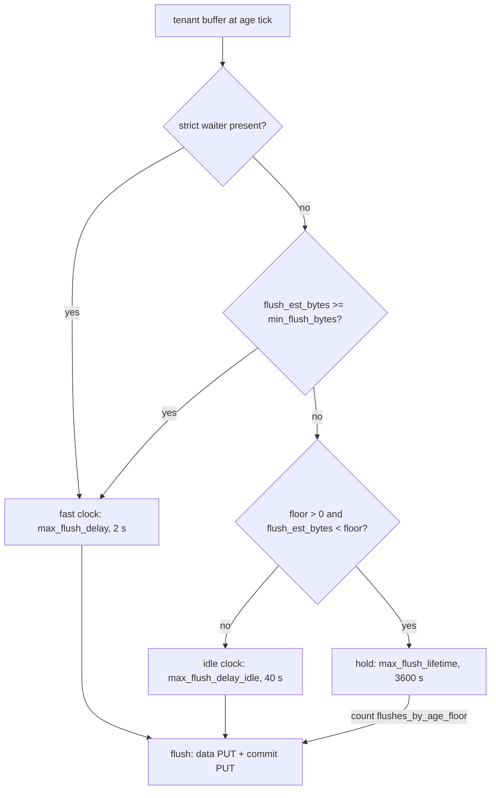

# ADR-1737: Idle flush byte floor and the buffered-mode durability window

Status: Accepted (2026-09-16). Issue #1737. Amends ADR-0051 section 7 (the
idle-aware age trigger gains an opt-in third tier) and ADR-0076 decision 4
(the flush-cadence set gains one knob that defaults to off).

## Context

`ShardActor::age_threshold_ns` (crates/ravel-ingest/src/shard.rs:1211-1231)
picks one of two age clocks for a tenant buffer. A buffer with a strict-mode
waiter, or with at least `min_flush_bytes` of estimated object bytes, flushes
on the fast clock, `max_flush_delay`. Every other buffer is idle and flushes
on `max_flush_delay_idle`. The log and span actors carry the same predicate
(crates/ravel-ingest/src/log_shard.rs:1302-1309,
crates/ravel-ingest/src/span_shard.rs:21). The defaults are 2 seconds, 40
seconds and 256 KiB (crates/ravel-ingest/src/config.rs:413-421), and
`max_flush_lifetime` is 3600 seconds (config.rs:425).

Every flush writes two objects, a data object and a commit record. A buffer
that holds one row still flushes every 40 seconds, so flush count per day
has three bands: 43,200 per buffer on the fast clock, `86,400 * bytes_per_s /
262,144` in the middle band where the shard and replica counts cancel, and
2,160 per buffer on the idle clock at any data volume down to one row. The
cost-model guide states one threshold and no bands
(docs/guides/cost-model.md:34); T7f corrects that text for today's behavior.
The expensive shape is many near-empty tenants across many replicas: 120
buffers at near-zero volume write 518,400 PUTs a day, and 500 such tenants
across 50 replicas write 1.3 billion.

Holding a near-empty buffer longer is a durability decision, not a tuning
knob. docs/consistency-model.md:44-50 states the buffered-mode contract: a
write is acknowledged at enqueue, and a crash between ack and flush loses
the buffered window, which `max_flush_delay` bounds. Today that window is at
most 40 seconds for an idle buffer. Three other bounds are derived from it:

- Worst-case resident memory term 1 is the `--max-ingest-buffer-bytes`
  ceiling over every buffer and in-flight flush (docs/ingest.md:801-812).
  It bounds the sum, not how long any one buffer sits.
- The graceful shutdown drain flushes every buffer, bounded by
  `--shutdown-timeout` (25 seconds by default,
  services/ravel-server/src/config.rs:1437-1450). Residue past the bound is
  counted as a durability defect (docs/ingest.md:236-244).
- ADR-0052's straggler slack is derived from the worst buffer age before a
  flush opens: `FLUSH_BOUND_SLACK_HOURS = ceil(max_flush_delay_idle +
  max_flush_lifetime) = 2` (crates/ravel-catalog/src/provisioning.rs:419-434),
  and that comment asks to be revisited in lockstep with any change to the
  flush bounds.

`max_flush_lifetime` is the abandonment budget of a flush, measured from
permit grant (shard.rs:1655-1662), and is not operator-tunable from the
server (consistency-model.md:63-64). It is also the one duration the slack
derivation already includes, which is why it is the natural ceiling for a
hold.

## Decision

1. **A new knob, `idle_flush_byte_floor`, default 0.** `IngestConfig` gains
   the field, `ravel-server` exposes it as `--idle-flush-byte-floor` in
   bytes, and the shipped default is 0, which means disabled. With the
   default every shard actor behaves exactly as today; the buffered-mode
   window stays 40 seconds. A non-zero value must be below
   `min_flush_bytes`, and the server refuses startup otherwise.

2. **Below the floor, a buffer waits for `max_flush_lifetime`.** With a
   non-zero floor, `age_threshold_ns` in all three actors has three tiers
   for a buffer with no strict-mode waiter: estimated object bytes at or
   above `min_flush_bytes` use the fast clock; bytes at or above the floor
   and below `min_flush_bytes` use `max_flush_delay_idle`; bytes below the
   floor use `max_flush_lifetime`. The floor is read against
   `flush_est_bytes`, the object-bytes estimate, like `min_flush_bytes`
   (issue #1305). A buffer crosses tiers upward as rows arrive, so a trickle
   that reaches the floor flushes 40 seconds after its oldest row rather
   than an hour after it.

3. **The hold ceiling is `max_flush_lifetime`, and it is not a separate
   knob.** With the ceiling equal to the lifetime, the worst age of a buffer
   at flush open is one hour and the ADR-0052 derivation reads
   `ceil(max_flush_lifetime + max_flush_lifetime) = 2`, so
   `FLUSH_BOUND_SLACK_HOURS` stays at 2. The bucket is pinned at flush open,
   so the distance between routing and the record's ingest hour is at most
   the hold. A larger ceiling leaves the bounds the slack was derived from,
   which is why one is not offered.

4. **Strict mode and the drains are unchanged.** A strict waiter keeps the
   fast clock, so acknowledged-write latency does not move. `FlushNow`,
   `Shutdown` and channel close flush every buffer regardless of size or
   age, as today.

5. **The buffered-mode durability window is stated per tier.** With a
   non-zero floor, an acknowledged buffered row in a buffer below the floor
   may sit in process memory for up to `max_flush_lifetime` before its
   flush opens, plus the flush's own time. docs/consistency-model.md states
   this beside the 40-second figure, conditioned on the flag, and the flag's
   help text states it too. An operator who sets the floor chooses a
   one-hour buffered-mode loss window for tenants below it.

6. **A flush that opened at the lifetime ceiling is counted separately.**
   `flushes_by_age_floor` joins `flushes_by_age` and
   `flushes_by_age_adaptive` on all three pipelines and renders in the
   `/metrics` ingest family, so an operator can see the floor holding
   buffers and can size the loss window they accepted.

## Rejected alternatives

- **Enable the floor by default.** It changes the buffered-mode loss window
  for every deployment that never asked, and that window is a published
  contract in docs/consistency-model.md. A default that widens a durability
  window must be chosen by the operator who accepts it.
- **Raise `max_flush_delay_idle` instead of adding a floor.** The idle clock
  applies to every buffer below `min_flush_bytes`, including buffers that
  hold a real fraction of an object at moderate rates. A longer idle clock
  widens the window for all of them to save PUTs on the near-empty few.
- **A separate hold-ceiling knob.** Every value of a second knob must be
  re-derived against `FLUSH_BOUND_SLACK_HOURS`. `max_flush_lifetime` is
  already inside that derivation and already bounds how long a flush may
  take, so reusing it adds no new bound to keep in lockstep.
- **Flush buffered mode on the lifetime only, with no idle clock.** Every
  buffered tenant, not only near-empty ones, would take a one-hour window.
- **Combine several tenants' near-empty buffers into one object.** A data
  object is one tenant's under one tenant-prefixed key, and the commit
  record identity is per tenant, shard, writer, epoch and sequence. That is
  a frozen-format change for a saving the floor achieves without one.

## Consequences

- The default behavior is unchanged. `IngestConfig::default` gains a zero
  field, the exact-value asserts in config.rs:554-561 gain one line, and no
  existing deterministic age-flush case moves.
- With the floor set, flush count per day for a buffer below the floor
  drops from 2,160 to 24, which is 48 PUTs instead of 4,320, and the
  cost-model guide gains a fourth band with the floor as its boundary. The saving is largest exactly where the ticket
  measured it: many near-empty tenants across many replicas.
- With the floor set, the buffered-mode loss window for a buffer below the
  floor is up to one hour plus flush time. Worst-case resident memory term 1
  does not change its ceiling, because the byte budget still bounds the
  sum; steady-state occupancy rises by up to the floor per held buffer.
  The per-buffer memory backstop (config.rs:232-242) is far above any legal
  floor and is unaffected.
- The shutdown drain's PUT count does not change: each buffer with data is
  one flush whether it is 40 seconds or an hour old. What changes is the
  residue on a drain that hits `--shutdown-timeout`: it can now hold up to
  an hour of a near-empty tenant's rows instead of 40 seconds' worth. The
  flag's help text says so, and `flush_all_residue_tenants` remains the
  counter that reports it.
- Interaction with ADR-1685: a held buffer stamps its ingest hour at flush
  open, so a one-hour hold lands rows in a later hour than their arrival.
  Discovery is by ingest hour with event-time bounds riding along
  (docs/consistency-model.md:239-241), and the listing window is anchored on
  query time, so the hold does not change which queries find the rows.
- Interaction with issue #1740: both changes edit `age_threshold_ns` and the
  trigger path in the same three actors. Whichever lands second rebases on
  the first; neither changes the other's decision.
- `FLUSH_BOUND_SLACK_HOURS` keeps its value, and its derivation comment is
  rewritten to name the hold ceiling as the worst buffer age
  (crates/ravel-catalog/src/provisioning.rs:419-434). That edit is in
  ravel-catalog and is listed as its own task so it is not skipped as out
  of scope.
- Follow-up work, as tasks:
  1. ravel-ingest: the field, the validation, the three-tier predicate in
     all three actors, the `flushes_by_age_floor` counter, and the
     deterministic cases the ticket names in
     crates/ravel-ingest/tests/deterministic_age_flush.rs: exact flush
     counts over one injected-clock hour at three rates, with the floor off
     (90 today in the idle band) and on (24 below the floor).
  2. ravel-server: the `--idle-flush-byte-floor` flag with the loss-window
     sentence in its help text, the counter in the `/metrics` ingest family,
     and docs/reference/ravel-server-flags.md.
  3. ravel-catalog: the `FLUSH_BOUND_SLACK_HOURS` derivation comment.
  4. docs: docs/consistency-model.md buffered-mode bullet, docs/ingest.md
     flush-cadence and shutdown-drain text, docs/guides/cost-model.md fourth
     band on top of T7f's three.
