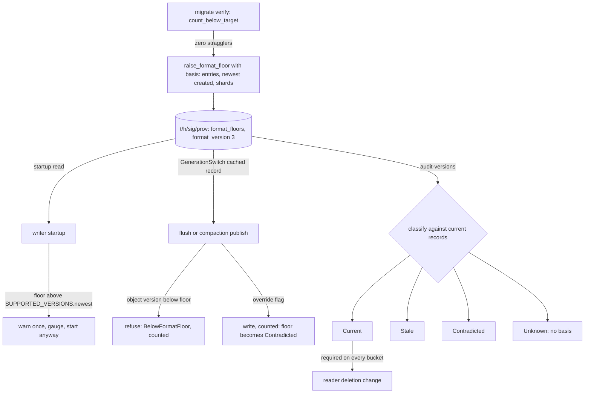

# ADR-1746: format floor evidence, and a writer that warns at startup and refuses in the write path

Status: Accepted (2026-09-16). Amends ADR-0066 decision 3. Issue #1746.
Migration class C (additive protobuf fields on a CAS-mutable sys/* record),
under the ADR-0066 R1 rule: a `format_version` bump, readers before writers.

## Context

ADR-0066 decision 3 records format floors in the provisioning record: "A
recorded floor F for family X asserts that no live object of family X below
version F exists for this (tenant, signal)". `FormatFloor` carries `family`,
`floor_version`, `raised_unix_ns` and `raised_by`
(`crates/ravel-catalog/src/provisioning.rs:1630-1641`,
`proto/ravel/sys.proto:201-206`), appended under CAS by `raise_format_floor`
(`provisioning.rs:1806-1912`) on the same `t/<hash>/<sig>/prov` record that
holds the shard generations (`provisioning.rs:1605-1616`). The load-bearing
consumer is release engineering: "deleting a format version's read support is
legal only when every bucket's floor for that family exceeds the retired
version" (`sys.proto:139-147`).

The assertion is present tense and nothing holds it after the raise:

- The only reader of a recorded floor is the raise itself.
  `current_floor_from_store` is called from `migrate_family`'s verify step
  (`crates/ravel-maintain/src/migrate.rs:872-874`) and nowhere else in
  production code. No ingest, compaction, rewrite or query path reads a floor
  before it writes an object, and `services/ravel-server/src` only ever
  constructs `format_floors: Vec::new()` (`provisioning.rs:274`, `:395`, `:478`).
- The re-audit that justifies a raise runs once, inside the raise
  (`migrate.rs:855-866`). `ravel-cli maintain audit-versions`
  (`services/ravel-cli/src/maintain.rs:1088-1199`) histograms versions from
  commit records, compaction parts and rewrite parts, flags anything outside
  the reader window, and neither reads nor reports a floor. It is manual and
  on no schedule.
- A floor records when it was raised, not what it saw. Nothing in the record
  says how many records the audit enumerated, how many shards it scanned, or
  the newest `created_unix_ns` it covered, so a later reader cannot tell
  whether any record has landed since.

The failure this permits is a rollback. A release bumps RSEG to N+1, an
operator runs `migrate`, floors rise to N+1. The N+1 binary is rolled back for
an unrelated regression and the N binary resumes ingest, writing N objects
into buckets whose floors say N+1. Nothing refuses. A later release deletes
the N reader because the floors say it may. Every query over those hours then
fails: the commit records name objects no reader can open. ADR-0531's rollback
stance makes the same point from the other side: the first write at a new
version is "the irreversible step".

Two shapes already exist for what a writer does with a durable version fact.
The tenancy marker pins the tenant-hash scheme per bucket and "a process whose
build disagrees refuses to start" (ADR-0050 §3, ADR-0066 Class D); the
qualification record is enforced once at startup, before any listener binds
(`services/ravel-server/src/main.rs:101-115`). Those are identity facts: a
disagreeing process can do nothing useful. A floor is a write-path fact: a
process whose newest writable version sits below a floor can still serve
queries, run retention, and fold, and under ADR-0066's #530 amendment it is the
process that must keep running to hold out-of-window objects rather than
delete them. Refusing startup on a floor would brick exactly the rollback the
floor exists to make safe.

The floor lives on `ProvisioningRecord`, which the R1 amendment classifies as
CAS-mutable: `append_generation` and `raise_format_floor` read the record,
re-encode it through the fields this build knows, and CAS-write it back, and
"a CAS-mutable sys/* record bumps `format_version` on every additive change,
sequenced readers-before-writers". `GenerationSwitch` reads this record on
the ingest hot path and fails a flush closed on a read failure
(`crates/ravel-ingest/src/generation.rs:20-30`), which is why R1 and R2 split
the last bump across two releases. Adding fields to `FormatFloor` is such a
change, and this ADR follows the same rule.

## Decision

1. **A floor records its observation basis.** `FormatFloor` gains three
   additive fields, numbers 5 to 7 on the frozen message:

   ```
   uint64   observed_entries = 5;              // commit-family entries the raising audit enumerated
   sfixed64 observed_newest_created_unix_ns = 6; // newest created_unix_ns among them
   uint32   observed_shards = 7;               // shard range the audit scanned
   ```

   `migrate_family`'s verify step fills them from the same `count_below_target`
   enumeration that justified the raise (`migrate.rs:857-859`), so the basis
   is the audit, not a later estimate. A floor from an earlier build carries
   zeros, which decode as "basis unknown".

2. **A stored floor is a pointer to evidence, never the evidence.** Any
   consumer that would act on a floor first classifies it against current
   records into one of four states, and only `Current` counts:

   - `Current`: the audit enumerated no commit-family record with
     `created_unix_ns` above the basis, the shard range equals the recorded
     `observed_shards`, and no live record sits below the floor.
   - `Stale`: records newer than the basis exist, or the shard range has
     grown, and none of them sits below the floor. The floor is not known to
     be false, and it is not evidence either.
   - `Contradicted`: a live record below the floor exists. The floor is false.
   - `Unknown`: the floor predates this ADR and carries no basis.

   `ravel-cli maintain audit-versions` reports the classification for every
   recorded floor of the tenant and signal beside its histogram, and exits
   nonzero on `Contradicted`. The reader-deletion step ADR-0066 decision 1
   describes re-runs `audit-versions` and requires `Current` on every bucket;
   it never reads a stored floor on its own.

3. **Startup warns.** At startup, for every tenant the process knows at
   startup, each writer role reads the provisioning record it already reads
   for shard generations and compares each family's recorded floor with the
   build's `SUPPORTED_VERSIONS.newest()`
   (`crates/ravel-segment/src/format.rs:177`, `:242`;
   `crates/ravel-logseg/src/footer.rs:76`, `:97`;
   `crates/ravel-rspan/src/footer.rs:68`, `:86`). A floor above the writable
   version logs one warning per (tenant, signal, family) naming both numbers
   and sets `ravel_format_floor_above_writer{family}` to the count of such
   buckets. The process starts. Query, fold, retention with its version hold,
   and every other read path run as normal.

4. **The write path refuses.** A writer about to publish a data object whose
   `segment_format_version` is below the recorded floor for its family refuses
   that publish with a typed error, before the data PUT. For ingest the check
   rides on the provisioning record `GenerationSwitch` already holds for the
   flush (`generation.rs:381`), so it costs no new read and refreshes on the
   same 60 s horizon (`generation.rs:58`); the flush fails closed with
   `BelowFormatFloor { family, floor, writing }`, is counted, and the
   acknowledgement is refused like any other shed. Compaction, erasure
   rewrite and migration outputs check the same way before their publish. A
   refused write leaves the floor true, which is the whole point: the floor
   stays a fact about the bucket rather than a hope about the fleet.

5. **The refusal has one explicit override, and the override contradicts the
   floor on purpose.** `--write-below-format-floor` on the writer roles turns
   decision 4's refusal into a warning per publish, counted under
   `ravel_format_floor_writes_below_total{family}`. A write under the override
   is a live record below the floor, so the next `audit-versions` classifies
   that floor as `Contradicted` and the reader-deletion step refuses. Floors
   are never lowered (`raise_format_floor` refuses a non-increasing raise,
   `provisioning.rs:1861-1869`); the way back is to roll forward and run
   `migrate`, whose re-audit raises the floor again over a clean enumeration
   with a fresh basis. The override exists for the operator who must keep
   ingesting on a rolled-back binary and accepts a later migration.

6. **Version and rollout.** `PROVISIONING_FORMAT_VERSION` goes from 2 to 3
   (`provisioning.rs:55`) in two releases, exactly as R1 and R2 did:

   - Release A widens the read set to {1, 2, 3} and keeps the two CAS rewrite
     paths refusing a version-3 record. `sys_proto_format_version_classification.rs`
     and the R1 table row for `ProvisioningRecord` are updated to {1, 2, 3}.
   - Release B, after A is fleet-wide, stamps 3 on every write and fills the
     basis fields on a raise. Until B no floor has a basis, and decisions 2 to
     5 treat every floor as `Unknown`.

   No object is migrated; a version-1 or version-2 record stays readable.
   The strip hazard R1 names is why the bump exists: a release-2 binary
   meeting a version-3 record refuses to rewrite it rather than re-encoding it
   without the basis fields.



## Rejected alternatives

- **Refuse to start when `SUPPORTED_VERSIONS.newest()` is below a floor (the
  ticket's fix).** The rolled-back binary is the one that must keep running:
  it serves queries over the objects it can read, and its retention sweep is
  what holds out-of-window objects instead of deleting them (ADR-0066, #530
  amendment). A startup refusal turns a write-path hazard into a whole-process
  outage, for every role, including roles that never write a data object.
  Startup is also the wrong scope: floors are per (tenant, signal, family) and
  tenants are discovered live, so a startup check sees only the tenants the
  process knows at startup.

- **Treat the floor as advisory and rely on `audit-versions` alone.** Then
  the rollback writes below the floor unnoticed until someone runs a manual
  command, and the reader-deletion step has nothing but a stored number to
  go on. Decision 2 keeps the manual re-audit as the gate, and decision 4
  keeps the number true between audits.

- **Store the basis in a sidecar object beside the migrate cursor.** Avoids
  the `ProvisioningRecord` version bump. It also separates the assertion from
  its evidence: the two can be written, lost or rolled back independently, a
  reader must join them, and a sidecar under `maint/` is subject to the
  advisory-cursor semantics of that prefix. The basis is a property of the
  raise and belongs in the CAS append that records it.

- **Lower the floor on a rollback.** Floors are monotone by decision 3 of
  ADR-0066 and by `raise_format_floor`'s refusal. A lowerable floor is a
  counter, not a floor, and the deletion step could never trust one.

- **Bump `PROVISIONING_FORMAT_VERSION` and flip the writer in one release.**
  R1 and R2 already established why not: `GenerationSwitch` fails a flush
  closed on a record it cannot read, so a single-release bump is an ingest
  outage during any rolling upgrade.

## Consequences

- For an operator: a rolled-back writer starts, warns, and refuses to ingest
  into any bucket whose floor exceeds what it can write. The refusal is
  visible as `ravel_format_floor_above_writer` at startup and as shed writes
  with a typed reason. The choices are to roll forward, or to set
  `--write-below-format-floor` and plan a `migrate` run after rolling forward.
  Both are documented in the maintenance guide's format-migration section
  (`docs/guides/operations/maintenance.md:307-361`) and in ADR-0531's rollback
  stance.
- Reader deletion has a mechanical precondition: `audit-versions` reports
  `Current` for the family on every bucket. A floor with no basis, or one
  raised before this ADR, is `Unknown` and must be re-raised by `migrate`
  before it counts.
- The three new fields land in two releases. Nothing is rewritten; nothing is
  migrated. `ravel-cli` inspectors print the basis fields; the sys-proto
  classification test pins the read set at {1, 2, 3}.
- Interaction with ADR-1331: a bucket whose live rewrite record holds
  below-target parts blocks the raise and is reported with its reason. Such a
  bucket never yields a `Current` floor at a version above its parts; that is
  the correct answer.
- Interaction with ADR-0531: this ADR does not decide when the N/N-1 window
  opens. Under the pre-release regime a bump deletes the old reader in the
  same change, so a floor and a rollback cannot coexist; decisions 3 to 5
  become load-bearing when the activation milestone is declared, and they are
  exercised by tests until then.
- Follow-up tasks:
  1. Release A: proto fields, `PROVISIONING_MAX_READ_VERSION` 3, rewrite
     paths refusing 3, classification test, `FloorEvidence` classification in
     `ravel-catalog` with `audit-versions` reporting it. The acceptance test
     raises a floor on a `MemoryStore` tenant, publishes one commit record
     with `segment_format_version` one below the floor and a later
     `created_unix_ns`, and asserts `Contradicted`; a second case publishes a
     record at the floor and asserts `Stale`.
  2. Release B: writer stamps 3 and `migrate` fills the basis.
  3. Writer policy: startup warning and gauge in each writer role; the
     `GenerationSwitch` floor check and `BelowFormatFloor` in `ravel-ingest`;
     the same check before compaction, erasure rewrite and migration publish
     in `ravel-maintain`; the override flag. The acceptance test flushes into
     a bucket whose floor is above the writer's version and asserts the flush
     is refused and counted, then asserts the override writes and the next
     audit reports `Contradicted`.
  4. Docs: `docs/adrs/0066` pointer, the maintenance guide, ADR-0531's
     rollback stance paragraph, the flags reference.
