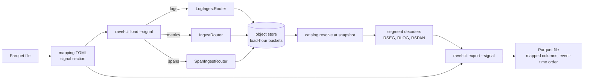

# ADR-1751: bulk import and export for all signals

Status: Accepted (2026-09-16). Issues #1751 and #1712. Amends ADR-0089 (scope
widened from the logs signal to metrics and spans; a Parquet export added as
the inverse of load).

## Context

ADR-0089 gave Ravel one bulk path in: `ravel-cli load --parquet` into the
logs signal. The command still says so: "Bulk-import a Parquet file into the
logs signal (ADR-0089)" (`services/ravel-cli/src/main.rs:339`). The loader
provisions `Signal::Logs` (`services/ravel-cli/src/load.rs:1147-1154`) and
builds a `LogIngestRouter` (`load.rs:1213-1217`); the mapping TOML knows only
log fields (`load.rs:255-313`). There is no bulk path out at all: no
`Export` command in the CLI's `Command` enum (`main.rs:242`), no Prometheus
remote read handler under `crates/ravel-query/src/http/mod.rs:190-200`, and
the CLI has no HTTP client; every CLI read goes to the object store
directly (`services/ravel-cli/Cargo.toml:27-45`).

The routers the loader needs already exist with the same shape as the log
one. `IngestRouter::new(config, store, signal, clock)`
(`crates/ravel-ingest/src/router.rs:206`) writes `Vec<NormalizedPoint>`
(`router.rs:400-414`) and `write_values` accepts histogram points
(`router.rs:423`). `SpanIngestRouter::new(config, store, clock)`
(`crates/ravel-ingest/src/span_router.rs:111`) writes `Vec<NormalizedSpan>`
(`span_router.rs:276-282`). The CLI already has a `--signal` value type,
`SignalArg { Metrics, Logs, Spans }`
(`services/ravel-cli/src/maintain.rs:26-42`), used by eight subcommands.

ADR-0089's lag argument carries over unchanged. All three shard types derive
the commit's ingest hour from the flush-open wall clock through
`checked_ingest_hour_bucket` (`crates/ravel-ingest/src/config.rs:107-124`;
called from `shard.rs:1394`, `log_shard.rs:1601`, `span_shard.rs:1037`), and
the catalog listing window is one shared `[start - max_ingest_lag, now +
clock_skew_allowance]` with no per-signal field
(`crates/ravel-catalog/src/catalog.rs:2485-2499`,
`crates/ravel-catalog/src/config.rs:215-227`). A thirty-day-old metric
sample loaded today lands in today's bucket, which every later query's
listing window reaches because its upper bound is `now`. The future-skew
bound keeps ADR-0089's reason to stay enforced.

What differs per signal is the normalisation. OTLP metrics support gauges,
cumulative sums, classic histograms and summaries exploded into
Prometheus-convention series, and exponential histograms stored natively
(`crates/ravel-otlp/src/normalize.rs:5-28`); `NormalizedPoint` carries a
series id, labels and a sample (`normalize.rs:102-112`). A span is
`NormalizedSpan { trace_id, span_id, parent_span_id, name, start_ts_ns,
end_ts_ns, status_code, status_message, attrs }` with string-only merged
attributes and reserved keys for events and links
(`crates/ravel-otlp/src/traces_normalize.rs:96-112, 57-83`).

Two Arrow majors coexist in the workspace: the direct `arrow = "59"` pin
that the loader's `parquet = "59"` sits on (`Cargo.toml:101`,
`services/ravel-cli/Cargo.toml:66-79`) and the arrow 58 that datafusion
carries for SQL and Flight SQL (`Cargo.toml:106-112`). Nothing passes Arrow
types across that boundary.

## Decision

1. **`load` takes `--signal {metrics,logs,spans}`, default `logs`.** The
   loader provisions or validates the named signal, constructs the matching
   router with the same `build_ingest_config`, and writes with
   `WriteMode::Strict` as today. Everything ADR-0089 keeps, relaxes or
   bypasses applies to every signal: past lag relaxed, future skew kept,
   length caps kept at the OTLP limits of that signal, the loader attribute
   cap in place of the OTLP one, and the server-side admission controller
   bypassed by construction.

2. **The mapping TOML gains a per-signal section; exactly one section must
   be present and it must match `--signal`.** Metrics: `name` (a column or a
   literal), `value` column, `ts` column and unit, `[[label]]` columns,
   an optional `kind = "gauge" | "counter"` that sets `is_monotonic_sum`,
   and an optional classic-histogram shape (`le` column plus `sum` and
   `count` columns) that the loader explodes into `_bucket`, `_sum` and
   `_count` series exactly as OTLP does. Spans: `trace_id`, `span_id`,
   optional `parent_span_id`, `name`, `start_ts` and `end_ts` with units,
   optional `status_code` and `status_message`, `[[resource_attribute]]`
   and `[[attribute]]` columns coerced to strings. Native (exponential)
   histograms, span events and span links are not mappable in this
   version; a mapping that names them is rejected.

3. **Historical metric samples bucket by load time, not event time.** The
   guide states it for metrics as it does for logs: retention and GC run
   from the load hour, a folded catalog sees the bulk objects in the load
   hour, and a sample's event range decides query overlap. Unsorted input
   costs every later query the bulk objects' fetch, so the sort advice
   stays.

4. **`ravel-cli export --signal S --tenant T --start --end --parquet OUT
   --mapping TOML` is the inverse of load and lands after it.** It reads
   the object store directly: a catalog resolve at a snapshot gives the
   parts, the segment decoders the CLI already links give the rows, and
   the same mapping TOML names the output columns. The export writes
   exactly the mapped columns, sorted by event time, so
   `load(export(window))` round-trips every mapped field. An opt-in
   `attrs_map_column` carries the attributes the mapping does not name as
   one map column. Metrics samples are deduplicated per `(series, ts)` by
   bit pattern before writing, the rule the query path applies; logs and
   spans have no dedup and are exported as stored.

5. **Export is a store read, not a query.** It evaluates no PromQL or SQL,
   applies no staleness rule and no aggregation, and stays on arrow 59
   beside the loader. The window is by event time; the listing window
   follows the catalog's rules, so a bulk-loaded object is exported by the
   same reach argument that makes it queryable.

## Rejected alternatives

- **Prometheus remote read as the bulk read-out.** It serves metrics only,
  in protobuf plus snappy, through a server route the CLI could not reach
  without an HTTP client it does not have. It answers a different need
  (federation into another Prometheus) and can be its own ticket if that
  need appears.
- **Export through the SQL engine.** It would put export on arrow 58 while
  load reads Parquet on arrow 59, pass Arrow batches across the boundary
  the workspace forbids, and require the `sql` feature in an operator
  tool. It would also make the export a query result rather than the
  store's contents.
- **Separate `load-metrics` and `load-spans` commands.** Three commands
  with the same nine flags and three mapping schemas that differ in one
  section; a `--signal` flag already exists as a CLI convention.
- **Bucket historical metric samples by event time.** The ingest hour is
  the flush-open clock in every shard type, and retention, sealing and
  the fold all key on it. A loader that wrote into a sealed, possibly
  tombstoned, past hour would need every maintenance path to reopen it.
- **Map native histograms, span events and links in the first version.**
  Each is a nested shape with its own encoding, and none of the source
  datasets that motivated bulk import carries them. Deferring keeps the
  mapping schema flat and the round-trip test exact.

## Consequences

- ADR-0089's decision sentence "into the logs signal" reads as "into the
  named signal"; its admission table applies per signal with that signal's
  OTLP limits. The guide's bulk-import section, the command help and the
  generated CLI reference say so.
- What changes for an operator: `--signal` selects the router; a metrics
  load needs the metrics mapping section; a completed load can be checked
  by exporting the same window and comparing files; retention of bulk
  metrics runs from the load hour.
- Export adds no dependency: `parquet` 59 and the decoders are already in
  `ravel-cli`. Load for metrics adds `ravel-otlp` limit types to the CLI's
  dependency set if they are not already reachable.
- Two Parquet writers now exist in the workspace's tooling (ravel-bench's
  baseline path and this one); they do not share code and are not required
  to.
- Follow-up tasks, in order:
  1. Metrics load: mapping section, `IngestRouter` construction, classic
     histogram explosion, and a test that loads one thirty-day-old sample
     into a `MemoryStore` and reads it back through `query_range`.
  2. Spans load: mapping section, `SpanIngestRouter` construction, and the
     one-span round trip.
  3. Export for logs, then metrics and spans, with the
     `load(export(x))` field-by-field round-trip test per signal and a
     metrics dedup test.
  4. Docs: docs/guides/ingest.md bulk section, a new export guide section,
     the generated CLI reference, and the mapping reference.
