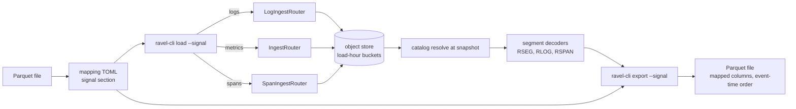

# ADR-1751: bulk import and export for all signals

Status: Accepted (2026-09-16). Issues #1751 and #1712. Amends ADR-0089 (scope
widened from the logs signal to metrics and spans; a Parquet export added as
the inverse of load).

## Context

ADR-0089 gave Ravel one bulk path in: `ravel-cli load --parquet` into the
logs signal. The command still says so: "Bulk-import a Parquet file into the
logs signal (ADR-0089)" (`services/ravel-cli/src/main.rs:339`). The loader
provisions `Signal::Logs` (`services/ravel-cli/src/load.rs:1147-1154`) and
builds a `LogIngestRouter` (`load.rs:1213-1217`); the mapping TOML knows only
log fields (`load.rs:255-313`). There is no bulk path out at all: no
`Export` command in the CLI's `Command` enum (`main.rs:242`), no Prometheus
remote read handler under `crates/ravel-query/src/http/mod.rs:190-200`, and
the CLI has no HTTP client; every CLI read goes to the object store
directly (`services/ravel-cli/Cargo.toml:27-45`).

The routers the loader needs already exist with the same shape as the log
one. `IngestRouter::new(config, store, signal, clock)`
(`crates/ravel-ingest/src/router.rs:206`) writes `Vec<NormalizedPoint>`
(`router.rs:400-414`) and `write_values` accepts histogram points
(`router.rs:423`). `SpanIngestRouter::new(config, store, clock)`
(`crates/ravel-ingest/src/span_router.rs:111`) writes `Vec<NormalizedSpan>`
(`span_router.rs:276-282`). The CLI already has a `--signal` value type,
`SignalArg { Metrics, Logs, Spans }`
(`services/ravel-cli/src/maintain.rs:26-42`), used by eight subcommands.

ADR-0089's lag argument carries over unchanged. All three shard types derive
the commit's ingest hour from the flush-open wall clock through
`checked_ingest_hour_bucket` (`crates/ravel-ingest/src/config.rs:107-124`;
called from `shard.rs:1394`, `log_shard.rs:1601`, `span_shard.rs:1037`), and
the catalog listing window is one shared `[start - max_ingest_lag, now +
clock_skew_allowance]` with no per-signal field
(`crates/ravel-catalog/src/catalog.rs:2485-2499`,
`crates/ravel-catalog/src/config.rs:215-227`). A thirty-day-old metric
sample loaded today lands in today's bucket, which every later query's
listing window reaches because its upper bound is `now`. The future-skew
bound keeps ADR-0089's reason to stay enforced.

What differs per signal is the normalisation. OTLP metrics support gauges,
cumulative sums, classic histograms and summaries exploded into
Prometheus-convention series, and exponential histograms stored natively
(`crates/ravel-otlp/src/normalize.rs:5-28`); `NormalizedPoint` carries a
series id, labels and a sample (`normalize.rs:102-112`). A span is
`NormalizedSpan { trace_id, span_id, parent_span_id, name, start_ts_ns,
end_ts_ns, status_code, status_message, attrs }` with string-only merged
attributes and reserved keys for events and links
(`crates/ravel-otlp/src/traces_normalize.rs:96-112, 57-83`).

Two Arrow majors coexist in the workspace: the direct `arrow = "59"` pin
that the loader's `parquet = "59"` sits on (`Cargo.toml:101`,
`services/ravel-cli/Cargo.toml:66-79`) and the arrow 58 that datafusion
carries for SQL and Flight SQL (`Cargo.toml:106-112`). Nothing passes Arrow
types across that boundary.

## Decision

1. **`load` takes `--signal {metrics,logs,spans}`, default `logs`.** The
   loader provisions or validates the named signal, constructs the matching
   router with the same `build_ingest_config`, and writes with
   `WriteMode::Strict` as today. Everything ADR-0089 keeps, relaxes or
   bypasses applies to every signal: past lag relaxed, future skew kept,
   length caps kept at the OTLP limits of that signal, the loader attribute
   cap in place of the OTLP one, and the server-side admission controller
   bypassed by construction.

2. **The mapping TOML gains a per-signal section; exactly one section must
   be present and it must match `--signal`.** Metrics: `name` (a column or a
   literal), `value` column, `ts` column and unit, `[[label]]` columns,
   an optional `kind = "gauge" | "counter"` that sets `is_monotonic_sum`
   (names and the metric's own unit follow the OTLP series-identity
   amendment below),
   and an optional classic-histogram shape (`le` column plus `sum` and
   `count` columns) that the loader explodes into `_bucket`, `_sum` and
   `_count` series exactly as OTLP does. Spans: `trace_id`, `span_id`,
   optional `parent_span_id`, `name`, `start_ts` and `end_ts` with units,
   optional `status_code` and `status_message`, `[[resource_attribute]]`
   and `[[attribute]]` columns coerced to strings. Native (exponential)
   histograms, span events and span links are not mappable in this
   version; a mapping that names them is rejected.

3. **Historical metric samples bucket by load time, not event time.** The
   guide states it for metrics as it does for logs: retention and GC run
   from the load hour, a folded catalog sees the bulk objects in the load
   hour, and a sample's event range decides query overlap. Unsorted input
   costs every later query the bulk objects' fetch, so the sort advice
   stays.

4. **`ravel-cli export --signal S --tenant T --start --end --parquet OUT
   --mapping TOML` is the inverse of load and lands after it.** It reads
   the object store directly: a catalog resolve at a snapshot gives the
   parts, the segment decoders the CLI already links give the rows, and
   the same mapping TOML names the output columns. The export writes
   exactly the mapped columns, sorted by event time, so
   `load(export(window))` round-trips every mapped field. An opt-in
   `attrs_map_column` carries the attributes the mapping does not name as
   one map column (not yet for spans; see the spans export amendment
   below, and the spans attrs map column amendment after it, which adds
   it). Metrics samples are deduplicated per `(series, ts)` by
   bit pattern before writing, the rule the query path applies; logs and
   spans have no dedup and are exported as stored. (For metrics, which
   mapping shapes round-trip and how duplicates are resolved are settled by
   the metrics export amendment below.)

5. **Export is a store read, not a query.** It evaluates no PromQL or SQL,
   applies no staleness rule and no aggregation, and stays on arrow 59
   beside the loader. The window is by event time; the listing window
   follows the catalog's rules, so a bulk-loaded object is exported by the
   same reach argument that makes it queryable.

```mermaid
flowchart LR
    PQ[Parquet file] --> MAP[mapping TOML<br/>signal section]
    MAP --> LD[ravel-cli load --signal]
    LD -->|logs| LR[LogIngestRouter]
    LD -->|metrics| MR[IngestRouter]
    LD -->|spans| SR[SpanIngestRouter]
    LR --> ST[(object store<br/>load-hour buckets)]
    MR --> ST
    SR --> ST
    ST --> RS[catalog resolve at snapshot]
    RS --> DEC[segment decoders<br/>RSEG, RLOG, RSPAN]
    DEC --> EX[ravel-cli export --signal]
    MAP --> EX
    EX --> PQ2[Parquet file<br/>mapped columns, event-time order]
```

## Rejected alternatives

- **Prometheus remote read as the bulk read-out.** It serves metrics only,
  in protobuf plus snappy, through a server route the CLI could not reach
  without an HTTP client it does not have. It answers a different need
  (federation into another Prometheus) and can be its own ticket if that
  need appears.
- **Export through the SQL engine.** It would put export on arrow 58 while
  load reads Parquet on arrow 59, pass Arrow batches across the boundary
  the workspace forbids, and require the `sql` feature in an operator
  tool. It would also make the export a query result rather than the
  store's contents.
- **Separate `load-metrics` and `load-spans` commands.** Three commands
  with the same nine flags and three mapping schemas that differ in one
  section; a `--signal` flag already exists as a CLI convention.
- **Bucket historical metric samples by event time.** The ingest hour is
  the flush-open clock in every shard type, and retention, sealing and
  the fold all key on it. A loader that wrote into a sealed, possibly
  tombstoned, past hour would need every maintenance path to reopen it.
- **Map native histograms, span events and links in the first version.**
  Each is a nested shape with its own encoding, and none of the source
  datasets that motivated bulk import carries them. Deferring keeps the
  mapping schema flat and the round-trip test exact.

## Consequences

- ADR-0089's decision sentence "into the logs signal" reads as "into the
  named signal"; its admission table applies per signal with that signal's
  OTLP limits. The guide's bulk-import section, the command help and the
  generated CLI reference say so.
- What changes for an operator: `--signal` selects the router; a metrics
  load needs the metrics mapping section; a completed load can be checked
  by exporting the same window and comparing files; retention of bulk
  metrics runs from the load hour.
- Export adds no dependency: `parquet` 59 and the decoders are already in
  `ravel-cli`. Load for metrics adds `ravel-otlp` limit types to the CLI's
  dependency set if they are not already reachable.
  This first sentence did not survive implementation; see the export
  dependency amendment below for what logs export actually cost.
- Two Parquet writers now exist in the workspace's tooling (ravel-bench's
  baseline path and this one); they do not share code and are not required
  to.
- Follow-up tasks, in order:
  1. Metrics load: mapping section, `IngestRouter` construction, classic
     histogram explosion, and a test that loads one thirty-day-old sample
     into a `MemoryStore` and reads it back through `query_range`.
  2. Spans load: mapping section, `SpanIngestRouter` construction, and the
     one-span round trip.
  3. Export for logs, then metrics and spans, with the
     `load(export(x))` field-by-field round-trip test per signal and a
     metrics dedup test.
  4. Docs: docs/guides/ingest.md bulk section, a new export guide section,
     the generated CLI reference, and the mapping reference.

## Amendment (2026-09-26): export does add a dependency, on ravel-query

<!-- amendment-applies: sections="Consequences" pointer="export dependency amendment" -->

Logs export (follow-up 3, issue #1712) shipped with `ravel-query` promoted
from a dev-dependency of `ravel-cli` to a normal one, so the Consequences
bullet saying export adds no dependency is wrong as written. `parquet` 59
and the decoders were indeed already there; the fetch and visibility layer
was not.

The cost is not one crate. `ravel-query` brings `axum`, `tonic`,
`promql-parser` and `ravel-promql` into `ravel-cli`'s normal build, none of
which an operator running `export` needs for anything else. That was
accepted deliberately, and the alternative is what makes it the right
trade: the exclusion rules an export must honour are ADR-0064 selective
erasure applied after fetch and after cache, plus the retention and
compaction supersession `Catalog::resolve` applies. Reimplementing them
inside `ravel-cli` would put a second copy of the deletion rules in the
tree, free to drift from the one the query path uses. A drifted copy does
not fail loudly: it writes a Parquet file holding records a query refuses
to return, which is the exact failure ADR-0064 exists to prevent. Sharing
`LogSegmentFetcher` and `snapshot_pending_erasure_predicates` with the
query path is what makes "a record a query cannot see is a record the
export does not write" a property of one implementation rather than a
claim about two.

If the build cost becomes a problem, the fix is to split the fetch and
erasure layer out of `ravel-query` into a crate that does not carry the
serving surfaces, not to give `ravel-cli` its own copy of the rules.

## Amendment (2026-09-28): loaded metrics share OTLP series identity

<!-- amendment-applies: sections="Decision" pointer="OTLP series-identity amendment" -->

Follow-up task 1 showed that decision 2's mapping, taken literally, stores
metric and label names as written, so a metric loaded from Parquet and the
same metric sent over OTLP land on different series. The loader now applies
the OTLP path's identity rules, so both surfaces agree on the `SeriesId`:

- The metric name goes through the same sanitizer and
  `prometheus_family_name` as OTLP, so a `[metrics]` mapping carries an
  optional `unit` key (the metric's UCUM unit, distinct from the `ts`
  column's unit) that adds the same unit suffix, and `kind = "counter"`
  adds `_total` exactly as a monotonic OTLP Sum does.
- Label names go through the same label sanitizer, and an empty label
  value is dropped as OTLP drops an empty attribute value, so an empty cell
  and a missing one name the same series.
- Two mapped labels that sanitize to one name are refused rather than
  merged.

## Amendment (2026-09-30): what metrics export round-trips

<!-- amendment-applies: sections="Decision" pointer="metrics export amendment" -->

Decision 4 says `load(export(window))` round-trips every mapped field. The
OTLP series-identity amendment above makes that impossible for some metrics
mapping shapes, because the load rewrites names the stored series already
carries in their rewritten form. Metrics export therefore narrows decision
4 as follows:

- Each series is written under a name that a load with the same mapping
  turns back into the stored name: the stored name itself when the load
  leaves it unchanged, otherwise the stored name less a trailing `_total`
  (a counter whose unit suffix and `_total` the load adds again), less its
  unit suffix, or less both (a name the suffixes took past the metric-name
  length cap). Each candidate is checked by running the load's own naming
  rule over it.
- A mapping or a series the export cannot invert is refused by name, and
  no file is written: a `[metrics.histogram]` mapping (a classic histogram
  round-trips through a scalar mapping with a `le` label instead), a stored
  name no candidate reproduces, a label the mapping does not name,
  native-histogram samples in the window, and a timestamp that is not a
  whole number of the mapping's `ts_unit`. A file that silently loads onto
  other series is not an export.
- Duplicates are resolved exactly as the query path resolves them: one
  sample per `(series, ts)`, the one with the greatest
  `(created_unix_ns, writer_epoch, writer_seq, in-page index)`, and the
  greatest value bit pattern only on a tie there. Decision 4's "by bit
  pattern" names the tie-break, not the whole rule.
- A reloaded series lands in the target tenant, whose tenant hash enters
  its `SeriesId`, so the round trip preserves label sets and sample bits
  rather than the `SeriesId` value itself.

## Amendment (2026-09-30): spans export carries mapped fields only

<!-- amendment-applies: sections="Decision" pointer="spans export amendment" -->

<!-- amendment-supersedes-allow: the first sentence as first written; the paragraph closing this amendment names it as retired -->
Decision 4's opt-in `attrs_map_column` is not available for spans yet: the
`[spans]` mapping has no such key, on load or on export. Spans export
therefore carries the mapped fields only, and narrows decision 4 as follows:

- Every mapped field round-trips: the ids, the name, both timestamps in
  their declared units, the status, and each mapped attribute. A span whose
  mapped fields a load would not read back as stored is refused by name, and
  no file is written.
- The span fields RSPAN keeps under reserved attribute keys (span kind,
  trace state, flags, events and links, which a span ingested over OTLP
  carries and for none of which decision 2 gives the mapping a field, and
  whose reserved keys a mapping may not name), any attribute the mapping
  does not name, and a parent id, a status code other than Unset or a
  status message when the mapping omits that optional column are not
  written. A span carrying one is exported without it rather than refused,
  and the report counts those spans as `spans_with_unwritten_data`, so a
  lossy export says how lossy it was.

The spans attrs map column amendment below adds the key and retires this
amendment's first sentence, "Decision 4's opt-in `attrs_map_column` is not
available for spans yet: the `[spans]` mapping has no such key, on load or
on export." The rest of this amendment stands for a mapping that leaves the
key unset. With it set, an attribute the mapping does not name is written
rather than counted, except where the load's per-span attribute cap leaves it
no room, as that amendment says.

## Amendment (2026-09-30): the spans mapping carries attrs_map_column

<!-- amendment-applies: sections="Decision|Amendment (2026-09-30): spans export carries mapped fields only" pointer="spans attrs map column amendment" -->
<!-- amendment-supersedes: phrase="not yet for spans" pointer="spans attrs map column amendment" -->
<!-- amendment-supersedes: phrase="`attrs_map_column` is not available for spans yet: the `[spans]` mapping has no such key, on load or on export" pointer="spans attrs map column amendment" -->

Issue #2216 gives the `[spans]` mapping the opt-in `attrs_map_column` that
decision 4 promises. The spans export amendment's first sentence, which says
the `[spans]` mapping has no such key, no longer holds; its second, that spans
export carries the mapped fields only, holds only with the key unset; and its
second bullet narrows to what the file still cannot carry:

- The key has the logs section's spelling and output shape: one
  `Map<Utf8, Utf8>` column after the mapped ones, under the export's refusal
  of two fields on one output column. The export writes into it every stored
  attribute the mapping does not name, as stored, up to the load's cap in the
  next bullet, except the reserved keys holding span kind, trace state,
  flags, events and links, which stay unwritten and counted in
  `spans_with_unwritten_data`.
- Unlike the logs load, which ignores the column, the spans load reads it
  back: its entries merge into the span's attributes at span precedence as
  written. They count toward the loader per-record cap of 1024 together with
  the row's `[[spans.attribute]]` values, and a row over it is refused, while
  a stored span can hold more (a load admits up to 1024 `[[spans.attribute]]`
  values plus resource attributes). The export therefore writes at most that
  cap less the span's written `[[spans.attribute]]` values into the map,
  keeping the entries first in ascending byte order of key, and counts a span
  that loses one in `spans_with_unwritten_data`. So `load(export(window))`
  under a mapping that sets the key reproduces every stored attribute string
  but the reserved ones and those the cap left out, and the report counts
  every span missing one. A null map value is an attribute the row does not
  carry and is skipped before the checks that follow. A row is refused when
  its map holds, with a non-null value, a key a mapped attribute also names
  (whether or not that attribute's cell holds a value), one key twice, or a
  reserved key. That carries decision 2's mapping-level refusal of a key
  declared twice or a reserved key down to the row. A key or value over its
  length cap drops that attribute and is counted, as on the OTLP path.
- The export chooses each mapped attribute's typed value by checking that the
  load's own coercion of the candidate reproduces the stored string, so the
  two share one coercion rather than keeping two copies that can drift. A
  stored string the declared type cannot reproduce is still refused by name,
  as the spans export amendment says.
- With the key unset, spans load and export behave as the spans export
  amendment describes.
