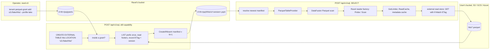
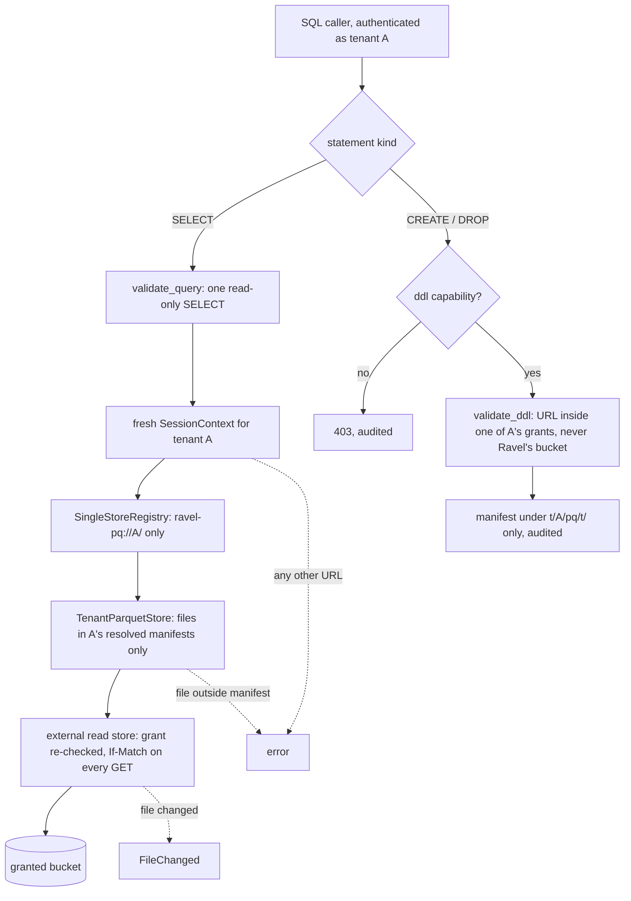

# ADR-2040: Parquet tables, defined in SQL and queried in place through DataFusion

- Status: Accepted (2026-09-27); implementation tracked on epic #2040
- Date: 2026-09-27
- Refs: #2040, ADR-0013, ADR-0022, ADR-0027, ADR-0029, ADR-0046, ADR-0064, ADR-0066, ADR-0071, ADR-0089, ADR-0094, ADR-0097, ADR-0109, ADR-0954, ADR-1374, ADR-2023

## Context

Ravel reads only its own formats at query time: RSEG for metrics, RLOG for
logs, RSPAN for spans. Parquet enters only through `ravel-cli load --parquet`
(ADR-0089, ADR-0109), which transcodes every row into RLOG. A user with a
Parquet dataset therefore pays a full load before the first query, and gets
back a copy shaped for logs rather than the table they had.

The SQL surface is built to make reading anything else impossible:

- `ravel-sql` links DataFusion 54 with the `sql` feature only, so no file
  format factory is compiled in.
- `build_session` installs `EmptyObjectStoreRegistry`, which refuses every
  `register_store` and every `get_store`.
- `validate` admits exactly one read-only `SELECT` and rejects
  `CREATE EXTERNAL TABLE`, `COPY` and all other DDL at parse time.

The last two are ADR-0013's first security invariant. It is also what stops
DataFusion's own Parquet scan from running here:
`FileScanConfig::open_with_args` (datafusion-datasource 54.1.0,
`file_scan_config/mod.rs:640`) looks up its store with
`context.runtime_env().object_store(url)` at execute time, whatever reader
factory the scan was given.

This ADR makes Parquet a queryable table kind. SQL defines such a table
with `CREATE EXTERNAL TABLE` over Parquet files where they already are: an
object or a prefix of many objects in S3, Google Cloud Storage or Azure
Blob Storage, inside locations an operator granted the tenant. Nothing is
copied or loaded. ADR-0029 rejected Parquet as Ravel's
log storage format, because it breaks "one commit is one object" and has no
place for blooms, postings and stream-sorted records. That stands: RLOG
stays the log format.

### Stage 0: what the same engine costs on the same box

ClickBench is the validation workload: the 105-column, ~100M-row `hits`
table and its 43 statements. The figures are sums over the 43 statements on
a c6a.4xlarge with a 500 GB gp2 volume. Cold is the first try after a
page-cache drop; hot is the better of the next two tries. datafusion-cli
runs each try in a fresh process, so its hot is a page-cache figure. Arms A
to F and K1 to K6 are datafusion-cli 54.1.0 on two fresh machines of the
same type, one for A to F and one for K1 to K6 (#2040). The expected bands
for A to F were posted before the run, and all six landed inside them. The
K arms attribute a cost rather than test a prediction, so they carried no
bands; each is read against arm B or arm E, which ran with the same binary
and protocol.

| Arm | Store | Layout | Settings | Cold | Hot | Failed |
|---|---|---|---|---|---|---|
| upstream | local disk | partitioned | stock | 191.0 s | 41.9 s | 0 |
| Ravel v0.18.0, RLOG | loopback RustFS | 2,617 objects | Ravel | 1,197.6 s | 101.7 s | 0 |
| A | local disk | partitioned | stock | 179.2 s | 40.3 s | 0 |
| B | loopback RustFS | partitioned | stock | 251.7 s | 57.5 s | 0 |
| C | loopback RustFS | partitioned | Ravel | 262.6 s | 76.0 s | q33 |
| D | loopback RustFS | single file | stock | 233.8 s | 64.3 s | 0 |
| E | loopback RustFS | single file | Ravel | 368.4 s | 203.4 s | q33 |
| F | real S3 | partitioned | stock | 194.5 s | 176.4 s | 0 |

"Ravel" settings are the ones `build_session` applies today:
`target_partitions=32`, file-scan, join, sort and window repartitioning
off, DataFusion's TopK aggregation off, and a 7 GB memory cap. Arm A
reproduces the published figures within 7%, so the box is comparable.

The one-knob arms change a single setting from arm B (K1 to K4 and K6,
100 files) or leave out a single setting from arm E (K5, one file):

| Arm | Change | Hot | Delta | Failed |
|---|---|---|---|---|
| K1 | `target_partitions=32` | 59.4 s | +1.9 s | 0 |
| K2 | file-scan repartitioning off | 66.6 s | +9.1 s | 0 |
| K3 | TopK aggregation off | 58.3 s | +0.8 s | 0 |
| K4 | 7 GB memory cap | 62.4 s | +4.9 s | q19, q33 |
| K5 | arm E, but file-scan repartitioning on | 88.1 s | -115.3 s against E | 0 |
| K6 | `pushdown_filters=true` | 47.1 s | -10.4 s | 0 |

K6 also takes cold from 251.7 s to 203.5 s. Nearly all of its hot gain is
q24 (`SELECT * ... WHERE URL LIKE ... ORDER BY EventTime LIMIT 10`, 12.5 s
to 0.8 s), where evaluating the filter inside the Parquet reader skips
decoding 104 other columns for rows that fail it. No statement got more
than 0.23 s slower.

Two costs show up, and one of them belongs to Ravel:

- **Ravel's session settings are the bottleneck.** File-scan repartitioning
  off is the largest: on one file it leaves a single scan partition, and
  turning it back on takes arm E's hot from 203.4 s to 88.1 s (K5). Even on
  100 files it costs 9.1 s. The 7 GB cap is second. With spill available,
  as in datafusion-cli, it costs q34 and q35 about 5.5 s each and fails
  q19 and q33. `target_partitions=32` and TopK aggregation off are inside
  the noise.
- **Serving through an S3 API costs 1.43x hot and 1.40x cold** over local
  disk (A to B). Cold tries read 77.8 GB from the volume to serve 50.1 GB
  over loopback. That cost is the price of object storage being the source
  of truth. datafusion-cli has no process-level cache, which is also why
  real S3's hot (176.4 s) barely improves on its cold (194.5 s).

## Decision

### D1. A table is a pinned snapshot of Parquet files where they already are

The Parquet files stay where the user put them, in an S3, GCS or Azure
bucket. Ravel never copies, moves, rewrites or deletes them. What Ravel stores is the
table definition:

```
t/<tenant_hash>/pq/grants                                   location grants (CAS whole-record replace)
t/<tenant_hash>/pq/t/<table>/v/<version:020>.pqm            table manifest version (immutable, CreateIfAbsent)
```

A **table** is a name matching `[a-z_][a-z0-9_]{0,62}` that is not a
built-in table (`samples`, `logs`, `spans`, `alerts`, `audit`) and not a
signal name (`profiles`). Its state is a sequence of immutable manifest
versions.

**Location grants.** An operator grants each tenant the blob-storage
locations its tables may read. A grant is a credential profile plus a
location in that profile's store:

- `s3://<bucket>/<prefix>` for S3 and S3-compatible stores (RustFS,
  MinIO);
- `gs://<bucket>/<prefix>` for Google Cloud Storage;
- `az://<container>/<prefix>` for Azure Blob Storage.

The prefix may be empty, which grants a whole bucket. A credential profile
lives in the server's own configuration: the store kind, its endpoint or
account, and its secrets. A URL alone does not identify a store. An
`az://` URL carries no account, and an `s3://` bucket name is unique only
per endpoint. So a location's identity everywhere in this ADR (grant,
manifest, cache key) is the tuple (profile, bucket, key), never the URL
string.

Grants live in their own record, `t/<tenant_hash>/pq/grants`, rewritten
whole under CAS with its own `format_version` (1). They are deliberately
not a field of the tenant config record: that record is read on the ingest
and fold paths, and adding a field there would need ADR-0066 R1's
two-release version bump. No existing binary reads the grants record.
Neither a grant nor any SQL statement ever carries a secret. A tenant with
no grant cannot create a Parquet table.

Rules on grants, checked when a grant is added:

- Two grants of one tenant whose locations overlap under different
  profiles are refused. So a `LOCATION` URL resolves to exactly one
  profile.
- A grant must not reach Ravel's own data bucket. A name comparison cannot
  see an alias, an access point, or the same store under another host
  name, so the check is also a probe. Ravel writes an object with a fresh
  random key under `sys/pq-probe/` in its own bucket, tries to read that
  key from the granted bucket through the grant's profile, and deletes the
  probe object afterwards. If the read succeeds, the granted bucket is
  Ravel's own under another name, and the grant is refused. The same probe
  runs again at `CREATE`.
- This protects Ravel's internal objects and every tenant's prefix inside
  Ravel's bucket. It does not police user buckets: granting two tenants
  overlapping locations in a user's bucket is an operator decision, and
  Ravel records it without refusing it.

The credentials a profile names must be able to read the granted location
(a bucket policy or IAM binding, for a bucket in another account).

A manifest (`proto/ravel/parquet_table.proto`, `ParquetTableManifest`)
carries:

- `format_version`, a reader floor with a strict gate, as ADR-0066 requires
  of Class C records. A reader refuses a manifest whose version is above
  its own rather than decoding it with unknown fields dropped. That matters
  here because version N+1 is built from version N: a lagging binary that
  dropped a field while reading N would write N+1 without it, which is the
  loss mechanism in ADR-0066's R1 amendment.
- the table name, the version, and `dropped`;
- the `LOCATION` it was created from, and the grant that admitted it (for
  audit only: reads check the grants that exist at read time);
- for each file: the profile, the bucket, the object key as raw bytes
  exactly as the listing returned it (never a URL string that would be
  re-parsed), byte size, ETag, the backend's object version or generation
  when the store reports one, row count, and Parquet footer length;
- the options and coercions (D5);
- who created it, when, a per-write nonce, and the statement text as
  `redact` renders it.

The manifest carries no Arrow schema. Every file in a table must have the
same Parquet schema, compared on the footer's schema elements when the
table is created. The reader infers the Arrow schema from one file's footer
at plan time, through DataFusion's own Parquet schema inference, so no
schema is encoded by one arrow major and decoded by another.

**Pinning.** The files are not Ravel's, so their owner can overwrite or
delete them at any time. Ravel's rule is that a table reads exactly the
bytes it was created over, or fails:

- Every read carries a precondition: `If-Match` on the recorded ETag, and
  the recorded version or generation when there is one. The `object_store`
  crate sends both for S3, GCS and Azure through `GetOptions`. S3 and Azure
  report a version only on a bucket with versioning on. GCS always reports
  a generation, so a GCS file is pinned exactly.
- A file that changed fails the query with a typed error naming it, "file
  changed since the table was created; run `CREATE OR REPLACE`". A file
  that is gone fails the same way. Old and new bytes are never mixed in one
  query.
- The read cache key's content part is a BLAKE3 over (profile, bucket, key,
  ETag, version, size), so a changed file can never be served from pages
  cached for its old bytes. This is a second kind of cache key, and
  ADR-0046 is amended to say so. Its soundness rests on the ETag or version
  changing whenever the bytes do, which is weaker than a hash of the bytes.
  On an unversioned S3 bucket a single-PUT ETag is an MD5, and whoever can
  write the granted location could in principle forge an MD5 collision. The
  harm stays inside the tenants granted that location, because the tenant
  hash is part of the key. A versioned bucket, or GCS, removes this.
- A store that ignores the precondition would silently serve changed
  bytes. So the precondition is probed against a real object whenever a
  grant is added and whenever a table is created: a read with a wrong
  ETag must be refused with `PreconditionFailed`, and a read with the
  object's own ETag must succeed. If either fails, the grant or the
  `CREATE` is refused. RustFS 1.0.0, the store the ClickBench lane uses,
  passes both (#2040).

Version N+1 is written with `CreateIfAbsent`. When two writers race for the
same number, the store accepts one; the loser sees the conflict, re-reads
the new version, and re-applies its own intent to it (D2). A table's
history is therefore a total order with no lost update. There is no
mutable HEAD: resolving a table is a LIST of `v/` and a GET of the newest
manifest, both charged to the Resolve phase. `sweep` (see Lifecycle under
Consequences) deletes superseded versions, so the LIST stays short.

### D2. SQL defines tables over granted locations

`POST /api/v1/sql` admits these statements from a caller holding the `ddl`
capability (D4):

```sql
CREATE EXTERNAL TABLE [IF NOT EXISTS] name STORED AS PARQUET LOCATION '<url>' [OPTIONS (...)];
CREATE OR REPLACE EXTERNAL TABLE name STORED AS PARQUET LOCATION '<url>' [OPTIONS (...)];
DROP TABLE [IF EXISTS] name;
```

- `LOCATION` is an `s3://`, `gs://` or `az://` URL. It names either a
  single object or a prefix ending in `/`, and it must lie inside one of
  the caller's grants (D1). Because grants of one tenant never overlap
  across profiles, the URL resolves to exactly one profile, and every
  file of the table is read through it.
- The `LOCATION` URL is checked once, in canonical form, segment by
  segment against the grant: `..`, empty segments, globs,
  percent-escapes, query strings, and a scheme or bucket other than the
  grant's are refused with a typed error. A grant of `s3://b/data` does not
  admit `s3://b/data2/`. Keys are case-sensitive and nothing is folded.
  The statement never carries a credential.
- A prefix is listed once, recursively. Every object whose key ends in
  exactly `.parquet` becomes a file of the table.
  - Hive-style subdirectories such as `year=2024/` are included as plain
    files; their names do not become columns.
  - Keys ending in `/` (directory markers) and keys with any other suffix
    are skipped, and the statement's response counts them.
  - A listed key that the object-store client cannot address exactly
    (an empty or `..` segment, for example) refuses the `CREATE` with a
    typed error naming it, rather than being recorded and becoming
    unreadable later.
  - A table holds at most 100,000 files. A prefix with none, or with more
    than the limit, is refused with a typed error.
- For each file, `CREATE` reads the footer with `If-Match` on the ETag the
  listing reported. It then records the ETag, version and size from that
  read's response, with the footer length and row count. A file changed
  between the listing and the footer read therefore refuses the `CREATE`
  instead of producing a manifest whose ETag and footer disagree. A file
  deleted in between refuses it the same way, naming the file. So does a
  zero-byte or truncated file. Nothing is skipped silently.
- `CREATE` requires one Parquet schema across the files and commits a
  manifest that snapshots the file list. Its footer reads go through the
  shared `GetLimiter` and run under the SQL deadline. A prefix too large to
  read within the deadline fails with the deadline error; the file cap
  bounds the worst case. Queries never list the location. Files added later
  are picked up by `CREATE OR REPLACE`.
- `OPTIONS` admits `binary_as_string` and `ravel.cast.<column>` (D5), and
  nothing else.
- Refused: `TEMPORARY`, `UNBOUNDED`, `PARTITIONED BY`, `WITH ORDER`, a
  column list (the schema comes from the footer), and any file type other
  than `PARQUET`.
- Race outcomes, applied by the loser against the new version:
  - `IF NOT EXISTS` on a table that now exists is a no-op.
  - A plain `CREATE` on a table that now exists is a `TableExists` error.
  - `OR REPLACE` and `DROP` write the next version on top.

Still refused everywhere: `COPY`, `INSERT`/`UPDATE`/`DELETE`,
`CREATE TABLE` and `CREATE TABLE AS`, `SET`/`RESET`, `EXPLAIN`, schema,
catalog, function and index DDL, `SHOW`, DataFusion URL tables, and every
table function. `CREATE VIEW` is not in this ADR. ClickBench's view exists
only to cast `EventDate`, which `ravel.cast` covers.

The statement is parsed through `complexity_guard::parse_guarded`, like
every other parse of caller text, into a typed intent that Ravel code
executes. It is never handed to DataFusion's `SessionContext::sql`. That call would make
DataFusion's whole DDL dispatch live (memory tables, views, catalogs,
functions), each needing a separate refusal. DataFusion's reference
`TableProviderFactory` also parses `LOCATION` with `ListingTableUrl::parse`,
which accepts globs and any scheme.

Grants are written by an operator with `ravel-cli tenant parquet-grant
add|remove|ls --tenant T --location <url> --profile <name>`, never through
SQL.

### D3. The reader: DataFusion's Parquet scan through Ravel's fetch path

A new crate, `ravel-parquet`, holds everything that needs DataFusion's
Parquet support. It depends on `datafusion-datasource-parquet` 54
directly. The `datafusion` facade's `parquet` feature stays off, so no
default format factory becomes registrable anywhere in the workspace. The
crate carries DataFusion's arrow 58 and parquet 58. `ravel-query` stays
free of both (ADR-0013), and the arrow 59 side (ingest, the CLI) is
untouched.

`ravel-parquet` provides:

- **An external read store per credential profile.** A read-only
  `ObjectStoreBackend` (`get` with ranges, `head`, `list`) over the
  `object_store` crate's S3, GCS or Azure client, built at startup from the
  profile's configuration. `ObjectStoreBackend` gains a conditional get (a
  `GetRange` plus ETag and version preconditions), implemented here and by
  `S3Store`, `MemoryStore` and `FaultStore`, so every failure path can be
  tested without a cloud account. Every Parquet read carries the
  manifest's ETag and version, and a failed precondition is a typed
  `FileChanged` error. The workspace's `object_store` gains its `gcp` and
  `azure` features for this.
- **A `ParquetFileReaderFactory` and `AsyncFileReader`.** They read through
  the external read store, the process-wide `GetLimiter`, and the
  `ReadCache` (ADR-0046), keyed by tenant hash, the pinned content key of
  D1 (a BLAKE3 over profile, bucket, key, ETag, version and size), offset
  and length. `get_metadata` is charged to the Probe phase and
  `get_bytes`/`get_byte_ranges` to the Scan phase. Phases are tagged here,
  not below, because an object store sees only byte ranges: object_store's
  default `get_ranges` coalesces ranges within 1 MiB (the 0.13 crate
  DataFusion's reader calls, `object_store-0.13.2/src/util.rs:92`), so a
  store cannot tell a footer read from a column chunk.
- **A decoded-metadata cache.** It is owned by Ravel, bounded in bytes, and
  keyed by tenant hash and the same content key. DataFusion's own
  `FileMetadataCache` lives in the per-query `RuntimeEnv` and dies with the
  session. Without this cache, every statement over 100 files would
  thrift-decode 100 footers. The cache sits outside the session, as the
  byte cache does, so ADR-0013's second invariant is unchanged.
- **A `TenantParquetStore`** (the `object_store` 0.13 trait DataFusion 54
  uses). It names each manifest file
  `ravel-pq://<tenant_hash>/<table>/<version>/f/<index>`, so two tables in
  one query never share a path,
  serves `head` from the manifest's sizes, and refuses every other path,
  every write and every list. It exists because `FileScanConfig` needs a
  registered store even when the reader factory does all the reading.
- **A `ParquetTableProvider`.** It builds a `FileScanConfig` from the
  manifest's file list. Each `PartitionedFile` carries its size and a
  `metadata_size_hint` equal to the footer length plus the 8-byte trailer,
  so the first footer read fetches exactly the footer. Planning never lists
  the store. The provider chooses the file groups: up to
  `target_partitions` groups for a query D6 allows to scan in parallel,
  and exactly one group in manifest file order otherwise.

Resolution happens before the session is built, as it does for the signal
tables. The executor reads the table names from the statement, resolves
each Parquet table's newest manifest, and registers the provider with
`register_table`. There is no async catalog provider doing I/O during
planning, so store I/O stays at the one resolve site and under its retry
contract. A table dropped by the time a query resolves it is a
`TableNotFound` error.

Resolution also re-checks the grants. Each file's (profile, bucket, key)
must lie inside a grant that exists now, with the same profile, or the
query fails with a typed `LocationNotGranted` error. The grant the
manifest recorded is kept for audit and plays no part in this check. The
grants record is cached per tenant for at most 60 seconds, so a revoked
grant stops admitting reads within 60 seconds.

A file changed or deleted under a table fails the
query with `FileChanged` or `FileMissing`. Re-resolving cannot help,
because the manifest still names the old bytes, so the error tells the
caller to run `CREATE OR REPLACE`.

### D4. ADR-0013's first invariant, replaced for Parquet tables

The replacement invariant: **a SQL caller reads only what an operator
granted it, and never names a credential.**

- Every object a session reads is either Ravel's own (the signal tables),
  or a file listed in a manifest Ravel wrote for the caller's tenant that
  lies inside one of that tenant's grants.
- No grant can reach Ravel's own data bucket, by name or by the probe of
  D1, so no Parquet table can read Ravel's internal objects or any
  tenant's prefix inside that bucket.
- Statement text may carry a location URL. That URL must lie inside a
  grant, and it never carries a credential.
- A table-definition statement is admitted only with the `ddl` capability,
  and it writes only the caller's own manifests under
  `t/<tenant_hash>/pq/t/`.
- A query session installs `SingleStoreRegistry` only when it reads a
  Parquet table. That registry answers exactly `ravel-pq://<tenant_hash>/`
  with the `TenantParquetStore` for this query's manifests, errors for
  every other URL, and refuses `register_store`. Every other session keeps
  `EmptyObjectStoreRegistry`. The second invariant (a fresh single-tenant
  `SessionContext` per query) is unchanged.

**Where DDL is accepted.** The executor gains a separate entry point,
`execute_ddl`. `execute` and `execute_accounted` stay read-only, so every
existing caller keeps the old gate by construction: the alerting rules
engine and the MCP server (ADR-1374, whose default profile is read-only)
never reach DDL. `validate` splits into `validate_query` (the existing rule,
exactly one read-only `SELECT`) and `validate_ddl`, which returns the typed
intent. HTTP `POST /api/v1/sql` routes by statement kind. Flight SQL's
`CommandStatementUpdate` is a later change.

**Who may run DDL.** A token resolves to a bare `TenantId` today
(`services/ravel-server/src/tenant.rs`). The resolver output gains a `ddl`
capability: a suffix in the static token map, or a claim for OIDC. It is
absent by default, and a DDL statement without it is refused with 403.

**Audit.** Every DDL statement, admitted or refused, writes an
`AuditRecord`. `redact` learns to render the three admitted statements
instead of rejecting them.

**Tests that pin the invariant:**

- `validate.rs` `create_external_table_is_rejected` stays for
  `validate_query`. New cases for `validate_ddl` and the grant check:
  - refused: `file://`, `http://`, a relative path, `..`, an empty
    segment, a glob, a percent-escape, a query string;
  - refused: a URL outside every grant, a URL whose scheme or bucket
    differs from the grant's, and a URL sharing only a string prefix with
    a grant (`s3://b/data2/` against a grant of `s3://b/data/`);
  - admitted: a single object and a prefix inside a grant.
- A grant naming Ravel's own data bucket is refused when it is written.
  So is a grant whose bucket is Ravel's under another name, which a store
  fixture exposing one bucket under two names proves. A manifest file in
  Ravel's bucket is refused on read, whatever wrote it.
- Grants of one tenant that overlap under two profiles are refused.
- A read after the grant is removed fails with `LocationNotGranted` once
  the grants cache has refreshed.
- `sql_endpoint.rs` `rejected_statement_kinds_return_400_over_http`: the
  capability is checked before the statement is validated, so a caller
  without `ddl` learns nothing about validation. Its existing `s3://evil/x`
  case, sent with a token that has no `ddl`, moves to 403. New cases:
  - the same statement from a token holding `ddl` but no grant over
    `s3://evil/` returns 400;
  - with the capability and a granted location, 200 and a manifest under
    the caller's prefix;
  - tenant A cannot create a table over a location granted only to
    tenant B, and its DDL writes nothing under tenant B's prefix.
- `session.rs` `the_empty_registry_refuses_lookups_and_registrations` stays.
  `SingleStoreRegistry` gains cases for another tenant's URL, `s3://`,
  `file://`, and `register_store`.
- `redact.rs` `create_external_table_is_rejected` inverts for the admitted
  form and stays for the refused ones.
- `SELECT * FROM 's3://...'` and `SELECT * FROM 'ravel-pq://...'` are
  refused, so a caller cannot read a location or a manifest file around
  the table definition.
- A `match` over DataFusion's `DdlStatement` with no wildcard arm, so a
  DataFusion upgrade that adds a variant fails to compile rather than
  admitting it.

Every sentence that states the empty-registry rule is updated in the same
change as the code, so none claims more than the code does: the module
docs of `session.rs`, the `EmptyObjectStoreRegistry` error text, the
dependency comment in `crates/ravel-sql/Cargo.toml`, `executor.rs`,
`tests/security.rs`, `validate.rs`, and the rows in ADR-0097 and ADR-1374
that cite it.

### D5. Coercions are table options, not views

ClickBench's upstream `create.sql` reads binary columns as strings and
casts `EventDate` from an integer to `DATE` through a view. Ravel records
both as table options:

- `binary_as_string 'true'`: read `BYTE_ARRAY` columns without a string
  annotation as strings, as DataFusion's option of the same name does.
- `ravel.cast.<column> 'date-from-days' | 'timestamp-from-seconds' |
  'timestamp-from-millis'`: cast an integer column. The provider applies
  the cast as a logical projection over the scan, the same plan upstream's
  view produces (`CAST(CAST("EventDate" AS INTEGER) AS DATE)`). Pruning on
  a cast column is whatever DataFusion does with that plan. Arm A ran
  exactly that plan, and the date-filtered statements q37 to q43 took
  0.02 s to 0.16 s hot.

Admitted stored types are the Arrow primitives, strings, binary, dates,
timestamps, decimals, and lists or structs of those. A nested type the
function allowlist cannot reach still loads, and queries that touch it fail
with a typed error.

### D6. Session settings for Parquet tables follow the measurement

A query over a Parquet table uses the signal tables' deadline, function
allowlist, and per-query memory pool. It differs where Stage 0 showed a
cost:

- Scan parallelism follows the `exact_typed_aggregates` value the
  executor already computes for every query (ADR-0094): the operator's
  `parallel_final_aggregation` flag AND `plan_is_exact_typed`. The
  predicate is the executor's, and this ADR does not restate it. As of
  writing, it admits a plan with no aggregate, `count` including
  `count(DISTINCT ...)`, `sum`/`min`/`max` over non-float input, and
  `avg`/`mean` over resolved integer input, and it refuses a float GROUP
  BY or DISTINCT key.
  - When the value is true, the provider gives the scan up to
    `target_partitions` file groups and file-scan repartitioning is on, so
    a single large file is also split by byte range (K5: 203.4 s to 88.1 s
    hot on one file; K2: 9.1 s on 100 files).
  - When it is false, the provider emits exactly one file group, in
    manifest file order, and file-scan repartitioning is off. The scan
    then has one partition, the aggregate's input arrives in a fixed
    order, and a float fold is bit-reproducible. Turning the knob off
    alone would not do this: the knob only re-splits the groups the
    provider made, and one group per file would still give a partial
    aggregate per file merged in arrival order.
  - A spill-enabled query (ADR-0954) keeps whatever scan partitioning the
    rule above gives it. That ADR removes `RepartitionExec` above the scan
    and keeps the scan itself parallel, and file groups and byte-range
    splits are scan partitions, not `RepartitionExec` nodes.
  - The cost of the single-group rule on ClickBench is measured in the
    first D7 run on the reference machine. A deterministic ordered merge
    of partial states is the follow-up if it matters.
- Parquet filter pushdown (`pushdown_filters`) is on, which evaluates
  predicates inside the reader and decodes the other columns only for
  surviving rows (K6: 57.5 s to 47.1 s hot, 251.7 s to 203.5 s cold).
- `target_partitions` and TopK aggregation keep Ravel's values, since
  neither costs a measurable amount (K1, K3).
- The spill classifier learns Parquet tables. Spill eligibility comes from
  `analyzed_classification_plan`, which builds an empty table for the
  query's target signal. It needs a Parquet arm built from the resolved
  schema, or every Parquet query would run with spill and aggregate
  repartitioning off. Under the 7 GB cap, datafusion-cli spilled q34 and
  q35 and failed q19 and q33 (K4). With spill off, all four would fail.

`build_session` installs five physical optimizer rules of Ravel's own, and
they split by what they match:

- `MetadataOnlyAggregate`, `AttrsPerKeyProjection` and
  `TopKLateMaterialization` match only a plan whose leaf is a
  `LogsScanExec`, so they never fire on a Parquet plan.
- `DictionaryGroupKeysAsViews` matches an `AggregateExec` whose group key
  is `Dictionary(_, Utf8 | LargeUtf8)`, whatever the scan. It fires on a
  Parquet plan when a column is read as a dictionary, and its rewrite
  (group on `Utf8View`, cast the output back) is exact for any source.
- `BoundedTopKAggregate` matches a `SortExec` with a limit over an
  aggregate, whatever the scan. It fires on Parquet plans and re-admits
  the vetted TopK shapes that K3 turned off wholesale. Its exactness
  argument (issue #1402) rests on the aggregate's ordering and limit, not
  on the scan, and task T4a of epic #2040 (issue #2053) pins it with a
  Parquet-plan test.

DataFusion's row-group, page-index and bloom-filter pruning apply to
Parquet plans. A query may name several Parquet tables. A Parquet table and a
signal table in one statement is a `CrossSignalQuery` error, as two signal
tables are today. `target_signal` gains a Parquet arm, since today a name
it does not know routes to Metrics.

### D7. Validation and the performance bar

ClickBench is the acceptance workload. The 100 `hits_*.parquet` files sit
in a bucket on the same loopback RustFS, the tenant is granted that
bucket's prefix, and the lane runs upstream `create.sql` with `LOCATION`
pointed at the prefix and the view replaced by `ravel.cast.EventDate`. A
second arm points `LOCATION` at the single-file `hits.parquet`. It runs the 43 upstream statements with no rewrite.
Every function they call is already admitted: `EXTRACT` plans as the
admitted `date_part`.

The bar, measured through `ravel-server` on the reference machine with
loopback RustFS. Every figure is stamped with the fetch-cache size the
server derived (40% of the memory budget on a loopback store, ADR-2023)
and the per-query memory cap:

- **Correctness.**
  - Every statement's rows are compared with datafusion-cli's on arm B's
    definition of `hits`. Rows are compared as multisets. Where
    `ORDER BY ... LIMIT` cuts through a tie, rows tied on the boundary key
    are compared on the key only.
  - Float columns are compared by bits. Any mismatch is listed per
    statement and must be explained. The one expected source is Ravel's
    sequential-fold `avg` (ADR-0022).
  - The reference outputs are generated by datafusion-cli 54.1.0 on the
    reference machine during the first measurement, and checked in beside
    the corpus.
- **Hot.** Hot is within 1.25x of arm B, and under the RLOG entry's
  101.7 s. The server's cache is a long-lived process cache, so it is
  expected under arm B. A figure above B is a finding to explain.
- **Cold.** Cold is within 1.25x of arm B.
- **Failures.** Before the first run, the expected failures are
  pre-registered against the stated memory cap. Starting point: q19, q29,
  q33, q34 and q35, the set that exhausts the pool on RLOG or failed under
  K4. Nothing outside the pre-registered set may fail.
- **Concurrency.** Ten connections for 600 s, the ClickBench driver's
  phase, pre-registered against ADR-2023's 0.400 queries per second and
  0.101 error ratio on the RLOG entry.

## Rejected alternatives

1. **Parquet as the log storage format.** ADR-0029 rejected it and none of
   its reasons has changed. It would also make the ClickBench number a
   property of a new write path rather than of reading.
2. **`LOCATION` as any URL the server's credentials can reach.** The
   server would read any object the caller names, including other tenants'
   buckets: a confused deputy. It is safe only for a single-tenant
   deployment, which such a deployment gets anyway by granting its one
   tenant the locations it needs.
3. **Copy the files into the tenant's prefix first** (an earlier draft of
   this ADR). It makes the objects Ravel's own and immutable, but the user
   pays a second copy of the data and an upload step before the first
   query. The point of the feature is to query files where they are.
   Pinning by ETag and version gives the immutability a copy would, at no
   storage cost.
4. **Credentials in `OPTIONS`.** They would land in the statement text,
   the audit trail and the manifest. Credential profiles in server
   configuration keep secrets out of all three.
5. **Trust the files not to change, and skip the precondition.** A cached
   page of the old bytes and a fresh page of the new ones would be mixed in
   one result: wrong data with no error. The precondition costs nothing
   extra per request.
6. **Run DDL through DataFusion (`SessionContext::sql` plus a
   `TableProviderFactory`).** The extension points exist. But this makes
   DataFusion's full DDL dispatch live, and the reference factory's
   location parser accepts globs and any scheme. Intercepting the parsed
   statement keeps the admitted surface to three statement forms written
   in Ravel code.
7. **An async catalog provider that resolves tables during planning.** It
   moves store I/O into planner callbacks, outside the single resolve site
   and its retry contract.
8. **Keep `EmptyObjectStoreRegistry` and write Ravel's own
   `ParquetScanExec`** over the parquet crate's async reader. This keeps the
   old invariant verbatim but rebuilds what DataFusion already has:
   pruning, page index, row filters, morsel-driven work stealing, and the
   dynamic filters its TopK and joins push into the scan.
9. **Enable the `datafusion` facade's `parquet` feature in `ravel-sql`.**
   Cargo unifies features, so every binary linking `ravel-sql` would carry
   the Parquet format factory, and `with_default_features` would register
   it.
10. **Transcode at load time, faster.** That is ADR-0109's path, and the
   RLOG entry is its measurement: 101.7 s hot, against 40.3 s for
   DataFusion on the same files.

## Consequences

- **New persistent formats**, handled per the format-change procedure:
  - **Keys.** `t/<tenant_hash>/pq/grants`, `t/<tenant_hash>/pq/t/` and
    the transient `sys/pq-probe/` are new, which is how the key layout
    grows. They are added to `docs/catalog-and-mvcc.md` in the same change
    as the code that writes them.
  - **Grants record.** A Class C record rewritten whole under CAS, like the
    tenant config record, with its own reader-floor `format_version`
    starting at 1. ADR-0066's R1 amendment applies from its first additive
    change: a later field means a two-release version bump, readers first.
    It sits beside the tenant config record, not inside it, so this change
    needs no bump of a record the ingest and fold paths already read.
  - **Manifest.** `ParquetTableManifest` is a Class C immutable metadata
    record (ADR-0066 decision 4). It is additive-only, with frozen field
    numbers, and carries the reader-floor `format_version` with a strict
    gate. The pre-v1.0 single-version regime (ADR-0027) applies. There is
    no dual reader, because there is no second version.
  - **The Parquet files** are not Ravel's objects. They sit outside
    classes A to D and outside Ravel's invariants on data objects: Ravel
    neither writes, versions, nor deletes them. What Ravel guarantees is
    narrower: a table reads exactly the bytes its manifest pinned, or
    fails. Readability across Ravel versions is whatever the linked
    `parquet` crate reads. An upgrade that drops an encoding surfaces as a
    typed read error on that table.
  - **Inspector.** `ravel-cli parquet ls` prints every manifest field, and
    `ravel-cli tenant parquet-grant ls` prints a tenant's grants.
- **Object storage stays the source of truth.** A table's definition is in
  Ravel's bucket and its data is in the granted buckets. Nothing depends on
  local disk.
- **Checksum coverage is weaker than RLOG's**, and this is stated rather
  than hidden. The precondition proves the object is the one the table was
  created over. It says nothing about whether those bytes were ever
  correct. Page bytes are verified only where the file carries Parquet page
  CRCs, which ClickBench's files do not. Corrupt or truncated bytes produce
  typed errors, never panics, and property tests over mutated files pin
  that.
- **A table breaks when its owner changes a file.** Queries fail with
  `FileChanged` or `FileMissing` until someone runs `CREATE OR REPLACE`.
  That is deliberate, since the alternative is a silent wrong answer. An
  append-only data lake that only adds files never hits it; a new file
  simply stays invisible until the next `CREATE OR REPLACE`.
- **The read cache gains a second key kind.** Until now every `CacheKey`
  named bytes by their BLAKE3, so a mutable object could not be named at
  all. The pinned key names bytes by (profile, bucket, key, ETag, version,
  size), and its soundness rests on the precondition. ADR-0046 is amended
  to name this kind, and `CacheKey` gets a separate constructor for it.
- **The SQL surface now writes.** The `ddl` capability, the audit record
  and the separate entry point bound it. A deployment that issues no `ddl`
  tokens has the old read-only surface.
- **New dependencies.** `datafusion-datasource-parquet` 54 and `parquet` 58
  are new lockfile entries. `parquet` 58 sits beside the workspace's 59.
  `object_store` 0.13.2 is already in the lock for DataFusion, beside the
  workspace's 0.14. The workspace's `object_store` 0.14 also gains its
  `gcp` and `azure` features, and whatever those pull into the lock is
  new. `cargo deny` and the quick-xml guards are re-run against the new
  lock.
- **Lifecycle.** Parquet tables are outside time retention and outside
  selective erasure (ADR-0064): the data belongs to whoever owns the
  bucket. `DROP TABLE` removes the table, not the files.
  `ravel-cli parquet sweep`, run by an operator, deletes manifest versions
  superseded for longer than a grace. That grace must be at least the
  deployment's `--gc-max-query-duration` (11 minutes when derived), which
  covers a query that resolved an older version. Sweep never touches the
  Parquet files.
- **Distributed execution** (ADR-0071 read fan-out) does not cover Parquet
  tables. A query runs on the node that receives it.




