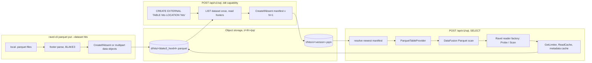
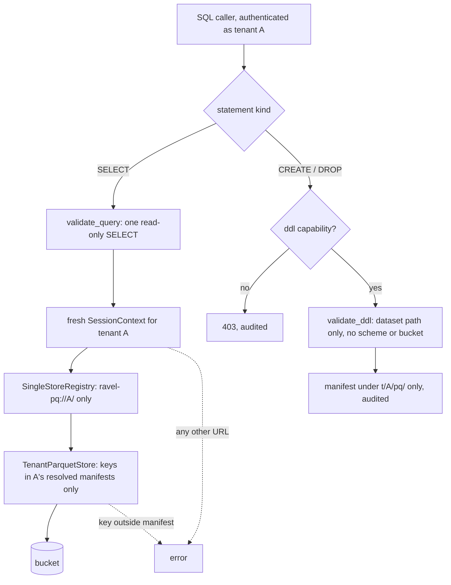

# ADR-2040: Parquet tables, defined in SQL and queried in place through DataFusion

- Status: Accepted (2026-09-27); implementation tracked on epic #2040
- Date: 2026-09-27
- Refs: #2040, ADR-0013, ADR-0022, ADR-0027, ADR-0029, ADR-0046, ADR-0064, ADR-0066, ADR-0071, ADR-0089, ADR-0097, ADR-0109, ADR-1374, ADR-2023

## Context

Ravel reads only its own formats at query time: RSEG for metrics, RLOG for
logs, RSPAN for spans. Parquet enters only through `ravel-cli load --parquet`
(ADR-0089, ADR-0109), which transcodes every row into RLOG. A user with a
Parquet dataset therefore pays a full load before the first query, and gets
back a copy shaped for logs rather than the table they had.

The SQL surface is built to make reading anything else impossible:

- `ravel-sql` links DataFusion 54 with the `sql` feature only, so no file
  format factory is compiled in.
- `build_session` installs `EmptyObjectStoreRegistry`, which refuses every
  `register_store` and every `get_store`.
- `validate` admits exactly one read-only `SELECT` and rejects
  `CREATE EXTERNAL TABLE`, `COPY` and all other DDL at parse time.

The last two are ADR-0013's first security invariant. It is also what stops
DataFusion's own Parquet scan from running here:
`FileScanConfig::open_with_args` (datafusion-datasource 54.1.0,
`file_scan_config/mod.rs:640`) looks up its store with
`context.runtime_env().object_store(url)` at execute time, whatever reader
factory the scan was given.

This ADR makes Parquet a queryable table kind, and lets SQL define such
tables with `CREATE EXTERNAL TABLE`. ADR-0029 rejected Parquet as Ravel's
log storage format, because it breaks "one commit is one object" and has no
place for blooms, postings and stream-sorted records. That stands: RLOG
stays the log format.

### Stage 0: what the same engine costs on the same box

ClickBench is the validation workload: the 105-column, ~100M-row `hits`
table and its 43 statements. The figures are sums over the 43 statements on
a c6a.4xlarge with a 500 GB gp2 volume. Cold is the first try after a
page-cache drop; hot is the better of the next two tries. datafusion-cli
runs each try in a fresh process, so its hot is a page-cache figure. Arms A
to F and K1 to K6 are datafusion-cli 54.1.0 on two fresh machines of the
same type, one for A to F and one for K1 to K6 (#2040). The expected bands
for A to F were posted before the run, and all six landed inside them. The
K arms attribute a cost rather than test a prediction, so they carried no
bands; each is read against arm B or arm E, which ran with the same binary
and protocol.

| Arm | Store | Layout | Settings | Cold | Hot | Failed |
|---|---|---|---|---|---|---|
| upstream | local disk | partitioned | stock | 191.0 s | 41.9 s | 0 |
| Ravel v0.18.0, RLOG | loopback RustFS | 2,617 objects | Ravel | 1,197.6 s | 101.7 s | 0 |
| A | local disk | partitioned | stock | 179.2 s | 40.3 s | 0 |
| B | loopback RustFS | partitioned | stock | 251.7 s | 57.5 s | 0 |
| C | loopback RustFS | partitioned | Ravel | 262.6 s | 76.0 s | q33 |
| D | loopback RustFS | single file | stock | 233.8 s | 64.3 s | 0 |
| E | loopback RustFS | single file | Ravel | 368.4 s | 203.4 s | q33 |
| F | real S3 | partitioned | stock | 194.5 s | 176.4 s | 0 |

"Ravel" settings are the ones `build_session` applies today:
`target_partitions=32`, file-scan, join, sort and window repartitioning
off, DataFusion's TopK aggregation off, and a 7 GB memory cap. Arm A
reproduces the published figures within 7%, so the box is comparable.

The one-knob arms change a single setting from arm B (K1 to K4 and K6,
100 files) or leave out a single setting from arm E (K5, one file):

| Arm | Change | Hot | Delta | Failed |
|---|---|---|---|---|
| K1 | `target_partitions=32` | 59.4 s | +1.9 s | 0 |
| K2 | file-scan repartitioning off | 66.6 s | +9.1 s | 0 |
| K3 | TopK aggregation off | 58.3 s | +0.8 s | 0 |
| K4 | 7 GB memory cap | 62.4 s | +4.9 s | q19, q33 |
| K5 | arm E, but file-scan repartitioning on | 88.1 s | -115.3 s against E | 0 |
| K6 | `pushdown_filters=true` | 47.1 s | -10.4 s | 0 |

K6 also takes cold from 251.7 s to 203.5 s. Nearly all of its hot gain is
q24 (`SELECT * ... WHERE URL LIKE ... ORDER BY EventTime LIMIT 10`, 12.5 s
to 0.8 s), where evaluating the filter inside the Parquet reader skips
decoding 104 other columns for rows that fail it. No statement got more
than 0.23 s slower.

Two costs show up, and one of them belongs to Ravel:

- **Ravel's session settings are the bottleneck.** File-scan repartitioning
  off is the largest: on one file it leaves a single scan partition, and
  turning it back on takes arm E's hot from 203.4 s to 88.1 s (K5). Even on
  100 files it costs 9.1 s. The 7 GB cap is second. With spill available,
  as in datafusion-cli, it costs q34 and q35 about 5.5 s each and fails
  q19 and q33. `target_partitions=32` and TopK aggregation off are inside
  the noise.
- **Serving through an S3 API costs 1.43x hot and 1.40x cold** over local
  disk (A to B). Cold tries read 77.8 GB from the volume to serve 50.1 GB
  over loopback. That cost is the price of object storage being the source
  of truth. datafusion-cli has no process-level cache, which is also why
  real S3's hot (176.4 s) barely improves on its cold (194.5 s).

## Decision

### D1. Datasets and tables live under the tenant's prefix, as immutable objects

```
t/<tenant_hash>/pq/d/<dataset>/<blake3_hex64>.parquet       data object (immutable, content-addressed)
t/<tenant_hash>/pq/t/<table>/v/<version:020>.pqm            table manifest version (immutable, CreateIfAbsent)
```

A **dataset** is a tenant-relative path matching
`[a-z0-9_]+(/[a-z0-9_]+)*`. It is a place to put Parquet files. A **table**
is a name matching `[a-z_][a-z0-9_]{0,62}` that is not a built-in table
(`samples`, `logs`, `spans`, `alerts`, `audit`) and not a signal name
(`profiles`). Its state is a sequence of immutable manifest versions.

A manifest (`proto/ravel/parquet_table.proto`, `ParquetTableManifest`)
carries:

- `format_version`, a reader floor with a strict gate, as ADR-0066 requires
  of Class C records. A reader refuses a manifest whose version is above
  its own rather than decoding it with unknown fields dropped. That matters
  here because version N+1 is built from version N: a lagging binary that
  dropped a field while reading N would write N+1 without it, which is the
  loss mechanism in ADR-0066's R1 amendment.
- the table name, the version, and `dropped`;
- the dataset it was created from;
- for each file: its data key, byte size, BLAKE3 content hash, row count,
  and Parquet footer length;
- the options and coercions (D5);
- who created it, when, and the statement text as `redact` renders it.

The manifest carries no Arrow schema. The CLI links arrow 59 and the
reader arrow 58, and a schema encoded by one and decoded by the other
would be a contract between two arrow majors. Instead, every file in a
table must have the same Parquet schema, compared on the footer's schema
elements. The reader infers the Arrow schema from one file's footer at plan
time, through DataFusion's own Parquet schema inference.

Version N+1 is written with `CreateIfAbsent`. When two writers race for the
same number, the store accepts one; the loser sees the conflict, re-reads
the new version, and re-applies its own intent to it (D2). A table's
history is therefore a total order with no lost update. There is no
mutable HEAD: resolving a table is a LIST of `v/` and a GET of the newest
manifest, both charged to the Resolve phase. `sweep` (see Lifecycle under
Consequences) deletes old versions, so the LIST stays short.

Data objects are content-addressed, and the key carries the full 256-bit
BLAKE3 digest as 64 hex characters. Every other `hash16` key in the layout
is disambiguated by a writer id, epoch, sequence or watermark; this one has
nothing else, so a 64-bit truncation would make two different files of the
same size one object. A file that fits in one PUT is written with
`CreateIfAbsent`, and a conflict there counts as success once a `head`
confirms the size, since the key already names these bytes. A larger file
goes through `put_multipart`, which
takes no put condition and may overwrite. That is safe because the key is
the BLAKE3 of the bytes, so an overwrite can only write the same bytes, and
nothing references the object until a manifest commits. No manifest ever
references a key whose bytes can change. That makes the content hash usable
as the read cache's `content_hash` (ADR-0046) exactly as it is for RLOG
objects.

### D2. SQL defines tables; LOCATION names a dataset, never storage

`POST /api/v1/sql` admits these statements from a caller holding the `ddl`
capability (D4):

```sql
CREATE EXTERNAL TABLE [IF NOT EXISTS] name STORED AS PARQUET LOCATION 'dataset' [OPTIONS (...)];
CREATE OR REPLACE EXTERNAL TABLE name STORED AS PARQUET LOCATION 'dataset' [OPTIONS (...)];
DROP TABLE [IF EXISTS] name;
```

- `LOCATION` is a dataset path as defined in D1. A scheme, a leading `/`,
  `..`, a glob, or a percent-escape is refused at validation with a typed
  error. The statement never carries a bucket, an absolute key, or a
  credential.
- `CREATE` lists the dataset once with `list_delimited` at the dataset's
  prefix, so only the dataset's own files are taken and a nested dataset
  such as `hits/2024` is not. It requires at least one file, reads each
  file's footer, and commits a manifest that snapshots the file list. Queries never list the dataset. Files uploaded later are picked up
  by `CREATE OR REPLACE`.
- `OPTIONS` admits `binary_as_string` and `ravel.cast.<column>` (D5), and
  nothing else.
- Refused: `TEMPORARY`, `UNBOUNDED`, `PARTITIONED BY`, `WITH ORDER`, a
  column list (the schema comes from the footer), and any file type other
  than `PARQUET`.
- Race outcomes, applied by the loser against the new version:
  - `IF NOT EXISTS` on a table that now exists is a no-op.
  - A plain `CREATE` on a table that now exists is a `TableExists` error.
  - `OR REPLACE` and `DROP` write the next version on top.

Still refused everywhere: `COPY`, `INSERT`/`UPDATE`/`DELETE`,
`CREATE TABLE` and `CREATE TABLE AS`, `SET`/`RESET`, `EXPLAIN`, schema,
catalog, function and index DDL, `SHOW`, DataFusion URL tables, and every
table function. `CREATE VIEW` is not in this ADR. ClickBench's view exists
only to cast `EventDate`, which `ravel.cast` covers.

The statement is parsed through `complexity_guard::parse_guarded`, like
every other parse of caller text, into a typed intent that Ravel code
executes. It is never handed to DataFusion's `SessionContext::sql`. That call would make
DataFusion's whole DDL dispatch live (memory tables, views, catalogs,
functions), each needing a separate refusal. DataFusion's reference
`TableProviderFactory` also parses `LOCATION` with `ListingTableUrl::parse`,
which accepts globs and any scheme.

Files reach a dataset through `ravel-cli parquet put --tenant T --dataset
D FILE...`. It validates each footer and uploads content-addressed objects
under `t/<th>/pq/d/<D>/`, using multipart above the store's part size. A
tenant holds no bucket credentials and cannot write there directly. An HTTP
upload endpoint under the tenant's own token is a later change.

### D3. The reader: DataFusion's Parquet scan through Ravel's fetch path

A new crate, `ravel-parquet`, holds everything that needs DataFusion's
Parquet support. It depends on `datafusion-datasource-parquet` 54
directly. The `datafusion` facade's `parquet` feature stays off, so no
default format factory becomes registrable anywhere in the workspace. The
crate carries DataFusion's arrow 58 and parquet 58. `ravel-query` stays
free of both (ADR-0013), and the arrow 59 side (ingest, the CLI) is
untouched.

`ravel-parquet` provides:

- **A `ParquetFileReaderFactory` and `AsyncFileReader`.** They read through
  the process-wide `GetLimiter` and `ReadCache` (keyed by tenant hash, the
  manifest's content hash, offset and length). `get_metadata` is charged to
  the Probe phase and `get_bytes`/`get_byte_ranges` to the Scan phase.
  Phases are tagged here, not in an `ObjectStore`, because an object store
  sees only byte ranges: object_store's default `get_ranges` coalesces
  ranges within 1 MiB (`object_store-0.13.2/src/util.rs:92`), so a store
  cannot tell a footer read from a column chunk.
- **A decoded-metadata cache.** It is owned by Ravel, bounded in bytes, and
  keyed by tenant hash and content hash. DataFusion's own
  `FileMetadataCache` lives in the per-query `RuntimeEnv` and dies with the
  session. Without this cache, every statement over 100 files would
  thrift-decode 100 footers. The cache sits outside the session, as the
  byte cache does, so ADR-0013's second invariant is unchanged.
- **A `TenantParquetStore`** (the `object_store` 0.13 trait). It serves
  `head` from the manifest's sizes and refuses every path outside the
  manifest, every write and every list. It exists because `FileScanConfig`
  needs a registered store even when the reader factory does all the
  reading.
- **A `ParquetTableProvider`.** It builds a `FileScanConfig` from the
  manifest's file list. Each `PartitionedFile` carries its size and a
  `metadata_size_hint` equal to the footer length plus the 8-byte trailer,
  so the first footer read fetches exactly the footer. Planning never lists
  the store.

Resolution happens before the session is built, as it does for the signal
tables. The executor reads the table names from the statement, resolves
each Parquet table's newest manifest, and registers the provider with
`register_table`. There is no async catalog provider doing I/O during
planning, so store I/O stays at the one resolve site and under its retry
contract. A table dropped by the time a query resolves it is a
`TableNotFound` error. A data object deleted under a running query is
`NotFound`, which re-resolves once, like the logs path.

### D4. ADR-0013's first invariant, replaced for Parquet tables

The replacement invariant: **a SQL caller can name tables, never storage.**

- Every object a session reads lies under the caller's own
  `t/<tenant_hash>/pq/`, and a manifest Ravel wrote chose it.
- Statement text never carries a scheme, a bucket, a path outside the
  tenant's dataset namespace, or a credential.
- A table-definition statement is admitted only with the `ddl` capability,
  and it writes only under the caller's own prefix.
- A query session installs `SingleStoreRegistry` only when it reads a
  Parquet table. That registry answers exactly `ravel-pq://<tenant_hash>/`
  with the `TenantParquetStore` for this query's manifests, errors for
  every other URL, and refuses `register_store`. Every other session keeps
  `EmptyObjectStoreRegistry`. The second invariant (a fresh single-tenant
  `SessionContext` per query) is unchanged.

**Where DDL is accepted.** The executor gains a separate entry point,
`execute_ddl`. `execute` and `execute_accounted` stay read-only, so every
existing caller keeps the old gate by construction: the alerting rules
engine and the MCP server (ADR-1374, whose default profile is read-only)
never reach DDL. `validate` splits into `validate_query` (the existing rule,
exactly one read-only `SELECT`) and `validate_ddl`, which returns the typed
intent. HTTP `POST /api/v1/sql` routes by statement kind. Flight SQL's
`CommandStatementUpdate` is a later change.

**Who may run DDL.** A token resolves to a bare `TenantId` today
(`services/ravel-server/src/tenant.rs`). The resolver output gains a `ddl`
capability: a suffix in the static token map, or a claim for OIDC. It is
absent by default, and a DDL statement without it is refused with 403.

**Audit.** Every DDL statement, admitted or refused, writes an
`AuditRecord`. `redact` learns to render the three admitted statements
instead of rejecting them.

**Tests that pin the invariant:**

- `validate.rs` `create_external_table_is_rejected` stays for
  `validate_query`. New cases:
  - a URL location is refused: `s3://`, `file://`, absolute, `..`, glob;
  - a dataset location is admitted by `validate_ddl`.
- `sql_endpoint.rs` `rejected_statement_kinds_return_400_over_http`: the
  capability is checked before the statement is validated, so a caller
  without `ddl` learns nothing about validation. Its existing `s3://` case,
  sent with a token that has no `ddl`, moves to 403. New cases:
  - the same `s3://` statement from a token holding `ddl` returns 400;
  - with the capability and a dataset location, 200 and a manifest under
    the caller's prefix;
  - tenant A's DDL writes nothing under tenant B's prefix.
- `session.rs` `the_empty_registry_refuses_lookups_and_registrations` stays.
  `SingleStoreRegistry` gains cases for another tenant's URL, `s3://`,
  `file://`, and `register_store`.
- `redact.rs` `create_external_table_is_rejected` inverts for the admitted
  form and stays for the refused ones.
- `SELECT * FROM 'ravel-pq://<own tenant hash>/...'` is refused, so a
  caller cannot read its own objects around a manifest's coercions.
- A `match` over DataFusion's `DdlStatement` with no wildcard arm, so a
  DataFusion upgrade that adds a variant fails to compile rather than
  admitting it.

Every sentence that states the empty-registry rule is updated in the same
change as the code, so none claims more than the code does: the module
docs of `session.rs`, the `EmptyObjectStoreRegistry` error text, the
dependency comment in `crates/ravel-sql/Cargo.toml`, `executor.rs`,
`tests/security.rs`, `validate.rs`, and the rows in ADR-0097 and ADR-1374
that cite it.

### D5. Coercions are table options, not views

ClickBench's upstream `create.sql` reads binary columns as strings and
casts `EventDate` from an integer to `DATE` through a view. Ravel records
both as table options:

- `binary_as_string 'true'`: read `BYTE_ARRAY` columns without a string
  annotation as strings, as DataFusion's option of the same name does.
- `ravel.cast.<column> 'date-from-days' | 'timestamp-from-seconds' |
  'timestamp-from-millis'`: cast an integer column. The provider applies
  the cast as a logical projection over the scan, the same plan upstream's
  view produces (`CAST(CAST("EventDate" AS INTEGER) AS DATE)`). Pruning on
  a cast column is whatever DataFusion does with that plan. Arm A ran
  exactly that plan, and the date-filtered statements q37 to q43 took
  0.02 s to 0.16 s hot.

Admitted stored types are the Arrow primitives, strings, binary, dates,
timestamps, decimals, and lists or structs of those. A nested type the
function allowlist cannot reach still loads, and queries that touch it fail
with a typed error.

### D6. Session settings for Parquet tables follow the measurement

A query over a Parquet table uses the signal tables' deadline, function
allowlist, and per-query memory pool. It differs where Stage 0 showed a
cost:

- File-scan repartitioning is on, so a single large file is split by byte
  range across `target_partitions` (K5: 203.4 s to 88.1 s hot on one file;
  K2: 9.1 s on 100 files), but only for a query the ADR-0094
  classification proves exact-typed: `count`, and `sum`/`min`/`max` over
  non-float input, with no float group key. Any other query (a float
  aggregate, or any `avg`) scans as one partition in manifest file order,
  so its fold is bit-reproducible as it is on the signal tables. A
  multi-partition scan would merge partial float states in arrival order.
  The cost of that rule on ClickBench is measured in the first D7 run on
  the reference machine, and a
  deterministic ordered merge of partial states is the follow-up if it
  matters.
- Parquet filter pushdown (`pushdown_filters`) is on, which evaluates
  predicates inside the reader and decodes the other columns only for
  surviving rows (K6: 57.5 s to 47.1 s hot, 251.7 s to 203.5 s cold).
- `target_partitions` and TopK aggregation keep Ravel's values, since
  neither costs a measurable amount (K1, K3).
- The spill classifier learns Parquet tables. Spill eligibility comes from
  `analyzed_classification_plan`, which builds an empty table for the
  query's target signal. It needs a Parquet arm built from the resolved
  schema, or every Parquet query would run with spill and aggregate
  repartitioning off. Under the 7 GB cap, datafusion-cli spilled q34 and
  q35 and failed q19 and q33 (K4). With spill off, all four would fail.

`build_session` installs five physical optimizer rules of Ravel's own, and
they split by what they match:

- `MetadataOnlyAggregate`, `AttrsPerKeyProjection` and
  `TopKLateMaterialization` match only a plan whose leaf is a
  `LogsScanExec`, so they never fire on a Parquet plan.
- `DictionaryGroupKeysAsViews` matches an `AggregateExec` whose group key
  is `Dictionary(_, Utf8 | LargeUtf8)`, whatever the scan. It fires on a
  Parquet plan when a column is read as a dictionary, and its rewrite
  (group on `Utf8View`, cast the output back) is exact for any source.
- `BoundedTopKAggregate` matches a `SortExec` with a limit over an
  aggregate, whatever the scan. It fires on Parquet plans and re-admits
  the vetted TopK shapes that K3 turned off wholesale. Its exactness
  argument (issue #1402) rests on the aggregate's ordering and limit, not
  on the scan, and task T4a of epic #2040 (issue #2053) pins it with a
  Parquet-plan test.

DataFusion's row-group, page-index and bloom-filter pruning apply to
Parquet plans. A query may name several Parquet tables. A Parquet table and a
signal table in one statement is a `CrossSignalQuery` error, as two signal
tables are today. `target_signal` gains a Parquet arm, since today a name
it does not know routes to Metrics.

### D7. Validation and the performance bar

ClickBench is the acceptance workload. The lane runs upstream `create.sql`
with only `LOCATION` rewritten to the dataset, and the view replaced by
`ravel.cast.EventDate`. It runs the 43 upstream statements with no rewrite.
Every function they call is already admitted: `EXTRACT` plans as the
admitted `date_part`.

The bar, measured through `ravel-server` on the reference machine with
loopback RustFS. Every figure is stamped with the fetch-cache size the
server derived (40% of the memory budget on a loopback store, ADR-2023)
and the per-query memory cap:

- **Correctness.**
  - Every statement's rows are compared with datafusion-cli's on arm B's
    definition of `hits`. Rows are compared as multisets. Where
    `ORDER BY ... LIMIT` cuts through a tie, rows tied on the boundary key
    are compared on the key only.
  - Float columns are compared by bits. Any mismatch is listed per
    statement and must be explained. The one expected source is Ravel's
    sequential-fold `avg` (ADR-0022).
  - The reference outputs are generated by datafusion-cli 54.1.0 on the
    reference machine during the first measurement, and checked in beside
    the corpus.
- **Hot.** Hot is within 1.25x of arm B, and under the RLOG entry's
  101.7 s. The server's cache is a long-lived process cache, so it is
  expected under arm B. A figure above B is a finding to explain.
- **Cold.** Cold is within 1.25x of arm B.
- **Failures.** Before the first run, the expected failures are
  pre-registered against the stated memory cap. Starting point: q19, q29,
  q33, q34 and q35, the set that exhausts the pool on RLOG or failed under
  K4. Nothing outside the pre-registered set may fail.
- **Concurrency.** Ten connections for 600 s, the ClickBench driver's
  phase, pre-registered against ADR-2023's 0.400 queries per second and
  0.101 error ratio on the RLOG entry.

## Rejected alternatives

1. **Parquet as the log storage format.** ADR-0029 rejected it and none of
   its reasons has changed. It would also make the ClickBench number a
   property of a new write path rather than of reading.
2. **`LOCATION` as an `s3://` URL anywhere.** The server's credentials
   would read any key the caller names: a confused deputy. Objects Ravel
   did not write can change under a content-hash cache key, so cached pages
   and fresh pages of one file could disagree. That is wrong data, not
   stale data.
3. **`LOCATION` as an `s3://` URL restricted by an operator allowlist.** It
   has the same mutability problem. Fixing it needs `If-Match` on every
   ranged GET, which `ObjectStoreBackend::get(key, GetRange)` cannot
   express, and credentials passed in `OPTIONS` would land in the audit
   trail. A later ADR can add ETag-pinned registration of external objects
   if a user needs it.
4. **Run DDL through DataFusion (`SessionContext::sql` plus a
   `TableProviderFactory`).** The extension points exist. But this makes
   DataFusion's full DDL dispatch live, and the reference factory's
   location parser accepts globs and any scheme. Intercepting the parsed
   statement keeps the admitted surface to three statement forms written
   in Ravel code.
5. **An async catalog provider that resolves tables during planning.** It
   moves store I/O into planner callbacks, outside the single resolve site
   and its retry contract.
6. **Keep `EmptyObjectStoreRegistry` and write Ravel's own
   `ParquetScanExec`** over the parquet crate's async reader. This keeps the
   old invariant verbatim but rebuilds what DataFusion already has:
   pruning, page index, row filters, morsel-driven work stealing, and the
   dynamic filters its TopK and joins push into the scan.
7. **Enable the `datafusion` facade's `parquet` feature in `ravel-sql`.**
   Cargo unifies features, so every binary linking `ravel-sql` would carry
   the Parquet format factory, and `with_default_features` would register
   it.
8. **Transcode at load time, faster.** That is ADR-0109's path, and the
   RLOG entry is its measurement: 101.7 s hot, against 40.3 s for
   DataFusion on the same files.

## Consequences

- **New persistent formats**, handled per the format-change procedure:
  - **Key prefixes.** `t/<tenant_hash>/pq/d/` and `t/<tenant_hash>/pq/t/`
    are new, which is how the key layout grows. They are added to
    `docs/catalog-and-mvcc.md` in the same change as the code that writes
    them.
  - **Manifest.** `ParquetTableManifest` is a Class C immutable metadata
    record (ADR-0066 decision 4). It is additive-only, with frozen field
    numbers, and carries the reader-floor `format_version` with a strict
    gate. The pre-v1.0 single-version regime (ADR-0027) applies. There is
    no dual reader, because there is no second version.
  - **Data objects.** The Parquet objects are foreign bytes and sit
    outside classes A to D. Ravel neither writes nor versions their
    encoding, so there is nothing to converge. Readability across Ravel
    versions is whatever the linked `parquet` crate reads. An upgrade that
    drops an encoding surfaces as a typed read error on that table, and
    re-uploading a re-encoded file is the remedy.
  - **Inspector.** `ravel-cli parquet ls` prints datasets and every
    manifest field.
- **Checksum coverage is weaker than RLOG's**, and this is stated rather
  than hidden. Upload verifies that the footer parses and records the size
  and BLAKE3 hash. Reads check the object size against the manifest. Page
  bytes are verified only where the file carries Parquet page CRCs, which
  ClickBench's files do not. Corrupt or truncated bytes produce typed
  errors, never panics, and property tests over mutated files pin that.
- **The SQL surface now writes.** The `ddl` capability, the audit record
  and the separate entry point bound it. A deployment that issues no `ddl`
  tokens has the old read-only surface.
- **New dependencies.** `datafusion-datasource-parquet` 54 and `parquet` 58
  are new lockfile entries. `parquet` 58 sits beside the workspace's 59.
  `object_store` 0.13.2 is already in the lock for DataFusion, beside the
  workspace's 0.14. `cargo deny` and the quick-xml guards are re-run
  against the new lock.
- **Lifecycle.** Parquet tables are outside time retention and outside
  selective erasure (ADR-0064). Their lifecycle is `DROP TABLE` plus
  `ravel-cli parquet sweep`, which runs only when an operator runs it. It
  has two age floors:
  - A manifest version older than its table's newest is deleted once it is
    older than a grace that must be at least the deployment's
    `--gc-max-query-duration` (11 minutes when derived), which covers a
    query that resolved an older version.
  - A data object that no table's newest manifest references is deleted
    only once it is older than `--unreferenced-grace`, 7 days by default.
    Files are uploaded before a table is defined over them, and files added
    for a later `CREATE OR REPLACE` sit unreferenced until then. So this
    floor covers upload-to-definition, not only an in-flight query, and
    `sweep` refuses a value below the query-duration grace.
- **Distributed execution** (ADR-0071 read fan-out) does not cover Parquet
  tables. A query runs on the node that receives it.




