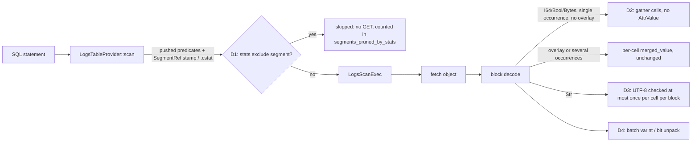

# ADR-2121: Skip logs objects by column statistics at plan time, and cut per-cell work in declared-column builds

- Status: Accepted (2026-09-29); implementation tracked on epic #2121
- Date: 2026-09-29
- Refs: #2121, #2066, #2086, #2130, #2135, ADR-0087, ADR-0090, ADR-0093, ADR-0094, ADR-0099, ADR-0850, ADR-0873, ADR-1413, ADR-2023, ADR-2066

## Context

Ravel's logs path (RLOG v4, SQL through DataFusion) was compared with
DataFusion 54.1.0 reading the same ClickBench corpus as Parquet, on one
c6a.4xlarge with gp2 and RustFS on loopback, at main 2257dced2. The
measurements are on #2121 (Stage 0 and 0b):

| | Ravel | DataFusion, Parquet on the same RustFS | DataFusion, local disk |
|---|---|---|---|
| Cold, 43 statements | 1,712.7 s | 252.2 s | 180.2 s |
| Hot, best of runs 2-3 | 91.3 s (42 statements; q33 fails) | 58.5 s | 40.8 s |

**Cold is bytes, the same bytes for every statement.**
- The 40 cold statements that scan (all but q1 and q7, which are answered in
  about 0.5 s without opening an object, and q33, which failed) take
  42.6-43.3 s each and read 11.24-11.93 GB. Every scan statement opens all
  2,617 objects whole
  (`logs_whole_object_opens = 2617`), because the cost-based default
  (ADR-2023) resolves to whole-object reads on this profile.
- On q37-q43 (`CounterID = 62`), block pruning inside the objects already
  skips 98% of blocks, and only 145 of the 2,617 segments hold a surviving
  block. The other 2,472 objects are still fetched in full. Nothing skips
  them before the fetch, although the catalog already holds each segment's
  declared-column min/max (the `SegmentRef` stamp, ADR-0850/0873, and the
  `.cstat` part, ADR-1413). Today that min/max feeds only
  `LogsScanExec::partition_statistics`.

**Hot is CPU-bound, and most of the CPU is the scan's decode.**
- In hot runs the server keeps 10-14 of 16 cores busy.
- The frame-pointer profiles cover 99-100% of the server's CPU. Over the 42
  successful statements (964.8 CPU-s), the shares are:

| Where the CPU goes | Share of hot CPU |
|---|---|
| Logs scan decode + Arrow build (inclusive) | 62.9% |
| ... Str columns built through `build_declared_str_columnar` | 12.9% |
| ... zstd decompression of cached pages | 12.2% |
| ... UTF-8 validation (leaf frames) | 9.6% |
| ... per-cell `AttrValue` materialisation | 8.0% (15.5% on single-column statements, 23.0% on q37-q43) |
| ... varint and bit unpacking (leaf frames) | 7.1% |
| DataFusion aggregation, exclusive of the scan | 19.7% |
| Kernel page faults and madvise | 5.0% |

- Projection is already correct: only the projected columns' pages are
  decoded (0.13 GB for q2), and every statement takes the columnar path
  (ADR-0099). The cost is per cell, in two places:
  - `build_declared_columnar_array`'s `I64`, `Bool` and `Bytes` arms resolve
    every cell through `DeclaredResolver::merged_value`, which builds an
    `AttrValue` and matches it back into an Arrow builder. That happens even
    when a block's column comes from one record-level page, with no resource
    or scope value that could supply or override a cell. That accounts for
    the 8.0%. The `Str` arm (`build_declared_str_columnar`) does not go
    through `merged_value`.
  - A declared `Str` cell's UTF-8 is validated more than once. Choosing the
    winning occurrence of a key (`winning_idx`) tests every candidate
    cursor's `present_at`. For a `Str` cursor that is `str_at(i).is_some()`,
    which validates the bytes only to learn whether the cell is present,
    because a non-UTF-8 cell counts as absent. The builder then calls
    `str_at` again to read the value. Of the 9.6% of hot CPU in UTF-8
    validation, 5.3% sits under that presence search and 4.2% under
    `build_columnar_batches`.
- The single-column statements (q2-q4, q8, q11-q12, q20, q25-q27, q30) spend
  6-17 CPU-s each. 90.3% of that is scan decode. DataFusion finishes them in
  0.05-0.35 s wall.

**A per-statement floor sits outside the CPU profile.**
- q1, q7 and q37-q43 run in 0.42-0.48 s on 0.1-2.8 CPU-s.
- On the same SHA, q1 took 0.198 s about 1.3 h after load and 0.46 s within
  minutes of it. The load hour's catalog state is the unverified suspect.
- DataFusion's 0.002 s is not the target, because its CLI times the query
  after CREATE EXTERNAL TABLE has already listed the files and read the
  footers.

## Decision

### D1. Skip segments by declared-column statistics when the logs scan is planned

`LogsTableProvider::scan` drops a segment before `LogsScanExec` is built when
a pushed-down predicate provably excludes every row of that segment. It uses
the segment's own min/max from the stamp its `SegmentRef` carries or from the
`.cstat` entry, under the same carrier rules `declared_min_max_all` already
applies: the stamp read off the `SegmentRef` itself, a `.cstat` entry joined
by content hash then identity, and conflicting carriers treated as absent.

- **Predicates.** The predicates are exactly the ones `extract_logs` (in
  `logs_pushdown.rs`, under ADR-0093) already turns into prune-only
  `NumRange` for the reader's block pruning:
  - `<`, `<=`, `>`, `>=`, `=` and `BETWEEN` on a declared `I64` or `Bool`
    column, against a literal of exactly the declared type;
  - `IN` on a declared `I64` column, as its one envelope range, in both
    forms `extract_logs` recognises: a literal `IN` list, and the
    same-column `col = v1 OR col = v2 OR ...` that DataFusion's simplifier
    rewrites a small `IN` into before the scan sees it;
  - the `ts` window.

  Everything `extract_logs` declines, D1 declines too, including `!=`, `NOT`
  and a general `OR`. The arms `extract_logs` produces are intersected, so a
  segment is skipped when any one arm's range is disjoint from the segment's
  [min, max].
- **Conservative by construction.** A segment is skipped only when stats are
  present and exact for that column in that segment, and the predicate is
  false over the closed interval [min, max] for every value (NULL rows never
  satisfy a comparison, so a segment of all NULLs is skippable for any
  comparison).
- **Floats.** No declared float type exists yet. When one lands, its arm
  inherits `NumRange`'s float contract before D1 may use it.
- **Str columns.** They are excluded from this ADR because
  `declared_min_max_all` declines them. A later task may add them once
  `.cstat` Str bounds are proven exact.
- **Erasure.** A segment with pending erasure is pruned only by the same rule;
  skipping a segment never returns a row, so erasure cannot be violated by
  it.
- **Distributed coordinator.** When a distributed coordinator is installed,
  `LogsTableProvider::scan` returns the fan-out plan before it extracts any
  predicate, and filters are re-applied above that plan. D1 prunes nothing
  on that path, and this ADR leaves it that way.
- **Visibility.** The pruned count is reported:
  - as `segments_pruned_by_stats` on the scan's `EXPLAIN ANALYZE` metrics;
  - in query accounting, next to `segments_pruned` (postings), so a report
    can say which mechanism skipped what.

A skipped segment is never fetched, so it costs no GET, no bytes and no
admission. `max_segments` admission still counts the resolved snapshot, not
the survivors. This ADR does not change admission.

### D2. Gather `I64`, `Bool` and `Bytes` declared columns without a per-cell `AttrValue`

The v4 decoded block holds a declared column as one `Vec<Option<i64>>`,
`Vec<Option<bool>>` or byte-string vector per FIELD_DIR column. The Arrow
array is built over the block's surviving rows, so every build is a gather
through the surviving row indices.

When the block's key has exactly one record-level occurrence of the
declared type and no resource or scope value can supply or override any
surviving row, `build_declared_columnar_array` gathers that column's cells
straight into the Arrow builder for its `Int64`, `Boolean` or `Binary`
array. It does not call `merged_value` and constructs no `AttrValue`. The
condition is decided once per block, from the same `DeclaredPlan`
`merged_value` consults. Every other block keeps today's per-cell path
unchanged, including the ADR-0090 decision 7 rule that a wrong-variant
record value reads NULL. This is ADR-0099 decision 2's direct construction,
applied to the declared arms that still go through the row-path resolver.

The gather is correct only if it produces the same array as the per-cell
path. A property test drives both over generated blocks, including:
- resource and scope overlays;
- NULLs;
- several occurrences of one key under different types;
- surviving-row subsets.

It asserts that the arrays are equal. The `Str` arm is untouched by D2.

### D3. Validate a declared `Str` cell's UTF-8 at most once per block

A declared `Str` column stays a `Dictionary(Int32, Utf8)` array on every
path (ADR-0099 decision 5): the fast-path batch and the fallback batch must
validate against one schema. What changes is how often a cell's bytes are
validated:
- **Presence.** Choosing the winning occurrence of a key no longer validates
  UTF-8 to decide whether a `Str` cursor is present at a row. The decision
  "a non-UTF-8 cell counts as absent and falls through to the resource or
  scope value" is kept. It is made once per cell and reused by the build
  that follows. Presence is not reduced to "bytes present", because that
  would change which occurrence wins.
- **Plain pages.** A plain-page cell validated for presence is not validated
  again when its `&str` is appended.
- **Dict pages.** These already validate each dictionary entry once per
  block. They are unchanged.

Results do not change: a cell that reads NULL or falls through today does
the same afterwards. A property test compares the arrays before and after
over generated blocks that include invalid UTF-8 cells, dictionary entries
and multi-occurrence keys. No `unsafe`, and no unchecked UTF-8 conversion;
the workspace denies both.

### D4. Decode integer pages in batches

The per-value varint and bit-unpacking loops that produce the decoded
columns D2 gathers from decode a page's
values into a reusable buffer in one pass per page. They stop going through
per-value iterator calls.
- This is decoder implementation only. The RLOG v4 page encoding does not
  change, so nothing here touches a frozen format.
- The existing codec property tests pin equivalence.

### D5. Measure the floor before changing anything for it

The 0.2-0.46 s per-statement floor is latency, and its cause is a hypothesis.
- The first task measures it:
  - a fresh load;
  - q1, q7 and q37-q43 timed within 10 minutes of load and again after the
    load hour seals and folds;
  - resolve, plan and scan wall time captured per statement;
  - listing and GET counts per phase.
- #2130 has to be fixed first, or the resolve bytes stay unattributed.
- A floor fix is dispatched only if that measurement names the phase and the
  mechanism. Otherwise the floor is reported as out of scope, with its
  number.

### Sequencing with the work other issues own

- **D1** touches `ravel-sql` (logs provider and scan) and can start at once.
- **D2 and D3** sit in `ravel-sql/src/logs_scan.rs` and consume the
  reader's decoded page view. They wait for D1, which also touches
  `logs_scan.rs`. Epic #2135 (RLOG v5; its ADR is not yet on main) adds
  object-level string dictionaries and new integer encodings behind that
  view. So before D2
  dispatches, it is re-checked against whatever view is on main then. If
  v5 has landed, D2 builds on v5's view and not on v4's.
- **D4** touches the integer decode paths in `ravel-codec` and
  `crates/ravel-logseg`. That is where #2135 adds its decode arms, and where
  the #2066 branch (perf/2066-sparse-assembly) rewrites `reader.rs`. D4
  waits until both have landed, and is re-scoped against their decoders.
  If #2135's own decoders already decode a page in one pass, D4 is closed as
  done by #2135 rather than duplicated.
- This ADR changes no RLOG format, so it adds nothing to #2135's version
  bump.
- q33's pool exhaustion (23% of its CPU in page faults) is the memory-budget
  work sequenced after #2086. It is outside this ADR.

### Targets and bars

Each band is checked by the same Stage 0 procedure on a fresh c6a.4xlarge
with the same corpus and geometry, using the build that lands the last
task. If RLOG v5 (#2135) lands before that measurement, v5 changes the
bytes and the decode cost, and these v4 bands no longer describe what is
measured. In that case the baseline is re-run on a v5 build just before
this epic's first task lands, and the bands are re-derived from it using
the same rules. The bands move only in a comment on #2121 posted before the
final measurement runs.
- **Hot, total of 42 statements:** at most 84 s. A miss is anything above
  88 s.
  - The ceilings: D2 removes at most the 8.0% `AttrValue` share, and D3 at
    most the 5.3% UTF-8 share under the presence search. Together that is
    13.3% of hot CPU, so if wall time scales with CPU the floor is 91.3 s x
    0.867, about 79 s.
  - D4 (at most 7.1%) is not counted here, because it may land as part of
    #2135 instead.
  - The band allows for the part of wall time that does not scale with CPU.
- **Single-column statements (q2-q4, q8, q11-q12, q20, q25-q27, q30):** hot
  at most 13.5 s in total, against 15.1 s today. A miss is anything above
  14.3 s. Their ceiling is the 15.5% `AttrValue` share plus at most the
  6.2% UTF-8 share, so the floor is about 11.8 s.
- **Cold, total:** at most 1,500 s. A miss is anything above 1,540 s.
  - Each skipped segment saves about 42.7 s / 2,617 of a statement's cold
    time.
  - The driver runs statements one at a time, so savings add across
    statements.
  - The ceiling is 2,472 skips on each of q37-q43, about 280 s. That is the
    count whose blocks all prune today. Segment-level min/max can admit more
    segments than block pruning does.
  - The band assumes at least 2,000 skips on each, about 228 s.
- **`segments_pruned_by_stats`:** each of q37-q43 must skip at least 2,000
  segments. The exact per-statement figures, and the figure for every other
  statement with an extracted arm (q20's `UserID = ...` among them), are
  computed from a dump of the tenant's stamps and posted on #2121 before
  the final run. The seven statements do not share one predicate set, so
  they are not expected to share one figure.
- **No regressions:**
  - every statement returns the same rows as main;
  - no statement's hot time regresses by more than 15%, the per-statement
    noise floor.

**Cold parity is not a target of this ADR.**
- DataFusion's 252 s comes from reading only the projected columns' byte
  ranges.
- On the 36 non-selective statements, Ravel's cold time moves only with a
  projection-aware fetch on loopback. That is ADR-2023's default and the
  device-time policy ADR-2066 considered and did not adopt.
- Reaching cold parity means reopening that decision. This ADR does not do
  that silently.

## Rejected alternatives

- **Cache decompressed pages to remove the 12.2% zstd share.** The compressed
  corpus is 11.24 GB, and hot depends on it staying resident in the RAM
  tier on a 30 GiB box. Decompressed pages are larger, so the resident set
  would no longer fit and hot would turn into refetches. A cheaper codec is a
  writer and format decision, which belongs under the format-change process,
  not here.
- **Filter-first decode (decode filter columns, then the rest for survivors).**
  The measurement does not support it:
  - pages decoded are already only the projected columns;
  - the exclusive filter-evaluation share is about 10%;
  - the selective statements prune 98% of blocks before decode.

  The cost that shows is per cell, which D2-D4 attack directly.
- **Build declared `Str` columns as `StringArray` with one whole-buffer UTF-8
  check.** This is ruled out on two counts:
  - ADR-0099 decision 5 fixes the declared `Str` projection as
    `Dictionary(Int32, Utf8)`, so a mixed fast-path and fallback batch would
    fail schema validation.
  - A whole-buffer check would fail a statement on one bad cell that reads
    NULL today.
- **A new RLOG version with tail directories (a "v5").** The hot costs are
  in value decoding, which a directory layout does not change. The cold
  costs are in fetch shape, which ADR-2066 and ADR-2023 govern. The #2066
  layout study already found geometry, not format, to be the lever.
- **Tune DataFusion's aggregation.** It is 19.7% of hot CPU, and it is the
  same engine the Parquet baseline runs, so it closes no gap between the
  two.
- **Prune at catalog resolve, inside `ravel-catalog`.** The logs pushdown
  predicates are extracted in `ravel-sql` and the resolve API takes none.
  Pruning where the provider already holds both the predicates and the
  per-segment stats changes no crate boundary and no resolve contract, and
  it still runs before any object is fetched.

## Consequences

- Statements with a selective predicate on a declared `I64`, `Bool` or `ts`
  column fetch only the objects whose stats admit a match. The saving grows
  with how tightly data is clustered by that column inside objects. On
  ClickBench's load order, `CounterID` clusters into 145 of 2,617 objects.
- A segment without stats, which is a pre-stamp segment with no `.cstat`, is
  never skipped. The cost of that is a fetch, never a wrong answer.
- D2's fast path and the per-cell path must stay equal. The property test is
  the contract, and a change to the merge rules has to extend it.
- No persistent format, key layout or proto changes. No admission or
  acknowledgement semantics change.
- Measurement depends on #2130: until whole-object reads attribute their
  bytes to the scan phase, per-phase cost reports stay incomplete on this
  path.
