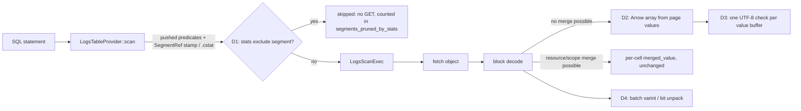

# ADR-2121: Skip logs objects by column statistics at plan time, and decode declared columns without per-cell values

- Status: Accepted (2026-09-29); implementation tracked on epic #2121
- Date: 2026-09-29
- Refs: #2121, #2066, #2086, #2130, ADR-0087, ADR-0090, ADR-0094, ADR-0850, ADR-0873, ADR-1413, ADR-2023, ADR-2066

## Context

Ravel's logs path (RLOG v4, SQL through DataFusion) was compared with
DataFusion 54.1.0 reading the same ClickBench corpus as Parquet, on one
c6a.4xlarge with gp2 and RustFS on loopback, at main 2257dced2. The
measurements are on #2121 (Stage 0 and 0b):

| | Ravel | DataFusion, Parquet on the same RustFS | DataFusion, local disk |
|---|---|---|---|
| Cold, 43 statements | 1,712.7 s | 252.2 s | 180.2 s |
| Hot, best of runs 2-3 | 91.3 s (42 statements; q33 fails) | 58.5 s | 40.8 s |

**Cold is bytes, the same bytes for every statement.**
- Every cold statement takes 42.6-43.3 s and reads 11.24-11.93 GB. Every
  scan statement opens all 2,617 objects whole
  (`logs_whole_object_opens = 2617`), because the cost-based default
  (ADR-2023) resolves to whole-object reads on this profile.
- On q37-q43 (`CounterID = 62`), block pruning inside the objects already
  skips 98% of blocks, and only 145 of the 2,617 segments hold a surviving
  block. The other 2,472 objects are still fetched in full. Nothing skips
  them before the fetch, although the catalog already holds each segment's
  declared-column min/max (the `SegmentRef` stamp, ADR-0850/0873, and the
  `.cstat` part, ADR-1413). Today that min/max feeds only
  `LogsScanExec::partition_statistics`.

**Hot is CPU-bound, and most of the CPU is the scan's decode.**
- In hot runs the server keeps 10-14 of 16 cores busy.
- The frame-pointer profiles cover 99-100% of the server's CPU. Over the 42
  successful statements (964.8 CPU-s), the shares are:

| Where the CPU goes | Share of hot CPU |
|---|---|
| Logs scan decode + Arrow build (inclusive) | 62.9% |
| ... Str columns built through `build_declared_str_columnar` | 12.9% |
| ... zstd decompression of cached pages | 12.2% |
| ... UTF-8 validation (leaf frames) | 9.6% |
| ... per-cell `AttrValue` materialisation | 8.0% (15.5% on single-column statements, 23.0% on q37-q43) |
| ... varint and bit unpacking (leaf frames) | 7.1% |
| DataFusion aggregation, exclusive of the scan | 19.7% |
| Kernel page faults and madvise | 5.0% |

- Projection is already correct: only the projected columns' pages are
  decoded (0.13 GB for q2), and every statement takes the columnar path. The
  cost is per value. `build_declared_columnar_array` resolves every cell
  through `DeclaredResolver::merged_value`, which builds an `AttrValue` and
  then matches it back into an Arrow builder. That happens even when the
  whole column comes from one record-level page, with no resource or scope
  value to merge.
- The single-column statements (q2-q4, q8, q11-q12, q20, q25-q27, q30) spend
  6-17 CPU-s each. 90.3% of that is scan decode. DataFusion finishes them in
  0.05-0.35 s wall.

**A per-statement floor sits outside the CPU profile.**
- q1, q7 and q37-q43 run in 0.42-0.48 s on 0.1-2.8 CPU-s.
- On the same SHA, q1 took 0.198 s about 1.3 h after load and 0.46 s within
  minutes of it. The load hour's catalog state is the unverified suspect.
- DataFusion's 0.002 s is not the target, because its CLI times the query
  after CREATE EXTERNAL TABLE has already listed the files and read the
  footers.

## Decision

### D1. Skip segments by declared-column statistics when the logs scan is planned

`LogsTableProvider::scan` drops a segment before `LogsScanExec` is built when
a pushed-down predicate provably excludes every row of that segment. It uses
the segment's own min/max from the `SegmentRef` stamp or the `.cstat` entry,
under the same carrier rules `declared_min_max_all` already applies: a stamp
joined by segment identity, a `.cstat` entry by content hash then identity,
and conflicting carriers treated as absent.

- **Predicates.** The predicates are exactly the ones `extract_logs` (in
  `logs_pushdown.rs`) already turns into prune-only `NumRange` for the
  reader's block pruning:
  - `<`, `<=`, `>`, `>=`, `=` and `BETWEEN` on a declared `I64` or `Bool`
    column, against a literal of exactly the declared type;
  - `IN` on a declared `I64` column, as its one envelope range;
  - the `ts` window.

  Everything `extract_logs` declines, D1 declines too, including `!=`, `NOT`
  and a general `OR`. The arms `extract_logs` produces are intersected, so a
  segment is skipped when any one arm's range is disjoint from the segment's
  [min, max].
- **Conservative by construction.** A segment is skipped only when stats are
  present and exact for that column in that segment, and the predicate is
  false over the closed interval [min, max] for every value (NULL rows never
  satisfy a comparison, so a segment of all NULLs is skippable for any
  comparison).
- **Floats.** No declared float type exists yet. When one lands, its arm
  inherits `NumRange`'s float contract before D1 may use it.
- **Str columns.** They are excluded from this ADR because
  `declared_min_max_all` declines them. A later task may add them once
  `.cstat` Str bounds are proven exact.
- **Erasure.** A segment with pending erasure is pruned only by the same rule;
  skipping a segment never returns a row, so erasure cannot be violated by
  it.
- **Visibility.** The pruned count is reported:
  - as `segments_pruned_by_stats` on the scan's `EXPLAIN ANALYZE` metrics;
  - in query accounting, next to `segments_pruned` (postings), so a report
    can say which mechanism skipped what.

A skipped segment is never fetched, so it costs no GET, no bytes and no
admission. `max_segments` admission still counts the resolved snapshot, not
the survivors. This ADR does not change admission.

### D2. Build declared-column Arrow arrays straight from the decoded page when no merge is needed

For a block whose declared column comes entirely from the record-level column
page, with no resource or scope value that could supply or override a cell,
`build_declared_columnar_array` builds the Arrow array directly from the
page's decoded values and validity:
- `Int64` from the decoded `i64` vector;
- `Boolean` from the decoded bits;
- `Binary` and `Utf8` from the decoded offsets and value buffer.

It does not call `merged_value` per cell and constructs no `AttrValue`. A
block where a merge is possible keeps today's per-cell path unchanged.

The fast path is correct only if it produces the same array as the per-cell
path. A property test drives both over generated blocks, including blocks
with resource and scope overlays, NULLs, and mixed-type cells that the
declared type does not match (which the per-cell path turns into NULL), and
asserts the arrays are equal. Floats compare by bit pattern.

### D3. Validate UTF-8 once per value buffer, not once per value

A declared `Str` column is built as a `StringArray` from its page's offsets
and value bytes. The validation runs once over the whole value buffer, plus a
check that every offset falls on a character boundary. This is what arrow's
`StringArray::try_new` does. The code no longer allocates and validates a
`String` per value.
- No `unsafe`, and no unchecked conversion. The workspace denies both.
- An invalid page is a typed decode error, exactly as today.

### D4. Decode integer pages in batches

The per-value varint and bit-unpacking loops that feed D2 decode a page's
values into a reusable buffer in one pass per page. They stop going through
per-value iterator calls.
- This is decoder implementation only. The RLOG v4 page encoding does not
  change, so nothing here touches a frozen format.
- The existing codec property tests pin equivalence.

### D5. Measure the floor before changing anything for it

The 0.2-0.46 s per-statement floor is latency, and its cause is a hypothesis.
- The first task measures it:
  - a fresh load;
  - q1, q7 and q37-q43 timed within 10 minutes of load and again after the
    load hour seals and folds;
  - resolve, plan and scan wall time captured per statement;
  - listing and GET counts per phase.
- #2130 has to be fixed first, or the resolve bytes stay unattributed.
- A floor fix is dispatched only if that measurement names the phase and the
  mechanism. Otherwise the floor is reported as out of scope, with its
  number.

### Sequencing with the work other issues own

- **D1** touches `ravel-sql` (logs provider and scan) and can start at once.
- **D2-D4** touch `crates/ravel-logseg/src/reader.rs`, `ravel-codec` and
  `ravel-sql/src/logs_scan.rs`. The #2066 branch (perf/2066-sparse-assembly)
  also rewrites `reader.rs`, so D4 waits until that branch lands. D2 and D3
  sit in `logs_scan.rs` and `ravel-codec` and do not wait.
- q33's pool exhaustion (23% of its CPU in page faults) is the memory-budget
  work sequenced after #2086. It is outside this ADR.

### Targets and bars

Each band is checked by the same Stage 0 procedure on a fresh c6a.4xlarge
with the same corpus and geometry, using the build that lands the last
task.
- **Hot, total of 42 statements:** at most 78 s. A miss is anything above
  82 s. D2+D3+D4 remove at most 24.7% of hot CPU (8.0 + 9.6 + 7.1). That is
  an upper bound on the saving, so it is a lower bound on the time: 91.3 s x
  0.753, about 69 s, if the wall time scales with CPU. The band allows for
  the part that does not.
- **Single-column statements (the 11 above):** hot at most 11 s in total,
  against 15.1 s today.
- **Cold, total:** at most 1,480 s. A miss is anything above 1,530 s. The
  ceiling for D1 is about 42.7 x 2,472/2,617, roughly 40 s per statement on
  q37-q43, or 280 s. That is an upper bound, because it assumes the 145
  surviving segments cost what they cost today.
- **No regressions:**
  - every statement returns the same rows as main;
  - no statement's hot time regresses by more than 15%, the per-statement
    noise floor;
  - `segments_pruned_by_stats` is 2,472 on each of q37-q43 and 0 on the
    others.

**Cold parity is not a target of this ADR.**
- DataFusion's 252 s comes from reading only the projected columns' byte
  ranges.
- On the 36 non-selective statements, Ravel's cold time moves only with a
  projection-aware fetch on loopback. That is ADR-2023's default and the
  device-time policy ADR-2066 considered and did not adopt.
- Reaching cold parity means reopening that decision. This ADR does not do
  that silently.

## Rejected alternatives

- **Cache decompressed pages to remove the 12.2% zstd share.** The compressed
  corpus is 11.24 GB, and hot depends on it staying resident in the RAM
  tier on a 30 GiB box. Decompressed pages are larger, so the resident set
  would no longer fit and hot would turn into refetches. A cheaper codec is a
  writer and format decision, which belongs under the format-change process,
  not here.
- **Filter-first decode (decode filter columns, then the rest for survivors).**
  The measurement does not support it:
  - pages decoded are already only the projected columns;
  - the exclusive filter-evaluation share is about 10%;
  - the selective statements prune 98% of blocks before decode.

  The cost that shows is per cell, which D2-D4 attack directly.
- **A new RLOG version with tail directories (a "v5").** The hot costs are
  in value decoding, which a directory layout does not change. The cold
  costs are in fetch shape, which ADR-2066 and ADR-2023 govern. The #2066
  layout study already found geometry, not format, to be the lever.
- **Tune DataFusion's aggregation.** It is 19.7% of hot CPU, and it is the
  same engine the Parquet baseline runs, so it closes no gap between the
  two.
- **Prune at catalog resolve, inside `ravel-catalog`.** The logs pushdown
  predicates are extracted in `ravel-sql` and the resolve API takes none.
  Pruning where the provider already holds both the predicates and the
  per-segment stats changes no crate boundary and no resolve contract, and
  it still runs before any object is fetched.

## Consequences

- Statements with a selective predicate on a declared `I64`, `Bool` or `ts`
  column fetch only the objects whose stats admit a match. The saving grows
  with how tightly data is clustered by that column inside objects. On
  ClickBench's load order, `CounterID` clusters into 145 of 2,617 objects.
- A segment without stats, which is a pre-stamp segment with no `.cstat`, is
  never skipped. The cost of that is a fetch, never a wrong answer.
- D2's fast path and the per-cell path must stay equal. The property test is
  the contract, and a change to the merge rules has to extend it.
- No persistent format, key layout or proto changes. No admission or
  acknowledgement semantics change.
- Measurement depends on #2130: until whole-object reads attribute their
  bytes to the scan phase, per-phase cost reports stay incomplete on this
  path.
