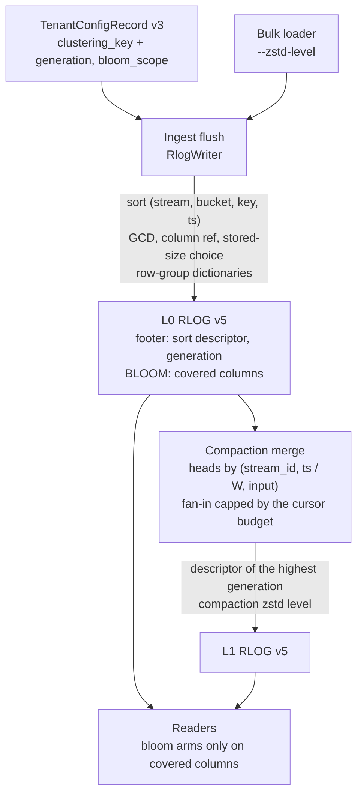

# ADR-2135: RLOG v5, a smaller on-object footprint for wide typed tenants

Status: Proposed. Issue #2135.
Migration class A for the RLOG object (trailer version 4 to 5); class C for the
three additive `TenantConfigRecord` fields (record `format_version` 2 to 3,
under ADR-0066's R1 readers-before-writers rule).
Amends ADR-0029 (sort order, encoding choice, BLOOM layout) and ADR-0699
(row-group dictionaries); both carry an amendment section pointing here.
Leaves ADR-0815 unimplemented and unchanged; see "Relationship to ADR-0815".

## Context

A wide typed logs tenant (the ClickBench `hits` corpus: 99,997,497 rows, 105
columns, loaded by the stock bulk loader into 2,617 objects) stores
11,239,527,807 bytes. Every page of every object was attributed to its column
and encoding by decoding PAGE_DIR, and the page bytes sum exactly to each
object's BLOCKS section:

| Component | Bytes | Share |
|---|---|---|
| Column pages (BLOCKS) | 10,486,922,699 | 93.3% |
| BLOOM, stored uncompressed | 724,676,713 | 6.4% |
| Directories, skip index, footers | 20,348,368 | 0.2% |
| Commit records, catalog, config | 7,580,027 | 0.1% |

Five properties of the current format account for most of the page and bloom
bytes.

1. **Row order is thrown away.** The loader's input is sorted by
   `(CounterID, EventDate, UserID, EventTime)`. The writer re-sorts every
   object by `(stream_ref, ts)`, which interleaves the rows of different users
   inside one stream. Every column that follows the user (user and session
   identifiers, client addresses, screen and window sizes, region) then
   compresses about twice as badly as it would in input order.
2. **Timestamps pay for precision they do not have.** Every `ts` in this
   tenant is a whole second stored in nanoseconds, a multiple of 10^9. No RLOG
   integer codec factors a common divisor out, so FOR and delta pages carry
   about 30 bits per value that are always zero.
3. **`observed_ts` duplicates `ts`.** A bulk load sets observed time to event
   time. The two columns are encoded independently and cost 124 MB each.
4. **Encodings are chosen on the wrong size.** The writer picks each page's
   encoding by its length before zstd (ADR-0029). A FOR bit-packed page is
   often the smallest before zstd and among the largest after it, because bit
   packing hides byte structure from zstd. The zstd level is already writer
   configuration (`RlogConfig::zstd_level`, default 3), but every production
   writer uses the default and nothing lets an operator choose another.
5. **BLOOM covers every string column, sized to a power of two.** The bloom
   inserts every token of every string attribute into a per-block filter
   sized `next_pow2(9.585 n)` bits. On this tenant none of those columns is
   queried by token, and the corpus has no body or severity text, so the
   whole section serves no query. The power-of-two rounding alone wastes
   32.5% of the bloom bits (estimated from the bit fill of 2,879 filters in
   524 objects).

A simulator of the v4 page codecs, run over a 5,097,769-row sample that keeps
the loader's batch geometry, reproduces the measured page bytes to within 0.3%
overall and about 2% per column. Changing one thing at a time, it gives these
reductions in page bytes:

| Change | Page bytes |
|---|---|
| Sort by `(stream, day, user, ts)` inside each object | -13.1% |
| zstd level 19 instead of 3 | -11.9% |
| zstd level 9 | -7.1% |
| Encoding chosen by size after zstd | -6.5% |
| One string dictionary per object instead of per page | -5.5% |
| One zstd frame per column chunk | -4.3% |
| GCD transform plus an `observed_ts` reference | -1.8% |
| Byte-aligned integer layouts, beyond post-zstd choice | -0.2% |
| Compaction into large objects, same `(stream, ts)` sort | +1.3% |

The sort change makes `ts` itself grow from 124 MB to 328 MB, because
timestamps stop increasing within a stream. The GCD transform brings it back
to 139 MB, so the two belong together, and their combined effect is larger
than the sum of the single-change rows.

The combined rows below are each one simulator run with all of the named
changes applied together, not a composition of the rows above. Each is scaled
from the sample to the corpus, and its band is the calibration error: plus or
minus 0.3% on the total and about 2% on any one column. The "bloom scoped"
column removes the whole BLOOM section, which is what the `text` scope of
decision 5 does on this corpus because it has no body or severity text; it
does not model exact filter sizing. Row-group dictionaries were not simulated
in combination, so no row includes them.

| Configuration (one simulator run each) | Tenant total, bloom as today | Bloom scoped to text |
|---|---|---|
| RLOG v4 as written today (measured) | 11.24 GB | 10.51 GB |
| Clustering key, GCD, `observed_ts` reference, zstd 3 | 9.30 GB | 8.58 GB |
| The above with zstd 9 | 8.74 GB | 8.02 GB |
| The above with zstd 19 and post-zstd choice (byte-aligned candidates included, worth about 0.2%) | 8.19 GB | 7.47 GB |

What the codebase already guarantees, which bounds the change:

- No read path depends on `ts` ascending within a stream. Skip-index pruning
  folds per-block min/max and never binary-searches time. `LogsScanExec`
  declares no output ordering, so every `ORDER BY ts` gets an explicit sort.
  Late materialization, distributed slices, PromQL over logs, audit and alert
  scans all sort explicitly.
- The one consumer of within-stream time order is compaction's k-way merge.
  It picks the input with the smallest head `(ts, input_index)`, and two
  properties depend on inputs being time-ordered: byte identity between its
  overlap and eager-all admission modes, and the size of its open-cursor set.
  That set is charged against `merge_cursor_budget_bytes`, and a run whose
  required set exceeds the budget aborts before publishing
  (`MergeCursorBudgetExceeded`). Output content does not depend on input
  order, because every part goes back through the writer, which sorts.
- Parts are closed by memory and stored-size targets even in the middle of
  one stream (issue #711). Before that change a single wide stream held a
  whole hour in one writer at 45.7 GB resident.
- `ravel-codec`'s integer and bloom functions are shared by RSEG and RSPAN.
  Changing them in place changes those formats' bytes with no version bump.
- Compaction reads no `TenantConfigRecord`, and its output objects carry
  `writer_epoch` and `writer_seq` of zero. A per-tenant setting reaches
  compaction only if it travels in the objects, with an ordering that does
  not depend on which writer produced them.

## Decision

1. **A declared clustering key orders rows inside each stream.** A tenant may
   declare a clustering key: one to four of its declared typed attribute
   columns (ADR-0090) and a time bucket width of 1 hour, 6 hours or 1 day. An
   object written for that tenant sorts its records by
   `(stream_ref, ts.div_euclid(bucket), key_1, ..., key_n, ts)`. A tenant with
   no key keeps today's `(stream_ref, ts)` order byte for byte. Key values
   come from the per-record attribute layer only; an absent value sorts first,
   then values in their type's order (i64 numeric, str and bytes bytewise,
   false before true). Ties keep push order, as today. Both writer paths, row
   and columnar, sort on resolved values and stay byte-identical. The bucket
   keeps block time ranges bounded: time pruning inside a stream coarsens to
   the bucket width instead of disappearing. The three widths nest (1 h
   divides 6 h divides 1 d), which decision 2 relies on. Every change to a
   tenant's key, including clearing it, increments a clustering generation
   stored with it. Audit and alert RLOG writers never take a key.

2. **Every v5 object records its sort order, and compaction merges on it.**
   The v5 footer records the object's sort descriptor (bucket width and key
   columns, or none) and the clustering generation it was written under (0
   for a tenant that never set a key). A generation names exactly one key, so
   two objects with the same generation carry the same descriptor.
   - **Output descriptor.** Compaction and erasure rewrite take the
     descriptor of the input with the highest clustering generation. A key
     change therefore reaches compacted data as new data arrives, compaction
     still reads no tenant config, and the choice does not depend on writer
     identity or input order.
   - **Merge order.** The k-way merge orders heads by
     `(stream_id, ts.div_euclid(W), input_index)`, where `W` is the widest
     bucket among the inputs (1 ns when no input has a key, which is today's
     order). Every input, whatever its own key, is sorted on the coarse prefix
     because the widths nest, and both admission modes follow the same rule,
     so they emit the same sequence and stay byte-identical.
   - **Open-cursor set.** With keyed inputs, every input whose slice of a
     stream reaches the current coarse bucket must be open at once. For
     unkeyed inputs the set is ADR-0979's `D`, unchanged. For keyed inputs it
     is at most the number of inputs whose slice of a stream touches one
     bucket, which for a 1-day bucket can be every input of a sealed hour.
     The compactor therefore derives a fan-in cap `F` from
     `merge_cursor_budget_bytes`, and when a bucket's inputs exceed `F` it
     partitions them, in input order, into batches of at most `F` that are
     merged independently. The partition is computed before admission, so
     both modes see the same batches. A keyed bucket is split into more
     parts, never aborted on the key's account; clustering across batches is
     lost, and each part is still sorted by the output descriptor.
   - **Part cuts.** Parts close on the same memory and stored-size targets as
     today, including in the middle of a coarse bucket (issue #711 stands).
     The merge's emission order is deterministic for a fixed input set, so
     the cut points are too. Two parts of one stream may then overlap in key
     and time ranges, which costs pruning precision, not correctness.

3. **Two RLOG-only codecs: a GCD wrapper and a column reference.** Both live
   in `ravel-logseg`, wrapping `ravel-codec`, which is not modified, so RSEG
   and RSPAN bytes and readers do not change.
   - Tag 10, GCD i64: `gcd` varint (at least 2), `base` ivarint, the inner
     encoding tag, then the inner encoding of the quotients. The writer
     computes offsets `v.wrapping_sub(base)` as u64 with `base` the page
     minimum, as the FOR codec does, and offers the candidate only when the
     offsets share a divisor of at least 2 and every quotient `offset / gcd`
     fits in i64. The inner encoding is whatever `encode_i64` picks for the
     quotients, which is one of tags 1 to 6 (it never emits 7, 8 or 9 for
     integers); any other inner tag is `Corrupted`. Decode computes
     `quotient` times `gcd` with a checked u64 multiply and adds it to `base`
     with a wrapping add, which inverts the encoder exactly; a multiply that
     overflows is `Corrupted`, never a panic.
   - Tag 11, column reference: one varint naming a column in the same block
     whose values this column equals row for row, with identical presence. In
     v5 the only permitted pair is `observed_ts` referring to `ts`; any other
     target is `Corrupted`. `ts` has the lowest column id and is always in a
     projection, so it is decoded first.

4. **The writer picks each page's encoding by its stored size, and the level
   is chosen per path.** Every candidate encoding is passed through the page
   envelope (the 512-byte floor, zstd only when strictly smaller), and the
   smallest stored result wins, ties broken by today's priority. The zstd
   level stays writer configuration, as it already is; what changes is that
   each writing path gets its own default and an operator surface: ingest
   (default 3, a server flag), compaction and erasure rewrite (default 9, a
   maintain flag), and the bulk loader (a `--zstd-level` flag, default 3).
   Readers are indifferent to the level.

5. **BLOOM records what it covers, and filters are sized exactly.** A tenant
   chooses a bloom scope: `all` (default, today's behaviour), `undeclared`
   (body, severity text, and string attributes not declared as typed
   columns), or `text` (body and severity text only). The v5 BLOOM section
   starts with the sorted list of column ids its filters cover. A reader
   builds a bloom arm only for a covered column; an arm on an uncovered column
   is never built, so an uncovered column is scanned instead of pruned, and
   no matching row is dropped. Filter size becomes `max(512, ceil(9.585 n))`
   rounded up to a multiple of 512 bits instead of a power of two; the probe
   already reduces the block index modulo the block count. The RLOG builder
   and parser are new functions; RSPAN's bloom is unchanged.

6. **String dictionaries are shared across a row group.** For a string column
   whose distinct values in a row group are at most half its values, the
   column chunk starts with one dictionary page, and each block's page holds
   only bit-packed ids into it (new tags 12, dictionary page, and 13,
   dictionary ids). PAGE_DIR lists the dictionary page first in the chunk. A
   reader that needs any block of the chunk fetches the dictionary page too;
   it sits at the start of the chunk extent the ranged fetcher already reads.
   Both writer paths build the row-group dictionary the same way.

7. **Version and rollout.**
   - **RLOG object.** All of the above is RLOG trailer version 5. Under
     ADR-0531's pre-v1.0 posture for Class A formats, the reader accepts
     exactly version 5, the version-4 reader is deleted in the same change,
     and development stores are wiped or re-ingested.
   - **Tenant config.** `TenantConfigRecord` gains `clustering_key` (field 13,
     with its generation) and `bloom_scope` (field 14) at record version 3.
     The record is Class C and CAS-mutable, which ADR-0531's posture does not
     cover, so ADR-0066's R1 rule applies: one release teaches readers to
     accept `{1, 2, 3}` while the writer still stamps 2 and refuses to set
     either field, and only a later release, after that one has rolled out,
     flips the writer to 3 and enables the setters. Until the flip no tenant
     has a key or a narrowed scope, and every v5 object is written with no
     descriptor and full bloom coverage.
   - **Documents and tools.** The format document is amended in the same
     change as the writer. `ravel-cli rlog inspect` prints the trailer's own
     version, the sort descriptor, the generation and the bloom coverage, and
     a new `ravel-cli rlog footprint` reports bytes per section, column and
     encoding across a tenant's objects, which is how every stage of this work
     is measured on a real load.

### Relationship to ADR-0815

ADR-0815 (Proposed, unimplemented) clusters data across objects at compaction,
leading with event time, to exclude whole objects. This ADR orders rows inside
each stream of an object, at ingest and at compaction, to compress them. It
does not implement or change any ADR-0815 decision. ADR-0815 rejects ingest-time
clustering because it would buffer rows across arrivals and break the pinned
flush identity; decision 1 here buffers nothing, since it only changes the
order in which the writer sorts the rows of one flush that it already sorts
today. If ADR-0815 is later accepted, the sort descriptor from decision 2 is
the per-object record it would read.

## Rejected alternatives

- **One zstd frame per column chunk.** It saves 4.3% alone, less than
  row-group dictionaries, and it breaks three properties the reader relies on:
  per-page crc32c verified before decompression, decoding one block out of a
  row group, and the level-0 block crc defined over pages. Row-group
  dictionaries take most of the same redundancy while keeping pages
  independently decodable.
- **Byte-aligned integer layouts** (FOR and delta at 1, 2, 4 or 8 bytes).
  Once the encoding is chosen after zstd, they add 0.2%, not enough to carry
  two new tags.
- **Raising the level with no other change.** Level 19 alone saves 11.9% of
  pages, but at ingest it multiplies the dominant serialize cost on the
  acknowledgement path, and it leaves the row-order loss, the largest single
  term, in place.
- **Compaction alone.** Larger objects in the same `(stream, ts)` order grow
  the tenant by 1.3%, which matches an earlier post-compaction tenant being
  larger than its source. Object size is not the lever; row order is.
- **Cutting parts only at coarse-bucket boundaries.** It would make one
  `(stream, bucket)` group unsplittable, the shape issue #711 removed after a
  45.7 GB resident compaction, and a 1-day bucket would make that unit 24
  times an hour.
- **Choosing the output descriptor by writer identity.** Compacted objects
  carry `writer_epoch` and `writer_seq` of zero, and the pair is a per-writer
  counter rather than a clock, so the newest key could lose to a stale one
  indefinitely. The clustering generation is stored with the key itself.
- **Removing BLOOM from typed tenants unconditionally.** Several query
  surfaces build equality and word arms on arbitrary string attributes. A
  bloom that silently stopped covering them would drop matching rows.
  Recording coverage in the object and keeping `all` as the default makes the
  saving opt-in and the reader safe.
- **Changing `encode_i64` and the bloom builder in `ravel-codec`.** They are
  shared with RSEG and RSPAN, so an in-place change would alter those formats
  without a version bump. The new behaviour lives in RLOG-only wrappers.
- **Sorting by the key with no time bucket.** It maximises compression but
  lets one block span a stream's whole time range, which costs time pruning
  on organic telemetry, and it removes the nested coarse order that lets
  compaction merge objects written under different keys.
- **Correlated-column encodings beyond `observed_ts`** (other time columns
  against `ts`, addresses against each other, hash columns against their
  strings). Measured on this corpus, the residuals shrink by about 18% at best,
  and the hash columns are not strict functions of their strings.

## Consequences

- On the measured corpus, a tenant that declares a key and scope `text`
  stores about 24% fewer bytes at zstd 3 and about 34% fewer at zstd 19 with
  stored-size choice (11.24 GB to 8.58 GB and to 7.47 GB, within the
  simulator's band). Tenants that declare nothing gain from the GCD transform,
  the `observed_ts` reference, stored-size choice, exact bloom sizing and
  row-group dictionaries, with no change in behaviour.
- Time pruning inside one stream coarsens to the bucket width for a tenant
  that declares a key. Pruning on the key's columns improves, because blocks
  become narrow in them.
- Compaction of a keyed tenant opens more cursors per bucket than today and
  is split into fan-in batches when they exceed the cursor budget, producing
  more parts for that bucket than an unkeyed tenant would.
- Write CPU rises: every candidate encoding is compressed, and higher levels
  compress more slowly. Decompression cost does not depend on the level. Each
  stage reports its serialize and compaction CPU next to its bytes.
- The clustering key and bloom scope cannot be set until the release after
  the one carrying the record-version-3 reader has rolled out.
- Every RLOG object written before this change becomes unreadable by a build
  that includes it, per ADR-0531. Development stores are wiped or re-ingested.
- Golden fixtures, `ravel-cli` inspector fixtures, version assertions in
  tests, and `docs/log-segment-format.md` change together with the version.
