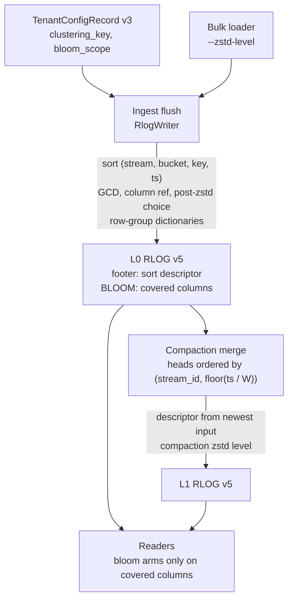

# ADR-2135: RLOG v5, a smaller on-object footprint for wide typed tenants

Status: Proposed. Issue #2135.
Migration class A for the RLOG object (trailer version 4 to 5); class C for the
two additive `TenantConfigRecord` fields (record `format_version` 2 to 3).
Amends ADR-0029 (sort order, frozen zstd level, encoding choice, BLOOM layout)
and ADR-0699 (row-group dictionaries). Leaves ADR-0815 unimplemented and
unchanged; see "Relationship to ADR-0815".

## Context

A wide typed logs tenant (the ClickBench `hits` corpus: 99,997,497 rows, 105
columns, loaded by the stock bulk loader into 2,617 objects) stores
11,239,527,807 bytes. Every page of every object was attributed to its column
and encoding by decoding PAGE_DIR, and the page bytes sum exactly to each
object's BLOCKS section:

| Component | Bytes | Share |
|---|---|---|
| Column pages (BLOCKS) | 10,486,922,699 | 93.3% |
| BLOOM, stored uncompressed | 724,676,713 | 6.4% |
| Directories, skip index, footers | 20,348,368 | 0.2% |
| Commit records, catalog, config | 7,580,027 | 0.1% |

Four properties of the current format account for most of the page and bloom
bytes.

1. **Row order is thrown away.** The loader's input is sorted by
   `(CounterID, EventDate, UserID, EventTime)`. The writer re-sorts every
   object by `(stream_ref, ts)`, which interleaves the rows of different users
   inside one stream. Every column that follows the user (user and session
   identifiers, client addresses, screen and window sizes, region) then
   compresses about twice as badly as it would in input order.
2. **Timestamps pay for precision they do not have.** Every `ts` in this
   tenant is a whole second stored in nanoseconds, a multiple of 10^9. No RLOG
   integer codec factors a common divisor out, so FOR and delta pages carry
   about 30 bits per value that are always zero.
3. **`observed_ts` duplicates `ts`.** A bulk load sets observed time to event
   time. The two columns are encoded independently and cost 124 MB each.
4. **Codec choices are fixed or made on the wrong size.** The writer picks
   each page's encoding by its length before zstd (ADR-0029), then compresses
   at a fixed level 3. A FOR bit-packed page is often the smallest before
   zstd and among the largest after it, because bit packing hides byte
   structure from zstd.
5. **BLOOM covers every string column, sized to a power of two.** The bloom
   inserts every token of every string attribute into a per-block filter
   sized `next_pow2(9.585 n)` bits. On this tenant none of those columns is
   queried by token, and the power-of-two rounding alone wastes 32.5% of the
   bloom bits (estimated from the bit fill of 2,879 filters in 524 objects).

A simulator of the v4 page codecs, run over a 5,097,769-row sample that keeps
the loader's batch geometry, reproduces the measured page bytes to within 0.3%
overall and about 2% per column. Changing one thing at a time, it gives these
reductions in page bytes:

| Change | Page bytes |
|---|---|
| Sort by `(stream, day, user, ts)` inside each object | -13.1% |
| zstd level 19 instead of 3 | -11.9% |
| zstd level 9 | -7.1% |
| Encoding chosen by size after zstd | -6.5% |
| One string dictionary per row group instead of per page | -5.5% |
| One zstd frame per column chunk | -4.3% |
| GCD transform plus an `observed_ts` reference | -1.8% |
| Byte-aligned integer layouts, beyond post-zstd choice | -0.2% |
| Compaction into large objects, same `(stream, ts)` sort | +1.3% |

The sort change makes `ts` itself grow from 124 MB to 328 MB, because
timestamps stop increasing within a stream. The GCD transform brings it back
to 139 MB, so the two belong together. Combined:

| Configuration | Tenant total, bloom as today | Bloom scoped to text |
|---|---|---|
| RLOG v4 as written today | 11.24 GB | 10.51 GB |
| Clustering key, GCD, `observed_ts` reference, zstd 3 | 9.30 GB | 8.58 GB |
| The above with zstd 9 | 8.74 GB | 8.02 GB |
| The above with zstd 19 and post-zstd choice | 8.19 GB | 7.47 GB |
| Every change here, compacted segments | 7.01 GB | 6.29 GB |

What the codebase already guarantees, which bounds the change:

- No read path depends on `ts` ascending within a stream. Skip-index pruning
  folds per-block min/max and never binary-searches time. `LogsScanExec`
  declares no output ordering, so every `ORDER BY ts` gets an explicit sort.
  Late materialization, distributed slices, PromQL over logs, audit and alert
  scans all sort explicitly.
- The one consumer of within-stream time order is compaction's k-way merge.
  It picks the input with the smallest head `ts`, and two properties depend
  on inputs being time-ordered: byte identity between its overlap and
  eager-all admission modes, and its bound on open cursors. Output content
  does not depend on it, because every part goes back through the writer,
  which sorts.
- `ravel-codec`'s integer and bloom functions are shared by RSEG and RSPAN.
  Changing them in place changes those formats' bytes with no version bump.
- Compaction reads no `TenantConfigRecord`; it recovers indexed fields from
  its inputs. A per-tenant setting reaches compaction only if it travels in
  the objects.

## Decision

1. **A declared clustering key orders rows inside each stream.** A tenant may
   declare a clustering key: one to four of its declared typed attribute
   columns (ADR-0090) and a time bucket width of 1 hour, 6 hours or 1 day. An
   object written for that tenant sorts its records by
   `(stream_ref, floor(ts / bucket), key_1, ..., key_n, ts)`. A tenant with no
   key keeps today's `(stream_ref, ts)` order byte for byte. Key values come
   from the per-record attribute layer only; an absent value sorts first, then
   values in their type's order (i64 numeric, str and bytes bytewise, false
   before true). Ties keep push order, as today. Both writer paths, row and
   columnar, sort on resolved values and stay byte-identical. The bucket keeps
   block time ranges bounded: time pruning inside a stream coarsens to the
   bucket width instead of disappearing. The three widths nest (1 h divides
   6 h divides 1 d), which decision 2 relies on. The key is set with
   `typed-attr-column`'s sibling command `clustering-key set` and stored as a
   new `TenantConfigRecord` field. Audit and alert RLOG writers never take a
   key.

2. **Every v5 object records its sort order, and compaction merges on it.**
   The v5 footer records the object's sort descriptor: bucket width and key
   columns, or none. Compaction takes its output descriptor from the input
   with the highest `(writer_epoch, writer_seq)`, so a key change reaches
   compacted data as new data arrives, and compaction still reads no tenant
   config. The k-way merge orders heads by `(stream_id, floor(ts / W))`, where
   `W` is the widest bucket among the inputs (1 ns when no input has a key).
   Every input, whatever its own key, is sorted on that coarse prefix because
   the widths nest, so both admission modes see the same order and stay
   byte-identical. Inputs whose heads share a coarse key are all open at once,
   and the existing cursor budget bounds that set. Parts are cut only at coarse
   key boundaries, and each part is re-sorted by the output descriptor in the
   writer.

3. **Two RLOG-only codecs: a GCD wrapper and a column reference.** Both live
   in `ravel-logseg`, wrapping `ravel-codec`, which is not modified, so RSEG
   and RSPAN bytes and readers do not change.
   - Tag 10, GCD i64: `gcd` varint (at least 2), `base` ivarint, the inner
     encoding tag (1 to 6), then the inner encoding of `(v - base) / gcd`.
     The writer offers it as a candidate whenever a page's values share a
     divisor of at least 2.
   - Tag 11, column reference: one varint naming a column in the same block
     whose values this column equals row for row, with identical presence. In
     v5 the only permitted pair is `observed_ts` referring to `ts`; any other
     target is `Corrupted`. `ts` has the lowest column id and is always in a
     projection, so it is decoded first.

4. **The writer picks each page's encoding by its stored size.** Every
   candidate encoding is passed through the page envelope (the 512-byte floor,
   zstd only when strictly smaller), and the smallest stored result wins, ties
   broken by today's priority. The zstd level is no longer a format constant:
   it is writer configuration with separate values for ingest (default 3),
   compaction and erasure rewrite (default 9), and the bulk loader (a
   `--zstd-level` flag, default 3). Readers are indifferent to the level.

5. **BLOOM records what it covers, and filters are sized exactly.** A tenant
   chooses a bloom scope: `all` (default, today's behaviour), `undeclared`
   (body, severity text, and string attributes not declared as typed
   columns), or `text` (body and severity text only). The v5 BLOOM section
   starts with the sorted list of column ids its filters cover. A reader
   builds a bloom arm only for a covered column; an arm on an uncovered column
   is never built, so an uncovered column is scanned instead of pruned,
   never pruned wrongly. Filter size becomes `max(512, ceil(9.585 n))` rounded
   up to a multiple of 512 bits instead of a power of two; the probe already
   reduces the block index modulo the block count. The RLOG builder and parser
   are new functions; RSPAN's bloom is unchanged.

6. **String dictionaries are shared across a row group.** For a string column
   whose distinct values in a row group are at most half its values, the
   column chunk starts with one dictionary page, and each block's page holds
   only bit-packed ids into it (new tags 12, dictionary page, and 13,
   dictionary ids). PAGE_DIR lists the dictionary page first in the chunk. A
   reader that needs any block of the chunk fetches the dictionary page too;
   it sits at the start of the chunk extent the ranged fetcher already reads.
   Both writer paths build the row-group dictionary the same way.

7. **Version and rollout.** All of the above is RLOG trailer version 5. Under
   ADR-0531's pre-v1.0 posture the reader accepts exactly version 5, the
   version-4 reader is deleted in the same change, and development stores are
   wiped or re-ingested. `TenantConfigRecord` gains `clustering_key` (field
   13) and `bloom_scope` (field 14) at record version 3; the reader accepting
   `{1, 2, 3}` and the writer stamping 3 ship together, as the pre-v1.0
   posture allows. The format document is amended in the same change as the
   writer. `ravel-cli rlog inspect` prints the trailer's own version, the sort
   descriptor and the bloom coverage, and a new `ravel-cli rlog footprint`
   reports bytes per section, column and encoding across a tenant's objects,
   which is how every stage of this work is measured on a real load.

### Relationship to ADR-0815

ADR-0815 (Proposed, unimplemented) clusters data across objects at compaction,
leading with event time, to exclude whole objects. This ADR orders rows inside
each stream of an object, at ingest and at compaction, to compress them. It
does not implement or change any ADR-0815 decision. ADR-0815 rejects ingest-time
clustering because it would buffer rows across arrivals and break the pinned
flush identity; decision 1 here buffers nothing, since it only changes the
order in which the writer sorts the rows of one flush that it already sorts
today. If ADR-0815 is later accepted, the sort descriptor from decision 2 is
the per-object record it would read.

## Rejected alternatives

- **One zstd frame per column chunk.** It saves 4.3% alone, less than
  row-group dictionaries, and it breaks three properties the reader relies on:
  per-page crc32c verified before decompression, decoding one block out of a
  row group, and the level-0 block crc defined over pages. Row-group
  dictionaries take most of the same redundancy while keeping pages
  independently decodable.
- **Byte-aligned integer layouts** (FOR and delta at 1, 2, 4 or 8 bytes).
  Once the encoding is chosen after zstd, they add 0.2%, not enough to carry
  two new tags.
- **Raising the level with no other change.** Level 19 alone saves 11.9% of
  pages, but at ingest it multiplies the dominant serialize cost on the
  acknowledgement path, and it leaves the row-order loss, the largest single
  term, in place.
- **Compaction alone.** Larger objects in the same `(stream, ts)` order grow
  the tenant by 1.3%, which matches an earlier post-compaction tenant being
  larger than its source. Object size is not the lever; row order is.
- **Removing BLOOM from typed tenants unconditionally.** Several query
  surfaces build equality and word arms on arbitrary string attributes. A
  bloom that silently stopped covering them would drop matching rows.
  Recording coverage in the object and keeping `all` as the default makes the
  saving opt-in and the reader safe.
- **Changing `encode_i64` and the bloom builder in `ravel-codec`.** They are
  shared with RSEG and RSPAN, so an in-place change would alter those formats
  without a version bump. The new behaviour lives in RLOG-only wrappers.
- **Sorting by the key with no time bucket.** It maximises compression but
  lets one block span a stream's whole time range, which costs time pruning
  on organic telemetry, and it removes the nested coarse order that lets
  compaction merge objects written under different keys.
- **Correlated-column encodings beyond `observed_ts`** (other time columns
  against `ts`, addresses against each other, hash columns against their
  strings). Measured on this corpus, the residuals shrink by about 18% at best,
  and the hash columns are not strict functions of their strings.

## Consequences

- A tenant that declares a key and a narrower bloom scope stores about 24%
  fewer bytes at zstd 3, about 34% fewer at zstd 19 with post-zstd choice,
  and about 44% fewer with every change here on compacted segments, on the
  measured corpus. Tenants that declare nothing gain from the
  GCD transform, the `observed_ts` reference, post-zstd choice, exact bloom
  sizing and row-group dictionaries, with no change in behaviour.
- Time pruning inside one stream coarsens to the bucket width for a tenant
  that declares a key. Pruning on the key's columns improves, because blocks
  become narrow in them.
- Write CPU rises: every candidate encoding is compressed, and higher levels
  compress more slowly. Decompression cost does not depend on the level. Each
  stage reports its serialize and compaction CPU next to its bytes.
- Every RLOG object written before this change becomes unreadable by a build
  that includes it, per ADR-0531. Development stores are wiped or re-ingested.
- Golden fixtures, `ravel-cli` inspector fixtures, version assertions in
  tests, and `docs/log-segment-format.md` change together with the version.
