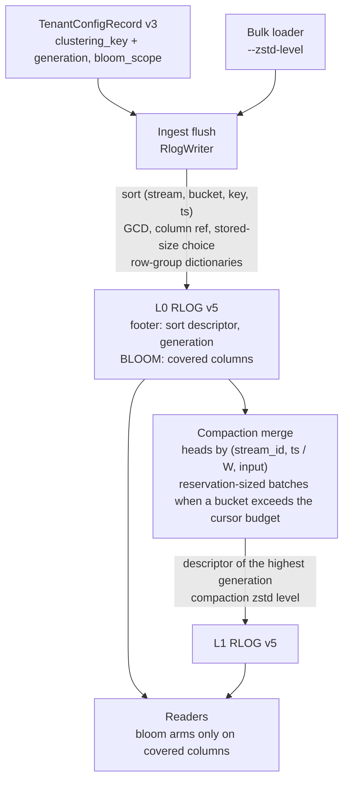

# ADR-2135: RLOG v5, a smaller on-object footprint for wide typed tenants

Status: Accepted. Issue #2135.
Migration class A for the RLOG object (trailer version 4 to 5); class C for the
two `TenantConfigRecord` fields, 13 and 14, added at record `format_version`
3 under ADR-0066's R1 readers-before-writers rule (the clustering generation
is a field of the key message, not of the record).
Amends ADR-0029 (sort order, encoding choice, BLOOM layout) and ADR-0699
(row-group dictionaries); both carry an amendment section pointing here.
Amends ADR-0815 decision 2's field shape (`TenantConfigRecord.clustering_key`)
and leaves its other decisions unimplemented and unchanged; ADR-0815 carries an
amendment section pointing here. See "Relationship to ADR-0815".

## Context

A wide typed logs tenant (the ClickBench `hits` corpus: 99,997,497 rows, 105
columns, loaded by the stock bulk loader into 2,617 objects) stores
11,239,527,807 bytes. Every page of every object was attributed to its column
and encoding by decoding PAGE_DIR, and the page bytes sum exactly to each
object's BLOCKS section:

| Component | Bytes | Share |
|---|---|---|
| Column pages (BLOCKS) | 10,486,922,699 | 93.3% |
| BLOOM, stored uncompressed | 724,676,713 | 6.4% |
| Directories, skip index, footers | 20,348,368 | 0.2% |
| Commit records, catalog, config | 7,580,027 | 0.1% |

Five properties of the current format account for most of the page and bloom
bytes.

1. **Row order is thrown away.** The loader's input is sorted by
   `(CounterID, EventDate, UserID, EventTime)`. The writer re-sorts every
   object by `(stream_ref, ts)`, which interleaves the rows of different users
   inside one stream. Every column that follows the user (user and session
   identifiers, client addresses, screen and window sizes, region) then
   compresses about twice as badly as it would in input order.
2. **Timestamps pay for precision they do not have.** Every `ts` in this
   tenant is a whole second stored in nanoseconds, a multiple of 10^9. No RLOG
   integer codec factors a common divisor out, so FOR and delta pages carry
   about 30 bits per value that are always zero.
3. **`observed_ts` duplicates `ts`.** A bulk load sets observed time to event
   time. The two columns are encoded independently and cost 124 MB each.
4. **Encodings are chosen on the wrong size.** The writer picks each page's
   encoding by its length before zstd (ADR-0029). A FOR bit-packed page is
   often the smallest before zstd and among the largest after it, because bit
   packing hides byte structure from zstd. The zstd level is already writer
   configuration (`RlogConfig::zstd_level`, default 3), but every production
   writer uses the default and nothing lets an operator choose another.
5. **BLOOM covers every string column, sized to a power of two.** The bloom
   inserts every token of every string attribute into a per-block filter
   sized `next_pow2(9.585 n)` bits. On this tenant none of those columns is
   queried by token, and the corpus has no body or severity text, so the
   whole section serves no query. The power-of-two rounding alone wastes
   32.5% of the bloom bits (estimated from the bit fill of 2,879 filters in
   524 objects).

A simulator of the v4 page codecs, run over a 5,097,769-row sample that keeps
the loader's batch geometry, reproduces the measured page bytes to within 0.3%
overall and about 2% per column. Changing one thing at a time, it gives these
reductions in page bytes:

| Change | Page bytes |
|---|---|
| Sort by `(stream, day, user, ts)` inside each object | -13.1% |
| zstd level 19 instead of 3 | -11.9% |
| zstd level 9 | -7.1% |
| Encoding chosen by size after zstd | -6.5% |
| One string dictionary per object instead of per page | -5.5% |
| One zstd frame per column chunk | -4.3% |
| GCD transform plus an `observed_ts` reference | -1.8% |
| Byte-aligned integer layouts, beyond post-zstd choice | -0.2% |
| Compaction into large objects, same `(stream, ts)` sort | +1.3% |

The sort change makes `ts` itself grow from 124 MB to 328 MB, because
timestamps stop increasing within a stream. The GCD transform brings it back
to 139 MB, so the two belong together, and their combined effect is larger
than the sum of the single-change rows.

The combined rows below are each one simulator run with all of the named
changes applied together, not a composition of the rows above. Each is scaled
from the sample to the corpus, and its band is the calibration error: plus or
minus 0.3% on the total and about 2% on any one column. The "bloom scoped"
column removes the whole BLOOM section, which is what the `text` scope of
decision 5 does on this corpus because it has no body or severity text; it
does not model exact filter sizing. Row-group dictionaries were not simulated
in combination, so no row includes them.

| Configuration (one simulator run each) | Tenant total, bloom as today | Bloom scoped to text |
|---|---|---|
| RLOG v4 as written today (measured) | 11.24 GB | 10.51 GB |
| Clustering key, GCD, `observed_ts` reference, zstd 3 | 9.30 GB | 8.58 GB |
| The above with zstd 9 | 8.74 GB | 8.02 GB |
| The above with zstd 19 and post-zstd choice (byte-aligned candidates included, worth about 0.2%) | 8.19 GB | 7.47 GB |

What the codebase already guarantees, which bounds the change:

- No read path depends on `ts` ascending within a stream. Skip-index pruning
  folds per-block min/max and never binary-searches time. `LogsScanExec`
  declares no output ordering, so every `ORDER BY ts` gets an explicit sort.
  Late materialization, distributed slices, PromQL over logs, audit and alert
  scans all sort explicitly.
- The one consumer of within-stream time order is compaction's k-way merge.
  It picks the input with the smallest head `(ts, input_index)`, and two
  properties depend on inputs being time-ordered: byte identity between its
  overlap and eager-all admission modes, and the size of its open-cursor set.
  That set is charged against `merge_cursor_budget_bytes`, and a run whose
  required set exceeds the budget aborts before publishing
  (`MergeCursorBudgetExceeded`). Output content does not depend on input
  order, because every part goes back through the writer, which sorts.
- Parts are closed by memory and stored-size targets even in the middle of
  one stream (issue #711). Before that change a single wide stream held a
  whole hour in one writer at 45.7 GB resident.
- `ravel-codec`'s integer and bloom functions are shared by RSEG and RSPAN.
  Changing them in place changes those formats' bytes with no version bump.
- Compaction reads no `TenantConfigRecord`, and its output objects carry
  `writer_epoch` and `writer_seq` of zero. A per-tenant setting reaches
  compaction only if it travels in the objects, with an ordering that does
  not depend on which writer produced them.

## Decision

1. **A declared clustering key orders rows inside each stream.** A tenant may
   declare a clustering key: one to four of its declared typed attribute
   columns (ADR-0090) and a time bucket width of 1 hour, 6 hours or 1 day. An
   object written for that tenant sorts its records by
   `(stream_ref, ts.div_euclid(bucket), key_1, ..., key_n, ts)`. A tenant with
   no key keeps today's `(stream_ref, ts)` order byte for byte. Key values
   come from the per-record attribute layer only; an absent value sorts first,
   then values in their type's order (i64 numeric, str and bytes bytewise,
   false before true). Ties keep push order, as today. Both writer paths, row
   and columnar, sort on resolved values and stay byte-identical. The bucket
   keeps block time ranges bounded: time pruning inside a stream coarsens to
   the bucket width instead of disappearing. The three widths nest (1 h
   divides 6 h divides 1 d), which decision 2 relies on. Every change to a
   tenant's key, including clearing it, increments a clustering generation
   stored with it. Clearing a key keeps the config record's field 13 present
   (see the #2145 amendment) with the incremented generation and an empty
   column list, so generation 0 means
   only "never set" (superseded by the scope generation amendment below:
   neither a key nor a bloom scope ever set), and a clear outranks every
   earlier key in compaction exactly as a new key would. A bloom scope
   change increments the same generation, and so does a change to the
   declared typed column names under the `undeclared` scope (see the scope
   generation amendment below). The cleared form lives in the config
   record's field 13; an object written after a clear carries no sort
   descriptor and that nonzero generation, because the footer decoder
   refuses a descriptor with no key columns (see the #2145 amendment). Audit
   and alert RLOG writers never take a key.

2. **Every v5 object records its sort order, and compaction merges on it.**
   The v5 footer records the object's sort descriptor (bucket width and key
   columns, or none) and the clustering generation it was written under (0
   for a tenant that never set a key or a bloom scope). A generation names
   exactly one key, one bloom scope value and, under `undeclared`, one
   declared column set (the scope generation amendment below), so two
   objects with the same generation carry the same descriptor and apply the
   same bloom scope rule.
   - **Output descriptor.** Compaction and erasure rewrite take the
     descriptor of the input with the highest clustering generation. A key
     change therefore reaches compacted data as new data arrives, compaction
     still reads no tenant config, and the choice does not depend on writer
     identity or input order. The bloom scope comes from the same input, the
     first in input order on a generation tie (see the #2143 amendment).
   - **Merge order.** The k-way merge orders heads by
     `(stream_id, ts.div_euclid(W), input_index)`, where `W` is the widest
     bucket among the inputs (1 ns when no input has a key, which is today's
     order). Every input, whatever its own key, is sorted on the coarse prefix
     because the widths nest, and both admission modes follow the same rule,
     so when both complete they emit the same sequence and write the same
     bytes. `EagerAll` charges a batch's reservations at once and can refuse
     a batch `Overlap` merges (see the #2143 amendment).
   - **Open-cursor set.** When `W` is wider than 1 ns, every input whose
     slice of a stream reaches the current coarse bucket must be open at
     once, keyed or not. In a merge where no input is keyed the set is
     ADR-0979's `D`, unchanged. Otherwise `Overlap` opens every pending input
     whose slice of the stream starts in or before the current coarse bucket,
     including one whose slice ends before that bucket, so the open set can
     exceed the inputs touching any one bucket (see the #2143 amendment). For
     a 1-day bucket it can be every input of a sealed hour.
   - **Batches sized by reservation.** Before admission, for each stream, the
     compactor sums the `cursor_reservation_bytes` of the inputs touching each
     coarse bucket, using the SKIP_IDX bounds admission already reads. If no
     bucket's sum exceeds `merge_cursor_budget_bytes`, the stream merges in
     one pass as above, as one batch that admission can still refuse (see the
     #2143 amendment). If one does, the stream's inputs are partitioned in
     input order, greedily on the running sum of their reservations, into
     batches whose sum stays within the budget, and each batch is merged on
     its own. Reservations differ widely between inputs, which is why the cap
     is on bytes, not on a count of inputs. The partition depends only on the
     input set, so both admission modes see the same batches. A single input
     whose own reservation exceeds the budget aborts exactly as it does today
     in an unkeyed merge; batching adds no abort of its own. Batches merge one
     after another into the same part sink, so batching adds no part boundary
     and a part holding several batches is sorted and clustered as one; only
     a target-driven cut can leave two parts of one stream overlapping in key
     and time ranges (see the #2143 amendment).
   - **Part cuts.** Parts close on the same memory and stored-size targets as
     today, including in the middle of a coarse bucket (issue #711 stands).
     The merge's emission order is deterministic for a fixed input set, so
     the cut points are too. Two parts of one stream may then overlap in key
     and time ranges, which costs pruning precision, not correctness.

3. **Two RLOG-only codecs: a GCD wrapper and a column reference.** The
   shared `Enc` registry in `ravel-codec` gains variants for tags 10 to 13
   (this decision and decision 6), because PAGE_DIR validates every page's
   tag through it. That is an additive change to the enum only: no existing
   encoder or decoder in `ravel-codec` changes its output or accepts a new
   tag, the RSEG and RSPAN decoders refuse tags 10 to 13 with their existing
   typed error (a test in each pins it), and their bytes do not change. The
   encode and decode logic for the new tags lives in `ravel-logseg`.
   RSEG already has a GCD codec for timestamps (`TS_GCD_I64`, ADR-0092
   decision 6), which divides each value by the page's divisor directly and
   so only fires when every value is a multiple of it. The RLOG codec takes
   offsets from the page minimum first, so a page whose values share no
   divisor but whose gaps do still qualifies; that is also why its overflow
   rules below had to be stated.
   - Tag 10, GCD i64: `gcd` varint (at least 2), `base` ivarint, the inner
     encoding tag, then the inner encoding of the quotients. The writer
     computes offsets `v.wrapping_sub(base)` as u64 with `base` the page
     minimum, as the FOR codec does, and offers the candidate only when the
     offsets share a divisor of at least 2 and every quotient `offset / gcd`
     fits in i64. The inner encoding is whatever `encode_i64` picks for the
     quotients, which is one of tags 1 to 6 (it never emits 7, 8 or 9 for
     integers); any other inner tag is `Corrupted`. Decode computes
     `quotient` times `gcd` with a checked u64 multiply and adds it to `base`
     with a wrapping add, which inverts the encoder exactly; a multiply that
     overflows is `Corrupted`, never a panic.
   - Tag 11, column reference: one varint naming a column in the same block
     whose values this column equals row for row, with identical presence. In
     v5 the only permitted pair is `observed_ts` referring to `ts`; any other
     target is `Corrupted`. `ts` has the lowest column id and is always in a
     projection, so it is decoded first.

4. **The writer picks each page's encoding by its stored size, and the level
   is chosen per path.** Every candidate encoding is passed through the page
   envelope (the 512-byte floor, zstd only when strictly smaller), and the
   smallest stored result wins, ties broken by today's priority. The zstd
   level stays writer configuration, as it already is; what changes is that
   each writing path gets its own default and an operator surface: ingest
   (default 3, a server flag), compaction and erasure rewrite (default 9, a
   maintain flag), and the bulk loader (a `--zstd-level` flag, default 3).
   Readers are indifferent to the level.

5. **BLOOM records what it covers, and filters are sized exactly.** A tenant
   chooses a bloom scope: `all` (default, today's behaviour), `undeclared`
   (body, severity text, and string attributes not declared as typed
   columns), or `text` (body and severity text only). The v5 BLOOM section
   starts with the sorted list of column ids its filters cover. A reader
   builds a bloom arm only for a covered column; an arm on an uncovered column
   is never built, so an uncovered column is scanned instead of pruned, and
   no matching row is dropped. Filter size becomes `max(512, ceil(9.585 n))`
   rounded up to a multiple of 512 bits instead of a power of two; the probe
   already reduces the block index modulo the block count. The RLOG builder
   and parser are new functions; RSPAN's bloom is unchanged. Compaction
   carries the scope over from one input, the one decision 2 takes the
   descriptor from (see the #2143 amendment).

6. **String dictionaries are shared across a row group.** For a string column
   whose distinct values in a row group are at most half its values, and
   whose chunk then stores strictly smaller that way than on per-block value
   pages (see the #2145 amendment), the
   column chunk starts with one dictionary page, and each block's page holds
   only bit-packed ids into it (new tags 12, dictionary page, and 13,
   dictionary ids). The dictionary page belongs to the chunk, not to a
   block. PAGE_DIR lists it first in the chunk with a block index equal to
   the group's `block_count`, one past its last block, which no v4 entry can
   carry; every other page keeps its block. It is outside every block's
   level-0 crc. Every reader verifies the dictionary page's own PAGE_DIR
   crc32c before decoding any id against it, on every path, including a
   whole-block read, so a corrupt dictionary is a `Corrupted` error for every
   block of the chunk, never wrong strings. PAGE_DIR's decoder relaxes three
   rules for this page only: its block index may equal `block_count`, it
   may precede block 0 in the chunk although the index otherwise ascends,
   and it may take a chunk's page count one past two per block. Any other
   page that breaks those rules, or a second dictionary page in one chunk,
   is still `Corrupted`. The ranged fetch plans pages by surviving block, and
   the dictionary page belongs to none, so both the projected page ranges
   and the block decode (`decode_v4_block_with`, which reads pages through
   `read_block_pages_with_dicts`) take the dictionary page for every kept
   chunk that has one, whichever of its blocks survive. A scan, and a ranged
   decode of a stream span or a row group, verifies and decodes each
   dictionary page once and shares it among the chunk's blocks it reads
   (see the #2145 amendment). Both writer paths build
   the row-group dictionary the same way. Every object of the measured
   corpus is a single row group, so the -5.5% measured for one dictionary
   per object is the row-group figure there, and an upper bound for
   compacted objects that hold several row groups.

7. **Version and rollout.**
   - **RLOG object.** All of the above is RLOG trailer version 5. Under
     ADR-0531's pre-v1.0 posture for Class A formats, the reader accepts
     exactly version 5, the version-4 reader is deleted in the same change,
     and development stores are wiped or re-ingested.
   - **Tenant config.** `TenantConfigRecord` gains `clustering_key` (field 13,
     with its generation) and `bloom_scope` (field 14) at record version 3.
     The record is Class C and CAS-mutable, which ADR-0531's posture does not
     cover, so ADR-0066's R1 rule applies: one release teaches readers to
     accept `{1, 2, 3}` while the writer still stamps 2 and refuses to set
     either field (narrowed by the rollout opt-in amendment below), and only
     a later release, after that one has rolled out, flips the writer to 3
     and enables the setters. Until the flip no tenant has a key or a
     narrowed scope (see the rollout opt-in amendment), and every v5 object
     is written with no descriptor and full bloom coverage.
   - **Documents and tools.** The format document is amended in the same
     change as the writer. `ravel-cli rlog inspect` prints the trailer's own
     version, the sort descriptor, the generation and the bloom coverage, and
     a new `ravel-cli rlog footprint` reports bytes per section, column and
     encoding across a tenant's objects, which is how every stage of this work
     is measured on a real load.



### Relationship to ADR-0815

ADR-0815 (Proposed, unimplemented) clusters data across objects at compaction,
leading with event time, to exclude whole objects. This ADR orders rows inside
each stream of an object, at ingest and at compaction, to compress them. It
implements no ADR-0815 decision and changes one: ADR-0815 decision 2 reserved
`TenantConfigRecord.clustering_key` for a single declared column name or an
EventTime sentinel, added without a version bump, and this ADR gives that
field (field 13) decision 1's key instead, as the `ClusteringKeyConfig`
message (one to four columns, a bucket width, a generation) at record
version 3 (decision 7). ADR-0815's amendment section records that its
decision 2, if implemented, reads this message rather than adding a field of
its own.
Every other ADR-0815 decision is unchanged. ADR-0815 rejects ingest-time
clustering because it would buffer rows across arrivals and break the pinned
flush identity; decision 1 here buffers nothing, since it only changes the
order in which the writer sorts the rows of one flush that it already sorts
today. If ADR-0815 is later accepted, the sort descriptor from decision 2 is
the per-object record it would read.

## Rejected alternatives

- **One zstd frame per column chunk.** It saves 4.3% alone, less than
  row-group dictionaries, and it breaks three properties the reader relies on:
  per-page crc32c verified before decompression, decoding one block out of a
  row group, and the level-0 block crc defined over pages. Row-group
  dictionaries take most of the same redundancy while keeping pages
  independently decodable.
- **Byte-aligned integer layouts** (FOR and delta at 1, 2, 4 or 8 bytes).
  Once the encoding is chosen after zstd, they add 0.2%, not enough to carry
  two new tags.
- **Raising the level with no other change.** Level 19 alone saves 11.9% of
  pages, but at ingest it multiplies the dominant serialize cost on the
  acknowledgement path, and it leaves the row-order loss, the largest single
  term, in place.
- **Compaction alone.** Larger objects in the same `(stream, ts)` order grow
  the tenant by 1.3%, which matches an earlier post-compaction tenant being
  larger than its source. Object size is not the lever; row order is.
- **Cutting parts only at coarse-bucket boundaries.** It would make one
  `(stream, bucket)` group unsplittable, the shape issue #711 removed after a
  45.7 GB resident compaction, and a 1-day bucket would make that unit 24
  times an hour.
- **Choosing the output descriptor by writer identity.** Compacted objects
  carry `writer_epoch` and `writer_seq` of zero, and the pair is a per-writer
  counter rather than a clock, so the newest key could lose to a stale one
  indefinitely. The clustering generation is stored with the key itself.
- **Removing BLOOM from typed tenants unconditionally.** Several query
  surfaces build equality and word arms on arbitrary string attributes. A
  bloom that silently stopped covering them would drop matching rows.
  Recording coverage in the object and keeping `all` as the default makes the
  saving opt-in and the reader safe.
- **Changing `encode_i64` and the bloom builder in `ravel-codec`.** They are
  shared with RSEG and RSPAN, so an in-place change would alter those formats
  without a version bump. The new behaviour lives in RLOG-only wrappers; the
  only `ravel-codec` change is the additive `Enc` variants of decision 3,
  which no RSEG or RSPAN path accepts.
- **Sorting by the key with no time bucket.** It maximises compression but
  lets one block span a stream's whole time range, which costs time pruning
  on organic telemetry, and it removes the nested coarse order that lets
  compaction merge objects written under different keys.
- **Correlated-column encodings beyond `observed_ts`** (other time columns
  against `ts`, addresses against each other, hash columns against their
  strings). Measured on this corpus, the residuals shrink by about 18% at best,
  and the hash columns are not strict functions of their strings.

## Consequences

- On the measured corpus, a tenant that declares a key and scope `text`
  stores about 24% fewer bytes at zstd 3 and about 34% fewer at zstd 19 with
  stored-size choice (11.24 GB to 8.58 GB and to 7.47 GB, within the
  simulator's band). Tenants that declare nothing gain from the GCD transform,
  the `observed_ts` reference, stored-size choice, exact bloom sizing and
  row-group dictionaries, with no change in behaviour.
- Time pruning inside one stream coarsens to the bucket width for a tenant
  that declares a key. Pruning on the key's columns improves, because blocks
  become narrow in them.
- Compaction of a keyed tenant opens more cursors per bucket than today, and
  a merge holding any keyed input admits its unkeyed inputs per bucket too.
- Write CPU rises: every candidate encoding is compressed, and higher levels
  compress more slowly. Decompression cost does not depend on the level. Each
  stage reports its serialize and compaction CPU next to its bytes.
- The clustering key and bloom scope cannot be set until the release after
  the one carrying the record-version-3 reader has rolled out, except behind
  the operator opt-in the rollout opt-in amendment describes. While the
  writer release is rolling out, a node still on the reader-only build reads
  a version-3 record but refuses to rewrite it, so a tenant config change
  routed to that node fails with a refusal to rewrite a newer record until
  the rollout finishes.
- Keyed compaction may merge a stream in reservation-sized batches. The
  batches share one part sink, so batching adds no part boundary of its own
  (see the #2143 amendment).
- L1 part size on a wide tenant is set by the memory split target, which is
  now derived from the host's memory budget rather than fixed at 256 MiB
  (see the #2351 amendment).
- Every RLOG object written before this change becomes unreadable by a build
  that includes it, per ADR-0531. Development stores are wiped or re-ingested.
- Golden fixtures, `ravel-cli` inspector fixtures, version assertions in
  tests, and `docs/log-segment-format.md` change together with the version.

## Amendment (2026-09-30): the rollout opt-in writes version 3 before the flip (issue #2146)

<!-- amendment-applies: sections="Decision|Consequences" pointer="rollout opt-in amendment" -->
<!-- amendment-supersedes: phrase="refuses to set either field" pointer="rollout opt-in amendment" -->
<!-- amendment-supersedes: phrase="no tenant has a key" pointer="rollout opt-in amendment" -->
<!-- amendment-supersedes: phrase="every v5 object is written with no descriptor and full bloom coverage" pointer="rollout opt-in amendment" -->

Decision 7 had the writer refuse both tenant config fields until a later
release flipped it to record version 3. The storage-layout setters instead
take an opt-in token, and `StorageLayoutWrite::ReadersRolledOut` is the
exception before the flip: given it, `TenantConfig::set_clustering_key`,
`TenantConfig::clear_clustering_key` and `TenantConfig::set_bloom_scope`
write the field, and `set_tenant_config` stamps the record version 3.

- Passing `ReadersRolledOut` asserts that every process reading the bucket's
  tenant config accepts record versions 1, 2 and 3. Nothing checks that
  assertion. If it is false, a process whose reader predates version 3
  refuses the version-3 record, so on that process the tenant's lifecycle
  refresh and ingest overlay fail closed as on any failed read of the record.
- A config carrying neither field still writes version 2 byte for byte. A
  cleared key keeps field 13 present, so the record stays at version 3.
- The later global flip only makes version 3 the default; it is no longer the
  first release in which a version-3 record can exist.
- An opted-in tenant can therefore have a key or a narrowed bloom scope
  before the flip, and the ingest flush writes its v5 objects with a sort
  descriptor and narrowed bloom coverage.

## Amendment (2026-10-01): batches share one part sink, admission is narrower than the batch rule, and the bloom scope follows the generation (issue #2143)

<!-- amendment-applies: sections="Decision|Consequences" pointer="#2143 amendment" -->
<!-- amendment-supersedes: phrase="clustering across batches is lost" pointer="#2143 amendment" -->
<!-- amendment-supersedes: phrase="which yields more parts for that stream than an unbatched merge" pointer="#2143 amendment" -->
<!-- amendment-supersedes: phrase="so they emit the same sequence and stay byte-identical" pointer="#2143 amendment" -->
<!-- amendment-supersedes: phrase="every input whose slice of the stream touches one bucket" pointer="#2143 amendment" -->

Decision 2 as first written said that a batched stream yields more parts and
that clustering across batches is lost, that both admission modes stay
byte-identical, and that the open-cursor set of a keyed merge is the inputs
touching one bucket. Decision 5 did not say where a compacted object's bloom
scope comes from. The implementation differs on each point, and decisions 2
and 5 and the Consequences now carry the corrected text in place:

- **Batches.** Batches of one stream merge one after another into the same
  part sink. A batch boundary is not a part boundary, and the writer sorts
  each part by the output descriptor, so a part holding records of several
  batches is sorted and clustered as one. Only a cut on the memory or
  stored-size target can leave two parts of one stream overlapping in key and
  time ranges, as decision 2's "Part cuts" already allows. Earlier wording
  held that a batched stream yields more parts, clustering across batches is
  lost, and batching yields more parts for that stream than an unbatched
  merge; none of that holds.
- **Admission modes.** Both modes see the same batches, and when both
  complete they write the same bytes. They do not always both complete:
  `EagerAll` charges every reservation of a batch at once, while `Overlap`
  charges an open cursor at its reconciled residency, so `EagerAll` can
  refuse a batch that `Overlap` merges. The earlier wording, so they emit the
  same sequence and stay byte-identical, held only when both complete.
- **Open-cursor set.** The per-bucket sum decides only whether to batch.
  `Overlap` opens every pending input whose slice of the stream starts in or
  before the frontier's coarse bucket, including one whose slice ends before
  that bucket, so the open set is not bounded by every input whose slice of
  the stream touches one bucket, and a stream that is one batch can still be
  refused at admission.
- **Bloom scope.** Compaction takes the bloom scope of the same input it takes
  the descriptor from: the input with the highest clustering generation, the
  first such input in input order on a tie. The scope carries over, not the
  covered column names, so a string column only other inputs carry is covered
  or not by that scope's rule. A bloom scope change is to bump the clustering
  generation as a key change does; the catalog does that in the CLI task of
  issue #2146. Until it lands, a scope-only change leaves the generation as it
  was, and inputs written under two scopes at one generation resolve by the
  tie rule: the scope reaches compacted data when an input written under it
  is the first input at the highest generation.

## Amendment (2026-10-01): a bloom scope change takes a clustering generation (issue #2146)

<!-- amendment-applies: sections="Decision" pointer="scope generation amendment" -->
<!-- amendment-supersedes: phrase="generation 0 means only" pointer="scope generation amendment" -->

Decision 1 incremented the clustering generation only on a key change, so
two objects written under one generation could carry different bloom
coverage. A bloom scope change now takes a generation of its own, and a
generation names one key, one bloom scope value and, under `undeclared`, one
declared column set.

- `TenantConfig::set_bloom_scope` increments the clustering generation when
  the scope changes and leaves the key's columns and bucket width as they
  were. Setting the scope already stored changes nothing and takes no
  generation.
- The generation lives in field 13, so a tenant that never set a key gets
  field 13 in its cleared form (no columns) at the new generation. Generation
  0 therefore means that neither the key nor the bloom scope was ever set.
- `set_tenant_config` refuses a config whose bloom scope differs from the
  stored record's unless `set_bloom_scope` produced it, and refuses a scope
  change at the stored record's generation. A config built without reading
  the record cannot reset a narrowed scope to `all` this way.
- `TenantConfig::clear_clustering_key` refuses a key that is already absent,
  cleared or never set, instead of taking another generation for no change.
- Under `undeclared` the writer leaves the record's declared typed column
  names out of bloom coverage, so a change to that name set moves the
  coverage as a scope change does. `set_tenant_config` takes the stored
  generation plus one itself for a write at the stored generation whose
  declared name set differs from the stored record's, keeping the key, or
  writing field 13 in its cleared form when there is none. A retype or a
  reorder of the same names keeps the generation, as does any declared
  column change under `all` or `text`. The generation is taken after the
  write gate, so a declared column change that drops or retypes a key column
  is still refused.
- The `ravel-cli` storage layout commands read the record, apply one setter
  and write back with `TenantConfig::write_if_unchanged` against the version
  they read, so a record another writer changed in between refuses the
  command with `CasConflict` instead of being overwritten.

## Amendment (2026-10-01): a cleared key in the object footer, the block decode seam, and the dictionary choice (issue #2145)

<!-- amendment-applies: sections="Decision" pointer="#2145 amendment" -->
<!-- amendment-supersedes: phrase="read_block_columns" pointer="#2145 amendment" -->
<!-- amendment-supersedes: phrase="Clearing a key keeps the field present" pointer="#2145 amendment" -->

Three statements in the Decision did not match the implementation, and
decisions 1 and 6 now carry the corrected text in place:

- **A cleared key.** Decision 1 said clearing a key keeps "the field" present
  with an empty column list. That holds for the tenant config record, whose
  field 13 keeps the incremented generation and no columns. It does not hold
  for an RLOG object: the footer decoder refuses a sort descriptor with no key
  columns ("0 key columns, not 1..=4"), so an object written after a clear
  carries no descriptor and the clear's nonzero generation. A footer with no
  descriptor and a nonzero generation can also come from a bloom scope or
  declared-column change on a tenant that never set a key (the scope
  generation amendment), and generation 0 in a footer means neither a key
  nor a bloom scope was ever set.
- **The block decode seam.** Decision 6 named `read_block_columns` as the
  subset decode that takes a kept chunk's dictionary page. No function of
  that name exists. The seam is `decode_v4_block_with`, which reads the wanted
  columns' pages, dictionary pages included, through
  `read_block_pages_with_dicts`. A scan and a ranged decode of a stream span
  or a row group keep each dictionary they decode for the rest of its row
  group, so each dictionary page is crc-checked and decoded once per chunk
  rather than once per block; only a successful decode is kept, so a corrupt
  dictionary still fails every block of its chunk. Scan statistics still
  charge the page to every block that reads it, and the compaction path
  decodes it per block.
- **The dictionary choice.** Decision 6 read as if every string chunk with at
  most half as many distinct values as values is stored on a dictionary. That
  is the condition for trying one. The writer then compares the dictionary
  form's stored bytes, PAGE_DIR entries included, with the per-block value
  pages and keeps the dictionary only when it is strictly smaller, as
  decision 4 does for every page.

The decisions landed in these pull requests:

- Decisions 2, 5 and 7 (the RLOG v5 object: footer sort descriptor and
  clustering generation, BLOOM covered columns and exact sizing): #2173.
- Decision 7 (the tenant config record version 3 reader): #2162.
- Decisions 3 and 4 (GCD and column-reference codecs, encoding chosen by
  stored size): #2211.
- Decisions 1 and 5 (the writer's clustering key sort and bloom scope):
  #2231; the ingest flush writing them from tenant config: #2252.
- Decision 6 (row-group dictionaries): #2261.
- Decision 7 (the opted-in setters, see the rollout opt-in amendment): #2262.
- Decisions 4 and 7 (the loader's zstd level, the clustering key and bloom
  scope show commands): #2274.
- Decisions 2, 4 and 5 (compaction on the descriptor, its zstd level and
  bloom scope): #2276.

- Decision 7 (the CLI commands that set and clear a clustering key and set
  a bloom scope, and the scope and declared-column generation bumps, see the
  scope generation amendment): #2281.

With that last pull request every decision has an implementation on main,
and the status moved from Proposed to Accepted.

## Amendment (2026-10-02): L1 part size follows host memory (issue #2351)

<!-- amendment-applies: sections="Consequences" pointer="#2351 amendment" -->

The compactor closes an L1 part on whichever of two targets it reaches
first: the memory split target `l1_part_memory_target_bytes`, which sizes
the decoded record heap of one merge, and the stored-size target
`max_l1_part_bytes`, which bounds the encoded object. The memory split
target had a fixed default of 256 MiB. A decoded record on the 104-column
measurement corpus is about 8 KiB, so that default closed every part at
about 32k rows and 2.1 MB stored, far below the 256 MiB stored-size target.
Compacting that corpus produced 3,461 L1 parts from 2,617 L0 inputs: under
the old default the part count could exceed the L0 count, and compaction
added objects instead of removing them.

When the operator does not set it, the RLOG merge's memory split target is
now derived from the memory budget the process runs under. Three terms
decide it, and the floor is applied last:

```text
budget = memory - overhead reserve - merge cursor budget   (at least 0)
reserve = min(2 GiB, max(memory / 4, non-budget floor))   (ADR-1170)
target = max( min( budget / 8 / concurrent_merges,
                   claim lease * 10 MiB/s / 2,
                   8 GiB ),
              256 MiB )
```

`ravel-server` uses its resolved `memory_budget_bytes` (memory less its
overhead reserve, 2 GiB from 8 GiB of memory up and set by ADR-1170's
small-host reserve amendment below it, issue #2607)
and its maintenance unit concurrency; `ravel-cli
maintain` uses the host's total memory, capped by a cgroup memory limit on
Linux, less the same reserve, and its bucket concurrency (1 for
`compact-bucket`). Both then deduct the merge cursor budget (ADR-0979
decision 4, 20 GiB by default), which the merge is allowed to hold on top of
the part it is building: a 32 GiB host under `compact-bucket` divides
`32 - 2 - 20 = 10 GiB` and derives 1.25 GiB; `ravel-server` on a 30 GiB host
divides `30 - 2 - 20 = 8 GiB` and derives 256 MiB at its default unit
concurrency of 4. `compact-tenant` deducts the whole 20 GiB whatever its
bucket concurrency, because it splits that budget between its buckets;
`ravel-server` deducts the per-merge figure once. An unknown budget falls
back to 256 MiB, and an explicit flag wins and is used as given. Part size
therefore follows host memory: on the same corpus a 4 GiB target holds
about 500k rows, about 34 MB stored. The 8 GiB ceiling keeps a large host
from building one part whose decoded heap dominates the process. The 256 MiB
floor binds while `budget / 8 / concurrent_merges` is at most 256 MiB.

The lease term is the third. The RLOG stored-size cap follows the derived
target (below), and ADR-1029 decision 3 warns when the claim lease is under
twice the time to encode and upload one cap-sized part at 10 MiB/s. A 4 GiB
cap needs a lease of about 820 s against the 300 s default, so without the
term the defaults would warn at startup. The lease term caps the target at
`lease * 10 MiB/s / 2`, 1500 MiB at 300 s, so the check is quiet at the
defaults. The floor wins over it: a lease under about 51 s still gets 256 MiB
and the check does warn, which is the operator's explicit choice. Both
binaries report which term bound the target.

The derived value reaches the RLOG merge only, together with a stored-size
cap for that merge. The RSPAN merge has no stored-size target and stays at
the fixed 256 MiB unless the operator sets the flag, which reaches both
merges. The startup lease check sizes the largest part as the larger of the
shared `max_l1_part_bytes` and the RLOG cap.

The stored-size target remains the operator's cap on object size, with one
addition: the RLOG merge reads `rlog_max_l1_part_bytes` when set, and the
binaries set it equal to the derived memory target. An explicit
`--max-l1-part-bytes` sets the RLOG and the shared cap together. The
derivation never raises the shared `max_l1_part_bytes` (RSEG still reads
it), so an operator who wants smaller objects on a large host lowers it, and
the exact-encode probe closes the part there regardless of the memory split
target.

The cap follows the target so the probe stays opt-in. Raising the memory
target above a 256 MiB stored cap made the stored cap the binding target on
compressible data: the uncompressed payload proxy that schedules the probe
reaches the cap long before the encoded object does, and each probe clones the
whole in-progress part. A part's proxy never exceeds its decoded-heap
estimate (every proxy term is at most the matching heap term; the three fixed
charges are pinned by compile-time assertions in `rlog.rs`), so with the cap
at or above the memory target the memory target fires first and no probe
runs. The `derived_defaults_run_zero_probes_and_close_on_the_memory_target`
test pins zero probes at a derived target and shows probes at a cap of half
the target and at a quarter of it.
