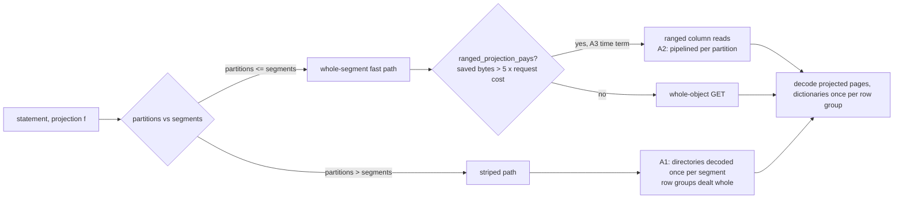

# ADR-2414: narrow projections read ranged on S3, and a lone statement gets the tenant's SQL share

Status: Proposed. Issue #2414.
Amends ADR-2023 (the cost-based fetch policy's rate on the reference store
profile), ADR-1170 (the derived per-query SQL share) and ADR-0954 (the spill
eligibility predicate); each carries an amendment section pointing here. No
persistent format changes.

## Context

The full reference-suite run on real S3 (issue #1248, main `affb0260e`, the
16-vCPU 32 GB reference box, the compacted tenant of 219 RLOG v5 objects,
7,741,962,796 bytes, 99,997,497 rows, 104 declared typed columns) measured
the read path with per-run accounting, cold (server restart and page-cache
drop before each statement). Two findings, both reproduced with one variable
changed at a time (Stage 0 comments on issues #862 and #837):

1. A one-column statement, `SELECT COUNT(*) FROM logs WHERE "AdvEngineID"
   <> 0`, costs the same under every shipped configuration, for different
   reasons:

   | configuration | wall | scan GETs | wire bytes | decompressed bytes |
   |---|---|---|---|---|
   | default (`cost-based`, 32 partitions) | 7,201 ms | 240 | 7,741,962,796 | 184,108,825 |
   | `latency-first`, 256 store GETs in flight, 8 partitions | 8,150 ms | 918 | 194,213,453 | 220,576,798 |
   | `latency-first`, 256 in flight, 219 partitions (one per segment) | 992 ms | 918 | 194,213,453 | 220,576,798 |
   | `latency-first` via `--fetch-concurrency 256` (256 partitions) | 7,809 ms | 699 | 137,029,034 | 4,656,911,808 |

   - The default policy reads every object whole: the `s3-intra-region-2026`
     store cost profile prices transfer at zero, `resolve_cost_based_rate`
     returns `u64::MAX`, and `LogSegmentFetcher::ranged_projection_pays`
     fails at its first comparison for any projection. The statement is
     network-bound at 1.07 GB/s.
   - The ranged read moves 2.5% of the bytes and decompresses within 20% of
     the whole-object figure, but the whole-segment fast path walks a
     partition's segments one at a time, so its wall time is the number of
     round trips per partition (918 over 8 partitions is about 115 each)
     times the request latency (about 70 ms measured from the box), not the
     bytes. One partition per segment is the only configuration that lets
     the fetch concurrency do its work.
   - When the partition count exceeds the segment count, the fast path
     refuses (`FewerSegmentsThanPartitions`) and `owned_work` deals single
     blocks to partitions, about 56 per object; every open decodes the
     directory sections again (SKIP_IDX, PAGE_DIR and FIELD_DIR in
     `fetch_object_v4`, all four in `RlogReader::from_source`, PAGE_DIR a
     third time for the read gate's `max_block_uncompressed_len`). About
     12,200 opens times three PAGE_DIR decodes is the 4.66 GB. This is also
     why the tuned arm lost on the compacted layout in #1248 after winning on
     the 2,617-object L0 layout.

2. The statement `SELECT "WatchID", "ClientIP", COUNT(*) AS c,
   SUM("IsRefresh"), AVG("ResolutionWidth") FROM logs GROUP BY "WatchID",
   "ClientIP" ORDER BY c DESC LIMIT 10` (q33) is refused under the stock
   configuration: it reserves 10,855,811,936 bytes at peak (about 100M
   groups at 108 bytes), the derived per-query pool is 25% of memory
   (8,225,948,672 on the reference box), and the per-tenant pool, 50%
   (16,451,897,344), would hold it. With a 16 GiB per-query pool it runs in
   10.6 s cold and 10.1 s warm. ADR-0954's spill would not apply either: its
   eligibility predicate (`plan_nodes_are_spill_classifiable`) does not
   admit a `Sort` node, which the statement's `ORDER BY ... LIMIT` carries.

## Decision

### Track A: narrow projections

A1. **Directories are decoded once per (query, segment) on every route.**
The striped path carries the decoded footer directories (STREAM_DIR,
FIELD_DIR, SKIP_IDX, PAGE_DIR) beside the footer in the per-segment plan
state, and both `fetch_object_v4` and `RlogReader::from_source` take them
from there; the read gate's job size comes from the already-decoded
`PageDir` rather than a third decode. Striping deals whole row groups, not
single blocks, so a row group's dictionaries are decoded once per partition
that owns it. Pinned by an accounting test on a multi-row-group fixture
scanned with more partitions than segments: the striped route's scan-phase
`decompressed_bytes` for a 1-of-N projection equals the whole-object fast
path's figure for the same projection plus exactly one fetch-side
SKIP_IDX + PAGE_DIR + FIELD_DIR; today that assertion fails by
(blocks - 1) times the directory total.

A2. **A partition's ranged reads are pipelined across its segments.** The
whole-segment fast path prefetches the ranges of its next segments while the
current one decodes, bounded by its share of the store GET concurrency
(`store_get_concurrency / partitions`, at least 2), so a partition's wall
time is its bytes over its share of throughput, not its round trips times
the latency. Pinned by a `FaultStore::hold` test: with a partition owning
three segments and the first segment's range GET held, the second segment's
range GETs are issued before the hold releases; today they are not.

A3. **The cost-based policy carries a time term, so a narrow projection on
S3 reads ranged.** A request's cost in bytes is the bytes one connection
transfers during one request's latency, `request_latency *
per_connection_throughput`, from the store cost profile beside its prices
(the reference profile records the figures measured from the reference box:
about 70 ms and about 90 MB/s, so about 6.3 MB per request), and the
resolved rate is the larger of the price-derived rate and the time-derived
one. `resolve_cost_based_rate` therefore returns a finite rate on the
intra-region profile, the routing threshold stays at its configured value,
and `ranged_projection_pays` applies its existing break-even (five request
costs of saved bytes, 512 KiB floor): a 35 MB object at a 3% projection
saves 34 MB against a 31 MB break-even and reads ranged; a 3 MB L0 object
saves under 3 MB and reads whole. The startup line names which term
produced the rate. The partition count is unchanged (derived from cores);
with A2 that is enough.

Expected on the reference box after A1 to A3 (pre-registered on #1248
before A3's run): the one-column statement under 2 s cold at 32 partitions,
the stock cold suite under 200 s over 42 statements (241.4 s measured), and
the tuned arm re-registered for 35 MB objects with partitions at most the
segment count.

### Track B: q33 in the stock configuration

B1. **The derived per-query SQL pool is the tenant's share.**
`SQL_QUERY_MEMORY_PERCENT` becomes 50, equal to `SQL_TENANT_MEMORY_PERCENT`,
so a lone statement may reserve the tenant's whole SQL share. Concurrency is
bounded exactly as before: the per-query pool nests inside the per-tenant
pool, which refuses the byte that would exceed 50%, so N statements share
the same total they share today and the ten-connection envelope (#2367) does
not move. An explicit `--sql-max-query-bytes` still wins and is still
clamped to the tenant ceiling. On the reference box q33 then runs inside
16,451,897,344 against its 10.86 GB peak.

B2. **Spill eligibility admits `Sort` over a spill-exact aggregate.**
`plan_nodes_are_spill_classifiable` admits `LogicalPlan::Sort` (with or
without a fetch), so a configured spill (ADR-0954, environment-gated as
today) applies to q33's plan shape on hosts whose tenant share is below its
peak. A float group key still refuses, and a `Sort` over a non-aggregate
plan is still not spill-eligible (no operator in it spills exactly).

B3. **q33 is a measured statement.** The reference-suite registration on
#1248 carries q33 in the stock arm with a pre-registered band (about 11 s
cold, 10 s warm from Stage 0); a null for it is a miss.

## Rejected alternatives

- **Enable spill by default.** Needs a scratch location and a scratch
  ceiling the server has no derivation for, and the statement fits in memory
  on the reference box once the per-query share is right. Spill stays the
  operator's lever for smaller hosts (B2 makes it apply).
- **A streaming top-k for q33.** The running `COUNT` is a lower bound on a
  group's final count and not monotone with the final order, so no exact
  short-cut exists over an unsorted scan (noted on #837).
- **Raise only the tenant share.** The refusal comes from the per-query
  ceiling; 25% was chosen so four statements could share one tenant's SQL
  budget, which the tenant pool already enforces by refusing the fifth byte.
- **Derive the partition count from the segment count per query.** It fixes
  the ranged fast path's latency bound for this corpus but not the general
  case (a query over 10,000 segments cannot run 10,000 partitions), and it
  leaves the striped path's amplification in place for any query whose
  segment count is below the partition count. A2 fixes the fast path at any
  partition count; A1 fixes the striped path.
- **Make `latency-first` the default on S3.** It is byte-minimal with an
  operator-chosen concurrency, so it would read 3 MB L0 objects ranged where
  the whole read is cheaper, and ADR-2023 measured a threefold concurrent
  throughput loss from a ranged default on a loopback store. The time term
  lets the existing break-even decide per object.

## Consequences

- Narrow projections on S3 move their columns' bytes and finish in the time
  those bytes take; wide statements are unchanged (they fail the break-even
  and read whole, as today).
- A query whose partition count exceeds its segment count no longer pays a
  directory decode per block; the striped route costs what the fast path
  costs plus one fetch-side directory read per segment.
- A lone statement can use the tenant's whole SQL share; the operator who
  wants the old four-way split sets `--sql-max-query-bytes` to a quarter of
  the tenant ceiling.
- Spill, where configured, covers the top-k-over-aggregate shape.
- The store cost profile gains two measured constants per profile (request
  latency, per-connection throughput) with the date and host they were
  measured on; a profile without them keeps the price-only rate.

