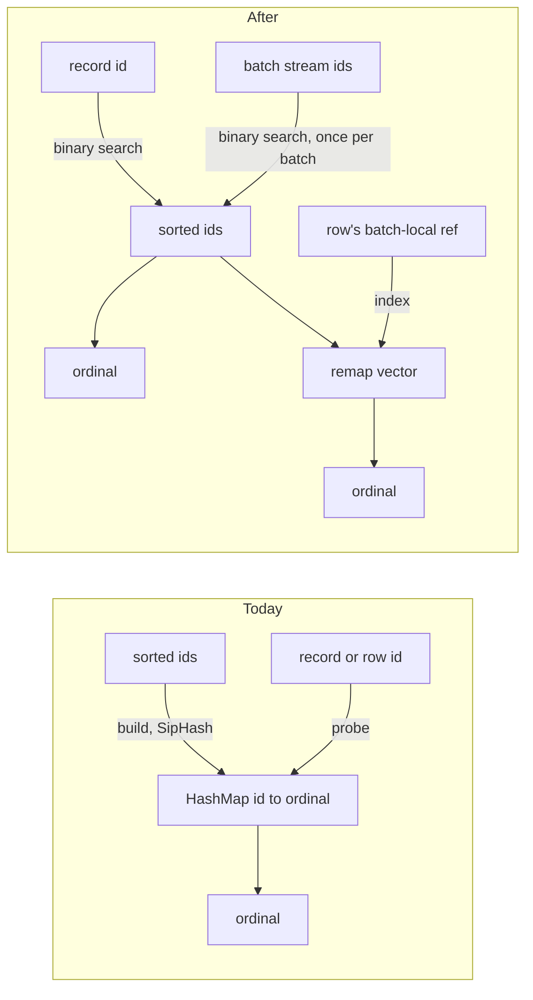

# ADR-2425: build-once id-to-ordinal maps become a binary search; no in-tree hash table

Status: Accepted (2026-10-03). Issue #2425.
No persistent format changes. Every object an encoder produces stays
byte-identical; this decision touches only how an encoder resolves an id to an
ordinal while it builds the object.

## Context

Five functions build a map from a 128-bit id to a `u32` ordinal, probe it, and
drop it before their output is finished:

| Site | Map | Probes |
|---|---|---|
| `ravel-logseg` `build_object` | `HashMap<LogStreamId, u32>` | one per record |
| `ravel-logseg` `build_object_columnar` | same | one per row |
| `ravel-logseg` `ColumnarLogBatch::from_records`; `services/ravel-cli` `build_columnar_batch` (`src/load/columnar.rs`) | same | one per row |
| `ravel-segment` `assemble_v4_body_impl` | `HashMap<[u8; 16], u32>` | one per exemplar |

All five share a shape. The key set is complete, sorted and free of duplicates
before the map is built, the ordinal is the key's position in that sorted
order, nothing is inserted or removed afterwards, and nothing iterates the map.
All five use the standard library map with its default SipHash-1-3 hasher.

At the four RLOG sites every probe is for a key that well-formed input always
contains, because the directory is built from the same records or batches the
probes come from. The RSEG site is different: an exemplar may name a series the
segment does not carry, and that miss is a defined outcome,
`WriteError::ExemplarUnknownSeries`.

The Multitable paper (arXiv 2609.39233) describes a hash table that stores
entries in fixed-size buckets across a cascade of shrinking levels, with a
one-byte hash fragment per slot so a probe can reject a bucket without reading
its keys. It reports 1.34x the throughput of hashbrown on positive lookups and
2.94x on negative ones at equal memory, measured on one Apple M2 Pro with SIMD
intrinsics. The epic set out to evaluate that design for the sites above.

The published implementation cannot be used: its repository declares no
license (`deny.toml` admits an allowlist only), its README calls it not
production-grade, and it contains `unsafe`, which this workspace denies. The
only route to the design is an implementation in safe Rust written from the
paper, and the measurements below were taken to find out whether that cost is
justified.

### Stage 0: what the map costs in time

Row path, 20,000 records per object, the `logseg_encode` bench corpus, release
profile, five interleaved runs (issue #2426; result branch
`task/19cfcd1f-df3d-4403-8c22-1413f0bb6ccd/result`, file `stage0-ref-of.md`).
Host: arm64 macOS, 15 cores, load average 5 to 6.

| Streams per object | Encode, ms | Map build, us | 20,000 probes, us | Share of encode |
|---|---|---|---|---|
| 1 | 56.37 | 1.0 | 272.4 | 0.49% (0.49 to 0.55) |
| 1,000 | 43.75 | 18.2 | 330.0 | 0.78% (0.70 to 0.85) |
| 20,000 | 65.89 | 364.7 | 453.2 | 1.23% (1.20 to 1.45) |

Figures are medians of five run means, with the range in brackets. The build
timer is exact. The probe figure comes from replaying the probes in isolation
with the map hot in cache, so it estimates the in-place cost from below. A
second arm replaced the map with a binary search over the sorted ids and
produced identical object bytes; its whole-encode time against the map arm was
1.002, 1.021 and 0.976, each inside the run-to-run spread.

### Stage 0b: what the map costs in memory

Same corpus and shapes, live bytes sampled through `build_object` under the
`stats_alloc` allocator (issue #2428; result branch
`task/55ac5d93-7358-4891-8dea-dcec837285c7/result`, file
`stage0b-ref-of-memory.md`). Host: x86_64 Linux. The figures were identical
across all five iterations.

| Streams per object | Map bytes | Largest live sample, bytes | Map share | Binary-search arm index bytes |
|---|---|---|---|---|
| 1 | 100 | 29,849,778 | 0.0003% | 0 |
| 1,000 | 43,024 | 28,336,295 | 0.15% | 0 |
| 20,000 | 688,144 | 44,524,214 | 1.55% | 0 |

The largest sample is a lower bound on the true peak, so each share is an
upper bound.

Both sets of figures were pre-registered on #2425 before their runs. Every
median landed inside its band. The 1-stream time share was marginal: its band
was under 0.5%, its median 0.49%, and one of its five runs read 0.55%. The
memory figures were inside their bands with margin.

The map is therefore neither a time nor a memory bottleneck of RLOG encode. A
table that cost nothing would move row-path encode time by about 1% and encode
memory by at most 1.55%. A binary search already reaches the memory floor (no
index at all) and is indistinguishable from the map in time on this corpus.

## Decision

1. **No hash table is added to the workspace for these sites.** Neither the
   published crate nor an in-tree implementation of its design.

2. **The five functions resolve an id to its ordinal by binary search over the
   sorted ids they already hold.** The map and its build loop are removed. The
   sorted directory stays the single authority for ordinal assignment. The
   RSEG site keeps its refusal: a search that misses returns
   `WriteError::ExemplarUnknownSeries`, as the map lookup did. In
   `build_object` and `from_records` the directory is built from the same
   records the search then resolves, in the same call, so the search has
   nothing to miss; `build_object` keeps the default of ref 0 it already had
   for that case and returns no new error, and `from_records` stays
   infallible with the same default, since its signature returns no `Result`
   and this ADR does not change it. The bulk loader's builder already returns
   a `Result`, so it returns a typed error there, where its map lookup would
   have panicked.

3. **`build_object_columnar` stops resolving per row.** Each row already
   carries a batch-local stream ref. The function resolves each batch's stream
   ids once into a batch-local-to-global remap vector and indexes that vector
   per row. The directory is built by pairing each batch's `stream_ids` with
   its `stream_attrs`, so a batch whose `stream_attrs` is shorter leaves ids
   out of it. That batch is malformed and returns a typed error; such an id is
   never resolved to a default ref. This covers that one condition. A row's
   batch-local ref that points past the end of its batch's `stream_ids` is a
   different malformed batch, panics today, and is left as it is by this ADR.

4. **Each change is pinned by an output-equality test; the row path is also
   pinned by a bench.** The encoded bytes must be identical before and after,
   across a corpus that includes many streams (or series) in an order that is
   not id order, so a wrong ordinal cannot hide. Only one of the five paths
   has a bench that enters it: `logseg_encode` drives `RlogWriter::push` and
   `finish`, which is `build_object`. That bench is run interleaved against
   the parent commit and must not be slower beyond run-to-run spread. The
   other four have nothing that can run that check: no criterion bench under
   `crates/ravel-logseg/benches` calls `push_columnar` or `from_records`, the
   `columnar_load` harness in `ravel-bench` enters the columnar writer with a
   single stream (where there is nothing to search), `segment_encode` feeds no
   exemplars, and `services/ravel-cli` has no bench target. Those four
   changes are gated by output equality alone and their time cost is accepted
   unmeasured (see Consequences).

5. **Query-side maps get their own measurement before any design.** PromQL
   grouping and vector matching hold large variable-length keys and have
   probes that miss, which is where the paper's design is strongest. A
   Stage 0 task measures the share of query time those maps hold and counts
   hit and miss probes separately. A table is designed for that workload only
   if the share is 5% or more of query time on a high-cardinality aggregation
   or join; that design is a new ADR.

6. **Out of scope.** The ingest and query-merge series maps (mutation, growth,
   enumeration), the S3-FIFO cache indexes (continuous churn) and DataFusion's
   group tables (upstream).

## Rejected alternatives

- **Depend on the published Multitable crate.** No license, so `cargo deny`
  refuses it and its source cannot be copied; it also contains `unsafe` and
  declares itself not production-grade.
- **Implement the Multitable design in-tree, in safe Rust.** A draft of this
  ADR specified it: a cascade of 16-slot buckets with a filter byte per slot,
  ordinals in the slots, a spill list so a build could not fail. It lost to
  the measurements. Its ceiling is about 1% of encode time and it would still
  allocate 5 bytes per key where a binary search allocates none. The paper's
  advantage is in negative lookups and SIMD filter scans. The four RLOG sites
  have no negative lookups on well-formed input; the RSEG exemplar site has
  them only on the error path, where the write is refused and speed does not
  matter. The workspace has no `unsafe` to write intrinsics with.
- **Keep the standard map and swap the hasher.** Likely recovers most of the
  probe time, which is 14 to 23 ns per probe and nearly flat across
  cardinality. It keeps the allocation, and the time it would recover is
  already inside the noise.
- **Do nothing.** Defensible on the numbers. The change is taken because it is
  small, removes these maps' allocation and their SipHash work from the five
  functions, and leaves the code with one fewer structure to keep in step with the
  sorted directory.

## Consequences

- Index allocation at these sites drops to zero (688,144 bytes per object at
  20,000 streams on the row path today). No measurable change in encode time
  is expected or claimed on the row path.
- A binary search costs time that grows with the logarithm of the key count,
  where a map's probe does not. On the row path, decision 4's bench reaches
  1,000 streams per object: `logseg_encode` builds at most 20,000 records at
  20 per stream. The 20,000-stream shape, where the search is deepest and the
  map's share was highest, is covered only by the Stage 0 measurement, whose
  harness lives on its result branch and not on main. The other four changes
  have no bench. Their exposure is bounded by how often they search: the
  columnar writer searches once per stream per batch, not per row; the two
  batch builders search once per row, the same count the row path was
  measured at; and the RSEG writer searches once per exemplar. A shape where
  that growth shows would need a bench arm that does not exist today.
- Encoded objects do not change.
- No workspace member and no dependency is added.
- The Multitable paper and both measurement branches stay as reference
  material for decision 5. The paper's throughput figures were taken with
  intrinsics on integer keys and do not transfer to a safe-Rust implementation
  without a fresh benchmark.
