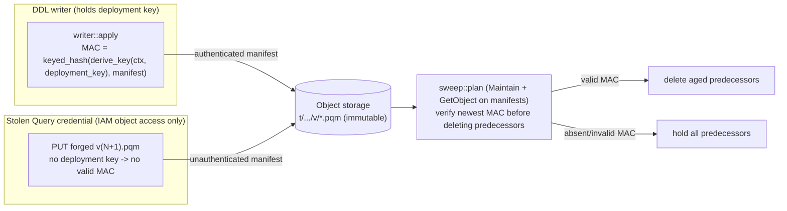

# ADR-2430: Authenticate the Parquet table manifest so a forged version cannot drive data loss

Status: Accepted (2026-10-08, issue #2430)

This changes a persistent format: the `.pqm` manifest protobuf gains a field
under an ADR-0066 Class C format-version bump, rolled out readers-first. It is
never an in-place format edit.

Amends ADR-2040 (Parquet tables queried in place) through the amendment
section this ADR adds to that file. Builds on ADR-0066 (format-migration
machinery) and the integrity direction of ADR-1696.

## Context

HTTP Parquet DDL runs in the Query role, so the shipped Query credential holds
a create-only write on table manifests
(`t/<tenant_hash>/pq/t/<table>/v/<version>.pqm`, immutable, `CreateIfAbsent`).
Create-only stops an overwrite of an existing version. It does not stop a new,
higher version, and readers always take the newest (`resolve::newest`).

A stolen Query credential can therefore PUT a forged higher version for any
tenant and table. Two things limit the damage: a forged definition reaches
only locations the tenant has granted (`granted_resolution` checks the grants
record, which Query cannot write), and version numbers are bounded
(`MAX_MANIFEST_VERSION`, refused by the writer with `WriteError::VersionAboveBound`
and ignored by the sweep above the bound). One thing makes it worse: `parquet
sweep` deletes a version once its successor is past grace (`sweep::plan`, over
`versions.windows(2)`). After a forged newest version ages past grace, a
routine sweep deletes the real versions under it. Recovery is an out-of-band
delete of the forged version or a restore of noncurrent object versions. Issue
#2430 decided (2026-10-03) to keep DDL on the Query role and harden; its item 1
is: the sweep must not delete a predecessor on the word of a manifest it cannot
attribute. (Item 2, the version bound, shipped in ADR-2040's 2026-10-04
amendment; item 3, a narrower control credential for DDL, remains future work.)

The sweep today reads no manifest bodies; it trusts the key layout alone.
Nothing proves the newest manifest was written by a principal holding more than
create-only object access.

## Decision

Authenticate the manifest with a MAC that only a DDL writer holding a
server-held key can produce, and gate the sweep's predecessor deletion on a
valid MAC over the newest version.

1. **MAC field, and the two-release readers-first rollout.** Add `mac` (bytes,
   proto field 14) to `ravel.parquet_table.v1.ParquetTableManifest`: a 32-byte
   `blake3::keyed_hash` over the canonical encoding of every other manifest
   field (the message encoded with `mac` empty), binding `tenant_hash`,
   `table`, `version`, `location`, `files`, and the rest. This is additive on a
   frozen proto (new field number only), an ADR-0066 Class C change, and
   `decode_manifest` enforces a strict read window (not a permissive ceiling),
   so readers must learn version 2 before any writer emits it (ADR-0066 R1).
   Because `PARQUET_TABLE_MAX_READ_VERSION` is today defined as
   `= PARQUET_TABLE_FORMAT_VERSION`, the rollout is two releases:
   - **Release A** decouples `PARQUET_TABLE_MAX_READ_VERSION` from the writer
     stamp, sets it to 2, and ships the sweep's MAC verification. Writers still
     stamp version 1; no manifest carries a MAC yet.
   - **Release B**, after A has rolled out fully, raises
     `PARQUET_TABLE_FORMAT_VERSION` to 2 so writers stamp and MAC. A
     not-yet-upgraded reader never meets a version it refuses.

2. **Key.** Derive the MAC key from the deployment key
   (`--tenant-hash-key-file`) with a new domain-separated `blake3::derive_key`
   context (`"ravel pqm manifest mac v1"`). This reuses the keyed-BLAKE3 MAC
   construction already used for the Flight SQL ticket
   (`ravel_sql::flight_ticket`) and the auth-token hash. `blake3` is today a
   dev-dependency of ravel-pqtable; the implementation promotes it to a
   regular dependency of the crate (the version is already in
   `[workspace.dependencies]` and blake3 ships in the server binary), and
   flags that dependency change in its report. No new crate enters the
   workspace. A constant-time comparison (as `flight_ticket` does) checks the
   tag. The key
   never touches object storage, so a principal with only IAM object access
   (the Query role, or a stolen Query credential) cannot compute it.

3. **Writer.** The DDL writer (`writer::apply`) computes and stores the MAC
   when it writes a manifest. It runs in a process that holds the deployment
   key; a raw PUT by a credential without the key cannot.

4. **Sweep gate, and the Maintain read grant it requires.** Before deleting any
   predecessor of a table, `sweep::plan` reads the newest bounded version and
   verifies its MAC (one GET per table with deletable predecessors, added to
   the plan phase, which read no bodies before). The older versions are deleted
   only when the newest version carries a valid MAC; a newest version whose MAC
   is absent or invalid holds all predecessors, so a forged version (no key, no
   valid MAC) can no longer license deleting the real versions under it.

   The sweep runs under the Maintain credential, and ADR-2040 deliberately gave
   `MaintainRead` no grant under `t/*/pq/` (it holds only `s3:ListBucket` and
   `s3:DeleteObject` on `t/*/pq/t/*`). Verifying the MAC requires the sweep to
   GET the manifest, so this ADR adds `s3:GetObject` on `t/*/pq/t/*/v/*.pqm` to
   `MaintainRead` in `deploy/iam/maintain.json`, and updates the IAM template
   test `crates/ravel-commit/tests/iam_templates.rs`. This is a named posture
   change from ADR-2040: the maintenance role gains read of the manifest's
   `created_by` and its redacted `statement` on every table, on objects it
   already lists and deletes (read is a strictly smaller capability than the
   delete it already holds). The rejected alternative (a minimal MAC sidecar
   object the sweep reads under a narrower grant) is below.

5. **Migration window, and quiescent tables.** During the Release A to B
   window, and after B for any table not yet rewritten, a format_version 1
   manifest carries no MAC; the sweep treats "no MAC" exactly as "cannot
   authenticate" and holds predecessors. This is conservative and safe: it
   never deletes on an unauthenticated newest version. Manifests are immutable
   `CreateIfAbsent` and the writer emits a new version only for a
   `Create`/`CreateOrReplace`/`Drop` intent, so a table that gets no further
   DDL keeps its version-1 manifests and its predecessors are held
   **permanently**, not just through the migration window. The cost is bounded
   (the already-existing versions of quiescent tables, not a growing set). The
   operator action that clears it for a table is any DDL that writes a new
   (version-2, MAC'd) manifest; absent that, the retention is accepted as the
   price of never deleting on an unauthenticated manifest. "Resumes once
   writers stamp v2" therefore holds per table, as each is next written, not
   cluster-wide at release B.

6. **Resolver.** `resolve::newest` is not gated (a query reading a forged
   definition is already bounded by the grants check, ADR-2040); the MAC gate
   is specifically the sweep's delete authority. The resolver MAY surface MAC
   status for observability, but does not refuse an unauthenticated manifest in
   this ADR (DDL-authorization binding is #2430's remaining item 3, out of
   scope here).

7. **Unkeyed (V1) buckets.** A `--tenant-hash-unkeyed` bucket has no deployment
   key, so no MAC can be computed or verified. In an unkeyed deployment the
   sweep cannot authenticate, so it falls back to issue #2430's alternative of
   a much longer grace for the newest-but-one version before any predecessor is
   deleted, documented as the unkeyed posture. Keyed deployments get the full
   MAC gate; unkeyed get a weaker, time-based safeguard. This adds no required
   config to the unkeyed mode. The fallback grace multiple is a configured
   maintenance constant, not a new required flag.

## Rejected alternatives

- **A minimal MAC sidecar object (narrow grant), keeping Maintain out of the
  manifest body.** The writer would emit a tiny `<version>.pqm.mac` object
  holding a MAC over the version identity only, and the sweep would read that
  under a narrow `*.pqm.mac` GetObject grant, so Maintain never reads
  `statement` or `created_by`. Rejected: it adds a second object to a frozen
  key layout and a second PUT per version, and binds only the version identity
  rather than the manifest content, for a read posture (redacted `statement`
  plus `created_by`, on objects Maintain already deletes) whose exposure is
  small. Decision 4's single-object body MAC with the named grant was chosen.
- **Store-checksum integrity only (ADR-1696 style).** A transport/store
  checksum proves the bytes were not corrupted, not that the writer held a
  secret; it does not stop a forged manifest written intact by a stolen
  credential. Rejected: this is an authenticity problem, not an integrity one.
- **A separate signature object a forger could also create.** A create-only
  credential can create the signature object's key too; the MAC must be bound
  into the immutable manifest the writer alone can author with the key.
- **Refuse unauthenticated manifests at read time (resolver gate).** Breaks
  every existing format_version 1 manifest on upgrade and conflates
  DDL-authorization with sweep safety. The sweep gate is the minimal change
  that closes the data-loss path.
- **New record kind under a new key suffix.** ADR-0066 reserves that for a
  genuinely incompatible change; a new optional field is additive and Class C.

## Consequences

- A forged newest version can no longer cause the sweep to delete real
  predecessors in a keyed deployment: without the key it carries no valid MAC,
  and the sweep holds the predecessors.
- The sweep's plan phase gains one GET per table that has deletable
  predecessors (it read no bodies before), and the Maintain role gains
  `GetObject` on manifests (decision 4).
- Predecessors of quiescent (never-rewritten) tables are held permanently
  (decision 5); the cost is bounded and the clearing action is a DDL write.
- `docs/catalog-and-mvcc.md` (the .pqm record row and format-version floors)
  is amended with the version bump; `manifest.rs` constants and the proto carry
  it under the format-change skill across releases A and B.
- What the attacker can still do: a stolen Query credential can PUT a forged
  version per table, each carrying no valid MAC, so under decision 5 the sweep
  holds that table's predecessors indefinitely, and the forger can add versions
  up to `MAX_MANIFEST_VERSION`, each held. The attack is thereby converted from
  data loss to retention and sweep denial, the intended trade. It is the same
  wedge family ADR-2040 documents for a forged version, with the same
  remediation: identify the forgery through the DDL audit log (ADR-2040) and
  remove it with `parquet repair --delete-version`, after which the held
  predecessors sweep normally.
- Of issue #2430's items: item 1 is this ADR; item 2 (the version bound)
  shipped in ADR-2040's 2026-10-04 amendment; item 3 (a narrower control
  credential for DDL) remains. (ADR-2040's 2026-10-04 amendment informally
  called the Query-grant narrowing "item 1"; this ADR follows the issue's
  numbering, where item 1 is the sweep attribution landed here.)

## Trust boundary

