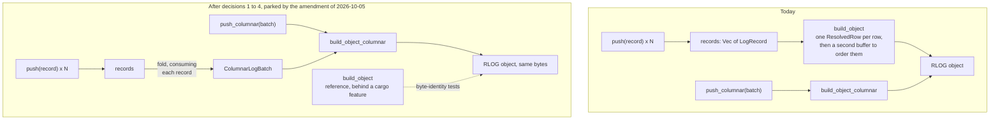

# ADR-2467: row-shaped log input is encoded by the columnar builder

Status: Accepted (2026-10-04); decisions 1 to 4 parked by the amendment of
2026-10-05. Issue #2467.
No persistent format changes. Every RLOG object stays byte-identical; this
decision changes which in-memory path builds it.
As accepted, this ADR amended ADR-0109 decisions 5 and 7. The amendment of
2026-10-05 below withdraws that: those two decisions stand as ADR-0109 wrote
them, and ADR-0109 carries both amendments.

## Context

`RlogWriter` has two builders (ADR-0109). `build_object` takes records pushed
one at a time and is what the OTLP ingest flush uses for a row-shaped buffer,
and what log compaction, erasure rewrite, alerting and the audit writer use.
`build_object_columnar` takes `ColumnarLogBatch`es and is what the bulk loader
uses. ADR-0109 decision 7 requires the two to produce byte-identical objects,
and tests hold them to it.

The row builder materialises every row as an owned `ResolvedRow` before it
writes a block. The columnar builder never does: it reads fixed fields from
column arrays, borrows strings from the batch, and builds each block's cells
and stamp output while that block is written.

### Stage 0: the true peak

Heap at its global maximum, by allocation site, from a heap profiler (issue
#2485, result branch `task/3213b1d4-5565-4ea0-8fa1-039c1d4f7f97/result`, file
`stage0f-true-peak.md`; reproduce on that branch with
`CARGO_PROFILE_RELEASE_DEBUG=true cargo build -p ravel-bench --release --bin logseg_peak_by_site`,
then `logseg_peak_by_site <arm> <shape>`). 20,000 records per object, the
`logseg_encode` bench corpus, x86_64. The figures include the input records.

| Streams per object | Row builder | Columnar, records dropped once the batch is built | Columnar, records kept |
|---|---|---|---|
| 1 | 28.64 MB | 19.82 MB (30.8% lower) | 30.41 MB (6.2% higher) |
| 1,000 | 30.30 MB | 21.26 MB (29.8% lower) | 30.56 MB (0.9% higher) |
| 20,000 | 41.44 MB | 30.91 MB (25.4% lower) | 43.39 MB (4.7% higher) |

Three checks on the instrument, all exact: a map of known size reads back its
known bytes at its allocation site; the per-site figures sum to the profiler's
own total in all nine runs; four runs of one arm give the same peak. The
object's hash is identical across the three arms at each shape.

What holds the row builder's peak at 1 stream:

| Bytes | Allocations | What |
|---|---|---|
| 5.24 MB | 1 | the writer's vector of pushed records |
| 7.4 MB | 100,000 | the records' strings and attribute vectors |
| 4.00 MB | 1 | `Vec<ResolvedRow>`, 200 bytes per row |
| 4.00 MB | 1 | a second buffer of that size at the row-ordering step |
| 3.20 MB | 20,000 | per-row stat output |
| 3.20 MB | 20,000 | per-row column vector |
| 0.88 MB | 40,000 | per-row owned values |

The first two rows are the input: 12.6 MB, 44% of that peak. The 15.3 MB
below them exists only
because the row builder owns a struct per row.

The columnar builder's peak at 1 and 1,000 streams falls at the end of
`ColumnarLogBatch::from_records`, when the records (11.6 MB) and the batch
built from them (8.2 MB) are both alive; `build_object_columnar` adds nothing
to it. At 20,000 streams it falls in section assembly, where
`StreamDir::encode` holds a single 2.9 MB buffer and the stream seeds 3.2 MB.

The two arms did not hold their input the same way, and the difference
matters for what this decision delivers. The row arm pushed its records into
the writer, whose record vector grows by doubling: 32,768 slots for 20,000
records, 5.24 MB. The columnar arm called `from_records` on the corpus
vector directly, which is sized exactly: 3.2 MB. So the columnar arm's
11.6 MB of records is 2.04 MB lighter than the same records held by a
writer. A row-mode writer that folds at `finish` holds the doubled vector,
so the measured columnar figure is not the routed path's figure. Adding the
2.04 MB where the peak falls while the records are alive gives an estimate
for the routed path of 21.9 MB at 1 stream and 23.3 MB at 1,000 streams,
24% and 23% under the row builder. At 20,000 streams the measured peak falls
after the records are dropped, so it stands at 30.9 MB, 25% lower, provided
the earlier point with the larger vector does not exceed it, which was not
measured. These are derived, not measured.

Encode wall time, the same two routes, five interleaved runs (issue #2475,
which is unaffected by the correction below): the columnar route for row input
is 0.98, 0.93 and 1.00 times the row builder's.

Earlier memory figures on this epic (#2469, #2475, #2477) were computed with a
formula that counts reallocation growth twice and are retracted on those
issues; #2480 records how that was found. Nothing in this ADR rests on them.

### Wide records

The corpus above has four attributes per record. A wide tenant has a hundred
or more, and `from_records` pivots rows into columns, so the same two routes
were measured on 20,000 records of 105 dynamic attributes each, all promoted
to columns (issue #2563, result branch
`task/f0ad66d4-941e-40a0-82b3-a8d43af5eb45/result`, file
`stage1-width-gate.md`; arm64 macOS, load 3.7 to 6.4, arms interleaved). The
columnar arm calls `from_records` on the records directly, as before, and
the object bytes are identical between arms.

| Shape | Row builder | Columnar route | Columnar / row | Peak, row | Peak, columnar | Lower by |
|---|---|---|---|---|---|---|
| Wide, 1 stream | 1,134 ms | 980 ms | 0.86 (0.85 to 0.92) | 364.2 MB | 322.1 MB | 11.6% |
| Wide, 1,000 streams | 1,163 ms | 991 ms | 0.84 (0.82 to 0.85) | 360.9 MB | 323.5 MB | 10.4% |

The four-attribute corpus, run in the same session as a control, reproduced
the peaks above within 80 bytes on this different architecture.

Two things differ from the narrow case. The columnar route is faster, by 14%
to 16%, where on narrow records it was level. And the memory saving is
smaller, about 11% against about 30%: the row builder's per-row material is
153 MB here and the columnar batch that replaces it is 128 MB. The input
itself is 184 MB, half of the row builder's peak, and the columnar route's
peak falls inside `from_records` with every record and the whole batch
alive. On wide records, then, most of what can be saved is that overlap,
which is decision 2's subject, not decision 1's.

### What the measurement does not cover

The profiler sees the Rust heap only, so zstd's own allocations are outside
every figure here. The figures are for 20,000-record objects. The routed
path itself, a row-mode writer folding at `finish`, has not been measured on
either corpus; both columnar arms fed the records to `from_records`
directly. Decision 2's effect has not been measured at all.

## Decision

Decisions 1 to 4 are parked, decisions 5 and 6 are restated for both
builders, and decision 7's out-of-scope list is narrowed: see the amendment
of 2026-10-05 below.

1. **A row-mode `RlogWriter` encodes through the columnar builder.** At
   `finish`, a writer that received records by `push` folds them into one
   `ColumnarLogBatch`, drops the records, validates the batch with
   `ColumnarLogBatch::validate`, and runs `build_object_columnar` on it. The
   order is fixed: the records are taken out of the writer before the batch
   is handed to the columnar builder, and the fold does not go through
   `push_columnar`, which refuses a writer that still holds records. The
   drop is part of the decision: with the records still alive the peak is
   higher than today's, not lower. No caller changes: the ingest flush,
   compaction, erasure rewrite, alerting and the audit writer keep calling
   `push` and `finish`. Every error the row builder returns for an input, the
   routed path returns for the same input; in particular two records with one
   stream id and different stream attrs are still refused with
   `InconsistentStreamAttrs`. `ColumnarLogBatch::from_records` does not do
   this today: it keeps the first blob it sees for a stream id and has no
   conflict check, so the fold carries the check itself.

2. **The fold consumes the records. On wide records this is the main memory
   lever.** `finish` owns the records, so the fold
   takes them by value and releases each record's strings and attribute
   vectors as it is folded, instead of building the whole batch beside the
   whole input. The measured columnar peak is exactly that overlap (11.6 MB
   plus 8.2 MB at 1 stream), so this is where the next reduction is. How much
   it yields is not known; the task that implements it pre-registers a figure
   and measures it with the Stage 0 profiler.

3. **The row builder becomes a reference, behind a cargo feature.** The row
   builder is `build_object`, `resolve_row` and `ResolvedRow`, plus the
   block-level row encoder they feed: `write_block`, `row_column` and
   `winner_value` in `block.rs`, and the two private helpers only
   `build_object` calls, `chunk_blocks` and `row_estimate`. All of it moves
   behind one off-by-default
   feature of `ravel-logseg`. `#[cfg(test)]` alone is not enough, because
   four things outside the crate's own unit tests use that surface, and each
   is its own compilation unit:

   - `ravel-logseg`'s `wide_gather` bench, ADR-0109's standing evidence for
     the row gather's cost. The crate enables the feature for its own tests
     and benches.
   - `ravel-sql`'s unit tests in `logs_scan.rs` and its `logs_columnar`
     integration test. `ravel-sql` enables the feature in its
     dev-dependencies only.
   - `ravel-bench`'s `page_codec_bakeoff` bin, which is in that crate's
     default build. `ravel-bench` enables the feature on its regular
     dependency on `ravel-logseg`, so the bin stays in the default build and
     every lane that compiles `ravel-bench` today still compiles it.

   The four shipped binaries are built one package at a time and none of
   them depends on `ravel-bench` or on another crate's dev-dependencies, so
   none of them enables the feature. A build that includes `ravel-bench`, or
   `ravel-sql`'s tests, does enable it; that covers a whole-workspace build. ADR-0109 decision 7's
   writer-level differential test drives its row arm through `push` and
   `finish`, which after decision 1 is the columnar builder, so that arm is
   rewired to call the reference builder directly; otherwise the test
   compares the columnar builder with itself.

4. **A width gate before decision 1 lands, which has passed.** The bar was
   set before the measurement: on a wide shape (at least 100 dynamic columns
   per record), the columnar route slower than 1.15 times the row builder
   would have stopped decision 1 from landing as written. It measured 0.86
   and 0.84 (see "Wide records"). Peak memory on the wide shape had no bar
   and is reported there.

5. **The stream directory is encoded once, from borrowed blobs.**
   The writer gains an encode-side entry point that takes borrowed entries
   (a stream id, a borrowed attrs blob and the block range) and writes them
   into a buffer sized for its content, instead of copying every blob into
   an owned `StreamEntry` and again into a growing buffer. The owned
   `StreamDir` and `StreamEntry` the reader decodes into are unchanged. The
   directory is encoded immediately before it is written.

6. **Structures are released after their last read.** The per-block stat and
   indexed-term scratch (1.31 MB at these shapes), the skip index, the page
   and field directories and the bloom entries are dropped where the code
   last reads them, not at the function's return.

7. **Out of scope.** The stream seeds (160 bytes per stream on both
   builders), the writer's record vector growing by doubling, the shape of
   the ingest shard buffer (ADR-0109 decision 5), and the row-group
   dictionary interner, which the profiler shows is released in full when the
   builder is flushed.

## Rejected alternatives

- **Slim the row builder in place** (borrow strings from the pushed records,
  build stamp output per block, replace the per-row map with a small sorted
  vector). It would recover much of the same memory, and it keeps two
  production builders that must be held byte-identical forever. The columnar
  builder already has that shape, and the measurement shows it is not slower.
- **Convert at the caller**, in the ingest flush, and leave `RlogWriter`
  alone. It fixes one of five callers and leaves compaction, erasure rewrite,
  alerting and the audit writer on the row builder.
- **Delete the row builder.** The byte-identity tests would then compare the
  columnar builder with itself. ADR-0109 chose that comparison as its
  acceptance anchor.
- **Do nothing.** 28.6 MB for a 20,000-record object is not a crisis, and
  nothing here measured a flush that failed for memory. The change is taken
  because the saving costs no encode time and removes a production code
  path.
- **Stream the encode from the shard buffer** so that no full batch exists.
  A larger redesign that touches ADR-0109 decision 5; not justified by these
  numbers.

## Consequences

The consequences that follow from routing do not apply while decision 1 is
parked: see the amendment of 2026-10-05 below.

- On the measured corpus, the columnar builder fed the records directly
  peaks 25% to 31% under the row builder. The routed path also holds the
  writer's doubled record vector, so its estimated peak is 23% to 25% under,
  from decision 1. That estimate is derived; the task that implements
  decision 1 measures the routed path itself. Decision 2 may lower it
  further; that part is unmeasured.
- `ColumnarLogBatch::validate` now runs on every row-shaped encode, called by
  the fold. It is one linear pass.
- A caller that keeps its own copy of the records alongside the writer's
  would see a higher peak than today, by 1% to 6%. The ingest flush and
  compaction's part builder hand their records to `push` by value; the other
  callers were not checked for a retained copy.
- Encode time for row-shaped input is level with today's on narrow records
  and 14% to 16% lower on 105-column records, as measured on the columnar
  route.
- On wide records decision 1 alone saves about 11% of the peak. The rest of
  what is available there is the overlap between the records and the batch,
  184 MB and 128 MB on the measured corpus, which only decision 2 reduces. A
  fold that removed the overlap entirely would bring the peak toward the
  larger of the two; a real one still holds the unfolded remainder and the
  growing batch together, so that is a ceiling on the saving and not a
  forecast.
- One production builder instead of two. A defect in the columnar builder
  now reaches ingest and compaction as well as bulk load.
- The reference row builder must keep compiling and keep matching. A change
  to the columnar builder that alters object bytes still fails the
  byte-identity tests, as today.
- Encoded objects do not change.

## Amendment (2026-10-05): routing is parked; decisions 5 and 6 apply to both builders

<!-- amendment-applies: sections="Decision|Consequences" pointer="amendment of 2026-10-05" -->

Decision 1 routes row-shaped input through `ColumnarLogBatch::from_records`.
A review of the implementation (issue #2564) found, and a measurement
confirmed (issue #2585, result branch
`task/21fbfbf8-2e38-4444-be3f-649278687b63/result`, file
`stage2-sparse-input.md`), that `from_records` allocates a full-length vector
for every distinct attribute name and type across the records, before the
dynamic-column budget is applied. Its memory therefore grows with records
times distinct keys. The row builder's grows with the attributes present.

Records of 10 attributes each, drawn from K distinct keys; heap at its global
maximum, input included; object bytes identical between the arms at the two
shapes where the columnar arm ran:

| Shape | Row builder | Columnar route | Ratio |
|---|---|---|---|
| 20,000 rows, K = 100 | 52.2 MB | 91.9 MB | 1.76 |
| 20,000 rows, K = 1,000 | 57.6 MB | 668.1 MB | 11.6 |
| 20,000 rows, K = 10,000 | 56.2 MB | not run | |
| 200,000 rows, K = 1,000 | 486.1 MB | not run | |

At K = 1,000 the dense allocation site measured exactly 640,000,000 bytes,
rows times keys times the 32 bytes of one slot; the columnar batch as a whole,
which includes the other allocations of `from_records`, measured 643.5 MB. The two largest columnar runs
were not made. The dense vector alone comes to about 6.4 GB for each. The
measurement's own rule was to run a shape only with twice its pre-registered
upper bound available: 14 GB for the first (upper bound 7.0 GB) and 16 GB
for the second (8.0 GB). The host had 13.6 GB available (`MemAvailable` 13,636,980 kB). Every shape this ADR measured before accepting decision 1, including
the width gate of decision 4, had every attribute present on every record,
so none of them exercised this. Ingest's default limits cap a record at 128
attributes; the review found no cap on the distinct names across a flush or a
compaction part.

The same review found that `VarBytes`, which the columnar batch stores body
and severity text in, keeps `u32` offsets, while the compaction part memory
target is derived up to 8 GiB. Whether one writer can in practice be handed
more than 4 GiB of text was not established.

What changes:

- **Decisions 1 to 4 are parked.** Row-shaped input keeps encoding through
  the row builder, which stays a production path with no cargo feature in
  front of it. ADR-0109 decisions 5 and 7 stand as ADR-0109 wrote them, and
  ADR-0109 carries an amendment saying so. The width gate's result stands as
  a measurement; it gates nothing while decision 1 is parked.
- **What would reopen decision 1.** A fold with no dense value slots: the
  intermediate inside `from_records` holds one 32-byte slot per record per
  distinct key, where the batch it returns holds a value only for the
  attributes present. That batch still carries a validity bitmap per column,
  one bit per record, so a term in records times keys remains: 2.5 MB at
  20,000 records and 1,000 keys, small at the measured shapes and unbounded
  while distinct names are uncapped. Also a resolution of the `VarBytes`
  offset width, and a third gate beside the narrow and wide ones: the sparse
  shapes in the table above, with the columnar route's peak no higher than
  the row builder's. That is a new decision and needs its own ADR or a
  further amendment here. The implementation branch of #2564 is kept as
  reference for it.
- **Decision 5 applies to both builders.** Each builder is to encode the stream
  directory through an encode-side entry point over borrowed entries, into a
  buffer sized for its content.
- **Decision 6 applies to both builders, and names the row builder's
  largest item.** In the row builder the stream seeds are last read while
  rows are resolved, and the resolved rows are last read in the block loop;
  after it only their count is used. Each is dropped after that last read,
  the rows with their count kept, before the trailing sections are
  assembled. In the columnar builder the per-block stat and indexed-term
  scratch is dropped after the block loop. In both builders the skip index,
  the page and field directories and the bloom entries are dropped after
  their last read. Where the row builder's peak falls at 20,000 streams is
  not stated in "Stage 0: the true peak", which breaks that builder's peak
  down only at 1 stream. It is read from the site table of the same
  measurement (`stage0f-true-peak.md` on the #2485 result branch, row arm,
  20,000 streams), which lists the stream directory's encode buffer, one
  resolved-row vector, the per-row material and the stream seeds as live
  together at the peak. That places the peak in section assembly with the
  rows and seeds still alive, which is why the saving for that shape is
  expected here. It is an inference from the site list, not a located
  measurement, and the saving itself is unmeasured: the task that implements
  this pre-registers a figure and measures it with the same profiler.
- **Decision 7's out-of-scope list is narrowed by one item.** It excluded
  the stream seeds, meaning their size: 160 bytes per stream on both
  builders, 3.2 MB at 20,000 streams. Their size stays out of scope. How
  long they are held is now in scope, under decision 6.
- **Consequences that no longer hold:** the estimated 23% to 25% lower peak,
  the lower encode time on wide records, one production builder instead of
  two, and `ColumnarLogBatch::validate` running on every row-shaped encode.
  Encoded objects still do not change.
- **Outcome.** Decisions 5 and 6 landed for both builders in pull request
  #2601 (issue #2565). Measured with the same profiler, heap at its global
  maximum, 20,000 records (issues #2602 and #2608): the row builder at
  20,000 streams went from 40.76 MB to 32.67 MB, 19.85% lower, and the
  columnar builder with its input dropped from 30.22 MB to 27.12 MB, 10.27%
  lower; at 1 and 1,000 streams neither moved by more than 1%. The drops of
  the columnar builder's per-row arrays after its block loop do not lower
  that peak, because it falls inside the block loop, while those arrays are
  still in use.
