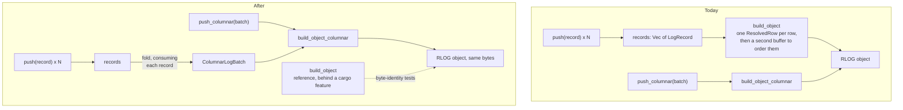

# ADR-2467: row-shaped log input is encoded by the columnar builder

Status: Accepted (2026-10-04). Issue #2467.
No persistent format changes. Every RLOG object stays byte-identical; this
decision changes which in-memory path builds it.
Amends ADR-0109 decisions 5 and 7: the columnar path is no longer bulk-load
only, and the row builder stops being a production path and stays as the
differential reference. ADR-0109 carries an amendment section pointing here.

## Context

`RlogWriter` has two builders (ADR-0109). `build_object` takes records pushed
one at a time and is what the OTLP ingest flush uses for a row-shaped buffer,
and what log compaction, erasure rewrite, alerting and the audit writer use.
`build_object_columnar` takes `ColumnarLogBatch`es and is what the bulk loader
uses. ADR-0109 decision 7 requires the two to produce byte-identical objects,
and tests hold them to it.

The row builder materialises every row as an owned `ResolvedRow` before it
writes a block. The columnar builder never does: it reads fixed fields from
column arrays, borrows strings from the batch, and builds each block's cells
and stamp output while that block is written.

### Stage 0: the true peak

Heap at its global maximum, by allocation site, from a heap profiler (issue
#2485, result branch `task/3213b1d4-5565-4ea0-8fa1-039c1d4f7f97/result`, file
`stage0f-true-peak.md`; reproduce on that branch with
`CARGO_PROFILE_RELEASE_DEBUG=true cargo build -p ravel-bench --release --bin logseg_peak_by_site`,
then `logseg_peak_by_site <arm> <shape>`). 20,000 records per object, the
`logseg_encode` bench corpus, x86_64. The figures include the input records.

| Streams per object | Row builder | Columnar, records dropped once the batch is built | Columnar, records kept |
|---|---|---|---|
| 1 | 28.64 MB | 19.82 MB (30.8% lower) | 30.41 MB (6.2% higher) |
| 1,000 | 30.30 MB | 21.26 MB (29.8% lower) | 30.56 MB (0.9% higher) |
| 20,000 | 41.44 MB | 30.91 MB (25.4% lower) | 43.39 MB (4.7% higher) |

Three checks on the instrument, all exact: a map of known size reads back its
known bytes at its allocation site; the per-site figures sum to the profiler's
own total in all nine runs; four runs of one arm give the same peak. The
object's hash is identical across the three arms at each shape.

What holds the row builder's peak at 1 stream:

| Bytes | Allocations | What |
|---|---|---|
| 5.24 MB | 1 | the writer's vector of pushed records |
| 7.4 MB | 100,000 | the records' strings and attribute vectors |
| 4.00 MB | 1 | `Vec<ResolvedRow>`, 200 bytes per row |
| 4.00 MB | 1 | a second buffer of that size at the row-ordering step |
| 3.20 MB | 20,000 | per-row stat output |
| 3.20 MB | 20,000 | per-row column vector |
| 0.88 MB | 40,000 | per-row owned values |

The first two rows are the input: 12.6 MB, 44% of that peak. The 15.3 MB
below them exists only
because the row builder owns a struct per row.

The columnar builder's peak at 1 and 1,000 streams falls at the end of
`ColumnarLogBatch::from_records`, when the records (11.6 MB) and the batch
built from them (8.2 MB) are both alive; `build_object_columnar` adds nothing
to it. At 20,000 streams it falls in section assembly, where
`StreamDir::encode` holds a single 2.9 MB buffer and the stream seeds 3.2 MB.

Encode wall time, the same two routes, five interleaved runs (issue #2475,
which is unaffected by the correction below): the columnar route for row input
is 0.98, 0.93 and 1.00 times the row builder's.

Earlier memory figures on this epic (#2469, #2475, #2477) were computed with a
formula that counts reallocation growth twice and are retracted on those
issues; #2480 records how that was found. Nothing in this ADR rests on them.

### What the measurement does not cover

The corpus has four attributes per record, one of them a string. A wide
tenant has a hundred or more columns, and `from_records` pivots rows into
columns; its cost at that width was not measured. The profiler sees the Rust
heap only, so zstd's own allocations are outside every figure here. The
figures are for 20,000-record objects.

## Decision

1. **A row-mode `RlogWriter` encodes through the columnar builder.** At
   `finish`, a writer that received records by `push` folds them into one
   `ColumnarLogBatch`, drops the records, and runs `build_object_columnar`.
   The drop is part of the decision: with the records still alive the peak is
   higher than today's, not lower. No caller changes: the ingest flush,
   compaction, erasure rewrite, alerting and the audit writer keep calling
   `push` and `finish`. Every error the row builder returns for an input, the
   routed path returns for the same input; in particular two records with one
   stream id and different stream attrs are still refused with
   `InconsistentStreamAttrs`. `ColumnarLogBatch::from_records` does not do
   this today: it keeps the first blob it sees for a stream id and has no
   conflict check, so the fold carries the check itself.

2. **The fold consumes the records.** `finish` owns the records, so the fold
   takes them by value and releases each record's strings and attribute
   vectors as it is folded, instead of building the whole batch beside the
   whole input. The measured columnar peak is exactly that overlap (11.6 MB
   plus 8.2 MB at 1 stream), so this is where the next reduction is. How much
   it yields is not known; the task that implements it pre-registers a figure
   and measures it with the Stage 0 profiler.

3. **The row builder becomes a reference, behind a cargo feature.** The row
   builder is `build_object`, `resolve_row` and `ResolvedRow`, plus the
   block-level row encoder they feed: `write_block`, `row_column` and
   `winner_value` in `block.rs`. All of it moves behind one off-by-default
   feature of `ravel-logseg`. `#[cfg(test)]` alone is not enough, because
   four things outside the crate's own unit tests use that surface, and each
   is its own compilation unit:

   - `ravel-logseg`'s `wide_gather` bench, ADR-0109's standing evidence for
     the row gather's cost. The crate enables the feature for its own tests
     and benches.
   - `ravel-sql`'s unit tests in `logs_scan.rs` and its `logs_columnar`
     integration test. `ravel-sql` enables the feature in its
     dev-dependencies only.
   - `ravel-bench`'s `page_codec_bakeoff` bin, which is in that crate's
     default build today. `ravel-bench` gains a feature that forwards to
     this one, and the bin takes it as a required feature, as the crate's
     other optional bins do.

   The four shipped binaries are built one package at a time and none of
   them depends on `ravel-bench` or on another crate's dev-dependencies, so
   none of them enables the feature. A workspace build with all targets does
   enable it, through `ravel-sql`'s dev-dependency. ADR-0109 decision 7's
   writer-level differential test drives its row arm through `push` and
   `finish`, which after decision 1 is the columnar builder, so that arm is
   rewired to call the reference builder directly; otherwise the test
   compares the columnar builder with itself.

4. **A width gate before decision 1 lands.** The implementing task measures
   encode wall time on a wide shape (at least 100 dynamic columns per record)
   for the row builder and for the routed path, interleaved. If the routed
   path is slower than 1.15 times the row builder there, decision 1 does not
   land as written; the result is reported and this ADR is amended with what
   the measurement shows. Peak memory on the wide shape is measured in the
   same task and reported, with no bar.

5. **The stream directory is encoded once, from borrowed blobs.**
   The writer gains an encode-side entry point that takes borrowed entries
   (a stream id, a borrowed attrs blob and the block range) and writes them
   into a buffer sized for its content, instead of copying every blob into
   an owned `StreamEntry` and again into a growing buffer. The owned
   `StreamDir` and `StreamEntry` the reader decodes into are unchanged. The
   directory is encoded immediately before it is written.

6. **Structures are released after their last read.** The per-block stat and
   indexed-term scratch (1.31 MB at these shapes), the skip index, the page
   and field directories and the bloom entries are dropped where the code
   last reads them, not at the function's return.

7. **Out of scope.** The stream seeds (160 bytes per stream on both
   builders), the writer's record vector growing by doubling, the shape of
   the ingest shard buffer (ADR-0109 decision 5), and the row-group
   dictionary interner, which the profiler shows is released in full when the
   builder is flushed.

## Rejected alternatives

- **Slim the row builder in place** (borrow strings from the pushed records,
  build stamp output per block, replace the per-row map with a small sorted
  vector). It would recover much of the same memory, and it keeps two
  production builders that must be held byte-identical forever. The columnar
  builder already has that shape, and the measurement shows it is not slower.
- **Convert at the caller**, in the ingest flush, and leave `RlogWriter`
  alone. It fixes one of five callers and leaves compaction, erasure rewrite,
  alerting and the audit writer on the row builder.
- **Delete the row builder.** The byte-identity tests would then compare the
  columnar builder with itself. ADR-0109 chose that comparison as its
  acceptance anchor.
- **Do nothing.** 28.6 MB for a 20,000-record object is not a crisis, and
  nothing here measured a flush that failed for memory. The change is taken
  because the saving costs no encode time and removes a production code
  path.
- **Stream the encode from the shard buffer** so that no full batch exists.
  A larger redesign that touches ADR-0109 decision 5; not justified by these
  numbers.

## Consequences

- On the measured corpus, the peak heap of a row-shaped encode falls by 25%
  to 31% from decision 1. Decision 2 may lower it further; that part is
  unmeasured.
- `ColumnarLogBatch::validate` now runs on every row-shaped encode, since the
  fold's batch goes through `push_columnar`. It is one linear pass.
- A caller that keeps its own copy of the records alongside the writer's
  would see a higher peak than today, by 1% to 6%. The ingest flush and
  compaction's part builder hand their records to `push` by value; the other
  callers were not checked for a retained copy.
- Encode time for row-shaped input is expected within a few percent of
  today's on narrow records. On wide records it is unknown until decision 4's
  gate runs.
- One production builder instead of two. A defect in the columnar builder
  now reaches ingest and compaction as well as bulk load.
- The reference row builder must keep compiling and keep matching. A change
  to the columnar builder that alters object bytes still fails the
  byte-identity tests, as today.
- Encoded objects do not change.
