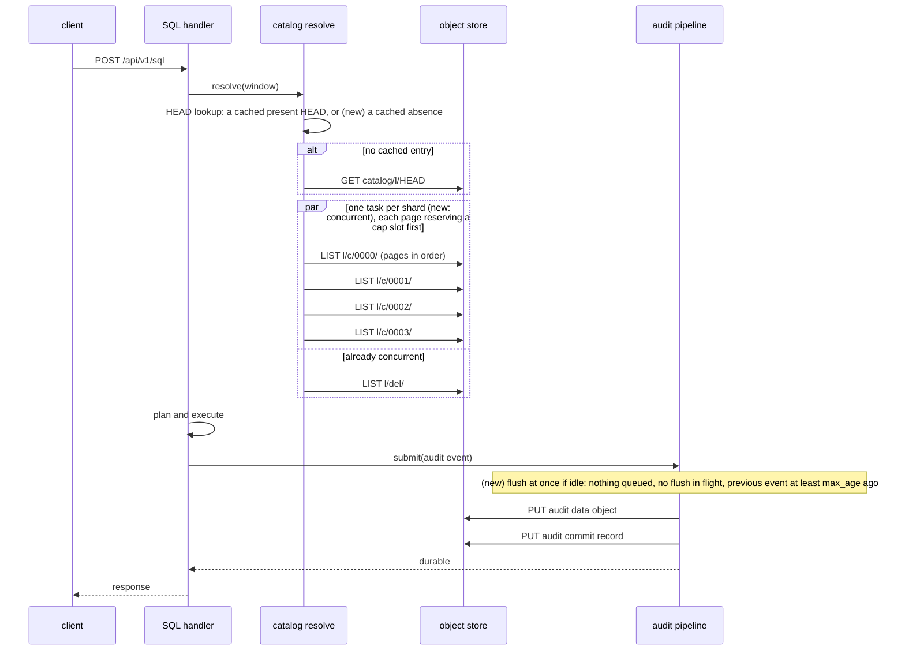

# ADR-2509: the per-statement floor: the prefix listing runs shards concurrently under a reserved LIST cap, the audit pipeline flushes when idle, and a missing catalog HEAD is cached

Status: Accepted (2026-10-04). Issue #2509.
No persistent format changes. Every object, key, commit record and audit
record stays byte-identical. This decision changes the order and overlap of
requests a statement issues and when a queued audit batch is flushed, never
what is written.

## Context

Every SQL statement pays a fixed cost before it reads any data. On the
v0.21.0 ClickBench entry (ClickHouse/ClickBench#2371), `SELECT COUNT(*)`
answered in 0.44 s hot, while VictoriaLogs answers the same statement in
12-35 ms. Ravel's hot total beats VictoriaLogs over the 42 statements both run
(80.3 s against 91.9 s), but its geometric mean is 2.8x worse. The floor is
what loses that score.

### Stage 0 measurement

The measurement is posted on #2509: the pre-registration, the result, and the
RustFS addendum.

**Setup.**
- Box: c6a.4xlarge in us-east-1, real S3, with the fleet executor drained.
- Binary: `origin/main` bc74bcd75, `--release`, `--features sql`.
- Tenant: the compacted reference tenant, with 219 segments and 2,617 commit
  records over 4 shards.
- Logs catalog: never folded. No logs snapshot exists for this tenant.
- Query window: `start: 0`, the same window the upstream driver sends.

**Method.** The server's own `ravel_store_latency_seconds` and `/proc` CPU,
measured over 30 hot q1 statements with the background fold disabled:

| component | per statement | share | mechanism |
|---|---|---|---|
| commit-record LIST | about 205 ms | about 50% | `list_window_by_prefix` drains the 4 shards one after another, about 51 ms per LIST. The `del/` erasure LIST is already joined concurrently. |
| query-audit write | about 123 ms | about 30% | The pipeline waits its `max_age` (25 ms) for a batch that sequential traffic never fills, then writes the data object and its commit record, about 49 ms each, in that order. |
| GET | about 35 ms | about 8% | One is the catalog HEAD read. It returns NotFound and is never cached, so every statement repeats it. |
| CPU | 31 ms | about 7% | planning, the declared-stats decode, LIST XML parsing |
| total wall time | 413 ms | | The four parts account for about 394 ms. Of the remaining 19 ms, 3 ms is the client and about 16 ms is unattributed (HTTP and JSON handling, scheduling). Whether the LIST timer includes response parsing is not established; if it does, the LIST and CPU rows overlap by that parse time, and the unattributed share is larger. The parts are additive because each step waits on the previous one. |

- The client contributes about 3 ms.
- The `stats.phases` request counts agree: 5 LIST and 2 GET, all in
  `resolve`.

**RustFS, the store the upstream entry runs on.** Measured with raw requests,
not end to end:
- A 650-key shard LIST costs about 75 ms after correcting for the client's
  XML parsing.
- A PUT costs 4 ms, and a GET 1 ms.
- The listing is therefore about 80% of the floor there, and the audit write
  under 10%.
- This model puts q1 at about 0.37 s, against the 0.44 s measured upstream.
  The model undershoots by about 70 ms.

### Why the listing is sequential

ADR-0056 added the prefix traversal for wide windows. A query with
`start: 0` and no snapshot HEAD selects it, because its suffix bucket count
reaches `prefix_list_crossover_requests` (720).

ADR-0056 keeps ADR-0044's request ceiling, "a single resolve never issues
more than `max_catalog_list_requests` catalog LISTs", as a runtime count of
the pages the prefix path drains. `docs/catalog-and-mvcc.md` explains why the
traversal is sequential: the LISTs "drain sequentially under a page-by-page
request cap, so a pathologically wide window is refused deterministically
rather than fanning out unboundedly".

The cap check today reads the count and increments it only after the LIST
returns. That is sound only because nothing runs concurrently.

### Why the audit write is on the response path

ADR-0062 §2a and §2b require every read surface to await the durability of
its audit record before releasing the response. That is the "non-lossy"
contract: no acknowledged query lacks a durable record.

The record carries the query's outcome status, so it cannot be written
before execution ends.

The two PUTs are ordered data-then-commit. That is the durability order
every writer follows: a commit record never names an object that does not
exist.

The 25 ms wait comes from the flush loop (`run_flush_loop`). It arms a
`max_age` deadline on the first event and never checks whether more events
could arrive.

### Tenant states this decision covers

- **Unfolded, whole-history window.** This is the state every ClickBench run
  measures. The upstream `load` runs no fold. The entry is restartable, so the
  ClickBench harness restarts the server before each statement's cold run.
  Server logs from runs on the reference box start 20 to 40 s apart, well
  inside the 5-minute fold interval.
- **Folded.** This is the normal production state: the scheduled fold runs
  every 5 minutes in `--mode all` and `--mode maintain`.
  - The resolve reads a cached HEAD and lists only commits past the
    watermark, one concurrent LIST round over nearly empty pages
    (`list_window_bounded`).
  - The audit write is then the largest part of the floor.

## Decision

### 1. The prefix traversal lists shards concurrently under a reserved cap

- `list_window_by_prefix` drains each shard in its own task. Up to
  `resolve_get_concurrency` tasks run at once, the same bound
  `list_window_bounded` already uses.
- Pages within a shard stay sequential, because each page's continuation
  token comes from the previous page.
- **The cap is reserved, not checked.** Before issuing a page, a task takes a
  slot from one shared counter with an atomic `fetch_update` that refuses
  when the count is already at `max_catalog_list_requests`.
  - A refused reservation aborts the whole resolve with
    `CatalogError::WindowTooWide`. In-flight pages are cancelled.
  - A slot is never returned. The count bounds requests issued, not requests
    that succeeded.
- **The bound stays exact:** no resolve issues more than
  `max_catalog_list_requests` LISTs.
- **Determinism loses one property.** Which shard reaches the cap first, and
  the `estimate` value in the error, can vary between runs. The refusal
  itself does not vary, because a window whose total page count exceeds the
  cap is refused on every run. (The `estimate` does not vary: see the
  WindowTooWide estimate correction below.)
- The shard results are merged in shard order (see the merge order correction
  below) before step 2 partitions them, so the resolved key set and its total
  order are unchanged.
  `docs/catalog-and-mvcc.md`'s "Both traversals produce the identical key set"
  still holds. ADR-0056 itself makes the narrower claim that the prefix path
  lists a superset and the resolved snapshots converge. Concurrency changes
  neither.
- **Docs this changes.** The retired rationale, that the prefix path's LISTs
  drain one after another so the cap is checked page by page, appears in seven
  places. Each is changed as follows:
  - `docs/catalog-and-mvcc.md`, the "Prefix scan" bullet in the resolve
    steps. This is a normative doc, so it is edited in place to state this
    rule.
  - `docs/catalog-and-mvcc.md`, the crossover paragraph saying resolve
    switches to the prefix scan for wide windows "only for its sequential
    page-by-page request cap". Edited in place: the prefix path is now chosen
    for a reserved cap, not a sequential one.
  - The doc comment on `list_window_by_prefix`
    (`crates/ravel-catalog/src/catalog.rs`). Edited in place.
  - The doc comment on `DEFAULT_PREFIX_LIST_CROSSOVER_REQUESTS`
    (`crates/ravel-catalog/src/config.rs`). Edited in place.
  - The doc on the `CatalogConfig::prefix_list_crossover_requests` field, in
    the same file. Edited in place.
  - ADR-1199, section "The measured cost". Its paragraph contrasting the two
    traversals says the prefix path's serial LIST depth is the sum of the
    shards' page counts; under this decision it becomes the maximum, as on the
    bounded path. ADR-1199 gets an amendment naming that section, with an
    inline pointer in the paragraph. The `list_page_depth` figure it governs
    stays a valid upper bound (`crates/ravel-query/src/io_shape.rs`).
  - ADR-0056, section "The request ceiling (INTERACTION 1)". Its runtime-cap
    bullet, `WindowTooWide { estimate: <pages issued> }`, now reports the
    pages reserved when the cap was reached, and that number is no longer
    stable between runs. (It is stable, the cap plus one on every run: see
    the WindowTooWide estimate correction below.) ADR-0056 gets an amendment
    naming that section, with an inline pointer in the bullet.
  - Both ADR amendments use the `sections=`/`pointer=` marker syntax that
    `scripts/guards/check-amendment-integrity.sh` checks.

### 2. The audit pipeline flushes when it is idle

- **The idle trigger.** An event that `run_flush_loop` receives when the
  pipeline is idle flushes at once instead of opening a `max_age` window.
  Idle means all three of:
  - nothing else is queued;
  - no flush is in flight. Today's loop awaits each flush inline, so this
    always holds when it receives an event. It is stated so the rule stays
    correct if the flush ever moves off the loop. This decision does not
    move it;
  - the loop received its previous event at least `max_age` earlier.
- **Every other event batches exactly as today.** It opens or joins a
  window that flushes at `max_batch` or `max_age`, whichever comes first.
  That includes events arriving during a flush, or within `max_age` of the
  previous event.
- **Why the third condition.** Without it, steady traffic on a fast store
  would degenerate to one PUT pair per event. Take a RustFS PUT pair of
  about 8 ms with statements every 10 to 25 ms: the queue would be empty and
  no flush in flight each time the loop came round. That one-pair-per-event
  outcome is the `max_batch=1` configuration ADR-0062 rejects on object
  count. With the condition:
  - traffic arriving more often than once per `max_age` never triggers the
    idle path, and batches exactly as it does today (this is stated at the
    wrong instant: see the idle-condition correction below);
  - only the first event after a gap of at least `max_age` flushes alone.
- **The cost bound.** Compared with today's loop on the same arrival
  schedule:
  - each idle trigger adds at most one PUT pair (the triggering event flushes
    alone instead of sharing a window with the events right behind it);
  - idle triggers are at least `max_age` apart.
  So the pair count is at most twice today's, and at most one extra pair per
  `max_age` of wall time (40 per second at the 25 ms default). Steady traffic
  adds none.
- **Sequential statements always qualify.** The next one is submitted only
  after the previous response, which takes longer than `max_age` here, so
  each submission finds the pipeline idle.
- ADR-0062's contract is untouched: every submitter still awaits its batch's
  durable flush before its response is released, in `required` and
  `best-effort` alike.
- **The ADR-0062 amendment.** ADR-0062 section 2b's worst-case PUT rate
  ("from 200 PUTs/s to <=80/s" at 100 queries/s and 25 ms batching) doubles
  under this bound, to at most 160 PUTs/s. So ADR-0062 gets an amendment
  marked `amendment-applies: sections="2. Audit: one evidential pipeline for
  every query surface"` with a pointer to the amendment heading, and section 2
  carries the inline pointer next to that figure. The amendment records:
  - the idle trigger and its three conditions;
  - the cost bound, set against ADR-0062's PUT-spend rationale;
  - the numbers from this decision.

### 3. A missing catalog HEAD is cached on the resolve path

- `SnapshotResolve::read_head` caches a NotFound for `head_cache_ttl`
  (default 30 s), in the same per-tenant, per-signal cache that holds a
  present HEAD.
- A cached absence makes the resolve list the whole window. That is the most
  conservative traversal, so the resolve never misses a commit. A HEAD
  published inside the TTL is seen up to 30 s late, the same delay a cached
  present HEAD already allows.
- **Scope: only the query resolve's `read_head`.** Two readers never see a
  cached absence:
  - The fold's own HEAD reads (`ravel-catalog/src/fold.rs`,
    `services/ravel-server/src/fold_on_demand.rs`) do not consult this
    cache. A fold that saw a cached absence would rebuild from nothing and
    lose its HEAD CAS.
  - ADR-1133's delete gate does not consult it either.
- **What writes an absence.** Only a `StoreError::NotFound` from a read that
  does not bypass the cache. `read_head` also returns no HEAD for any other
  GET error, a HEAD that fails to decode, and a HEAD whose signal does not
  match. None of those is cached: each still falls back to listing and logs
  its warning on every statement, as today. The `bypass_cache: true` re-read
  on the NotFound-race path neither reads nor writes an absence.
- **Capacity.** An absence counts as one entry against
  `head_cache_capacity`, like a present HEAD. It is never inserted if
  inserting it would evict a present HEAD: when the cache is full, the
  absence is simply not cached. So never-folded tenants cannot push folded
  tenants' HEADs out.

### What this moves, pre-registered

The implementing tasks' acceptance stamps are measured the same way as Stage 0:
- the same box class, tenant, statements and window;
- the server's `ravel_store_latency_seconds` and `/proc` CPU over 30 hot q1
  statements;
- an end-to-end q1/q7/q37 run on the RustFS entry as the after-stamp.

| figure | now | expected after | counts as a miss |
|---|---|---|---|
| q1 hot, real S3, unfolded | 0.413 s | 0.22-0.30 s | above 0.33 s |
| LISTs per q1 / their summed latency | 5 / about 257 ms | 5 / unchanged | anything other than 5. The sum is unchanged because the same requests now overlap. |
| wall time spent in the commit listing | about 205 ms | about 55-110 ms | above 150 ms |
| GET per q1 | 2 | 1 | 2 |
| audit wait beyond the two PUTs | about 25 ms | under 3 ms | above 10 ms |
| PUT per q1, sequential traffic | 2 | 2 | anything other than 2 |
| PUT pairs for steady traffic, one event every 5 ms for 2 s, store PUT about 1 ms | today's loop on the same schedule, about 77 | today's count, plus at most 1 | more than today's count + 1, which means steady traffic reached the idle path |
| PUT pairs for events submitted while one flush is held | one batch per `max_batch` or `max_age` | unchanged | any change |
| q1 hot, RustFS entry, end to end | 0.44 s (upstream) | 0.12-0.25 s (from the model) | above 0.30 s |

The steady-traffic row's "about 77" is 73 by the batching model, so its miss
band is above 74: see the steady-traffic and reachability correction below.

The commit-listing row is now read from the SQL response rather than
subtracted: see the resolveMs amendment below.

**How the end-to-end bands are derived.**
- Real S3: the band is the measured components with the listing overlapped
  to about one round and the 25 ms and one 18 ms GET removed. The 19 ms not
  attributed to any component is carried into the band unchanged.
- RustFS: the band comes from a model that undershoots by about 70 ms, so
  its upper edge carries that error.

**Folded tenants.** For a folded tenant (production), only the 25 ms audit
wait and, while no HEAD exists, the HEAD GET change. The floor there is
dominated by the audit write's two PUTs (about 98 ms on S3). This decision
does not move it. See "Deferred" below.

## Rejected alternatives

- **Cache commit listings across statements for a short TTL.** Rejected on
  three grounds:
  - `docs/consistency-model.md` makes freshness above the fold watermark
    "listing-immediate", and `catalog-and-mvcc.md` repeats it. A token-less
    query would stop seeing commits acknowledged before it started. The HEAD
    cache is no precedent: a stale HEAD only widens the listed suffix and
    never hides a commit.
  - A cached listing also misses compaction, rewrite (`rw.`) and retention
    records that land in already-listed hours. A missed erasure rewrite
    serves erased data.
  - A listing older than the GC horizon can name inputs the sweeper has
    deleted.
- **Remember the last listed key per shard and list only past it.** Commit
  keys sort by ingest hour and then writer id. A writer can commit into the
  current hour under a lexicographically smaller id, or into an earlier
  unsealed hour within `max_flush_lifetime`. Compaction and rewrite records
  land in old hours. A `start_after` remembered from the previous listing
  misses all of these. The alerts memo's tail listing is safe only because it
  starts from a watermark that the fold has sealed, and that watermark is
  what an unfolded catalog lacks.
- **Drop the cap on the prefix path, or check it after the fact.**
  - Without the cap, a pathologically wide window fans out unboundedly. That
    is the case ADR-0044 and ADR-0056 exist to refuse.
  - Check-then-increment under concurrency lets up to
    `resolve_get_concurrency` pages pass at `cap - 1`. That breaks the exact
    bound.
- **Release the response before the audit record is durable.** This
  contradicts ADR-0062 §2a and §2b, the non-lossy audit contract. It would
  remove about 123 ms on S3, but it is a compliance decision, not a
  performance one. This epic does not take it.
- **Write the audit record concurrently with execution.** The record's bytes
  include the outcome status (`query_audit_event`), so the data PUT cannot
  start before execution ends. Writing an "attempted" record first, as DDL
  does, adds a third PUT and still awaits the outcome record.
- **Write the audit data object and commit record concurrently.** A commit
  record could then name an object that does not exist yet, or never will.
  Every writer orders data before commit, and the audit writer follows that
  order too.
- **Set `--audit-max-batch 1`.** It removes the wait for sequential traffic,
  but turns every concurrent statement into its own PUT pair. ADR-0062 calls
  this the degenerate configuration.

## Evaluated, not decided: fold at the end of the benchmark load

- A folded catalog's resolve lists only past the watermark. On RustFS an
  empty LIST takes 1-2 ms, against about 75 ms for a 650-key shard page. So
  on the upstream store a folded tenant would cut the listing by about an
  order of magnitude more than item 1 does.
- The upstream driver could do this with
  `ravel-cli catalog fold --signal logs --max-flush-lifetime 0s` as the last
  step of `load`. The writer has exited by then, which is what makes
  `--max-flush-lifetime 0s` safe.
- Its cost is not measured. The fold reads every part to build per-part
  column stats, and that time counts as load time, which ClickBench scores
  too.
- Folding loses no statistic COUNT(*) relies on: snapshot entries carry
  `sample_count` and the declared stats.
- This is a change to the benchmark entry, not to the engine. It is a
  measured follow-up on #2509, run after item 1 lands, so its gain is
  measured over the improved unfolded path rather than the current one.

## Deferred

- **The audit write's two PUTs on a folded tenant.** They are the largest
  part of the production floor (about 98 ms on S3). Moving them needs an
  ADR-0062 amendment on what "durable before response" requires: one object
  carrying both data and commit, or a weaker acknowledgement for read
  audits. That is a separate decision with a compliance owner. #2509 records
  it as the next item once this decision's stamps are in.
- **#2368.** A fold re-fetches parts whose format it cannot read on every
  pass. On the reference tenant that is 565 per-part warnings, from the
  superseded L0 objects. It wastes fold work but does not affect this
  decision's query path. It stays its own issue.

## Consequences

- **Resolve cost.** On an unfolded tenant, the prefix resolve's wall time
  drops from the sum of its shards' listings to roughly the slowest shard's.
  Its request count is unchanged. Concurrent listing raises the peak number
  of in-flight LISTs one resolve issues, from 1 to the shard count (4 here),
  within the bound `list_window_bounded` already uses.
- **The `WindowTooWide` error.** It names the pages reserved when the cap was
  hit, which can differ between runs of the same over-wide query. Tests
  assert the refusal and the bound, not the exact count. (Both sentences are
  wrong: see the WindowTooWide estimate correction below.)
- **The audit pipeline.**
  - Sequential traffic no longer waits `max_age`.
  - Traffic arriving more often than once per `max_age` batches exactly as
    it does today. (Stated at the wrong instant, and silent on latency: see
    the idle-condition correction below.)
  - The PUT-pair count is at most twice today's on any arrival schedule, and
    at most one extra pair per `max_age` of wall time.
  - `max_age` and `max_batch` keep their meaning.
- **HEAD visibility.** An unfolded catalog's first published HEAD is picked
  up by queries up to `head_cache_ttl` late. Until then the resolve keeps
  listing the whole window, which is correct and only slower.
- **Tests.**
  - Concurrency is proven with `FaultStore` holds, because `MemoryStore`
    never yields.
  - The listing tests must fail against:
    - a check-then-increment counter, which overshoots the cap;
    - a still-sequential loop.
  - The audit tests must fail against:
    - an idle trigger without the previous-event condition (steady 5 ms
      traffic on a fast store gives one PUT pair per event);
    - a loop that still waits `max_age` for an idle event.
  - A reachability test drives the SQL HTTP handler end to end and asserts
    the request counts. (That test is ticket #2540's: see the steady-traffic
    and reachability correction below.)

## Correction (2026-10-04): the WindowTooWide estimate does not vary

<!-- amendment-applies: sections="1. The prefix traversal lists shards concurrently under a reserved cap" pointer="WindowTooWide estimate correction" -->
<!-- amendment-applies: sections="Consequences" pointer="WindowTooWide estimate correction" -->

Three passages above say the `CatalogError::WindowTooWide` error reports a
number that can change between runs: decision 1's determinism bullet, its
"Docs this changes" bullet for ADR-0056, and the `WindowTooWide` bullet in
"Consequences", which adds that tests do not assert the exact count. The
implementation does not behave that way.

- A page's reservation is refused only when the shared counter already reads
  `max_catalog_list_requests`, and the error reports that reading plus one.
  Every refusal therefore carries `estimate = max_catalog_list_requests + 1`
  and `limit = max_catalog_list_requests`, the same values the sequential
  check produced before this decision.
- What can vary between runs is which shard's reservation is refused, and how
  many of the reserved pages were issued before the abort. The refusal and the
  request bound do not vary.
- Tests assert the exact value: `prefix_listing_cap_is_exact_under_concurrency`
  in `crates/ravel-catalog/tests/resolve_prefix_concurrency.rs` pins
  `estimate == max_catalog_list_requests + 1` with all four shards' first
  pages held at once.
- ADR-0056's reserved-cap amendment already states the estimate this way. The
  ADR index row for this decision in `docs/adrs/README.md` is corrected in
  place.

## Correction (2026-10-04): the steady-traffic count and the reachability test

<!-- amendment-applies: sections="What this moves, pre-registered" pointer="steady-traffic and reachability correction" -->
<!-- amendment-applies: sections="Consequences" pointer="steady-traffic and reachability correction" -->

Two statements above are wrong.

- **The steady-traffic PUT-pair count is 73, not about 77.** The row in "What
  this moves, pre-registered" puts today's loop at about 77 pairs for one
  event every 5 ms for 2 s with a store PUT of about 1 ms. Today's loop opens
  a `max_age` window (25 ms) at an event and then spends one PUT pair on the
  flush, so on that schedule its windows alternate between 5 and 6 events,
  one pair each, over a 55 ms period:
  - 36 periods take 1980 ms and cover 396 of the 400 events in 72 pairs;
  - the last 4 events make one more pair, for 73.

  The expected-after figure is today's count plus at most one, so the row
  counts as a miss above 74 pairs. The row's other columns and the reasoning
  behind them stand.
- **The reachability test is not part of the branch that implements
  decisions 1 and 3.** "Consequences" lists a test that drives the SQL HTTP
  handler end to end and asserts the request counts. That test is ticket
  #2540, in the epic's second wave. Issue #2538's branch pins the listing and
  the HEAD cache at the catalog level, in
  `crates/ravel-catalog/tests/resolve_prefix_concurrency.rs` and
  `crates/ravel-catalog/tests/snapshot_resolve.rs`.

## Correction (2026-10-04): shard results are merged in completion order

<!-- amendment-applies: sections="1. The prefix traversal lists shards concurrently under a reserved cap" pointer="merge order correction" -->
<!-- amendment-supersedes: phrase="merged in shard order" pointer="merge order correction" -->

Decision 1 says the shard results are merged in shard order before step 2
partitions them, and gives that as the reason the resolved key set and its
order are unchanged. The implementation merges each shard's groups in the
order the shards complete, which varies between runs. The conclusion holds
for other reasons:

- `list_shard_by_prefix` groups every key under the `(shard, hour)` parsed
  from the key itself, so no bucket holds keys from two shards, and a bucket's
  keys stay in its shard's page order whatever order the shards finish in.
- Resolve sorts the segments it returns by their own record fields
  (`segment_sort_key`: created time, writer epoch and sequence, shard, writer
  id, then the L1 tiebreaks), never by the order they were listed or merged.

`prefix_listing_key_set_matches_sequential` in
`crates/ravel-catalog/tests/resolve_prefix_concurrency.rs` holds shard 0's
pages until every other shard has drained, asserts that it did, and checks the
resolved snapshot against the bounded path's. ADR-0056's reserved-cap
amendment and `docs/catalog-and-mvcc.md` are corrected in place.

## Correction (2026-10-04): where the idle conditions are measured, and who pays

<!-- amendment-applies: sections="2. The audit pipeline flushes when it is idle|Consequences" pointer="idle-condition correction" -->

Found in review of the implementation (#2560). Two things in decision 2 and
its Consequences bullet are imprecise.

**The conditions are measured at the loop, not at arrival.** The
implementation (`run_flush_loop`, `crates/ravel-maintain/src/audit_pipeline.rs`)
treats an event as idle when:
- nothing else is queued at the moment the loop takes it;
- it was not submitted while a flush was in flight (its own submission
  timestamp against the end of the last flush);
- the loop received its previous event at least `max_age` earlier.

So "traffic arriving more often than once per `max_age` never triggers the
idle path" holds for traffic the loop receives that often. A loop wake
delayed by `max_age` or more can make the next event idle even when arrivals
were closer together. The PUT-pair bound is unaffected: idle flushes are
still at least `max_age` apart, because the gap is measured between receipts.

**Decision 2 gives the PUT cost and not the latency cost.** An event
submitted while an idle flush is in flight is not idle. The loop receives it
when that flush returns, opens a full `max_age` window, and flushes again.
Take two queries submitted 1 ms apart to a quiet pipeline, with `max_age`
25 ms and a dual PUT of about 98 ms. They are durable at about 98 ms and
221 ms, where the previous loop gave about 123 ms for both. Sequential
traffic, the measured case, gains the 25 ms. The ADR-0062 idle-flush
amendment carries the full statement, and issue #2561 tracks reducing the
second event's wait.

## Amendment (2026-10-08): the listing wall time is read from `stats.timings.resolveMs`

<!-- amendment-applies: sections="What this moves, pre-registered" pointer="resolveMs amendment" -->

ADR-2677 decision 4 adds `stats.timings` to the JSON response of
`POST /api/v1/sql` (issue #2680). The "wall time spent in the commit
listing" row above was derived by subtracting the other components from the
statement's total. It is now read from `stats.timings.resolveMs`, the wall
time of the successful attempt's snapshot resolve.

`resolveMs` covers the whole resolve: the commit listing and the catalog
HEAD read, plus any Parquet table resolution. It bounds the listing's wall
time from above rather than isolating it. The row's expected band and miss
band are unchanged.
