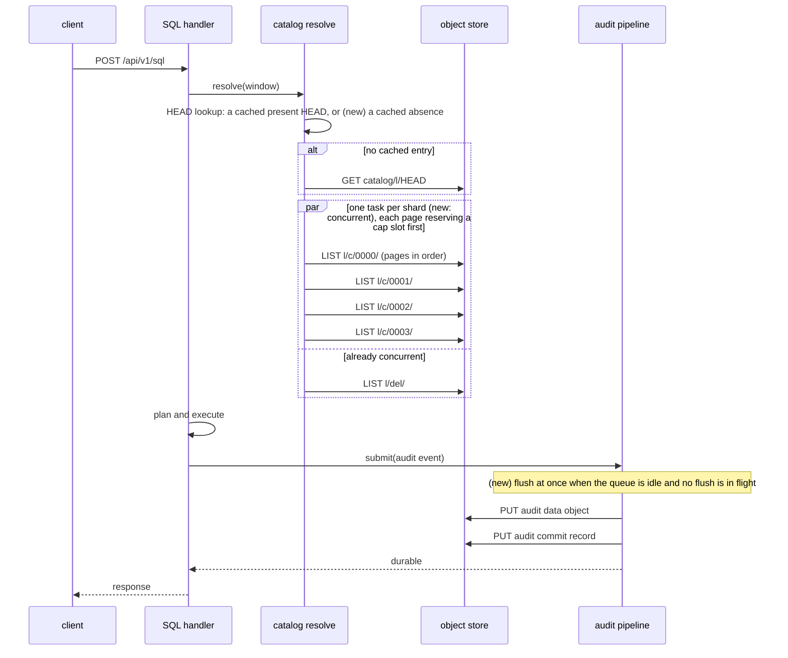

# ADR-2509: the per-statement floor: the prefix listing runs shards concurrently under a reserved LIST cap, the audit pipeline flushes when idle, and a missing catalog HEAD is cached

Status: Accepted (2026-10-04). Issue #2509.
No persistent format changes. Every object, key, commit record and audit
record stays byte-identical. This decision changes the order and overlap of
requests a statement issues and when a queued audit batch is flushed, never
what is written.

## Context

Every SQL statement pays a fixed cost before it reads any data. On the
v0.21.0 ClickBench entry (ClickHouse/ClickBench#2371), `SELECT COUNT(*)`
answered in 0.44 s hot, while VictoriaLogs answers the same statement in
12-35 ms. Ravel's hot total beats VictoriaLogs over the 42 statements both run
(80.3 s against 91.9 s), but its geometric mean is 2.8x worse. The floor is
what loses that score.

### Stage 0 measurement

The measurement is posted on #2509: the pre-registration, the result, and the
RustFS addendum.

**Setup.**
- Box: c6a.4xlarge in us-east-1, real S3, with the fleet executor drained.
- Binary: `origin/main` bc74bcd75, `--release`, `--features sql`.
- Tenant: the compacted reference tenant, with 219 segments and 2,617 commit
  records over 4 shards.
- Logs catalog: never folded. No logs snapshot exists for this tenant.
- Query window: `start: 0`, the same window the upstream driver sends.

**Method.** The server's own `ravel_store_latency_seconds` and `/proc` CPU,
measured over 30 hot q1 statements with the background fold disabled:

| component | per statement | share | mechanism |
|---|---|---|---|
| commit-record LIST | about 205 ms | about 50% | `list_window_by_prefix` drains the 4 shards one after another, about 51 ms per LIST. The `del/` erasure LIST is already joined concurrently. |
| query-audit write | about 123 ms | about 30% | The pipeline waits its `max_age` (25 ms) for a batch that sequential traffic never fills, then writes the data object and its commit record, about 49 ms each, in that order. |
| GET | about 35 ms | about 8% | One is the catalog HEAD read. It returns NotFound and is never cached, so every statement repeats it. |
| CPU | 31 ms | about 7% | planning, the declared-stats decode, LIST XML parsing |
| total wall time | 413 ms | | The parts sum to it: each step waits on the previous one. |

- The client contributes about 3 ms.
- The `stats.phases` request counts agree: 5 LIST and 2 GET, all in
  `resolve`.

**RustFS, the store the upstream entry runs on.** Measured with raw requests,
not end to end:
- A 650-key shard LIST costs about 75 ms after correcting for the client's
  XML parsing.
- A PUT costs 4 ms, and a GET 1 ms.
- The listing is therefore about 80% of the floor there, and the audit write
  under 10%.
- This model puts q1 at about 0.37 s, against the 0.44 s measured upstream.
  The model undershoots by about 70 ms.

### Why the listing is sequential

ADR-0056 added the prefix traversal for wide windows. A query with
`start: 0` and no snapshot HEAD selects it, because its suffix bucket count
reaches `prefix_list_crossover_requests` (720).

ADR-0056 keeps ADR-0044's request ceiling, "a single resolve never issues
more than `max_catalog_list_requests` catalog LISTs", as a runtime count of
the pages the prefix path drains. `docs/catalog-and-mvcc.md` explains why the
traversal is sequential: the LISTs "drain sequentially under a page-by-page
request cap, so a pathologically wide window is refused deterministically
rather than fanning out unboundedly".

The cap check today reads the count and increments it only after the LIST
returns. That is sound only because nothing runs concurrently.

### Why the audit write is on the response path

ADR-0062 §2a and §2b require every read surface to await the durability of
its audit record before releasing the response. That is the "non-lossy"
contract: no acknowledged query lacks a durable record.

The record carries the query's outcome status, so it cannot be written
before execution ends.

The two PUTs are ordered data-then-commit. That is the durability order
every writer follows: a commit record never names an object that does not
exist.

The 25 ms wait comes from the flush loop (`run_flush_loop`). It arms a
`max_age` deadline on the first event and never checks whether more events
could arrive.

### Tenant states this decision covers

- **Unfolded, whole-history window.** This is the state every ClickBench run
  measures. The upstream `load` runs no fold. The entry is restartable, so the
  ClickBench harness restarts the server before each statement's cold run.
  Server logs from runs on the reference box start 20 to 40 s apart, well
  inside the 5-minute fold interval.
- **Folded.** This is the normal production state: the scheduled fold runs
  every 5 minutes in `--mode all` and `--mode maintain`.
  - The resolve reads a cached HEAD and lists only commits past the
    watermark, one concurrent LIST round over nearly empty pages
    (`list_window_bounded`).
  - The audit write is then the largest part of the floor.

## Decision

### 1. The prefix traversal lists shards concurrently under a reserved cap

- `list_window_by_prefix` drains each shard in its own task. Up to
  `resolve_get_concurrency` tasks run at once, the same bound
  `list_window_bounded` already uses.
- Pages within a shard stay sequential, because each page's continuation
  token comes from the previous page.
- **The cap is reserved, not checked.** Before issuing a page, a task takes a
  slot from one shared counter with an atomic `fetch_update` that refuses
  when the count is already at `max_catalog_list_requests`.
  - A refused reservation aborts the whole resolve with
    `CatalogError::WindowTooWide`. In-flight pages are cancelled.
  - A slot is never returned. The count bounds requests issued, not requests
    that succeeded.
- **The bound stays exact:** no resolve issues more than
  `max_catalog_list_requests` LISTs.
- **Determinism loses one property.** Which shard reaches the cap first, and
  the `estimate` value in the error, can vary between runs. The refusal
  itself does not vary, because a window whose total page count exceeds the
  cap is refused on every run.
- The shard results are merged in shard order before step 2 partitions them,
  so the resolved key set and its total order are unchanged. ADR-0056's "both
  traversals produce the identical key set" still holds.
- **Amendments.** ADR-0056 and `docs/catalog-and-mvcc.md` (the prefix-scan
  bullet under the resolve steps) get an amendment that replaces "drain
  sequentially ... refused deterministically" with this rule. The amendment
  uses the marker syntax `scripts/guards/check-amendment-integrity.sh`
  checks.

### 2. The audit pipeline flushes when it is idle

- `run_flush_loop` starts a flush as soon as the queue is empty and no flush
  is in flight, instead of waiting out `max_age`.
- Events that arrive while a flush is in flight wait for that flush to
  finish, then form the next batch together. They flush when that flush
  completes, when they reach `max_batch`, or when `max_age` elapses,
  whichever comes first.
- So under concurrency the pipeline still group-commits: a burst arriving
  during a flush shares the next pair of PUTs. It never degenerates to one
  pair per event.
- `max_age` remains the upper bound on how long an event waits once a batch
  is open behind an in-flight flush.
- ADR-0062's contract is untouched: every submitter still awaits its batch's
  durable flush before its response is released, in `required` and
  `best-effort` alike. ADR-0062 gets an amendment, marker `none` with a
  reason, recording the idle trigger and these numbers.

### 3. A missing catalog HEAD is cached on the resolve path

- `SnapshotResolve::read_head` caches a NotFound for `head_cache_ttl`
  (default 30 s), in the same per-tenant, per-signal cache that holds a
  present HEAD.
- A cached absence makes the resolve list the whole window. That is the most
  conservative traversal, so the resolve never misses a commit. A HEAD
  published inside the TTL is seen up to 30 s late, the same delay a cached
  present HEAD already allows.
- **Scope: only the query resolve's `read_head`.** Two readers never see a
  cached absence:
  - The fold's own HEAD reads (`ravel-catalog/src/fold.rs`,
    `services/ravel-server/src/fold_on_demand.rs`) do not consult this
    cache. A fold that saw a cached absence would rebuild from nothing and
    lose its HEAD CAS.
  - ADR-1133's delete gate does not consult it either.
- A GET that fails for any reason other than NotFound is not cached. It still
  falls back to listing, as today.

### What this moves, pre-registered

The implementing tasks' acceptance stamps are measured the same way as Stage 0:
- the same box class, tenant, statements and window;
- the server's `ravel_store_latency_seconds` and `/proc` CPU over 30 hot q1
  statements;
- an end-to-end q1/q7/q37 run on the RustFS entry as the after-stamp.

| figure | now | expected after | counts as a miss |
|---|---|---|---|
| q1 hot, real S3, unfolded | 0.413 s | 0.22-0.30 s | above 0.33 s |
| LISTs per q1 / their summed latency | 5 / about 257 ms | 5 / unchanged | anything other than 5. The sum is unchanged because the same requests now overlap. |
| wall time spent in the commit listing | about 205 ms | about 55-110 ms | above 150 ms |
| GET per q1 | 2 | 1 | 2 |
| audit wait beyond the two PUTs | about 25 ms | under 3 ms | above 10 ms |
| PUT per q1, sequential traffic | 2 | 2 | anything other than 2 |
| PUT pairs for 64 statements submitted while one flush is held | 1 (one `max_age` batch) | 1 or 2 (the held flush, then one batch) | more than 2, which means the idle flush stopped batching |
| q1 hot, RustFS entry, end to end | 0.44 s (upstream) | 0.12-0.25 s (from the model) | above 0.30 s |

**How the end-to-end bands are derived.**
- Real S3: the band is the measured components with the listing overlapped
  to about one round and the 25 ms and one 18 ms GET removed.
- RustFS: the band comes from a model that undershoots by about 70 ms, so
  its upper edge carries that error.

**Folded tenants.** For a folded tenant (production), only the 25 ms audit
wait and, while no HEAD exists, the HEAD GET change. The floor there is
dominated by the audit write's two PUTs (about 98 ms on S3). This decision
does not move it. See "Deferred" below.

## Rejected alternatives

- **Cache commit listings across statements for a short TTL.** Rejected on
  three grounds:
  - `docs/consistency-model.md` makes freshness above the fold watermark
    "listing-immediate", and `catalog-and-mvcc.md` repeats it. A token-less
    query would stop seeing commits acknowledged before it started. The HEAD
    cache is no precedent: a stale HEAD only widens the listed suffix and
    never hides a commit.
  - A cached listing also misses compaction, rewrite (`rw.`) and retention
    records that land in already-listed hours. A missed erasure rewrite
    serves erased data.
  - A listing older than the GC horizon can name inputs the sweeper has
    deleted.
- **Remember the last listed key per shard and list only past it.** Commit
  keys sort by ingest hour and then writer id. A writer can commit into the
  current hour under a lexicographically smaller id, or into an earlier
  unsealed hour within `max_flush_lifetime`. Compaction and rewrite records
  land in old hours. A `start_after` remembered from the previous listing
  misses all of these. The alerts memo's tail listing is safe only because it
  starts from a watermark that the fold has sealed, and that watermark is
  what an unfolded catalog lacks.
- **Drop the cap on the prefix path, or check it after the fact.**
  - Without the cap, a pathologically wide window fans out unboundedly. That
    is the case ADR-0044 and ADR-0056 exist to refuse.
  - Check-then-increment under concurrency lets up to
    `resolve_get_concurrency` pages pass at `cap - 1`. That breaks the exact
    bound.
- **Release the response before the audit record is durable.** This
  contradicts ADR-0062 §2a and §2b, the non-lossy audit contract. It would
  remove about 123 ms on S3, but it is a compliance decision, not a
  performance one. This epic does not take it.
- **Write the audit record concurrently with execution.** The record's bytes
  include the outcome status (`query_audit_event`), so the data PUT cannot
  start before execution ends. Writing an "attempted" record first, as DDL
  does, adds a third PUT and still awaits the outcome record.
- **Write the audit data object and commit record concurrently.** A commit
  record could then name an object that does not exist yet, or never will.
  Every writer orders data before commit, and the audit writer follows that
  order too.
- **Set `--audit-max-batch 1`.** It removes the wait for sequential traffic,
  but turns every concurrent statement into its own PUT pair. ADR-0062 calls
  this the degenerate configuration.

## Evaluated, not decided: fold at the end of the benchmark load

- A folded catalog's resolve lists only past the watermark. On RustFS an
  empty LIST takes 1-2 ms, against about 75 ms for a 650-key shard page. So
  on the upstream store a folded tenant would cut the listing by about an
  order of magnitude more than item 1 does.
- The upstream driver could do this with
  `ravel-cli catalog fold --signal logs --max-flush-lifetime 0s` as the last
  step of `load`. The writer has exited by then, which is what makes
  `--max-flush-lifetime 0s` safe.
- Its cost is not measured. The fold reads every part to build per-part
  column stats, and that time counts as load time, which ClickBench scores
  too.
- Folding loses no statistic COUNT(*) relies on: snapshot entries carry
  `sample_count` and the declared stats.
- This is a change to the benchmark entry, not to the engine. It is a
  measured follow-up on #2509, run after item 1 lands, so its gain is
  measured over the improved unfolded path rather than the current one.

## Deferred

- **The audit write's two PUTs on a folded tenant.** They are the largest
  part of the production floor (about 98 ms on S3). Moving them needs an
  ADR-0062 amendment on what "durable before response" requires: one object
  carrying both data and commit, or a weaker acknowledgement for read
  audits. That is a separate decision with a compliance owner. #2509 records
  it as the next item once this decision's stamps are in.
- **#2368.** A fold re-fetches parts whose format it cannot read on every
  pass. On the reference tenant that is 565 per-part warnings, from the
  superseded L0 objects. It wastes fold work but does not affect this
  decision's query path. It stays its own issue.

## Consequences

- **Resolve cost.** On an unfolded tenant, the prefix resolve's wall time
  drops from the sum of its shards' listings to roughly the slowest shard's.
  Its request count is unchanged. Concurrent listing raises the peak number
  of in-flight LISTs one resolve issues, from 1 to the shard count (4 here),
  within the bound `list_window_bounded` already uses.
- **The `WindowTooWide` error.** It names the pages reserved when the cap was
  hit, which can differ between runs of the same over-wide query. Tests
  assert the refusal and the bound, not the exact count.
- **The audit pipeline.** Under sequential traffic it no longer waits
  `max_age`. Under concurrent traffic, batching is preserved by the
  in-flight-flush rule. A test with a held `FaultStore` flush asserts a burst
  shares one PUT pair. `max_age` and `max_batch` keep their meaning as upper
  bounds.
- **HEAD visibility.** An unfolded catalog's first published HEAD is picked
  up by queries up to `head_cache_ttl` late. Until then the resolve keeps
  listing the whole window, which is correct and only slower.
- **Tests.**
  - Concurrency is proven with `FaultStore` holds, because `MemoryStore`
    never yields.
  - The listing tests must fail against:
    - a check-then-increment counter, which overshoots the cap;
    - a still-sequential loop.
  - The audit tests must fail against:
    - an idle flush that never batches (a burst during a flush gives one PUT
      pair per event);
    - an idle flush that still waits `max_age`.
  - A reachability test drives the SQL HTTP handler end to end and asserts
    the request counts.
