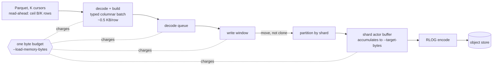

# ADR-2614: the bulk loader's memory is bounded by bytes, not by batch rows

Status: Accepted (2026-10-06). Issue #2614 (epic), Stage 0 #2613.
No persistent format changes. Every RLOG object stays byte-identical for the
same input and settings. This decision changes the loader's in-memory
representation of a batch, how many copies of it are alive at once, and what
bounds them.

## Context

`ravel-cli load` holds about 32 KB of resident memory per row of
`--batch-rows`. The figure is fitted from v0.22.0 release binaries on an
r6a.4xlarge (128 GB), loading ClickBench `hits.parquet`: 100M rows, 105
columns, 14.7 GB, about 419 bytes per row uncompressed.

| `--batch-rows` | depth | cursors | peak RSS | load |
|---|---|---|---|---|
| 150,000 | 4 | 16 | 8.7 GB | 1,204 s |
| 500,000 | 4 | 16 | 20.3 GB | 1,439 s |
| 500,000 | 1 | 16 | 16.8 GB | 2,789 s |
| 1,000,000 | 4 | 16 | 35.7 GB | 1,489 s |
| 1,000,000 | 1 | 16 | 31.7 GB | 2,892 s |

What this costs:
- **ClickBench cold time.** On the upstream ClickBench entry (RustFS on gp2),
  object size is the lever for cold queries. About 25 MB objects
  (1,000,000-row batches over 4 shards) halve the cold total (1,280 → 649 s).
  On 16 GB machines they also bring hot runs inside the page cache (q2 hot
  27.8 s → 4.1 s; #2615).
- **Small machines.** Today that object size loads only on machines with more
  than about 40 GB. At stock settings the loader swaps on 8 GB and fails on
  4 GB with `flush failed: timed out waiting for shard ack` (#2592).
- **Pipeline depth.** Depth 4 → 1 saves only 11–17%.

### Stage 0: where the memory is

Stage 0 profiled the whole loader by allocation site with jemalloc, at two
batch sizes, on the real corpus (#2613, `docs/internal/loader-memory-2613.md`).
Live heap at steady state, B = 500,000, K = 16 read cursors, S = 4 shards,
depth 4:

| site | live | per batch row | grows with |
|---|---|---|---|
| Parquet decode held by the read cursors | 7,010 MB | 14.0 KB | K × B: each cursor decodes a whole B-row Arrow batch of every column and deals only B/K rows from it per round |
| `build_columnar_batch` and every finished `ColumnarLogBatch` still alive | 3,764 MB | 7.5 KB | B × copies alive |
| the per-slot `vec![None; rows]` of `Option<AttrValue>` | 1,184 MB | 2.4 KB | B |
| owned `String` per string cell | 614 MB | 1.2 KB | B |
| `partition_columnar` per-shard clones (parent kept alive until the acks) | 4,152 MB | 8.3 KB | B × in-flight writes |
| encoder working set (mostly the memory store's held objects) | 2,873 MB | — | concurrent flushes, not B |

Two findings drive this decision:

- **The `AttrValue`-per-cell batch costs about 4.5 KB per row**, against 419
  bytes of raw data: a tenfold blow-up before anything is copied. A 32-byte
  `AttrValue` per cell across the 104 mapped attributes is 3.3 KB per row, and every string
  cell adds an owned `String` copied out of the Arrow buffer (the findings
  document's "Where the memory is" and "Multiplicity" sections). Up to
  1 + Q + 2D copies of it can be alive (building, queued, the router's
  parent, the per-shard copies).
- **No queue is bounded by bytes.** The decode queue, the write window and
  the per-shard flush permits are all counts. A larger `--batch-rows` grows
  every term until the machine runs out, which is the failure mode seen on
  every small box.

### Stage 0 reduction 1 (landed with #2621)

Each cursor's reader decodes ceil(B / K) rows at a time
(`services/ravel-cli/src/load/input.rs`), and `cursor_take_spans`
(`services/ravel-cli/src/load/logs.rs`) deals rows up to the same virtual
B-row boundary.
- At B = 500,000, one 360 s run each on a 16-vCPU, 30 GB x86_64 fleet
  executor (K = 16, 4 shards, memory store, jemalloc profiling on): peak RSS
  22.68 → 15.48 GB, Parquet live 7,010 → about 410 MB.
- Load rate looked unchanged, but that was inferred from when heap dumps
  fired, not from a measured wall-clock rate.

The checkpoint review blocked the first version. With K > 1, a cursor whose
partition ends short of its share was marked exhausted one round earlier
than before. Every row still loaded exactly once, but batch composition
changed (rows 1,000, K 4: batches of 950, 750, 667, 233 became 950, 917,
733). The byte-identity test compared the new dealer with itself and could
not see it. The fix round restored the old exhaustion round and added
`batch_composition_matches_the_pre_2613_dealer`, a differential test against
a test-only copy of the pre-change dealer, and the change landed with it.

## Decision

### 1. Read cursors hold at most one reader batch each (landed, #2621)

As above. The decoded Arrow rows held by the cursors drop from K × B to
about B: one batch's worth across all cursors. Each cursor still keeps its
own reader and page-decode state. Batch composition must match the
pre-change dealer exactly (see above).

### 2. One copy of a batch at a time

`write_columnar` already takes the batch by value, but it partitions by
reference and keeps the parent alive until the shard acks. What changes:
- `partition_columnar` consumes the parent and builds the per-shard batches
  by draining its columns (moving cells), not by cloning them. Since wave 2
  the typed cells are copied by row instead; see the typed column amendment
  below.
- The parent is gone before any shard message is sent, so the router no
  longer holds it until the acks.

The clone path drops the parent's column dictionaries (`dyn_col_dicts`)
today. A parent dictionary cannot be copied onto a child as it is: its `ids`
hold one id per present cell of the parent's column, and the partition drops
columns a child leaves all-absent, so the vector is the wrong length and
misaligned for any child. What a child can keep is, for each column it
retains, the parent's `distinct` table, with `ids` cut down to the child's
present cells and the vector re-indexed onto the child's `dyn_columns`. The
child must pass the same `validate()` checks a loader-built batch does. The
encoder re-interns, so RLOG bytes are the same either way. The wave 1 task
keeps the dictionaries only if it shows byte identity; otherwise it keeps
dropping them and says so. Under decision 4 the dictionary becomes the
dictionary form of the typed string column, and the same subset-and-reindex
rule applies to it. Wave 1 drops the dictionaries at the split, and decision
4 decides the typed string column's dictionary form afresh: see the wave 1
dictionary amendment below.

### 3. Dense columns from the start

`build_columnar_batch` fills a dense column plus a validity bitmap in row
order. It keeps the first-occurrence rule, and drops the per-slot
`Option<AttrValue>` vectors and the compaction pass.

### 4. A typed columnar batch (an in-memory API change in `ravel-logseg`, not a format change)

`ColumnarLogBatch` carries:
- string columns as offsets plus bytes (or dictionary ids plus one
  dictionary; wave 2 took offsets plus bytes only and the loader attaches
  no dictionary, see the typed column amendment below);
- I64, F64 and Bool columns as plain vectors;
- validity as a bitmap.

It no longer carries `Vec<AttrValue>`. Strings are borrowed from, or copied
once out of, the Arrow buffers, never per cell into owned `String`s. For this
corpus the batch drops from about 4.5 KB to about 0.5 KB per row, and every
remaining copy shrinks with it.

`RlogWriter::build_object_columnar` reads the typed columns directly. ADR-0109
decision 7 (row and columnar builders produce byte-identical objects) still
holds, and the differential tests that pin it must pass unchanged.

### 5. One byte budget for the whole load

`--load-memory-bytes` is the budget. When unset it is derived from host
memory (MemTotal, capped by a cgroup limit) less the loader's own
non-budget floor: process baseline, Parquet reader and page-decode state per
cursor, and the encoder's working set for the concurrent flushes. Those are
the terms Stage 0 measured outside the batch copies. The implementing task
pins the floor's constants and states them. Where host memory cannot be read
(no `/proc/meminfo`, as on macOS), the budget falls back to a named constant
that the implementing task states, and the loader logs that it did so.

Every built batch is charged its measured size from the moment it is built
until the flush that consumes it completes or fails. That covers the time it
is:
- being built;
- queued;
- in the write window;
- held in a shard actor's buffer;
- held by a spawned flush task, including one queued behind the
  `--max-inflight-flushes` permits (Stage 0 measured that term separately
  from the encoder's working set).

The loader takes the charge on one shared budget before it builds a batch,
so the 1 + Q batches being built or waiting in the decode queue are covered.
ADR-0069's ingest byte budget only covers the tail of that lifetime. Its
charge is taken inside `write_columnar`, after the batch was built and
queued. It is cloned into every shard message and refunded when the flush
holding the bytes completes or fails. Reusing ADR-0069's charge unchanged
would therefore leave the build side, the second-largest Stage 0 term,
unbounded. The implementing task carries the loader's charge into the router
in place of a fresh one, so each batch is charged once from build to flush.
The loader waits for room before it builds; the router never refuses one of
its writes.

The decoder waits when the budget is spent.
- `--pipeline-depth`, `--decode-queue-batches` and `--max-inflight-flushes`
  remain upper bounds on counts.
- Exceeding memory becomes waiting, not swapping and a shard-ack timeout.
- When the budget cannot hold even one batch, the loader refuses at start
  with a message naming the budget and the batch's estimated size.

### 6. Object size is set by bytes, not by batch rows

Shard actors already merge several batches into one object
(`BufContent::Columnar(Vec<_>)`). With 2–5 in place, the recommended way to
get large objects is a small `--batch-rows` (for example 50,000) and a
`--target-bytes` at the object size wanted, with the shard buffers inside the
byte budget. `--batch-rows` stops being a memory setting. The ClickBench
entry's `load` sizes `--target-bytes` and `--load-memory-bytes` from the
machine. The default object size is unchanged.

### Acceptance (pre-registered; measured with the #2592 method)

The release binaries run with the bot's cloud-init, the ClickBench corpus,
and loader RSS sampled every 5 s.

| criterion | how measured | target |
|---|---|---|
| 1,000,000-row objects (≥ 25 MB) load under a fixed RSS | r6a.4xlarge, `--target-bytes` at the object size | peak loader RSS < 8 GB |
| load time no worse | same box; the first acceptance step measures main at 524bff9d (v0.22.0 plus #2621) at 1,000,000 rows, since 1,489 s was measured on v0.22.0 and #2621's wall-clock rate was never measured | ≤ 1.05 × that baseline |
| objects byte-identical | differential tests, row vs columnar and old vs new batch type, on fixed inputs | pass |
| the corpus loads on a 4 GB machine with ≥ 25 MB objects | c6a.large, full ClickBench run | load completes, no swap-induced shard-ack timeout |
| the corpus loads on 8 GB and 16 GB with ≥ 25 MB objects | c6a.xlarge, c6a.2xlarge | load completes in ≤ 1.5 × today's stock load time on that machine |

Query completion on 4 GB and 8 GB machines is reported, not gated. It also
depends on #2615 (the read cache serves nothing on these runs, q20 reads the
corpus twice, q33 exceeds the per-query limit), and on spill needing
`--cache-dir`, which the entry sets.

## Rejected alternatives

- **Tune the entry around today's loader** (tiered `--batch-rows` by machine
  memory, #2592). Measured and rejected as the main route:
  - at about 28–32 GB per million batch rows, a 16 GB machine affords about
    250,000 rows and 8 GB less than stock;
  - neither reaches the object size where cold improves;
  - 1,000,000 rows on 32 GB completes only by swapping.
- **Lower `--pipeline-depth` or read cursors.** It saves 11–17% and doubles
  or triples load time (#2592). Depth is mostly unused because the decoder is
  the bottleneck; Stage 0 confirms it.
- **Stream the encode column by column from Arrow straight into the RLOG
  writer, with no intermediate batch.**
  - It would remove the batch entirely.
  - But the per-shard split, the stamp and identity resolution, and the
    dictionary interning all need a batch of rows grouped by shard first.
  - The writer's columnar path (`writer.rs`, about 6,600 lines) would be
    rewritten around a different input contract, and the byte-identity
    argument would have to be rebuilt from scratch.
  - The typed batch (decision 4) gets most of the saving (4.5 → 0.5 KB per
    row) with the existing contract.
- **A memory-only fix in the RLOG format** (smaller blocks, a different
  column layout). The format is frozen (`docs/log-segment-format.md`), and
  Stage 0 shows the memory is the in-memory representation, not the encoded
  object.
- **Make `--store memory` or the loader spill batches to local disk under
  pressure.** It adds a local-disk dependency to a path that writes straight
  to object storage. A byte budget that makes the decoder wait achieves the
  same bound without it.

## Consequences

- **`--batch-rows` stops being the memory knob.**
  - On large machines the default load is unchanged; objects stay at today's
    size unless `--target-bytes` is raised.
  - On small machines the byte budget turns "swap, then a shard-ack timeout"
    into slower progress.
- **API change.** The `ColumnarLogBatch` change touches `ravel-logseg`'s
  writer, `ravel-ingest`'s router and shard actor, `ravel-cli`'s loader, and
  `ravel-bench`'s columnar load harness (`columnar_load.rs`, which builds a
  `ColumnarLogBatch` with `from_records` and drives `write_columnar`).
  - The OTLP ingest flush builds row-shaped buffers through
    `build_object`, not through the columnar path, so it is unaffected; the
    implementing task confirms that by grep.
  - Compaction, erasure rewrite and the audit writer use the row builder and
    are unaffected.
- **The `--pipeline-depth` help text.** It said the working set scales by
  roughly the depth. Stage 0 measured otherwise, and #2621 corrected it.
- **Validation.** The ClickBench entry's sizing (#2592) waits for this epic,
  then is measured on all nine machine types before any upstream PR.

## Amendment (2026-10-07): wave 1 drops dictionaries at the split (issue #2624)

<!-- amendment-applies: sections="2. One copy of a batch at a time" pointer="wave 1 dictionary amendment" -->

Decision 2 left open whether wave 1 keeps the parent's column dictionaries
(`dyn_col_dicts`) on the per-shard batches. It does not: `partition_columnar`
drops them, and every per-shard batch has an empty `dyn_col_dicts`, as the
clone path did. The move itself stands as decision 2 states it: cells,
residual attribute lists and stream blobs move into the shards, the parent
is freed column by column, and it is gone before any shard message is sent.
(Wave 2's typed cells are copied by row rather than moved; residual lists
and stream blobs still move. See the typed column amendment below.)

An earlier revision of wave 1 kept them, cut down and re-indexed per
decision 2, and was reverted:

- Keeping them costs one copy of each distinct value per shard that uses
  it. In the measured run those child dictionaries held a median 62 MB.
- That memory is invisible to the byte budget. `est_columnar_bytes`, the
  figure a shard buffer registers and the write is charged, does not read
  `dyn_col_dicts`, so decision 5's budget could not bound it. This epic's
  goal is memory a budget bounds.
- `validate()` checks dictionary entries against `Str` and `Bytes` cells
  only, so a `Bytes` column holding a `List` or `Map` cell needed a
  carve-out that gave that shard no dictionary.

Figures, `ravel-cli load` on ClickBench `hits.parquet` at
`--batch-rows 500000 --read-cursors 16 --shards 4`, one run per binary
(docs/internal/loader-memory-2613.md, "Wave 1 (#2624)"):

- With dictionaries dropped, peak RSS fell from 15.48 GB (stage 0) to
  11.37 GB.
- Keeping them peaked at 11.33 GB, within the 0.02 GB spread of two runs of
  that code, so no effect is resolved.
- Median total live heap was 10,267 MB dropped against 9,833 MB kept, and
  the dropped run had read an estimated 33.2 million rows by +358 s against
  32.1 million.

Stored objects are byte-identical either way, since the writer interns
dictionary entries by their bytes. Decision 4 decides the typed string
column's dictionary form afresh, inside a batch whose bytes the budget
counts; decision 2's subset-and-reindex rule for it no longer binds.

## Amendment (2026-10-07): the typed column has no dictionary form (issue #2625)

<!-- amendment-applies: sections="4. A typed columnar batch (an in-memory API change in `ravel-logseg`, not a format change)" pointer="typed column amendment" -->

Decision 4 offered string columns as offsets plus bytes "or dictionary ids
plus one dictionary". Wave 2 took only the first form. A `DynColumn`'s cells
are a `DynCells` payload: `Str` and `Bytes` cells as one byte buffer with
`u32` offsets per column per batch (a `Bytes` column also keeps the original
of each `List` or `Map` cell in a side list), `I64` and `F64` cells as plain
vectors, and `Bool` cells as a vector of flags.

- The loader attaches no dictionary: `build_columnar_batch` leaves
  `dyn_col_dicts` empty.
- The writer's dictionary path (`StrColumnDict`, ADR-0109 decision 3)
  remains for other producers that supply one. No production producer in
  this repository does after this change; the differential tests drive it
  through `ColumnarLogBatch::with_dictionaries`.
- `partition_columnar` copies typed cells by row (`DynCells::push_from`):
  string and byte cells are copied and a nested `List` or `Map` original is
  cloned. Only residual attribute lists and stream blobs still move.
  Decision 2's "moving cells" described the `AttrValue` cells this
  replaced.
- One column's bytes in one batch are bounded by its `u32` offsets, 4 GiB.
  A value that would pass that is refused with `LimitExceeded`, which the
  loader reports as a load error naming the column and suggesting a smaller
  `--batch-rows`, and `validate()` refuses offsets that are not monotonic.

Measured outcome, `ravel-cli load` on ClickBench `hits.parquet` at
`--batch-rows 500000 --read-cursors 16 --shards 4`, stopped after 360 s,
one run per setting (docs/internal/loader-memory-2613.md, "Wave 2
(#2625)"):

- Peak RSS over the run was 11.02 GB, against 11.37 GB in wave 1. The
  host differed (8 cores and 16.0 GB of memory, against 16 cores and
  32.1 GB), so the comparison does not isolate the change.
- The load wrote to the in-memory object store, which holds every written
  object in the measured process: `push_section` held 9.4 GB in the last
  heap dump.
- Three of the four pre-registered targets were missed. Bytes per batch
  row: 1,334 in a one-off measurement, against 0.5 to 1 KB, so decision 4's
  "about 0.5 KB per row" did not hold on this corpus, whose 75 integer
  columns are present on every row and take 600 bytes per row by
  themselves. Under 1 GB at batch build and at shard partitioning: medians
  1,793 MB and 1,648 MB. Peak RSS 5 to 7 GB: 11.02 GB.
- One target was met: at `--batch-rows 1000000` the load ran its 360 s
  without running out of memory, at a 13.33 GB peak.

At about 667 MB a batch in that one-off measurement, the two site medians
are about 2.7 and 2.5 batches held at once. Wave 3's byte budget (decision
5) targets that remaining multiplicity, the number of batch copies alive,
rather than the size of one batch.
