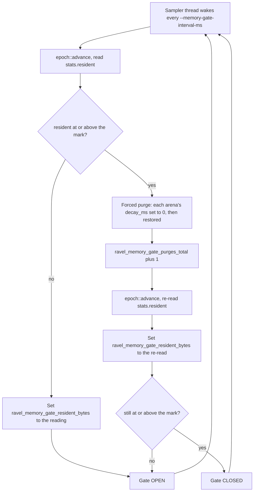
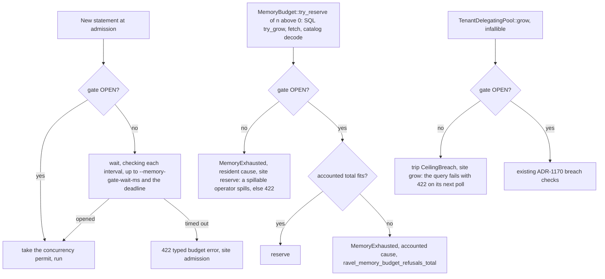

# ADR-2633: Resident-aware memory admission

Status: Accepted (2026-10-09).

Revised (2026-10-10): the high-water mark is re-derived from the uncharged heap
measured after the aggregate hold (PR #2685); the default moves from 75 % to 70 %.

Issue #2633, epic #2040. Builds on ADR-1170 (one
process-wide memory budget) and, once accepted, changes the ADR-1170 sentences
listed in section 6. No persistent format changes: no object Ravel writes, no
key it builds and no protobuf schema changes. This decision adds a gate in
front of the process `MemoryBudget` that reads the allocator's resident
figure, forces a purge at a high-water mark, and refuses growth with the typed
budget error while the mark is still exceeded. It also moves every
memory-budget refusal on the fetch path, and the catalog decode refusal
(`CatalogError::MemoryExhausted`), from 503 to the budget's 422.

## Context

ADR-1170 bounds tracked allocations: the two caches are hard eviction caps
carved from `memory_budget_bytes`, and SQL and fetch draw from
`memory_remainder_bytes` through one `Arc<MemoryBudget>`
(`crates/ravel-memory/src/lib.rs`). Its constraint 4 says the ceiling cannot
be RSS, and its Consequences name the residual it leaves: process survival is
guaranteed for tracked allocations only. The measurements below show that the
residual is not small, and that most of it is not live memory at all.

### What was measured

Scaled ClickBench run: `--memory-budget-bytes` 8 GB, 20 ClickBench files, 10
connections, 32 GB host. "Accounted" is what the ADR-1170 ledgers had
reserved. "Retention" is jemalloc `stats.resident` minus `stats.allocated`:
pages the process freed and the allocator has not yet returned to the kernel.

| Run | Server | Peak gap (jemalloc `resident` − accounted) | Of which retention (`resident` − `allocated`) | Peak VmRSS | Idle retention |
|---|---|---|---|---|---|
| baseline | main before fixes | 4.22 GB | 2.54 GB | 9.01 GB | 2.0 GB |
| rerun | + background purge thread (#2652) + cache owned copy (#2653) | 6.30 GB | 5.43 GB | 10.44 GB | 0.08 GB |
| decay A, x2 | same, default decay | 6.69 / 7.06 GB | 6.54 / 6.11 GB | 9.89 / 10.19 GB | 0.09 GB |
| decay B, x2 | same, `dirty_decay_ms:1000,muzzy_decay_ms:0` | 4.91 / 5.00 GB | 4.33 / 4.65 GB | 8.83 / 8.82 GB | 0.09 GB |

What the table and the runs behind it establish:

- Every run's peak VmRSS is above the 8 GB budget, by 0.82 to 2.44 GB.
- Retained-but-freed pages dominate the gap at peak: 2.54 of 4.22 GB on the
  baseline, and 4.33 to 6.54 GB of 4.91 to 7.06 GB on every later run.
- The background purge thread (#2652) removed idle retention (2.0 GB to
  0.08 GB) but not peak retention, which grew. Idle is not where the process
  dies.
- The 1 s dirty decay (decay B) cuts median retention from about 3.7 to about
  1.3 GB but leaves 4 to 5 GB bursts. One run's 5 s samples of retention read
  0.9, 2.3, 4.3, 2.1, 0.9 GB: a burst of 2 GB per 5 s sample, about
  0.4 GB/s, that a decay timer of any length lags.
- The 1 s decay costs 10.9 % qps, which cannot be separated from noise: the
  two default-decay runs alone differ by 9.2 %.
- The uncharged live heap is mostly DataFusion aggregation state. It is
  `allocated` − accounted + handoff overlap: the overlap is counted twice
  inside "accounted", so it is added back, not subtracted. In nearly every
  sample the overlap equals `fetch_reserved`, so in practice the figure is
  `allocated` − `sql_reserved` − cache resident. Its per-sample maximum,
  over every 5 s sample in each run's `samples.tsv`, is 4.46 GB (baseline),
  3.15 GB (rerun), 3.43 and 1.91 GB (decay A) and 3.03 and 2.98 GB
  (decay B). A gate must hold at the worst sample, not at the peak-gap one,
  so the derivation in section 2 uses a per-sample maximum, taken after the
  aggregate hold below.
- `memory_overhead_reserve_bytes` is a fixed 2.1 GB at the 27 GB budget (it
  is `MEMORY_OVERHEAD_RESERVE_BYTES`, 2 GiB, in
  `crates/ravel-maintain/src/config.rs`).
- The M1 run (30 GB host, 27 GB budget) was OOM-killed in 3 of 3 attempts.

The gap is therefore mostly memory nobody is using, which the allocator would
return if asked. ADR-1170 cannot see it, because the budget counts
reservations, and the allocator's decay cannot be relied on to return it
before the kernel acts.

### The aggregate hold, and what it leaves uncharged

DataFusion 54.1 shrinks a `GroupedHashAggregateStream`'s reservation at emit
while the emitted batch is still live, which left up to 1.2 GB per statement
uncharged. PR #2685 (main `7b5c56134`) adds a hold: `TenantDelegatingPool`
keeps a non-spillable `GroupedHashAggregateStream`'s shrunk bytes charged
until the stream unregisters. On DataFusion `main` (55.1) the default
aggregation path already keeps the reservation sized to the emitted batch
(found while preparing apache/datafusion#26167), so the hold becomes
removable when Ravel upgrades. The gate does not depend on it.

The same scaled workload (8 GB budget, 20 files, 10 connections, 360 s), two
runs at main `6b794db90` with the hold:

| Run | Max uncharged heap per sample | Median uncharged heap | Typed 422 refusals | Peak retention (`resident` − `allocated`) | Peak VmRSS |
|---|---|---|---|---|---|
| hold R1 | 2.48 GB (a single-statement serial-pass sample; concurrency-phase maximum 1.33 GB) | 0.60 GB | 53 | 6.63 GB | 9.58 GB |
| hold R2 | 1.82 GB (concurrency phase) | 0.54 GB | 87 | 6.00 GB | 9.77 GB |

Against two runs without the hold, the median uncharged heap falls from 0.82
and 0.73 GB, qps rises from 7.63 to 8.03 (mean), and typed 422 refusals rise
from 37 and 42. The per-sample maximum falls from 1.91 to 4.46 GB across the
six earlier runs to 1.82 and 2.48 GB. Charging did not touch retention: peak
`resident` − `allocated` is 6.0 to 6.6 GB, and peak VmRSS is still 1.58 and
1.77 GB above the budget. Retention is now the remaining overshoot the gate
exists for.

### What the allocator exposes through the safe API

The server links the jemalloc 5.3.1 that `tikv-jemalloc-sys` 0.7.1 vendors and
reads it through `tikv-jemalloc-ctl` 0.7.0. The workspace forbids `unsafe_code`
(root `Cargo.toml`, `[workspace.lints.rust]`), so only the safe surface of
`tikv-jemalloc-ctl` is usable. What that surface can and cannot do decides
the mechanism:

- Readable, safely: `epoch::advance()`, `stats::resident`, `stats::allocated`,
  `stats::active`, `background_thread`, `arenas::narenas`. The server already
  reads the first four in `services/ravel-server/src/mem_stats.rs` (`read`).
- Not reachable: `arena.<i>.purge` and `arena.<i>.decay`. jemalloc registers
  both as `NEITHER_READ_NOR_WRITE` controls, which return `EPERM` when the
  caller passes a non-null new value. Every write `tikv-jemalloc-ctl` offers
  passes a non-null new value of `size_of::<T>()`: the safe `Access<T>` impls,
  and `raw::write` and `raw::write_mib`, which are `unsafe fn` besides. A null
  new value needs the `mallctl` binding in `tikv-jemalloc-sys`, an `unsafe`
  extern call. The typed modules expose no purge or decay key at all.
- Reachable, safely, and sufficient: `arena.<i>.dirty_decay_ms` and
  `arena.<i>.muzzy_decay_ms`, `ssize_t` controls written through
  `Access<isize>` on a `Name`. jemalloc's setter (`pac_decay_ms_set` in the
  vendored `src/pac.c`) reinitialises the decay state and then calls
  `pac_maybe_decay_purge`, which for a decay of 0 purges the arena's whole
  dirty (or muzzy) cache synchronously, whatever the background-thread
  eagerness. Writing 0 and then writing the previous value back is a forced
  purge of that arena. `MALLCTL_ARENAS_ALL` is not accepted for this key
  (`arena_get` finds no arena, `EFAULT`), so a purge walks arenas
  `0..arenas::narenas` and skips the indexes that return `EFAULT`, which are
  arenas never initialised.
- With jemalloc's default `muzzy_decay_ms` of 0, purged dirty pages are
  returned with a forced purge, so VmRSS falls when the write returns. When an
  operator's `_RJEM_MALLOC_CONF` sets a nonzero muzzy decay, dirty pages would
  be purged lazily into the muzzy state and stay counted in VmRSS until the
  kernel reclaims them; the purge below handles that case by zeroing the
  muzzy decay as well.

## Decision





### 1. A gate that reads `stats.resident` at a bounded rate

A dedicated std thread (`ravel-memory-gate`) runs in `ravel-server` for the
process's life. Every `--memory-gate-interval-ms` (default 100, accepted range
10 to 1000) it calls `epoch::advance()`, reads `stats::resident`, stores the
reading in the gauge, and decides the gate state as the first diagram shows.
The epoch is refreshed by this thread only, at most once per interval;
nothing on a query path calls into the allocator's control interface.

The state is a small padded group of atomics owned by `MemoryBudget` in
`ravel-memory`, which stays a std-only crate with no allocator dependency:
an open-or-closed flag, the last reading and the mark. `ravel-server` writes
them, and a check site loads only the flag; the reading and mark are for
refusal messages and metrics. The group sits on its own cache line, apart
from `reserved`, so a reservation's CAS and a gate check never contend; it is
written at most once per interval. Admission refusals do not pass through
`MemoryBudget`: the admission call in `ravel-query` reads the same flag,
returns its own typed refusal, and owns the count behind
`ravel_memory_gate_refusals_total{site="admission"}`.

The 100 ms default is set by the burst slope: at the measured 0.4 GB/s, one
interval lets about 40 MB of growth go unseen, small against the slack in
section 2. An epoch refresh merges per-arena statistics and costs tens of
microseconds on this host's arena count, so the epoch refresh costs well
under 0.1 % of one core. That figure excludes the purge, which runs on the
same thread and is bounded separately (section 2 and the acceptance test);
the implementation measures and stamps both (task 2).

### 2. A forced purge at the high-water mark, and the default mark

The mark is `--memory-gate-high-water-percent` (default 70, accepted 1 to 100)
of the resolved `memory_budget_bytes`, the whole budget including the cache
caps. At or above it, the sampler forces a purge through the safe decay write
from the Context: for each initialised arena, set `muzzy_decay_ms` to 0 when
it is nonzero, set `dirty_decay_ms` to 0, then restore `dirty_decay_ms` and
`muzzy_decay_ms` to the values `update` returned. It counts one purge per
pass over the arenas, re-reads `resident`, and closes the gate only if the
reading is still at or above the mark. The gate reopens at the first later
sample below the mark; a purge runs on every sample that reads at or above
the mark, so the purge rate is at most one per interval.

The purge runs on the sampler thread, never on an allocating thread. It holds
each arena's decay mutex while that arena purges, so allocations that need
new extents from that arena wait for it; thread-cache fast paths do not take
that lock. Between the two writes, frees on that arena purge eagerly. The
restore resets the arena's decay backlog. jemalloc's own comment on the
setter says decay changes are intended to be infrequent; this use writes at
most four times per arena per interval (set and restore, dirty and muzzy), and only while the mark is exceeded. The
reset costs at most an earlier-than-scheduled purge, and task 2's purge
duration measurement is where a cost from it would show. Nothing else in the
server writes decay settings; an operator's `_RJEM_MALLOC_CONF` values are
read back by `update` and restored, not overwritten.

**Default derivation.** With budget B, mark M, and acceptance slack S, the
peak the gate permits is bounded by:

```text
peak VmRSS <= M + D + G + O
  D  growth before the sampler sees it: 0.4 GB/s x (0.1 s interval + 0.05 s purge) = 0.06 GB
  G  live growth a closed gate does not stop: the uncharged heap, at most 2.48 GB measured
     (per-sample maximum of allocated - accounted + overlap, two runs with the
     aggregate hold; see Context)
  O  VmRSS outside jemalloc resident (stacks, binary, kernel-side buffers): taken at
     NON_BUDGET_BASELINE_BYTES, 256 MiB = 0.27 GB, until task 2 measures it
```

Accounted growth stops when the gate closes: `try_reserve` refuses, and an
infallible `grow` trips a breach that ends its query on the next poll. G is
the part no ledger sees. The acceptance band is B + S with S = 512 MiB
(0.54 GB), the `NON_BUDGET_BASELINE_BYTES` baseline plus as much again for
sampling and measurement error. O and S both include that baseline, so the
bound counts it twice; that lowers the mark, which is the safe direction.
The bound also assumes no reservation is charged ahead of the pages that back
it; in every measured run `allocated` stays above the accounted total. For
the 8 GB run:

```text
M <= B + S - D - G - O = 8.00 + 0.54 - 0.06 - 2.48 - 0.27 = 5.73 GB = 0.716 B
```

G = 2.48 GB is R1's worst sample, taken while one statement ran alone in the
serial pass. With the concurrency-phase maximum, G = 1.82 GB (R2), the same
bound gives 8.00 + 0.54 − 0.06 − 1.82 − 0.27 = 6.39 GB = 0.80 B. The default
takes the conservative figure, because the serial pass is a state the
process really reaches: the largest whole-five-percent fraction under 0.716
is 70 %, a mark of 5.6 GB, which leaves 0.13 GB for an O or G larger than
estimated. 75 % (6.0 GB) overshoots the band by 0.27 GB in the same bound.
The derivation assumes the hold is in the binary, or a DataFusion whose
default aggregation keeps the emitted batch reserved (55.x does; see
apache/datafusion#26165): with the baseline's 4.46 GB maximum from before
the hold, the same bound gives 3.75 GB.

The mark costs little concurrency on the measured workload. Taking O at
0.27 GB, the peak allocated figure (VmRSS − O − retention) is at most about
2.7 and 3.5 GB in the two hold runs, 4.7 GB on the rerun before the hold, and
6.2 GB on the pre-fix baseline. That assumes the peaks of the three figures
coincide, which the run summaries do not say. A purge brings resident down to
about the allocated figure, so on the current code the gate is expected to
purge in every run and to refuse in none; on the baseline it would have
refused. At the 27 GB budget the mark is 18.9 GB, and the same bound gives a
peak of about 21.7 GB on a 30 GB host.

The percentage applies to the budget, not the host, because the budget is the
figure the operator chose and the acceptance test is stated against. A
startup check refuses a configuration where the cache hard caps plus, in
`all` mode, the ingest buffer ceiling reach the mark (the startup-check
amendment below drops the ingest term): those sit inside `resident`, and
with them full the gate would never open. At the defaults the caps are 30 %
of the budget (45 % on a loopback store), well under 70 %.

The gate is off, and the stamp says why, when there is no budget to take a
fraction of (`--mode gateway`, or a budget that resolved from the fallback),
when `--disable-memory-gate` is passed, and on a build without jemalloc.

### 3. Where the check sits, and what it costs

Three sites, all reading the open-or-closed flag of the same padded group of
atomics:

1. **Admission.** Every query admission that today calls
   `QueryAdmissionController::try_admit` (`QueryControls::admit` in
   `crates/ravel-query/src/http/service.rs`, and the three independent
   `try_admit` calls in `crates/ravel-sql/src/flight/service.rs`, at about
   lines 310, 431 and 648, each of which the implementing task replaces and
   tests) goes through one async admission
   call that first checks the gate. When the gate is closed it waits, checking
   once per gate interval, up to `--memory-gate-wait-ms` (default 2000, 0
   refuses at once) or the statement's remaining deadline, whichever is
   shorter, and then refuses with the typed budget error. This is the bounded
   wait the decision asks for. A waiting statement holds no permit, no
   reservation and no thread.
2. **Every `MemoryBudget::try_reserve` with n > 0.** That one function is the
   funnel for SQL `TenantDelegatingPool::try_grow` (through
   `TenantMemoryAccountant::try_grow`), the RSEG, RLOG and RSPAN fetch
   reservations (`reserve_fetch` in `crates/ravel-query/src/fetcher.rs` and
   `span_fetcher.rs`, through `MemoryBudget::reserve`), and the catalog
   decode charge (`crates/ravel-catalog/src/charged.rs`). A closed gate
   refuses at once with `MemoryExhausted`, which gains a cause:
   accounted, or resident with the reading and the mark. The existing
   rollbacks run unchanged. A zero-byte reservation is always admitted.
   The catalog decode charge answers an accounted refusal today with an
   eviction pass and one retry; a resident-cause refusal skips both, since
   eviction frees no `resident` before the next sample and the retry would
   meet the same closed gate, and `decode_reserve_retries` keeps counting
   eviction passes only.
3. **`TenantDelegatingPool::grow`.** The infallible path cannot refuse, so a
   closed gate trips its `CeilingBreach`, and the query fails with the 422 on
   its next poll and releases what it holds. A gate-caused breach carries the
   resident cause (the reading and the mark), not the "bytes reserved exceeds
   limit" wording of the ledger breaches, since the ledger is usually far
   from its limit when the gate closes.

The growth sites refuse rather than wait. `try_grow` is synchronous and runs
on a tokio worker: blocking there parks the threads whose progress and drops
are what lower `resident`, and a query blocked while holding reservations is
hold-and-wait. Refusing lets a spill-capable operator spill (ADR-0954), which
is the purpose of `try_grow` returning an error. The wait therefore applies to
growth that has not started, which is admission. This narrows "a growth waits
a bounded time and is then refused" to admission growth; reservation growth
inside a running statement is refused immediately.

Cost on the hot path: one `Relaxed` load of a read-mostly cache line per
`try_reserve`, next to the CAS loop the function already runs on a contended
atomic, and one per `grow`. The pre-registered expectation is no qps change
measurable against the 9.2 % run-to-run spread; task 1 adds a
microbenchmark of `try_reserve` with the gate open, which must stay within
5 % of the current figure.

### 4. Observability

- `ravel_memory_gate_resident_bytes`, gauge: the sampler's last `resident`
  reading, after the purge when one ran.
- `ravel_memory_gate_high_water_bytes`, gauge: the mark, so a dashboard can
  draw it beside the reading.
- `ravel_memory_gate_purges_total`, counter: forced purges.
- `ravel_memory_gate_refusals_total{site="admission"|"reserve"|"grow"}`,
  counter: refusals caused by the gate. The `admission` count lives in
  `ravel-query`'s admission call (section 1); the server reads it for export.
- `ravel_memory_budget_refusals_total{site="reserve"|"grow"}`, counter: the
  existing accounted refusals, which no metric counts today. The two families
  are separate so a reader can tell "the ledger is full" from "the process is
  full".
- A startup INFO line, `memory gate resolved`, beside the existing
  `performance default resolved` lines (one carries `setting =
  "memory_budget_bytes"`) and the `allocator background purge thread
  resolved` line, with `enabled`, `high_water_bytes`, `high_water_percent`,
  `memory_budget_bytes`, `interval_ms`, `wait_ms` and `source` (`default`,
  `flag`, or `disabled-gateway`, `disabled-fallback-budget`, `disabled-flag`,
  `not-jemalloc`).

Every family is unlabelled except `site`, a closed three-value set.

### 5. The fetch-memory and catalog decode 503s are folded in

ADR-1170 answers a fetch the budget cannot admit with 503 and the message
"upstream storage temporarily unavailable" (`MSG_UNAVAILABLE`), on the SQL
surface (`SqlError::Fetch`, `LogFetch` and `SpanFetch` take
`ErrorClass::Unavailable` in `crates/ravel-sql/src/error.rs`) and on PromQL
(`FetchError::FetchMemoryExhausted` redacts to `MSG_UNAVAILABLE` in
`crates/ravel-query/src/http/error.rs`). The SQL pool's own refusal answers
422.

This ADR folds the change in rather than naming a separate issue, because the
gate refuses through the same `FetchMemoryExhausted`. Left alone, the
decision's "refused with the typed budget error (HTTP 422)" would hold on the
SQL pool and not on the fetch pool, and every gate closure under a burst would
tell clients that storage is down. Decision: every `FetchMemoryExhausted`,
accounted or gate, answers 422 with a typed memory-budget message on the SQL
and PromQL HTTP surfaces, and on Flight SQL takes the same status the SQL
pool's refusal takes today. The refusal still carries only byte figures,
never a key or a tenant value.

The catalog decode charge is the third refusal path with the same defect.
`crates/ravel-catalog/src/charged.rs` returns `MemoryExhausted` from
`reserve_decoded`. That surfaces as `CatalogError::MemoryExhausted`, and
`crates/ravel-query/src/http/error.rs` redacts it to `MSG_UNAVAILABLE`, so
`ApiError::Unavailable` answers 503. A gate closure during a burst would
then tell a PromQL client that storage is down. It moves with the fetch
refusal: `CatalogError::MemoryExhausted`, accounted or gate, answers 422
with the typed memory-budget message on every surface that answers it today.
Task 4 covers both.

### 6. ADR-1170: the sentences that change

ADR-1170 is Proposed, so it is not edited by this draft. The implementing
change (task 5) adds the amendment below at the end of ADR-1170 and the
inline pointer "see the resident-gate amendment below" to each named section,
and beside each of the four retired 503 sentences (items 4, 5, 7 and 8) on
the line before or after it, since `check-amendment-integrity.sh` accepts a
retired phrase only with the pointer in that window. This follows the
"Amending an ADR" convention in the decision-record index. The
sentences it changes, quoted from ADR-1170:

1. Constraints, constraint 4: "The ceiling cannot be RSS. MemTotal and
   `memory.max` are kill boundaries; DataFusion's `grow` allocates before a
   breach is detectable. The honest claim is "tracked allocations are bounded,
   with a measured overhead reserve"." Still true of the ceiling. It changes
   in that the allocator's `resident` figure, not RSS, becomes a second,
   admission-side bound under the ceiling.
2. Rejected alternatives: "**Use RSS or `memory.max` as the ceiling.** Kill
   boundaries, not budgets; `grow` has already allocated by the time a breach
   is visible (constraint 4). The budget bounds tracked allocations and the
   acceptance test measures the residual against a stated reserve." The
   rejection of RSS as the ceiling stands. The acceptance test changes to
   peak VmRSS against the budget plus a stated slack.
3. Consequences: "process survival is guaranteed for tracked allocations and
   bounded, not guaranteed, for that path, by the overhead reserve exceeding
   `partitions x max batch bytes`." The gate closes that path too, by tripping
   the breach while closed.
4. Decision 2 server amendment: "a fetch that needs more than the remaining
   budget fails with `FetchMemoryExhausted`, returned as 503." Becomes 422.
5. SQL fetcher amendment: "A SQL fetch the budget cannot admit fails with
   `FetchMemoryExhausted` and answers 503 (`unavailable`) over HTTP, distinct
   from the SQL memory pool's own refusal, which answers 422." Becomes: both
   answer 422.
6. Available-memory amendment, "What this does not fix": "It does not bound
   memory the ledgers never see." Partly superseded: the gate bounds the
   retained part of that memory and stops admitting while the unseen live
   part is high. Attributing and charging the live part stays open.
7. Available-memory amendment, decision 3: "a fetch the remainder cannot
   admit answers 503 (the SQL fetcher amendment above)." Becomes 422.
8. Available-memory amendment, decision 3: "A fetch that arrives while a
   tenant sits at its ceiling and the remaining 10% is already reserved
   still answers 503." Becomes 422. The cap's point, that 10% stays outside
   the SQL ceiling, is unchanged.

The amendment text task 5 appends, with its markers:

```markdown
## Amendment (ADR-2633): a resident gate in front of the budget

<!-- amendment-applies: sections="Constraints a governor has to satisfy|Rejected alternatives|Consequences|Amendment 2026-09-26 (issue #1255): decision 2 reaches the server|Amendment (2026-09-29, issue #2086): the SQL path's fetchers reserve against the budget|Amendment (2026-10-03, issue #2367): the budget starts from available memory" pointer="resident-gate amendment" -->
<!-- amendment-supersedes: phrase="returned as 503" pointer="resident-gate amendment" -->
<!-- amendment-supersedes: phrase="answers 503 (`unavailable`) over HTTP" pointer="resident-gate amendment" -->
<!-- amendment-supersedes: phrase="a fetch the remainder cannot admit answers 503" pointer="resident-gate amendment" -->
<!-- amendment-supersedes: phrase="still answers 503" pointer="resident-gate amendment" -->

ADR-2633 adds a gate that reads jemalloc's `stats.resident`, forces a purge
at a high-water mark (70 % of the budget by default), and refuses admission
and reservation growth with the budget's 422 while the mark is still
exceeded. Constraint 4 and the rejected "RSS as the ceiling" alternative stand
for the ceiling itself; the acceptance test becomes peak VmRSS at or below the
budget plus 512 MiB. The infallible `grow` path trips its breach while the
gate is closed. Every `FetchMemoryExhausted` and every
`CatalogError::MemoryExhausted` answers 422, not 503.
```

## Rejected alternatives

**A fixed derate of the budget.** Setting the budget to, say, 60 % of what
the host allows would have kept every measured run inside its host, but it
costs concurrency at all times to cover a burst that happens some of the
time, and the factor that is enough depends on the workload: retention at
peak ranged from 2.54 to 6.63 GB on one workload at one budget. The gate pays
only while resident is actually high, and a purge recovers most of it.

**The shorter decay alone.** The 1 s dirty decay cuts median retention to
about 1.3 GB, but bursts of 4 to 5 GB remain, and the peak is what kills the
process. Its 10.9 % qps cost cannot be told from noise in the runs so far.

**Exact DataFusion charging.** Charging DataFusion's aggregation state
addresses the uncharged live heap, not retention. The aggregate emit part is
done in Ravel as an interim hold (PR #2685, see Context), and the upstream
issues are filed: apache/datafusion#26165, #26166, and a comment on #23393.
With the hold the per-sample maximum fell from up to 4.46 GB to 2.48 GB,
which is the G section 2 now uses. Charging did not remove retention: peak
`resident` − `allocated` stayed at 6.0 to 6.6 GB with the hold on, freed
memory no charging can see. That is why the gate remains.

**A cgroup memory limit.** `memory.max` makes the kernel enforce the bound by
reclaiming and then killing. That is the outcome this decision exists to
replace with a refusal the client can act on.

**A purge through the unsafe `mallctl` binding.** `arena.<all>.purge` is one
call where the decay write walks every arena. Calling it needs `unsafe`, which
the workspace forbids, or a wrapper crate outside the workspace, which adds a
supply surface and a second place for allocator code to live. The safe decay
write reaches the same jemalloc purge routine.

**Blocking `try_grow` until the gate opens.** Rejected in section 3: it parks
runtime workers inside queries that hold reservations, which is hold-and-wait
on the threads whose drops would open the gate.

## Consequences

More 422s under bursts: a statement that arrives while the gate is closed
waits up to 2 s and is refused, and a running statement whose reservation
lands while it is closed spills or fails. On the measured workload the
current code is expected to purge and not refuse (section 2); a workload whose
live heap really reaches the mark gets refusals instead of an OOM kill, which
is the point.

The fetch path's memory refusals and the catalog decode refusal
(`CatalogError::MemoryExhausted`) move from 503 to 422. A client that retried
on 503 for these stops retrying; the message says the memory budget is
exhausted rather than that storage is unavailable. This is a client-visible
status change and goes in the changelog.

Costs: one relaxed load per reservation and per `grow`; one sampler thread
with an epoch refresh per 100 ms; a purge that holds each arena's decay lock
for the duration of its own purge, at most once per interval while the mark
is exceeded. The purge duration is not measured yet and is pre-registered
below.

An `all`-mode process counts its ingest buffers inside `resident`, so heavy
ingest can close the gate on queries. The startup check keeps the ingest
ceiling under the mark (no longer: see the startup-check amendment below,
which stamps the ceiling and does not count it); it does not reserve room
for queries beside it.

### Pre-registered acceptance test

Scaled run: `--memory-budget-bytes` 8 GB, 20 ClickBench files, 10
connections, 32 GB host, gate at its defaults, three runs.

- Pass: in every run, peak VmRSS is at or below the budget plus 512 MiB
  (536,870,912 bytes), and no process is OOM-killed. Every run in the table
  above fails this band (the lowest peak is 8.82 GB), so the test
  discriminates.
- Expected, and a miss to investigate if not met: `ravel_memory_gate_purges_total`
  above 0 in every run; `ravel_memory_gate_refusals_total` at 0, with at most
  1 % of statements refused before the miss counts; p99 purge duration at or
  below 50 ms; epoch-refresh CPU below 0.1 % of one core; purge CPU (p99
  purge duration times the observed purge rate) at or below 25 % of one
  core; O (peak VmRSS minus peak `resident`) at or below 0.27 GB. The stamp
  reports the two CPU figures separately.
- Throughput, pre-registered against a gate-off arm: on one box with one
  binary and `--memory-budget-bytes` pinned, three interleaved pairs (ABABAB)
  of `--disable-memory-gate` against the defaults. The gate-on median qps
  must be within 5 % of the gate-off median; a larger loss is a miss even
  when every other criterion passes. The purge is expected to fire on most
  samples (section 2), and it is more aggressive than the 1 s decay, whose
  measured 10.9 % qps loss could not be told from noise, so this figure is
  asserted, not assumed.
- On a miss, check in this order: the run used the stated budget and the gate
  stamp read enabled at 70 %; O and G as measured against the 0.27 and
  2.48 GB used to derive the mark; for a throughput miss, the purge rate and
  duration; only then the mark itself.

M1-shaped run: 30 GB host, 27 GB budget, the workload that was OOM-killed in
3 of 3 attempts.

- Pass: 3 of 3 runs complete with no OOM kill, and peak VmRSS is at or below
  the budget plus 512 MiB.

Each report stamps the binary's main SHA, the `memory gate resolved` line,
the `memory_budget_bytes` resolution line, and the peaks of VmRSS, `resident`,
`allocated` and the accounted total, sampled at the same instant.

### The 1 s decay

It does not ship as a default. With the gate purging at the mark, the decay
setting changes median retention, which no longer decides survival. The
measurement that would settle it: on one box with the gate on in both arms
and `--memory-budget-bytes` pinned, five interleaved pairs (ABABABABAB) of
default decay against `dirty_decay_ms:1000`, comparing the median qps of each
arm against the spread between runs of the same arm. Ship the shorter decay
only if its median qps cost is at or below 3 % and the gate's purge or
refusal counts fall with it.

## Implementation tasks

**Task 1: the gate state and the refusal cause in `MemoryBudget`** (crates:
ravel-memory)

- The padded group of gate atomics (an open-or-closed flag, the last reading
  and the mark) on `MemoryBudget`, written through one setter and read with
  relaxed loads.
- `try_reserve(n)` for n > 0 refuses while closed; `MemoryExhausted` gains a
  cause (accounted, or resident with the reading and the mark), and its
  `Display` names it. Accounted and gate refusal counts for the `reserve`
  site as atomics on the budget, read by the server's metrics. The
  `admission` count is not here: task 3 puts it in `ravel-query`.
- Acceptance: a closed gate refuses `try_reserve(1)` with the resident cause
  and admits `try_reserve(0)`; an open gate behaves exactly as today across
  the existing tests; the counts move by one per refusal of each kind;
  `reserve_unchecked` is unaffected; a microbenchmark of `try_reserve` with
  the gate open stays within 5 % of the current figure. The crate stays
  std-only.

**Task 2: the sampler, the purge, flags, stamp and metrics** (crates:
ravel-server)

- The `ravel-memory-gate` thread and the forced purge in `mem_stats.rs`,
  through the safe `Access<isize>` decay write per arena, skipping `EFAULT`.
- Flags `--memory-gate-high-water-percent`, `--memory-gate-interval-ms`,
  `--memory-gate-wait-ms`, `--disable-memory-gate`; the startup check against
  the cache caps and ingest ceiling; the `memory gate resolved` stamp; the
  five metric families in section 4.
- Acceptance: in the binary's own test module, where jemalloc is the global
  allocator (beside `binary_runs_under_jemalloc`), freeing a 256 MiB
  allocation and running the purge lowers `stats::resident` by at least
  200 MiB and restores every arena's decay values to what they were; a
  resident reading at or above the mark closes the gate and one below opens
  it; the purge counter counts; the stamp reports each `source`; a
  configuration whose caps reach the mark is refused with a message naming
  both figures; the gate is off in gateway mode and on a fallback budget;
  the resident gauge after a purging sample holds the post-purge re-read.

**Task 3: the check sites** (crates: ravel-sql, ravel-query, ravel-server)

- `TenantDelegatingPool::grow` trips `CeilingBreach` while the gate is
  closed; `try_grow` surfaces the resident cause in its
  `ResourcesExhausted` message.
- One async admission call in ravel-query that checks the gate, waits up to
  the wait and the deadline, then takes the concurrency permit; used by
  `QueryControls::admit` and the Flight SQL service. It owns the
  `site="admission"` count of `ravel_memory_gate_refusals_total`.
- Acceptance: with the gate held closed by a test setter, a SQL statement is
  refused at admission with 422 after the configured wait and not before; a
  statement whose gate opens during the wait runs; over Flight SQL, a request
  reaching each of the three former `try_admit` call sites in
  `crates/ravel-sql/src/flight/service.rs` is refused with the SQL pool's
  refusal status after the wait, and runs once the gate opens; a
  spill-capable query that meets a closed gate mid-run spills and returns
  the exact result; an infallible `grow` while closed fails the query with
  422, its message names the resident reading and the mark, and it releases
  its reservations; each site's refusal counter moves by one.

**Task 4: the fetch and catalog-decode refusals answer 422** (crates:
ravel-sql, ravel-query, ravel-catalog, ravel-server)

- `FetchMemoryExhausted` and `CatalogError::MemoryExhausted` take the budget
  class and a memory-budget message on SQL HTTP, PromQL HTTP and Flight SQL.
- Acceptance: the existing
  `a_sql_{metrics,logs,spans}_fetch_over_the_process_budget_is_refused_and_the_process_keeps_serving`
  tests assert 422 and the new message; a PromQL fetch over the budget
  answers 422; a PromQL query whose catalog decode charge is refused answers
  422; a resident-cause decode refusal runs no eviction pass and leaves
  `decode_reserve_retries` unchanged; the server's status-mapping test pins
  the change; the changelog records the status change.

**Task 5: documentation** (docs only)

- The ADR-1170 amendment, the inline pointer in each named section and beside
  each retired 503 sentence (section 6); the five metrics
  in the metrics reference; the four flags in the generated configuration
  page.
- Acceptance: `scripts/guards/check-amendment-integrity.sh` passes with the
  new markers, and `python3 scripts/check_docs.py` passes.

**Task 6: the acceptance runs** (no crate)

- The scaled and M1-shaped runs above, pre-registered on the issue before the
  first run, with the stamps listed.
- Acceptance: the pass criteria above, quoted with their measured figures.

## Amendment (2026-10-10, #2730): the startup check compares the cache caps alone

<!-- amendment-applies: sections="2. A forced purge at the high-water mark, and the default mark|Consequences" pointer="startup-check amendment" -->
<!-- amendment-supersedes: phrase="the ingest buffer ceiling reach the mark" pointer="startup-check amendment" -->
<!-- amendment-supersedes: phrase="The startup check keeps the ingest ceiling under the mark" pointer="startup-check amendment" -->

Section 2 had the startup check add the `all`-mode ingest buffer ceiling to
the cache hard caps, and justified the check against the caps alone ("30 %
of the budget, well under 70 %"). The ingest term breaks that justification:
`--max-ingest-buffer-bytes` defaults to a fixed 512 MiB while the budget has
a 1 GiB floor, so at the defaults the check fires whenever
`0.30 B + 512 MiB >= 0.70 B`, which is every budget of 1.28 GiB or less
(2 GiB on a loopback store, where the caps are 45 %). A 2 GiB host, or any
host whose available memory resolves to the floor, would refuse to start a
default `all` process.

Decision: the check compares `memory_hard_caps_bytes` alone against the
mark. The ingest buffer ceiling is stamped on the `memory gate resolved`
line (`ingest_buffer_bytes`, with `ingest_buffer_in_mark_check=false`) and
not counted. The ingest buffer has its own ledger in `ravel-ingest` and does
not pass through `MemoryBudget::try_reserve`, so a closed gate never
throttles it: in `all` mode heavy ingest can hold the gate closed, which
section 2's Consequences already state. The refusal message names the caps,
the mark and the budget.
