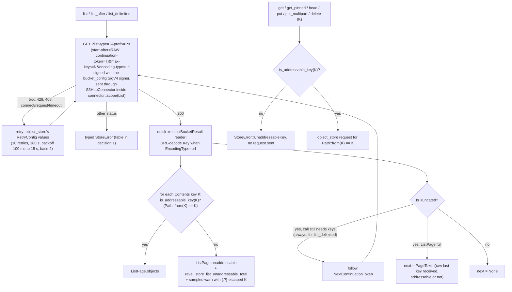

# ADR-2637: S3 listing reads raw keys, and a key the adapter cannot address is counted, never fatal

Status: Accepted (2026-10-08). Issue #2637, epic #2040. Builds on ADR-1727
(read-only SigV4 requests outside `object_store`) and stays inside ADR-0042's
boundary on write paths. No persistent format changes: no object Ravel writes,
no key it builds and no protobuf schema changes. This decision changes how
`S3Store` lists, which keys `ObjectStoreBackend` operations accept, and what a
listing reports alongside its objects.

## Context

`S3Store` (`crates/ravel-object-store/src/s3.rs`) talks to S3 through the
`object_store` 0.14 crate. Every key crosses that boundary as an
`object_store::path::Path`, and two of `Path`'s rules make some keys
unreachable for Ravel:

- `Path::parse` (used by `object_store` on every key a listing returns)
  rejects a key with an ASCII control character, an empty segment (`a//b`),
  or a `.` or `..` segment, and strips a leading or trailing `/`.
- `Path::from` (used by Ravel on every key it sends) drops empty segments,
  turns a `.` or `..` segment into `%2E` or `%2E%2E`, and percent-encodes
  control characters, every non-ASCII byte and
  ``\ { ^ } % ` ] " > [ ~ < # | * ?`` inside a segment.

A key the Ravel key builders produce is unchanged by both. A key someone
else put need not be. Two defects follow.

### Defect 1: one bad key fails a whole listing, and a page boundary moves

**A key `Path::parse` rejects fails the page.** `object_store` converts each
`<Contents>` entry with `location: Path::parse(value.key)?`
(`object_store` 0.14.1 `src/client/s3.rs:81`; common prefixes the same way
at line 43). The error ends the response stream before any key of that
response reaches Ravel. `S3Store::list` (`s3.rs:2731-2757`) and
`S3Store::list_after` (`s3.rs:2759-2795`) return it at `s3.rs:2745` and
`s3.rs:2786` through `map_error_common`, which maps `InvalidPath` to
`StoreError::Permanent` (`s3.rs:1471-1495`). `S3Store::list_delimited`
(`s3.rs:2800-2820`) goes through `list_with_delimiter` and fails the same
way. A key with a leading or trailing `/` parses, but under a name that is
not the stored key.

**The continuation is not the key that ended the page.** Neither `list` nor
`list_after` follows S3's `NextContinuationToken`. Each `ListPage` opens a
new `object_store` stream, takes at most `page_size` entries and drops it
(`s3.rs:1268-1281`). The `PageToken` is the raw last key
(`s3.rs:2749-2753`), and the next page resumes with
`list_with_offset(prefix, &Path::from(token))`, which `object_store` sends
as ListObjectsV2 `start-after` (`s3.rs:2736`, `s3.rs:2774`). When
`Path::from` changes that key, the next page starts somewhere else. Of the
keys that survive `Path::parse` (a control character, an empty segment and a
dot segment have already failed the page):

| Last key on the page holds | `Path::from` sorts it | What the next page does |
|---|---|---|
| ``* ? < > [ \ ] ^ ` { \| } ~``, a non-ASCII byte | lower (`%` is 0x25, below each of them) | re-delivers keys already delivered; `drain_pages` fails with `StoreError::ListOrderViolation` |
| `"` or `#` | higher (0x22 and 0x23 are below 0x25) | silently skips every key between the raw and the encoded form |
| `%`, a leading or trailing `/` | depends on the bytes around it | either of the above |

A caller's own `start_after` takes the same route (`s3.rs:2775`), so
`list_after` can also return keys at or below a `start_after` that ends in
`/` or holds one of these bytes, against the contract's "each returned key
compares strictly greater than `start_after`".

### Defect 2: get, put and delete address a different key

`path_of` (`s3.rs:1420`) is `Path::from(key)`. Its doc says plain ASCII keys
round-trip, which is true only of the printable ASCII outside the encoded
set. For any other key, `get`, `head`, `put` and `delete` send a request for
a different key. A delete of it reports success (S3 deletes are idempotent)
and leaves the key in place. `ravel-pqtable` already works around this twice:
`keys::is_store_path` (`crates/ravel-pqtable/src/keys.rs:278`) marks such a
manifest key undeletable in `repair --stray`, and
`manifest::key_is_addressable` (`crates/ravel-pqtable/src/manifest.rs:61`)
refuses a Parquet file key of that shape in a manifest. Nothing in
`ravel-object-store` refuses one.

### Who can trigger them

Anyone who can put an object under a prefix Ravel lists. Since ADR-2040's
DDL over HTTP, that includes the Query role: its create-only grant on
`t/<tenant_hash>/pq/t/*/v/????????????????????.pqm` binds `*` to any run of
segments and `?` to any one character, so it admits a control character, an
empty segment and every encoded byte (ADR-2040, version bound amendment and
the 2026-10-06 amendment). A stolen Query credential can therefore:

- put `t/<h>/pq/t/hits/v/<19 digits>\x01.pqm`, after which every resolve of
  `hits` (so every query and DDL statement on it) and every tenant-wide
  listing fails with `ResolveError::Store` until an operator deletes the key
  with an S3 tool;
- put enough keys that one holding `*` sits at a 1000-key page boundary,
  after which the tenant-wide listings fail with `ListOrderViolation`;
- put a key that `repair --stray --delete` cannot remove through Ravel.

The ADR-2040 2026-10-06 amendment and the `resolve` module doc
(`crates/ravel-pqtable/src/resolve.rs:1-28`) already describe these
failures, and the amendment names this issue as the adapter defect.

## Decision



**The predicate.** A key is *addressable* when `Path::from(key).as_ref() ==
key`. That is a superset of what `Path::parse` rejects: it also catches the
encoded bytes, a leading or trailing `/`, and non-ASCII. It lives in
`ravel-object-store` as `pub fn is_addressable_key(key: &str) -> bool`, and
`ravel-pqtable`'s `keys::is_store_path` and `manifest::key_is_addressable`
delegate to it (the latter keeps its own UTF-8 and empty-key checks, which
are manifest rules). The empty key is the bucket root, not an object key;
`Path::from("")` round-trips it, and the operations already refuse it where
they did before.

### 1. Ravel's own SigV4 ListObjectsV2 GET for S3

`S3Store::list`, `list_after` and `list_delimited` stop calling
`object_store`'s listing. They send one signed `GET` per wire page:

- query parameters `list-type=2`, `prefix=<raw prefix>`,
  `start-after=<raw key>` when a call resumes from a `PageToken` or the
  caller gave one, `continuation-token=<token>` when a call follows a
  truncated response it received itself (see Paging), `max-keys=<n>`,
  `encoding-type=url`, and `delimiter=/` for `list_delimited`. "Raw" here
  is at the key level: `canonical_query` still URI-escapes each value into
  the query string, and S3 decodes it back to the same key. The `PageToken`
  handed back to a caller between calls stays the raw last key of the last
  response, which is what the contract already calls it ("opaque"), so
  resuming a listing in a later call needs no state S3 holds;
- signed with the SigV4 pieces in `crates/ravel-object-store/src/s3/bucket_config.rs`
  (`canonical_query`, `canonical_request`, `string_to_sign`, `signature`,
  `request_target`) and the credential provider `S3Store` already holds,
  including the session token;
- parsed with that module's quick-xml reader (`parse_document` with root
  `ListBucketResult`, the same way `parse_object_versions` reads
  `ListVersionsResult`). The body cap is its own, `LIST_MAX_BODY_BYTES` of
  8 MiB, not the module's 1 MiB `MAX_BODY_BYTES`: a 1000-key response of
  1024-byte keys, URL-encoded to up to three times that, with its
  per-object metadata, needs about 3.5 MB. When the response echoes `<EncodingType>url</EncodingType>`, `Key`,
  `Prefix`, `StartAfter` and `CommonPrefixes/Prefix` are URL-decoded (`%XX`,
  and `+` as a space). A key that does not decode to UTF-8 is unaddressable
  (decision 2), with its key shown as the still-encoded text;
- sent through the `HttpClient` that `S3HttpConnector` produces from the same
  `ClientOptions` the data plane uses, inside
  `connector::scope(StoreOp::List, ..)`. Attempts, `Date` observation,
  connect and request timeouts and the List metrics block are therefore the
  same as today, and nothing is recorded in the `ravel_store_control_plane_*`
  block that ADR-1727's probes use.

**Paging.** Within one call the adapter follows S3's own
`NextContinuationToken`: an opaque token S3 issued, sent back unchanged, so
no encoding can move it. Across calls it resumes with `start-after` and the
raw last key. In detail:

- A `ListPage` (`list`, `list_after`) requests `max-keys = min(remaining,
  1000)` and keeps requesting until it holds `page_size` raw keys or a
  response says `IsTruncated=false`. Raw keys count toward `page_size`,
  addressable or not, so a page of unaddressable keys still makes progress.
  A truncated response is followed with its `NextContinuationToken`, so a
  truncated response that carries no `Contents`, which an S3-compatible
  backend may legitimately send, is followed rather than refused. `next` is
  the raw last key the call received when the last response was truncated,
  and `None` otherwise. Because `max-keys` never asks for more than the page
  still needs, a call stops at a response boundary, and the next call's
  `start-after` resumes exactly after the last key delivered.
- `list_delimited` returns the whole delimited listing in one call, as
  `object_store`'s `list_with_delimiter` does today. It follows
  `NextContinuationToken` until `IsTruncated=false` and returns every
  `Contents` key and every `CommonPrefixes` entry across those responses.
  Resuming a delimited listing from a key would be wrong, because a
  response interleaves keys and common prefixes and a common prefix can sort
  after the last key, so the delimited path never uses `start-after` for
  its own continuation. `discover_tenants` (`list_delimited("t/")`, whose
  responses carry only common prefixes) therefore lists past 1000 tenants
  as it does today.
- A truncated response with no `NextContinuationToken`, or one whose token
  equals the token just sent, is `StoreError::Permanent` naming the prefix,
  since following it would spin. This is the only shape refused.

**Prefix.** The prefix is sent raw. This removes the known divergence in
the `s3.rs` module doc, where `object_store` appended `/` to a non-empty
prefix and `S3Store` listed by segment while `MemoryStore` and the contract
list by raw prefix. That doc already requires callers to pass a
segment-aligned prefix (empty, or ending in `/`), for which raw and
segment matching return the same keys.

**Retry.** `object_store`'s `Backoff` and `send_retry` are crate-private, so
Ravel owns the loop. It takes its numbers from `object_store::RetryConfig::default()`
(public fields: 10 retries, 180 s total, `BackoffConfig` 100 ms initial,
15 s cap, base 2) so they cannot drift, and reproduces its rules: retry a
5xx, 429 and 408; retry a transport error of kind connect, request, timeout
or interrupted (a list GET is idempotent); do not retry any other 4xx, a
3xx (not followed, as `control_plane_http_client` already does), or a
decode or unknown transport error. The backoff is the same decorrelated
jitter, reimplemented, and pinned by a test that asserts the sequence of
bounds rather than random draws.

**Error mapping.** After retries:

| Response | Today (through `map_error_common` and `classify_generic`) | Raw listing |
|---|---|---|
| timeout | `Timeout` | `Timeout` (same) |
| connect, request, interrupted | `Transient` | `Transient` (same) |
| 429, 503, `SlowDown` or another throttle code | `Throttled { retry_after_ms: 1000 }` by text match | `Throttled { retry_after_ms: 1000 }` by status and error code (same result) |
| 404 `NoSuchBucket` | `Permanent` | `Permanent` (same) |
| other 5xx, 408 | `Transient` | `Transient` (same) |
| 403 | `Transient` (no branch matches) | `AccessDenied` (differs) |
| 3xx (wrong region or endpoint) | `Transient` | `Permanent` naming the status (differs) |
| 200 with a body that is not a `ListBucketResult` | `Transient` (`InvalidListResponse` reaches `classify_generic`) | `Permanent` (differs) |
| other 4xx | `Transient` | `Permanent` with the S3 error code (differs) |

The differences make a terminal answer terminal: today a revoked
credential, a misconfigured region, a malformed request or a body that is
not a listing is retried by every caller that honours
`StoreError::is_retryable`. The "Today" column is from reading
`map_error_common` and `classify_generic` (`s3.rs:1471-1495`,
`s3.rs:1729-1776`), not from a test: no test pins a list 403 today. Task 1
adds the tests that pin the new column. No error carries the response body.

`ExternalStore`'s S3 arm builds an `S3Store` and gets all of this. Its GCS
and Azure arms keep `object_store`'s listing, with the same parse and
continuation defects; they get decision 2's classification of what their
listing returns and decision 3's refusal through the shared `path_of`. Their
raw listing is a follow-up issue, not part of this decision.

### 2. Listing classifies keys, and counts the ones it skips

A listed key that is not addressable is never returned as an `ObjectMeta`,
never fails the page, and is never dropped without a trace. The API callers
use to learn about it:

- `ListPage` gains `pub unaddressable: Vec<UnaddressableKey>`, and
  `DelimitedList` the same field for its `Contents` keys.
- A common prefix is classified too, since `object_store` parses common
  prefixes through `Path::parse` the same way. A common prefix `p` (which
  ends in `/`) is addressable when `is_addressable_key` holds for `p`
  without its trailing `/`; an empty prefix is addressable.
  `DelimitedList` gains `pub unaddressable_prefixes: Vec<String>`, which
  holds the raw common prefixes that fail this and never appear in
  `common_prefixes`. A common prefix has no size or modification time, so it
  gets its own field rather than an `UnaddressableKey`. Each one counts
  toward the same metric and warning as a key. `discover_tenants` therefore
  skips and reports a forged `t/<hash>\x01/` prefix rather than failing the
  whole maintenance run with `InvalidTenantPrefix`.
- `pub struct UnaddressableKey { pub key: String, pub addresses: String,
  pub size: u64, pub last_modified_unix_ms: i64 }`, where `addresses` is
  `Path::from(key)`, the key a request for it would reach.
- `drain_pages` returns `Result<Unaddressable, E>` instead of
  `Result<(), E>`, with `pub struct Unaddressable { pub count: u64, pub
  sample: Vec<UnaddressableKey> }` holding the first
  `UNADDRESSABLE_SAMPLE_MAX` (16) keys in listing order. `Unaddressable` is
  not `#[must_use]`, so a caller that ends its statement in `.await?;`
  compiles unchanged.
- `list_all` keeps its signature. `list_all_reporting(store, prefix) ->
  Result<Listing, StoreError>` with `pub struct Listing { pub objects:
  Vec<ObjectMeta>, pub unaddressable: Unaddressable }` serves a caller that
  needs the count.

Every listing that skips a key also:

- adds the number of keys it skipped to `ravel_store_list_unaddressable_total`
  (`StoreMetrics::record_list_unaddressable(n)`, read back by
  `StoreMetrics::list_unaddressable()`), a store-wide counter beside
  `ravel_store_get_unverified_total` and exported by `ravel-server` the same
  way. It counts keys, not listings, so a key seen on every resolve is counted
  on every resolve, which is the rate an operator alerts on;
- logs at `warn` once per distinct key per process, naming the key escaped
  with `{:?}` (whoever put it chose it), the prefix, the key it addresses,
  and the fix: delete it with the Maintain credential through an S3 tool.
  The set of keys already warned about is capped at 4096; past the cap, one
  listing in 1024 that skips a key warns. These are the
  `ABOVE_BOUND_TABLES_MAX` and `ABOVE_BOUND_WARN_EVERY` values `resolve`
  already uses for the same reason.

`drain_pages`' order and dedup rules see only `objects`. The raw sequence of
each S3 response is still non-decreasing, and since the next page resumes
strictly after the raw last key, resuming can no longer re-deliver or skip
keys around an unaddressable one.

### 3. Operations refuse a key they cannot address

`get`, `get_pinned`, `head`, `put`, `put_multipart` and `delete` check
`is_addressable_key(key)` before building any request and return the new
variant

```rust
/// The key cannot be sent through the adapter unchanged: a request for it
/// would reach `addresses` instead.
UnaddressableKey { key: String, addresses: String },
```

which `StoreError::is_retryable` treats as not retryable and
`instrument::StoreErrorClass` maps to `Permanent`, with the other named
variants. Its `Display` escapes `key` with `{:?}`. The check is in
`path_of`, which becomes `fn path_of(key: &str) -> Result<Path,
StoreError>`, so the S3 and `ExternalStore` paths cannot reach
`object_store` without it.

`ravel-cli parquet repair --stray` takes unaddressable keys from
`ListPage.unaddressable` (it lists through `list_all_reporting` and
`drain_pages`), names each one escaped with the key it addresses, and never
deletes one, with or without `--delete`. This replaces today's
`undeletable` marking (`crates/ravel-pqtable/src/repair.rs:223`), which
needs the key to have been listed at all. The operator deletes the key by hand with the
Maintain credential through an S3 tool, as ADR-2040 already says.

### 4. No new write path

ADR-0042 rejected:

> Claim full S3 Object Lock WORM support by hand-rolling raw S3 API calls
> that bypass `object_store` for the retain-until-date header. Rejected: a
> second, parallel write path outside the `ObjectStoreBackend` trait's
> contract-tested abstraction would violate "no durability may depend on"
> an unaudited side channel, and duplicates the entire PUT retry/error-mapping
> story `object_store` already provides.

ADR-1727 drew the line this decision stays behind: read-only `GET`s,
credentials from the provider `S3Store` already holds, no write and "no way
to add one without a further ADR" (`bucket_config.rs` module doc). The
listing request is a `GET`. Puts, multipart uploads and deletes stay on
`object_store`, and an unaddressable key is refused rather than written or
deleted by any other means. The retry story this decision does duplicate is
a `GET`'s, and the table in decision 1 states where it differs.

### How the other stores behave

- **`MemoryStore`** applies the same rules, so the oracle cannot pass a test
  that S3 fails: its `list`, `list_after` and `list_delimited` move a key
  that is not addressable into `unaddressable`, and its operations return
  `UnaddressableKey`. Its pagination is unchanged, and raw keys count toward
  its page size as on S3. A test that needs such a key in the store seeds it
  with a `test-support` hook, `MemoryStore::insert_foreign(key, bytes)`,
  which models a writer outside Ravel and bypasses the check; no production
  build has it.
- **`FaultStore`, `InstrumentedStore`, `KmsRoutingStore` and
  `ClassedStore`** delegate and add nothing. `InstrumentedStore` classes the
  new error like the other refusals.
- **`ExternalStore`**: as in decision 1. Puts and deletes there already
  return `ReadOnly`.

## Rejected alternatives

**(a) Skip and count in the adapter while still listing through
`object_store`.** Impossible: `Path::parse` fails inside `object_store`'s
response conversion, and the error replaces the whole response's stream
before any key, good or bad, reaches Ravel. There is nothing left to skip.
It would also leave the page-boundary defect, which needs the raw key as
`start-after`.

**(b) A raw S3 `DELETE` so Ravel can remove an unaddressable key.** That is a
second write path outside the contract-tested abstraction, which ADR-0042
rejected and ADR-1727 kept out. The operator already has the Maintain
credential and an S3 tool for a key no Ravel builder produces.

**(c) Patch or fork `object_store`.** A patch to make `Path` round-trip
arbitrary keys changes a public type's meaning for every user of the crate
and is unlikely upstream; until it landed (and in every later version bump)
Ravel would carry a fork of the HTTP client that every S3 request uses.
Owning one read-only request is a smaller surface than owning the crate.

**(d) Narrow the IAM grant so such keys cannot be written.** IAM resource
patterns have only `*` and `?`; they cannot say "no control character" or
"no `%`". Even a grant that could would do nothing about keys already in a
bucket, keys a bring-your-own bucket's other writers put, or a backend with
no IAM at all. Narrowing the Query grant is still worth doing (issue #2430,
item 1); it is not this fix.

**(e) Leave it.** Write access to a manifest prefix is exactly what a stolen
Query credential has, so one put denies service to a table or a tenant's
whole Parquet surface until an operator notices and deletes the key by
hand, and the error points at the store rather than at the key.

## Consequences

**Owning list retries.** Ravel now has two retry implementations for S3
requests: `object_store`'s for every request but listing, and its own for
listing. Their numbers come from the same `RetryConfig` value, but the
algorithm can drift on an `object_store` upgrade. The tests in task 1 pin
the retried and not-retried statuses, so an upgrade that changes
`object_store`'s rules shows up as a difference in the contract doc, not in
production. `docs/object-store-contract.md` stops saying that nothing
retries beyond `object_store`'s client.

**Request counts.** None expected to change at the default page size: one
request per 1000 keys, as today. Two differences, both reductions: a listing
whose key count is an exact multiple of the page size no longer ends with an
empty request, because `IsTruncated=false` ends it; and a small configured
page size (`--list-page-size`, tests at 2) now sends `max-keys`, so S3
returns that many keys instead of up to 1000 that Ravel then dropped. A test
that pins the trailing empty request changes with it.

**API churn.** The new `ListPage` field touches 23 struct literals across
`ravel-object-store`, `ravel-catalog`, `ravel-maintain`, `ravel-parquet` and
`ravel-server`. `drain_pages`' new return value compiles at every existing
`.await?;` call site. `StoreError` is exhaustive, so each `match` on it that
names every variant gains one arm.

**Conformance** (`crates/ravel-object-store/src/conformance.rs`). Two new
properties:

- `OperationsRefuseUnaddressableKeys`, on every subject: `get`, `head`,
  `put` and `delete` of such a key return `UnaddressableKey` and issue zero
  requests (asserted on the attempt counter).
- `UnaddressableKeysAreCounted`: with unaddressable keys seeded among
  addressable ones, one in the middle of a page and one on each side of a
  page boundary, the listing returns every addressable key once, reports
  exactly the seeded keys in `unaddressable`, and the metric moves by their
  number. Seeding needs a writer outside the trait, since every subject now
  refuses such a put, so `run_conformance_suite` takes an optional
  foreign-key seeder: `MemoryStore::insert_foreign`, the scripted server's
  script, or for a RustFS or S3 run a signed PUT in test code (a fixture,
  not a production write path). A subject without a seeder reports this
  property as not run, never as passed.

The doc on `page_probe_key_count` that says `S3Store::with_page_size` does
not change the wire-level page size is no longer true and changes with it.

**Testing against a scripted HTTP server.** `MemoryStore` never runs
`Path::parse`, so it cannot catch defect 1 however it is configured. The
cases live in `crates/ravel-object-store/tests/s3_http_faults.rs`, whose
axum server already answers ListObjectsV2 (`Op::List`), extended to script a
`ListBucketResult` body per request and to record each request's query:

- a key with `\x01` in the middle of a page: the page returns the keys around
  it, `unaddressable` holds it, and the listing does not fail;
- a page whose last key encodes lower (`*`): the next request's
  `start-after` is the raw key, and the drain returns every key once, with
  no `ListOrderViolation`;
- a page whose last key encodes higher (`#`): the next request's
  `start-after` is the raw key, and no key between the raw and encoded forms
  is skipped;
- `get`, `put` and `delete` of an unaddressable key return
  `UnaddressableKey` and the server sees no request;
- a truncated response with no `Contents`, followed by one that has keys:
  the second request carries the first response's `continuation-token`,
  and the listing returns the keys rather than failing;
- `list_delimited` over three truncated responses of common prefixes only
  (the `discover_tenants` shape): the second and third requests carry
  `continuation-token`, none carries `start-after`, and every prefix comes
  back once;
- a common prefix with `\x01`: it lands in `unaddressable_prefixes`, not in
  `common_prefixes`, and counts toward the metric;
- a truncated response whose `NextContinuationToken` repeats the token just
  sent: `StoreError::Permanent` naming the prefix;
- a URL-encoded response (`encoding-type=url`) with `+` and `%0A` decodes,
  and one without `EncodingType` is read literally;
- 403, 301, 400, 429-then-200 and 503-until-exhausted map per the table in
  decision 1, with the attempt count the retry rules imply.

**Docs that change**, with the code, in the same commits:

- `docs/object-store-contract.md`: listing (raw prefix, raw `start-after`,
  `unaddressable`, the metric), the `UnaddressableKey` error, the retry
  sentence at "Retry and failure", and `S3Store`'s line under
  "Implementations".
- `docs/adrs/2040-parquet-tables-queried-in-place.md`: a new amendment to
  the version bound amendment and the 2026-10-06 amendment, replacing "on S3
  ... fails the whole listing" and the page-boundary paragraph with the
  counted skip, and stating that `repair --stray` names and never deletes
  an unaddressable key.
- `crates/ravel-pqtable/src/resolve.rs` module doc: S3 lists such a key
  like any other store, skipped and counted.
- `crates/ravel-object-store/src/s3.rs`: the module doc's divergence on
  segment-based prefixes, `path_of`'s doc, and `with_page_size`'s doc.

**Residual risk.** A backend that ignores `encoding-type=url` and puts a
control character into XML 1.0 unescaped makes the whole response
unparseable, which is a `Permanent` error for that page, not a skip. AWS S3
honours the parameter. Whether RustFS does is not verified; a
`UnaddressableKeysAreCounted` run against RustFS answers it, and if it does
not, the gap is recorded in the contract doc beside the other RustFS notes.

## Implementation tasks

**Task 1: raw listing and the addressable-key rules in `ravel-object-store`**
(crates: `ravel-object-store`, `ravel-server` for the metric export).
`is_addressable_key`, `UnaddressableKey`, `Unaddressable`, `Listing`,
`list_all_reporting`, the `drain_pages` return value, `StoreError::UnaddressableKey`,
the metric, the fallible `path_of`, the raw ListObjectsV2 client with its
retry loop, `MemoryStore`'s rules and `insert_foreign`, the two conformance
properties, and the contract and `s3.rs` doc changes. Acceptance:

- every `s3_http_faults.rs` case listed under Consequences passes;
- both conformance properties pass on `MemoryStore` and on the scripted S3
  subject;
- a proptest over arbitrary strings asserts `is_addressable_key(k) ==
  (Path::from(k).as_ref() == k)` and that `MemoryStore` refuses exactly
  those keys;
- the retry-bound test pins the backoff sequence against
  `RetryConfig::default()`;
- `ravel-server`'s metrics endpoint test lists
  `ravel_store_list_unaddressable_total`.

**Task 2: callers report and refuse** (crates: `ravel-pqtable`, `ravel-cli`).
`keys::is_store_path` and `manifest::key_is_addressable` delegate to
`is_addressable_key`; `repair::list_stray` reads `unaddressable` and
`repair --stray` names every such key and never deletes one; `resolve` and
`sweep` keep counting what they skip, now also when the store skipped it;
`parquet ls` reports the tenant's count. Tests seed keys with
`insert_foreign`. Acceptance:

- a tenant holding `.../v/<19 digits>\x01.pqm`, `.../v/<19 digits>*.pqm`
  and `hits//v/<20 digits>.pqm` resolves its valid tables, and `parquet ls`
  reports three unaddressable keys;
- `repair --stray --delete` names all three and the store still holds all
  three afterwards;
- the existing repair tests that seeded such keys through `put` now seed
  them through `insert_foreign` and assert the same output.

**Task 3: ADR-2040 and module docs** (docs only, after tasks 1 and 2 land).
The ADR-2040 amendment and the `resolve.rs` module doc listed under
Consequences. Acceptance: `scripts/guards/check-amendment-integrity.sh`
passes with the new amendment's markers, and no sentence in ADR-2040 or
`resolve.rs` still says S3 fails a listing on such a key.
