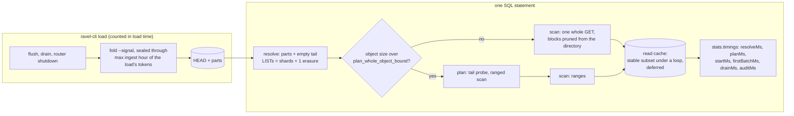

# ADR-2677: the ClickBench ranking gap: seal at load end, plan once, serve a stable subset, prove the pruning

Status: Accepted (2026-10-09); decision 3 deferred (see the decision 3 deferral
amendment). Issue #2677 (epic). Stage 0 is the measured record on
#2639, #2615, #2592 and #2121; no new profile run preceded this ADR.
No persistent format changes: every RLOG object, catalog part, HEAD and
commit record keeps its bytes and its layout. The three levers that would
need a format change (exact per-block value summaries, a trigram filter,
time-clustered compaction output) are gated here on an offline selectivity
measurement and get their own ADR only if they clear it.

## Context

Ravel's upstream ClickBench entry (RustFS on gp2, c6a.4xlarge) ranks on the
hot geometric mean of per-statement ratios. On the published results (`results/20261004`, the v0.21.0 pin) it stands 2.03x
VictoriaLogs over 42 statements and 8.11x ClickHouse over 43. The epic body
on #2677 carries the Stage 0 table. The levers it names, each with the
figure it moves, are:

| lever | measured today | what sets it |
|---|---|---|
| per-statement floor | about 160 ms on RustFS, of which LIST 88 ms per 640-key shard-hour page; skipping the audit PUT moves q1 160 to 161 ms (#2639) | the resolve lists every shard-hour the load wrote, because no snapshot covers them: `catalog fold` seals an hour only `max_flush_lifetime + clock_skew_allowance + fold_safety_margin` after it ends (`crates/ravel-catalog/src/fold.rs:377-391`), and the override `--max-flush-lifetime 0s` still leaves 20 minutes and never seals the hour the load finished in (`docs/internal/clickbench.md`, "Fold the catalog before measuring anything") |
| q20 point lookup | 4,490 GETs and 17.3 GB on the wire against 2,617 objects and 9.84 GB: every object read twice (#2615) | a declared integer equality takes the planned route; for an object at or under `plan_whole_object_bound()` the plan phase reads it whole (`crates/ravel-query/src/log_fetcher.rs:1952-1955`, fallback at `:2043`), the barrier carries only the first `target_partitions` of them (`crates/ravel-sql/src/logs_scan.rs:3083-3114`), and the scan reads every other object whole again. `plan_carry_peak_bytes_bounded_by_plan_concurrency` pins the re-fetch today; #1272 tracks streaming the carry |
| hot runs on 16 GB and 8 GB | the read cache served 0.01 GB per hot run while 7.3 GB was re-read from disk (#2615); on 32 GB the hot column collapsed (q30 0.69 to 32.4 s) when the derived cache fell to 9.05 GB under 9.84 GB of corpus (#2639 W2) | S3-FIFO sizes its ghost list from the 64 MiB entry cap (`crates/ravel-cache/src/s3fifo.rs:75-105`): 26 to 74 keys against a 2,617-object loop, so no entry is ever touched twice while remembered, nothing reaches the main queue, and a loop even 9% larger than the cache serves nothing. ADR-0046 decision 6 chose that sizing so the compactor's and the folder's cold scans cannot evict a hot working set; a repeated identical scan is the case it never considered |
| attribution | the per-statement probe cannot place a 190 ms gap before the first batch (#2639 W8); the ADR-2509 after-stamp derives listing wall time by subtraction (#2595 item 10) | the SQL `stats` object carries requests and bytes per phase and no wall time; `ScanTiming` is folded onto `SqlStats` (`crates/ravel-sql/src/executor.rs:436-473`, set at `:1552`) and never rendered |
| declared-column pruning | wired (#2151, ADR-2121 D1) and unit-tested through `SqlExecutor::execute`; no HTTP test declares a column and asserts fewer reads | `UserID = N`, `CounterID = 62` and the `EventDate` epoch-day bounds reach the stamp skip and the block `NumRange` skip; none reaches postings (string and bytes equalities only, `crates/ravel-sql/src/logs_pushdown.rs:392-397`); `<>` is not extracted at all |
| ordered `LIMIT` (q24 to q27) | q25 and q27 about 1.1 s against 15 to 16 ms on ClickHouse; the TopK operator itself under 0.1 s; a block-level `ts` short-circuit gave no wall gain (#2639) | `hits.parquet` is CounterID-sorted, so every object spans most of the week in `ts`; an ordered traversal with a stopping rule can stop early only if the block `ts` envelopes are disjoint enough, which nobody has measured |
| fetch concurrency as a default | #2639 W1 (`latency-first`, 256 permits, per-query pool held at stock) on v0.23.0 release binaries with 25 MB objects: 43 of 43 on every machine with 32 GB or more, c6a.4xlarge cold 386.0 s and hot 57.2 s (published v0.21.0: 1,291.0 / 87.2); on c6a.2xlarge (16 GB) 40 of 43, q18, q32 and q33 refused with `process memory budget exhausted` at about 6.6 GB, plus two `upstream storage temporarily unavailable` errors from RustFS; on c6a.xlarge (8 GB) 33 of 43 against 37 at stock, 19 such refusals, 1.3 GB of swap used, and a concurrent phase of QPS 0.160 with an error ratio of 0.923; on c6a.large (4 GB) 18 of 43. The same release at stock on c6a.4xlarge: 43 of 43, cold 486.6 s, hot 56.9 s, QPS 0.653, error ratio 0.084, with 32 derived permits; W1 rerun on that box: cold 384.6 s (-21%), hot 57.1 s, QPS 0.727, error ratio 0.103, so on large objects W1 is a cold lever only (#1191 comment 6071729407, #2677 comment 6071772569, #2592 comment 6072731122) | the 256 permits' in-flight fetch reservations, each up to one whole object, draw on the process budget the queries draw on, so holding the per-query pool does not protect a 16 GB host; `store_get_concurrency` derives from cores, not from memory (ADR-1195, `resolve_performance_defaults`), and the loopback policy default is `cost-based` (ADR-2023 decision 1) |

Already delivered and not reopened here: the loader's memory and object
geometry (ADR-2614, #2592: 24.5 MB median objects, cold 499 s and hot 60.6 s
on r6a.4xlarge), the read path's ranged reads and coalescing (#2414,
ADR-2066), the parallel prefix listing and idle audit flush (ADR-2509), the
cache sizing the v0.23 tuned entry carries (#2639 W2), q28's
`octet_length` correction (W4), and the fetchers' byte reservations against
the process budget (#2086: every whole-object, covering and extent read
reserves before its GET; the comment in `crates/ravel-query/src/config.rs`
that calls fetch memory unbounded is stale).

The upstream rule that binds the first lever: "You should not wait for
cool down after data loading or running OPTIMIZE / VACUUM before the main
benchmark queries unless the database strictly requires this"
(ClickBench README, "Caching"). A separate post-load fold is exactly that
step. A loader that publishes the catalog snapshot for what it wrote, as the
last action of the load and inside the reported load time, is the load, and
that is how the upstream entries finalise their own indexes: `postgresql/load`
and `pg_duckdb/load` end with `VACUUM ANALYZE hits`, `timescaledb/load` with
`compress_chunk` and `vacuum freeze analyze`, `tidb/load` with
`ANALYZE TABLE`, `elasticsearch/load` with `_flush`; only `cratedb/load`
runs `OPTIMIZE TABLE`, and only in its tuned mode. The fold rewrites no data
object, so it is not the compaction (OPTIMIZE-class) arm that stays internal.

## Decision

The read cache keeps today's policy: decision 3 is deferred (see the
decision 3 deferral amendment below).

### 1. The loader seals what it wrote

`Catalog::fold` takes a seal-through hour, `seal_through_hour: Option<u32>`:
the effective watermark becomes `max(sealed_watermark_hour(now),
seal_through_hour)` where the watermark is decided today (`fold.rs:1179`),
so the parameter can only raise the sealed hour, never cap it. `now_ns`
stays real: it also stamps
`created_unix_ns` on the HEAD, cuts the retention frontier, feeds the fold-lag
gauge and `head_is_fresh`, so a fake clock is not a substitute.

`ravel-cli load --fold-after-load` folds the loaded signal once, after the
drain and `router.shutdown()`, with the seal-through hour set to the highest
`ingest_hour_bucket` among the load's commit tokens. The fold's wall time is
inside the load's reported `elapsed`, and its `FoldReport` is printed with
the load summary. `ravel-cli catalog fold --writers-stopped` is the same
seal-through hour at the current hour for an operator whose writer has exited; it
replaces the `--max-flush-lifetime 0s` guidance in the internal ClickBench
guide and the AWS runbook.

Both flags are opt-in and carry the "UNSAFE under a live writer" wording the
override already has (`services/ravel-cli/src/main.rs:1917-1930`), because
the seal lemma (`docs/catalog-and-mvcc.md`, "Sealed hours") rests on
no later commit landing in a sealed hour: a record that does lands in a
bucket reconcile skips without a GET and stays invisible to non-token
queries until a HEAD rebuild, detected only by the maintain-mode scrub or
`catalog verify`. The loader can assert this about its own hours, but not
about a writer that starts later: the documented bulk-load workflow (load,
then start the server, then live ingest in the same hour) is exactly that
case. So the fold keeps an operator-sealed hour open to late commits until
its natural seal: for an hour above `sealed_watermark_hour(now)` the
reconcile pass does not skip buckets holding only level-0 records, and the
fold does not take its no-op return (narrowed by the held-open amendment
below: it still reports a no-op when it finds nothing new). A commit into an
operator-sealed hour is then visible at the next fold tick, not refused and
not lost; the
"Catalog snapshot staleness" bound in `docs/consistency-model.md` gains
that clause. This is task T8 (#2691), and the release that ships
`--fold-after-load` waits for it. A seal-through hour below the natural watermark changes
nothing, and the scheduled fold no-ops on the sealed hours until the
natural seal time passes, as it does today (no longer exactly: see the
held-open amendment below) (`fold.rs:1182-1186`).

The loader must not write into an hour that is already sealed: those rows
would be acknowledged, durable, and absent from every non-token query until
a HEAD rebuild, which `docs/consistency-model.md` does not allow a tool to
report as success. So `--fold-after-load` reads the signal's HEAD before it
reads a row and refuses when the watermark is at or above the current hour
(a natural-margin watermark is never that high, so only an earlier
operator-asserted seal trips it). After the load, a fold that seals nothing
while the load holds commit tokens is an error (the fold coverage amendment
below replaces this rule and judges the snapshot instead), not a success: the
load exits non-zero, says the objects are durable and which hours are not in
the snapshot, and names `catalog verify` and the HEAD rebuild. A load that
wrote nothing runs no fold and says so.

Erasure, compaction and retention are unaffected: they seal on their own
clock-based margin, the pending-erasure LIST still runs on every resolve, and
the retention overlay is read inside the fold as before. The negative-HEAD
cache (`head_cache_ttl`, 30 s) is a cost, not a visibility concern, and the
entry starts its server after the load anyway. The entry declares its typed
columns before the first row lands, so the parts this fold writes carry
their `.cstat`.

What it moves: after an end-of-load fold the resolve window's suffix above
the watermark is empty until the clock crosses the next hour, then one
bounded `list_after` per shard on an empty prefix. A hot q1 goes from one
640-key LIST per shard-hour to the erasure LIST alone, then to
`shards + 1` LISTs of nothing.

### 2. A segment is read once: no plan phase for an object the scan reads whole anyway

The plan phase exists to decide which blocks of an object to range-read.
It gates on `plan_whole_object_bound()` (`log_fetcher.rs:1393-1396`: the
larger of `block_range_threshold` and the effective projection break-even,
which differ only under `cost-based`). An object at or under that bound is
read whole by the scan whatever the plan says, so planning it is a
whole-object read whose bytes are then dropped at the barrier. Rule: a
segment at or under `plan_whole_object_bound()` is not planned. The scan
opens it once and prunes blocks from the directory it has in hand
(`RlogReader::scan_pruned`, which the planned route already uses).
Segments above the bound keep the planned route: a tail probe, block
survivors, ranged scan. This document uses "at or under the bound" for
that set throughout.

The implementing task decides the shape inside `crates/ravel-query`
(`log_fetcher.rs`) and `crates/ravel-sql` (`logs_scan.rs`): whether the
segments at or under the bound bypass the barrier as all-survivors with
in-scan pruning, or the barrier carries their directories and the scan
reads bytes once. Both must leave the whole-segment fast path and the planned route's
survivor and row-reference mapping intact. `plan_carry_peak_bytes_bounded_by_plan_concurrency`
changes to assert the opposite of what it pins today for objects at or
under the bound: no second GET of the same key. #1272 (stream the carry per
partition) stays open for the above-break-even route.

What it moves: a q20-shaped statement over the stock corpus (3.8 MB
objects, all at or under the bound) goes from about 1.76x the corpus on
the wire (17.3 GB over 9.84 GB) to about 1.0x, and from about 1.72 GETs
per object (4,490 over 2,617) to one.

The bound depends on the fetch policy, and so does this decision's reach.
Under `cost-based`, today's default everywhere and the remote default
after decision 7, the bound is the 18.9 MB projection break-even: the
stock corpus is under it, the large-object arm's 25 MB objects are above
it and keep the planned route. Under `latency-first` and `byte-minimal` no
break-even is derived (`crates/ravel-query/src/config.rs:596-634`) and the
bound is the 512 KiB routing threshold, so every object in either corpus is
planned with a tail probe and ranged reads, the plan phase never reads it
whole, and this decision changes nothing. Its acceptance arm therefore
runs the stock corpus under `cost-based`, stated explicitly once decision
7 changes the loopback default.

### 3. The memory read cache serves a stable subset under a repeated scan

Deferred: see the decision 3 deferral amendment below.

The in-memory fetch cache (`--cache-max-bytes`, S3-FIFO) must, for a
repeated identical scan of N entries over a cache that holds C < N of them,
serve a stable fraction on every pass after the first. The property is
pinned by a test in `crates/ravel-cache`: a loop of N keys over a cache of C
entries serves at least 0.8 × C/N of the touches on passes 2 and 3, and the
set it serves does not change between those passes. The mechanism is the
implementing task's, with one constraint: the disk tier's protection of a
hot working set from the compactor's and the folder's cold scans (ADR-0046
decision 6) must still hold, and its test must still pass. The task amends
ADR-0046 decision 6 with the loop case and its sizing, and corrects
`docs/guides/caching.md`, which still calls these caps "LRU".

What it moves: on the reference box the hot column survives the derived
cache falling under the corpus, which it did by 0.8 GB under 2 GB of host
noise (#2639 W2); on 16 GB, where the cache holds about half the corpus,
hot scans stop re-reading all of it from disk. Where the page cache already
serves a hot run (large objects on 16 GB, #2615) this changes nothing, and
the measurement says so.

### 4. Per-phase wall time in the SQL `stats`

`stats.timings` is a new object in the JSON SQL response, beside `phases`
and `io`, which keep their exact key sets (the parity tests in
`crates/ravel-sql/src/stats_json.rs` pin them). Its fields are wall times
of the successful attempt, taken from monotonic stamps in the executor:
`resolveMs` (around `self.resolve`), `planMs` (around `plan_pinned_with`),
`startMs` (physical plan and `execute_stream`), `firstBatchMs` (from start
to the first `Ok` batch), `drainMs` (from the first batch to stream end),
and `auditMs` (around the `.audit(...)` await in
`services/ravel-server/src/service/mod.rs:601`, returned beside the
outcome). It also renders the scalar `ScanTiming` figures that are
meaningful across partitions (`planInitMs`, `planningWaitMaxMs`,
`openMaxMs`, `decodeBuildMaxMs`, `firstBatchMinMs`, `streamMaxMs`), never
the overlapping per-partition sums and never the per-segment rows. Three of
those, `planInitMs`, `firstBatchMinMs` and `streamMaxMs`, have one origin
only while the plan holds a single logs scan: under a multi-scan plan (a
`UNION ALL`, say) the offsets mix exec origins and the plan barrier is
summed per scan (`executor.rs:495-514`). The response carries `scans`, the
number of logs scans in the plan, and omits those three fields when it is
not 1. A retried
statement reports its successful attempt plus `attempts`, so the fields are
not expected to sum to the client's latency, and the documentation says so.
Arrow-IPC and Flight responses carry no `stats` today and that does not
change; MCP's budget block does not pick these up.

Beside it, `stats.pruning` renders the counts `SqlStats` already carries
and nothing exposes per statement: `segments` (the same count as
`stats.estimate.segments`, repeated here so the prune ratios read from one
object), `segmentsPrunedByStats`, `blocksTotal`, `blocksScanned`,
`blocksPrunedByPostings`. Object-level and
block-level pruning are then reported independently, which the acceptance
bands in decision 8 and the test in decision 5 read directly.

What it moves: the 190 ms pre-first-batch gap becomes three named numbers;
the ADR-2509 after-stamp reads `resolveMs` instead of subtracting.

### 5. Declared-column pruning is proven through the HTTP endpoint

A test in `services/ravel-server/tests` declares `I64` columns, loads
stamped segments through the real ingest path behind a GET-counting store
wrapper, and asserts through `POST /api/v1/sql`, for a `CounterID = 62 AND
EventDate BETWEEN a AND b` statement and a `UserID = N` statement: the exact
rows, zero GETs for the segments whose stamp excludes the predicate, and
`stats.pruning.segmentsPrunedByStats` (decision 4; this task runs after
it). A second case shows the block-level `NumRange` skip reducing
`stats.pruning.blocksScanned` on an object whose stamp does not exclude the
value. The test follows `a_segment_whose_stats_exclude_the_predicate_is_never_fetched`
(`crates/ravel-sql/src/logs_provider.rs:3006`) and the recording wrapper in
`statement_floor_e2e.rs`, moved up to the HTTP surface. It adds no pruning:
the predicates that reach nothing today (`<>`, string-literal dates,
postings for integer columns) are recorded as a finding on #2677, not fixed
here.

### 6. Three levers are measured offline before any format work

Each is a measurement on the reference corpus, run by the orchestrator, with
its band written on #2677 before it runs. A lever that misses its band is
closed with the number; one that clears it gets a follow-up ADR under the
format-change procedure, outside this epic.

| lever | measurement | clears when |
|---|---|---|
| ordered stop (q24 to q27) | per 100,000-row window of `hits.parquet` in file order (the loader's batch and object boundaries), the `EventTime` min and max; from them, the fraction of windows an ascending-lower-bound traversal must visit before the kth `ts` of q25's filter cannot be beaten | at most 10% of windows visited |
| trigram substring (q21 to q24) | the fraction of 100,000-row windows whose `URL` contains `google` and whose `Title` contains `Google` | a block filter can exclude at least 90% of row-data bytes for q23's positive `Title` condition |
| exact low-cardinality summaries (q2, q8) | the fraction of windows where `AdvEngineID` has a single value, and the per-window distinct count | a complete per-block value count stays under 1% of corpus bytes and answers q2 and q8 without a row read |

### 7. GET permits and the loopback fetch policy resolve from host memory

W1 (`latency-first`, 256 permits, the per-query pool held at stock) is the
largest cold lever measured on large objects and is unsafe below 32 GB,
because the permits' in-flight reservations and the queries draw on one
process budget. It therefore lands as a server default and not as an entry
flag: the upstream default entry stays stock and gains it through a
release.

Rule: `resolve_performance_defaults` derives `store_get_concurrency`
(ADR-1195) so that the permits' worst-case in-flight bytes, the permit
count times the largest whole-object read the fetcher reserves, stay a
fixed share of `memory_budget_bytes`, beside the loopback cache carve of
ADR-2023 decision 3. The implementing task pins the share and the
per-permit bound and states them, with the derivation yielding 256 on the
32 GB reference host and correspondingly fewer at 16 GB and below. An
explicit `--store-get-concurrency` still wins. The SQL partition count does
NOT follow the permits: ADR-1195 unbundled the three knobs and kept the
partition default at its core derivation, recording that 256 partitions
cost about 19 GB of process peak. W1 was measured with `--fetch-concurrency
256`, which set all three together, so permits alone may not reproduce it.
Decision 8's cold band is therefore measured first with the permits
derived and the partitions at the core default; if that arm misses the
band, a second round on the same ticket sets the partition count from a
measurement, not from that figure: ADR-1195 records that its 19 GB is a
whole-process peak that includes the read cache and cached corpus, so it
does not isolate a per-partition cost. The second round's precondition is
an arm that does (the same statements at two partition counts with the
cache held fixed), pre-registered. On a loopback endpoint the
default `--logs-fetch-policy` becomes `latency-first`, which amends
ADR-2023 decision 1 for the loopback case only; `cost-based` stays the
default against a remote store, where ADR-1196 measured it. That puts a
loopback store back on the ranged route ADR-2023 decision 1 took it off:
with no break-even derived, every object over 512 KiB is planned and
range-read. ADR-2023 left that route because small ranged reads pinned
gp2 at its IOPS ceiling under ten connections; on 25 MB objects the same
route measured a higher concurrent QPS than stock (0.727 against 0.653)
with a higher error ratio (0.103 against 0.084), which is why this default
waits for the bar below. #1191 keeps
#1170 (the in-flight fetch buffers' own design gate); this decision bounds
the permits by memory, it does not change what each permit reserves.

What it moves: the stock entry gets W1's cold gain on every host where it
is safe and nothing on a host where it is not. The acceptance arm reports
the concurrent phase (QPS and error ratio) against ADR-2023 decision 4's
absolute bar, an error ratio of at most 0.058, because that phase is what
sent the loopback default back to `cost-based` once.

Stock v0.23.0 already misses that bar on the reference box: error ratio
0.084 on RustFS against exactly 0.058 on real S3 (#2592), one pass each.
The two runs differ in store, request latency and derived budgets (fetch
cache 11.44 against 7.46 GB, per-query pool 14.16 against 16.45 GB), so
which of those sets the error ratio is not established; the refusal
classes were not captured. W1 on the same box measured 0.103. The bar is not
relaxed to fit the baseline. Bringing stock under it is this epic's work
and precedes this decision's default change: #2044 owns it, starting from
the refusal classes of the stock concurrent phase (at v0.19.0 they were
all memory-budget refusals: the per-tenant limit, the per-query limit, and
a full pool with spill off), one lever at a time. The permits derivation
and the loopback policy default land only on a baseline that meets the
bar, and must meet it themselves.

### 8. Measurement protocol and targets

Every arm runs on a fresh bot-style c6a.4xlarge (the pass launcher and the
entry's own `benchmark.sh`), one build per arm with its SHA stamped, the
dataset identity and the server's `performance default resolved` lines
recorded, cold as restart plus verified page-cache eviction, hot as the
better of runs 2 and 3, and the per-statement probe (`stats.phases`,
`stats.timings`, disk read bytes) over the statements the arm targets. The
bands below are pre-registered on #2677 before each arm launches; a figure
outside its band is a miss and stays open with its bottleneck named.

Every arm loads with the v0.23.0 entry's own recipe (ClickHouse/ClickBench
#2471: the MemTotal-tiered load, `--target-bytes 1850000000`, about 25 MB
objects, 410 of them on the reference box), which is the geometry every
c6a figure below was measured on. "Stock" in this section means that
load with no server flags. The one exception is the q20 row, which runs
the loader's default `--target-bytes` (the 2,617-object, 3.8 MB corpus)
because decision 2 acts only on objects under the bound; its row says so.

| check | target | miss |
|---|---|---|
| c6a.4xlarge cold total, 43 statements, this epic's build at derived defaults | at most 425 s (W1 tuned basis on this box 386.0 s; stock 486.6 s) | over 486.6 s |
| c6a.4xlarge hot total, 43 statements | at most 55 s (stock 56.9 s less about 90 ms of floor on each of 43 statements) | over 58 s |
| q1 and q7 hot p50 after an end-of-load fold | at most 80 ms (160 ms floor less the 88 ms LIST; the residual is what `stats.timings` attributes) | over 100 ms |
| resolve LISTs per statement, folded against unfolded large-object arm | at least 80% fewer | fewer than 60% fewer |
| `unfoldedSegmentsResolved` after the fold | 0 | any |
| load time with `--fold-after-load` | at most 1.05x the same load without it | over 1.1x |
| q20 GETs per object / wire bytes over corpus bytes, loader-default corpus (3.8 MB objects, not the entry recipe) under `cost-based` | at most 1.0 / at most 1.05 | over 1.2 / over 1.3 |
| q2 hot on 16 GB with the cache at about half the corpus | cache-served bytes at least 40% of wire bytes (deferred with decision 3 and not measured in this epic: see the decision 3 deferral amendment) | under 25% |
| hot geomean ratio to VictoriaLogs, 42 statements, +0.01 s | reported; the plan's eight-week figure (1.1) is not this epic's target | |
| statements answered on the reference box | 43 of 43 | fewer |
| c6a.4xlarge, no server flags, derived permits and loopback policy | 43 of 43; cold within 10% of the tuned 386.0 s | over 425 s, or a refusal |
| c6a.2xlarge (16 GB), no server flags | no statement refused that stock answers (42 of 43, #2627 R6); cold reported against the tuned 377.1 s and the stock arm | any such refusal |
| concurrent phase on c6a.4xlarge, RustFS, no server flags: first the #2044 fix alone, then with the derived defaults; three phases per arm on one box, beside three stock phases on the same box as the paired control (one pass is not a result: stock measured 0.058 and 0.027 on two S3 passes, 0.084 and 0.093 on two RustFS passes) | pooled error ratio at most 0.058 (ADR-2023 decision 4), no single phase over 0.08, pooled QPS not below the paired stock phases' | pooled error ratio over 0.058, a phase over 0.08, or QPS below the paired stock |
| unaffected statements | no confirmed regression over 5% | |

The v0.23 nine-machine pass already in flight (pre-registration #2592
comment 6070942990) is the "large objects, tuned fetch and cache" arm. It
is reconciled against its own bands before any arm of this epic launches,
and its result stays separate from stock.

## Rejected alternatives

- **A fake clock for the fold.** `now_ns` stamps the HEAD, cuts the
  retention frontier, drives the fold-lag gauge and `head_is_fresh`; a HEAD
  stamped in the future would make the scheduled fold skip its ticks and
  would mis-date retention.
- **Keep the separate post-load `catalog fold --max-flush-lifetime 0s`.**
  Leaves a 20-minute residual that never seals the finishing hour, and it is
  the post-load step the upstream rule names.
- **Cache the mutable HEAD longer, or serve the tail from a cached listing,
  to cut LISTs.** A cached HEAD can hide acknowledged data; the visibility
  contract (`docs/consistency-model.md`) is not for sale for a floor.
- **A second manifest beside the snapshot.** The immutable parts and the CAS
  HEAD already are the snapshot; a second system doubles the invalidation
  surface.
- **Raise the plan carry to hold every planned object.** Holds the corpus in
  memory. **A tail probe for objects at or under the bound** instead of no plan
  phase: fixes the bytes but adds a request per object, which ADR-2023
  measured as a loss on loopback under cost-based fetch.
- **Bypass the read cache for one-pass scans, or refuse whole objects.** The
  hot run is a repeated scan; refusing it is the 0.01 GB result. **Plain
  LRU** serves nothing on a loop larger than itself either. (Decision 3 is deferred, so the
  shipped cache serves nothing on such a loop as well: see the decision 3
  deferral amendment.)
- **Fetch concurrency paid for by a smaller query pool.** q33 fails at the
  smaller pool (#2639 W1's pairing); the stock derivation stays.
- **W1 as an entry flag, with the per-query pool held at stock as the
  safety.** Holding the pool does not protect the process budget the
  permits draw on: 40 of 43 at 16 GB and 33 of 43 at 8 GB, both worse than
  stock. The entry cannot know the host; the server's derivation can.
- **Weaker audit acknowledgement for a shorter floor.** Rejected by
  ADR-0062 and ADR-2509; on RustFS the floor is the LIST, not the PUT.
- **Build the summaries, the trigram filter, or time-clustered compaction
  now.** Each is a format change with an index-size and ingest cost, and
  none has a measured selectivity on this corpus. Decision 6 buys that
  number before the format procedure starts.
- **Put the wall times into `stats.phases`.** The phase names are request
  accounting buckets, not wall-clock stages (the logs-scan `plan` I/O runs
  inside stream polling), and the key-set parity with PromQL is pinned.

## Consequences

- The entry needs a release that carries `--fold-after-load` before its
  `load` can use it; until then the fork keeps the stock recipe. The stock
  arm and the tuned arm stay separate on #2592 and in `results/`.
- Load time grows by one fold of the loaded hours, reported inside it; on the
  reference corpus that is one HEAD and a handful of parts.
- An operator who passes either new flag under a live writer can make a
  late commit invisible until a HEAD rebuild (narrowed by the held-open
  amendment below to a commit no fold picks up before the hour's natural
  seal). The flags say so, and
  `docs/internal/clickbench.md` and the AWS runbook change their fold step to
  the loader flag.
- `stats.timings` is a documented field of the JSON SQL response
  (`docs/query-engine.md`, `docs/guides/query.md`). The ADR-2509 after-stamp
  protocol reads it directly from the next measurement on.
- Segments at or under `plan_whole_object_bound()` no longer run a plan phase; the accounting
  `plan` bucket drops to the probe-and-stats cost for those segments, and
  `docs/query-engine.md`'s description of the planned route says which
  segments it covers.
- ADR-0046 decision 6 gets an amendment for the loop case; the memory tier
  and the disk tier may size their ghost lists differently. (Not while
  decision 3 is deferred: see the decision 3 deferral amendment.)
- ADR-2023 decision 1 gets an amendment: `latency-first` on a loopback
  endpoint, `cost-based` elsewhere, with the permits derived from memory.
  The tuned entry's `RAVEL_HOLD_STOCK_QUERY_BYTES` probe becomes
  unnecessary once a release carries the derivation; #1196's flag-doc
  precondition is met by the derivation rather than by prose.
- Three levers leave this epic as numbers on #2677: either closed, or a
  follow-up ADR under the format-change procedure.

## Plan

Eight fleet tasks, crate-disjoint within a wave; the
measurements are orchestrator work on bot-style boxes.

| task | decision | crates | risk |
|---|---|---|---|
| T1 seal-through hour, HEAD preflight refusal, `--fold-after-load`, `--writers-stopped`, load-then-SQL e2e | 1 | ravel-catalog, ravel-cli, docs | high (visibility contract): `effort: high`, its own checkpoint review |
| T2 `stats.timings`, `stats.pruning`, pruning reachability through HTTP | 4, 5 | ravel-sql, ravel-server, docs | low |
| T3 loop-stable memory cache, ADR-0046 amendment: deferred, see the decision 3 deferral amendment | 3 | ravel-cache, docs | medium |
| T4 no plan phase for segments at or under `plan_whole_object_bound()` | 2 | ravel-query (`log_fetcher.rs`), ravel-sql | medium |
| T5 permits and loopback policy from host memory, ADR-2023 amendment, the three stale doc comments in `crates/ravel-query/src/config.rs` (the "not bounded" note, LatencyFirst's "operator opt-in", `LATENCY_FIRST_MEASURED_CONCURRENCY`) | 7 | ravel-server, docs, ravel-query (doc comments in `config.rs` only) | medium |
| T6 (#2044) admission wait on accounted headroom; fetch-memory refusal message | 7 | ravel-query (admission), ravel-sql (Flight admission, error message), ravel-server (callers) | medium |
| T7 (#2694) ordered block skip from the TopK dynamic filter | 6 | ravel-sql, ravel-logseg (reader), ravel-query (scan passthrough) | medium |
| T8 (#2691) operator-sealed hours stay open to late commits until their natural seal | 1 | ravel-catalog, docs | medium |

T6 (#2044, medium) brings the stock concurrent error ratio under 0.058.
The attribution arms on #2044 show process-budget refusals while the
tenant sits under its limit, spill making it worse (one statement holds
the whole spill ceiling), and fetch reservations of 4.4 to 5.1 GB on the
same remainder. Its shape: a bounded wait at admission while the process
budget's reserved bytes exceed a fraction of its limit, refusing at the
statement deadline (a wait at reservation growth would be hold-and-wait),
built as the async admission call ADR-2633's resident check later joins.
Before it, one measurement: how much of the fetch figure is cache-hit
bytes charged a second time (`handoff_overlap`); if most of it, removing
that double charge goes first. T6 also renames the client message a
refused fetch reservation carries, which today reads as a storage error.
T5 does not dispatch before T6 lands and its arm meets the bar.

T7 (#2694, medium) is the ordered block skip decision 6's measurement
cleared: blocks visited 0.42% for q25 and 2.8% for q24 on the stored
tenant, worth about a fifth of the hot geometric mean over four
statements. T8 (#2691, ravel-catalog, medium) is decision 1's late-commit
guard.

Wave 1: T1, T2, T3, concurrently (T3 since deferred: see the decision 3
deferral amendment). Then T6 and T7 once T2 has landed (both
touch ravel-sql), and T8 once T1 has landed (same `fold.rs`). T5 after
T6's arm clears. T4 last: the entry recipe writes 25 MB objects, above the
18.9 MB bound decision 2 acts under, so T4 moves no statement in the
ranked entry; T7 shares `logs_scan.rs` and `log_fetcher.rs` with it and
goes first. The high-risk-solo wave rule is relaxed for wave 1 on the
owner's days-not-weeks instruction; T1 compensates with its own reviewer
and `effort: high`.

## Amendment (2026-10-09): the fold coverage check replaces the no-op rule

<!-- amendment-applies: sections="1. The loader seals what it wrote" pointer="fold coverage amendment" -->
<!-- amendment-supersedes: phrase="a fold that seals nothing" pointer="fold coverage amendment" -->

Refs: #2679.

Decision 1 made a no-op fold after a load that holds commit tokens an error.
That rule fails a load whose commits are all visible: another writers-stopped
fold can seal the load's hours after its last commit and before its own fold,
and the load's fold then has nothing left to seal. It also passes a load whose
commits are not all visible: a fold that seals a later hour is not a no-op,
yet a commit published into an hour another fold sealed while the load was
writing is outside the snapshot all the same.

The rule `--fold-after-load` implements instead judges the snapshot. After
its fold, every commit the load holds must be in the snapshot the new HEAD
names: a level-0 entry, or superseded by a compaction or rewrite whose parts
the snapshot holds as level-1 entries. A no-op fold with every commit covered
is a success. Any commit not covered fails the load, naming its hours and up
to ten of the missing commits, and so does coverage that cannot be read (no
HEAD after the fold, or a HEAD or part that cannot be fetched or decoded). A
rewrite with no output parts, and a retention tombstone, leave no level-1
entry for their inputs, so a load whose commits one of them removed fails
closed. Every other part of decision 1 stands.

## Amendment (2026-10-09): decision 3 is deferred

<!-- amendment-applies: sections="Decision|3. The memory read cache serves a stable subset under a repeated scan|8. Measurement protocol and targets|Rejected alternatives|Consequences|Plan" pointer="decision 3 deferral amendment" -->

Decision 3 is deferred, by the owner's decision after three blocked review
rounds on task T3 (#2681). Nothing from those rounds lands. That includes
the revised byte figures #2681 proposed for
`crates/ravel-sql/tests/logs_selective_scan_amplification.rs`, which were
measured under the parked policy; the file's current figures stand.

Why. Three single-policy variants of the S3-FIFO cache were built and
simulated line for line (the evidence is on #2681):
- sizing the ghost list from resident capacity alone served a first loop
  but nothing to any later loop once the main queue was full;
- adding overdue exits for entries whose reuse distance exceeds the
  cache's capacity made later loops converge, and broke decision 6 of
  ADR-0046: a hot working set touched once per long interval during a cold
  scan is classified the same way as a loop entry, and at the server's
  geometry (an 11.5 GB cache, a 33 MB hot set of 16 KiB ranges, 25 MB cold
  objects) its hit rate fell from 1.0 on main to about 0.07;
- keying the classification on the shorter of the last two gaps restored
  the resident case and still lost a hot set established while a scan was
  running.

A loop larger than the cache and a rarely-touched hot entry during a long
scan present the same reuse distance, so any rule keyed on reuse distance
alone cannot serve one without starving the other. The overdue bookkeeping
also sat outside the memory budget, up to 0.3 to 0.8 GB per tier at small
range sizes, on hosts that measured 0.17 to 0.25 GB of available memory at
their low point.

What it costs. Nothing on the ranked reference box while its derived
cache stays above the stored corpus: 11.58 GB against 10.21 GB in the
attribution runs on #2044 (the entry-recipe load's on-object bytes, the
driver's `Data size`; the 9.84 GB figure elsewhere in this ADR is the
older stock load's), 1.37 GB of headroom. #2639 W2 measured the derived
cache falling 0.8 GB under the corpus under 2 GB of host noise, and the
hot column collapsing with it (q30 0.69 to 32.4 s). If that recurs on the
reference box, today's policy serves nothing for the duration, and the
deferred decision is what would have recovered part of it. It leaves the repeated
scan larger than the cache served at zero, as today, on the 16 GB and 8 GB
hosts and on real S3 at the 25% share (a 7.46 GB cache).

Candidate shapes for a later decision, none chosen: the disk tier keeps
today's policy while the memory tier alone opts into a loop policy through
a `CacheLimits` flag; the loop policy's bookkeeping charged inside
`max_bytes` or capped by key count; a scan hint from the query engine
(a statement that reads every object of a tenant marks its reads), which
separates the two cases by what issued the read rather than by when it
recurs. Any of them is gated on the loop tests and on both hot-set cases at
server geometry with mixed sizes.

The correction decision 3 assigned to T3 in `docs/guides/caching.md`,
which calls both cache caps "LRU", is unowned with this deferral and is
tracked on #2738.

## Amendment (2026-10-10): held-open hours and the no-op report

<!-- amendment-applies: sections="1. The loader seals what it wrote|Consequences" pointer="held-open amendment" -->

Refs: #2691.

Task T8 implemented decision 1's late-commit guard as follows. An hour
above the natural seal at a fold's own clock and at or below HEAD's
watermark is held open; which hours those are comes from HEAD's
`watermark_hour` and the real clock only, so every later fold holds them
open whoever wrote the HEAD. Every fold, the scheduled one included,
re-lists each held-open hour, one LIST per shard, and folds any level-0
commit HEAD lacks. A fold that finds nothing new still reports a no-op, so
the report stays honest; decision 1's "does not take its no-op return"
means only that it does not return before re-listing. Right after a seal of
the current hour that is three held-open hours in the first twenty minutes
of the hour and two after, falling to none as the margin passes them: at
most twelve LISTs per fold on a four-shard tenant with the default margins
(plus, when a targeted re-fold request is queued, the LISTs of up to
`frontier_reconcile_max_hours` of its hours outside the held-open range),
plus one GET of each part covering those hours whenever a listing names any
commit record at all, and none when a fold's margin already covers HEAD's
watermark. Held-open hours never reach further below the watermark than the
fold's reconcile window, so a watermark far above the margin (a seal
asserted from a fast clock) costs at most the window's LISTs.
A fold loads the whole snapshot, each part read once, when a held-open
listing names a commit HEAD lacks, when a held-open hour was compacted
before the seal, or when a targeted re-fold request is queued; that is the
snapshot load of an advancing fold. A compacted hour's level-0 records stay
listed until garbage collection, so each fold in the window also reads that
bucket's records before concluding there is nothing new (#2744). A queued
request costs the whole load on each such fold until the targeted pass
re-lists one of its hours outside the held-open range, or the margin reaches
the watermark; the fold runs the targeted
pass over the requested hours outside the held-open range, may report them
reconciled on a no-op, and the scheduled fold then dequeues them.
The query resolve path is unchanged.

What stays exposed: a commit that lands after its hour's natural seal, or
with no fold running between its publish and that seal, is not folded and
stays invisible to non-token queries until a HEAD rebuild. The flags' help
text and the consistency model say so in those terms.
