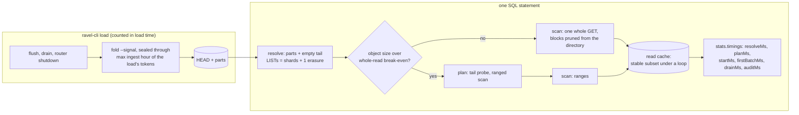

# ADR-2677: the ClickBench ranking gap: seal at load end, plan once, serve a stable subset, prove the pruning

Status: Proposed. Issue #2677 (epic). Stage 0 is the measured record on
#2639, #2615, #2592 and #2121; no new profile run preceded this ADR.
No persistent format changes: every RLOG object, catalog part, HEAD and
commit record keeps its bytes and its layout. The three levers that would
need a format change (exact per-block value summaries, a trigram filter,
time-clustered compaction output) are gated here on an offline selectivity
measurement and get their own ADR only if they clear it.

## Context

Ravel's upstream ClickBench entry (RustFS on gp2, c6a.4xlarge) ranks on the
hot geometric mean of per-statement ratios. On the published results (`results/20261004`, the v0.21.0 pin) it stands 2.03x
VictoriaLogs over 42 statements and 8.11x ClickHouse over 43. The epic body
on #2677 carries the Stage 0 table. The levers it names, each with the
figure it moves, are:

| lever | measured today | what sets it |
|---|---|---|
| per-statement floor | about 160 ms on RustFS, of which LIST 88 ms per 640-key shard-hour page; skipping the audit PUT moves q1 160 to 161 ms (#2639) | the resolve lists every shard-hour the load wrote, because no snapshot covers them: `catalog fold` seals an hour only `max_flush_lifetime + clock_skew_allowance + fold_safety_margin` after it ends (`crates/ravel-catalog/src/fold.rs:377-391`), and the override `--max-flush-lifetime 0s` still leaves 20 minutes and never seals the hour the load finished in (`docs/internal/clickbench.md`, "Fold the catalog before measuring anything") |
| q20 point lookup | 4,490 GETs and 17.3 GB on the wire against 2,617 objects and 9.84 GB: every object read twice (#2615) | a declared integer equality takes the planned route; for an object at or under `plan_whole_object_bound()` the plan phase reads it whole (`crates/ravel-query/src/log_fetcher.rs:1952-1955`, fallback at `:2043`), the barrier carries only the first `target_partitions` of them (`crates/ravel-sql/src/logs_scan.rs:3083-3114`), and the scan reads every other object whole again. `plan_carry_peak_bytes_bounded_by_plan_concurrency` pins the re-fetch today; #1272 tracks streaming the carry |
| hot runs on 16 GB and 8 GB | the read cache served 0.01 GB per hot run while 7.3 GB was re-read from disk (#2615); on 32 GB the hot column collapsed (q30 0.69 to 32.4 s) when the derived cache fell to 9.05 GB under 9.84 GB of corpus (#2639 W2) | S3-FIFO sizes its ghost list from the 64 MiB entry cap (`crates/ravel-cache/src/s3fifo.rs:75-105`): 26 to 74 keys against a 2,617-object loop, so no entry is ever touched twice while remembered, nothing reaches the main queue, and a loop even 9% larger than the cache serves nothing. ADR-0046 decision 6 chose that sizing so the compactor's and the folder's cold scans cannot evict a hot working set; a repeated identical scan is the case it never considered |
| attribution | the per-statement probe cannot place a 190 ms gap before the first batch (#2639 W8); the ADR-2509 after-stamp derives listing wall time by subtraction (#2595 item 10) | the SQL `stats` object carries requests and bytes per phase and no wall time; `ScanTiming` is folded onto `SqlStats` (`crates/ravel-sql/src/executor.rs:436-473`, set at `:1552`) and never rendered |
| declared-column pruning | wired (#2151, ADR-2121 D1) and unit-tested through `SqlExecutor::execute`; no HTTP test declares a column and asserts fewer reads | `UserID = N`, `CounterID = 62` and the `EventDate` epoch-day bounds reach the stamp skip and the block `NumRange` skip; none reaches postings (string and bytes equalities only, `crates/ravel-sql/src/logs_pushdown.rs:392-397`); `<>` is not extracted at all |
| ordered `LIMIT` (q24 to q27) | q25 and q27 about 1.1 s against 15 to 16 ms on ClickHouse; the TopK operator itself under 0.1 s; a block-level `ts` short-circuit gave no wall gain (#2639) | `hits.parquet` is CounterID-sorted, so every object spans most of the week in `ts`; an ordered traversal with a stopping rule can stop early only if the block `ts` envelopes are disjoint enough, which nobody has measured |
| fetch concurrency as a default | #2639 W1 (`latency-first`, 256 permits, per-query pool held at stock) on v0.23.0 release binaries with 25 MB objects: 43 of 43 on every machine with 32 GB or more, c6a.4xlarge cold 386.0 s and hot 57.2 s (published v0.21.0: 1,291.0 / 87.2); on c6a.2xlarge (16 GB) 40 of 43, q18, q32 and q33 refused with `process memory budget exhausted` at about 6.6 GB, plus two `upstream storage temporarily unavailable` errors from RustFS; on c6a.xlarge (8 GB) 33 of 43 against 37 at stock, 19 such refusals, 1.3 GB of swap used, and a concurrent phase of QPS 0.160 with an error ratio of 0.923; on c6a.large (4 GB) 18 of 43. The same release at stock on c6a.4xlarge: 43 of 43, cold 486.6 s, hot 56.9 s, QPS 0.653, error ratio 0.084, with 32 derived permits; W1 rerun on that box: cold 384.6 s (-21%), hot 57.1 s, QPS 0.727, error ratio 0.103, so on large objects W1 is a cold lever only (#1191 comment 6071729407, #2677 comment 6071772569, #2592 comment 6072731122) | the 256 permits' in-flight fetch reservations, each up to one whole object, draw on the process budget the queries draw on, so holding the per-query pool does not protect a 16 GB host; `store_get_concurrency` derives from cores, not from memory (ADR-1195, `resolve_performance_defaults`), and the loopback policy default is `cost-based` (ADR-2023 decision 1) |

Already delivered and not reopened here: the loader's memory and object
geometry (ADR-2614, #2592: 24.5 MB median objects, cold 499 s and hot 60.6 s
on r6a.4xlarge), the read path's ranged reads and coalescing (#2414,
ADR-2066), the parallel prefix listing and idle audit flush (ADR-2509), the
cache sizing the v0.23 tuned entry carries (#2639 W2), q28's
`octet_length` correction (W4), and the fetchers' byte reservations against
the process budget (#2086: every whole-object, covering and extent read
reserves before its GET; the comment in `crates/ravel-query/src/config.rs`
that calls fetch memory unbounded is stale).

The upstream rule that binds the first lever: "You should not wait for
cool down after data loading or running OPTIMIZE / VACUUM before the main
benchmark queries unless the database strictly requires this"
(ClickBench README, "Caching"). A separate post-load fold is exactly that
step. A loader that publishes the catalog snapshot for what it wrote, as the
last action of the load and inside the reported load time, is the load, and
that is how the upstream entries finalise their own indexes: `postgresql/load`
and `pg_duckdb/load` end with `VACUUM ANALYZE hits`, `timescaledb/load` with
`compress_chunk` and `vacuum freeze analyze`, `tidb/load` with
`ANALYZE TABLE`, `elasticsearch/load` with `_flush`; only `cratedb/load`
runs `OPTIMIZE TABLE`, and only in its tuned mode. The fold rewrites no data
object, so it is not the compaction (OPTIMIZE-class) arm that stays internal.

## Decision

### 1. The loader seals what it wrote

`Catalog::fold` takes a seal-through hour, `seal_through_hour: Option<u32>`:
the effective watermark becomes `max(sealed_watermark_hour(now),
seal_through_hour)` where the watermark is decided today (`fold.rs:1179`),
so the parameter can only raise the sealed hour, never cap it. `now_ns`
stays real: it also stamps
`created_unix_ns` on the HEAD, cuts the retention frontier, feeds the fold-lag
gauge and `head_is_fresh`, so a fake clock is not a substitute.

`ravel-cli load --fold-after-load` folds the loaded signal once, after the
drain and `router.shutdown()`, with the seal-through hour set to the highest
`ingest_hour_bucket` among the load's commit tokens. The fold's wall time is
inside the load's reported `elapsed`, and its `FoldReport` is printed with
the load summary. `ravel-cli catalog fold --writers-stopped` is the same
seal-through hour at the current hour for an operator whose writer has exited; it
replaces the `--max-flush-lifetime 0s` guidance in the internal ClickBench
guide and the AWS runbook.

Both flags are opt-in and carry the "UNSAFE under a live writer" wording the
override already has (`services/ravel-cli/src/main.rs:1917-1930`), because
the seal lemma (`docs/catalog-and-mvcc.md`, "Sealed hours") rests on
no later commit landing in a sealed hour: a record that does lands in a
bucket reconcile skips without a GET and stays invisible to non-token
queries until a HEAD rebuild, detected only by the maintain-mode scrub or
`catalog verify`. The loader is the one writer that can assert this about
its own hours. When the HEAD watermark is already at or above the effective
target, the fold returns today's no-op report (`fold.rs:1182-1186`), and
`--fold-after-load` reports that as a successful load with nothing left to
seal; a seal-through hour below the natural watermark changes nothing. The
scheduled fold no-ops on the sealed hours until the natural seal time
passes, as it does today.

Erasure, compaction and retention are unaffected: they seal on their own
clock-based margin, the pending-erasure LIST still runs on every resolve, and
the retention overlay is read inside the fold as before. The negative-HEAD
cache (`head_cache_ttl`, 30 s) is a cost, not a visibility concern, and the
entry starts its server after the load anyway. The entry declares its typed
columns before the first row lands, so the parts this fold writes carry
their `.cstat`.

What it moves: after an end-of-load fold the resolve window's suffix above
the watermark is empty until the clock crosses the next hour, then one
bounded `list_after` per shard on an empty prefix. A hot q1 goes from one
640-key LIST per shard-hour to the erasure LIST alone, then to
`shards + 1` LISTs of nothing.

### 2. A segment is read once: no plan phase for an object the scan reads whole anyway

The plan phase exists to decide which blocks of an object to range-read.
It gates on `plan_whole_object_bound()` (`log_fetcher.rs:1393-1396`: the
larger of `block_range_threshold` and the effective projection break-even,
which differ only under `cost-based`). An object at or under that bound is
read whole by the scan whatever the plan says, so planning it is a
whole-object read whose bytes are then dropped at the barrier. Rule: a
segment at or under `plan_whole_object_bound()` is not planned. The scan
opens it once and prunes blocks from the directory it has in hand
(`RlogReader::scan_pruned`, which the planned route already uses).
Segments above the bound keep the planned route: a tail probe, block
survivors, ranged scan. This document uses "at or under the bound" for
that set throughout.

The implementing task decides the shape inside `crates/ravel-query`
(`log_fetcher.rs`) and `crates/ravel-sql` (`logs_scan.rs`): whether the
segments at or under the bound bypass the barrier as all-survivors with
in-scan pruning, or the barrier carries their directories and the scan
reads bytes once. Both must leave the whole-segment fast path and the planned route's
survivor and row-reference mapping intact. `plan_carry_peak_bytes_bounded_by_plan_concurrency`
changes to assert the opposite of what it pins today for objects at or
under the bound: no second GET of the same key. #1272 (stream the carry per
partition) stays open for the above-break-even route.

What it moves: a q20-shaped statement over the stock corpus (3.8 MB
objects, all at or under the bound) goes from about 1.76x the corpus on
the wire (17.3 GB over 9.84 GB) to about 1.0x, and from about 1.72 GETs
per object (4,490 over 2,617) to one. The tuned large-object arm's 25 MB
objects sit above the 18.9 MB bound and keep the planned route, so this
decision changes nothing there.

### 3. The memory read cache serves a stable subset under a repeated scan

The in-memory fetch cache (`--cache-max-bytes`, S3-FIFO) must, for a
repeated identical scan of N entries over a cache that holds C < N of them,
serve a stable fraction on every pass after the first. The property is
pinned by a test in `crates/ravel-cache`: a loop of N keys over a cache of C
entries serves at least 0.8 × C/N of the touches on passes 2 and 3, and the
set it serves does not change between those passes. The mechanism is the
implementing task's, with one constraint: the disk tier's protection of a
hot working set from the compactor's and the folder's cold scans (ADR-0046
decision 6) must still hold, and its test must still pass. The task amends
ADR-0046 decision 6 with the loop case and its sizing, and corrects
`docs/guides/caching.md`, which still calls these caps "LRU".

What it moves: on the reference box the hot column survives the derived
cache falling under the corpus, which it did by 0.8 GB under 2 GB of host
noise (#2639 W2); on 16 GB, where the cache holds about half the corpus,
hot scans stop re-reading all of it from disk. Where the page cache already
serves a hot run (large objects on 16 GB, #2615) this changes nothing, and
the measurement says so.

### 4. Per-phase wall time in the SQL `stats`

`stats.timings` is a new object in the JSON SQL response, beside `phases`
and `io`, which keep their exact key sets (the parity tests in
`crates/ravel-sql/src/stats_json.rs` pin them). Its fields are wall times
of the successful attempt, taken from monotonic stamps in the executor:
`resolveMs` (around `self.resolve`), `planMs` (around `plan_pinned_with`),
`startMs` (physical plan and `execute_stream`), `firstBatchMs` (from start
to the first `Ok` batch), `drainMs` (from the first batch to stream end),
and `auditMs` (around the `.audit(...)` await in
`services/ravel-server/src/service/mod.rs:601`, returned beside the
outcome). It also renders the scalar `ScanTiming` figures that are
meaningful across partitions (`planInitMs`, `planningWaitMaxMs`,
`openMaxMs`, `decodeBuildMaxMs`, `firstBatchMinMs`, `streamMaxMs`), never
the overlapping per-partition sums and never the per-segment rows. A retried
statement reports its successful attempt plus `attempts`, so the fields are
not expected to sum to the client's latency, and the documentation says so.
Arrow-IPC and Flight responses carry no `stats` today and that does not
change; MCP's budget block does not pick these up.

Beside it, `stats.pruning` renders the counts `SqlStats` already carries
and nothing exposes per statement: `segments`, `segmentsPrunedByStats`,
`blocksTotal`, `blocksScanned`, `blocksPrunedByPostings`. Object-level and
block-level pruning are then reported independently, which the acceptance
bands in decision 8 and the test in decision 5 read directly.

What it moves: the 190 ms pre-first-batch gap becomes three named numbers;
the ADR-2509 after-stamp reads `resolveMs` instead of subtracting.

### 5. Declared-column pruning is proven through the HTTP endpoint

A test in `services/ravel-server/tests` declares `I64` columns, loads
stamped segments through the real ingest path behind a GET-counting store
wrapper, and asserts through `POST /api/v1/sql`, for a `CounterID = 62 AND
EventDate BETWEEN a AND b` statement and a `UserID = N` statement: the exact
rows, zero GETs for the segments whose stamp excludes the predicate, and
`stats.pruning.segmentsPrunedByStats` (decision 4; this task runs after
it). A second case shows the block-level `NumRange` skip reducing
`stats.pruning.blocksScanned` on an object whose stamp does not exclude the
value. The test follows `a_segment_whose_stats_exclude_the_predicate_is_never_fetched`
(`crates/ravel-sql/src/logs_provider.rs:3006`) and the recording wrapper in
`statement_floor_e2e.rs`, moved up to the HTTP surface. It adds no pruning:
the predicates that reach nothing today (`<>`, string-literal dates,
postings for integer columns) are recorded as a finding on #2677, not fixed
here.

### 6. Three levers are measured offline before any format work

Each is a measurement on the reference corpus, run by the orchestrator, with
its band written on #2677 before it runs. A lever that misses its band is
closed with the number; one that clears it gets a follow-up ADR under the
format-change procedure, outside this epic.

| lever | measurement | clears when |
|---|---|---|
| ordered stop (q24 to q27) | per 100,000-row window of `hits.parquet` in file order (the loader's batch and object boundaries), the `EventTime` min and max; from them, the fraction of windows an ascending-lower-bound traversal must visit before the kth `ts` of q25's filter cannot be beaten | at most 10% of windows visited |
| trigram substring (q21 to q24) | the fraction of 100,000-row windows whose `URL` contains `google` and whose `Title` contains `Google` | a block filter can exclude at least 90% of row-data bytes for q23's positive `Title` condition |
| exact low-cardinality summaries (q2, q8) | the fraction of windows where `AdvEngineID` has a single value, and the per-window distinct count | a complete per-block value count stays under 1% of corpus bytes and answers q2 and q8 without a row read |

### 7. GET permits and the loopback fetch policy resolve from host memory

W1 (`latency-first`, 256 permits, the per-query pool held at stock) is the
largest cold lever measured on large objects and is unsafe below 32 GB,
because the permits' in-flight reservations and the queries draw on one
process budget. It therefore lands as a server default and not as an entry
flag: the upstream default entry stays stock and gains it through a
release.

Rule: `resolve_performance_defaults` derives `store_get_concurrency`
(ADR-1195) so that the permits' worst-case in-flight bytes, the permit
count times the largest whole-object read the fetcher reserves, stay a
fixed share of `memory_budget_bytes`, beside the loopback cache carve of
ADR-2023 decision 3. The implementing task pins the share and the
per-permit bound and states them, with the derivation yielding 256 on the
32 GB reference host and correspondingly fewer at 16 GB and below. An
explicit `--store-get-concurrency` still wins. The SQL partition count does
NOT follow the permits: ADR-1195 unbundled the three knobs and kept the
partition default at its core derivation, recording that 256 partitions
cost about 19 GB of process peak. W1 was measured with `--fetch-concurrency
256`, which set all three together, so permits alone may not reproduce it.
Decision 8's cold band is therefore measured first with the permits
derived and the partitions at the core default; if that arm misses the
band, the partition count joins the same memory-share derivation, with its
per-partition cost term pinned from ADR-1195's figure, as a second round
on the same ticket rather than a silent widening. On a loopback endpoint the
default `--logs-fetch-policy` becomes `latency-first`, which amends
ADR-2023 decision 1 for the loopback case only; `cost-based` stays the
default against a remote store, where ADR-1196 measured it. #1191 keeps
#1170 (the in-flight fetch buffers' own design gate); this decision bounds
the permits by memory, it does not change what each permit reserves.

What it moves: the stock entry gets W1's cold gain on every host where it
is safe and nothing on a host where it is not. The acceptance arm reports
the concurrent phase (QPS and error ratio) against the same release's
stock arm on the same box, because that phase is what sent the loopback
default back to `cost-based` once (ADR-2023 decision 4). Its absolute bar
is already missed by stock v0.23.0 (error ratio 0.084 against 0.058), so
the comparison is relative: W1 on the reference box measured QPS 0.727
and error ratio 0.103 against stock's 0.653 and 0.084, and the derived
defaults may not widen that error gap. A miss there is reported before any
release, not hidden.

### 8. Measurement protocol and targets

Every arm runs on a fresh bot-style c6a.4xlarge (the pass launcher and the
entry's own `benchmark.sh`), one build per arm with its SHA stamped, the
dataset identity and the server's `performance default resolved` lines
recorded, cold as restart plus verified page-cache eviction, hot as the
better of runs 2 and 3, and the per-statement probe (`stats.phases`,
`stats.timings`, disk read bytes) over the statements the arm targets. The
bands below are pre-registered on #2677 before each arm launches; a figure
outside its band is a miss and stays open with its bottleneck named.

| check | target | miss |
|---|---|---|
| c6a.4xlarge cold total, 43 statements, this epic's build at derived defaults | at most 425 s (W1 tuned basis on this box 386.0 s; stock 486.6 s) | over 486.6 s |
| c6a.4xlarge hot total, 43 statements | at most 55 s (stock 56.9 s less about 90 ms of floor on each of 43 statements) | over 58 s |
| q1 and q7 hot p50 after an end-of-load fold | at most 80 ms (160 ms floor less the 88 ms LIST; the residual is what `stats.timings` attributes) | over 100 ms |
| resolve LISTs per statement, folded against unfolded large-object arm | at least 80% fewer | fewer than 60% fewer |
| `unfoldedSegmentsResolved` after the fold | 0 | any |
| load time with `--fold-after-load` | at most 1.05x the same load without it | over 1.1x |
| q20 GETs per object / wire bytes over corpus bytes, stock corpus arm (3.8 MB objects) | at most 1.0 / at most 1.05 | over 1.2 / over 1.3 |
| q2 hot on 16 GB with the cache at about half the corpus | cache-served bytes at least 40% of wire bytes | under 25% |
| hot geomean ratio to VictoriaLogs, 42 statements, +0.01 s | reported; the plan's eight-week figure (1.1) is not this epic's target | |
| statements answered on the reference box | 43 of 43 | fewer |
| c6a.4xlarge, no server flags, derived permits and loopback policy | 43 of 43; cold within 10% of the tuned 386.0 s | over 425 s, or a refusal |
| c6a.2xlarge (16 GB), no server flags | no statement refused that stock answers (42 of 43, #2627 R6); cold reported against the tuned 377.1 s and the stock arm | any such refusal |
| concurrent phase, derived defaults against same-release stock on c6a.4xlarge | QPS not below stock's and error ratio not above stock's by more than 0.02 (v0.23.0 stock: QPS 0.653, error 0.084; W1 tuned on the same box: 0.727, 0.103) | error ratio over stock's by more than 0.02, or QPS below stock's |
| unaffected statements | no confirmed regression over 5% | |

The v0.23 nine-machine pass already in flight (pre-registration #2592
comment 6070942990) is the "large objects, tuned fetch and cache" arm. It
is reconciled against its own bands before any arm of this epic launches,
and its result stays separate from stock.

## Rejected alternatives

- **A fake clock for the fold.** `now_ns` stamps the HEAD, cuts the
  retention frontier, drives the fold-lag gauge and `head_is_fresh`; a HEAD
  stamped in the future would make the scheduled fold skip its ticks and
  would mis-date retention.
- **Keep the separate post-load `catalog fold --max-flush-lifetime 0s`.**
  Leaves a 20-minute residual that never seals the finishing hour, and it is
  the post-load step the upstream rule names.
- **Cache the mutable HEAD longer, or serve the tail from a cached listing,
  to cut LISTs.** A cached HEAD can hide acknowledged data; the visibility
  contract (`docs/consistency-model.md`) is not for sale for a floor.
- **A second manifest beside the snapshot.** The immutable parts and the CAS
  HEAD already are the snapshot; a second system doubles the invalidation
  surface.
- **Raise the plan carry to hold every planned object.** Holds the corpus in
  memory. **A tail probe for objects at or under the bound** instead of no plan
  phase: fixes the bytes but adds a request per object, which ADR-2023
  measured as a loss on loopback under cost-based fetch.
- **Bypass the read cache for one-pass scans, or refuse whole objects.** The
  hot run is a repeated scan; refusing it is the 0.01 GB result. **Plain
  LRU** serves nothing on a loop larger than itself either.
- **Fetch concurrency paid for by a smaller query pool.** q33 fails at the
  smaller pool (#2639 W1's pairing); the stock derivation stays.
- **W1 as an entry flag, with the per-query pool held at stock as the
  safety.** Holding the pool does not protect the process budget the
  permits draw on: 40 of 43 at 16 GB and 33 of 43 at 8 GB, both worse than
  stock. The entry cannot know the host; the server's derivation can.
- **Weaker audit acknowledgement for a shorter floor.** Rejected by
  ADR-0062 and ADR-2509; on RustFS the floor is the LIST, not the PUT.
- **Build the summaries, the trigram filter, or time-clustered compaction
  now.** Each is a format change with an index-size and ingest cost, and
  none has a measured selectivity on this corpus. Decision 6 buys that
  number before the format procedure starts.
- **Put the wall times into `stats.phases`.** The phase names are request
  accounting buckets, not wall-clock stages (the logs-scan `plan` I/O runs
  inside stream polling), and the key-set parity with PromQL is pinned.

## Consequences

- The entry needs a release that carries `--fold-after-load` before its
  `load` can use it; until then the fork keeps the stock recipe. The stock
  arm and the tuned arm stay separate on #2592 and in `results/`.
- Load time grows by one fold of the loaded hours, reported inside it; on the
  reference corpus that is one HEAD and a handful of parts.
- An operator who passes either new flag under a live writer can make a
  late commit invisible until a HEAD rebuild. The flags say so, and
  `docs/internal/clickbench.md` and the AWS runbook change their fold step to
  the loader flag.
- `stats.timings` is a documented field of the JSON SQL response
  (`docs/query-engine.md`, `docs/guides/query.md`). The ADR-2509 after-stamp
  protocol reads it directly from the next measurement on.
- Segments at or under `plan_whole_object_bound()` no longer run a plan phase; the accounting
  `plan` bucket drops to the probe-and-stats cost for those segments, and
  `docs/query-engine.md`'s description of the planned route says which
  segments it covers.
- ADR-0046 decision 6 gets an amendment for the loop case; the memory tier
  and the disk tier may size their ghost lists differently.
- ADR-2023 decision 1 gets an amendment: `latency-first` on a loopback
  endpoint, `cost-based` elsewhere, with the permits derived from memory.
  The tuned entry's `RAVEL_HOLD_STOCK_QUERY_BYTES` probe becomes
  unnecessary once a release carries the derivation; #1196's flag-doc
  precondition is met by the derivation rather than by prose.
- Three levers leave this epic as numbers on #2677: either closed, or a
  follow-up ADR under the format-change procedure.

## Plan

Five fleet tasks in two waves, crate-disjoint within a wave; the
measurements are orchestrator work on bot-style boxes.

| task | decision | crates | risk |
|---|---|---|---|
| T1 seal ceiling, `--fold-after-load`, `--writers-stopped`, load-then-SQL e2e | 1 | ravel-catalog, ravel-cli, docs | high (visibility contract): `effort: high`, its own checkpoint review |
| T2 `stats.timings`, `stats.pruning`, pruning reachability through HTTP | 4, 5 | ravel-sql, ravel-server, docs | low |
| T3 loop-stable memory cache, ADR-0046 amendment | 3 | ravel-cache, docs | medium |
| T4 no plan phase for segments at or under `plan_whole_object_bound()` | 2 | ravel-query (`log_fetcher.rs`), ravel-sql | medium |
| T5 permits and loopback policy from host memory, ADR-2023 amendment, the three stale doc comments in `crates/ravel-query/src/config.rs` (the "not bounded" note, LatencyFirst's "operator opt-in", `LATENCY_FIRST_MEASURED_CONCURRENCY`) | 7 | ravel-server, docs, ravel-query (doc comments in `config.rs` only) | medium |

Wave 1: T1, T2, T3. Wave 2: T4, T5. Then the arms of decision 8 and the
measurements of decision 6. The high-risk-solo wave rule is relaxed on the
owner's days-not-weeks instruction; T1 compensates with its own reviewer
and `effort: high`. T4 and T5 share the ravel-query crate in wave 2 by one
stated exception: T5's footprint there is doc comments in `config.rs`,
which T4 does not touch, so no signature or module declaration can
collide.
