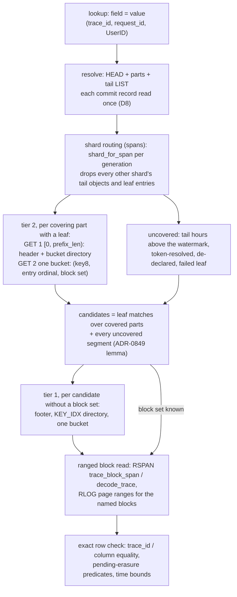
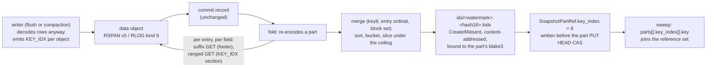

# ADR-2707: an exact-key index for spans and logs on object storage

Status: Proposed (2026-10-10). Issue #2707 (epic). Stage 0 is measured on
#2707 (release v0.23.0, one c6a.4xlarge in us-east-1, same-region S3).
Persistent format changes: a new KEY_IDX section grammar shared by RLOG and
RSPAN (decision 1), RSPAN trailer version 5 (decision 2), an optional RLOG
section kind (decision 3), a new `.kidx` catalog object and an additive
`SnapshotPartRef` field (decision 4), and an additive tenant-config field
(decision 3). The proto changes land with their implementing tasks, not
with this document. This ADR is the first delivery of ADR-0849's
point-postings item and binds to that ADR's two-level binding (section 1),
routing budget (section 2) and safety lemma (section 3).

## Context

An exact-equality lookup on a high-cardinality key (`trace_id = X` on
spans; `trace_id`, `request_id` or a typed I64 attribute column such as
ClickBench `UserID = N` on logs) should answer in about a second on one
query node, with or without a time range, at a trillion stored rows. Today
its cost grows with the bytes in the time window, not with the matches:

| step | spans | logs |
|---|---|---|
| shard | ingest routes by `blake3(trace_id)` (`crates/ravel-ingest/src/span_router.rs`, `shard_for_span`), but no read path routes by it | sharded by stream, not by any lookup key |
| resolve | reads each commit record twice (a 128-way prewarm, then a sequential include pass, `Catalog::prewarm_commit_records` and `include_l0_if_overlaps` in `crates/ravel-catalog/src/catalog.rs`); the record cache caps at `MAX_CACHE_CAPACITY_PER_TENANT` = 25,000 entries (`crates/ravel-catalog/src/config.rs`), so above that both passes miss | same |
| objects | time only; `SegmentRef` has no key summary (`SpansTableProvider::pruned_segments`, `crates/ravel-sql/src/spans_provider.rs`) | the typed attribute column stamp (min/max), which excludes nothing for a key spread across every object |
| fetch | one whole-object GET per candidate (`GetRange::Full` in `crates/ravel-query/src/span_fetcher.rs`) | whole object, or ranged by policy |
| inside | per-block `[min_trace_id, max_trace_id]` in SKIP_IDX after the GET; BLOOM covers only `service.name` and span name | block `NumRange` (`crates/ravel-sql/src/logs_pushdown.rs`) and POSTINGS, which is capped to low-cardinality fields (ADR-0049 decision 4) |
| entry points | SQL only, with the request's one-hour default window; MCP `ravel_get_trace` takes a required window; no trace HTTP endpoint (#1869, #1987); the distributed coordinator fans out with no pushdown (`distributed_spans_plan`, `crates/ravel-sql/src/distributed_rlog.rs`) | SQL; distributed workers get the default pushdown |

### Stage 0, spans (200 M spans, 20 M traces x 10, 24 h of event time, 4 shards)

Lookups are `SELECT trace_id, span_id, start_ts FROM spans WHERE trace_id =
'<hex>'` over HTTP SQL; A = a 1 h window around the trace, cold; B = the 24 h
window, cold; A-warm = A without a restart. Figures are medians.

| state | objects | load | A cold | B cold | A warm | GETs (A) | bytes (A) |
|---|---|---|---|---|---|---|---|
| default `ravel-cli load` (`--batch-rows 10000`, `--target-bytes 1`) | 80,000 L0 objects of about 52 KB, 4.17 GB (about 21 B/span) | 597 s | 566 s | timed out at 660 s | 552 s | resolve 160,003 | 222 MB |
| the same, compacted and folded | 56 L1 segments, 4.35 GB | compaction 92 min for one shard at defaults, the rest at `--bucket-concurrency 3 --input-read-concurrency 64`; fold 2,411 s | 3.26 s | 3.22 s | 3.08 s | 60 (resolve 4) | 4.35 GB (every segment) |
| 1 M-row batches, unfolded | 800 L0, median 5.4 MB | 110 s | 0.68 s | 3.50 s | 0.35 s | 839 (resolve 803) | 194 MB (36-40 objects) |
| merging path (`--batch-rows 50000 --target-bytes 75000000 --max-flush-delay 60s --pipeline-depth 20`) | 5.39 MB objects, 4 every 60 s | about 3.3 h projected, stopped | (geometry as the 1 M arm) | | | | |

Every completed lookup returned the trace's 10 spans (149 of 149).

What it shows:

1. **Resolve dominates a freshly loaded tenant only when objects are
   small.** At 80,000 objects every lookup reads every commit record twice:
   160,003 GETs, which is 2 per record plus 3, because the 80,000 records
   are above the 25,000-entry cache cap and the two passes evict each other.
   At 800 objects it is 803 GETs: records plus 3, because the second pass
   hits the cache. A tenant with weeks of unfolded hours crosses the cliff
   again, so the double read is fixed regardless (decision 8).
2. **The loader's default object size is the first-order problem.** The
   same data loads 5.4x faster with 1 M-row batches (597 s to 110 s,
   derived), the fresh 1 h lookup goes from 566 s to 0.68 s, and neither the
   3.5 h compaction nor the 40 min fold exists at 800 objects.
3. **The merging path works and is age-paced.** 20 batches of 50,000 rows
   became one 5.39 MB object per shard, so merging is real. The size trigger
   never fired: 250,000 spans per shard were estimated under the 75,000,000
   target, so the estimate is under about 300 B/span against 21.5 B/span
   stored, a ratio under about 14x (derived). Every object waited out the
   60 s age trigger, projecting about 3.3 h. The derived target must make the
   size trigger fire as the last in-flight batch lands (decision 9).
4. **Once objects are large or folded, every lookup reads the window
   whole.** Folded: 4.35 GB per lookup for 10 spans, at 1 h and at 24 h,
   because compaction groups by ingest hour and this bulk load put 24 h of
   event time into one ingest hour. Large objects: about 194 MB per 1 h
   lookup. There is no read cache on the spans fetcher
   (`services/ravel-server/src/query.rs` wires none, though
   `SpanSegmentFetcher::with_cache` exists), so warm reads the same bytes
   from S3.
5. **Extrapolation to 1e12 spans** (5,000x; derived, not measured): folded
   with no time range, about 22 TB per lookup, about 4.5 h on one node at the
   measured 1.35 GB/s; a 1 h window in steady state about 1/720 of that,
   about 30 GB, about 22 s.

### Stage 0, logs (ClickBench q20, `SELECT "UserID" FROM logs WHERE "UserID" = 435090932899640449`)

99,997,497 rows, 17,630,976 distinct `UserID`, objects of about 25 MB (the
v0.23 entry recipe), unfolded tenant, stock server.

| figure | measured |
|---|---|
| distinct (UserID, 8,192-row block) pairs per object (offline, 411 objects of about 243,896 rows) | p50 49,899, max 165,431 |
| implied tier-1 KEY_IDX size at about 10 B per entry | about 2% of object bytes (about 0.5 MB per 25 MB object) |
| objects per UserID, p50 / p99 / max | 1 / 3 / 213 |
| the q20 key | 4 rows, 1 object, 1 block |
| cold wall (3 passes) | 3.23, 3.27, 5.21 s |
| cold S3 GETs | 2,359: resolve 1, plan 1,133, scan 1,225 |
| cold wire bytes | 1.48 GB (plan 602 MB, scan 877 MB) |
| candidate segments | 410 of 410: the stamp excludes none |
| hot wall | 0.54-0.61 s, 1 GET, cache-served |

The key is extremely selective (4 rows in one block of one object), yet a
cold q20 opens all 410 objects. Hot is already fast, so the index's value for
logs is the cold and larger-than-cache case, which is the production case.

### What ADR-0849 already settles

ADR-0849 built the plane this index lives in: immutable, content-addressed
packs under `catalog/<signal>/idx/`, bound per part to the part's exact
`blake3` (never its `watermark_hour`), a routing budget stated per index type
with a finite ceiling, and the safety lemma under which a missing, stale,
corrupt or version-mismatched pack makes a query slower and never wrong. It
also records that the fold reads commit records and not rows, so a pack
needs a carrier from the stage that can see values to the stage that
publishes packs, and it left that carrier to the first implementing ADR. This
ADR picks the carrier: a per-object section inside the data object, read by
the fold with ranged GETs. The fold already reads data objects to build
column statistics (`crates/ravel-catalog/src/column_stats_build.rs`), but
whole; this reads the section alone: about 2% of each logs object (Stage
0, measured from the distinct pair counts) and about 6% of each spans
object (one 12 B entry per trace per object against 21 B/span stored,
derived; the measured section size is a T7 acceptance figure).

## Decision



### 1. One KEY_IDX section grammar, shared by RLOG and RSPAN, with its own version byte

A new section kind holds, per indexed field, every distinct `(key8, block
ordinal)` pair in the object, sorted, in buckets addressed by a directory.
The grammar is defined once (normative text in docs/log-segment-format.md,
"KEY_IDX"; docs/span-segment-format.md refers to it) and implemented once,
in `ravel-codec`, the crate the two formats already share for codecs and
BLOOM (ADR-0045 decision 1, ADR-0054). Its `version` byte is the section's
own grammar version, separate from either trailer version, exactly as
POSTINGS carries one.

- **Entries.** `key8` is 8 bytes; `block` is the object's block ordinal (the
  SKIP_IDX level-0 block in RLOG, 8,192 rows by default; the SKIP_IDX block
  in RSPAN). One entry per distinct pair; a row whose field is NULL, absent,
  or stored under a type other than the declared one contributes none. For
  logs the indexed value is the one the SQL column reads for the row (the
  merged view, ADR-0049 amendment), so a key held only at resource or scope
  level indexes every block of that stream.
- **Key types** (`key_type` byte): `Id16` (1; a 16-byte id, `key8` = its
  first 8 bytes), `I64` (2; `key8` = the big-endian bytes of the sign-flipped
  bit pattern `(v as u64) ^ (1 << 63)`, the `NumRange` ordering convention),
  `Str` (3) and `Bytes` (4; `key8` = the first 8 bytes of the unkeyed blake3
  of the value). `Bool` is never indexed: two values prune nothing.
- **Buckets.** A field's entries are split into `2^bucket_bits` buckets by
  `(u64::from_be_bytes(key8) * 0x9E3779B97F4A7C15) >> (64 - bucket_bits)`,
  a fixed multiplicative mix. The top bits of the key itself (the advisory
  design) are not uniform for an auto-increment or timestamp-shaped I64 key,
  which would put a whole object's keys in one bucket; the mix costs nothing
  and makes the bucket size a function of entry count alone. Entries inside a
  bucket stay sorted by `(key8, block)`, so a probe is a binary search.
- **Directory.** Per field, `2^bucket_bits` cumulative `u32` bucket end
  offsets under their own crc32c. The writer uses `bucket_bits = 8` (256
  buckets, a 1 KB directory); the reader accepts 1 to 16. At Stage 0's
  tier-1 sizes (p50 49,899 entries per logs object; 25,000 to 50,000 per
  250,000-span object, derived) a bucket is 200 to 650 entries, 2 to 8 KB
  before compression (derived). The advisory 4,096 buckets would make the
  directory 16 KB against sections of 250 to 500 KB and buy nothing at this
  grain; 4,096 is the right count one tier up (decision 4).
- **Bucket frames.** Each bucket is `u32 entry_count`, `u32 crc32c` over the
  stored bytes, then zstd bytes that decompress to exactly `entry_count x 12`
  bytes. An empty bucket is the 8-byte header with no payload. The section is
  a container, uncompressed as a whole, so one bucket is readable alone.
- **Header.** `version` (1), `bucket_bits`, a reserved u16, a fixed-width
  `prefix_len`, then per field its name, key type, entry count, directory
  offset and bucket area, all under a header crc32c. The writer lays every
  field's directory directly after the header in field order and every
  bucket area after them, and `prefix_len` names the end of the last
  directory, so a probe's first ranged GET, `[0, prefix_len)`, holds the
  header and every directory for any conformant writer; a directory or
  bucket area on the wrong side of `prefix_len` is `Corrupted`. Readers
  still address by the header's offsets, never by adjacency. **The indexed set is written here and never
  inferred from live config at read time** (ADR-0849 section 3): a field the
  header does not name is uncovered in this object for that field.

The layout, in full in docs/log-segment-format.md:

```
key_idx (stored uncompressed; bucket payloads zstd):
  u8       version            (= 1)
  u8       bucket_bits        (writer 8; reader accepts 1..=16)
  u16 LE   reserved           (= 0)
  u32 LE   prefix_len         (through the last directory's crc; sizes GET 1)
  uvarint  field_count        (1..=64; ascending by name, unique)
  fields[field_count]:
    uvarint name_len; name; u8 key_type; uvarint entry_count;
    uvarint dir_offset; uvarint buckets_offset; uvarint buckets_len
  u32 LE   header_crc32c
  per field, at dir_offset:
    u32 LE ends[2^bucket_bits]; u32 LE dir_crc32c
  per field, at buckets_offset, frames tiling [0, buckets_len):
    u32 LE entry_count; u32 LE frame_crc32c;
    zstd entries[entry_count]: key8 [8], block u32 LE
```

A `KEY_IDX` probe is the last pruning step inside an opened object, after
SKIP_IDX and before any block is read, and it is exact: an absent key is proof
of absence for every block, and a present key names the blocks. Both are
widen-only in the sense ADR-0013 and ADR-0049 use: a prefix collision is a
false positive removed by the row check, and a corrupt section is a typed
`Corrupted` error that disables the probe for the object and reads it as
today.

### 2. RSPAN carries KEY_IDX as a mandatory section: trailer version 5

Every RSPAN object indexes `trace_id` (`Id16`) implicitly; no declaration
exists for spans. The section is kind 4 beside BLOCKS (1), SKIP_IDX (2) and
BLOOM (3), mandatory like them, and a v5 reader rejects an object missing it
as `Corrupted`. Making a kind mandatory changes what a valid object is, which
is the case RLOG's versioning rule reserves the trailer bump for, so the
trailer goes from 4 to 5 under the pre-v1.0 single-version regime (ADR-0027,
ADR-0045 decision 4, ADR-0054 decision 1): `ravel_rspan::footer::VERSION`
becomes 5, the v4 reader is deleted in the same change, and a v4 object is
refused with `UnsupportedVersion` from the trailer alone. Development stores
holding v4 objects are wiped or re-ingested; outside development buckets an
object that must stay queryable is re-ingested from source, Ravel's accepted
pre-release posture (docs/span-segment-format.md). The compactor's
`OUTPUT_FORMAT_VERSION` and `audit-versions` read the one constant.

One correction to the advisory input: `validate_sections` in
`crates/ravel-rspan/src/footer.rs` checks presence and uniqueness of the
three known kinds and the range of every section, and does not refuse an
unknown kind. The bump is for the new mandatory kind, not for an unknown-kind
refusal.

Why spans need tier 1 at all, when SKIP_IDX already holds per-block
`[min_trace_id, max_trace_id]` and records sort by `trace_id`: the range test
is an interval, not membership. Trace ids are random, so every object's range
spans nearly the whole id space and every tail object reads as a candidate
whose block run must be fetched to learn the trace is absent. KEY_IDX turns
that into a bucket read of a few KB, and it is the only source the fold can
build the tier-2 leaf from without decoding rows: SKIP_IDX has no per-trace
entries.

### 3. RLOG carries KEY_IDX as an optional section, declared per tenant

KEY_IDX is RLOG section kind 9 (6 is POSTINGS, 7 is reserved for GRAM_IDX,
8 is PAGE_DIR; 9 is the next free number). It is optional: a new kind that
old readers skip and whose absence is legal is exactly what ADR-0029's
versioning carve-out excepts from a trailer bump, as POSTINGS was. The
trailer stays at 5. A writer emits it when the tenant's indexed set is
non-empty, physically between BLOCKS and SKIP_IDX so the 256 KiB tail probe
(`DEFAULT_LOG_SUFFIX_LEN`, ADR-0699 decision 5) keeps covering the footer,
SKIP_IDX, PAGE_DIR and BLOOM.

The indexed set is declared on the tenant's typed attribute columns:
`TypedAttrColumn` (proto/ravel/sys.proto) gains `bool key_index = 3`, and
`TypedAttrColumnConfig` gains `bool index_trace_id = 2` for the fixed
`trace_id` column, which is not a typed attribute column. Eligible types are
`I64`, `STR` and `BYTES`; `BOOL` is refused by the config write gate. The
record is CAS-mutable, so the change follows ADR-0066's R1 amendment: the
record's `format_version` bumps, the reader that accepts the new version
ships and rolls first, and the writer that stamps it ships after. What a
query may prune on is read from the section and leaf headers (decision 1),
so de-declaring a column or declaring it after a flush opened leaves those
objects uncovered for it, never wrongly covered.

A `request_id` is a declared `STR` column with `key_index`; a logs
`trace_id` lookup uses `index_trace_id`; ClickBench `UserID` is a declared
`I64` column with `key_index`.

### 4. Tier 2: one `.kidx` leaf per (snapshot part, field, key slice), built at fold from the sections



- **Object.** `t/<tenant_hash>/catalog/<signal>/idx/<watermark>.<hash16>.kidx`,
  immutable, `CreateIfAbsent`, `hash16` = the blake3 of the leaf's own
  bytes (the `.cstat` rule: keying by the part's hash would let two folds
  that degraded differently collide under `AlreadyExists`). The envelope is
  magic `RKI1`, a `KeyIndexLeafHeader` protobuf under a header crc32c, a
  bucket directory under its own crc32c, then bucket frames framed as in
  tier 1, holding `(key8, entry ordinal, block set)` entries: the
  part-local `SnapshotEntry` ordinal (ADR-0849 section 1) and a delta-coded
  block list, the block bitmap ADR-0849 section 1b requires in the encoding
  that is small for the sets measured (p50 one object per key). **The
  byte layout, the header fields, the corruption list, the binding and
  coverage rules, the reader procedure, the fold build and the rollout
  guard are normative in docs/catalog-and-mvcc.md, "Per-part key-index
  leaves", and are not restated here**; the same convention decision 1
  uses for the section grammar, so a later correction lands in one place.
  What this decision fixes, and that document carries:
  - **Binding** to the part's exact `blake3`, never its `watermark_hour`.
    A `tenant_hash` mismatch is the hard `CatalogError::FieldMismatch` of
    ADR-0050 decision 2, counted in `ravel_catalog_isolation_breach_total`,
    no fallback. A `part_blake3` mismatch or an unsupported version rejects
    the leaf and the part reads as uncovered for that field only. The
    header lists `uncovered_entry_ordinals`, the entries the fold could not
    index, and a reader subtracts exactly those from coverage (ADR-0849
    section 3). Same `watermark_hour`, different part bytes, leaf rejected:
    the regression test ADR-0849 names.
  - **Reference.** `SnapshotPartRef` gains `repeated SnapshotKeyIndexLeafRef
    key_index = 8` beside `column_stats = 7`, carrying the header's slice
    and sizing fields plus `key`, `blake3`, `size` and `prefix_len`, so a
    reader picks the slice and sizes its first GET without opening the
    leaf. The header is authoritative (it is under the leaf's blake3; the
    ref is not): after GET 1 the reader compares the duplicated fields and
    any disagreement rejects the leaf as `Corrupted`, never a wrong-slot
    lookup. Absent means uncovered and is never an error.
    `HEAD_FORMAT_VERSION` (1) is not bumped, by the field 6 and field 7
    precedent (ADR-0063, ADR-1413): an older reader ignores the field and
    scans. `SnapshotKeyIndexLeafRef` and `KeyIndexLeafHeader` are added to
    proto/ravel/catalog.proto by the implementing task.
  - **Build.** The fold builds leaves for exactly the parts it re-encodes
    this fold, from the tier-1 sections by ranged GET (about 2% of a logs
    object, about 6% of a spans object), never from rows and never
    whole-object, written before the part PUT so a refusal writes no object
    (the ADR-1413 order). `bucket_bits` balances the directory against the
    mean bucket, clamped to 12..=16 (13 at the Stage 0 day as one part,
    derived: a 32 KB directory and a 29 KB mean bucket at that body, 32 KB
    at the ceiling); the body ceiling reuses
    `DEFAULT_MAX_COLUMN_STATS_BYTES` (256 MiB), and a larger (part, field)
    is sliced by key range, one leaf per slice, so a lookup opens exactly
    one leaf per (part, field).
  - **Lifecycle.** `sweep_unreferenced_catalog_objects` names
    `parts[].key_index[].key` in its reference set in the same change as
    the first leaf writer (ADR-0849 section 1a). A fold process that
    predates this change strips field 8 from every part it carries
    forward; no HEAD field can constrain it (it predates every field here,
    and the fold rebuilds HEAD as a fresh prost struct, so a stamp would
    not survive its CAS). The guard is in the sweeper: a leaf whose
    `part_blake3` names a live part with no `key_index` ref for its field
    is kept and counted (`ravel_catalog_sweep_orphaned_leaves_total`),
    not swept. There is no automatic re-attach: a kept leaf is never read
    again, and the part is re-indexed by the next fold that re-encodes it
    (a compaction, an erasure rewrite, or a retention change), after which
    the kept leaf no longer names a live part and is swept like any other.
    Until then the part reads as uncovered for that field and is scanned,
    which is the safety lemma's outcome, and the cost after a bad rollout
    is one extra rebuild per affected part, not a backfill. The fold
    report counts leaves written per fold, so a fold that rebuilds parts
    it did not re-encode is a figure outside its band. The mixed-version
    combinations (old folder then new sweeper, old sweeper against a new
    HEAD, new folder after an old folder) are a required test of the
    guard, not an intention.
- **Class.** The leaf is a Class B derived catalog object (ADR-0066
  decision 4): rebuilt by the fold, superseded leaves swept, a reader meeting
  an unsupported version treating the leaf as absent (ADR-0849 section 4).

### 5. Lookup: route, probe tier 2, probe tier 1, read blocks; exact by the safety lemma

- **Routing (spans).** For each hour in the window the lookup computes
  `shard_for_span(trace_id, count)` for the generation active at that hour
  (`scan_count` over the provisioning history, ADR-0052; both counts inside
  the decrease slack window), and drops every other shard's tail objects
  before any GET and every other shard's leaf entries after the bucket read
  (the part's decoded entries give each ordinal's shard). Logs are not
  routable by key and probe every shard.
- **Tier 2.** For each covering part that carries a leaf for the field:
  GET 1 is `[0, prefix_len)` (header plus directory), GET 2 is one bucket.
  The result is a set of `(entry ordinal, block set)`. Two ranged GETs per
  covering part, issued concurrently across parts.
- **Candidates.** `candidates = leaf matches over covered entries + every
  uncovered segment`, where uncovered means: an entry the leaf lists as
  uncovered, a part with no leaf for the field, a leaf that failed
  validation, every segment above the watermark (the unsealed tail), and
  every token-resolved segment (ADR-0849 section 3). No false negatives.
- **Tier 1.** A candidate with no block set (an uncovered segment) is
  probed in the object: the footer, the KEY_IDX directory, one bucket. A
  present key names the blocks; an absent key drops the object without a
  block read. A tail object in RLOG costs the tail probe it already pays,
  plus two small ranged GETs; in RSPAN the fetcher's suffix covers the
  footer, BLOOM and SKIP_IDX (a reader choice, as RLOG's probe length is)
  and stops there, since KEY_IDX sits below SKIP_IDX and its bucket frames
  lie between its directory and the tail. A trace lookup then issues one
  ranged GET for the KEY_IDX header and directory (about 1 KB) and one for
  its bucket, both addressed from the footer's section entry; the suffix is
  never sized to reach the directory.
- **Blocks.** Spans read the trace's block run by range
  (`RspanRangeReader::trace_block_span` then `decode_trace`,
  `crates/ravel-rspan/src/ranged.rs`), never `GetRange::Full`. Logs read the
  named blocks' page ranges through PAGE_DIR
  (`PageDir::projected_page_ranges`).
- **Exactness.** The existing row check removes prefix collisions
  (`trace_id` equality per row in the RSPAN reader; the declared comparison
  re-applied by DataFusion's residual, since the logs provider reports the
  arm `Inexact`). Pending-erasure predicates still filter after the index.
  Among 20 M random 16-byte ids, 8-byte prefix collisions are about
  1 in 10^5 per corpus; at 10^11 traces about 270 pairs, each costing one
  extra block read (derived).
- **Budget.** `L_point` is 2 leaf GETs per covering part, under a per-query
  ceiling of 2,048 leaf GETs (1,024 covering parts; a chosen constant of the
  layout, not a measurement). Beyond the ceiling the remaining parts are
  scanned, not probed, and the shape lint reports it (ADR-0849 section 2). A
  windowed lookup covers one or a few parts, so cold routing is the two
  sequential round trips ADR-0849 states; a no-range lookup over `p` parts
  costs `1 + ceil(2p / parallelism)` rounds at the probe concurrency the
  implementing task sets and measures. Leaf and section probes are their own
  cost phase (decision 7).

### 6. Erasure, compaction and resharding

- **Erasure.** A leaf holds `key8` values: an `I64` subject value verbatim,
  an 8-byte hash prefix of a `Str` or `Bytes` one, and trace ids. ADR-0064's
  Context and its F3 amendment state that index objects carry no label or
  attribute values; that stops being true for `.kidx` as it already has for
  `.cstat` (issue #1848). The leaf task amends ADR-0064 to say so and
  extends #1848's resolution to `.kidx`: an erasure rewrite supersedes the
  inputs, the next fold re-encodes the part and writes a new leaf without
  the subject, the stale leaf is unreferenced and swept, and the `.done`
  completion is settled by #1848 for both object kinds. Until a rewrite
  lands, the pending-erasure predicate filters rows after the index, so the
  index never surfaces an erased subject in a result.
- **Compaction.** The writer path emits KEY_IDX for every object, L0 and
  L1 alike (`RspanWriter::finish_compacted` and `RlogWriter::finish_compacted`
  share the flush pipeline). When the compaction record lands, the fold
  re-encodes the part and rebuilds its leaves from the new entry set.
  Rebuilding reads the sections again (about 2% of a logs part's bytes and
  about 6% of a spans part's per rebuild, derived); merging the previous
  leaf incrementally is left to the
  implementing task if measured necessary, since ordinals shift on every
  re-encode.
- **Resharding.** A trace whose spans straddle an activation sits in two
  shards (docs/guides/traces.md). Routing per hour per generation, with the
  slack window on a decrease, keeps both in the scan set; the leaf is
  shard-agnostic and needs no change.

### 7. Read-path wiring and statistics

- **Spans.** `SpansTableProvider::pruned_segments` gains shard routing,
  then the tier-2 probe, then the tier-1 probe for uncovered candidates;
  `SpanSegmentFetcher` reads a trace by `trace_block_span`/`decode_trace`
  instead of `GetRange::Full`; the resolve window widens for a `trace_id`
  lookup that pins no time bound (decision 12).
- **Logs.** `declared_comparison_predicate` gains a `KeyEquals` arm for an
  equality on an indexed `I64`, `Str` or `Bytes` column (and `trace_id`);
  `prune_segments_by_key_index` runs after `prune_segments_by_stats` in
  `crates/ravel-sql/src/logs_provider.rs`; block sets flow into
  `LogsScanExec` and `crates/ravel-query/src/log_fetcher.rs` as the block
  list `projected_page_ranges` already takes. Every arm stays `Inexact`.
- **Statistics.** `stats.pruning` gains `segmentsPrunedByKeyIndex` and
  `blocksPrunedByKeyIndex` beside the #2680 fields; `stats.phases` gains a
  `keyIndex` phase whose requests and wire bytes (as transferred, ranged
  reads and retries included, the `stats.phases` convention) cover leaf and
  section probes and nothing else. An index that removes data GETs and adds
  index GETs must show as exactly that.

### 8. Catalog resolve reads each commit record once

`Catalog::prewarm_commit_records` hands its decoded records to the include
pass instead of relying on the cache to carry them across the two passes, so
a resolve issues records plus 3 GETs whatever the cache capacity. The cache
keeps its derivation (`derive_cache_capacity_per_tenant`, floor 10,000,
cap 25,000); the cap stops deciding whether the second pass pays again. The
Stage 0 figures are the band: 80,003 GETs at 80,000 records, 803 at 800.

### 9. `ravel-cli load` defaults for every signal (ADR-2614 decision 6's default is retired)

- **Object size in rows.** A shard-object targets about 250,000 rows
  (`DEFAULT_OBJECT_ROWS`), the geometry of the 1 M-row arm (1 M rows over
  4 shards). `--target-bytes` is derived from the first batch: `target =
  DEFAULT_OBJECT_ROWS x est_bytes_per_row`, where `est_bytes_per_row` is the
  shard buffer's own size-trigger estimate for that batch (the `flush_est`
  rule in `crates/ravel-ingest/src/span_shard.rs` and its logs and metrics
  equivalents), so the trigger and the target use one ruler and the size
  trigger fires at about 250,000 rows. This is what the merging arm lacked:
  a target in stored bytes against an estimate in buffered bytes, off by
  under about 14x, never fired.
- **Pipeline depth from host memory.** `--pipeline-depth` defaults to
  `ceil(DEFAULT_OBJECT_ROWS x shards / batch_rows)`, so the size trigger
  fires as the last in-flight batch lands, bounded above by
  `--load-memory-bytes / (batch_rows x est_bytes_per_row)`. When the bound
  binds, objects close smaller and the report says which trigger closed
  them.
- **Age.** The default `--max-flush-delay` is 60 s on every signal. A load
  paced by the age trigger is a defect the report makes visible.
- **Report.** The flush-trigger mix (size, age, depth, manual) and the
  no-effect warning (`target_bytes_no_effect_warning`,
  `services/ravel-cli/src/load/cli.rs`) go on every signal's report, with
  an exact-object-count test per signal. The span load report carries no
  trigger mix today.
- **Overrides.** `--target-bytes 1` and an explicit `--batch-rows` restore
  today's layout. ADR-2614 decision 6's "the default object size is
  unchanged" is retired by an amendment in that ADR, in the same commit as
  this document, using the marker syntax docs/adrs/README.md describes.

### 10. A read cache on the spans fetcher

`services/ravel-server/src/query.rs` wires the process read cache
(ADR-0046) into the metrics and logs fetchers and not into
`SpanSegmentFetcher`, whose `with_cache` exists unused. The server wires it,
keyed by the same `(tenant_hash, content_hash, range)` scheme the logs
fetcher uses, so a warm lookup serves the block run from the cache. Stage 0's
A-warm (194 MB from S3 on the 1 M-row arm) becomes the band.

### 11. Distributed worker fragments carry the coordinator's pushdown

`distributed_spans_plan` and `distributed_logs_plan` fan out with no
predicate (`crates/ravel-sql/src/distributed_rlog.rs`), so a worker scans
its slice whole. The Flight ticket (`crates/ravel-sql/src/flight_ticket.rs`,
which already carries segment pins and pending-erasure predicates) gains
the extracted pushdown for spans and logs: the trace id, time bounds, the
declared comparisons and the `KeyEquals` arm. A worker then routes, probes
and reads blocks exactly as the coordinator would. The provider keeps
reporting `Inexact` so the coordinator's residual still applies.

### 12. `GET /api/traces/<trace_id>` and MCP `ravel_get_trace` without a time range

Both entry points accept an optional window. Without one the resolve covers
the whole tenant: every folded part in HEAD plus the unsealed tail (hours
above the watermark, listed), bounded by retention. Cost is 2 leaf GETs per
covering part under decision 5's ceiling plus tail probes, and the answer is
the spans in view, with docs/guides/traces.md's incomplete-trace semantics
unchanged: no waiting for a missing root or sibling. `ravel_get_trace`'s
`start_ns` and `end_ns` become optional; the HTTP endpoint returns the SQL
row shape as JSON. A SQL statement that pins `trace_id = X` and whose
request gave no explicit window resolves the same way instead of the
one-hour request default; a statement with time bounds keeps them.

### 13. Metrics are out of scope, with a named follow-up

RSEG locates samples by `series_id`, and an equality on a high-cardinality
label is an in-memory filter after a whole-object decode
(`crates/ravel-query/src/fetcher.rs`). ADR-0020 rejected a label-pair
inverted index on cardinality grounds, and nothing here reopens that. The
one exact-key use on metrics is the exemplar `trace_id` (ADR-0047), to which
the section grammar would apply unchanged; its value ("which samples carry
this trace") is narrow, and it is filed as a follow-up once spans ship.

### The format-change procedure, answered

- **Migration classes (ADR-0066 decision 4).** RSPAN v5 and the RLOG
  section: Class A, converged by retention, rewrite-on-touch (compaction
  re-encodes every input), and `maintain migrate` once a reader window
  exists. The `.kidx` leaf and the `SnapshotPartRef` field: Class B, rebuilt
  by the fold. `TypedAttrColumn.key_index` and
  `TypedAttrColumnConfig.index_trace_id`: Class C under the R1 amendment,
  additive with a `format_version` bump, readers first.
- **Version regime.** Pre-v1.0 single version (ADR-0027, dated to v1.0 by
  ADR-0531): RSPAN's reader accepts exactly 5 after this change; RLOG stays
  at 5 with an optional kind. The N/N-1 window is staged for v1.0 and not
  opened here.
- **Dual reader.** None for RSPAN, by the regime above; the first v5 write
  is the irreversible step and a rollback before it is safe. RLOG needs none:
  a reader that does not know kind 9 skips it. The `.kidx` reader treats an
  unknown envelope version as absent. The KEY_IDX `version` byte selects the
  grammar; a reader refuses a version above the one it knows with a typed
  error and the probe is disabled for that object.
- **Checksum coverage.** Every byte a reader interprets is under a checksum
  it verifies on its access path (ADR-0010 section 4): the section header
  under `header_crc32c`, each directory under `dir_crc32c`, each bucket
  frame under its `crc32c` (a ranged read cannot verify a whole-section
  crc, the POSTINGS reasoning), the `Section` entry's offsets and
  `uncompressed_len` under `footer_crc32c`, the leaf header and directory
  under their crcs with the leaf's whole-object blake3 in the HEAD ref, and
  the new proto fields inside messages that are already crc- or
  blake3-bound (`footer_crc32c`, the `.csnap` and HEAD discipline, the
  tenant-config record's own guard).
- **Fuzz and property tests.** In `ravel-codec`: a decode fuzz target over
  arbitrary bytes (never panics, never wrong data), a round-trip property
  test over random key sets per key type, and corrupt and truncated inputs
  (a flipped byte in the header, the directory, a frame; a bucket whose keys
  do not mix to that bucket; unsorted or duplicate entries; a frame whose
  decompressed length is not `entry_count x 12`), each a typed `Corrupted`.
  The RSPAN v5 and RLOG object fuzz harnesses are extended to the new
  section; the `.kidx` decoder gets its own fuzz target and a part-binding
  test (same watermark, different part bytes, leaf rejected). Proptest seed
  files are checked in where proptest writes them.
- **Inspectors.** `ravel-cli rspan inspect` and `rlog inspect` print the
  section's version, `bucket_bits`, fields, key types, entry counts and
  bucket size distribution; a new `ravel-cli inspect kidx <key>` prints the
  leaf header, slice, `bucket_bits`, entry and uncovered counts;
  `catalog inspect` lists each part's `key_index` refs.
  docs/guides/inspecting-data.md is updated by the same tasks.

## Rejected alternatives

1. **A bloom filter per object or per part.** A filter with false-positive
   rate `f` over `n` candidates still opens about `f x n` objects, and at a
   trillion rows `n` is every object in the window; lowering `f` costs bits
   geometrically and never reaches zero (ADR-0049 rejection 3, ADR-0849
   rejection 5). The exact section costs about 2% of object bytes (Stage 0)
   and prunes to the block.
2. **Trace-id ranges on objects or parts.** Ids are random, so every
   object's `[min, max]` covers nearly the whole space (the SKIP_IDX
   behaviour decision 2 explains); a range summary prunes nothing.
3. **One unbucketed per-day filter.** A single sorted file per day is read
   whole or binary-searched with a log-depth chain of GETs; the Stage 0 day
   is about 240 MB of entries (derived), so a lookup would read that or pay
   about 25 sequential round trips. Buckets make it two GETs of tens of KB.
4. **Widening POSTINGS to I64 keys.** POSTINGS is capped per field by a
   distinct-value cap that drops a high-cardinality field outright (ADR-0049
   decision 4), and its term dictionary is sized for a few hundred terms,
   not 17.6 M. KEY_IDX is a different structure for a different cardinality.
5. **Key sets on the commit record.** A commit record is immutable, Class
   C and read on every resolve; a key set of 25,000 to 165,000 entries per
   object (Stage 0) would multiply resolve bytes by orders of magnitude and
   put values on a record that today holds none (ADR-0064 section 7).
6. **Building the leaf from rows at fold.** The fold reads commit records
   and, for column statistics, whole objects; decoding every row of every
   re-encoded part per fold is the cost ADR-0849 section 1a forbids assuming
   away. The tier-1 section is the carrier: about 2% of a logs object and
   about 6% of a spans object, by ranged GET.
7. **Per-object index sidecars.** Rejected by construction in ADR-0849
   section 2: a probe per object relocates the floor instead of removing
   it. Tier 1 is probed only for uncovered candidates, a set bounded by the
   fold lag and by shard routing.
8. **One leaf per (part, field, shard).** It would let a routed lookup read a
   4x smaller bucket at 4 shards, at 64 refs per part in HEAD and 64 small
   objects per fold. Shard filtering after the bucket read costs bytes
   proportional to one bucket and nothing in HEAD; the balance rule keeps the
   bucket at tens of KB.

## Consequences

- **A windowed lookup reads bytes proportional to its matches**, not to
  its window: index buckets plus one or two blocks. The folded Stage 0
  tenant goes from 4.35 GB and 60 GETs per lookup to a few hundred KB
  (target, below). A lookup with no range still grows with the number of
  covering parts, by one directory and one bucket per part (about 64 KB at
  the balanced 13 bits): the trillion-span extrapolation goes from 22 TB
  of data to about 64 KB of index per covering part, and the acceptance
  table bands that figure rather than the count alone.
- **Storage.** Tier 1 holds one `(key8, block)` entry per distinct pair,
  about 12 B before the bucket's zstd. On the Stage 0 spans corpus that is
  one entry per trace per object: 20 M entries, about 240 MB raw against
  4.17 GB of span data, about 6% before compression (derived; the
  measured section size is a T7 acceptance figure, pre-registered below).
  On logs it is the measured 2% of object bytes (p50 49,899 pairs per
  25 MB object). Tier 2 holds one `(key8, entry ordinal, block set)` entry
  per (key, object) pair, about 12 B each: for the Stage 0 spans corpus
  that is again about 20 M entries and about 240 MB, about 6% of the span
  data, and about 2% for the logs corpus (derived). Both tiers therefore
  cost about the same order as each other, and an operator sizes the
  catalog prefix at about 6% of span data and 2% of logs data, not the
  1% an earlier draft of this document stated. Leaves are protected by the
  same 25 h 05 m horizon as parts and inherit the delayed-reclamation
  behaviour.
- **Fold cost grows** by the section reads: about 2% of the bytes of every
  logs part and about 6% of every spans part re-encoded in that fold, as
  ranged GETs. The fold report carries the count and bytes per fold,
  asserted in the acceptance run.
- **Writers pay the section:** one sorted pass over keys per object at
  flush and at compaction, measured in the loader's report.
- **A new failure mode, bounded by construction.** A corrupt or stale leaf
  or section makes the lookup slower, never wrong; each failure path has a
  test that asserts the scope is scanned and the leaf is counted absent.
- **Erasure semantics widen** to a catalog object that holds subject values
  (decision 6); the ADR-0064 amendment lands with the leaf writer.
- **Loader geometry changes for every signal** (decision 9): about 800
  objects for the Stage 0 spans load instead of 80,000, 160 k fewer PUTs,
  and no 3.5 h compaction of small objects. Operators who want today's
  layout pass the overrides.
- **Cost accounting** gains a phase; the per-phase rule holds: an index GET
  never lands in a scan counter.

## Acceptance (pre-registered; a figure outside its band is a miss, investigated before the epic closes)

Every arm runs the Stage 0 setup (one c6a.4xlarge, same-region S3, the
200 M-span corpus from seed 2707, the ClickBench `hits` corpus at the v0.23
recipe), one build per arm with its SHA stamped, state verified before the
first statement (fold watermark, declared columns, format version audited,
cache state) and stamped into the report.

| check | target | miss |
|---|---|---|
| spans 1 h lookup, cold, folded tenant | under 1 s; bytes read = index buckets + 1-2 blocks, about 200 KB | over 1 s, or over 1 MB |
| spans lookup without a range, month-scale tenant (hour-ranged parts) | 2 leaf GETs per covering part, `keyIndex` phase only; `keyIndex` wire bytes per covering part = `4 x 2^bucket_bits` (the directory) plus one bucket, where the balance rule `4 x 2^b = body / 2^b` at the 256 MiB body ceiling gives `bucket_bits` = 13 (a 32 KB directory and a 32 KB mean bucket): at most about 64 KB per covering part, about 64 MB at the 1,024-part ceiling; the per-part figure is reported beside the count | more than 2 per part, index GETs in any other phase, or `keyIndex` bytes over 128 KB per covering part (2x the balanced figure) |
| spans 1 h lookup, warm | served from the read cache: 0 data GETs after the first run | any data GET |
| q20, cold, folded | under 40 GETs, under 20 MB wire, under 1 s | over 100 GETs or over 100 MB |
| q20, cold, unfolded tail only | per candidate object: 2 ranged GETs plus the named block's pages | a whole-object GET |
| default `ravel-cli load` of the 200 M spans | about 800 objects; load time within 1.5x of the 110 s large-batch arm; the report names the size trigger for the majority of objects | under 600 or over 1,200 objects, over 165 s, or age-paced |
| resolve GETs above 25,000 records | records + 3 | anything else |
| tier-1 section size | spans about 6% of object bytes (about 1.2 B/span against 21 B/span stored); logs about 2% of object bytes | over 2x either |
| fold section reads | spans about 6% and logs about 2% of re-encoded part bytes per fold, the tier-1 size plus one footer per entry | over 2x the signal's tier-1 figure |
| rows | exact on every lookup, the row check removing every prefix collision | any other count |
| every other statement and load | no regression over 5% | over 5% |

## Plan

| task | decision | crates | format change |
|---|---|---|---|
| T1 resolve reads each record once | 8 | ravel-catalog | no |
| T2 loader defaults for every signal, trigger mix and warning on every report, ADR-2614 amendment | 9 | ravel-cli, ravel-ingest (visibility) | no |
| T3 ranged trace reads (`block_run_span` on the range reader) and the spans read cache | 7, 10 | ravel-rspan, ravel-query, ravel-server | no |
| T4 fragments carry the pushdown | 11 | ravel-sql | no |
| T5 `GET /api/traces/<id>`, `ravel_get_trace` without a range, the SQL window rule | 12 | ravel-server, ravel-sql | no |
| T6 KEY_IDX grammar in ravel-codec, fuzz and property tests | 1 | ravel-codec | yes (grammar) |
| T7 RSPAN v5: mandatory kind 4, reader, writer, compactor constant, inspector, doc marker flip | 2 | ravel-rspan, ravel-maintain, ravel-cli | yes |
| T8 RLOG kind 9, tenant declaration (sys.proto, R1 readers first), inspector | 3 | ravel-logseg, ravel-catalog (config), ravel-cli | yes |
| T9 `.kidx` leaf, fold build, HEAD ref (catalog.proto), sweep reference set, `inspect kidx`, ADR-0064 amendment and #1848 | 4, 6 | ravel-catalog, ravel-maintain, ravel-cli | yes |
| T10 spans read path: routing, tier 2, tier 1, statistics | 5, 7 | ravel-sql, ravel-query | no |
| T11 logs read path: `KeyEquals`, `prune_segments_by_key_index`, block sets, statistics | 5, 7 | ravel-sql, ravel-query | no |
| T12 Stage 1: the Stage 0 arms re-run against the table above, acceptance amendment | all | docs | no |

Wave 0 is T1 to T5, no format change, dispatchable now. Wave 1 is T6, then
T7 and T8 concurrently (both consume T6). Wave 2 is T9. Wave 3 is T10 and
T11 (both consume T9; T11 also consumes T8). T12 closes the epic. The
first v5 write (T7) is the irreversible step for spans data and is
sequenced after T6's fuzz targets are green on the grammar.

Refs: #2707, #849, #2680, #1848, #1869, #1987, #1382
