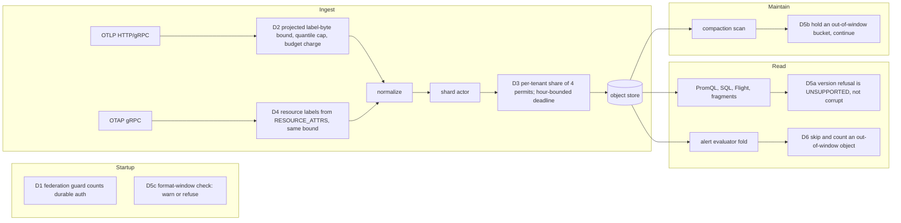

# ADR-2708: fixes for the P1 findings of the 0dab65b6 due-diligence review

Status: Accepted (2026-10-09). Issue #2708 (epic). Stage 0 was skipped: this
epic makes no performance claim. The one resource figure it relies on is
measured: a 3.75 MiB OTLP gauge request and a 15.6 MiB classic-histogram
request each OOM-killed a 2 GiB container of the published 0.23.0 image
(#2710).

No persistent format changes. RSEG, RLOG and RSPAN bytes, commit records,
catalog objects, the object key layout and the `ravel-series-v1` canonical
identity bytes are unchanged. `proto/ravel/queryfrag.proto` already carries
the `UNSUPPORTED` code decision 5 uses. OTAP series identities change only
because their input gains the resource labels the OTLP path already derives
(decision 4).

## Context

An independent review at 0dab65b6 (v0.23.0-2) ruled six defects P1 after an
adversarial second pass. Each issue carries the review's evidence, scenario
and proving test:

| Issue | Defect |
|---|---|
| #2709 | The federation startup guard does not see durable `sys/auth` tenancy, so an unmapped `--remote-cluster` serves another tenant's series |
| #2710 | OTLP ingest admits a request by point count, while normalization deep-copies label prefixes per point, so one small request can OOM a shared gateway |
| #1921 | One flush permit per shard actor is shared by every tenant, so a throttled tenant times out its neighbours' strict writes |
| #2711 | OTAP metrics ingest drops resource identity, so series from different services merge |
| #2712 | A bulk-format bump makes a signal's history unqueryable, the refusal reads as corruption, compaction stalls on the old input, and nothing reports it at startup |
| #2713 | Alert transitions are RLOG objects, so an RLOG bump stops alert evaluation for affected tenants |

The review also found a P2 that shares #1921's code: a flush queued for the
shard permit re-derives its lifetime at grant (`crates/ravel-ingest/src/shard.rs:2565-2567`)
while its ingest hour stays pinned at flush open (`:2260`), so it can publish
into an hour the catalog has sealed (review ids C-01, A-F1). Combined with
retention, those buffered rows can be deleted inside the retention window.

Project policy binds two decisions. Before v1.0 there is no backward
compatibility constraint, so a refused flag spelling or a changed series
identity needs a changelog fragment, not a migration. And the pre-1.0 format
posture (ADR-0531, ADR-0066 decision 1) is forward-only; the N/N-1 reader
window is #16 task T11, scheduled for v1.0, and stays out of this epic.

## Where each decision sits

## Decisions

### D1. Durable `sys/auth` tenancy counts as a dynamic resolver (#2709)

`ensure_federation_tenant_mapping` (`services/ravel-server/src/lib.rs:361-367`)
gains the fact that durable auth is installed, computed in `main.rs` by one
shared helper, `durable_auth_enabled(mode, deployment_key_present)`, which is
also the predicate `start()` uses to append `DurableBearerResolver`
(`lib.rs:2463-2491`). `dynamic_resolver_reason` (`lib.rs:244-273`) gains an
arm naming it. On a keyed bucket in All, Gateway or Query mode, an unkeyed
`--remote-cluster` is therefore refused at startup, and the "mapping can never
fire" check (`lib.rs:409`) no longer refuses `tenant=<durable-only tenant>`
(review id O-R1), because that check already keys on `dynamic_resolver_reason`.

Behaviour change: the unkeyed single-tenant spelling is refused on every keyed
bucket; `tenant=` is required there. Changelog `changed` fragment.

### D2. OTLP requests are bounded by projected resolved-label bytes (#2710)

Before normalization allocates anything, one read-only pass computes the
bytes normalization would build: per resource, the resource-label prefix; per
point, `multiplicity x (prefix + name + attribute bytes + per-label overhead)`,
where multiplicity is 1 for gauges and sums, `bounds + 3` for classic
histograms and `quantiles + 2` for summaries, and a run of consecutive points
with identical raw attributes counts once (the label memo's own hit rule).
A request over `max_resolved_label_bytes_per_request` is rejected whole. The
bound applies to all three OTLP signals, which share the defect class: logs
copy stream attributes per record and traces merge resource attributes per
span. Each signal projects what its own normalizer copies:

| Signal | Limits struct | Rejection variant | Projection unit | Partial-success field | Budget charge site |
|---|---|---|---|---|---|
| metrics | `IngestLimits` | `Rejection::ResolvedLabelBytesExceeded` | per point, as above | `rejected_data_points` | `crate::ingest::handle_export` |
| logs | `LogIngestLimits` | `LogRejection::ResolvedLabelBytesExceeded` | per record: resource and scope stream attributes plus record attributes, each with the per-label overhead | `rejected_log_records` | `crate::logs_ingest::handle_export_logs` |
| traces | `SpanIngestLimits` | `SpanRejection::ResolvedLabelBytesExceeded` | per span: merged resource attributes plus span attributes, each with the per-label overhead | `rejected_spans` | `crate::traces_ingest::handle_export_traces` |

The rule for every row is the same: the projection counts every attribute
byte the normalizer would copy for that unit, so a projection that undercounts
the normalizer's real allocation is a defect, not a tuning choice. The logs
and traces projections get no run-collapsing rule unless their normalizer
already shares the copy for identical consecutive records. The per-label
charge and what it rests on are stated exactly in the label-byte accounting
amendment below.

HTTP and gRPC reach each signal through the one handler named in its row.
OTAP metrics do not pass through `handle_export` (`services/ravel-server/src/otap_grpc.rs:298-302`);
D4 applies the same projection and charge in the OTAP handler before its own
normalization.

Defaults, compiled into the three limits structs like the existing request
limits, with the same value in each:
- `max_resolved_label_bytes_per_request = 256 MiB`. The heaviest legitimate
  full request is about 220 MB (100,000 points x about 2.2 KB of labels);
  typical collector batches of 10,000 points or fewer (about 22 MB at the
  same 2.2 KB per point) pass with about 12x margin.
- `max_summary_quantiles = 64` (metrics only), checked per point like `max_histogram_buckets`
  (160). Prometheus client summaries emit 3 to 5.

The projected bytes are also charged to the ingest byte budget at the
handler named in the table, before normalization, and released just before the router
takes its own charge, the same non-coexistence rule the decode charge follows
(`services/ravel-server/src/otlp_http.rs:736-740`). A shed returns the existing
429 / `RESOURCE_EXHAUSTED`. This covers HTTP and gRPC in one place.

The rejection is a whole-request partial success (HTTP 200 with
`rejected_data_points`), as `TooManyDataPoints` and `TooManyExplodedPoints`
already are. Changing all whole-request rejections to a 4xx is a separate
decision, not taken here.

### D3. Flush permits: four per shard, a per-tenant share, and an hour-bounded deadline (#1921, C-01)

Defaults: `--max-inflight-flushes` goes from 1 to 4. A new
`--max-inflight-flushes-per-tenant` defaults to `max(1, N - 1)`. The shard
actor keeps one FIFO semaphore and counts spawned, unreaped flushes per
(shard, tenant). An ordinary trigger for a tenant already at its share is
deferred through the existing refusal path (`shard.rs:2165-2199`). A tenant
with no flush in flight is never refused by the queued-flush cap
(`shard.rs:2037-2046`); its overshoot is at most one window per active tenant,
bounded by the byte budget as the memory-backstop exemption already is. One
hung tenant can then hold at most N - 1 permits, and a co-resident tenant's
flush takes the last one and acks in one healthy round trip. Two hung tenants
on one shard can still exhaust it; that is the aggregate bound ADR-1642
defends. All three actors (metrics, logs, spans) change together. The flag
is also a `RavelCluster` field.

Raising permits does not change resident buffered memory. A flush holds its
window and its admission charge from pin time, before it waits for a permit
(`crates/ravel-ingest/src/shard.rs:2475-2489`, `2509-2510`), so a window is
resident and charged whether it is queued or executing. What bounds the
number of resident windows is unchanged by this decision and has exemptions:

| Bound | Covers | Does not cover |
|---|---|---|
| `max_queued_flushes` (8, issue #1740) | ordinary triggers | backstop-crossing triggers (`crates/ravel-ingest/src/config.rs:610-620`), and, new here, a tenant with no flush in flight |
| ingest byte budget, `Bounded` (512 MiB default) | every charged window, exempt or not | encode-side memory |
| ingest byte budget, `Unlimited` (`--max-ingest-buffer-bytes 0`) | nothing | everything: resident memory is bounded only by stall length, as config.rs already documents for the backstop exemption |

The new exemption adds at most one window per active tenant on the shard, so
under `Unlimited` it grows with the tenant count. This ADR does not bound the
`Unlimited` case; an operator who disables the budget already accepts an
unbounded queue under a stall.

What permits bound is encode-side memory the budget does not see: the encoded
object and, for logs, the writer's resolved-row copy, held while the rows'
charge is still outstanding. Modelled upper bound under `Bounded`: at most 2x
the charged bytes of the flushes executing at once (1x for metrics and spans,
2x for logs), so at most 2x the budget (1 GiB at defaults) for any permit
count. One path sits outside that ratio. A native histogram charges 16 bytes a
point against up to `32 + 8 * (buckets + spans + custom_values)` object bytes
(`crates/ravel-ingest/src/config.rs:409-420`), and `target_bytes` gates only
an undeferred trigger: a deferred trigger keeps merging into the same buffer
(`config.rs:694-702`). D3 adds a deferral cause (a tenant at its share), so
such an object could grow with the stall's length until the buffer crosses
its backstop. D3 therefore adds an object-size backstop: a buffer whose
object estimate (`flush_est_bytes`) has reached 4x `target_bytes` (32 MiB at
defaults) fires as a backstop crossing does, exempt from both the per-tenant
share deferral and the queued-flush cap, so its object stops growing there
and waits for a permit with its size fixed. That bounds a deferred object at
about 4x `target_bytes` plus one batch on every signal. The 16-byte charge
itself is unchanged; charging a native-histogram point by its object
contribution changes when such a tenant sheds and is left to #2737, which
needs a measurement first. Charging the encode output to the budget was
rejected: a failed charge would drop rows a buffered write already
acknowledged, and a waiting charge parks a runtime thread.

Nothing consumes grant order: `writer_seq` is a sort tie-break
(`crates/ravel-catalog/src/catalog.rs:2666-2671`) and
docs/catalog-and-mvcc.md:647-649 forbids inferring completeness from it.

The deadline at grant becomes `min(now + max_flush_lifetime,
end(pinned hour) + max_flush_lifetime)`. A flush granted past that bound is
abandoned in the queue without a PUT and counted under a new reason. The
bound sits inside the maintain seal, `end(H) + max_flush_lifetime +
clock_skew_allowance` (65 minutes at defaults, the seal retention uses), and
inside the fold seal (80 minutes); the 5-minute skew margin covers a commit
PUT the store applies after the client gave up, since one attempt is bounded
by the 20 s request timeout.

This reverses part of #1739 deliberately. #1739 re-derived the deadline at
grant so a buffered flush queued behind a stall keeps its full lifetime and
its rows reach the store. That is still true while the wait stays inside the
pinned hour's bound. Past it, the trade is between a late publish into a
sealed hour (invisible to token-less queries, and deletable by retention with
no trace) and a counted abandon, which README and docs/consistency-model.md
already document for buffered mode ("a flush whose store calls exceed the
flush lifetime budget is abandoned, and it drops rows that are already
acknowledged"). The counted abandon wins. Strict writes are unaffected: their
10 s ack deadline expires long before. With the per-tenant share, a co-resident
tenant no longer waits behind another tenant's stall, so this path is left to
a tenant whose own prefix is failing. The test
`buffered_flush_queued_behind_a_stall_reaches_the_store_past_lifetime` keeps
its meaning inside the hour and gains a sibling that crosses it.

The --max-inflight-flushes help text (#1648) and the `s3.rs:683-697` comment
(review id DOC-FLUSH-1) are corrected in the same change to separate the two
stall modes. A timed-out create-if-absent PUT is not retried inside
object_store (a PUT is not idempotent there), so a pure hang holds a permit
about 101 s: five 20 s attempts plus backoff. A retryable status such as
`503 SlowDown`, the throttling case the flag documents, is retried inside
object_store regardless, so one Ravel attempt can take about 200 s
(`retry_timeout + request_timeout`) and five attempts approach 1000 s,
bounded first by the flush deadline. The s3.rs comment's figure, about 200 s
per logical operation (180 s `retry_timeout` plus one 20 s `request_timeout`),
is right for retryable statuses and stays; what changes is its claim that a
request timeout is retryable, which does not hold for a create-if-absent PUT.

### D4. OTAP decodes RESOURCE_ATTRS and builds resource labels with the OTLP builder (#2711)

The OTLP resource-label builder (`crates/ravel-otlp/src/normalize.rs:1672-1733`)
becomes a public, proto-independent function over `(key, value)` pairs; the
OTLP path calls it through a thin adapter so its output cannot change. The
OTAP normalizer reads the METRICS root's `resource.id` (delta-encoded per
record batch), decodes RESOURCE_ATTRS (`parent_id` is UInt16, quasi-delta),
builds the prefix once per resource id per batch, and prefixes it into every
point and exploded series. Rejections and the dropped-attribute count mirror
OTLP exactly (`TooManyResourceAttributes`, `ResourceAttributesDropped`,
`Grouped`). SCOPE_ATTRS is not read: OTLP ignores scope identity too, and
reading it would break parity. A null resource is an empty prefix, as OTLP's
`resource: None` is. The D2 bound applies to OTAP with the same projection.

Two defects in the same attribute decoder are fixed with it: `flatten_attrs`
accepts only plain `StringArray` keys and values, while the OTel Arrow spec
allows dictionary encoding, so a dictionary-encoding producer loses every
data-point attribute silently; and the attribute type constants must be
checked against the vendored spec and a real exporter's output before the
resource decoder reuses them.

Behaviour change: OTAP points that carried resource attributes now get `job`,
`instance` and allowlisted labels, so they start new series; earlier OTAP
series keep their old identity. Changelog `fixed` fragment.

### D5. A format crossing is loud and contained, not reversible (#2712)

No reader window is widened (owner policy, ADR-0531; #16 T11 owns that).
Instead:

a. **Classification.** `UnsupportedVersion` becomes its own variant in the
   metrics, logs and spans fetch errors instead of being wrapped as
   corruption (`crates/ravel-sql/src/logs_scan.rs:3476-3488`,
   `crates/ravel-query/src/fetcher.rs:3286-3291`, `span_fetcher.rs:158-163`,
   `log_fetcher.rs:7720-7725`, `engine.rs:2601-2606`). Clients get a
   distinct message ("stored object version N is outside this build's reader
   window; it needs migration"), PromQL answers 422 (`ApiError::Unsupported`),
   SQL reports it through its client message, and distributed fragments use
   `Code::Unsupported`.
b. **Compaction.** An out-of-window input makes compaction hold that bucket
   (`CompactionOutcome::HeldOutOfWindow`), count it, and continue to later
   hours, instead of failing the whole shard scan (`crates/ravel-maintain/src/scan.rs:79`).
   The scan cursor does not advance past a held bucket: the advance stops at
   the hour before the first held hour, even when later hours compact in the
   same pass (today `highest_done` takes every later completed hour).
c. **Startup check.** `--format-window-check {warn|refuse}`, default `warn`,
   reads each known tenant's catalog HEAD entries (`segment_format_version`)
   and the commit records of unsealed hours for every RLOG, RSPAN and RSEG
   signal including alerts and audit, and reports the count per (signal,
   version) outside the reader window; `refuse` exits non-zero naming the
   signal and version. No bucket listing. Advisory: the version field is a
   writer stamp, so the check is a report, not a proof. Default `warn`
   because a false refusal is an outage.
d. **Release notes.** A guard script fails a change to a reader `VERSION`
   constant unless a changelog fragment names every signal that format
   carries (RLOG: logs, alerts, audit). The format-change skill points at it.

### D6. The alert fold skips and counts an out-of-window object (#2713)

In the alert history fold (`services/ravel-server/src/alerting.rs:1888`),
`LogSegError::UnsupportedVersion` skips that object and increments
`ravel_alert_history_records_skipped_total{reason="unsupported_version"}`
with a warn line naming the tenant. Corruption and store errors still abort
the fold and report `history_unavailable`. The affected identity keeps its
memo copy, or is absent on a cold fold; the worst outcome is a duplicate
notification for a still-live condition, inside the at-least-once contract
(ADR-0043), never a missed page. The memo advances, the object falls below
the watermark, and retention deletes it on its normal schedule.

The `RavelAlertPipelineBlocked` description (`deploy/prometheus/ravel.rules.yaml:313-318`)
and its reprint in docs/guides/observability.md are corrected: the liveness
gauge is process-wide, so a single stalled tenant does not trip
`RavelAlertLoopStalled`. A per-tenant liveness signal is out of scope: ADR-0044
allows `tenant_hash` only for configured tenants and folds every other tenant
into `tenant_hash="other"`, so a liveness gauge on that label would hide a
stall in exactly the tenants it does not name. It needs its own design.

## Rejected alternatives

- **D1: query-time rule** (an unkeyed remote serves only the static tenants
  known at startup). It silently drops the remote for a durable-only tenant
  with no partial marker, does not fix O-R1, and moves a startup contract into
  a hot path in a second crate. **Counting `sys/auth` entries at startup**
  fails because onboarding needs no restart.
- **D2: structural label sharing** (one `Arc` of the prefix across exploded
  series, a larger memo). It touches `LabelSet` across ravel-types, ingest,
  OTAP, remote write and the segment writers, must keep the canonical series
  bytes identical, and does not close the gauge case: a k-cycle of attribute
  sets defeats a k-1 entry memo. **Copying the Remote Write 2.0 budget**
  (`crates/ravel-remote-write/src/rw2.rs:121-137`): it is incremental and 1 GiB
  per request, larger than the container that died.
- **D3: a per-tenant permit alone** changes nothing at N = 1. **Releasing the
  permit across backoff** still makes a co-resident flush wait one 20 s
  attempt. **Re-pinning the hour at grant** (the review's first suggestion):
  re-stamping `created_unix_ns` at grant reorders last-write-wins between one
  writer's flushes (an older flush granted later would win over newer data),
  and moving only the bucket breaks the bound between a record's bucket and
  its data that the read side relies on. The abandon is the documented
  buffered contract and is counted.
- **D4: reading SCOPE_ATTRS** breaks OTLP parity.
- **D5: a durable "oldest version present" field** in the provisioning record
  is a persistent format change, and deletes could not lower it correctly.
  **A retirement verb** that deletes held objects is a durability-tier
  change and needs its own ADR; D5c makes the held population visible, which
  is the pre-1.0 need. **An N/N-1 window** is #16 T11.
- **D6: a framed alert-record format** that survives RLOG bumps is a new
  persistent format with a second decoder, and does not help audit records.
  **Keeping the previous RLOG reader** for alerts reverses the posture and the
  old reader code no longer exists after a bump.

## Consequences

- Behaviour changes, each with a changelog fragment: an unkeyed
  `--remote-cluster` is refused on keyed buckets (D1); oversized OTLP requests
  get a whole-request partial success (D2); the default flush concurrency is 4
  with a per-tenant share of 3, and a buffered flush whose queue wait crosses
  its hour's bound is abandoned and counted (D3); OTAP series with resource
  attributes start new series (D4); version refusals answer 422 /
  `UNSUPPORTED` instead of 500 / corrupt, and startup warns about
  out-of-window objects (D5); alert evaluation continues past an out-of-window
  object (D6).
- A shard's queued-flush depth is no longer capped at `max_queued_flushes`
  (8, issue #1740) alone: a tenant with no flush in flight bypasses the cap,
  and so does a buffer at its object-size backstop, as a buffer at its memory
  backstop already does. Depth grows by one window per active tenant plus the
  backstop windows, and under a bounded budget the 512 MiB ingest byte budget
  bounds the total (D3).
- A deferred flush's object is capped at about 4x `target_bytes` (D3), which
  bounds the native-histogram case the 16-byte charge leaves uncounted; the
  charge itself is #2737.
- A held bucket (D5b) pins the scan cursor for its (tenant, signal, shard)
  until retention removes it, so every maintenance pass for that key re-walks
  the hours after it instead of resuming from the cursor. The cost is bounded
  by the retention window; no migration or retirement path shortens it before
  1.0.
- Amendment pointers: ADR-1642 (D3), ADR-0016 and ADR-0098 (D2), ADR-0011
  (D4), ADR-0043 (D6).
- Not in scope: the review's P2 and P3 findings; per-tenant alert liveness;
  a retirement verb; the N/N-1 window; the same label amplification in Remote
  Write beyond its existing budget.

## Tasks

Waves share no crate and no file. A high-risk task rides alone. Every task
that adds an enum variant or a required field owns the crates that match or
construct it (checked with callers: `Rejection` reaches ravel-otap,
ravel-remote-write and ravel-cli; fetch-error variants reach ravel-server;
`CompactionOutcome` reaches ravel-server, ravel-cli, ravel-sim and
ravel-bench; ingest config fields reach ravel-cli, ravel-bench and the
operator), which is why the waves are serial.

| Task | Ticket | Crates | Risk | Wave |
|---|---|---|---|---|
| A. federation guard | #2709 | ravel-server (+ ravel-query doc comments) | low | 1 |
| I. format-bump release-note guard | #2725 | scripts, skill | low | 2 |
| B. OTLP projected label-byte bound, quantile cap, budget charge | #2710 | ravel-otlp, ravel-server, ravel-otap, ravel-remote-write, ravel-cli | medium | 2 |
| C. per-tenant flush share, default 4, hour-bounded deadline | #1921 | ravel-ingest, ravel-server, ravel-operator, ravel-cli, ravel-bench | high | 3 |
| D. alert fold skips out-of-window objects | #2713 | ravel-server, ravel-logseg (test helper) | medium | 4 |
| E. OTAP resource identity, OTAP bound, dictionary attributes | #2711 | ravel-otlp, ravel-otap, ravel-server | high | 5 |
| F. version refusal classified as unsupported | #2722 | ravel-query, ravel-sql, ravel-server | medium | 6 |
| G. compaction holds an out-of-window bucket | #2723 | ravel-maintain, ravel-server, ravel-cli, ravel-sim, ravel-bench | high | 7 |
| H. startup format-window check | #2724 | ravel-server | medium | 8 |

Every task except I carries an end-to-end test through a real server entry
point (startup, the OTLP or OTAP handler, the alert loop, a query route or a
maintain tick).

## Amendment (2026-10-10): label-byte accounting for D2 (#2710)

<!-- amendment-applies: sections="D2. OTLP requests are bounded by projected resolved-label bytes (#2710)" pointer="label-byte accounting amendment" -->

D2 says the projection counts every byte the normalizer copies. This
amendment states how, as implemented in `crates/ravel-otlp/src/label_projection.rs`.

- **The per-label charge.** Every label or attribute a normalizer keeps is
  charged `label_bytes(name_len, value_len)`: the element slot
  (`RESOLVED_LABEL_OVERHEAD_BYTES`, 64 bytes, at least the 48 of a metric
  `Label` or span attribute pair and the 56 of a log attribute pair) plus
  the name length
  plus the value length. Every projection uses this one formula, including
  the `le="+Inf"` label of a classic histogram.
- **Lengths are allocations.** The formula charges lengths, so every name
  and value string a normalizer keeps is held at exact capacity: each passes
  through `exact_capacity`, and the resource-prefix, scope and nested
  attribute vectors are shrunk when built. Without it an integer value
  formatted by `to_string` keeps about 20 bytes whatever its length, and a
  float such as `1e260` keeps a 520-byte buffer for 261 bytes.
- **Reserved slots for empty values.** The gauge, sum and
  exponential-histogram paths size the label vector from the raw attribute
  count, then drop empty-valued attributes, so each dropped attribute still
  occupies a slot. Each is charged `RESOLVED_LABEL_OVERHEAD_BYTES`.
- **Two unfilled slots per exploded point.** A classic histogram or summary
  point's `_count` and `_sum` series each reserve an `le` or `quantile` slot
  and never fill it, so each exploded point is charged two more slots.
- **ADR-0051.** The whole-request rejection is counted under a new eighth
  admission reason, `reason="resolved_label_bytes"`, recorded in ADR-0051's
  own amendment.

Property tests in `normalize.rs`, `logs_normalize.rs` and
`traces_normalize.rs` check, per metric, per log record and per span, that
every kept name and value has capacity equal to its length and that the
projection is at least what normalization allocated.
