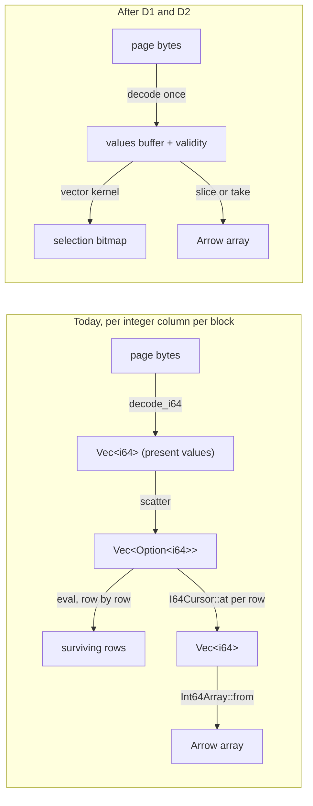
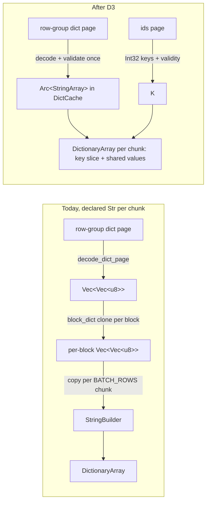

# ADR-2773: build each column once on the logs hot path

Status: Accepted (2026-10-10). Issue #2773 (epic). Stage 0 is measured:
the review sweep of 2026-10-10 (main e20cd8316, fresh c6a.4xlarge, real
S3) for wall and CPU, and a frame-pointer CPU profile at main bd5d884ea on
the same tenant (#2773, P1 and P1b comments). The hot path did not change
between the two commits. Every `file:line` citation below is read at main
154c9477f.

Statement sets named once and used throughout: **I** = {q2, q3, q4, q8,
q30}, the integer scans; **S** = {q11, q12, q13, q25, q26, q27}, the
declared-string scans; **L** = {q21, q22, q23, q24}, the `LIKE`
statements over `URL` and `Title`. **N** = {q2, q3, q4, q8, q11, q12,
q20, q25, q26, q27, q30} is the review's narrow set of 11, the set every
"narrow" figure and band in this document is over; q13 is in S but not in
N, because the review sweep did not list it as narrow. **B** = N plus
q23, q29 and q33, the 14 statements P1b repeated with the restart
procedure. q20 (`UserID = ...`, a point lookup at 2.0 CPU-s) is in N,
so inside the set N wall band, but in no CPU band set, and the
derivation below does not model it: its shares have a different shape
(page decode 35.6%, segment open 5.4%) because the skip index does most
of its work, and it is 4% of the set N wall sum (0.429 of 10.41 s).

No persistent format changes. RLOG v5 bytes, the page encodings, the
directories, commit records, catalog objects and the object key layout are
unchanged. Every decision here is reader and scan code. ADR-0099 decision
5 (a declared `Str` column is `Dictionary(Int32, Utf8)` on every path) and
ADR-0090 decision 7 (a wrong-variant record value reads NULL) hold. This
ADR carries ADR-2121 D4 (#2153) and re-scopes it, as D4's own sequencing
clause asked once the v5 decoders and the reader rewrite had landed.

## Context

Ravel's logs SQL path reads an RLOG v5 block into a `DecodedBlock`, then
builds Arrow arrays from it. A `COUNT(*)` with one integer predicate over
100 million rows (ClickBench q2) costs 6.2 CPU-seconds warm, about 60 ns
per row for one column. The review ranked that cost third of thirteen and
modelled 5 to 10x on narrow statements from the profile taken for ADR-2121
at main 2257dced2. That profile predates ADR-2121 D2 and D3, RLOG v5 and the
reader rewrite, so this ADR measured again before deciding anything.

### Baseline (review sweep, 2026-10-10)

Box i-09058c024a698311b, c6a.4xlarge (16 vCPU, 32 GB), main e20cd8316,
tenant main-main-affb0260-202610021015 on `s3://ravel-clickbench-e28771`
(219 compacted RLOG v5 objects, 7.74 GB, 99,997,497 rows), `--disable-fold`,
derived defaults (32 partitions, 32 GET permits, 7.5 GB fetch cache). Warm
is the best of two runs after a true-cold run with a server restart per
statement. Raw data: `s3://ravel-clickbench-e28771/de/deA.tgz`.

| Statement | Warm wall (s) | Server CPU (CPU-s) | CPU-s / wall |
|---|---|---|---|
| q2 `COUNT(*) WHERE AdvEngineID <> 0` | 0.700 | 6.10 | 8.7 |
| q3 `SUM, COUNT, AVG` over two I64 columns | 0.817 | 8.01 | 9.8 |
| q4 `AVG(UserID)` | 0.833 | 8.06 | 9.7 |
| q8 `AdvEngineID` GROUP BY | 0.688 | 6.24 | 9.1 |
| q11 `MobilePhoneModel`, COUNT DISTINCT | 1.142 | 12.24 | 10.7 |
| q12 `MobilePhone`, `MobilePhoneModel`, COUNT DISTINCT | 1.280 | 13.87 | 10.8 |
| q20 `UserID = ...` | 0.429 | 2.01 | 4.7 |
| q25 `SearchPhrase` ORDER BY EventTime LIMIT 10 | 1.259 | 14.28 | 11.3 |
| q26 `SearchPhrase` ORDER BY SearchPhrase LIMIT 10 | 1.238 | 13.94 | 11.3 |
| q27 `SearchPhrase` ORDER BY both | 1.263 | 14.17 | 11.2 |
| q30 90 `SUM`s over `ResolutionWidth` | 0.764 | 6.66 | 8.7 |
| set N (11) | 10.41 | 105.6 | |
| q23, q29, q33 (heavy) | 4.41, 5.09, 4.22 | 53.3, 75.7, 56.2 | 12.1, 14.9, 13.3 |
| suite (43) | 72.6 | 891 | |

Every statement also pays a serial floor outside the scan: resolve 94 to
167 ms plus audit 46 to 89 ms (ADR-2677, ADR-0062). On q2 that floor is
about 0.16 s of the 0.70 s, so the scan phase itself keeps about 11 of 16
cores busy, not the 8.7 the whole-statement ratio suggests. The idle share
is the floor, which is #2677's, not decode parallelism.

### Profile (P1, main bd5d884ea, 2026-10-10)

Box i-0bcc0ae976f004d15, same instance type, AMI and tenant, `ravel-server`
built `--release --features sql` with `-C force-frame-pointers=yes`. One
cold pass over the 43 statements, then per statement two warm runs and a
third under `perf record -a -g -F 499`, folded with `inferno-collapse-perf`
filtered to the server pid. Sampled CPU-seconds matched `/proc/<pid>/stat`
within 0.96 to 1.06 on every statement above 0.5 CPU-s (band B1: at least
0.90; q1 and q41, at 0.3 and 0.2 CPU-s, sit below the threshold and are not
read). State differs from the baseline in one way that matters: the server
stayed up across the suite, and the 7.5 GB fetch cache does not hold the
7.74 GB corpus, so statements whose columns had been evicted re-fetched
from S3 during their warm runs (q11 and q12: fetch frames 18 to 21% of
samples, warm 1.84 s against the baseline's 1.14 s). Set N's warm
CPU sum reproduced at 119.5 CPU-s (band B2b: 90 to 121) and its wall sum
at 12.26 s, outside band B2 (8.9 to 12.0 s) by the two re-fetched
statements; the other nine are within 11% of the baseline. The shares
below are of the server's samples; the re-fetch shows up only in the two
statements' fetch and kernel frames, which are not in any column. P1b
repeated set B with the baseline's restart-per-statement procedure: set N
warm wall sum 10.84 s (baseline 10.41, band 8.9 to
12.0), warm CPU sum 108.1 CPU-s (baseline 105.6), q11 1.18 s and q12 1.35 s
(baseline 1.14 and 1.28), and every share within 3 points of P1's. The
baseline reproduces; the P1 shares stand.

Inclusive shares of statement CPU (a frame counts once per stack):

| Statement | Scan on the read gate | `decode_block` | Page decode (varint, GCD, bit-unpack, bitmap) | Scatter into `Vec<Option<_>>` | Block predicate, row by row | Arrow build | Declared `Str` build | UTF-8 validation | zstd | Segment open (postings, bloom, skip index) | DataFusion | Cast to `Utf8View` |
|---|---|---|---|---|---|---|---|---|---|---|---|---|
| q2 | 85.5 | 69.2 | 20.9 | 13.9 | 17.2 | 10.6 | 0.2 | 0.0 | 3.6 | 1.2 | 9.4 | 0.0 |
| q3 | 86.7 | 66.0 | 20.9 | 14.1 | 13.4 | 16.3 | 0.1 | 0.0 | 5.7 | 1.2 | 9.2 | 0.0 |
| q4 | 86.3 | 74.0 | 30.3 | 10.4 | 12.8 | 8.0 | 0.1 | 0.0 | 9.9 | 1.3 | 7.4 | 0.0 |
| q8 | 84.6 | 67.6 | 20.2 | 12.9 | 17.2 | 10.5 | 0.1 | 0.1 | 4.4 | 1.2 | 0.5 | 0.0 |
| q6 `COUNT(DISTINCT SearchPhrase)` | 54.3 | 34.4 | 6.9 | 4.3 | 5.1 | 20.0 | 21.7 | 7.1 | 5.5 | 0.7 | 39.4 | 5.8 |
| q11 | 63.3 | 44.4 | 17.2 | 6.4 | 6.5 | 17.0 | 16.7 | 0.4 | 5.8 | 0.7 | 4.1 | 0.5 |
| q12 | 67.1 | 45.7 | 16.1 | 8.5 | 6.2 | 19.1 | 14.3 | 0.3 | 5.8 | 0.7 | 4.3 | 0.4 |
| q13 `SearchPhrase` GROUP BY LIMIT 10 | 62.1 | 39.5 | 7.5 | 5.3 | 5.1 | 24.8 | 27.4 | 8.2 | 6.6 | 0.7 | 22.7 | 1.2 |
| q20 | 83.9 | 74.2 | 35.6 | 9.3 | 11.8 | 5.6 | 0.1 | 0.0 | 8.5 | 5.4 | 0.2 | 0.0 |
| q25 | 82.5 | 53.6 | 10.3 | 7.7 | 6.7 | 29.2 | 33.7 | 10.5 | 9.6 | 0.6 | 3.0 | 0.0 |
| q26 | 81.7 | 53.5 | 10.7 | 6.8 | 7.7 | 28.7 | 34.5 | 10.5 | 10.0 | 0.7 | 2.7 | 0.0 |
| q27 | 82.2 | 52.4 | 10.0 | 7.1 | 7.8 | 29.9 | 35.0 | 10.9 | 8.7 | 0.7 | 3.2 | 0.0 |
| q30 | 86.4 | 71.1 | 23.3 | 11.6 | 17.0 | 9.3 | 0.1 | 0.1 | 6.7 | 1.6 | 7.4 | 0.0 |
| q21 `URL LIKE '%google%'` | 72.1 | 47.7 | 7.1 | 2.9 | 3.7 | 22.8 | 28.5 | 8.0 | 16.0 | 0.5 | 12.6 | 0.0 |
| q22 `URL LIKE`, `SearchPhrase` GROUP BY | 74.7 | 45.5 | 5.9 | 3.1 | 3.0 | 27.6 | 34.3 | 10.9 | 15.0 | 0.3 | 4.8 | 0.0 |
| q23 `Title LIKE`, MIN(URL), MIN(Title) | 89.9 | 49.2 | 8.0 | 3.1 | 1.9 | 39.7 | 45.7 | 20.6 | 18.1 | 0.2 | 4.2 | 0.0 |
| q24 `URL LIKE`, `SELECT *` ORDER BY EventTime LIMIT 10 | 70.9 | 46.4 | 7.1 | 2.8 | 3.6 | 23.3 | 27.8 | 7.7 | 15.3 | 0.4 | 5.8 | 0.0 |
| q29 `REGEXP_REPLACE(Referer)` | 22.8 | 15.0 | 2.5 | 1.0 | 1.3 | 9.3 | 9.1 | 2.7 | 5.1 | 0.1 | 66.1 | 4.2 |
| q33 `WatchID, ClientIP` GROUP BY | 23.4 | 18.1 | 7.2 | 3.5 | 1.9 | 5.0 | 0.0 | 0.0 | 1.7 | 0.2 | 48.4 | 0.0 |
| q34 `URL` GROUP BY | 28.0 | 18.4 | 2.8 | 1.1 | 1.3 | 12.4 | 11.1 | 3.0 | 6.0 | 0.2 | 58.6 | 4.6 |
| q35 `1, URL` GROUP BY | 28.7 | 19.0 | 2.7 | 1.1 | 1.5 | 12.3 | 11.2 | 3.1 | 6.4 | 0.2 | 57.8 | 4.5 |
| set I, pooled | 86.0 | 69.7 | 23.4 | 12.5 | 15.3 | 11.0 | 0.1 | 0.0 | 6.3 | 1.4 | 6.9 | 0.0 |
| set S, pooled | 71.8 | 47.4 | 12.2 | 6.9 | 6.5 | 24.1 | 25.8 | 6.2 | 7.5 | 0.7 | 7.3 | 0.4 |
| set L, pooled | 78.5 | 47.4 | 7.1 | 3.0 | 2.9 | 29.8 | 35.6 | 12.9 | 16.3 | 0.3 | 6.3 | 0.0 |
| suite (43), pooled | 50.5 | 33.7 | 8.2 | 4.1 | 3.6 | 16.5 | 15.7 | 5.0 | 7.5 | 0.4 | 33.6 | 1.9 |

What the profile settles:

- **Integer scans are bound by three copies of each value, not by one.**
  On q2 the page decoder (`decode_i64`, `decode_gcd_i64`, `unpack_bits`,
  `get_uvarint`) is 21% of CPU, which is the format's cost. The scatter of
  that vector into `Vec<Option<i64>>` against the presence bitmap
  (`block.rs:1161`) is 14%. The Arrow build, which walks that vector again
  through `I64Cursor::at` into a `Vec<i64>` and then an `Int64Array` (the
  timestamp arms of `build_columnar_batch`, `logs_scan.rs:7141-7149`, and
  the `I64` arm of `build_declared_columnar_array`, `logs_scan.rs:6717`),
  is 11%. The
  pushed content predicate is evaluated row by row inside `decode_block`
  through `i64_at`, an `Option` chain and a `Result` branch per row
  (`reader.rs:1579`, `eval`): 17%. On q2 that predicate is the query's
  time window (`Predicate::TsRange`, which `log_fetcher.rs:3511` pushes on
  every logs scan) and the stream set; `scan_blocks` intersects the window
  with the skip index to choose candidate blocks (`reader.rs:486-529`) and
  then re-tests every surviving row against the same window, although the
  skip index already holds each block's `min_ts` and `max_ts`
  (`reader.rs:649-650`). With the sweep's whole-corpus window every block
  is wholly inside it, so the 17% buys nothing. Together the scatter, the
  Arrow build and the per-row predicate are 41.7, 43.8, 31.2, 40.6 and
  37.9% of q2, q3, q4, q8 and q30 (38.8% of set I pooled).
- **String statements are bound by the dictionary build, once per chunk.**
  `build_declared_str_columnar` (`logs_scan.rs:6793`) copies the page
  dictionary into a new `StringBuilder` on every `BATCH_ROWS` chunk
  (`logs_scan.rs:6815-6821`), after `block_dict` has already cloned every
  referenced entry per block (`block.rs:1294`), and builds the keys twice.
  That is 14 to 17% of q11 and q12, 27% of q13 and 34 to 35% of q25 to
  q27, where the column is high-cardinality and comes from plain pages:
  there the builder validates every cell's UTF-8 (8 to 11%) and appends
  it to an identity dictionary with one entry per row
  (`logs_scan.rs:6865-6901`). Set L spends 28 to 46% in the same build
  (35.6% pooled), of which UTF-8 validation of the long cells is 8 to 21%
  (q23).
- **The cast of dictionary keys to `Utf8View` before the aggregate is not
  a lever.** `DictionaryGroupKeysAsViews` costs 0.4 to 1.2% on q11, q12
  and q13, 4.5 to 4.6% on the `URL` group-bys q34 and q35, 4.2% on q29
  and 5.8% on `COUNT(DISTINCT SearchPhrase)`. DataFusion's own hashing
  is the rest of the aggregate side (23 to 58% on q6, q13, q34, q35).
- **Segment open is not a lever warm.** Postings, bloom and skip-index
  parsing per partition, and the second decode of the directories on the
  non-A1 ranged path, are 0.1 to 1.7% on every statement except q20,
  where they are 5.4%: a point lookup at 2.0 CPU-s does little else, so
  the fixed per-partition parse is a larger share of a small number.
  Set I pooled is 1.4%.
- **The review's 5 to 10x for narrow statements does not survive the
  profile.** With the format's own decode at 20 to 30% of a set I
  statement and the serial floor at about 0.16 s of its wall, the ceiling
  on q2 is about 1.5x in CPU (the removable 42% less about 6% that the
  slice and the kernel still cost) and about 1.4x in wall. Decisions and
  bands below are set from these shares, not from the review's model.

### Row path (P2, generated logs tenant, main bd5d884ea)

ClickBench never takes the row path (every column is declared, no block
carries an `attrs_raw` page), so the row path was profiled with
`sql_latency_bench --generate --store memory` built with frame pointers,
2,000,000 records with 16 attribute keys of 7 values each, one statement
per run, three runs, under `perf record -g -F 499` (#2773, P2
pre-registration and results comments). CPU per row is the bench's
`cpu_ms` over the rows scanned; shares are within the query-side subtree.

| Statement | Path (from the explain plan) | CPU per run (ms) | Record rebuild (`rebuild_record_projected`, `next_block`) | Merged clones (`merged_log_attrs`) | `MapBuilder` and `attr_value_to_string` | Per-cell `AttrValue` on per-key columns |
|---|---|---|---|---|---|---|
| `SELECT attrs, body WHERE body LIKE '%timeout%'` | row path | 19,260 to 20,220 | 48.1% | 21.2% | 1.8% | |
| `SELECT attrs['attr_1'], count(*) GROUP BY 1` | columnar, per-key `Utf8` | 310 to 340 | | | | 27.0% |
| `SELECT count(*) WHERE attrs['attr_2'] = 'v3'` | columnar, per-key | 300 to 310 | | | | 20.2% |
| `SELECT attr_0, count(*) GROUP BY attr_0`, `attr_0` declared | columnar, `Dictionary` | 220 to 250 | | | | 4.0% |
| `SELECT count(*) WHERE body LIKE '%timeout%'` | columnar | 240 to 260 | | | | |

The row path costs about 10 µs per row against 0.17 µs on the columnar
per-key path over the same rows (band P2-1: at least 5x; measured 61x).
Within it the `LogRecord` rebuild and the merged attribute clones are 48%
and 21% of scan CPU (band P2-2: at least 40%); the map build itself is
under 2% (band P2-2b expected 10 to 40%; the cost is in the per-row
vectors, not in Arrow). On the columnar per-key path the `AttrValue` per
cell is 20 to 27% (band P2-4: 10 to 40%). The declared dictionary column
costs 0.70 of the per-key `Utf8` column (band P2-5 expected at most 0.6;
not a miss at the 0.8 line; on 7-value keys the dictionary's saving is
small). In the overflow arm (50,000 records, 1,100 keys, so every block
carries an `attrs_raw` page and the per-block fallback of #1769 sends
every block to the row path) a per-key `GROUP BY` costs 49 µs per row
(band P2-3: at least 5x the columnar per-key path; measured 300x), with
the record rebuild at 43% and the merged clones at 48%: once a block falls
back, every attribute of every row is rebuilt and cloned, whatever the
statement selected.

## Decision

### D1. An integer page decodes once, into the Arrow buffer

The page decoder writes a column's values and validity for a whole block
directly into the buffers an Arrow `PrimitiveArray` is built from: one
`Vec<i64>` (or `MutableBuffer`) of block length and one validity bitmap,
filled in the same pass that reads the varints and the presence bitmap.
There is no `Vec<i64>` of present values followed by a scatter, and no
cursor walk into a second `Vec<i64>` at build time.

- `DecodedBlock` holds an integer column as `(Arc<[i64]>, NullBuffer)`
  (or the Arrow array itself) instead of `Vec<Option<i64>>`. `ColumnRef`
  (tag 11) shares the `Arc` instead of cloning the vector
  (`block.rs:1278`).
- `ColumnarBlockView` exposes the column as a slice plus validity, and the
  declared `I64` arm of `build_declared_columnar_array` slices it by the
  surviving-row set (a `take` kernel or a contiguous slice when every row
  survives) instead of appending cell by cell. The timestamp column
  follows the same route. `Bool` and `F64` columns are not changed by this
  ADR; their arms keep the cursor API, which stays available.
- The row path (`next_block`, `rebuild_record_projected`) reads the same
  buffer through the existing cursor, so its results do not change.
- Semantics are pinned by a property test: for generated blocks over every
  integer encoding (Plain, Constant, Rle, DeltaZigzag, DoubleDelta,
  ForBitpack, GCD, ColumnRef), with NULLs and surviving-row subsets, the
  new array equals the one the per-cell path builds on the same block.
  The existing codec property tests keep pinning the per-value decode.
- This is #2153 (ADR-2121 D4) as the special case where the presence-shaped
  vector is the Arrow buffer itself. The task commit carries `Refs: #2153`.

### D2. A pushed-down block predicate is evaluated as a vector kernel

The exact content predicate the SQL scan pushes into `scan_blocks`
(`Predicate::And` over `TsRange`, `StreamIn`, `HasWord` and `Equals`,
`reader.rs:1579`) is evaluated per block, not per row:

- An arm the block's skip-index entry already satisfies is dropped for
  that block before any row is read: a `TsRange` that contains the block's
  `[min_ts, max_ts]`, and a `StreamIn` whose set contains every value in
  the block's `[min_stream_ref, max_stream_ref]` (the entry holds only
  that range, `skip_index.rs:43-44`; candidate selection tests it for any
  overlap, `refs_intersect`, which is not enough to drop the arm). A
  `StreamIn` the range test cannot drop is evaluated as a kernel over the
  decoded stream-ref column. A block with no arm left keeps every row, and
  no `eval` call is made.
- The arms that remain are evaluated as vector kernels over the decoded
  column buffer from D1 (`TsRange` and `StreamIn` over the timestamp and
  stream-ref columns, `Equals` over the field's column, `HasWord` over the
  field's cells), producing one selection bitmap per block instead of one
  `Result<bool>` per row through `i64_at` and an `Option` chain.
- The predicate language and its semantics do not change: an absent cell
  does not match, exactly as `i64_at` and `field_text` treat it today, and
  the resource/scope fallback stays untouched because the block predicate
  never consulted it. `NumRange` stays prune-only (ADR-0095 decision 6).
- An arm on an attribute that has no FIELD_DIR column of the resolved
  type reads the row's `attrs_raw` cell today (`field_text` and `equals`
  fall through to `overflow_attr`, which decodes the cell and scans it for
  the key, `reader.rs:1624-1645`, `1667-1673`, `1683-1694`). That arm
  stays per row, over the rows the other arms kept, with the same
  decode-and-scan; vectorizing the overflow page is #1769's territory and
  not this ADR's. A block with no overflow page never reaches it.
- Blocks whose selection is empty are skipped before any Arrow build, as
  today.
- Pinned by a property test that compares the surviving-row set of the
  block evaluation with the row-by-row `eval` over generated blocks and
  predicates, including windows that cut a block at either edge, stream
  sets that cover the block or part of it, NULL cells, overflow-attr
  arms on blocks with an `attrs_raw` page, and conjunctions; and by a
  count test that a block wholly inside the window with no overflow-attr
  arm makes no per-row `eval` call, while a block with an overflow-attr
  arm makes one per surviving row for that arm only.

### D3. A declared `Str` column's dictionary is built once per dictionary

- **Row-group dictionary pages (tag 12).** The decoded dictionary
  (`decode_dict_page`) is kept as one `Arc<StringArray>` beside the existing
  `DictCache` entry, built once per row group with one UTF-8 pass over the
  concatenated entries. `block_dict` no longer clones entries per block;
  the block's key column is the ids page mapped to `Int32` with a validity
  bitmap, and `build_declared_str_columnar` builds the chunk's
  `DictionaryArray` from a slice of those keys and the shared values array.
  A non-UTF-8 entry keeps today's rule on this arm, which is that the row
  reads NULL and no resource or scope fallback is consulted (the values
  builder appends NULL for the entry and the row keeps the page id as its
  key, `logs_scan.rs:6817-6844`); marking the entry invalid once in the
  shared array's validity preserves exactly that. The fall-through to the
  resource or scope value belongs to the plain-page arm only
  (`logs_scan.rs:6884-6885`), and D3 keeps it there. Validation moves
  from the entries a block's rows reference (today's `OnceCell` per
  entry, `logs_scan.rs:6286-6301`) to every entry of the row-group
  dictionary, once; on dictionary pages that pass is 0.3 to 0.4% of the
  statement (q11, q12), which bounds the cost of validating entries no
  block in the scan touches.
- **Per-block dictionary pages (tag 7).** Same shape, one values array per
  block.
- **Plain pages.** The values array is built once per block from the
  page's value region, validating UTF-8 once per cell as today (that pass
  is 8% of q13 and cannot be removed without `unsafe` or a format change,
  see Rejected), with the keys as the identity `0..n` over present rows.
  No per-cell `append_value` and no second keys vector.
- **Resource and scope fallback values** are appended to the values array
  once per distinct stream in the block, not once per row
  (`logs_scan.rs:6846-6852`, `6904-6912`).
- The schema stays `Dictionary(Int32, Utf8)` on every path (ADR-0099
  decision 5). The fallback batch of ADR-0099 and the fast-path batch keep
  one schema.
- Pinned by the existing dictionary-keys and values comparison tests in
  `ravel-sql` extended to compare the new build against the per-cell build
  over generated blocks with dictionary, plain and mixed pages, invalid
  UTF-8 entries, multi-occurrence keys and resource overlays.

### D4. The row path builds attribute columns from the decoded block, not from a record

When a scan takes the row path (the `attrs` map is projected, erasure is
pending, or a block carries an `attrs_raw` page), the batch's `attrs`
`Map(Utf8, Utf8)` column and its per-key `attrs['k']` columns are built
directly from the decoded block's columns and the stream's resource and
scope attributes, in column order, with one `MapBuilder` per batch. There
is no `LogRecord` per row, no `Vec<(String, AttrValue)>` per row and no
second merged clone (`reader.rs:1711-1754`, `rlog_attrs.rs:35`,
`erasure.rs:387-439`). On the columnar path, the per-key `attrs['k']`
column is built from the `StrCursor` or the dictionary ids without an
`AttrValue` and `attr_value_to_string` per cell (`AttrKeyResolver`,
`logs_scan.rs:6974-7014`, and `build_attr_key_columnar_array` at `7022`).

- Merge order between record, scope and resource values is the one
  `merged_log_attrs` applies today; the ADR-0090 rules do not change.
- Erasure keeps reading the merged view it reads today, built once per
  batch instead of once per record.
- D4 was gated on the P2 profile (Context, Row path): the row path had to
  cost at least 5x the columnar per-key path per row (measured 61x) and
  the record rebuild plus the merged clones had to be at least 40% of its
  scan CPU (measured 69%). Both hold, so D4 ships; it is sequenced last
  because it touches the same file as D1 and D3.
- Pinned by `crates/ravel-sql/tests/attrs_map_vs_declared.rs` and the
  erasure tests, plus a property test that the map column equals the one
  the record-based build produces over generated blocks with overflow
  pages, resource and scope overlays and erased rows.

### D5. Decoded directories are carried, not re-decoded, when D1 touches the reader API

The non-A1 ranged path decodes SKIP_IDX, PAGE_DIR and FIELD_DIR in the
fetcher (`log_fetcher.rs:6248-6256` and `6272-6288`) and again in
`RlogReader::decode_directories` (`reader.rs:235-278`), reached through
`from_source` (`reader.rs:331`); `scan_blocks_subset` re-parses postings and bloom
per partition. Measured together at 0.1 to 1.7% warm on every statement
but q20 (5.4%, see Context), this is not a lever and is not credited in
the bands. D1 changes the reader's block API; the
task passes the fetcher's decoded directories through `from_decoded` on
that path while it is there, and nothing else. No separate task.

### Sequencing

Every decision touches `crates/ravel-logseg` or `crates/ravel-sql/src/logs_scan.rs`
or both, so the waves are serial and each wave is one task:

1. D1 (`ravel-codec` decode entry points, `ravel-logseg` `block.rs`,
   `columnar.rs`, `reader.rs`; `ravel-sql` `logs_scan.rs` integer arms).
   Closes #2153. Risk high: a wrong validity bitmap is a wrong result, so
   it rides solo with its own reviewer.
2. D3 (`ravel-logseg` dictionary cache and `columnar.rs`; `ravel-sql`
   `logs_scan.rs` string arm).
3. D2 (`ravel-logseg` predicate evaluation over the D1 buffer). After D1
   because it evaluates over D1's buffer; after D3 because the `Str`
   predicates evaluate over D3's keys.
4. D4 (`ravel-sql` `logs_scan.rs` row path, `ravel-query` erasure read
   site); its P2 gate held (Context, Row path), so it ships.
5. Measurement: the review sweep procedure on a fresh box with the build
   that lands the last task, checked against the bands below.

#1769 (narrowing when the row path is taken) stays separate and is not a
dependency. #2677 is disjoint. #2121 keeps #2154.

## Targets and bars

Checked by the review sweep procedure (restart per statement, cold then
two warm runs, `--disable-fold`, derived defaults) on a fresh c6a.4xlarge
against the same tenant, with the build that lands the last task, and
compared with the same procedure on the dispatch-time main run on the same
box in the same session (interleaved, not a stored figure). Every band is
on the ratio new / main.

| Figure | Band | Miss |
|---|---|---|
| Set I (q2, q3, q4, q8, q30), warm CPU sum | at most 0.70 | above 0.78 |
| Set S (q11, q12, q13, q25, q26, q27), warm CPU sum | at most 0.85 | above 0.92 |
| Set L (q21, q22, q23, q24), warm CPU sum | at most 0.85 | above 0.92 |
| Set N (11), warm wall sum | at most 0.80 | above 0.88 |
| Suite (43), warm CPU sum | at most 0.90 | above 0.95 |
| Suite (43), warm wall sum | at most 0.92 | above 0.97 |
| Every statement's result digest | equal to main | any difference |
| q33 RSS high-water mark | at most 1.05 | above 1.10 |
| No statement's warm wall above 1.15 (the per-statement noise floor) | | any |
| Cold suite wall | at most 1.05 (no regression claimed) | above 1.10 |

Derivation, from the profile table. Set I: the scatter, Arrow build and
row-by-row predicate columns sum to 41.7, 43.8, 31.2, 40.6 and 37.9% for
q2, q3, q4, q8 and q30 (38.8% pooled). D1 removes the scatter and the
build less about 3% for the slice or take; D2 removes the predicate less
about 3% for the kernel. Net, 25 to 38% per statement and about 33%
pooled, which is the 0.70 band; q4, the lowest at 25%, may land near
0.75, inside the 0.78 miss line. Set S: the `Declared Str build` column
less the `UTF-8 validation` column it contains is 16.3, 14.0, 19.2, 23.2,
24.0 and 24.1% (19.6% pooled); D3 removes most of it, and the band of
0.85 asks for 15%. Set L: the same subtraction gives 20.5, 23.4, 25.1 and
20.1% (22.7% pooled), so 0.85 again. Wall bands allow for the serial
floor, which does not move.

## Rejected alternatives

- **Keep dictionary keys through the aggregate (no cast to `Utf8View`).**
  The cast is 0.4 to 4.6% on the string group-bys (q34 and q35 at the
  top) and 5.8% on q6. The rule is a correctness fix, not a speed choice:
  DataFusion 54 groups a `Dictionary` key through `GroupValuesRows`,
  whose emit decodes the whole table into one `Utf8` array and panics
  with `offset overflow` past `i32::MAX` bytes of keys (#737,
  `group_keys.rs` module docs). Removing it would reintroduce that for at
  most 5.8% of CPU on the statements where it costs most. Rejected.
- **Skip UTF-8 validation on string pages.** `unsafe` is denied
  workspace-wide, and a validated-once flag per page or per object is a
  format change (it belongs to a successor of ADR-2135, if ever). The 8 to
  11% on high-cardinality plain pages and the 21% on q23's long `Title`
  and `URL` cells stay, and are the strongest single argument for that
  successor.
- **A cheaper integer encoding (SIMD-friendly bit packing, no varints).**
  The per-value decode is 20 to 30% of a set I statement and is the
  largest single leaf, but it is the format. ADR-2135 chose the v5
  encodings on size; changing them is its successor's ADR with a version
  bump, not a reader change.
- **Emit `Utf8` for plain-page `Str` columns instead of an identity
  dictionary.** Cheaper to build, but it breaks ADR-0099 decision 5: the
  fast-path and fallback batches of one scan must share a schema, and a
  per-block type switch would need a cast at every consumer.
- **Raise the read gate or the partition count for the idle cores.** The
  read gate already allows `cores - 1` jobs (ADR-1702 decision 3, 15 here);
  the idle share on the narrow statements is the serial resolve and audit
  floor, which #2677 owns.
- **Rewrite the reader once for every column type (bool, f64, bytes, str,
  int) in one task.** The waves above land the two column kinds that carry
  the measured cost; `Bool` and `F64` follow D1's API as follow-ups once it
  is proven, and are not promised here.
- **Carry the decoded directories into the reader as its own task.**
  Measured at 0.1 to 1.7% warm on every statement but q20's 5.4% (D5,
  Context). Done only as part of D1's reader change.

## Consequences

- A warm integer scan does one pass over the page bytes and one slice per
  batch; the `DecodedBlock` no longer owns a `Vec<Option<i64>>` per column,
  which also lowers the block's heap estimate that the memory pool charges.
- Declared `Str` columns share one values array across every chunk of a
  block and, for row-group dictionaries, across every block of the row
  group. Peak memory per block drops by the per-chunk dictionary copies.
- The row path stops allocating per row. Scans that take it for a few
  blocks (#1769) pay for those blocks in column time, not record time.
- `sql_latency_bench` and the SQL stats JSON do not change shape:
  `page_bytes_decoded`, `decompressed_bytes`, `blocks_scanned` and the
  phase timings keep their meaning, and the bands above are checked with
  the review sweep's own stats.
- `rowpath_batches` and `columnar_batches` exist only as plan metrics on
  `LogsScanExec` today (`logs_scan.rs:1484`, `1609`); the D4 task
  surfaces both in `SqlStats` so a run
  can assert which path it took (the P2 measurement needed them and had to
  read the explain plan instead).
- Nothing changes for PromQL, spans, ingest, compaction or the fold.

