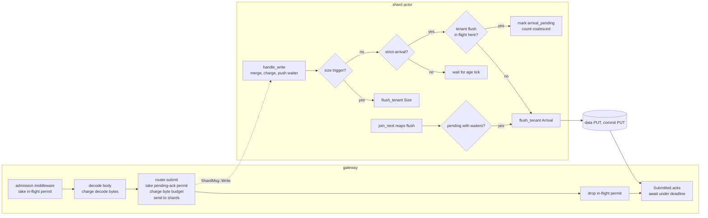

# ADR-2793: Strict flush-on-arrival ack policy and admission permit release

Status: Proposed
Date: 2026-10-10
Epic: #2793
Amends: ADR-0076 decision 4 (adds a second axis; the aged flush stays the
default)

## Context

A strict-mode write is acknowledged after the flush carrying its rows has
stored its data object and published its commit record. Today that flush
opens when the shard's age tick finds the buffer older than
`max_flush_delay` (2 s), checked once per `flush_tick` (200 ms). ADR-0076
decision 4 chose the 2 s delay as a PUT-cost lever: a buffer that waits
longer coalesces more writes into one object, and it named the cost: "this
decision costs strict-mode acknowledgement latency, and that is its real
price."

Measured on a fresh c6a.4xlarge against real S3 (main e20cd8316, DE review
2026-10-10, figures in epic #2793):

| Figure | Value |
|---|---|
| Strict OTLP ack p50, one record | 2.207 s |
| Strict OTLP ack p50, 1,000 records | 2.205 s |
| Strict OTLP ack p50, 8 concurrent clients | 2.202 s |
| Buffered ack | 0-1 ms |
| Data PUT, commit PUT | about 31 ms each |

Storage is not the cost. The wait is the age tick. Two consequences follow
from where that wait sits:

1. **A serial client is latency-bound.** A client that sends one request at
   a time, which is how an OTLP exporter behaves on a single queue, gets
   0.45 requests per second whatever the server's CPU.
2. **The admission permit is held across the wait.** The process-wide
   `--max-inflight-ingest-requests` permit (default 1,024) is taken by the
   admission middleware at the request head and released when the handler
   returns, after the strict ack (`services/ravel-server/src/ingest_admission.rs:246`,
   held across `next.run(request).await`). Its stated purpose is transient
   decode memory: "it bounds request COUNT, so the transient decode memory
   it caps is this ceiling times the largest per-request decoded body"
   (`config.rs:1555-1559`). Held for 2.2 s per strict request, it caps the
   process at about 465 strict requests per second regardless of CPU.

The shard actor already has a flush path that runs with no tick: the size
trigger. `handle_write` merges the rows, pushes the strict waiter, and if
`flush_est_bytes >= target_bytes` calls `flush_tenant(.., FlushTrigger::Size, ..)`
in the same call (`crates/ravel-ingest/src/shard.rs:1391-1405`, log and span
actors likewise). The bulk loader sets `target_bytes = 1` and gets exactly
that: every strict write flushes inside its own handler and acks at two PUT
round trips. Fleet experiment E1 (task 8314ff33) prototyped the other shape,
a zero age threshold for a buffer with a strict waiter: 2,200 ms to 200 ms
in-process, still one tick, two PUTs per write on both arms.

Selection today is per request: `x-ravel-ingest-mode: buffered` on the OTLP
HTTP, gRPC and OTAP surfaces (`otlp_http.rs:685-694`), honored for any
tenant. Remote Write ignores the header and is strict-only, because a
Remote Write sender drops its WAL entry on any 2xx. `docs/ingest.md:1486`
claims a per-tenant gate on buffered mode; no such gate exists in the tree,
and `docs/guides/ingest.md:139` says so. That stale sentence is reported
with this ADR, not fixed by it.

## Decision

**1. A strict write may select flush-on-arrival; the aged flush stays the
default.**

`WriteMode` gains a third variant, `StrictArrival`. Its acknowledgement
contract is identical to `Strict`: the ack follows the commit-record PUT,
carries one commit token per shard flushed, and is never answered from a
flush the deferral cap abandoned. What changes is when the flush opens.

Selection:

- `--strict-flush-policy aged|arrival` (default `aged`) on `ravel-server`
  is the process default: what a strict request gets when it does not
  name a policy. It applies to every strict surface, Remote Write
  included, since Remote Write reads no header and its ack contract is
  unchanged by the policy.
- The header `x-ravel-ingest-mode` on the OTLP HTTP, gRPC and OTAP
  surfaces, read by the same parser that reads `buffered` today, gains two
  explicit values that override the process default for one request:
  `strict-arrival` and `strict-aged`. `buffered` keeps its meaning. The
  value `strict`, an absent header, and any unknown value all mean "strict
  under the process default", so `strict` is not an opt-out of
  `--strict-flush-policy arrival`; `strict-aged` is.

A per-tenant setting is deliberately not part of this ADR. `TenantConfig`
is a protobuf record whose field set is versioned (`proto/ravel/sys.proto`
version history at the `TenantConfig` message), so a tenant field is a
format change under the format-change procedure. The per-request header
plus the process default cover the two callers this ADR is for: a client
that wants low-latency acks on its own exports, and an operator running a
deployment where every tenant wants them. A follow-up may add the field
once a deployment needs a per-tenant default that differs from the process
default; the policy value and the actor mechanism below are the same
either way.

**2. The arrival flush runs inside the write handler, bounded to one
in-flight flush per (shard, tenant).**

In each shard actor (`shard.rs`, `log_shard.rs`, `span_shard.rs`) the
message carries the policy alongside the ack. `handle_write` keeps its
order: deferral-cap refusal, merge, charge, push waiter, size check. After
the size check, if the write is strict-arrival and the size trigger did not
already fire:

- If this tenant has no flush in flight on this shard, the actor calls
  `flush_tenant(.., FlushTrigger::Arrival, LagCheck::Enforced)` now, the same
  call the size trigger makes. No tick is involved.
- If this tenant has a flush in flight on this shard, the buffer is marked
  `arrival_pending` and left in place. When the actor reaps that flush
  (the `flushes.join_next()` arm of `run`), it flushes the pending buffer
  if it still holds waiters. Writes that arrive meanwhile merge into the
  same buffer and ride that one flush.

The in-flight count the actor reads is the one ADR-2708 decision 3
introduces (accepted 2026-10-09, landing under #1921): spawned, unreaped
flushes counted per (shard, tenant), with the tenant identity returned from
the flush task so the reap arm can decrement it. This ADR adds no second
count. The arrival rule reads that count as "zero means flush now"; the
reap arm, which decision 3 already makes tenant-aware, additionally checks
the reaped tenant's buffer for `arrival_pending`. The shard-actor work here
is sequenced after #1921 lands, on top of its count, never beside it.

Every other rule of the flush pipeline applies unchanged. The arrival flush
acquires the shard's `max_inflight_flushes` permit inside the spawned task
(ADR-1642) and waits behind another tenant's flush if the permits are
held; past the deferral cap it is abandoned with the same `Abandoned`
answer. It is exempt from the queued-flush cap and from decision 3's
per-tenant share by construction, not by a new rule: it opens only when
the tenant has zero flushes in flight on the shard, and decision 3 states
that "a tenant with no flush in flight is never refused by the queued-flush
cap", with a share of at least one. So no queued-flush-cap or
per-tenant-share deferral path exists for an arrival flush, and an
implementer must not add one; the flush deferral cap and
`LagCheck::Enforced` are a different mechanism and stay exactly as the
size path has them. The memory argument is
decision 3's: the exemption adds at most one window per active tenant on
the shard, charged to the byte budget. A buffer whose arrival flush is
pending behind an in-flight one still holds a strict waiter, so it stays
in the priority age tier: the `max_flush_delay` tick is its fallback
floor, and the worst case for that buffer is today's behavior.

This is the PUT-rate bound. Per (shard, tenant) the arrival policy issues
at most one flush per flush duration, two PUT round trips, about 60-70 ms
on S3, so at most about 16 flushes per second per shard per tenant at
saturation, against one per 2 s under the aged policy (`max_flush_delay`
2 s). A tenant sending one strict request per 2 s costs the same under
both. A tenant sending ten per second on one shard costs up to 20x the
PUTs it would under the aged policy (each request's own flush is its
upper bound, 10 against 0.5 per second); a tenant at or past 16 per
second reaches the saturation ratio of 32x. That is why the policy is
opt-in and not the default. Per shard,
the `max_inflight_flushes` permits (1 in the tree today, 4 with a
per-tenant share of 3 under ADR-2708 decision 3) bound the shard's total
flushes in flight across tenants, so no tenant's choice can push a shard
past its permit count.

**3. `FlushTrigger::Arrival` is counted on its own, and so is coalescing.**

A new trigger variant `Arrival` with counter `flushes_by_arrival` in all
three pipelines' metrics, exported beside `flushes_by_size` and
`flushes_by_age`, never folded into `flushes_by_age`. A second counter,
`arrival_coalesced`, increments once per strict-arrival write that found a
flush in flight and waited for the reap. Both are what a test asserts to
prove the bound fired: with every PUT held by a store gate so no flush can
be reaped until all eight writes have landed, a run of eight concurrent
arrival writes on one shard asserts `flushes_by_arrival <= 2` and
`arrival_coalesced >= 6`, not only an ack latency. The held store is the
band's precondition, stated in the test: against an ungated store a reap
between two writes opens a third flush and the band does not hold.

**4. The admission permit is released at enqueue; pending strict acks get
their own bound.**

The router's write splits into two phases: `submit`, which takes a
pending-ack permit for a strict write, then charges the ADR-0069 byte
budget, sends to every involved shard and returns a `Submitted` handle,
and `Submitted::acks()`, which awaits the strict acks under the ack
deadline and returns the receipt. The permit comes before the charge so a
pending-ack refusal leaves nothing charged and nothing to release. `write`
remains as the composition of the two for callers that do not care.

The admission layers stop holding the permit for the handler's lifetime,
with one mechanism per transport, because the two transports drop request
extensions at different times:

One ownership model on every transport: a release handle, an
`Arc<Mutex<Option<IngestPermit>>>`, owns the permit; the admission layer
holds one clone of the handle for the request's lifetime and the handler
takes another. Emptying the slot releases the permit; dropping a clone
never does. A handler that never reaches `submit` leaves the slot full,
and the layer's clone releases the permit when the request ends, as today.

- HTTP: the middleware (`ingest_admission.rs:246`) moves the permit into a
  handle, keeps a clone across `next.run(request)`, and puts another in
  the request extensions. The OTLP metrics, logs and traces handlers and
  the Remote Write handler (`remote_write.rs:334`, behind the same
  middleware, strict-only by construction and so the surface that holds
  its permit across every ack today) clone the handle out, call `submit`,
  empty the slot, then await `acks()`.
- gRPC: the layer (`ingest_admission.rs:449-455`) stops moving the bare
  permit into its own future (`let _permit = permit;`) and holds a clone
  of the handle there instead, with another clone in the extensions. The
  handler reads it from the extensions before `request.into_inner()`, the
  way it reads the admission marker today, so tonic dropping the
  extensions mid-handler drops a clone, never the permit. On the
  direct-call path, where no layer ran and `admit_grpc_request` took the
  permit itself (`otlp_grpc.rs:78-84`), the handler owns that permit and
  drops it after `submit`. The existing marker is not precedent for any
  of this: its comment (`ingest_admission.rs:84-96`) exists to forbid a
  bare permit in extensions, and the handle design honors that reason
  because the layer always holds a clone of its own.
- OTAP: the batch handler already holds its permit locally and drops it
  after `submit`.

Why releasing at enqueue keeps the permit's stated purpose, decode
memory, covered: on the HTTP and gRPC paths the decoded request is moved
into normalization (`ingest.rs:149-205` and the log and span
equivalents), which consumes it before the router is called, and the
rows a strict request then holds in a shard buffer are charged to the
byte budget. OTAP is the exception: `process_batch` keeps the decoded
batch alive across `write_batch` by reference (`otap_grpc.rs:220-223`,
`306-312`), so it would stay resident through the ack wait. The OTAP
handler therefore narrows the batch's scope so the decoded batch is
dropped once `submit` has returned, then drops its permit, then awaits
`acks()`; until the batch is dropped the permit is held. A test pins
that order on OTAP.

What the permit covered by accident, the count of held response contexts,
gets an explicit bound: `--max-pending-strict-acks` (default 8,192, 0 =
unlimited). `submit` takes a pending-ack permit for a strict write before
sending, and `Submitted` holds it until the acks resolve or the deadline
passes. A strict request refused here gets the same 429 with `Retry-After`
and gRPC `RESOURCE_EXHAUSTED` as the in-flight ceiling, with its own body
text and counter `ravel_ingest_pending_ack_shed_total`, and the gauge
`ravel_ingest_pending_strict_acks` shows the held count. The two refusals
differ in where they shed: the in-flight ceiling decides at the request
head and a shed request never buffers a body, while the pending-ack bound
is taken inside `submit`, after decode and before the byte charge, so a
refusal there has paid a full decode and holds no charge. It is a bound
on held contexts, not a replacement for the head shed. Buffered writes
return at enqueue and take none. The default is the in-flight ceiling
times eight: at the aged policy's 2.2 s that is about 3,700 strict requests
per second before refusal, at the arrival policy's 0.1 s about 80,000, and
a held context is a response future plus one oneshot receiver per shard,
tens of megabytes at the default, not gigabytes.

## Rejected alternatives

- **Lower `--max-flush-delay` for everyone.** It is the only existing lever
  that shortens a strict ack, and it is process-wide: every tenant's PUT
  rate rises linearly with it. ADR-0076 calls it the lever of last resort.
  The arrival policy moves only the writes that ask for it.
- **The E1 shape: a zero age threshold for a buffer with a strict waiter.**
  Ten lines, measured, and still tick-bound: the ack floor is one
  `flush_tick` plus two PUTs, 200 ms plus 60 ms, against 60-70 ms for the
  in-handler flush the size trigger already performs. The tick adds nothing
  once the in-flight count bounds the rate; the handler path is the one
  the loader has run in production.
- **Make arrival the default.** At ten strict requests per second per shard
  it costs up to 20x the PUTs of the aged policy, and 32x at saturation.
  ADR-0076's whole point is the request bill, and its decision 4 stands as
  the default.
- **A per-tenant policy field in this ADR.** `TenantConfig` is a versioned
  protobuf; adding a field is a format change with a reader-first rollout
  (sys.proto version 3 took one). The two callers this ADR serves are
  covered by the header and the process default. Deferred, not rejected.
- **A per-tenant flush semaphore.** ADR-1642 rejected it and ADR-2708
  decision 3 keeps one FIFO semaphore per shard with a per-tenant share.
  The bound here is a read of decision 3's in-flight count before opening
  a flush, not a permit a task waits on; it does not change who holds the
  shard permit or in what order.
- **A second in-flight count owned by this ADR.** Two counts of the same
  thing in one actor drift. Decision 3 lands first and this ADR reads it.
- **Flush on arrival through `FlushNow`.** The router's manual trigger
  flushes every tenant on the shard and takes no bound. The size path is
  per tenant, in the handler, and already proven.
- **Raise `--max-inflight-ingest-requests` instead of releasing at
  enqueue.** The flag's memory term is count times the largest decoded
  body (1,024 times 16 MiB today); raising it to lift the ack-bound ceiling
  raises the decode memory bound in lockstep. Decoupling the two lifetimes
  lifts the ceiling at no memory cost.
- **Release at enqueue with no pending-ack bound.** ADR-0076 named held
  request contexts as a cost "ADR-0069's global ingest budget... does not
  cover". The in-flight permit covered it only by holding across the ack.
  A bound that disappears silently is a regression of a stated property.

## Consequences

- A strict-arrival write acks at the shard permit wait plus two PUT round
  trips. Pre-registered on the epic: p50 60-120 ms on real S3 for a serial
  one-record client, exactly two PUTs per write, at most one flush per
  shard per in-flight window under eight concurrent clients. The aged
  policy's figures are unchanged, and a test pins that a default-policy
  write does not flush before its age threshold.
- The durability and visibility contracts in `docs/consistency-model.md`
  are unchanged. The strict ack still means data object plus commit record
  durable. `docs/consistency-model.md:165`'s visibility formula gains the
  arrival case: flush delay is zero under this policy.
- `flush_trigger_age_bound_ns` and the deferral cap are unchanged: an
  arrival flush opens no later than an aged one would.
- `docs/ingest.md` changes: the Modes section gains the third value and
  the process default; the shard actor section gains the arrival branch
  and the in-flight count; the pipelined-flushes section states that the
  arrival flush takes the same permit and queue cap; the sizing table and
  the metrics section gain the new flag, counters and gauge; the admission
  text at lines 56-61 says the in-flight permit covers decode through
  enqueue and names the pending-ack bound. Four in-tree sentences become
  false the moment the permit is released at enqueue and change in the
  same commit as that behavior: the middleware comment at
  `services/ravel-server/src/ingest_admission.rs:235-241`, which loses
  "and the durable write" from what the permit covers; the marker comment
  at `ingest_admission.rs:89-95`, whose "the permit instead lives in the
  layer's own future, whose lifetime is exactly the request's" becomes
  "the layer holds a clone of the release handle"; the gRPC layer comment
  at `ingest_admission.rs:450-452`, "held for the whole inner call: the
  body read, tonic's decode, and the handler's durable write", which the
  early release contradicts; and the `--max-inflight-ingest-requests`
  help at `services/ravel-server/src/config.rs:1550-1565`, which keeps
  its head-shed sentence and gains one saying the permit is released at
  enqueue, so the count bounds decodes in flight and no longer covers the
  ack wait. `docs/reference/ravel-server-flags.md`,
  `docs/reference/http-api.md`, `docs/guides/ingest.md` and `docs/concepts.md`
  gain the header value and flags. The flag doc test
  `ingest_flag_docs_name_the_inflate_term` keeps pinning the in-flight
  flag's terms.
- ADR-0076 decision 4 carries an inline pointer to this ADR's amendment
  section. Decision 4 itself stands.
- `ravel-cli load` is untouched: it already flushes on arrival through the
  size trigger and keeps `WriteMode::Strict`.
- The split router API is additive. `write` keeps its signature; every
  existing caller compiles unchanged.
- The ack latency under the arrival policy is bounded below by the shard
  permit wait. With the single permit in the tree today a co-resident
  tenant's slow flush delays an arrival ack by its own duration; ADR-2708
  decision 3's four permits with a per-tenant share leave one permit free
  of any single hung tenant. The shard-actor task of this epic depends on
  #1921 landing, and its acceptance test runs against that tree.
