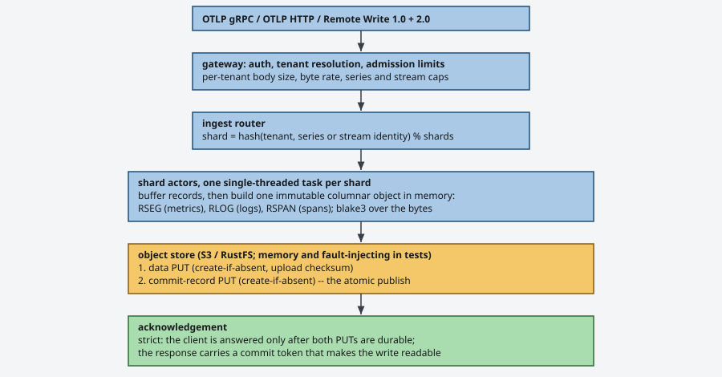
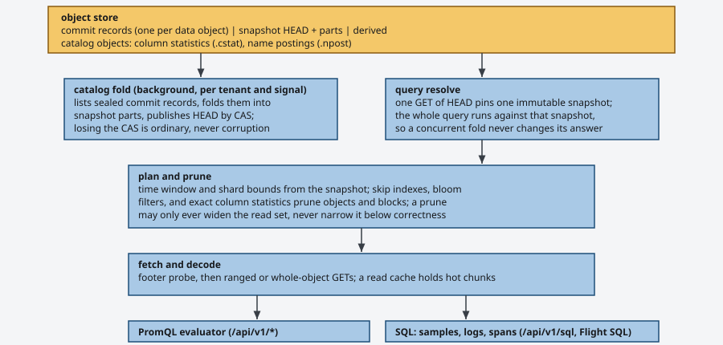
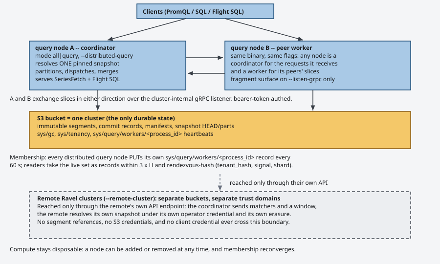

# Architecture

Ravel is an OpenTelemetry-native telemetry database for metrics, logs, and
traces. One rule shapes every part of it: the object store is the only
durable component. There is no write-ahead log, no ingester quorum, and no
local disk that matters. Any process can die at any instant, and every
STRICTLY acknowledged write survives. Buffered acknowledgement is a
per-request opt-out with a documented loss window, described under the
write path below.

This file is the map. Each section names the ADR or spec that holds the
reasoning and the exact contracts. The doc index in
[docs/README.md](README.md) lists the operator guides.

## The write path



A batch enters through the gateway, which resolves the tenant and applies
that tenant's admission limits. The router hashes each record's identity to
a shard. Each shard is one single-threaded actor with a bounded queue, so
ordering inside a shard needs no locks. The actor buffers records, builds
one immutable columnar object in memory, and writes it with two PUTs: the
data object first, then a commit record. The commit record is the publish:
readers see only data that a commit record names.

Acknowledgement has two modes ([docs/consistency-model.md](consistency-model.md) is normative).
Strict mode answers the client only after both PUTs are durable, and the
response carries a commit token. A query that presents that token reads the
write with no listing race. Buffered mode answers after admission and
enqueue, and the crash window this opens is documented, bounded, and
chosen per request, never hidden. Only OTLP ingest offers buffered mode;
Remote Write is strict-only, and a buffered-mode header on it is ignored
rather than honored.

All three signals share this pipeline. Remote Write payloads normalize to
the same shape OTLP produces and enter the same router call, so there is no
second flush or commit path to hold correct. Every persistent layout the
path writes is a frozen contract: the RSEG layout ([docs/segment-format.md](segment-format.md)),
the RLOG layout ([docs/log-segment-format.md](log-segment-format.md)), the protobuf schemas under
proto/, and the object key layout ([docs/catalog-and-mvcc.md](catalog-and-mvcc.md)).

## The catalog and the read path



Commit records are the write-side truth, and the catalog fold turns them
into a read-side index. The fold runs in the background per tenant and
signal. It lists commit records whose ingest hour has sealed, folds them
into content-addressed snapshot parts, and publishes a new HEAD with a
compare-and-swap. Two folders can race safely: the loser's CAS fails and
nothing is corrupted. An hour seals only after
`max_flush_lifetime + clock_skew_allowance + fold_safety_margin` has passed,
so a fold that runs right after a write finds nothing eligible. That is the
expected answer, not a failure. [docs/catalog-and-mvcc.md](catalog-and-mvcc.md) holds the exact
protocol.

A query starts with one GET of HEAD, which pins one immutable snapshot.
Everything the query reads comes from that snapshot, so results are stable
under concurrent folds and compactions. Planning prunes with the snapshot's
time and shard bounds, then with skip indexes, bloom filters, and exact
per-column statistics. Pruning obeys one invariant: it may widen the read
set, never narrow it below what correctness requires. Statements that exact
catalog statistics can answer in full, such as a predicate-free count,
issue zero data reads.

The fetch layer probes an object's footer, then issues ranged GETs for the
blocks the plan kept, or a whole-object GET when that is cheaper. The
request-cost/latency trade is an operator knob, not a constant. A read
cache holds hot chunks in memory; a cold and a warm pass over the same data
differ only in requests issued, never in rows returned.

Two query engines sit on top of one fetch layer. The PromQL evaluator
serves the Prometheus-compatible `/api/v1/*` routes. The SQL engine
(ravel-sql, on DataFusion) serves the `samples`, `logs`, and `spans` tables
over `POST /api/v1/sql` and Flight SQL. Both engines deduplicate
cross-segment duplicates with the same bit-exact total order, and Arrow and
DataFusion stay isolated behind the `sql` and `flight-sql` cargo features.

## Maintenance

Compaction, retention, and garbage collection run as background work over
the same store, and every one of their outputs is published through the
same commit or CAS protocols the write path uses.

- Compaction merges many small L0 objects into few larger L1 parts per
  `(tenant, signal, shard, ingest hour)` bucket, streaming blocks rather
  than materializing inputs. Output parts are content-addressed, and a
  compaction record publishes them atomically; two compactors racing on
  one bucket converge on one winner (ADR-0979 bounds the merge's memory).
- Age-based retention and the GC sweeper delete only what nothing
  references, behind grace periods and a mass-orphan circuit breaker, so a
  listing anomaly withholds deletions instead of amplifying them.
- The fold (above) is the third background loop, and an on-demand form of
  it exists per tenant (below).

The maintenance and fold supervisors derive their tenant set from storage,
not from flags: each cycle lists the tenant prefixes under `t/` and runs
every discovered tenant's tick. Once a tenant carries a durable
`t/<hash>/config` lifecycle record, that record is the sole authority, and
no flag can silently exclude the tenant from retention. A discovery failure
skips the whole cycle and is retried; it never falls back to an empty
tenant set, because an empty set would look exactly like a healthy idle
cycle on the dashboard meant to catch it. The
`ravel_maintain_tenants_discovered` and `..._maintained` gauges expose the
gap a restriction or a bug would open.

## One binary, four modes

`ravel-server` runs every role as a mode of one binary: `all`, `gateway`,
`query`, and `maintain`. Crate boundaries keep the roles separable, and
`maintain` is a disposable worker that serves no ingest or query surface.
Every mode binds `--listen-http` and serves three routes there
unconditionally:

- `/healthz` answers 200 whenever the HTTP loop is serving. It never
  depends on store reachability, so a store outage cannot get healthy
  processes killed.
- `/readyz` gates on completed startup, then follows a background store
  probe with asymmetric hysteresis: four consecutive probe failures flip it
  to 503, one success recovers it. The kubelet path reads an in-memory
  atomic and never touches the store.
- `/metrics` renders hand-written Prometheus text from counters the process
  already holds. The label set is fixed and small on purpose; per-shard and
  free-form labels are excluded so Ravel's own telemetry cannot explode.

Startup on any non-memory store is gated on a durable `sys/qualification`
record: a deployment must run `ravel-cli store qualify` once before the
first server starts. This proves the backend honors the semantics the
commit protocol depends on, before any data rides on them.

Three listeners exist. `--listen-http` carries OTLP HTTP, Remote Write, the
query and analytics routes, and SQL. `--listen-grpc` carries OTLP gRPC,
Flight SQL, and the cluster-internal fragment service. `--mtls-listener` is
a third listener for mTLS-terminated traffic; the resolver that trusts the
forwarded client-certificate header exists only in that listener's router
chain, so the public listeners are safe against header forgery by
construction. Startup validation refuses any configuration that would break
this isolation.

## Distributed reads and cross-cluster federation



A read can span more than one process. This is off by default and
cost-gated: the node that receives a request coordinates it, resolves one
pinned snapshot, and fans out only when a pre-execution estimate clears the
gate. Cheap queries run the untouched local path. Worker membership needs
no new durable state; nodes self-register with a heartbeat key, and
rendezvous hashing assigns slices. The fragment service admits inbound
slices from a pool separate from client-query admission, so a coordinator
holding a client permit can never deadlock on fragments that need the same
pool. A slice the coordinator owns runs through the same service in
process, so local and remote slices cannot diverge in behavior.

Federation treats every remote cluster as a separate trust domain. The
coordinator sends matchers and a time window to the remote's public API
under an ordinary per-remote credential. The remote resolves its own
snapshot under its own erasure state. No segment reference, S3 credential,
or client credential ever crosses the boundary. A slow or unreachable
remote degrades to partial coverage, and that state is always visible in
the query's stats and warnings. [docs/query-engine.md](query-engine.md) and
[docs/guides/distributed-query.md](guides/distributed-query.md) hold the full contract.

## Analytics and alerting

`ravel-analytics` is a post-evaluation stage of pure per-series functions:
change point detection and robust summary statistics over
`(timestamp_ns, f64)` slices. `POST /api/v1/analytics` runs the same range
evaluation as `/api/v1/query_range`, then applies the requested operation
per series. It links no Arrow and needs no cargo feature. Approximation
exists only as an explicit, visible `downsample` option.

Alert rules are queries. One background task per tenant evaluates the
tenant's rules against the same query engines the API serves from, on a
jittered interval. State transitions, and only transitions, are written as
immutable records under the alerts keyspace, through the same
data-PUT-then-commit-PUT protocol as any signal. No alert state lives in
process memory, so a restarted evaluator resumes from the records. Webhook
and Alertmanager sinks fire only after the record is durable; delivery is
at-least-once and never blocks the write. A firing rule re-notifies on its
`repeat_interval`, anchored to the durable record's timestamp, so the
schedule survives restarts.

## On-demand catalog fold

`POST /api/v1/admin/fold` runs the same fold the background loop runs, for
one tenant and one signal, under the same credential the query surfaces
require. Concurrent calls for one `(tenant, signal)` coalesce into a single
fold, and a rate gate declines to fold when HEAD is younger than the fold
interval. Together the gates bound one caller to one fold per signal per
interval. Every completed call reports one of four statuses, because these
are different facts an operator has to tell apart:

| `status` | Meaning |
|---|---|
| `published` | A new snapshot was published; HEAD names different content than before. |
| `nothing_eligible` | No commit was eligible. `head_advanced` says whether the sealing watermark still moved. |
| `lost_cas` | A concurrent fold won the HEAD CAS; that fold's snapshot is current. |
| `throttled` | HEAD is younger than the fold interval; nothing was listed, so no eligibility claim is made. |

Authentication and validation errors (401, 400, 403) precede any store
work. A 503 does not carry that guarantee: the fold may have written parts
before failing, so a 503 means "outcome unknown, retry", never "nothing was
written".

## Crate map

Dependency order, no cycles:

```text
ravel-types
  <- ravel-proto        (prost-generated footer/commit messages)
  <- ravel-object-store (S3/MinIO, memory, fault-injecting backends)
  <- ravel-segment      (RSEG metrics format; types, proto)
  <- ravel-logseg       (RLOG logs format)
  <- ravel-commit       (commit records; types, proto, object-store)
  <- ravel-catalog      (fold, snapshots, column statistics; commit)
  <- ravel-otlp         (types; opentelemetry-proto)
  <- ravel-remote-write (Remote Write 1.0/2.0 decode + normalize)
  <- ravel-otap         (OTel Arrow ingest; arrow isolated here)
  <- ravel-ingest       (router, shard actors, admission)
  <- ravel-promql       (parser + evaluator; types)
  <- ravel-query        (fetch layer, engines' shared read path)
  <- ravel-maintain     (L0->L1 compactor, GC sweeper, retention)
  <- ravel-analytics    (pure post-evaluation compute; types only)
  <- ravel-alerting     (rule/condition/state/record logic, no I/O)
  <- ravel-sql          (DataFusion engine; arrow + datafusion)
  <- services/ravel-server, services/ravel-cli
ravel-test-util (types, object-store) used by all dev-deps
```

Each crate's normative doc is listed in the doc map in CLAUDE.md and in
[docs/README.md](README.md). [docs/consistency-model.md](consistency-model.md) governs
acknowledgement, visibility, and crash behavior everywhere.
