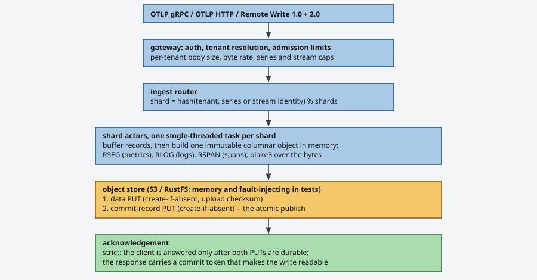
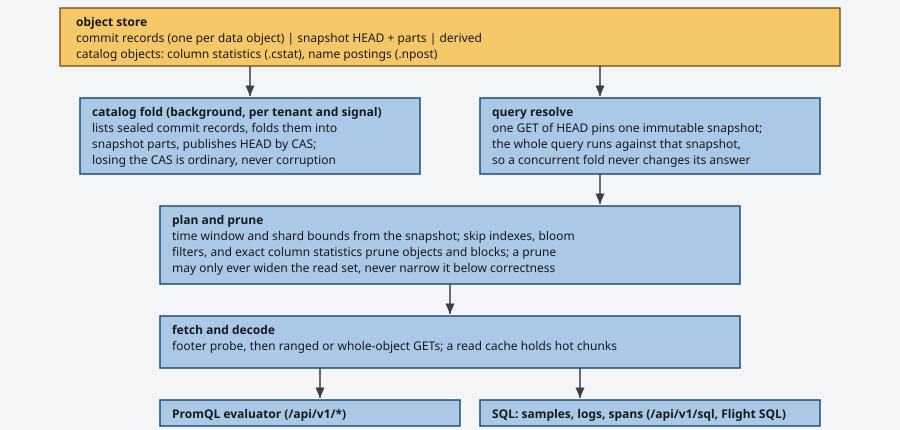
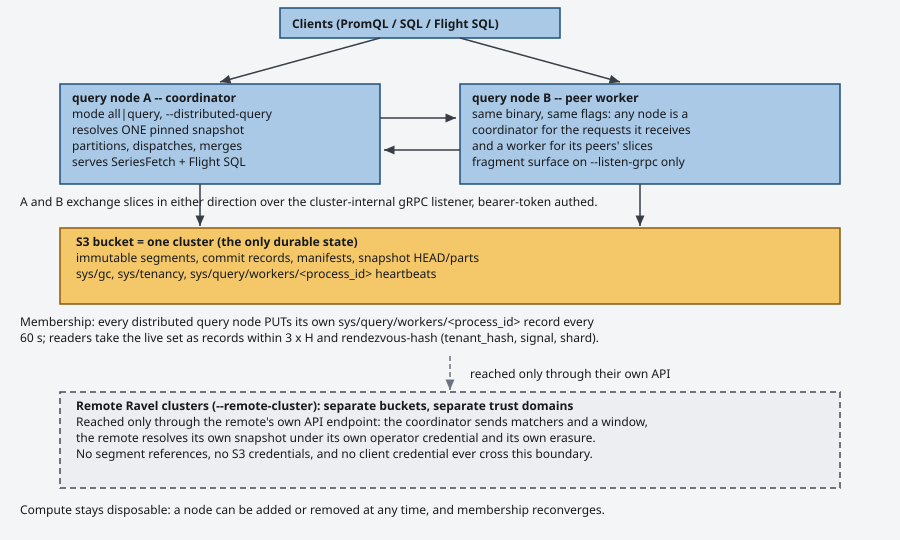

# Architecture

One rule shapes Ravel: the object store is the only durable component. There
is no write-ahead log, no replicated block device, and no local disk whose
loss loses data. Any process can die at any instant, and every strictly
acknowledged write survives.

Each section below is short and links to the document that holds the detail.
[docs/concepts.md](concepts.md) defines every term used below and expands
every acronym. Read it first if the vocabulary is new.

## Which components exist

Ravel has four binaries:

- `ravel-server` is one binary that runs four modes: `all`, `gateway`,
  `query`, and `maintain`, selected with `--mode`. A deployment is some
  number of processes of that binary over one bucket.
- `ravel-cli` is the operator and inspection tool.
- `ravel-operator` reconciles the `RavelCluster` custom resource on
  Kubernetes ([guides/kubernetes.md](guides/kubernetes.md)).
- `ravel-ingest-router` is an optional front door that pins each tenant to a
  stable subset of gateway replicas.

Inside a server process, five subsystems do the work:

- Ingest: gateway admission, the router, and the shard actors.
- The catalog: commit records, folds, snapshots.
- The read path: snapshot resolution, pruning, segment fetch, caching.
- The two query engines: a PromQL evaluator and a DataFusion-based SQL
  engine.
- Maintenance: compaction, retention, the garbage-collection sweep, the
  integrity scrubber.

Each mode enables a subset:

| Mode | Runs |
|---|---|
| `gateway` | Ingest. |
| `query` | The read path, both engines, and alert-rule evaluation. |
| `maintain` | Maintenance and the scheduled catalog fold, partitioned across its replicas by the same ownership rule maintenance units use (ADR-1693). |
| `all` | `gateway` plus `query` in one process, plus the fold over everything. It does not run maintenance. |

A deployment with no `maintain` process never compacts or deletes anything.
A deployment with neither a `maintain` nor an `all` process never folds on a
timer. `query` and `all` keep the on-demand fold route.

The ingest surfaces are OTLP over HTTP and gRPC, Prometheus Remote Write, and
OTAP behind a cargo feature. The ingest protocols share one pipeline. Remote
Write payloads normalise to the shape that OTLP produces and enter the same
router call, so there is no second flush or commit path.

The query surfaces are the Prometheus-compatible `/api/v1/*` routes,
`POST /api/v1/sql`, Flight SQL behind a cargo feature, and
`POST /api/v1/analytics`. The Prometheus-compatible routes also serve the
logs signal. A selector with exact `__name__` equality on the reserved
`ravel_log_lines` or `ravel_log_bytes` metric name is answered from log data.
The query coordinator evaluates it locally and does not federate it
(ADR-1103, see [docs/guides/query.md](guides/query.md#promql-over-logs)).

Two capabilities that the decision records discuss do not exist in the
shipped system: RavelQL, and Sigma or OCSF rule ingestion. Logs, spans,
compaction, and catalog snapshots all ship.

## Which state is durable

Only the objects in the bucket are durable. There are five kinds:

- Data objects: immutable columnar segments, one per flush at L0 and one per
  compaction output at L1. Their layouts are frozen contracts, one per
  signal: [RSEG](segment-format.md), [RLOG](log-segment-format.md), and
  [RSPAN](span-segment-format.md).
- Commit records: immutable objects that publish a data object. Also the
  compaction records, rewrite records, retention tombstones, and idempotency
  markers that publish the other durable transactions.
- Catalog objects: immutable snapshot parts and column-statistics objects,
  plus the HEAD pointer. HEAD is the catalog's one mutable object, written
  only under compare-and-swap.
- Per-tenant records: the shard-count provisioning record, the append-only
  encryption key-epoch record, the tenant configuration, admission usage
  snapshots, alert state, and metric family metadata. These records change
  after they are written, each under its own rule, and a snapshot names none
  of them.
- Deployment records under the bucket root: the store qualification record,
  the tenancy scheme marker, the authentication map, per-process liveness
  heartbeats, and advisory work claims.

The key layout and the mutability rule for every one of them are in
[docs/catalog-and-mvcc.md](catalog-and-mvcc.md).

## Which processes are disposable

All of them. Disposable is a stronger claim than stateless. A process holds
buffered records, a resolved snapshot, a read cache, and a membership view.
It never holds state that another process needs to recover. No restart path
reads a file that another process wrote locally, and no correctness argument
depends on a particular process returning.

That means five things:

- A fresh process can replace a process with no handoff. So rolling restarts,
  autoscaling, and spot interruption are ordinary events.
- Local disk is a cache only. The read cache's disk tier and any scratch
  directory can be deleted between runs with no effect except a colder first
  pass ([guides/caching.md](guides/caching.md)).
- There is no leader to elect, no quorum to lose, and no membership state to
  repair. The conditional writes of the store are the only arbiter.
- Alert-rule state lives in durable records and not in process memory, so a
  restarted evaluator resumes from them.
- A process's identity is short-lived. A restarted writer takes a new epoch
  and does not reuse a sequence number. So nothing depends on a process
  remembering what it did before it died.

The cost of disposability is that every durable step is a network round trip.
The floor on visibility latency is object-store latency, and request count is
a bill ([guides/cost-model.md](guides/cost-model.md)).

### Health and readiness routes

Two HTTP routes exist on every mode so that an orchestrator can act on this
model.

`/healthz` answers 200 whenever the HTTP loop is serving. It never depends on
store reachability, so a store outage cannot get healthy processes killed.

`/readyz` has three inputs:

- Startup. `/readyz` gates on completed startup.
- A background store probe with asymmetric hysteresis. Four consecutive probe
  failures flip `/readyz` to 503, and one success recovers it. The kubelet
  path reads an in-memory atomic and does not touch the store.
- Ingest health. Once any ingest shard actor is condemned, this process's
  `/readyz` is 503 for good.

When a shard actor is condemned depends on the signal, because only the
metrics pipeline respawns:

- The metrics router condemns a shard on the death that exhausts its respawn
  budget within one decay window.
- The log and span routers never respawn, so they condemn on the first
  shard-actor death.

[ingest.md](ingest.md) records the per-signal rule.

Readiness only sheds traffic: a 503 removes the pod from its Service
endpoints. It never restarts or reschedules the pod. That is why liveness is
a separate route, and why a condemned shard needs an operator to roll the
process
([guides/operations/troubleshooting.md](guides/operations/troubleshooting.md)).

`/metrics` is the third unconditional route. It renders a fixed and small
label set so that Ravel's own telemetry cannot explode
([guides/observability.md](guides/observability.md)).

### Shutdown

On SIGTERM, `/readyz` is the drain signal. The process does these steps in
order:

1. It flips `/readyz` to 503 and overwrites its distributed query heartbeat
   record with a drained stamp that no reader accepts as live. It then waits
   a short settle interval. The listeners are still open during that
   interval, so a probe observes the 503 and a sibling coordinator drops this
   worker from its live set.
2. It signals the listeners closed.
3. It attempts to flush every ingest shard actor (metrics, logs, and spans)
   before it waits on those sockets.
4. It stops the background tasks.
5. With `--listen-health` set, it stops that listener.
6. After the drain returns, `main` flushes the OTLP trace exporter.

Each step has a bound:

| Step | Bound |
|---|---|
| Heartbeat drain write, which runs ahead of the drain | A tenth of `--shutdown-timeout` (2.5s at the default) |
| Drain, from the close signal onwards | `--shutdown-timeout` (default 25s) |
| Stop of the `--listen-health` listener, when that flag is set | Up to 6s (a 5s shutdown deadline plus a 1s join margin) |
| Trace exporter flush | Provider shutdown is hard-capped at 5s |

So neither a wedged flush nor an unreachable object store can hold the
*drain* past 27.5s at the defaults. That is not the whole SIGTERM-to-exit
budget. With a trace endpoint set and its collector unreachable, the trace
flush runs the full 5s.

| Configuration | Worst case from SIGTERM to exit | Pod grace period that the operator sets |
|---|---|---|
| Default | 27.5s + 5s = 32.5s (25s drain + 2.5s heartbeat stop + 5s trace flush) | 45s |
| `--listen-health` set | 27.5s + 6s + 5s = 38.5s | 51s on the pods of a cluster with `spec.probes.dedicatedHealthPort` set |

An operator must size `terminationGracePeriodSeconds` against the worst case.
The default worst case, 32.5s, is above the 30s Kubernetes default. So an
unreachable trace collector can push the process past the grace period and
cost it a SIGKILL. That overrun costs traces and a clean exit. It does not
cost buffered records, which the drain has already attempted to flush. A pod
that enables the dedicated health port needs a grace period above 38.5s.

### Dedicated health listener

`/healthz` and `/readyz` share the application runtime, so a node whose
workers are all busy cannot answer them. `--listen-health <addr>`, off by
default, adds a listener served by its own single-threaded runtime on a
dedicated OS thread (ADR-1702 decisions 8 and 9). It serves only `/healthz`,
`/readyz`, `/-/healthy` and `/-/ready`, with no tenant identity. It reads a
heartbeat that a task on the main runtime refreshes once per second:

- Its `/healthz` returns 503 once that heartbeat is older than 60 s.
- Its `/readyz` returns 503 when readiness above says not ready or the
  heartbeat is older than 30 s.

The copies on the main HTTP listener keep the behavior described above.

## How ingest, query, and maintenance interact



Ingest writes two objects per flush:

1. A batch enters through the gateway, which resolves the tenant and applies
   that tenant's admission limits.
2. The router hashes each record's identity to a shard. Each shard is one
   single-threaded actor with a bounded queue.
3. The actor buffers records and builds one immutable columnar segment in
   memory.
4. The actor writes the segment with two PUTs: the data object first, then
   the commit record that publishes it.

Strict acknowledgement answers the client only after both PUTs are durable.
It returns one commit token per shard that the request's points flushed
through. Buffered acknowledgement answers after admission and enqueue. It
returns no token, and it carries a bounded loss window on an abrupt crash.
[docs/consistency-model.md](consistency-model.md) is normative for both, and
[docs/ingest.md](ingest.md) holds the pipeline's internals.



Query reads from a pinned snapshot:

1. A query begins with one GET of HEAD, which pins one immutable snapshot for
   the whole execution. So results are stable under concurrent folds and
   compactions.
2. Planning prunes with the snapshot's time and shard bounds, then with skip
   indexes, bloom filters, and exact per-column statistics. One invariant
   holds: pruning can widen the read set, and never narrows it below what
   correctness requires.
3. The fetch layer probes an object's footer. It then issues ranged GETs for
   the blocks that the plan kept, or a whole-object GET where that is
   cheaper.

A read cache holds hot chunks. A cold pass and a warm pass over the same data
differ only in requests issued, never in rows returned.
[docs/query-engine.md](query-engine.md) holds the engine contract, and
[guides/query.md](guides/query.md) the endpoints.

Maintenance reshapes the bucket without changing any answer. It has four
loops:

- Compaction merges many L0 segments into fewer L1 segments per (tenant,
  signal, shard, ingest hour) bucket. It checks that input and output record
  counts are equal, and then publishes the L1 segments with one compaction
  record.
- Retention expires data by age behind a durable tombstone.
- The sweep physically removes what nothing references, behind grace periods
  and a mass-orphan circuit breaker. So a listing anomaly withholds deletions
  and does not amplify them.
- The catalog fold turns sealed commit records into snapshot parts and
  publishes a new HEAD by compare-and-swap.

The three paths meet at the commit record and at HEAD, and nowhere else.
Ingest only creates commit records. The fold only reads them and writes
snapshot parts. Query only reads HEAD and the objects it names.

Maintenance supervisors derive their tenant set by listing tenant prefixes,
and not from a flag. So no configuration can silently exclude a tenant from
retention. A discovery failure skips and retries the cycle, and does not fall
back to an empty set.

<a id="on-demand-catalog-fold"></a>
One maintenance operation is also an API. `POST /api/v1/admin/fold` runs the
same fold that the background loop runs, for one tenant and one signal, under
the credential that the query surfaces take. Concurrent calls for one pair
coalesce into a single fold. A rate gate declines when HEAD is younger than
the fold interval. The response distinguishes four outcomes: `published`,
`nothing_eligible`, `lost_cas`, and `throttled`. Right after a load the
answer is `nothing_eligible`, because an ingest hour is not foldable until
its sealing window has elapsed.

## Object store requirements

Production startup fails if the configured backend under-reports any of these
requirements:

- Read-after-write consistency on create, so a commit record is readable the
  instant it exists.
- List-after-write consistency, so a commit record is discoverable by
  listing the instant it exists.
- Conditional create-if-absent put, which makes commit records and data
  objects safe to write from many uncoordinated processes.
- Compare-and-swap on a version, which makes the HEAD pointer safe to
  publish.
- Ranged reads including suffix ranges, which make footer-first segment reads
  possible.
- Paginated prefix listing, used by discovery and by garbage collection.

`--mode maintain` additionally requires multipart upload. Batch delete,
lifecycle expiration, and server-side encryption headers are optional, and no
mode requires them.

Startup on any non-memory store is also gated on a durable qualification
record. A deployment runs `ravel-cli store qualify` once before its first
server starts. That run proves that the backend honours the semantics that
the commit protocol depends on, before any data depends on them.

On Kubernetes the operator makes that run itself:

- Before it creates any serving Deployment for a `RavelCluster`, it applies a
  one-shot `<cluster>-qualify` Job that runs `ravel-cli store qualify`
  against that cluster's bucket.
- It gates the gateway, query, and maintain Deployments on the Job
  completing. So a cluster never comes up as three Deployments that
  crash-loop on a backend that fails the contract.
- It records the qualified inputs in a `StoreQualified` status condition and
  a durable `status.storeQualifiedHash`. The inputs are the bucket, region,
  endpoint, image, the credentials Secret name, and that Secret's
  `resourceVersion`.
- It re-runs qualification only when those inputs change, and never on a
  schedule. A rotation of the credentials Secret in place (same name, new
  content, bumped `resourceVersion`) is a changed input, so it re-runs
  qualification.
- It leaves a running cluster's Deployments up while it re-qualifies
  (ADR-0034).

The capability table, the qualification suite, and the retry and timeout
contract are in [docs/object-store-contract.md](object-store-contract.md).

## Where the trust and failure boundaries are

The tenant is the isolation boundary. A tenant never appears in an object
key, only a hash of it does, and no query resolves across two tenants. Every
per-tenant limit, retention policy, encryption key epoch, and shard count
hangs off that boundary.

The listener is the authentication boundary:

- `--listen-http` carries OTLP HTTP, Remote Write, the query and analytics
  routes, and SQL.
- `--listen-grpc` carries OTLP gRPC, Flight SQL, and the cluster-internal
  fragment service.
- `--mtls-listener` is a separate listener for mTLS-terminated traffic.

The resolver that trusts a forwarded client-certificate header exists only in
the router chain of the mTLS listener. So the public listeners are safe
against header forgery by construction. Startup validation refuses any
configuration that breaks the isolation.

A remote cluster is a separate trust domain. Federation sends matchers and a
time window to the remote's public API under an ordinary per-remote
credential. The remote resolves its own snapshot under its own state. No
segment reference, storage credential, or client credential crosses the
boundary. A slow or unreachable remote degrades to partial coverage, and that
state is always visible in the query's stats and warnings
([guides/distributed-query.md](guides/distributed-query.md)).

### Query service layer

One query service layer sits between every query transport and the engine. It
is the single place where the per-query controls live:

- Admission against the fleet-global concurrency ceiling.
- The deadline and request-budget clamps, which can only lower a server
  ceiling.
- The usage record, folded on every exit path including a client disconnect.
- The evidential audit event, whose durability is awaited before an answer is
  released.
- The partial-coverage consent gate.
- The redaction that a failure passes through on the way out.

A transport parses its request, authenticates it, calls one operation, and
encodes the outcome. It holds none of those controls. So a new transport
cannot add a surface that queries outside the ceiling, spends without
recording, or answers without an audit trail.

Authentication stays on the transport side and runs before admission, so an
unauthenticated request cannot consume a permit. Authentication is also the
one thing that the service layer does not share across listeners. A process
that serves both the public listener and the mTLS listener runs an instance
of the layer per listener. The instances are identical in every control and
differ only in the tenant resolver, because the two listeners derive tenant
identity from different credentials.

The layer has two boundaries:

- The admission permit is released when the operation returns, before the
  transport encodes the response. So a slow client does not hold a fleet-wide
  slot for the length of its download. Encoding is CPU-bound work over a
  result that the query budgets already capped.
- A request that the transport rejects before it calls an operation produces
  no audit event. A metadata selector that does not parse is one example. The
  audit trail records queries that reached execution for a resolved tenant,
  and this request never did.

The usage record that a disconnect folds carries the spend that the query had
reached, and not a zero. Every operation hands the engine a live view of the
counters that the read spends through, and hands the same view to its usage
guard. So a future dropped in the middle of a resolve is billed for the store
requests that it had already issued.

- On the PromQL, metadata, and analytics operations that view is additive,
  because one request can spend through several counter blocks. The record
  sums all of them:
  - The metrics lane and the log lane of a query naming both signals.
  - One block per `match[]` selector of a metadata request.
  - One block per attempt when a snapshot is invalidated and the read
    re-resolves.
- The exemplars and SQL operations hold one block at a time and replace it
  when an attempt retries. So a cancellation there is billed for the retried
  attempt alone and not also for the discarded one.

### Failure boundaries

The failure boundaries are the two PUTs of a write and the compare-and-swap
of a fold. A failure on either side of them has a defined outcome. The
outcome is never ambiguous for Ravel, and is sometimes ambiguous for the
client.

Storage credentials are scoped so that the grant set of a storage credential
role matches the objects that its mode writes. The store itself is the last
boundary, and its durability is the floor under every guarantee on this page.

## What happens when processes run concurrently



Processes are symmetric and uncoordinated. Any number of them can serve any
mode over one bucket, and they exchange state only through objects. A
conditional write resolves every race, and no lock does:

- Create-if-absent separates two writers on one commit key.
- The HEAD compare-and-swap separates two folders.
- The create-if-absent on the compaction record separates two compactors on
  one bucket.

The loser of any of these re-reads, and its already-written objects become
unreferenced and age out.

Work is divided without a coordinator. Maintain workers and query workers
each write a liveness heartbeat under their own key and list their siblings
to compute a live set. They partition the work unit space over that set by
rendezvous hashing. So N replicas divide the work, and no replica pays for
all of it. Membership needs no new durable state and no lease, and a stale
heartbeat is self-correcting on the next interval.

A single read can also span processes. This is off by default and cost-gated.
The receiving node coordinates the request and resolves one pinned snapshot.
It fans out only when a pre-execution estimate clears the gate, so cheap
queries run the untouched local path.

The fragment service admits inbound slices from a pool that is separate from
client-query admission. So a coordinator that holds a client permit cannot
deadlock on fragments that need the same pool. A slice that the coordinator
owns runs through the same service in process, so local and remote slices
cannot diverge in behaviour.

Concurrency never changes an answer. A query pins its snapshot at the first
GET, and commits, folds, compactions, and deletions that land mid-query are
outside it.

## Interruption and retry

Nothing is repaired on startup. A restarted process reads the store and
continues. There is no recovery log to replay and no local state to
reconcile.

- An interruption between the two PUTs of a write leaves a data object that
  no commit record names. It is invisible to every query, and the sweep
  deletes it after the grace period.
- An interruption after the commit PUT but before the response leaves data
  that is durable and visible. The client believes that the write failed.
  That is the one ambiguous case, and it is ambiguous for the client.
  An unkeyed retry stores a duplicate. A keyed retry replays its idempotency
  marker and stores nothing new, because the marker PUT precedes the
  acknowledgement.

Retries are safe everywhere because no persisted step is a read-modify-write.
Data objects are content-addressed, commit records and markers are created
with create-if-absent, and HEAD moves only under compare-and-swap.

Delivery is at-least-once. For metrics a duplicate collapses at query time by
series and timestamp. For logs and spans the opt-in idempotency key makes a
retry a no-op.

Where an API cannot tell which side of a boundary a failure fell on, it says
so:

- Authentication and validation errors precede any store work, so a 401, 400,
  or 403 guarantees that nothing was written.
- A 503 from the on-demand fold means that the outcome is unknown. Retry the
  call.

The full crash table is
[docs/consistency-model.md](consistency-model.md#crash-matrix-strict-mode).
[guides/disaster-recovery.md](guides/disaster-recovery.md) covers the
recovery of a whole deployment from the bucket alone.

## Crate map

The workspace has 36 members: 32 crates under `crates/` and four binaries
under `services/`. The groups are dependency layers: a crate depends only on
crates in its own group or above.

```text
foundations       ravel-types, ravel-proto, ravel-codec, ravel-object-store,
                  ravel-cache, ravel-affinity, ravel-analytics,
                  ravel-tracing-export, ravel-memory, ravel-cpu-gate
formats, identity ravel-segment, ravel-logseg, ravel-rspan,
                  ravel-tenant-resolve, ravel-promql
commit, members   ravel-commit, ravel-fleet
catalog           ravel-catalog
wire decode       ravel-otlp, ravel-remote-write, ravel-otap, ravel-alerting
paths             ravel-ingest, ravel-maintain, ravel-query, ravel-sql,
                  ravel-mcp
binaries          ravel-server, ravel-cli, ravel-ingest-router,
                  ravel-operator
test and bench    ravel-bench, ravel-failure-tests, ravel-promql-difftest,
                  ravel-sim, ravel-test-support
```

The last group is development-only: no shipping crate's non-test build
depends on it. Arrow and DataFusion are isolated behind the `sql`,
`flight-sql`, and `otap` cargo features, so a default build links neither.

The documentation index in [docs/README.md](README.md) lists the normative
document for each crate, and [docs/concepts.md](concepts.md) carries the
[glossary](concepts.md#glossary) for every term on this page.
