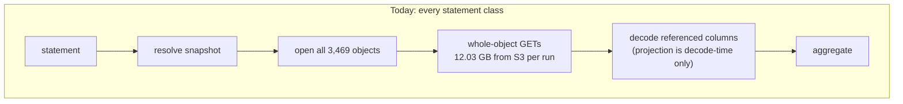
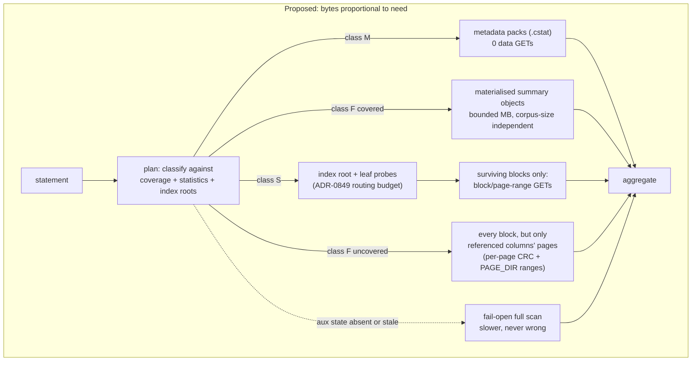

# Epic: cache-independent query performance

Ravel's good query numbers currently require the tenant's working set to fit
in the read cache. At petabyte scale that regime cannot exist, so the numbers
do not characterise a large tenant. This epic makes per-statement read cost
proportional to what the statement provably needs — matching blocks, the
columns it references, or a precomputed summary — never to corpus size. The
lever that has to work at scale is reading less, not caching more.

## The problem

Measured facts, each with its source in this tree:

- The ClickBench `hits` reference tenant (`clickbench-v4`) is 3,469 objects
  after L1 compaction (8,424 as loaded), 12.03 GB, 99,997,497 rows
  ([ADR-0849 context](../adrs/0849-snapshot-bound-index-plane.md)).
- **34 of 41 statements read every object and the entire 12.03 GB** on every
  run, because there is no index and no clustering (ADR-0849 context). A
  full-scan statement therefore costs 3,469 GETs and 12.03 GB of wire bytes
  per execution.
- With the cache smaller than the corpus, warm runs are byte-identical to
  cold ones: the AWS runbook states it as an operating rule — `--cache-bytes`
  "**must exceed the corpus.** Smaller and every run re-reads everything, so
  'warm' numbers are three cold runs"
  ([clickbench-aws-runbook.md](../guides/clickbench-aws-runbook.md), step 8).
  A `--runs 3` pass under an undersized cache is the same full-corpus read
  three times over.
- The published hot figures were produced with `CACHE_BYTES=25769803776` —
  a 24 GiB cache over the 12.03 GB corpus (same runbook, step 8). Every hot
  number we have was measured at a cache-to-corpus ratio above 1.
- The floor for anything touching the corpus is about 1.2 s on the reference
  box; hot totals over the 41 statements every system answered were
  ClickHouse 13.28 s, Ravel 91.79 s (ADR-0849 context).

At a petabyte, cache-to-corpus ratio is effectively zero for any full-scan
statement, so the production behaviour of the 34-statement class is the cold
column, always. The hot column measures a regime the product's stated target
cannot reach.

### What class of bug this is

- It is **not a correctness bug.** Queries complete; object storage is the
  source of truth and a cache miss is a GET
  ([object-store-contract.md](../object-store-contract.md),
  [ADR-0046](../adrs/0046-read-cache-tier.md)).
- It is **not an eviction-policy bug.** The cache evicts with S3-FIFO
  precisely so a compaction or scan pass cannot evict a query working set
  ([ADR-0046 decision 6](../adrs/0046-read-cache-tier.md),
  `crates/ravel-cache/src/s3fifo.rs` module doc). But scan resistance
  protects a *small* working set from a *large* scan. When 34 of 41
  statements each read the whole corpus, the working set *is* the corpus:
  there is no smaller reusable set for any policy to protect, and no
  eviction policy can manufacture reuse that the access pattern does not
  contain. At ratio < 1, some fraction of every full scan misses no matter
  what is kept; at ratio « 1, essentially all of it does. The policy is
  doing its job; the job is unwinnable for this access pattern.
- It **is a scalability-of-performance bug**: the only lever that currently
  produces good numbers is caching more, and that lever stops existing at
  scale. Requiring the corpus to fit in cache for acceptable latency is a
  design bug, not a tuning parameter.

## Relationship to ADR-0849

**This epic is a distinct parent concern. The
[ADR-0849 index plane](../adrs/0849-snapshot-bound-index-plane.md) is one
mechanism among several, not the epic re-framed.** The evidence is
ADR-0849's own honest accounting (its Consequences table): of the 41
statements, 4 become metadata-answerable, 8 become pruning-proportional, 4
may move by an unmeasured amount, and **25 do not move at all** — the
`COUNT DISTINCT`, high-cardinality `GROUP BY`, SELECT-list arithmetic and
regexp statements, "where the hot-total gap against ClickHouse actually
lives" in the ADR's own words. Those 25 are exactly the statements whose
performance today depends entirely on the cache, and ADR-0849 explicitly
does not attempt them ("rollups are item 5 and are a different mechanism";
`SUM`/`AVG` over the corpus "still scans"). An epic that stopped at the
index plane would leave the majority class cache-dependent and the brief
unanswered.

What ADR-0849 got right, and this epic builds on rather than re-proposes:

- The diagnosis: the cost floor is bytes moved, not CPU ("moving fewer bytes
  is worth more than moving bytes faster"; the flat profile, sip hash at
  8.30% before and 8.44% after a correct hash change).
- The index plane for the selective class, with the snapshot-bound pack
  lifecycle, the routing budget, and the "slower, never wrong" safety lemma.
- The per-object-sidecar rejection (§2): any mechanism this epic adds is
  checked against the same constraint.
- The honest per-statement count that makes this epic's scoping possible.

What its scope misses about the cache-independence framing:

- **The 25-statement full-value class.** ADR-0849 removes the scan where a
  statement did not need every row. It has nothing for statements that
  genuinely consume every row's value, and those are the majority and the
  gap.
- **The measurement regime.** ADR-0849's acceptance figures are stated
  against competitor hot totals and the existing bench methodology, which
  produces hot numbers only at cache-to-corpus ratio > 1
  ([clickbench.md](../guides/clickbench.md), "Reading a report against
  ClickBench"). Nothing in flight pins any figure at ratio ≤ 1, so nothing
  currently falsifies a cache-dependence regression. This epic's target
  (below) is stated at ratio 0.
- **Projection-proportional wire cost.** ADR-0849 §1b uses the existing
  page directory to read less of an *opened candidate* object, which serves
  the selective class. For the full-value class, every block survives, and
  today a surviving block is fetched whole — all ~105 columns' pages — even
  when the statement references two of them
  ([ADR-0107](../adrs/0107-pruning-proportional-logs-fetch.md) scope
  correction: column-level fetch savings are not available today because
  pages carry no per-page checksum). That gap belongs to this epic.

Nothing in ADR-0849 is judged *wrong* by this framing; it is incomplete
relative to a brief it was not written against. Its priority is unchanged
by this epic and its wave 0 remains its own.

## Statement classes on the reference corpus

The 41 ClickBench statements every system answered, partitioned by what
the statement provably needs (counts from ADR-0849's Consequences table;
statement ids per [clickbench.md](../guides/clickbench.md)):

| class | count | statements | what the statement needs |
|---|---|---|---|
| M — metadata-decomposable | 4 | q01, q02, q07, q08 | exact counts / min/max / bounded dictionaries already summarised at fold time |
| S — selective | 12 | q20, q21–q24, q37–q43 | the rows matching a predicate: 0.8% of blocks for q37–q43 ([ADR-0815](../adrs/0815-clustered-compaction-and-object-pruning.md) context table), one value's postings for q20 |
| F — full-value | 25 | the rest | every row's value for the columns the statement references (typically 1–5 of ~105) |

Class M and S are ADR-0849's territory. Class F is what this epic adds
mechanisms for, plus the target and measurement regime that cover all
three.

## The target

Falsifiable form, pre-registered here per the repository's measurement
discipline. **Regime: cache-to-corpus ratio 0** — `sql_latency_bench`
with `--cache-bytes 0` (no cache attached, byte-for-byte the pre-cache
fetcher per [clickbench.md](../guides/clickbench.md) step 5) — on the
`clickbench-v4` reference tenant (3,469 objects, 12.03 GB post-compaction).
Ratio 0 is the strictest ratio; a target that holds there holds at every
ratio, and it is the ratio a petabyte tenant's full scans effectively see.
All byte figures below are **wire bytes as transferred** (the existing
`object_store_bytes` counter), retries included, per statement, cold run.

1. **Class M: exactly 0 data GETs per statement.** Assertable today for
   q01 (`crates/ravel-sql/tests/logs_count_from_stats.rs` proves the
   mechanism); q02/q07/q08 on [ADR-0850](../adrs/0850-logs-typed-column-statistics.md)
   landing. Band: GET count present exactly once in the report and equal
   to 0.
2. **Class S: wire bytes ≤ 5% of corpus bytes (≤ 600 MB) and data GETs
   ≤ 5% of object count (≤ 174) per statement.** Grounding: q37–q43 keep
   144 of 17,731 blocks (0.81%) yet today read 2.1 GB of 11.1 GB and open
   100% of objects (ADR-0815 context table, pre-compaction geometry); the
   5% band is 6× the surviving-block share, leaving room for index probes,
   directory reads, and coalescing waste while still falsifying
   "proportional to corpus". Index-probe GETs are counted in their own
   phase per ADR-0849's routing budget and are additionally bounded by it.
3. **Class F, uncovered (ad-hoc) statements: fetch amplification
   ≤ 1.25.** Defined as `page_bytes_fetched / page_bytes_decoded` — stored
   bytes of pages present in fetched blocks over stored bytes of pages the
   statement actually decoded after column projection (the accounting pair
   [ADR-0107 decision 4](../adrs/0107-pruning-proportional-logs-fetch.md)
   defines). A statement referencing 2 of ~105 columns must not pay for
   105. **This figure is not measurable today**: the accounting pair is
   specified but not shipped, and no per-column stored-byte split is
   published anywhere in this tree. The pass that produces it is task T1
   below; the 1.25 band is provisional until T2's baseline pass and is
   re-registered on the epic issue before the acceptance run.
4. **Class F, covered (materialised) statements: wire bytes ≤ 64 MiB per
   statement, independent of corpus size.** This is the only target of
   the form "cost no more than Z absolute", and it is the point of
   materialisation: the read is proportional to the summary, not the data.
   The 64 MiB figure is a design budget for the materialisation ADR (task
   T5) to meet or formally revise, not a measurement; no materialised
   state exists yet to measure.
5. **Cache-independence check: a second pass at ratio 1/8
   (`--cache-bytes 1610612736`, 1.5 GiB over 12.03 GB) must report Class
   S and F cold-run wire bytes within ±10% of the ratio-0 pass.** This
   falsifies hidden cache dependence in whatever lands: if a mechanism
   only works because the cache absorbed its probes, this pass catches it.

How measured: the existing harness and report
([clickbench.md](../guides/clickbench.md) steps 5 and "How to read the
report"), per-statement `scan` and `per_run_accounting` blocks, with the
band assertions added to the runbook's `analyse.py` so a miss fails the
pass mechanically rather than by eye. Comparability per the runbook's
checklist (same box, same `fetch_concurrency`, provenance recorded).

What is missing to make all of this measurable today, named per the
brief: (a) the `page_bytes_fetched`/`page_bytes_decoded` pair (T1);
(b) a per-statement class label in the checked-in corpus so the analyse
script can assert per-class bands (T2); (c) any materialised state (T5/T6).

## Candidate mechanisms

Each with what it buys, what it costs, and — decisive for this epic —
which class it helps. A mechanism that only helps Class S does not, by
itself, address the brief.

### 1. Indexing (ADR-0849 index plane: point and gram postings)

- **Buys:** Class S proportionality — q20 proportional to matching blocks,
  q21–q24 bounded by gram candidates. Real justification is telemetry
  point lookup and log substring search (ADR-0849's own framing).
- **Costs:** pack storage and fold time; the wave-0 `HEAD`/sweeper
  lifecycle work; routing-budget enforcement; a backfill pass for existing
  data.
- **Class:** S only. Explicitly does not touch Class F (ADR-0849
  Consequences: 25 untouched).

### 2. Pruning from statistics already written (ADR-0850 `.cstat`, ADR-0093 skip-index pushdown, block min/max)

- **Buys:** Class M (q02/q07/q08 at zero data GETs) and the q37–q43 arm of
  Class S (block-granular `NumStat` pruning already keeps 0.81% of
  blocks). Cheapest mechanism per statement moved; ADR-0850 is accepted.
- **Costs:** one extra decode pass per fold for declared columns, one
  small object per fold; the dictionary cardinality ceiling bounds which
  columns get exact value counts.
- **Class:** M and S. Nothing for F.

### 3. Clustering (ADR-0815, companion not substitute)

- **Buys:** object-level pruning for Class S — the surviving 0.8% of
  blocks gathered into ~0.8% of objects instead of scattered across 100%
  of them. On this corpus the effective key is `CounterID` (the deferred
  override-key path); EventTime-leading clustering is a *pre-registered
  regression* for q37–q42 on this corpus (ADR-0849 §6 negative control)
  and is justified only by organic telemetry.
- **Costs:** compaction rewrite cost; the external-sort machinery ADR-0849
  rejected sequencing first; per-corpus key choice.
- **Class:** S only.

### 4. Projection narrowing (partly shipped; the wire-level half is not)

- **Shipped:** decode-time projection
  ([ADR-0093](../adrs/0093-typed-column-pushdown-logs.md) typed columns,
  [ADR-0774](../adrs/0774-topk-late-materialization-logs-scan.md) TopK
  late materialisation) — fewer bytes *decoded*, same bytes fetched.
  Block-range fetch (ADR-0107) makes bytes proportional to surviving
  *blocks*, which helps Class S and does nothing for Class F where every
  block survives.
- **Not shipped, and the biggest Class-F lever:** column-page-range fetch.
  RLOG v4 stores independently compressed column pages with a `PAGE_DIR`,
  but a page carries no per-page checksum, so fetching a sub-block page
  range would be an unverified partial read; ADR-0107 correctly refused
  that and named the fix: an additive per-page-CRC section (RSEG
  precedent, [segment-format.md](../segment-format.md); additive optional
  section per ADR-0029, **no version bump, no dual-reader window**).
- **Buys:** for a Class-F statement referencing c of ~105 columns, wire
  bytes proportional to those c columns' pages instead of the whole
  corpus. This is what target 3 measures.
- **Costs:** a new ADR plus format-change procedure for the additive
  section; savings apply only to newly written or compacted objects (a
  recompaction pass covers the reference tenant); fetch fan-out becomes
  many small ranges, so GET count and coalescing need the same crossover
  discipline the block fetcher has.
- **Class:** F (primary) and S (secondary, on top of block pruning).

### 5. Aggregate pushdown (ADR-0103 and DataFusion partial aggregates)

- **Buys:** distributes aggregation CPU and memory across workers
  (ADR-0103's order-insensitive subset), and fixes coordinator ceilings
  (ADR-0094 parallel final aggregation moved five pool-exhausted
  statements to completion).
- **Costs / limit:** it does not reduce bytes read from object storage by
  a single GET — every worker still fetches its slice of the corpus. It
  scales *who pays* the read cost, not the cost.
- **Class:** neither, for this epic's target. Named here so nobody
  proposes it as the answer to the byte floor; it composes with
  everything above.

### 6. Pre-aggregation / materialisation (the Class-F mechanism)

- **Buys:** the only mechanism that removes the byte floor for statements
  that genuinely consume every row's value. A `GROUP BY UserID COUNT(*)`
  over 100M rows becomes a read of a precomputed, mergeable summary
  object measured in MB, at any corpus size — target 4's absolute bound.
  ADR-0849 names rollups as "item 5, a different mechanism"; this epic is
  where that mechanism gets its design.
- **Costs:** the largest of any mechanism here. Storage for materialised
  state; a build pipeline with the same snapshot-binding, lifecycle, and
  `HEAD`-reference discipline ADR-0849 §1a establishes for index packs
  (a summary object no `HEAD` names gets reaped); exactness rules — the
  workspace invariant is exact semantics by default, so a materialised
  `COUNT DISTINCT` must be an exact mergeable state (per-part exact sets
  or an exact-until-threshold structure), never a sketch, or the
  statement falls back to scanning; the erasure-epoch constraint list
  from ADR-0849 §5 applies verbatim, because a materialised count served
  after an acknowledged erasure is the same wrong answer as a stale
  `.istat`; and a coverage model — materialisation answers *covered*
  shapes, and an ad-hoc statement it does not cover falls back, so it
  helps repeated/known workloads, not arbitrary novel SQL. That
  limitation is stated rather than hidden: Class F splits into covered
  (target 4) and uncovered (target 3), and both targets must hold.
- **Class:** F (covered shapes). Also subsumes Class M as a degenerate
  case (ADR-0850's `.cstat` is a per-segment materialisation of
  count/min/max/dictionary; the design should extend that shape, not
  invent a rival one).

### Composition

Statistics answer M; postings, statistics pruning, and (per-corpus)
clustering shrink S to matching blocks; per-page CRC plus column-page
fetch shrink what any opened block costs, which is the F floor for
ad-hoc statements; materialisation removes the floor for covered F
shapes. Every mechanism keeps the fail-open shape: absent, stale, or
version-mismatched auxiliary state degrades to scanning, never to a
wrong answer (ADR-0849 §3, ADR-0850 safety lemma).

## Read path today versus proposed

Where the bytes come from for one statement over the reference tenant.

## Out of scope, and why

- **Cache sizing and eviction tuning.** Argued, not asserted: S3-FIFO's
  scan resistance protects a small working set from a large scan
  (`crates/ravel-cache/src/s3fifo.rs`); when 34 of 41 statements each
  read the whole corpus, the working set is the corpus and there is no
  smaller set to protect — no admission or eviction policy can create
  reuse the access pattern lacks. At petabyte scale the ratio tends to
  zero and full-scan hit rates go with it regardless of policy. Tuning
  the cache optimises the regime this epic exists to stop depending on.
  The cache itself stays: it is the right mechanism for index roots,
  footers, metadata packs, materialised summaries, and tenants whose
  working set genuinely is small — every proposed mechanism makes the
  cache more effective per byte by shrinking what needs caching.
- **CPU optimisation.** ADR-0849's context closes this: a correct hash
  change moved `core::hash::sip` from 8.30% to 8.44%, the on-CPU profile
  is flat, and the independent review concluded moving fewer bytes beats
  moving bytes faster on this box.
- **Distributed fan-out as the answer.** ADR-0071/0103 divide the read
  cost across workers; total bytes from object storage are unchanged.
  Paying the same S3 bill faster is not cache independence.
- **Approximate answers** (sketches, sampled aggregates). The workspace
  invariant is exact semantics by default with approximation opt-in and
  visible; every mechanism here is exact-or-fallback, matching ADR-0849
  §5 and ADR-0850. An opt-in approximate surface would be its own epic
  with its own visibility design.
- **Re-scoping ADR-0849 itself.** Its waves, lifecycle gates, and
  acceptance criteria stand as written; this epic depends on parts of it
  and adds nothing to its internals.

## Tasks

Shape per the repo's epic convention: ID, title, crates, deps, size,
acceptance. ADR-0849's own tickets are referenced as external
dependencies, not duplicated here.

| ID | title | crates | deps | size | acceptance |
|---|---|---|---|---|---|
| T1 | Ship ADR-0107 decision 4 accounting: `page_bytes_fetched` / `page_bytes_decoded` on `QueryAccounting`, per-phase, byte-kind named | ravel-types, ravel-query, ravel-logseg | — | S | a test pins the pair for a fixture statement with known page geometry; figures appear exactly once per phase in the bench report |
| T2 | Class-labelled corpus + band assertions: add M/S/F class to `benchmarks/clickbench/hits.corpus.json` entries, extend the runbook analyse script to assert per-class bands; run the ratio-0 baseline pass and pre-register final bands on this epic's issue | ravel-bench | T1 | S | analyse script exits non-zero on any band miss; baseline report checked into the epic issue with bands beside figures |
| T3 | Per-page CRC additive RLOG section (ADR + format-change procedure; additive section per ADR-0029, no version bump) | ravel-logseg | T2 evidence | M | format doc updated in the same commit; property tests: corrupt page fails typed, old reader ignores section |
| T4 | Column-page-range fetch: extend the ADR-0107 block fetcher to page-range GETs when the per-page CRC section is present; per-page cache admission; coalescing crossovers measured | ravel-query, ravel-cache | T3 | M-L | target 3's amplification band holds on a recompacted fixture; corrupt-hit gate passes on page-keyed entries |
| T5 | Materialisation design ADR: coverage model, exact mergeable states, snapshot binding + `HEAD` lifecycle (ADR-0849 §1a discipline), erasure-epoch interaction (§5 constraint list), storage budget, covered-shape list for the reference corpus | docs only | T2 | L (design) | ADR approved; names which of the 25 Class-F statements are covered and target 4's budget confirmed or revised |
| T6 | Materialisation build + read path: fold/compaction-side build, planner selection with fail-open fallback, safety-lemma tests | ravel-catalog, ravel-sql, ravel-query | T5 | XL | covered statements answer within target 4's budget at ratio 0; stale/absent state falls back with a test per failure mode |
| T7 | Recompaction pass for the reference tenant (per-page CRC coverage + any T5-required carriers), then the full acceptance pass: ratio-0 and ratio-1/8 runs, published table with the comparability checklist | ravel-bench, docs | T4, T6 | M | all five targets green in the asserted analyse run; both passes' provenance published side by side |

External dependencies: ADR-0849 wave 0 (`HEAD`/sweeper lifecycle) and its
backfill/carrier decision gate T5's lifecycle sections (same discipline,
ideally same carrier); ADR-0850 landing gates target 1 for q02/q07/q08.
Neither is a task of this epic.

## Open questions

A human decides these before the corresponding task starts:

1. **Materialisation coverage source** (gates T5): are covered shapes
   declared per tenant (the `typed_attr_columns` precedent), derived from
   observed workload, or fixed per signal? Declared is simplest and
   matches the repo's opt-in posture; workload-derived is a much larger
   design.
2. **Exact `COUNT DISTINCT` state** (gates T5): an exact mergeable
   distinct-count state over 10^7+ cardinality has real size. Is
   exact-until-threshold-then-fallback acceptable, and what threshold?
   (Approximate is off the table per the invariant; the question is where
   exactness stops being materialisable.)
3. **Storage budget** (gates T5/T3): what fraction of a tenant's live
   bytes may auxiliary state (index packs + statistics + materialised
   summaries + per-page CRC sections) consume? ADR-0849 pre-registers
   pack-cost bands but no global ceiling exists anywhere.
4. **Published-number policy** (gates T7): do we keep publishing hot
   figures measured at cache-to-corpus ratio > 1, and if so, does every
   published table carry a ratio-0 column beside them? Recommendation:
   yes to both — hot numbers are real for small tenants, and the ratio-0
   column is what this epic is accountable to.
5. **Class-F ad-hoc floor acceptance** (gates the epic's definition of
   done): for an uncovered statement over c wide columns (regexp over
   `URL`), the floor after T4 is still proportional to those columns'
   bytes across the corpus. Is that accepted as the honest end state for
   ad-hoc full-value SQL at scale, with anything better requiring
   coverage (T5/T6)? This epic says yes; a human should confirm.
6. **Recompaction cost on real tenants** (gates T7 beyond the reference
   tenant): per-page CRC coverage arrives only with rewrite. Is a
   dedicated maintenance rewrite pass acceptable, or does coverage wait
   for organic compaction?

## Ledger

(empty — filled per wave at dispatch)
