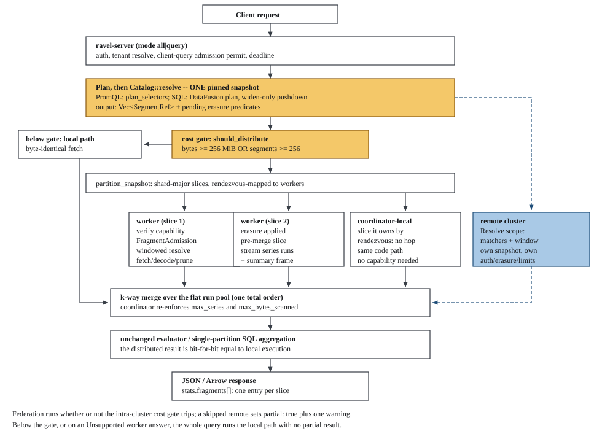
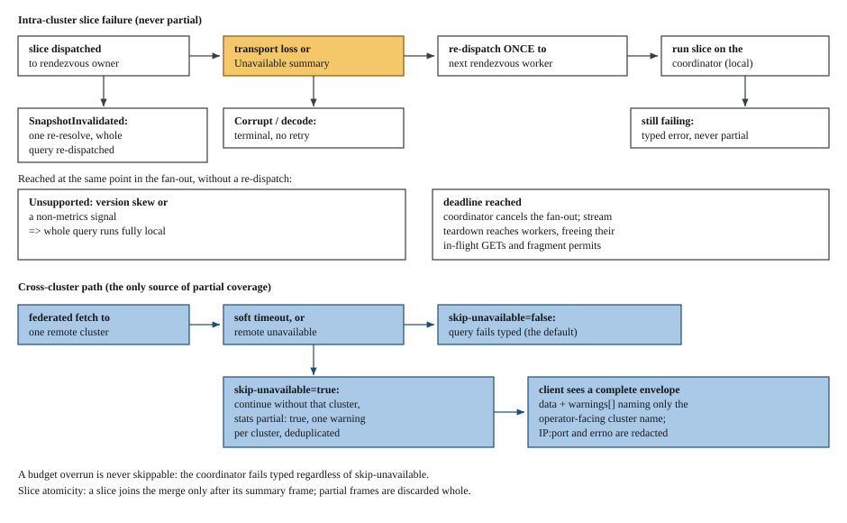

# Distributed query and cross-cluster federation

Ravel can serve one read with more than one process, and it can serve one read
from more than one cluster. Both are off by default and both need explicit
configuration: intra-cluster fan-out needs `--distributed-query` together with
`--fragment-key-file`, and federation needs at least one `--remote-cluster`.
This guide is the operator and user view: when distribution engages, how to
turn it on, what a client sees, and what happens when something fails.

Two scope limits before anything else. On the engine's own fan-out lane only
the metrics signal distributes: a slice for logs or spans is answered
`Unsupported` and the whole query runs on the coordinator. The SQL lane has a
separate distributed scan, installed on the Flight SQL service, so it exists
only in a build carrying the `flight-sql` cargo feature, which no published
image builds.

For the engine-internal specification (slice partitioning, the merge order,
the budget re-enforcement rules, the credential model) read
[query-engine.md](../query-engine.md#intra-cluster-read-fan-out-adr-0071).

Contents:

- [What distribution does, and what it does not do](#what-distribution-does-and-what-it-does-not-do)
- [When it engages: the cost gate](#when-it-engages-the-cost-gate)
- [The lifecycle of a distributed query](#the-lifecycle-of-a-distributed-query)
- [Turning it on](#turning-it-on)
- [The worker registry and heartbeat](#the-worker-registry-and-heartbeat)
- [Cross-cluster federation](#cross-cluster-federation)
- [Reading `stats.fragments[]`](#reading-statsfragments)
- [Metrics](#metrics)
- [Failure behavior](#failure-behavior)
- [What is not distributed](#what-is-not-distributed)

## What distribution does, and what it does not do

Distribution changes **where bytes are fetched and decoded**, never **what a
query computes**. A distributed result is bit-for-bit identical to the result
the same query would produce on one process, over any corpus and any slice
partition.

Concretely:

- The query node that receives a request is that query's **coordinator**. This
  is a per-query role, not a process type: every node is a coordinator for the
  requests it receives and a worker for its peers' slices. There is no
  scheduler process, no leader, and no assignment object.
- The coordinator resolves **one** pinned snapshot, exactly as a single-process
  query does, and ships explicit segment identities to workers. Workers never
  resolve their own snapshot for an intra-cluster slice, so a distributed query
  reads exactly one consistent view of the data.
- Workers fetch, decode, matcher-prune, apply erasure predicates, and pre-merge
  their slice. They do not aggregate and they do not evaluate.
- The coordinator k-way merges every slice under the existing total order and
  then runs the unchanged PromQL evaluator, or the unchanged single-partition
  SQL aggregation.

What does not move: aggregation, evaluation, and the authoritative
cross-segment deduplication. Those stay on the coordinator, which means the
coordinator is still the ceiling for a query whose cost is dominated by final
aggregation over very high cardinality. Distribution buys you more NICs, CPUs,
and page cache for the fetch and decode phase, which is where a large query
spends its time.

## When it engages: the cost gate

Distribution is cost-gated, so a cheap query never pays for the machinery. The
coordinator computes the same pre-execution `CostEstimate` the accounting layer
already produces over the resolved snapshot, and distributes only when the
estimate reaches **either** threshold:

| Axis | Flag | Default |
|---|---|---|
| Estimated store bytes | `--distribute-bytes-threshold` | 256 MiB (268435456) |
| Segment count | `--distribute-segments-threshold` | 256 |

Either axis alone trips the gate; a query below both runs the fully local path,
byte-identical to a build without the flag. A third flag,
`--max-parallel-slices` (default 8), caps how many slices one query fans out
into, and therefore how many concurrent remote fetches it can start.

The defaults are deliberately conservative. On a zero-latency store the
fan-out is pure overhead; it pays off when object-store latency, not CPU, is
the bound. Tune both thresholds against your own store before leaving the
defaults in place.

## The lifecycle of a distributed query



## Turning it on

Distribution is enabled per query node, and the two flags below are a pair:
either without the other fails startup rather than exposing an
unauthenticated fetch surface or leaving a configured secret inert.

```sh
# On every query-serving node in the cluster (same key file everywhere).
ravel-server --mode all \
  --listen-http 0.0.0.0:4318 \
  --listen-grpc 10.0.0.11:4317 \
  --distributed-query \
  --fragment-key-file /etc/ravel/fragment.keys
```

- `--distributed-query` opts this process in. In `--mode all` or
  `--mode query` it does two things at once: it registers the internal
  `SeriesFetch` fragment service on the cluster-internal gRPC listener, and it
  makes the process a coordinator that may fan a large query out. Other modes
  ignore it (no query surface, nothing to distribute).
- `--fragment-key-file` names the cluster fragment key file. It is not a
  bearer-token file: it is a list of 32-byte keys, one per non-empty line,
  each line exactly 64 hex characters. Blank lines and lines starting with `#`
  are ignored. A file with no key line, or a line that is not exactly 64 hex
  characters, fails startup rather than padding or truncating a wrong-length
  key into place. A file, never an inline value or an environment variable, so
  the key never appears in a process listing. **Every node in one cluster must
  read the same key set.**
- `--listen-grpc` is required in practice. By default the fragment surface is
  bound only on the cluster-internal gRPC listener, never on the client HTTP
  listener and never on the mTLS listener. A node with no gRPC listener never
  registers itself as a worker, so every slice of every query runs
  coordinator-local. That is correct, just not distributed.
- `--max-inflight-fragments` (default 32) caps how many inbound slice fetches
  this process serves concurrently for other coordinators. This is a **distinct
  admission class** from `--max-concurrent-queries`: a coordinator holding a
  client-query permit while it waits on its own dispatched fragments can never
  deadlock behind client queries queued on the client cap. Over the cap a
  fragment request queues; it is not rejected.

### How a slice fetch is authorized

The fragment keys are not presented on the wire. Each key is a MAC key, and
what crosses the hop is a capability the coordinator mints per query:

- The capability is a fixed-width claim set followed by a keyed-BLAKE3 MAC over
  those claims. The claims name one tenant hash, one signal, one query id, and
  an absolute expiry, which the coordinator sets to that query's own deadline.
- The coordinator mints under the **first** key in the file and attaches the
  capability to the request body of every slice of that query, including a
  re-dispatch. Minting is deterministic in key and claims, so every slice of
  one query carries byte-identical bytes and there is no per-slice bookkeeping.
- A worker verifies statelessly: it recomputes the MAC over the presented
  claims and compares it in constant time against **every** key it has
  configured, checks the expiry against its own clock, and then requires the
  request's own tenant hash, signal, and query id to equal the claims. No store
  read, no cache, no coordination. A capability minted for one tenant therefore
  cannot authorize a fetch that names another, and one minted for one query
  cannot authorize another query.
- Every rejection is one of five typed reasons (missing, bad MAC, expired,
  tenant mismatch, query mismatch), counted per reason inside the process, and
  returned to the coordinator as gRPC `Unauthenticated`.
- The slice a coordinator owns by rendezvous runs in-process on the same code
  path and mints nothing: there is no hop to authorize.

Because verification accepts a MAC under any configured key while minting uses
only the first, **rotation needs no flag day**. Append the new key as a second
line and roll the fleet: every node now verifies both, and coordinators still
mint under the old one. Then move the new key to the first line and roll again:
coordinators mint under the new key, which every node already verifies. Then
delete the old line and roll a third time. At no point in that sequence is a
node presented a capability it cannot verify.

A stale key set on one node is not silent, but it does not show up where you
might look first. The worker's `Unauthenticated` reaches the coordinator as a
transport-class failure, so the slice is re-dispatched to the next rendezvous
worker, that endpoint is quarantined, and the slice ends up running
coordinator-local. Watch `ravel_distrib_slices_redispatched_total`,
`ravel_distrib_slices_fallback_total`, and
`ravel_distrib_quarantine_marks_total`, plus the coordinator's `warn` log
naming the endpoint. The per-reason capability reject counters are kept
in-process and are not rendered on `/metrics`.

Keep the cluster-internal gRPC listener off any network a client can reach. A
capability authorizes a read of one tenant's pinned segments for the lifetime
of one query, which is less authority than the bucket credentials every process
already holds, but it is still authority.

### Putting the fragment surface on its own TLS listener

By default the fragment service shares the cluster-internal gRPC listener with
`Resolve`-scope federation traffic and with Flight SQL. `--fragment-listener
<addr>` moves the `Pinned` fragment scope onto a fourth listener that
terminates TLS in-process and serves nothing else. When it is set:

- The public gRPC listener stops serving the `Pinned` scope entirely.
  `Resolve` (federation, under ordinary tenant credentials) stays there, and
  the dedicated listener rejects `Resolve` outright.
- All three of `--fragment-tls-cert`, `--fragment-tls-key`, and
  `--fragment-tls-ca` are required, and the address must differ from every
  other listener. The certificate must carry a `ravel-fragment` dNSName
  subject alternative name, the one fixed name every coordinator verifies
  against. Ravel mints no certificates; the operator provisions them, and
  rotation is a rolling restart.
- The CA is dedicated to this surface, so any certificate it signed means "a
  fragment worker of this cluster". Per-process certificate identity is
  deliberately not required: the capability, not the certificate, is the
  authorization.

Without the flag the fragment surface stays on the public gRPC listener, so
distribution keeps working through a rolling deploy that adds it.

Adding capacity is adding processes. A new node with the same flags and the
same bucket appears in the live worker set within one heartbeat interval and
starts receiving slices; a removed node ages out of it. There is nothing to
rebalance and no state to drain.

## The worker registry and heartbeat

Membership needs no new durable state and no consensus. Each distributed query
node writes one object it alone ever writes:

```
sys/query/workers/<process_id>
```

The record is a small JSON control-plane payload carrying the process id, the
`fragment_endpoint` (`host:port` of its cluster-internal gRPC listener), the
`queryfrag` protocol version it speaks, and a liveness timestamp re-stamped on
every beat. The write is an unconditional overwrite: one writer per key, no
compare-and-swap, no contention. This is the same pattern `maintain` mode
processes already use for their own heartbeats.

On the same cadence (`H` = 60 s by default) every node lists the prefix and
refreshes its view. The **live set** is itself plus every sibling whose stamp
is within `3 * H` of the reader's own clock, in either direction: a stuck
future-dated record drops out just like a stale past-dated one. Worker
identity comes from the key, not the record body, so a record whose body
disagrees with its key cannot smuggle a false identity into the live set.

To place a slice, the coordinator rendezvous-hashes the slice's
`(tenant_hash, signal, shard)` unit over the live set and takes the top owner,
then the next, and so on, giving a deterministic failover order. Two
consequences an operator should expect:

- **Cache affinity for free.** The same shard of the same tenant lands on the
  same worker as long as membership is stable, so the per-process
  content-addressed read caches behave as one aggregate cache. Segments are
  immutable, so there is no invalidation protocol.
- **Version skew costs nothing.** Workers whose advertised protocol version
  differs from the coordinator's are dropped at routing time, before any
  dispatch. During a rolling upgrade a coordinator sees fewer eligible
  workers, and in the limit runs everything locally.

Until the first heartbeat cycle completes after startup, a node sees an empty
live set and runs every slice locally. Expect a distributed cluster to take up
to one heartbeat interval after a restart to start fanning out again.

## Cross-cluster federation

Federation is the other half of distributed reads: a coordinator asks
**independent Ravel clusters**, separate buckets and separate trust domains, to
each resolve their own snapshot, and merges what they return into the same pool
its own selectors feed. It is configured per remote, is independent of the
intra-cluster cost gate (a federated query federates whether or not it also
fans out locally), and is entirely absent from a deployment that configures no
remotes.

```sh
ravel-server --mode query \
  --listen-http 0.0.0.0:4318 \
  --listen-grpc 10.0.0.11:4317 \
  --distributed-query \
  --fragment-key-file /etc/ravel/fragment.keys \
  --remote-cluster name=eu,endpoint=eu.internal:9443,credential-file=/etc/ravel/eu.token,tls-ca-file=/etc/ravel/eu-ca.pem,skip-unavailable=true \
  --remote-cluster name=apac,endpoint=apac.internal:9443,credential-file=/etc/ravel/apac.token,soft-timeout=15s \
  --remote-cluster-soft-timeout 10s
```

`--remote-cluster` is repeatable, once per remote, and its value is a
comma-separated `key=value` spec:

| Key | Required | Meaning |
|---|---|---|
| `name` | yes | The cluster's stable operator-facing label. This is the only identity a client ever sees for the remote (in `warnings`). |
| `endpoint` | yes | `host:port` of the remote's fragment surface. |
| `credential-file` | yes | File holding the bearer token this coordinator presents to that remote. |
| `tls` | no | `true` or `false`, default `true`. Those two literals only; any other value fails startup with a message naming it. |
| `tls-ca-file` | no | CA bundle for the remote's server certificate. A spec carrying this key and no `tls` key means TLS is on with that CA trusted, and is accepted. Only the explicit `tls=false` alongside a CA file fails startup, because there the bundle would be inert. |
| `skip-unavailable` | no | `true` or `false`, default `false`. Same two literals only. |
| `soft-timeout` | no | Per-remote override of `--remote-cluster-soft-timeout`. |

TLS is on unless a spec says `tls=false`. That escape hatch exists for a hop
already encrypted at a lower layer; it sends the operator credential, the
query, and every result stream in cleartext, and startup logs a security
warning naming the remote.

`--remote-cluster-soft-timeout` sets the default bound for every remote
(default 10 s) as a humantime duration (`10s`, `500ms`). A remote that has not
answered within its bound is treated as unavailable.

Every one of these is validated at startup, not at the first federated query:
a malformed spec, an unknown key, a `tls` or `skip-unavailable` value that is
not `true` or `false`, a duplicate cluster name, `tls=false` next to a
`tls-ca-file`, a zero soft timeout, or an unreadable or empty credential file
all fail the process before it binds a listener.

### What crosses the boundary, and what does not

A federated request carries **matchers, a time window, and budgets**, never
segment references and never object-store credentials. The remote resolves its
own snapshot over that window and runs it through its ordinary query path, so
it enforces its own admission limits, its own tenancy hashing, its own
selective-erasure predicates, and its own budgets.

The credential is an **operator** secret, and the tenant the remote serves is
derived from that credential by the remote's own resolver chain. A coordinator
cannot name a tenant on a remote: whatever `tenant_hash` sits on the wire is
overwritten with the locally resolved value, never read. The calling client's
own credential is never forwarded across a cluster boundary. A fragment
capability is never a federation credential either: a remote runs its ordinary
tenant resolver chain over the request metadata, and a capability is not in any
tenant registry.

`RemoteClusterConfig`'s debug formatting prints `credential: <redacted>`, so a
config dump or a panic message never leaks the operator secret.

Both the value-bearing endpoints (`/api/v1/query`, `/api/v1/query_range`) and
the discovery endpoints (`/api/v1/series`, `/api/v1/labels`,
`/api/v1/label/<name>/values`) federate, through the same coordinator and with
the same semantics.

### What a client sees when a remote is degraded

With `skip-unavailable=false` (the default), a remote that fails or times out
fails the whole request with a typed error. With `skip-unavailable=true` the
query continues without that cluster and says so, in two places at once:

```json
{
  "status": "success",
  "data": { "resultType": "vector", "result": [] },
  "warnings": [
    "remote cluster eu unavailable; results are partial"
  ]
}
```

and, in the query's stats block, `partial: true`. Warnings name only the
operator-facing cluster name; the remote's IP:port and errno are redacted,
because a client reading the envelope is not entitled to the coordinator's
internal topology. Warnings are deduplicated, so a multi-selector request that
federates once per selector still reports one warning per skipped cluster.

Two behaviors worth knowing:

- **A budget overrun is never skippable.** The coordinator re-enforces
  `max_bytes_scanned` over the folded remote spend and fails typed regardless
  of `skip-unavailable`. A budget cap is a correctness bound, not an
  availability property.
- **A malformed frame is never skippable.** A remote's response that fails to
  decode (including a corrupt native-histogram frame) is treated as
  corruption, not availability, and fails typed regardless of
  `skip-unavailable`. Version skew is the only histogram-related coverage
  gap: a remote at a different `PROTOCOL_VERSION` answers `Unsupported`
  before it ever encodes a frame, and that is skippable.

Federation assumes each cluster owns a **disjoint** slice of series identity.
The intended deployment is region- or tenant-sharded, so one series lives in
exactly one cluster. If the same series and timestamp arrive from two clusters
with different values, the merge still emits exactly one sample per timestamp,
but which cluster wins is unspecified, because the provenance fields the total
order tie-breaks on are only comparable within one cluster. The discovery
endpoints carry no such ambiguity (a series id is a canonical function of its
labels, so the cross-cluster union is a plain set union). See
[query-engine.md](../query-engine.md#cross-cluster-federation-adr-0071) for
the full statement.

## Reading `stats.fragments[]`

A distributed query's stats block gains one `fragments` array, with one object
per dispatched slice. The field is absent entirely on a query that did not
distribute, so its presence is itself the signal that fan-out happened.

```json
"stats": {
  "fragments": [
    { "workerEndpoint": "10.0.0.12:4317", "segmentCount": 41, "bytesReported": 189743104, "status": "ok" },
    { "workerEndpoint": "10.0.0.13:4317", "segmentCount": 38, "bytesReported": 174260224, "status": "ok" },
    { "workerEndpoint": "local", "segmentCount": 40, "bytesReported": 181403648, "status": "fallback" }
  ]
}
```

- `workerEndpoint`: where the slice actually ran. A slice the coordinator
  owned by rendezvous, or one that fell back, reports local execution rather
  than a peer's address.
- `segmentCount`: how many pinned segments the slice carried. Badly skewed
  counts across entries mean your ingest shards are unevenly sized; slices are
  cut shard-major and a shard is never split, so shard skew becomes slice skew.
- `bytesReported`: the store bytes that worker reported scanning, already
  folded into the query's own accounting total.
- `status`: `ok`, `fallback` (the slice ran on the coordinator after a remote
  attempt failed), or `error`.

A `fallback` entry is the single most useful diagnostic here: it means a peer
was unreachable or reported itself unavailable, the query still returned a
complete and correct result, and it cost more than it should have. Correlate
with `ravel_distrib_slices_fallback_total` and the worker's own logs.

Per-slice cardinality lives only in this response body, never as a metric
label.

## Metrics

`GET /metrics` renders the `ravel_distrib_*` family on any process with
distribution enabled, under the closed `mode` label alone (no per-shard,
per-worker, or per-tenant label). The family is absent entirely when
distribution is off.

| Metric | Type | What it tells you |
|---|---|---|
| `ravel_distrib_fragment_requests_total` | counter | Inbound slice fetches this process served for other coordinators. |
| `ravel_distrib_fragment_auth_failures_total` | counter | Inbound `Resolve`-scope federation requests whose presented credential did not resolve to a tenant. It does not count `Pinned` capability rejections: those are counted per reason in-process only, and reach the coordinator as re-dispatch and fallback. |
| `ravel_distrib_fragment_inflight` | gauge | Fragments in flight now. Riding at `--max-inflight-fragments` means inbound slices are queueing. |
| `ravel_distrib_slices_local_total` | counter | Slices this coordinator ran itself with no hop. |
| `ravel_distrib_slices_remote_total` | counter | Slices dispatched to a peer. |
| `ravel_distrib_slices_redispatched_total` | counter | Slices re-dispatched after a failed first attempt. |
| `ravel_distrib_slices_fallback_total` | counter | Slices that ended up running coordinator-local after remote attempts failed. |
| `ravel_distrib_slice_fetch_seconds` | histogram | Per-slice fetch latency, sharing the object-store histogram's bucket layout. |
| `ravel_distrib_quarantine_marks_total` | counter | Dead endpoints marked into the coordinator's quarantine map after a re-dispatchable dispatch failure. A jump after a node loss is expected; a steady climb means workers keep failing. |
| `ravel_distrib_quarantine_readmits_total` | counter | Quarantined endpoints readmitted by a strictly newer worker heartbeat (the recovered worker's own probe). |
| `ravel_distrib_quarantine_current` | gauge | Endpoints quarantined right now. Rides above zero for the ~2 heartbeat intervals a dead worker takes to readmit or age out. |

`slices_local_total` staying high while `slices_remote_total` stays at zero on
a multi-node cluster is the signature of a membership problem: no gRPC
listener, a clock skew wider than `3 * H`, or a protocol-version mismatch
during a partial upgrade. See [observability.md](observability.md) for how to
read the rest of the query cost families alongside these.

## Failure behavior

The rule behind every case below: **intra-cluster execution is
all-or-nothing.** A slice failure is retried, then absorbed locally, then
raised as a typed error. It is never turned into a partial merge. Only
cross-cluster federation can return partial coverage, and only when an
operator opted that remote into it.



What an operator will actually observe, case by case:

| Condition | Behavior | Visible as |
|---|---|---|
| A worker is unreachable, or the stream dies mid-slice | Re-dispatch once to the next rendezvous worker, then run the slice on the coordinator, then fail typed | `slices_redispatched_total`, `slices_fallback_total`, a `fallback` entry in `stats.fragments[]`, a `warn` log naming the endpoint |
| A worker answers `Unavailable` | Same sequence as unreachable | Same |
| A pinned segment vanished (concurrent GC or compaction) | The coordinator re-resolves the snapshot once and re-dispatches the whole query, not one slice; a second occurrence fails | The same single-retry behavior a local query already has |
| A worker reports a corrupt segment, or a frame fails to decode | Terminal immediately: no retry, no local fallback | Typed error; a retry would mask real corruption behind a clean local read |
| A budget trips on a slice, or on the folded total | The same typed `TooManySeries` / `TooManyBytesScanned` a local query raises | HTTP 4xx with the usual budget error |
| The query deadline is reached | The coordinator cancels the fan-out; stream teardown reaches the workers and drop-based cancellation frees their in-flight GETs and fragment permits | Normal deadline error; no leaked permits |
| Protocol version skew during a rolling deploy | Skewed workers are dropped at routing time, so a mismatch costs no round trip; if none are eligible, the query runs fully local | `slices_local_total` rising, `slices_remote_total` flat |
| A non-metrics signal | The worker answers `Unsupported` and the coordinator silently re-runs the whole query locally | Nothing to the client; the already-paid remote fetch is still folded into the reported cost, so such a query reports both fetches |
| A remote cluster is slow or down | Fails typed by default; with `skip-unavailable=true`, continues with `partial: true` and one warning | `warnings[]` in the response envelope |

Two invariants that make the retry logic safe, and that are worth knowing when
you read a trace: a slice contributes to the merge only after its terminal
summary frame arrives, so partial frames from a failed attempt are discarded
whole and re-dispatch needs no deduplication bookkeeping; and every slice's
real spend is folded into the query's accounting before any failure or
fallback, so the reported cost never under-counts work already paid for.

## What is not distributed

Deliberately:

- **Aggregation and evaluation.** Both stay on the coordinator. The SQL engine
  forces single-partition aggregation for bit-stable float accumulation, and
  that reasoning applies unchanged to distributed partials.
- **Logs and spans, on the engine's fan-out lane.** Only the metrics signal
  distributes there. A slice for any other signal is answered `Unsupported`,
  and the whole query runs locally.
- **Anything at all, in a default build's SQL lane.** The SQL-lane distributed
  scan is installed on the Flight SQL service, which only exists behind the
  `flight-sql` cargo feature. In a build without that feature, and therefore in
  every published image, no SQL statement distributes regardless of the
  `--distributed-query` flags.
- **Straggler hedging and slice rebalancing.** A slow-but-alive worker is
  waited on; only a failed or unavailable one is re-dispatched. An oversized
  ingest shard makes an oversized slice, because a shard is never split.
- **Client-visible multi-endpoint Flight SQL.** The Flight SQL surface returns
  exactly one endpoint to a client, whatever the fan-out does behind it. Slice
  tickets are an internal coordinator-to-worker contract.

## See also

- [query-engine.md](../query-engine.md#intra-cluster-read-fan-out-adr-0071):
  the engine-internal specification of slicing, merging, and budget
  re-enforcement.
- [architecture.md](../architecture.md#where-the-trust-and-failure-boundaries-are):
  where a remote cluster and the cluster-internal fragment surface sit among
  the trust boundaries.
- [reference/ravel-server-flags.md](../reference/ravel-server-flags.md): every
  flag named on this page, generated from the command definition.
- [observability.md](observability.md): reading `/metrics` and per-query cost.
- [consistency-model.md](../consistency-model.md): the snapshot, deadline, and
  GC-horizon guarantees distribution inherits unchanged.

## Background

The decision behind both capabilities, its rejected alternatives, and the
security model are in
[ADR-0071](../adrs/0071-distributed-read-fanout.md); its amendment is what
replaced the earlier shared bearer token with the per-query capability
described above.

