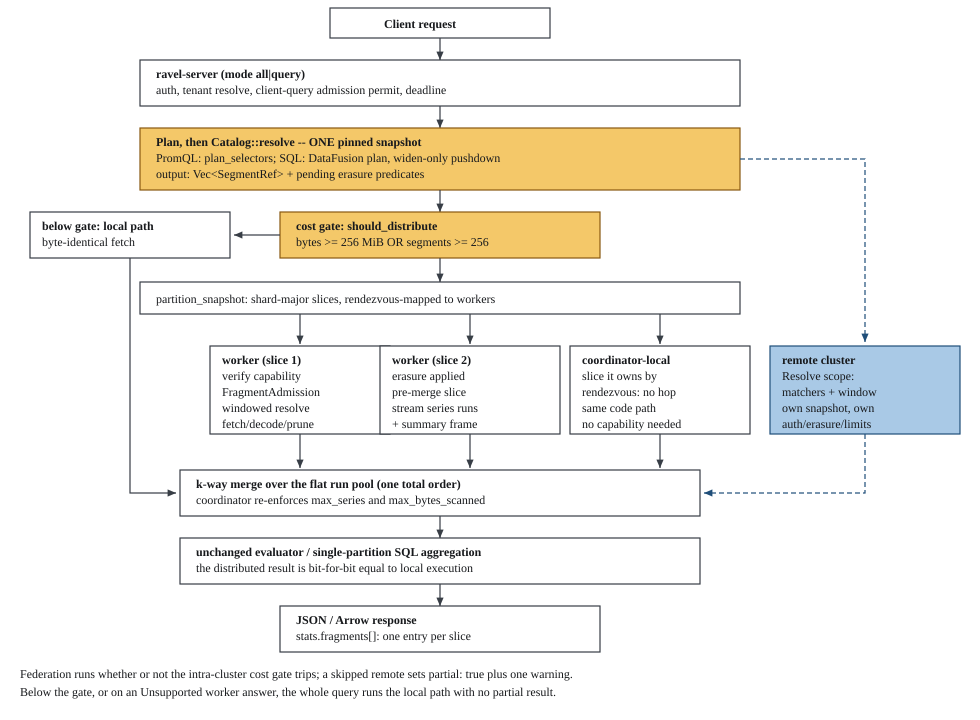
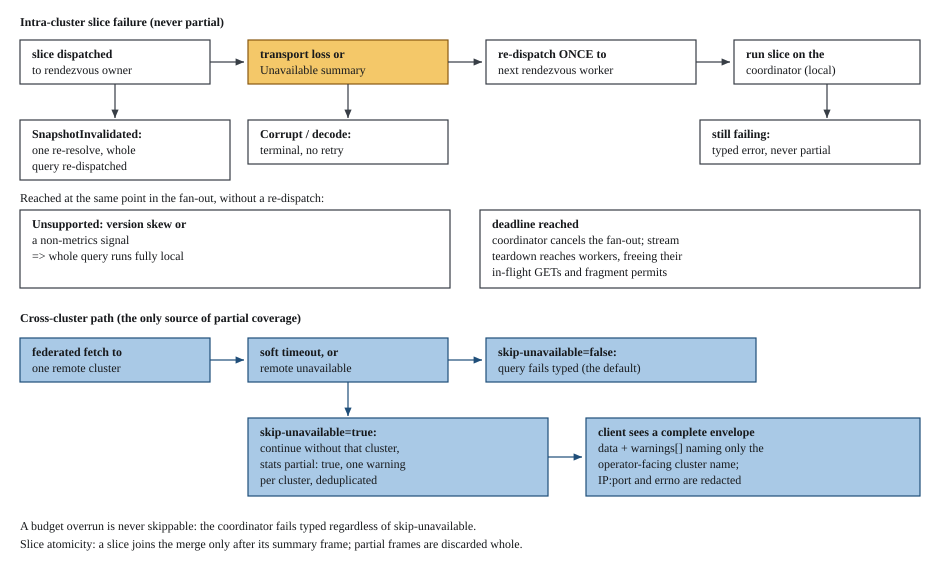

# Distributed query and cross-cluster federation

Ravel can serve one read with more than one process, and it can serve one read
from more than one cluster. Both are off by default and both need explicit
configuration:

- Intra-cluster fan-out needs `--distributed-query` together with
  `--fragment-key-file`, the dedicated fragment listener
  (`--fragment-listener` and its TLS files) and, in a build that serves
  Flight SQL, `--sql-ticket-key-file`.
- Federation needs at least one `--remote-cluster`.

Two scope limits apply. On the fan-out lane of the engine, only the metrics
signal distributes. The SQL lane distributes only in a build that carries the
`flight-sql` cargo feature, which the published image does. See
[What is not distributed](#what-is-not-distributed).

For the engine-internal specification (slice partitioning, the merge order,
the budget re-enforcement rules, the credential model) read
[query-engine.md](../query-engine.md#intra-cluster-read-fan-out-adr-0071).

Contents:

- [What distribution does](#what-distribution-does)
- [The cost gate](#the-cost-gate)
- [Query lifecycle](#query-lifecycle)
- [Turning it on](#turning-it-on)
- [The worker registry and heartbeat](#the-worker-registry-and-heartbeat)
- [Cross-cluster federation](#cross-cluster-federation)
- [Slice decode caps](#slice-decode-caps)
- [Reading `stats.fragments[]`](#reading-statsfragments)
- [Metrics](#metrics)
- [Failure behavior](#failure-behavior)
- [What is not distributed](#what-is-not-distributed)

## What distribution does

Distribution changes **where bytes are fetched and decoded**, never **what a
query computes**. A distributed result is bit-for-bit identical to the result
of the same query on one process, over any corpus and any slice partition.

- The query node that receives a request is the **coordinator** of that query.
  This is a per-query role, not a process type. Every node is a coordinator
  for the requests it receives and a worker for the slices of its peers. There
  is no scheduler process, no leader, and no assignment object.
- The coordinator resolves **one** pinned snapshot, as a single-process query
  does, and ships explicit segment identities to workers. Workers never
  resolve their own snapshot for an intra-cluster slice, so a distributed
  query reads one consistent view of the data.
- Workers fetch, decode, matcher-prune, apply erasure predicates, and
  pre-merge their slice. They do not aggregate and they do not evaluate.
- The coordinator k-way merges every slice under the existing total order.
  Then it runs the unchanged PromQL evaluator, or the unchanged
  single-partition SQL aggregation.

Aggregation, evaluation, and the authoritative cross-segment deduplication
stay on the coordinator. The coordinator is therefore still the ceiling for a
query whose cost is dominated by final aggregation over very high cardinality.
Distribution adds NICs, CPUs, and page cache for the fetch and decode phase,
which is where a large query spends its time.

## The cost gate

A cheap query runs locally and does not pay for distribution. The coordinator
computes the pre-execution `CostEstimate` of the accounting layer over the
resolved snapshot. It distributes only when the estimate reaches **either**
threshold:

| Axis | Flag | Default |
|---|---|---|
| Estimated store bytes | `--distribute-bytes-threshold` | 256 MiB (268435456) |
| Segment count | `--distribute-segments-threshold` | 256 |

A query below both thresholds runs the fully local path, byte-identical to a
build without the flag. A third flag, `--max-parallel-slices` (default 8),
caps how many slices one query fans out into. It therefore caps how many
concurrent remote fetches the query can start.

The defaults are conservative. On a zero-latency store the fan-out is pure
overhead. It pays off when object-store latency, not CPU, is the bound. Tune
both thresholds against your own store.

## Query lifecycle



## Turning it on

Enable distribution on each query node. `--distributed-query` and
`--fragment-key-file` are a pair: either one without the other fails startup.
`--distributed-query` also requires two more flags, and startup fails without
either one:

- `--fragment-listener`, with `--fragment-tls-cert`, `--fragment-tls-key` and
  `--fragment-tls-ca` (see
  [The dedicated fragment listener](#the-dedicated-fragment-listener)).
- `--sql-ticket-key-file`, in a build that serves Flight SQL. The published
  image is one.

```sh
# On every query-serving node in the cluster (same key files everywhere).
ravel-server --mode all \
  --listen-http 0.0.0.0:4318 \
  --listen-grpc 10.0.0.11:4317 \
  --distributed-query \
  --fragment-key-file /etc/ravel/fragment.keys \
  --sql-ticket-key-file /etc/ravel/sql-ticket.keys \
  --fragment-listener 10.0.0.11:4319 \
  --fragment-tls-cert /etc/ravel/fragment-tls/tls.crt \
  --fragment-tls-key /etc/ravel/fragment-tls/tls.key \
  --fragment-tls-ca /etc/ravel/fragment-ca/ca.crt
```

### `--distributed-query`

The flag opts this process in. In `--mode all` or `--mode query` it does two
things:

- It registers the internal `SeriesFetch` fragment service on the
  cluster-internal gRPC listener.
- It makes the process a coordinator that can fan a large query out.

Other modes ignore the flag, because they have no query surface and nothing
to distribute.

### `--fragment-key-file`

The flag names the cluster fragment key file. **Every node in one cluster
must read the same key set.**

- The file is a list of 32-byte keys, one per non-empty line. Each line is 64
  hex characters. It is not a bearer-token file.
- Blank lines and lines that start with `#` are ignored.
- A file with no key line fails startup. So does a line that is not 64 hex
  characters. Ravel does not pad or truncate a wrong-length key.
- The keys come from a file, never from an inline value or an environment
  variable, so a key never appears in a process listing.

### `--sql-ticket-key-file`

The flag names the SQL ticket key file, which signs the Flight SQL tickets:
the whole-set ticket that a client redeems and the slice ticket that a
coordinator hands a worker. Each of the two has its own key, derived from
every file key. The file shape and the rotation rule are the same as for
`--fragment-key-file` (the first key mints, every key verifies), but the file
is separate. **Every node in one cluster must read the same SQL ticket key
set.**

Two nodes that disagree cost more than parallelism:

- The whole-set ticket of a client comes back from `GetFlightInfo` as an
  endpoint with no location, so a client behind a balancer can redeem it on
  any node. A node that does not hold the key that the ticket was minted
  under answers `DoGet` with `invalid_argument` ("malformed flight ticket").
  That is a client-visible query failure.
- SQL slice tickets between two such nodes fail the MAC of the worker, and
  those slices fall back to the coordinator.

The flag without `--distributed-query` fails startup, and so does
`--distributed-query` without the flag in a build that serves Flight SQL. No
SQL ticket key is derived from the fragment key file.

To upgrade a fleet whose nodes ran without the file, without a mixed window,
follow the switch in the
[deployment guide](operations/deployment.md#the-dedicated-fragment-listener).

### Where SQL slice tickets travel

The SQL lane dials the dedicated fragment listener of each worker over mutual
TLS. The public gRPC listener refuses a slice ticket (see
[The dedicated fragment listener](#the-dedicated-fragment-listener)).

### `--listen-grpc`

A `--distributed-query` node in `--mode all` or `--mode query` always binds
the public gRPC listener. Under `--distributed-query` it serves `Resolve`-scope
federation and, in a build that serves Flight SQL, the client Flight SQL
surface. Neither distributed lane of this cluster dials it: both dial the
dedicated fragment listener.

### Admission caps for inbound slices

| Flag | Default | Caps the concurrent inbound fetches of |
|---|---|---|
| `--max-inflight-fragments` | 32 | `Pinned` (intra-cluster) slices, served for other coordinators in the same cluster |
| `--max-inflight-federated-resolves` | 8 | `Resolve` (cross-cluster federation) slices, served for peer-cluster coordinators |

Over either cap a request queues. It is not rejected.

`--max-inflight-fragments` is a **distinct admission class** from
`--max-concurrent-queries`. A coordinator can hold a client-query permit while
it waits on its own dispatched fragments. It can never deadlock behind client
queries queued on the client cap.

`--max-inflight-federated-resolves` admits against an **independent
semaphore** from `--max-inflight-fragments`. The two classes never share a
permit pool, so a peer cluster that drives federation reads at this cap can
never delay the `Pinned` slices of this cluster.

The `/metrics` fragment in-flight gauge and admission-wait counter carry a
`class` label (`pinned`|`resolve`), so you can tell the queueing of the two
classes apart.

### Slice fetch authorization

The fragment keys are not presented on the wire. Each key is a MAC key. What
crosses the hop is a capability that the coordinator mints per query:

- The capability is a fixed-width claim set followed by a keyed-BLAKE3 MAC
  over those claims. The claims name one tenant hash, one signal, one query
  id, and an absolute expiry. The coordinator sets the expiry to the deadline
  of that query.
- The coordinator mints under the **first** key in the file. It attaches the
  capability to the request body of every slice of that query, including a
  re-dispatch. Minting is deterministic in key and claims, so every slice of
  one query carries byte-identical bytes and needs no per-slice bookkeeping.
- A worker verifies statelessly, with no store read, no cache, and no
  coordination:
  1. It recomputes the MAC over the presented claims and compares it in
     constant time against **every** key that it has configured.
  2. It checks the expiry against its own clock.
  3. It requires the tenant hash, signal, and query id of the request to
     equal the claims.

  A capability minted for one tenant therefore cannot authorize a fetch that
  names another tenant. A capability minted for one query cannot authorize
  another query.
- Every rejection is one of five typed reasons: missing, bad MAC, expired,
  tenant mismatch, query mismatch. The worker counts it per reason on
  `ravel_distrib_fragment_capability_rejects_total{reason}` and returns gRPC
  `Unauthenticated` to the coordinator.
- The slice that a coordinator owns by rendezvous runs in-process on the same
  code path and mints nothing, because it has no hop to authorize.

Keep the cluster-internal gRPC listener off any network that a client can
reach. A capability authorizes a read of the pinned segments of one tenant for
the lifetime of one query. That is less authority than the bucket credentials
that every process already holds, but it is still authority.

### Rotating the fragment keys

Verification accepts a MAC under any configured key, and minting uses only the
first key. As a result, **rotation needs no flag day**:

1. Append the new key as a second line and roll the fleet. Every node now
   verifies both keys, and coordinators still mint under the old one.
2. Move the new key to the first line and roll again. Coordinators mint under
   the new key, which every node already verifies.
3. Delete the old line and roll a third time.

At no point in that sequence is a node presented a capability that it cannot
verify.

A stale key set on one node is visible in two places:

- On the worker that holds it,
  `ravel_distrib_fragment_capability_rejects_total{reason="bad_mac"}` rises.
  The worker refuses capabilities minted under a key that it does not hold.
- On the coordinator, the `Unauthenticated` of the worker arrives as a
  transport-class failure. The slice is re-dispatched to the next rendezvous
  worker, that endpoint is quarantined, and the slice ends up running
  coordinator-local. Watch `ravel_distrib_slices_redispatched_total`,
  `ravel_distrib_slices_fallback_total`, and
  `ravel_distrib_quarantine_marks_total` there. Also read the `warn` log of
  the coordinator that names the endpoint. Its error text carries the refusal
  message of the worker.

### The dedicated fragment listener

`--fragment-listener <addr>`, which `--distributed-query` requires, carries
the `Pinned` fragment scope and SQL slice `DoGet` on a fourth listener. That
listener terminates TLS in-process and serves nothing else. `Resolve`-scope
federation and the client Flight SQL surface stay on the public gRPC listener.

Required flags and certificate:

- `--fragment-tls-cert`, `--fragment-tls-key`, and `--fragment-tls-ca` are all
  required. The address must differ from every other listener.
- The certificate must carry a `ravel-fragment` dNSName subject alternative
  name. Every coordinator verifies against that one fixed name.
- Ravel mints no certificates. The operator provisions them, and rotation is a
  rolling restart.
- The CA is dedicated to this surface, so any certificate that it signed means
  "a fragment worker of this cluster". Per-process certificate identity is not
  required, because the capability is the authorization, not the certificate.
- The address of the dedicated listener is what this node publishes as its
  `fragment_endpoint`. To bind it to a wildcard, you need
  `--advertise-fragment-endpoint` (see [The worker registry and
  heartbeat](#the-worker-registry-and-heartbeat)).

TLS on this listener is mutual:

- `--fragment-tls-ca` is the CA that a coordinator verifies a worker against.
  It is also the CA that the worker verifies its callers against. A peer that
  holds no certificate from it is refused at the handshake, before any
  capability is read.
- A coordinator presents the `--fragment-tls-cert` and `--fragment-tls-key` of
  its own process when it dials a peer. One key pair serves both directions,
  because every fragment process is both a worker and a coordinator.
- The certificate therefore needs the `clientAuth` extended key usage as well
  as `serverAuth`:

  | Certificate carries | Result |
  |---|---|
  | only `serverAuth` | It serves fragments but cannot dial them. |
  | only `clientAuth` | It dials fragments but cannot serve them. |
  | `anyExtendedKeyUsage` | It satisfies neither check. The TLS stack matches the required purpose and does not treat that value as a wildcard. |

- Startup parses the certificate and refuses when either usage is absent. The
  error names the file and the missing usage. An upgrade with such a
  certificate fails to start. It does not stop distributing in one direction
  without a signal.
- Before you enable the dedicated listener, provision both usages or rotate to
  a certificate that has them.
- The same certificate serves SQL slice `DoGet`. The SQL lane needs no
  separate certificate.

Each listener serves the following:

- The public gRPC listener stops serving the `Pinned` scope. `Resolve`
  (federation, under ordinary tenant credentials) stays there. The dedicated
  listener rejects `Resolve`.
- The dedicated listener mounts the Flight service in a slice-only role. It
  serves `DoGet` for a slice ticket and refuses every other Flight and Flight
  SQL method. No method other than a slice `DoGet` returns data:

  | Request on the dedicated listener | Answer |
  |---|---|
  | A client Flight SQL method | `permission_denied` |
  | A method that the service does not implement (prepared statements, `Handshake`, `DoPut` and the like) | `unimplemented` |
  | `ListActions` | its static list |
  | A `DoGet` that is not a valid slice capability | `unauthenticated` |
  | A `DoGet` with a client ticket | `permission_denied` ("slice fetch rejected: wrong_surface") |

- The public gRPC listener keeps the client Flight SQL surface. It refuses a
  slice ticket whose MAC verifies under the slice keys of this node, with
  `permission_denied` ("slice fetch rejected: wrong_surface").
- A forged slice ticket, or one minted under a key that this node does not
  hold, is not recognised as a slice ticket. It takes the client path and is
  refused there, uncounted: `unauthenticated` without a credential, and
  `invalid_argument` "malformed flight ticket" with one.
- A coordinator dials the `fragment_endpoint` of each worker over `https`,
  with the same pinned CA, server name and client certificate as a fragment
  fetch. No client credential travels with the slice, because the slice ticket
  is the capability.

### Adding capacity

To add capacity, add processes. A new node with the same flags and the same
bucket appears in the live worker set within one heartbeat interval and starts
to receive slices. A removed node ages out of the set. There is nothing to
rebalance and no state to drain.

## The worker registry and heartbeat

Membership needs no new durable state and no consensus. Each distributed query
node writes one object, and no other node writes that object:

```
sys/query/workers/<process_id>
```

The record is a small JSON control-plane payload. It carries the process id,
one endpoint, the `queryfrag` protocol version that the node speaks, and a
liveness timestamp that every beat stamps again. The write is an unconditional
overwrite: one writer per key, no compare-and-swap, no contention. `maintain`
mode processes use the same pattern for their own heartbeats.

### The endpoint

`fragment_endpoint` is the TLS address of the dedicated fragment listener.
Both distributed lanes dial it: the PromQL lane for `SeriesFetch` and the SQL
lane for slice `DoGet`. The SQL lane does not dial a worker whose record
carries an empty `fragment_endpoint`. The slices of that worker run elsewhere
or coordinator-local.

A record written by an earlier release can also carry `flight_sql_endpoint`,
the public gRPC address that the removed plaintext SQL lane dialed. It still
decodes, and the field is ignored.

The endpoint defaults to the address that the listener bound, and a sibling
coordinator dials that string verbatim. A listener bound to a wildcard
(`0.0.0.0` or `::`) therefore publishes an address that no peer can dial, so
startup refuses that combination. `--advertise-fragment-endpoint
<host[:port]>` supplies the routable host to publish:

```sh
ravel-server --mode all \
  --listen-grpc 0.0.0.0:4317 \
  --distributed-query \
  --fragment-key-file /etc/ravel/fragment.keys \
  --sql-ticket-key-file /etc/ravel/sql-ticket.keys \
  --fragment-listener 0.0.0.0:4319 \
  --fragment-tls-cert /etc/ravel/fragment-tls/tls.crt \
  --fragment-tls-key /etc/ravel/fragment-tls/tls.key \
  --fragment-tls-ca /etc/ravel/fragment-ca/ca.crt \
  --advertise-fragment-endpoint node-11.internal
```

- A wildcard `--listen-grpc` needs no advertised host, because the public
  gRPC listener is not published.
- Omit the port unless a NAT or port mapping makes the fragment listener
  reachable on a port other than the one it bound. A host-only value keeps the
  bound port.
- You can write an IPv6 literal bare (`fd00::1`) or bracketed
  (`[fd00::1]:4319`). It is always advertised bracketed.
- The flag has meaning only with `--distributed-query`. The flag without
  `--distributed-query` fails startup.

A cluster whose listeners bind specific addresses needs no
`--advertise-fragment-endpoint`.

### The live set

On the same cadence (`H` = 60 s by default) every node lists the prefix and
refreshes its view. The **live set** is the node itself plus every sibling
whose stamp is within `3 * H` of the clock of the reader, in either direction.
A stuck future-dated record drops out like a stale past-dated one.

Worker identity comes from the key, not from the record body. A record whose
body disagrees with its key is skipped and is not admitted under the identity
of another worker. That check does not keep a new identity out. The shipped
query role (`deploy/iam/query.json`) can `PutObject` anywhere under
`sys/query/workers/`, and records carry no MAC. Any principal that holds that
role can therefore write a self-consistent record at a fresh UUID key and join
the live set.

A key whose modification time is already older than the liveness window is not
fetched at all, because its stamp can only be older still. The read cost of a
coordinator therefore follows the live fleet, not every node that ever ran.

Until the first heartbeat cycle completes after startup, a node sees an empty
live set and runs every slice locally. Expect a distributed cluster to take up
to one heartbeat interval after a restart to start fanning out again.

### Stale records

A query node never deletes a record. The query role
(`deploy/iam/query.json`) holds `s3:DeleteObject` only on its own bucket-probe
scratch objects under `sys/pq-probe/`, and on nothing under
`sys/query/workers/`.

A node that drains gracefully overwrites its own record on the way out with a
stamp that no reader accepts as live. Every sibling drops it from its live set
on its next listing, at most one heartbeat interval later, and stops dialing
it. The record itself stays behind, like the record of a node lost to a crash,
a kill or a node failure.

**Maintain-mode processes** keep the prefix bounded:

- On each maintain cycle, one maintain process lists `sys/query/workers/` and
  deletes every key whose modification time is older than twice the liveness
  window. It is the process that owns a fixed unit under the same rendezvous
  rule that spreads the other maintain work.
- That is one process per view of the maintain membership. While two processes
  briefly disagree about membership, both can delete. That is harmless,
  because a delete of an absent key is a no-op.
- The doubled width is the clock-skew margin between the clock of the object
  store and the clock of the maintain process. A live node whose key a skewed
  clock deleted reappears on its next beat, at most one interval later.
- A store that reports no modification time keeps such a key forever.
- A key whose modification time is in the future stays until that time is more
  than twice the window in the past.
- The shipped `deploy/iam/maintain.json` grants the list and the delete on
  `sys/query/workers/*`. No maintain process needs to read a record.
- If the credential lacks the delete, the pass logs one error that names the
  prefix and the number of keys left, instead of one warning per key. It stops
  deleting until the next cycle.

A deployment that runs no maintain-mode process deletes nothing, and the
prefix grows by one key for every query node that ever ran. That includes a
deployment that runs every role in one `--mode all` process with distributed
query on, because `--mode all` runs no maintenance loop.

The admission family has the same gap, and it is still open. Its reconciler
deletes stale snapshots under a role to which the shipped templates give no
delete on that prefix, so its prefix is not bounded either.

### Slice placement

To place a slice, the coordinator rendezvous-hashes the `(tenant_hash, signal,
shard)` unit of the slice over the live set. It takes the top owner, then the
next, and so on, which gives a deterministic failover order. Expect two
consequences:

- **Cache affinity.** The same shard of the same tenant lands on the same
  worker as long as membership is stable. The per-process content-addressed
  read caches therefore behave as one aggregate cache. Segments are immutable,
  so there is no invalidation protocol.
- **Version skew.** Workers whose advertised protocol version differs from the
  version of the coordinator are dropped at routing time, before any dispatch.
  During a rolling upgrade a coordinator sees fewer eligible workers, and in
  the limit it runs everything locally. The rule covers both lanes. The
  release that moves SQL slices onto the dedicated listener moves the protocol
  version from 4 to 5. For the one rolling deploy onto it, version 4 and
  version 5 nodes send each other no PromQL or SQL slices, and those slices
  run coordinator-local. That deploy costs parallelism, and results do not
  change.

## Cross-cluster federation

With federation, a coordinator asks **independent Ravel clusters** to each
resolve their own snapshot. The clusters have separate buckets and separate
trust domains. The coordinator merges what they return into the same pool that
its own selectors feed.

- Federation is configured per remote.
- It is independent of the intra-cluster cost gate. A federated query
  federates whether or not it also fans out locally.
- It is absent from a deployment that configures no remotes.

```sh
ravel-server --mode query \
  --listen-http 0.0.0.0:4318 \
  --listen-grpc 10.0.0.11:4317 \
  --distributed-query \
  --fragment-key-file /etc/ravel/fragment.keys \
  --sql-ticket-key-file /etc/ravel/sql-ticket.keys \
  --fragment-listener 10.0.0.11:4319 \
  --fragment-tls-cert /etc/ravel/fragment-tls/tls.crt \
  --fragment-tls-key /etc/ravel/fragment-tls/tls.key \
  --fragment-tls-ca /etc/ravel/fragment-ca/ca.crt \
  --remote-cluster name=eu,endpoint=eu.internal:9443,credential-file=/etc/ravel/eu.token,tls-ca-file=/etc/ravel/eu-ca.pem,skip-unavailable=true \
  --remote-cluster name=apac,endpoint=apac.internal:9443,credential-file=/etc/ravel/apac.token,soft-timeout=15s \
  --remote-cluster-soft-timeout 10s
```

`--remote-cluster` is repeatable, once per remote. Its value is a
comma-separated `key=value` spec:

| Key | Required | Meaning |
|---|---|---|
| `name` | yes | The cluster's stable operator-facing label. This is the only identity a client ever sees for the remote (in `warnings`). |
| `endpoint` | yes | `host:port` of the remote's fragment surface. |
| `credential-file` | yes | File holding the bearer token this coordinator presents to that remote. |
| `tenant` | no | The one local tenant whose queries fan out to this remote. Omitting it makes the remote reachable by every local tenant, which only a coordinator resolving at most one local tenant may do. See [One credential per local tenant](#one-credential-per-local-tenant). |
| `tls` | no | `true` or `false`, default `true`. Those two literals only; any other value fails startup with a message naming it. |
| `tls-ca-file` | no | CA bundle for the remote's server certificate. A spec carrying this key and no `tls` key means TLS is on with that CA trusted, and is accepted. Only the explicit `tls=false` alongside a CA file fails startup, because there the bundle would be inert. |
| `skip-unavailable` | no | `true` or `false`, default `false`. Same two literals only. |
| `soft-timeout` | no | Per-remote override of `--remote-cluster-soft-timeout`. |

TLS is on unless a spec says `tls=false`. Use `tls=false` only for a hop that
a lower layer already encrypts. It sends the operator credential, the query,
and every result stream in cleartext, and startup logs a security warning that
names the remote.

`--remote-cluster-soft-timeout` sets the default bound for every remote
(default 10 s) as a humantime duration (`10s`, `500ms`). A remote that does
not answer within its bound is treated as unavailable.

Ravel validates every one of these at startup, not at the first federated
query. Each of the following fails the process before it binds a listener:

- a malformed spec
- an unknown key
- a `tls` or `skip-unavailable` value that is not `true` or `false`
- a duplicate cluster name
- `tls=false` next to a `tls-ca-file`
- a zero soft timeout
- an empty `tenant` value
- an unreadable or empty credential file
- a remote cluster that names no local tenant, on a coordinator that runs
  queries for more than one (see [One credential per local
  tenant](#one-credential-per-local-tenant))

### What crosses the boundary

A federated request carries **matchers, a time window, and budgets**. It never
carries segment references or object-store credentials. The remote resolves
its own snapshot over that window and runs it through its ordinary query path.
It therefore enforces its own admission limits, its own tenancy hashing, and
its own selective-erasure predicates.

The budgets travel with the request. They are the carried limits of the
caller, and the remote applies them. The coordinator also re-enforces them
over the folded remote spend.

A carried budget can only lower what the remote does, never raise it:

- The remote clamps every budget on the wire to its own configuration. The
  byte limit that it applies is the smaller of the carried value and its own
  `max_bytes_scanned`.
- A request that carries no cap at all gets the limit of the remote, not an
  unlimited scan.
- On this resolve path the remote also applies its own matched-series and
  sample caps to the result that it is about to return.

The limits of a remote therefore bind every coordinator that queries it. A
higher budget on a coordinator does not raise what its remotes will scan.

The credential is an **operator** secret:

- The remote derives the tenant that it serves from that credential, through
  its own resolver chain.
- A coordinator cannot name a tenant on a remote. The remote overwrites
  whatever `tenant_hash` is on the wire with the locally resolved value and
  never reads it.
- The credential of the calling client is never forwarded across a cluster
  boundary.
- A fragment capability is never a federation credential. A remote runs its
  ordinary tenant resolver chain over the request metadata, and a capability
  is not in any tenant registry.

The debug formatting of `RemoteClusterConfig` prints `credential: <redacted>`,
so a config dump or a panic message never leaks the operator secret.

### One credential per local tenant

The `credential-file` of a remote cluster holds **one** bearer token, and the
remote resolves **one** tenant from it. That credential therefore belongs to
one local tenant, and `tenant` names which. A query from any other local
tenant does not reach that remote at all: it presents no credential, issues no
request, and gets no remote series.

A coordinator that serves local tenants `acme` and `beta`, each with its own
account on a shared remote, writes one spec per local tenant:

```sh
ravel-server --mode query \
  --tenant-token acme-token:acme \
  --tenant-token beta-token:beta \
  --remote-cluster name=eu-acme,endpoint=eu.internal:9443,credential-file=/etc/ravel/eu-acme.token,tenant=acme \
  --remote-cluster name=eu-beta,endpoint=eu.internal:9443,credential-file=/etc/ravel/eu-beta.token,tenant=beta
```

Two specs to the same endpoint under distinct `name`s is the supported shape.
No syntax names several local tenants on one spec, because that puts them
behind one credential again.

**A local tenant that no remote names gets local data only.** Its queries and
its discovery calls resolve against the data of this cluster and nothing else.
That is a complete answer, not partial coverage. A remote that the tenant
holds no credential for is outside its query, not missing from it, so no
`warnings` entry and no `partial: true` appear. To configure a remote for such
a tenant, add a spec with its `tenant`.

A spec without `tenant` makes a remote reachable by **every** local tenant.
That is correct on a coordinator that runs queries for only one local tenant,
and it is what a single-tenant deployment on an unkeyed bucket writes. **A
coordinator that runs queries for more than one local tenant refuses to start
with an unmapped remote cluster.** The error names every spec that needs a `tenant`.

A coordinator runs queries for more than one local tenant in each of these
cases:

- Two or more `--tenant-token` values or `--tenant-token-file` lines name
  different tenants.
- `--alert-rules-file` names a tenant that no `--tenant-token` value or
  `--tenant-token-file` line does. One alert evaluator runs per tenant in that
  file, and its queries go through the same engine.
- Any dynamic resolver is enabled: `--dev-insecure-tenant-header`,
  `--oidc-issuer`, or `--mtls-enabled`. Each of them derives the tenant from a
  request header or a token claim.
- A deployment key is set in All, Gateway or Query mode (a keyed bucket). The
  server then also resolves bearer tokens against the durable `sys/auth` map,
  so a tenant can be onboarded without a restart. On a keyed bucket every
  `--remote-cluster` needs `tenant=`, even with a single `--tenant-token`.

Startup also refuses a `tenant` that no `--tenant-token`,
`--tenant-token-file`, or `--alert-rules-file` names. This check applies where
the tenant set is fully known: static configuration, no dynamic resolver, and
no durable `sys/auth` map.
Such a mapping can never fire, and its only symptom is a remote that answers
nobody. Under a dynamic resolver, or on a keyed bucket where a tenant can be
provisioned only in `sys/auth`, the static configuration is not the tenant
set, so the check does not apply and a mapping to a `sys/auth`-only tenant
starts.

You can map a remote to a tenant that only `--alert-rules-file` names. That is
a real deployment: alert rules for a tenant whose data lives partly on a
remote.

None of this changes what the remote does with the credential that it is
presented. The remote resolves its own tenant from the credential and ignores
any tenant on the wire. The mapping decides **which local tenant can present a
given credential**. The remote still decides what that credential is entitled
to see.

The value-bearing endpoints (`/api/v1/query`, `/api/v1/query_range`) and the
discovery endpoints (`/api/v1/series`, `/api/v1/labels`,
`/api/v1/label/<name>/values`) all federate, through the same coordinator and
with the same semantics. Both groups honour the mapping.

### A degraded remote

With `skip-unavailable=false` (the default), a remote that fails or times out
fails the whole request with a typed error. With `skip-unavailable=true` the
query continues without that cluster and says so in two places. The first is
the `warnings` of the response:

```json
{
  "status": "success",
  "data": { "resultType": "vector", "result": [] },
  "warnings": [
    "remote cluster eu unavailable; results are partial"
  ]
}
```

The second is `partial: true` in the stats block of the query.

Warnings name only the operator-facing cluster name. The IP:port and errno of
the remote are redacted, because a client that reads the envelope is not
entitled to the internal topology of the coordinator. Warnings are
deduplicated, so a multi-selector request that federates once per selector
still reports one warning per skipped cluster.

Two failures are never skippable:

- **A budget overrun.** The coordinator re-enforces `max_bytes_scanned` over
  the folded remote spend and fails typed regardless of `skip-unavailable`. A
  budget cap is a correctness bound, not an availability property.
- **A malformed frame.** A response of a remote that fails to decode
  (including a corrupt native-histogram frame) is treated as corruption, not
  availability. It fails typed regardless of `skip-unavailable`. Version skew
  is the only histogram-related coverage gap: a remote at a different
  `PROTOCOL_VERSION` answers `Unsupported` before it encodes a frame, and that
  is skippable.

Federation assumes that each cluster owns a **disjoint** slice of series
identity. The intended deployment is region- or tenant-sharded, so one series
lives in one cluster only.

If the same series and timestamp arrive from two clusters with different
values, the merge still emits one sample per timestamp. Which cluster wins is
unspecified, because the provenance fields that the total order tie-breaks on
are only comparable within one cluster. The discovery endpoints have no such
ambiguity: a series id is a canonical function of its labels, so the
cross-cluster union is a plain set union. See
[query-engine.md](../query-engine.md#cross-cluster-federation-adr-0071) for
the full statement.

## Slice decode caps

A worker decides how many response frames a slice carries and how large each
one is. The coordinator decodes them incrementally through one bounded
decoder, which the intra-cluster fetcher and the federation fetcher share.
That decoder applies two caps per slice:

| Cap | Value | Why it exists |
|---|---|---|
| Response frames | `MAX_SLICE_RESPONSE_FRAMES`, 1048576 | A slice emits one frame per returned run plus one terminal summary, so this is far above any ordinary slice. An empty frame costs two wire bytes, so the byte cap does not bound a frame count at the sizes a remote chooses. |
| Aggregate wire bytes | `MAX_SLICE_RESPONSE_BYTES`, 230331648 bytes (about 219.7 MiB), fixed | Applied to the encoded size of the frames this coordinator accepts. The ceiling is derived, not chosen: it is `DEFAULT_MAX_SAMPLES` (10000000) times the widest wire cost of one scalar sample (18 bytes: a 10-byte zig-zag `ts_delta` varint plus an 8-byte `fixed64` value), plus `MAX_SLICE_RESPONSE_FRAMES` times 48 bytes of per-frame framing as headroom. What the derivation guarantees is narrow: a slice of plain scalar runs carrying the whole sample budget, every sample at its widest encoding, spread over as many frames as the frame cap admits, encodes inside the ceiling. It is not a bound no legitimate slice can cross, and it is not meant to be. Runs carrying per-sample provenance columns (`Run` fields 6-9), frames with many or long labels, and native-histogram frames all cost more than that derivation counts. Nor is there a per-slice sample limit everywhere for such a bound to rest on: a federated (resolve-scope) slice is refused by the worker itself at `max_samples` over the result it is about to return, but an intra-cluster slice has no per-slice sample limit at all, because the coordinator enforces `max_samples` once, query-wide, over the merged pool. A slice that does cross the ceiling is refused as a budget error naming both figures, the same class of refusal as a bytes-scanned trip. The ceiling is fixed and applies with no configuration at all. No setting raises or lowers it, `max_bytes_scanned` included: that is a store-byte budget on the compressed segment data a slice reads, enforced on a different path, and response frames are uncompressed wire bytes, so treating one as the other would refuse a slice that scanned well inside its configured budget. |

### Sizing a coordinator

Both caps are **per slice**, and each in-flight slice decodes through its own
decoder that holds the full cap. What multiplies that cap differs by path.
Size a coordinator from the path that it runs:

- A **local fan-out** runs two nested bounded stages. The engine fetches up to
  `promql_fetch_fanout` selectors at once (default 8, from
  `DEFAULT_FETCH_CONCURRENCY`). Each of those dispatches up to
  `max_parallel_slices` slices at once (default 8). The in-flight decoder
  count is the product: 64 at the defaults, not 8. One such query therefore
  holds up to 64 times the per-slice byte cap in wire bytes, 14741225472 bytes
  (about 13.7 GiB). It holds more after those bytes are decoded into the
  in-memory series shapes. A lower value for either setting bounds this path.
- A **federated query** is not bounded by `max_parallel_slices`.
  `Federation::fetch` spawns one task per configured remote cluster. All tasks
  are in flight together, each with its own decoder at the full ceiling. One
  federated query therefore holds up to the per-slice cap times the number of
  remote clusters. A lower `max_parallel_slices` does not reduce it.

Both figures bound ONE query. The process-wide total is that figure times the
number of queries that run at once. That number has no ceiling unless an
operator sets `--max-concurrent-queries`, which is unset by default.

`max_bytes_scanned` does not bound any of this, because it does not move the
per-slice wire cap.

### A breached cap

The coordinator checks both caps before it decodes or keeps a frame. The
client stops pulling from the stream at the first breach and does not read it
to the end. Dropping the stream cancels the RPC, so the worker stops
producing. The coordinator therefore holds the frame that tripped the cap and
whatever the HTTP/2 flow-control window had already put on the wire, not the
rest of the slice.

A single frame is capped separately, at the 4 MiB `max_decoding_message_size`
that the coordinator sets on its fragment client. The gRPC layer refuses a
larger frame before this decoder sees it.

A breach is a **refusal, not an outage**:

- It renders as HTTP 422 that names the observed figure and the cap, in the
  same `execution` error class that a local budget trip uses.
- The error is `TooManySliceFrames` for the frame cap and `TooManySliceBytes`
  for the byte cap. The message of the byte cap says wire bytes, so that it is
  not read as the store bytes that `TooManyBytesScanned` counts.
- It is not the redacted 503 that every other distributed slice failure
  becomes. The counts belong to the coordinator, so there is no server state
  to redact. A retry of the same query against the same remote breaks the same
  way.

A refusal fails the whole query, and an error response carries no stats block.
The figures for a refused slice are therefore only in the 422 body and in the
`warn` log of the coordinator. The log names the endpoint or the federated
cluster, the frame count, and the wire bytes. The figures are not in
`stats.fragments[]`. The wire bytes are not folded into the accounting totals
of the query, which count store bytes.

A federated slice is refused the same way. It has no `stats.fragments[]` entry
even when it succeeds.

## Reading `stats.fragments[]`

The stats block of a distributed query has one `fragments` array, with one
object per dispatched slice. The field is absent on a query that did not
distribute, so its presence is the signal that fan-out happened.

```json
"stats": {
  "fragments": [
    { "workerEndpoint": "10.0.0.12:4317", "segmentCount": 41, "bytesReported": 189743104, "wireBytesConsumed": 24117248, "status": "ok" },
    { "workerEndpoint": "10.0.0.13:4317", "segmentCount": 38, "bytesReported": 174260224, "wireBytesConsumed": 22020096, "status": "ok" },
    { "workerEndpoint": "local", "segmentCount": 40, "bytesReported": 181403648, "wireBytesConsumed": 0, "status": "fallback" }
  ]
}
```

- `workerEndpoint`: where the slice ran. A slice that the coordinator owned by
  rendezvous, or one that fell back, reports local execution and not the
  address of a peer.
- `segmentCount`: how many pinned segments the slice carried. Badly skewed
  counts across entries mean that your ingest shards are unevenly sized.
  Slices are cut shard-major and a shard is never split, so shard skew becomes
  slice skew.
- `bytesReported`: the store bytes that the worker reported scanning. They are
  already folded into the accounting total of the query.
- `wireBytesConsumed`: the encoded size of the response frames that this
  coordinator accepted off the stream of the slice. `bytesReported` counts
  store bytes that the worker read. This field counts wire bytes that the
  coordinator held.
  - A slice that the coordinator ran with no remote attempt reports `0`,
    because nothing was encoded.
  - A `fallback` entry reports what its failed remote attempt had accepted
    before it failed.
  - The field does not show a decode-cap refusal. A refused slice fails the
    whole query, so only `ok` and `fallback` entries ever reach a client.
- `status`: `ok` or `fallback` (the slice ran on the coordinator after a
  remote attempt failed). `error` (a hard error or a `Corrupt` summary) and
  `timeout` (the slice ended `TIMEOUT` at the deadline of the query) entries
  are recorded internally. A slice that ends either way fails the query, so no
  response body renders one.

A `fallback` entry means that a peer was unreachable or reported itself
unavailable. The query still returned a complete and correct result, and it
cost more than necessary. Correlate the entry with
`ravel_distrib_slices_fallback_total` and the logs of the worker.

Per-slice cardinality lives only in this response body, never as a metric
label.

## Metrics

`GET /metrics` renders the `ravel_distrib_*` family on any process with
distribution enabled. The family is absent when distribution is off. Its
series carry the closed `mode` label alone, with no per-shard, per-worker, or
per-tenant label. There are two exceptions:

- The fragment in-flight gauge and the admission-wait counter also carry a
  `class` label (`pinned`|`resolve`).
- The fragment capability reject counter also carries a `reason` label.

`ravel_sql_slice_rejects_total` and `ravel_sql_slice_tls_dials_total` are
listed here because they count the slice fetches of the SQL lane, but they are
not part of that family. They render on every process that serves Flight SQL,
with or without distribution. The rejects counter carries a `reason` label
beside `mode`.

| Metric | Type | What it tells you |
|---|---|---|
| `ravel_distrib_fragment_requests_total` | counter | Inbound slice fetches this process served for other coordinators. |
| `ravel_distrib_fragment_auth_failures_total` | counter | Inbound `Resolve`-scope federation requests whose presented credential did not resolve to a tenant. It does not count `Pinned` capability rejections: those are `ravel_distrib_fragment_capability_rejects_total`, and reach the coordinator as re-dispatch and fallback. |
| `ravel_distrib_fragment_capability_rejects_total{reason}` | counter | Inbound `Pinned` fragment requests this worker refused at fragment capability verification, one series per reason, each rendered from zero: `missing`, `bad_mac`, `expired`, `tenant_mismatch`, `query_mismatch`. What each reason counts is defined in [the observability guide](observability.md#distributed-read-fan-out-ravel_distrib_). A rising `bad_mac` during a key rotation means some coordinator is minting under a key this worker does not hold. A `Pinned` fetch refused on the public listener is refused before verification and counted under no reason. |
| `ravel_sql_slice_tls_dials_total` | counter | Outbound SQL slice `DoGet` fetches this coordinator dialed over TLS to the dedicated fragment listener of a worker, one per slice fetch sent, a re-dispatch included. Defined in [the observability guide](observability.md#sql-slice-tls-dials-ravel_sql_slice_tls_dials_total). Absent on a process that serves no Flight SQL. |
| `ravel_sql_slice_rejects_total{reason}` | counter | Inbound SQL slice `DoGet` requests refused at slice capability verification, one series per reason, each rendered from zero: `missing`, `bad_mac`, `expired`, `wrong_surface`. What each reason counts, and which refusals are counted under none, is defined in [the observability guide](observability.md#sql-slice-capability-rejects-ravel_sql_slice_rejects_total). Absent on a process that serves no Flight SQL. |
| `ravel_distrib_fragment_inflight{class}` | gauge | Fragments in flight now, split by admission class. `class="pinned"` riding at `--max-inflight-fragments` or `class="resolve"` riding at `--max-inflight-federated-resolves` means that class's inbound slices are queueing; the two never contend for the same permits. |
| `ravel_distrib_fragment_admission_waits_total{class}` | counter | Inbound fragment requests, by admission class, that found their class's semaphore saturated and had to queue rather than being admitted immediately. |
| `ravel_distrib_slices_local_total` | counter | Slices this coordinator ran itself with no hop. |
| `ravel_distrib_slices_remote_total` | counter | Slices dispatched to a peer. |
| `ravel_distrib_slices_redispatched_total` | counter | Slices re-dispatched after a failed first attempt. |
| `ravel_distrib_slices_fallback_total` | counter | Slices that ended up running coordinator-local after remote attempts failed. |
| `ravel_distrib_slice_fetch_seconds` | histogram | Per-slice fetch latency, sharing the object-store histogram's bucket layout. |
| `ravel_distrib_quarantine_marks_total` | counter | Dead endpoints marked into the coordinator's quarantine map after a re-dispatchable dispatch failure. A jump after a node loss is expected; a steady climb means workers keep failing. |
| `ravel_distrib_quarantine_readmits_total` | counter | Quarantined endpoints readmitted by a strictly newer worker heartbeat (the recovered worker's own probe). |
| `ravel_distrib_quarantine_current` | gauge | Endpoints quarantined right now. Rides above zero for the ~2 heartbeat intervals a dead worker takes to readmit or age out. |

On a multi-node cluster, `slices_local_total` that stays high while
`slices_remote_total` stays at zero indicates a membership problem: a clock
skew wider than `3 * H`, or a protocol-version mismatch during a partial
upgrade. See [observability.md](observability.md) for how to
read the other query cost families alongside these.

## Failure behavior

**Intra-cluster execution is all-or-nothing.** A slice failure is retried,
then absorbed locally, then raised as a typed error. It is never turned into a
partial merge. Only cross-cluster federation can return partial coverage, and
only when an operator opted that remote into it.

The rule holds on both lanes for metrics. A metrics statement over the cost
gate runs the same three steps per slice: the assigned worker, one re-dispatch
to another worker, then a coordinator-local read of the same slice ticket. Its
local read runs the identical worker fragment over the identical pinned
segments. A statement that falls back therefore returns the same bytes that it
returns when every worker is healthy.

The SQL lane differs from the PromQL lane in three ways:

- It places slice `k` on roster entry `k % len`, not by rendezvous rank.
- It keeps no quarantine map. The next statement tries a dead worker again and
  does not skip it until its heartbeat stamp advances. That costs one refused
  connection per slice assigned to that worker, not a failed statement.
- Its counters are per query and are not on `/metrics`. Its coordinator logs a
  `warn` that names the slice on every re-dispatch and every local read.

Log and trace *search* on the SQL lane does not have this sequence yet. A
worker error there still fails the statement, so a dead-but-registered worker
is visible for the rest of its staleness window on those tables.



What an operator observes, case by case:

| Condition | Behavior | Visible as |
|---|---|---|
| A worker is unreachable, or the stream dies mid-slice | Re-dispatch once to the next rendezvous worker, then run the slice on the coordinator, then fail typed | `slices_redispatched_total`, `slices_fallback_total`, a `fallback` entry in `stats.fragments[]`, a `warn` log naming the endpoint |
| A worker answers `Unavailable` | Same sequence as unreachable | Same |
| A pinned segment vanished (concurrent GC or compaction) | The coordinator re-resolves the snapshot once and re-dispatches the whole query, not one slice; a second occurrence fails | The same single-retry behavior a local query already has |
| A worker reports a corrupt segment, or a frame fails to decode | Terminal immediately: no retry, no local fallback | Typed error; a retry would mask real corruption behind a clean local read |
| A CAP trips on a slice, or on the folded total (bytes, series, samples, or the request count) | The same typed `TooManySeries` / `TooManyBytesScanned` a local query raises, never a transport error | HTTP 422 with the usual budget error |
| A slice outruns a coordinator decode cap (the frame cap, or the per-slice wire-byte ceiling) | The client stops pulling at the first breach and fails typed: `TooManySliceFrames` or `TooManySliceBytes`, never a transport error. See [Slice decode caps](#slice-decode-caps) | HTTP 422 naming both figures, not a 503, and a `warn` log naming the endpoint (or the federated cluster) with both figures. The refusal fails the query, so there is no stats block and no `stats.fragments[]` entry for it |
| A worker trips its FETCH MEMORY budget on a slice | `FetchMemoryExhausted`, which is backpressure rather than a cap on the query | HTTP 503, deliberately: the same slice may succeed when the worker has room, so a retry is the right response |
| The query deadline is reached | The coordinator cancels the fan-out; stream teardown reaches the workers and drop-based cancellation frees their in-flight GETs and fragment permits | Normal deadline error; no leaked permits |
| Protocol version skew during a rolling deploy | Skewed workers are dropped at routing time, so a mismatch costs no round trip; if none are eligible, the query runs fully local | `slices_local_total` rising, `slices_remote_total` flat |
| A non-metrics signal | The worker answers `Unsupported` and the coordinator silently re-runs the whole query locally | Nothing to the client; the already-paid remote fetch is still folded into the reported cost, so such a query reports both fetches |
| A remote cluster is slow or down | Fails typed by default; with `skip-unavailable=true`, continues with `partial: true` and one warning | `warnings[]` in the response envelope |

Two invariants make the retry logic safe. They help when you read a trace:

- A slice contributes to the merge only after its terminal summary frame
  arrives. Partial frames from a failed attempt are discarded whole, and
  re-dispatch needs no deduplication bookkeeping.
- The real spend of every slice is folded into the accounting of the query
  before any failure or fallback. The reported cost never under-counts work
  already paid for.

## What is not distributed

- **Aggregation and evaluation.** Both stay on the coordinator. The SQL engine
  forces single-partition aggregation for bit-stable float accumulation, and
  that reasoning applies unchanged to distributed partials.
- **Logs and spans, on the fan-out lane of the engine.** Only the metrics
  signal distributes there. A slice for any other signal is answered
  `Unsupported`, and the whole query runs on the coordinator.
- **Every SQL statement, in a build without `flight-sql`.** The SQL lane has a
  separate distributed scan, installed on the Flight SQL service. That service
  exists only behind the `flight-sql` cargo feature. The published image
  builds it. A source build that leaves the feature off distributes no SQL
  statement regardless of the `--distributed-query` flags.
- **Straggler hedging and slice rebalancing.** A slow-but-alive worker is
  waited on. Only a failed or unavailable worker is re-dispatched. An
  oversized ingest shard makes an oversized slice, because a shard is never
  split.
- **Client-visible multi-endpoint Flight SQL.** The Flight SQL surface returns
  one endpoint to a client, whatever the fan-out does behind it. Slice tickets
  are an internal coordinator-to-worker contract.

## See also

- [query-engine.md](../query-engine.md#intra-cluster-read-fan-out-adr-0071):
  the engine-internal specification of slicing, merging, and budget
  re-enforcement.
- [architecture.md](../architecture.md#where-the-trust-and-failure-boundaries-are):
  where a remote cluster and the cluster-internal fragment surface sit among
  the trust boundaries.
- [reference/ravel-server-flags.md](../reference/ravel-server-flags.md): every
  flag named on this page, generated from the command definition.
- [observability.md](observability.md): reading `/metrics` and per-query cost.
- [consistency-model.md](../consistency-model.md): the snapshot, deadline, and
  GC-horizon guarantees distribution inherits unchanged.

## Background

The decision behind both capabilities, its rejected alternatives, and the
security model are in
[ADR-0071](../adrs/0071-distributed-read-fanout.md). Its amendment replaced
the earlier shared bearer token with the per-query capability.
