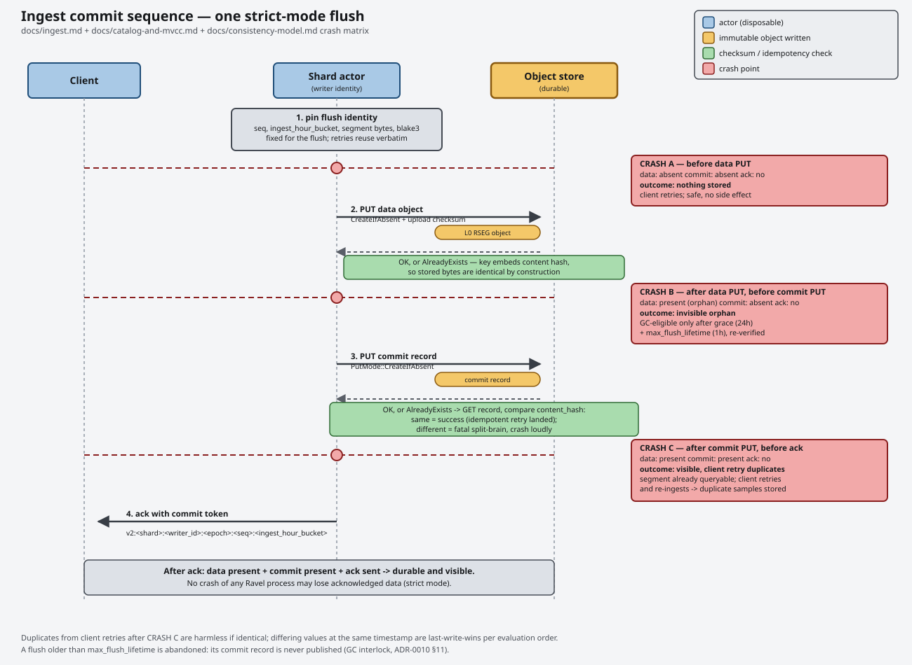

# Ingest

## Endpoints

`ravel-server` accepts OTLP metrics, logs, and traces on two transports.
`--listen-http` (default `127.0.0.1:4318`) and `--listen-grpc` (default
`127.0.0.1:4317`) bind them:

- `POST /v1/metrics` over HTTP, body is a binary-encoded
  `ExportMetricsServiceRequest` (`Content-Type: application/x-protobuf`).
- `opentelemetry.proto.collector.metrics.v1.MetricsService/Export` over
  gRPC.
- `POST /v1/logs` over HTTP, body is a binary-encoded
  `ExportLogsServiceRequest` (`Content-Type: application/x-protobuf`).
  Responds with a binary `ExportLogsServiceResponse`.
- `opentelemetry.proto.collector.logs.v1.LogsService/Export` over gRPC.
- `POST /v1/traces` over HTTP, body is a binary-encoded
  `ExportTraceServiceRequest` (`Content-Type: application/x-protobuf`).
- `opentelemetry.proto.collector.trace.v1.TraceService/Export` over gRPC.

All six are present only when `ravel-server` runs in `--mode all` (the
default) or `--mode gateway`. `--mode query` starts none of them. No
transport accepts profiles.

Authentication, the strict/buffered mode header, the commit-token
header, and the status-code mapping are identical on all six. A log or trace
export is a metrics export with a different payload and a different keyspace
underneath.

## Compressed requests

Ravel accepts gzip-compressed OTLP bodies on both transports. A stock
OpenTelemetry Collector and a stock Grafana Alloy both default to gzip, so no
client configuration is needed.

### OTLP HTTP

`POST /v1/metrics`, `/v1/logs`, and `/v1/traces` dispatch on `Content-Encoding`:

- `gzip`, or its RFC 9110 alias `x-gzip`, is decompressed and then decoded.
  The comparison is case-insensitive: `GZIP`, `gzip`, and `X-Gzip` are the same
  coding.
- An absent header, an empty value, or `identity` is the body as-is, byte for
  byte the uncompressed path. An uncompressed client sees no change.
- Any other single coding (`deflate`, `br`, ...), and any multi-coding list
  (`gzip, gzip`, `deflate, gzip`), is rejected with `415 Unsupported Media
  Type`. Ravel chains no decoders and never guesses at one member of a list.
  The 415 body names what is supported.

Two independent size caps bound a gzip request:

- The **compressed** body is capped at 16 MiB by the existing wire body limit
  (`DefaultBodyLimit`). This is the same Layer 1 cap that bounds an
  uncompressed body.
- The **decompressed** body is capped at 64 MiB, returning `413 Payload Too
  Large`. The cap is enforced *while* the body is inflated, not after: the
  decoder is read through `take(cap + 1)`, so a decompression bomb is refused
  as it expands rather than after 64 MiB has been allocated.

The two caps are independent, exactly as they are for Remote Write. A 16 MiB
compressed body that would inflate past 64 MiB is a 413; a body over 16 MiB
compressed never reaches the decompressor.

A gzip body is decoded as a whole stream with multi-member semantics: a
concatenated multi-member gzip stream (legal gzip that ordinary tooling
produces) is decoded in full, under the single 64 MiB cap across all members.
Trailing bytes after a well-formed stream ends are `400 Bad Request`, never
silently truncated: silent truncation would be data loss on an acknowledged
write.

### OTLP gRPC

The three gRPC services accept gzip via tonic's `accept_compressed`. Here the
decompressed size is bounded at **16 MiB**, not HTTP's 64 MiB. tonic applies
`max_decoding_message_size` to both the compressed frame and the decompressed
output (checking the framed length first, then limiting the inflate buffer to
the same value), so the one 16 MiB knob caps both halves. Raising it to match
HTTP would also raise the ceiling on uncompressed gRPC messages, which is a
separate change; Ravel accepts the asymmetry. A batch that inflates to
40 MiB is accepted over HTTP and rejected over gRPC with `resource_exhausted`.

Ravel does not compress responses (`send_compressed` is off): OTLP export
responses are small partial-success records, so compressing them buys nothing.

### Byte-rate charging differs by path

The per-tenant ingest byte rate (Layer 2) is charged on **different bases** by
path, and an operator sizing limits must know it:

| Path | Charged quantity |
|---|---|
| OTLP HTTP / gRPC | Decompressed size |
| Prometheus Remote Write | Compressed size |

OTLP charges the decompressed size so that two tenants
sending identical telemetry are charged identically regardless of a client-side
compression setting. Remote Write still charges the compressed body length;
this asymmetry is deliberate, and the inconsistency is acknowledged
rather than papered over. The practical effect: a gzip OTLP client spends its
byte-rate allowance at the rate of its decompressed telemetry, so its wire
rate understates its token spend by its compression ratio; two clients
sending the same telemetry spend the same tokens whether or not they
compress.

To keep rejection cheap for an already-over-rate tenant, the gzip path does a
compressed-size pre-check first: the compressed length is a strict lower bound
on the decompressed length, so if even the compressed size exceeds the tenant's
available tokens the request is rejected `429 Too Many Requests` before
anything is decompressed and without consuming tokens. Only if the pre-check
passes is the body inflated and the real charge made on the decompressed size.

## Authentication

Every request must resolve to a tenant. If it does not, Ravel rejects it with
`401 Unauthorized`. The default (and only always-on) resolver is a static
bearer-token map. One or more `--tenant-token TOKEN=TENANT` flags build it:

```sh
ravel-server --tenant-token devtoken=acme --tenant-token other=other-co ...
```

A request must send `Authorization: Bearer devtoken` to resolve as
tenant `acme`. There is no default tenant and no anonymous access. A
deployment is unauthenticated only if you pass no `--tenant-token` and no
`--tenant-token-file`, which is a conscious choice, not an oversight.

`--tenant-token-file PATH` (env `RAVEL_TENANT_TOKEN_FILE` for the path) is a
file-based alternative so a token never has to sit in argv or a process
listing: one `TOKEN=TENANT` pair per line, blank lines and `#` comments
ignored. Each line is split on the first `=`, exactly like `--tenant-token`,
so a token value containing `=` is mis-parsed the same way either way.
`--tenant-token` and `--tenant-token-file` are mutually exclusive;
`ravel-server` refuses to start with both set.

`--dev-insecure-tenant-header` adds a second resolver, tried only if the
bearer lookup fails. It reads the tenant name directly from an
`x-ravel-tenant` request header, with no token. If `--listen-http` does not
bind a loopback address (`127.0.0.1` or `::1`), `ravel-server` refuses to
start with this flag set. It exists for local development against a
loopback-only server, not for any deployment reachable over a network.

## Strict vs. buffered acknowledgement

Every write has a mode. The default is strict:

- **Strict**: the HTTP or gRPC call does not return until every shard your
  points landed in has flushed. A flush writes the shard's segment object and
  commit record durably to the object store. The response carries a commit
  token for each shard that flushed
  (`x-ravel-commit-token` over HTTP, comma-separated if more than one
  shard). After you have that ack, the data survives the crash of any Ravel
  process, because it survives everything the object store survives
  ([docs/consistency-model.md](../consistency-model.md)).
- **Buffered**: the call returns as soon as Ravel admits the request and
  enqueues it to its shard actor, before any flush. This is lower latency but
  not durable, and Ravel issues no commit token, because there is nothing yet
  to point one at. `max_flush_delay` (2s default) bounds when the shard's
  flush is triggered, not when it completes: the flush task then waits for a
  `max_inflight_flushes` permit on its shard before it issues its store
  calls, so a shard whose permits are held by a stalled flush widens the
  window a crash between the ack and the flush would lose. Already-acked rows
  are dropped with no crash at all when the flush's own store calls, made
  after it holds the permit, cannot complete in time: `max_flush_lifetime`,
  the budget for those store calls, defaults to 3600 s. It runs from the
  moment the permit is granted rather than from flush open, and it is not
  tunable from the server, so that case is a stuck backend and not a queue
  wait. A flush already past its flush-open deadline is abandoned without
  taking a permit, and its rows are lost the same way. A flush queued behind
  a stalled co-resident prefix reaches the store once the stall clears, so a
  co-resident stall on its own is not a buffered-mode loss.
  `ravel_ingest_abandoned_retry_exhausted_total` counts
  the flushes abandoned for store-call exhaustion and
  `ravel_ingest_abandoned_queue_deadline_total` those abandoned at the queue
  deadline ([docs/consistency-model.md](../consistency-model.md)).

To use buffered mode for one request, send `x-ravel-ingest-mode: buffered` as
an HTTP header or as gRPC metadata on the export. For strict mode, omit it or
send any other value. Ravel honors
the header for any tenant; there is no per-tenant setting that enables or
refuses buffered mode.

## Partial success and rejections

A single `ExportMetricsServiceRequest` can contain a mix of good and bad
data points. Ravel never silently drops a point. It counts every rejected
point (or group of points) and returns it in the OTLP
`ExportMetricsPartialSuccess` message, with `rejected_data_points` and a
combined `error_message`. Ravel still ingests and acknowledges the admitted
points normally.

Every rejection reason:

| Rejection | Meaning |
|---|---|
| `TooManyDataPoints` | The whole request exceeds `max_data_points_per_request`. Ravel admits nothing in the request. |
| `TooManyExplodedPoints` | The request fits `max_data_points_per_request` in data points, but the normalized points its classic histograms and summaries explode into do not. Ravel admits nothing in the request. The reported rejected count stays in data points, the unit the sender sent. |
| `TooManyResourceAttributes` | A `Resource` has more attributes than `max_resource_attributes`. Ravel rejects every point under it. |
| `MetricNameTooLong` | The metric name (before sanitization) exceeds `max_metric_name_len`. Ravel rejects every point on that metric. |
| `EmptyMetricName` | The metric name sanitizes to empty. Ravel rejects every point on that metric. |
| `TooManyAttributes` | One data point has more attributes than `max_attributes_per_point`. |
| `TooManyHistogramBuckets` | One classic `Histogram` data point has more `explicit_bounds` than `max_histogram_buckets`. Only that data point is rejected. |
| `LabelNameTooLong` | A label name (after sanitization) exceeds `max_label_name_len`. This also applies to the synthesized `job` label after its `namespace/name` join. |
| `LabelValueTooLong` | A label value exceeds `max_label_value_len`. |
| `DuplicateLabelName` | Two attributes sanitize to the same label name (or a data-point attribute collides with a synthesized `job`/`instance` label). |
| `ComplexAttributeValue` | An attribute value is an array, kvlist, or bytes value, which has no label representation. For a resource attribute, this rejects every point under that resource. |
| `MissingValue` | The data point has neither an int nor a double value set. |
| `UnsupportedTemporality` | A Sum, Histogram, or ExponentialHistogram metric has delta (or unspecified) temporality. Ravel accepts only cumulative aggregations. |
| `ZeroTimestamp` | The data point's event timestamp is zero. |
| `FutureSkew` | The event timestamp is ahead of ingest time by more than `max_future_skew_ns`. |
| `TooOld` | The event timestamp is behind ingest time by more than `max_ingest_lag_ns`. |
| `OversizedSeriesComponent` | A series identity component (tenant, metric name, or label set) is too large to encode. |
| `HistogramMinMaxDropped` | Informational. The point is stored; its `min`/`max` fields are not, because they have no Prometheus-convention representation. Zero rejected points; see [Zero-count partial success](#zero-count-partial-success). |
| `HistogramExemplarsDropped` | Informational. The point is stored; some of its exemplars were malformed or fell past the per-series admission cap. Applies to any metric type, not only histograms. Zero rejected points. |
| `IntegerValuePrecisionLoss` | Informational. The point is stored, but its `as_int` value has a magnitude above 2^53 and was stored as the nearest `f64`. Zero rejected points. |

Two behaviors are worth knowing about, both intentional:

- String attribute values pass through verbatim. Ravel canonicalizes bools,
  ints, and doubles to their string form (`true`, `3`, `3.5`).
- Label and metric name sanitization replaces each disallowed character
  with `_` in place. It does not shift or prefix. A metric named `1foo` and
  one named `_foo` both sanitize to `_foo` and become the same series. This
  is a documented consequence of the sanitization rule, not a bug.

### Zero-count partial success

Some rejections cost the sender nothing. A histogram data point whose `min`
and `max` fields have no Prometheus-convention representation is stored
without them; exemplars past the per-series admission cap are not carried;
an OTLP `as_int` value with a magnitude above
2^53 is stored as the nearest `f64`. The same is true of a log record or a
span with one bad attribute: the attribute is dropped and the record or span
is stored. In each case the unit itself was admitted, so it contributes zero
to the rejected count.

Ravel reports these anyway. **The rule every OTLP surface follows is to emit a
partial success whenever anything was rejected at all, never when some unit
count is above zero.** A drop of this kind comes back as
`rejected_data_points = 0` (or `rejected_log_records = 0`, or
`rejected_spans = 0`) together with a populated `error_message` naming it.
The OTLP proto documents `error_message` as a channel for warnings on an
otherwise successful response, and a zero count with a message is that
channel. Gating on the count instead would return a response byte-identical
to a clean write, and a sender losing a field on every export would never
learn it.

Which transport you use decides whether the report reaches you, and the
transports do not agree:

- **OTLP over HTTP and gRPC**, for metrics, logs, and spans: reported, as
  above.
- **OTAP** (metrics only): not reported. `BatchStatus` carries one
  `status_message` string, and Ravel spends it on the active-series-cap
  drop count and the commit tokens; no normalization-layer rejection,
  informational or not, reaches it. The drop is still visible in the
  per-tenant rejection counters.
- **Remote Write**: not reported, and there is no partial-success message on
  that surface to report it in. Its only per-request feedback is the
  `x-prometheus-remote-write-samples-written` family of headers, which count
  what was admitted.

## Delta temporality metrics

Ravel stores cumulative metrics only. A `Sum`, `Histogram`, or
`ExponentialHistogram` whose `aggregation_temporality` is delta (or
unspecified) is rejected as `UnsupportedTemporality`, and the response reports
every point under that metric as rejected. This is not a temporary
restriction: converting delta to cumulative means holding the running total
for every series between requests, and a Ravel compute process keeps no
durable local state, so it has nowhere correct to hold it. A process restart
mid-stream would silently reset the totals.

Temporality is a property of the metric, not of the individual point: the
`aggregation_temporality` field sits on the `Sum` and `Histogram` messages,
above the data points, so a metric cannot carry a mix. Rejecting the whole
metric rejects exactly the points that share the delta temporality, and no
others.

Convert in the collector instead, which is a stateful process that owns local
memory. The `deltatocumulative` processor
(`otel/opentelemetry-collector-contrib`) holds the per-series accumulators and
emits cumulative points:

```yaml
processors:
  deltatocumulative:
    # Forget a series after this long without a point, so a churning series
    # set cannot grow memory without bound.
    max_stale: 5m
    # Ceiling on tracked series. Points for an untracked series past it are
    # dropped by the processor, not buffered and not forwarded.
    max_streams: 1000000
  batch:

service:
  pipelines:
    metrics:
      receivers: [otlp]
      # Convert before batching, so batches carry converted points.
      processors: [deltatocumulative, batch]
      exporters: [otlphttp]
```

Two consequences to plan for. The processor's memory is proportional to the
number of live series, so `max_streams` is a real ceiling and not a formality;
size it above the tenant's active series count. Reaching it costs data rather
than memory: once the processor is tracking `max_streams` series, a point for
a series it is not already tracking is dropped inside the collector. It is not
buffered and it is not forwarded unconverted, so nothing about it reaches
Ravel and no Ravel rejection counter moves. The only signal is the collector's
own `otelcol_deltatocumulative_datapoints_total{error="limit"}`; alert on it,
because from the database's side this loss is invisible. And the first point
of each series after a collector restart re-bases that series' accumulator,
which appears downstream as a counter reset. PromQL's `rate` and `increase`
handle resets, so query results stay correct, but a dashboard reading a raw
counter value shows the drop.

The alternative is to configure the sender for cumulative temporality
directly, which most OpenTelemetry SDKs support through the
`OTEL_EXPORTER_OTLP_METRICS_TEMPORALITY_PREFERENCE=cumulative` environment
variable. That avoids the conversion and its memory entirely, and is the
better fix where the sender is yours to configure.

Watch `ravel_admission_rejected_total{reason="structural"}`
([observability guide](observability.md#reading-the-reason-label)) to confirm
the rejections stopped.

## Metric metadata and OTLP name suffixing

Ravel captures each metric's type, help, and unit at ingest time and serves it
back through [`GET /api/v1/metadata`](query.md#get-apiv1statusbuildinfo-and-get-apiv1metadata).
Every path supplies it: OTLP reads `Metric.description` (help) and `Metric.unit`
alongside the name and infers the type from the data shape; Remote Write v1 and
v2 stop discarding the `MetricMetadata`/per-series metadata they already parse.
Capture is best-effort and off the acknowledgement path, so a point is acked on
its data write and never waits on or fails from the metadata record.

OTLP metric names also get the standard OpenTelemetry-to-Prometheus suffixes a
Prometheus exporter would add, so the same metric ingested over OTLP or scraped
through a collector lands under one series name. The unit is mapped and appended
(`s` becomes `_seconds`, `By` becomes `_bytes`), then a monotonic `Sum` gets
`_total`: a monotonic counter named `foo` with `unit: "By"` ingests as
`foo_bytes_total`. This is an ingest-time transform on the name string only; it
does not touch series identity or any stored format. It is a one-time,
intentional naming change for dashboards built directly against the unsuffixed
OTLP names.

## Job and instance labels

If the resource has `service.name`, its points get a `job` label. The value is
`service.namespace/service.name` if a namespace is present, else just
`service.name`. `service.instance.id`, if present, becomes `instance`. Ravel
flattens a configurable allowlist of other resource attributes into labels,
and replaces dots with underscores. The default allowlist is
`k8s.namespace.name`, `k8s.pod.name`, `k8s.container.name`, `host.name`,
`deployment.environment.name`, `cloud.provider`, `cloud.region`. Ravel drops
any resource attribute that is not on this list and not one of the three
above; it does not store it as a label. The allowlist is still fixed at build
time, not configurable per tenant, but the drop is no longer silent:
`ravel_ingest_resource_attrs_dropped_total` counts it, including the case
where two resources differing only in a dropped attribute collapse into one
series. See [the observability
guide](observability.md#resource-attributes-outside-the-allowlist).

An event-time skew alert
([observability guide](observability.md#reading-the-reason-label)) cannot be
attributed to one writer from `/metrics` alone.
`ravel_admission_rejected_total{reason="skew"}` is broken out by
`tenant_hash`, `signal` and `reason`, and by nothing that names a sender. A
skew-rejected point is never stored, so it produces no ingested series that
could carry the sender's `instance`. The `instance` label Prometheus attaches
beside that counter is the scrape target: the Ravel pod that rejected the
point, not the pod that sent it. The counter cannot be narrowed per shard
either. `shard` is never combined with `tenant_hash` on any sample, and this
counter is per tenant.

Finding the writer is a different query against the tenant's admitted
series. A lagging pod's points that pass admission still carry its late
timestamps, so the newest sample time per `instance` shows which pod's clock
trails the rest. That works only if the collector config gives each pod a
distinct `service.instance.id` (for example, populated from the pod name via
the downward API). A static or unset value collapses every replica of a job
onto one `instance` label, and one pod's broken clock becomes
indistinguishable from the rest of the fleet.

### Per-pod resource attributes and shard spread

A distinct per-pod resource attribute is not only a skew-attribution aid: it
is the precondition for `--shards` to spread log ingest across shards at
all. A log stream id is the hash of its resource attributes plus scope
([docs/ingest.md](../ingest.md)), and `shard_for_log` routes on that hash
modulo the shard count. A collector fleet where every pod sends the same
resource attribute set (a static or unset `service.instance.id`, the same
`host.name` behind a shared load balancer, and so on) hashes to one stream
id and therefore one shard actor, however high `--shards` is raised: raising
the count moves the whole tenant to a different single shard, it does not
divide the tenant's writes across more of them. The
[`ravel_ingest_shard_*` family](observability.md#per-shard-ingest-skew-ravel_ingest_shard_)
shows this directly: one `shard` series carries the load and the rest read
zero. Fix the collector config to give each pod a distinct
`service.instance.id`, not the `--shards` flag.

## Commit tokens and read-your-write



A strict-mode ack returns one commit token for each shard that flushed. Each
token is self-locating: it is base64url of
`v2:<shard>:<writer_id>:<epoch>:<seq>:<ingest_hour_bucket>`. Pass any of
those tokens back as `min_commit_token` on a query
([docs/guides/query.md](query.md#min_commit_token)). The catalog then GETs
that exact commit record directly, instead of relying on a listing that
might not yet include it. If the catalog cannot resolve the token, the query
fails with a 5xx `unavailable` error. It does not silently serve a snapshot
that predates your write.

## Admission limits

Defaults. No `ravel-server` flag configures them:

| Limit | Default |
|---|---|
| `max_data_points_per_request` | 100,000 |
| `max_attributes_per_point` | 64 |
| `max_histogram_buckets` | 160 |
| `max_label_name_len` | 256 bytes |
| `max_label_value_len` | 4,096 bytes |
| `max_metric_name_len` | 512 bytes |
| `max_resource_attributes` | 128 |
| `max_future_skew_ns` | 10 minutes |
| `max_ingest_lag_ns` | 2 hours |

`max_data_points_per_request` is checked twice: once against the data points
the request carries on the wire, and once against the normalized points those
data points expand into, since one classic `Histogram` data point becomes one
point per explicit bound plus `+Inf`, `_sum`, and `_count`, and one `Summary`
data point becomes one point per quantile plus `_sum` and `_count`. Both
checks read vector lengths only, so neither costs an allocation. The count a
rejection reports back to the sender stays in wire data points.

`max_histogram_buckets` bounds the `explicit_bounds` of a single classic
`Histogram` data point. It exists because that bound list is the sender's to
choose and each bound it carries becomes a stored series with its own copy of
the point's labels; it is a memory-safety bound, not a shape you are meant to
tune. The default is an order of magnitude above the widest bound list a real
exporter emits (the Prometheus Go client's `DefBuckets` is 11 bounds, the
OpenTelemetry SDK's default explicit boundaries are 15), so a real histogram
never meets it. Exponential (native) histograms are not exploded and are not
subject to it.

## Event-time skew bounds

Ravel never trusts a data point's event timestamp for discovery. It buckets
commit records by ingest hour, not event hour. A query then only has to
look at buckets near "now" to find recent writes. The skew bounds keep
event time close enough to ingest time for this to hold:

- More than 10 minutes in the future (`FutureSkew`): rejected. A point far in
  the future would sit in an ingest-hour bucket that a query does not check
  yet. It would also be indistinguishable from clock skew or a hostile sender
  that tries to make data invisible to normal query ranges.
- More than 2 hours in the past (`TooOld`): rejected. A point that old could
  otherwise land in an ingest-hour bucket that a query has already finished
  reading, and the reader would never revisit it. This is also why
  [scripts/demo.sh](../../scripts/demo.sh) regenerates its OTLP fixture with
  fresh timestamps on every run.

Both bounds are inclusive. A skew or lag exactly equal to the limit is
accepted; one nanosecond past it is rejected.

Logs and spans enforce the same window at admission. For a
**span**, the bounded timestamp is its **end** (`end_ts_ns`), on both edges,
and `end_ts < start_ts` is rejected outright. The lag bound anchors on the
end, not the start: a long-running span that
started more than `max_ingest_lag_ns` ago but ended within the window is
admitted; only a span reported more than `max_ingest_lag_ns` after it *ended*
is `TooOld`. The listing window stays sound because any span overlapping a
query range has its end at or after the range start.

Ravel also checks its own receiver clock at admission: a reading
below a compiled floor (2020-01-01T00:00:00Z) or one that
yields no representable ingest-hour bucket rejects the whole request with
`503` / gRPC `UNAVAILABLE`, counted under
`ravel_admission_rejected_total{reason="clock"}`. This is the replica's
fault, not the request's, and is retryable against a healthy replica. The
same floor extends the fail-loud flush-open check.

## Logs

Everything above about authentication, strict vs. buffered acknowledgement,
and commit tokens applies unchanged to `POST /v1/logs` and the gRPC
`LogsService`. This section covers what differs.

```sh
curl -X POST http://127.0.0.1:4318/v1/logs \
  -H 'authorization: Bearer devtoken' \
  -H 'content-type: application/x-protobuf' \
  --data-binary @logs.pb
```

A strict-mode log export returns `200` with a binary
`ExportLogsServiceResponse` body and one `x-ravel-commit-token` for each shard
that flushed, exactly like a metrics export. An unresolvable tenant returns
`401`, an undecodable protobuf body returns `400`, and a write that the log
pipeline cannot accept returns `503`.

Log records are durable in RLOG objects under the tenant's `l` keyspace after
the strict ack returns. **Logs are queryable two ways**: over SQL, where the
`logs` table is registered on the `POST /api/v1/sql` endpoint
([query.md](query.md#sql-over-samples-logs-and-spans) documents its schema
and usage), and over PromQL, through the reserved `ravel_log_lines` and
`ravel_log_bytes` metric names
([query.md](query.md#promql-over-logs) documents the label mapping and
routing rule). You can also read a log object back directly with
`ravel-cli rlog inspect` ([inspecting-data.md](inspecting-data.md)).

### Log admission limits

Defaults. No `ravel-server` flag configures them:

| Limit | Default |
|---|---|
| `max_records_per_request` | 100,000 |
| `max_attributes_per_record` | 128 |
| `max_attribute_key_len` | 256 bytes |
| `max_attribute_value_len` | 8,192 bytes |
| `max_body_len` | 65,536 bytes |
| `max_resource_attributes` | 128 |
| `max_scope_attributes` | 64 |

The body and attribute-value ceilings are deliberately wider than the metric
equivalents. A log body carries a message or a stack trace, where a metric
label value carries an identifier. The asymmetry is intentional.

Admission ordering: Ravel checks these limits after it decodes the whole
request into memory, on both transports. They bound per-record work and
what reaches the shard buffer. They do not bound decode-time allocation;
only the transport's body/message size limit bounds that.

### Log rejections

The partial-success contract is the same as metrics, with
`ExportLogsPartialSuccess.rejected_log_records` and a combined
`error_message`. Ravel still ingests and acknowledges the admitted records. The
`error_message` aggregates by distinct reason with a per-reason count, and its
length is capped. A request rejected wholesale therefore does not produce a
response string proportional to its record count.

A dropped attribute is reported the same way, with `rejected_log_records` at 0:
the record itself was stored, so it costs the sender no record. See
[Zero-count partial success](#zero-count-partial-success) for the rule and for
which transports carry it.

Every rejection reason:

| Rejection | Meaning |
|---|---|
| `TooManyRecords` | The whole request exceeds `max_records_per_request`. Ravel admits nothing in the request. |
| `TooManyResourceAttributes` | A `Resource` has more attributes than `max_resource_attributes`. Resource attributes are part of log stream identity, so no record under that resource can get one. Ravel rejects every record under it. |
| `TooManyScopeAttributes` | An instrumentation scope has more attributes than `max_scope_attributes`. Scope attributes are also part of stream identity, so Ravel rejects every record under that scope. |
| `TooManyAttributes` | One record has more attributes than `max_attributes_per_record`. Ravel rejects that record. |
| `AttributeKeyTooLong` | An attribute key exceeds `max_attribute_key_len`. Ravel drops that one attribute, not the record. |
| `AttributeValueTooLong` | An attribute value's payload exceeds `max_attribute_value_len` (nested list and map entries count toward it). Ravel drops that one attribute, not the record. |
| `BodyTooLong` | The record body, after normalization to a string, exceeds `max_body_len`. Ravel rejects that record. |
| `UnsupportedBodyKind` | The body is a string-table reference, which indexes a table the record does not carry, so there is nothing to store. Array and map bodies are converted, not rejected; see below. |
| `MissingAttributeValue` | An attribute arrived with its `value` field unset. Ravel drops and reports that one attribute; it never silently discards it. |
| `UnsupportedAttributeValue` | An attribute value is a string-table reference (`strindex`), which carries no value of its own. Ravel drops that one attribute. |
| `Grouped` | Not a reason of its own. It carries one of the reasons above plus the number of records it applies to, for a rejection that covers a whole resource or scope. Ravel reports it as that inner reason with a count. |

Body normalization: a `StringValue` body passes through verbatim. `BoolValue`
and `IntValue` become their plain string form. `DoubleValue` uses the same
float formatting that the metrics path uses. `BytesValue` becomes a hex
string. A record with no body at all normalizes to an empty body, which is
legal OTLP, not a rejection.

An `ArrayValue` or `KvlistValue` body is stored as JSON text. The rendering is
canonical, so two exports of the same body always produce byte-identical
stored text:

- Map keys are ordered by the same rule that orders attributes in stream
  identity, which is a byte ordering on the key and then on the encoded value,
  not the sender's order and not lexicographic ordering of the JSON text. Two
  entries with the same key are both kept, ordered by their values.
- Array elements keep the sender's order, which is part of the value.
- Nested arrays and maps render recursively under the same rules. Nesting is
  bounded by the same depth limit that applies to attribute values. A body
  past that depth, or one holding an unset value or a nested string-table
  reference, is rejected as `UnsupportedBodyKind`: what the sender lost is the
  body, so the record is reported that way rather than as an attribute
  problem.
- A bytes value inside the body renders as a lowercase hex string. A
  non-finite double renders as the JSON string `"NaN"`, `"+Inf"`, or `"-Inf"`,
  since JSON has no literal for them. Those are the exact three strings a
  query predicate has to match; they are the same forms a top-level double
  body of the same value takes.

The converted text is bounded by `max_body_len` like any other body, so a
large structured body can still be rejected as `BodyTooLong`. The bound is
applied while the text is produced rather than to a finished string: the
sender chooses how much text its value renders to, so conversion stops at the
first byte that would carry the text past `max_body_len` and rejects there,
without rendering the rest. The `len` such a rejection reports is that
stopping point, one byte past the limit, not the length the full text would
have had.

Conversions are counted per tenant and signal in
`ravel_ingest_body_conversions_total`. That counter is not a rejection
counter, and it is not a count of stored records either: it is incremented at
normalization, before the active-stream cap and before the write, so a
counted record can still be dropped by the cap or lost with a failed write.
It exists so that a query returning JSON text where a reader expected a plain
message has a place to check. The
[observability guide](observability.md#reading-the-reason-label) holds the
normative description.

Malformed `trace_id`/`span_id` byte lengths normalize to absent; Ravel does
not pad or truncate them. Padding would fabricate an id that never existed.
A record with neither `time_unix_nano` nor `observed_time_unix_nano` set
(legal OTLP) takes the server's ingest timestamp for both.

## Bulk import (`ravel-cli load --parquet`)

OTLP is the only *networked* way to write to Ravel. For loading an existing
structured dataset offline (a Parquet export, an archive migration, a
historical backfill), `ravel-cli load` imports a Parquet file into the signal
`--signal` names:

```sh
ravel-cli load --parquet events.parquet --tenant acme --mapping map.toml --shards 4
ravel-cli load --signal metrics --parquet samples.parquet --tenant acme \
  --mapping metrics.toml --shards 4
ravel-cli load --signal spans --parquet traces.parquet --tenant acme \
  --mapping spans.toml --shards 4
```

`--signal` defaults to `logs`, so an invocation written before the flag
existed is unaffected. `--signal metrics` loads the metrics signal ([Loading
metrics](#loading-metrics) below).

`--signal spans` provisions or validates the tenant's spans signal, builds a
`SpanIngestRouter` from the same configuration, and writes every batch with
strict acknowledgement. One input row is one span:

```toml
[spans]
trace_id_column       = "trace_id"   # 16-byte binary or 32-character hex string
span_id_column        = "span_id"    # 8-byte binary or 16-character hex string
parent_span_id_column = "parent"     # optional; a null or empty cell is a root
name_column           = "name"
start_ts_column       = "start"
start_ts_unit         = "nanos"      # seconds | millis | micros | nanos
end_ts_column         = "end"
end_ts_unit           = "nanos"
status_code_column    = "status"     # optional; OTLP's 0 unset / 1 ok / 2 error
status_message_column = "status_msg" # optional

# Merged into the span's one attrs map. A key may not appear in both attribute
# lists; such a mapping is refused, so this merge never resolves a collision.
[[spans.resource_attribute]]
key = "service.name"
column = "svc"
type = "str"

[[spans.attribute]]
key = "http.method"
column = "method"
type = "str"                         # str | i64 | f64 | bool | bytes
```

**A span loaded here is stored as the same record the same span sent over OTLP
produces.** Attribute values are coerced to the strings RSPAN's
`Map<Utf8, Utf8>` holds by OTLP's own rules -- an integer and a boolean
verbatim, a float through the same Go-compatible formatter the `le` label
uses, bytes as lowercase hex -- the resource-over-span merge is
`ravel_rspan::merge_attrs`, and the status column goes through `ravel-otlp`'s
own enum mapping, so a value outside `0..=2` normalizes to unset here as it
does there (including one too wide for `i64`). An empty parent cell is a root
span, exactly as OTLP's own empty `parent_span_id` field is, so a file that
writes roots as empty bytes or `""` loads unchanged. An attribute value longer
than the 8192-byte cap drops that attribute and keeps the span, which is what
the OTLP path does with it; the load summary prints how many values were
dropped that way (`attrs_dropped`), which is where the OTLP path's
`AttributeValueTooLong` partial-success entry goes on a load. The count is
taken where each span is built, so a FAILED load's `attrs_dropped` also covers
the batches the failure abandoned, whose spans are in no object; the line
printed there says so rather than claiming stored spans. A null attribute
cell is an attribute the row does not carry, as an OTLP `KeyValue` carrying no
value is dropped as `MissingAttributeValue`. An empty attribute value is a
value and is stored, unlike an empty metric label.

**What still differs from OTLP**, and this is the complete list: for the same
input, nothing else about the stored record differs between a Parquet load and
an OTLP export.

- **A null `start_ts`, `end_ts` or `name` cell is refused.** OTLP has no null
  for any of the three: a timestamp it omits is a zero (and a zero takes the
  same fallbacks here, load time for the start and the start for the end), a
  name it omits is the empty string. In a file the operator controls, a null
  there is a mapping or export mistake, and giving it a load-time default
  would hide the span rather than report it.
- **A negative timestamp is refused.** OTLP's two timestamps are unsigned and
  have no negative to express. A negative start beside a positive end would
  store a span whose interval overlaps nearly every query window; the usual
  cause is a declared `start_ts_unit`/`end_ts_unit` that does not match the
  column, and the refusal names both.
- **A non-empty `parent_span_id` of the wrong width is refused**, where OTLP
  drops the field and admits the span as a root. An OTLP sender's malformed
  field is one record of a live stream; a mapped column producing unusable ids
  is a mapping mistake the whole file shares, and a silently re-rooted span
  tree is not visible in the data.
- **Attribute keys and the two attribute-count caps are checked against the
  `--mapping`, not per span.** A key that is empty, longer than the 256-byte
  OTLP cap, reserved for a span field this version does not map, or declared
  in both attribute lists refuses the load before any row is built; OTLP drops
  the over-long key's attribute and admits an empty one. So do a mapping with
  more than 1024 `[[spans.attribute]]` columns (the loader per-record cap,
  standing in for OTLP's 128 `max_attributes_per_span`) or more than 128
  `[[spans.resource_attribute]]` columns (OTLP's own `max_resource_attributes`,
  which rejects the spans under an over-cap resource). A key and a column count
  are properties of the mapping, so a bad one is wrong for every row in the
  file.

Separately from the record itself, the past-event-time lag bound is relaxed on
every load path, which is what admits a historical backfill at all; the
future-skew bound is kept and anchored on the span's end, as OTLP anchors it.

**The mapping reads one flat row per span**, so a trace export shaped any
other way is converted before it is loaded. Four shapes need it, and none of
them is a mapping this version can express: a file that nests a trace's spans
in one row (a list or struct column per trace) has to be flattened to one row
per span; attributes held in a `Map` or `Struct` column have to be pivoted to
one scalar column per attribute key, since `[[spans.attribute]]` names a
column and a value type; a duration column has to be turned into an absolute
`end_ts` in a unit `end_ts_unit` names; and a status written as a string
(`"OK"`, `"ERROR"`) has to become OTLP's 0/1/2 integer, since
`status_code_column` reads that enum and nothing else. Pointing a mapping at
an unconverted column of any of these shapes fails the load rather than
importing part of the file: a column whose type cannot supply the field is
refused, naming the type it found (an id column's refusal also names the
column), and a duration read as an `end_ts` is refused for ending before its
span starts.

Span events and span links are not mappable in this version, and a mapping
that names them is refused by name rather than as a typo. The same refusal
covers the reserved `attrs` keys the OTLP path stores span kind, trace state,
span flags, events and links under (`_kind`,
`_trace_state`, `_flags`, `_events_raw`, `_links_raw`): a mapped column there
could only fabricate a field this version does not map. An id column that
cannot carry an id of the right width is refused when the batch's columns are
resolved, before any row is built or written -- Ravel never pads or truncates
an id.

Like a metrics load, a spans load reads **one sequential cursor** and has no
decode/encode queue, so `--read-cursors` and `--decode-queue-batches` change
nothing and the loader warns when either was set to a value it ignores. A
value of 0 for either is still rejected. Everything that shapes the objects
(`--shards`, `--batch-rows`, `--target-bytes`, `--max-inflight-flushes`,
`--max-flush-delay`, `--pipeline-depth`) applies unchanged, and spans bucket
by load time exactly as logs and metrics do.

The loader is an in-process caller of the same log ingest router OTLP uses --
the same shard actors, flush cadence, and commit protocol, not a parallel write
path. It builds the router against the target tenant's provisioned shard count
(validated against, or written to, the durable provisioning record exactly as
the server does at first touch) and writes with strict acknowledgement, awaiting
every write before it exits, so a run that returns success has no
buffered-but-unflushed data.

### The columnar fast path

The Parquet a load reads is already columnar, and the RLOG object it writes is
columnar too. The loader builds the storage-native columnar batch directly from
each Arrow `RecordBatch` and hands it to the router as a column batch,
skipping the per-row record pivot the record path builds and the per-row
gather the writer runs to undo it. Every Arrow downcast and the
`ts_unit` scaling are resolved once per column, stream identity is hashed once
per distinct resource-attribute tuple rather than once per row, and admission
checks (future skew, the length caps) are applied over whole columns while still
reporting a rejected row by its absolute file index. The commit protocol, object
key layout, strict-ack contract, and the RLOG format itself are unchanged: this
is a CPU path, and a columnar load writes byte-for-byte the same objects a
record-path load would.

When a mapped string column arrives **dictionary-encoded**, the loader passes
the dictionary through so the writer pays string encoding and token-bloom cost
once per distinct value instead of once per row. A column arrives that way when
the file's embedded Arrow schema already types it as an Arrow `Dictionary`, and
also when it is a top-level UTF-8 `BYTE_ARRAY` column whose every data page, in
every row group, is dictionary-encoded and whose type is plain `Utf8`: the
loader reads such a column as an Arrow `Dictionary` whether or not the file
carries an Arrow schema. A string column with any plainly encoded page (a
writer's dictionary that outgrew its page limit and fell back to plain, as a
unique-per-row column does), one the file's Arrow schema types as
`LargeUtf8`, or one nested below the top level decodes to a plain Arrow string
column and stays on the per-row string path; both produce identical output.
The one exception to that plain-page rule is a file whose footer records no
page encoding statistics: the loader then has only the chunk's encodings list,
which names the dictionary encoding for a chunk that fell back to plain too,
so such a chunk is read as an Arrow `Dictionary` (with identical values; only
the per-block work differs). A column the file's Arrow schema types as
`Utf8View` (a common polars output) is not read at all: the loader reads
`Utf8`, `LargeUtf8` and dictionary-encoded string columns only, and refuses a
`Utf8View` column at its first non-null cell.

A mapped `trace_id` or `span_id` column loads whether it is plain or
dictionary-encoded: a hex id column that a default Parquet writer
dictionary-encoded stores the same ids as its plain copy, and a null cell stores
no id in either form.

### The `--mapping` TOML

The mapping declares how source Parquet columns become record fields. It
carries exactly one signal section -- `[logs]`, `[metrics]` or `[spans]` --
and that section must match `--signal`. A mapping written before the sections
existed, whose logs keys sit at the document root with no section at all, is
still read as the `[logs]` section, so no existing mapping
file needs migrating. Mixing the two spellings in one file is refused: with
both present there is no rule saying which one a load would use.

The logs section declares how source columns become record fields. Resource
attributes determine stream identity and are declared separately from
record attributes, which never enter identity:

```toml
ts_column = "timestamp"
ts_unit   = "millis"        # seconds | millis | micros | nanos

body_column            = "message"   # optional
severity_number_column = "sev_num"   # optional (integer column)
severity_text_column   = "level"     # optional (string column)
trace_id_column        = "trace_id"  # optional (16-byte binary or 32-hex string)
span_id_column         = "span_id"   # optional (8-byte binary or 16-hex string)
attrs_map_column       = "attrs"     # optional; export only, load never reads it

# Resource attributes: part of stream identity.
[[resource_attribute]]
key = "service.name"
column = "svc"
type = "str"

# Record attributes: typed values in the record's `attrs`, never stream identity.
[[attribute]]
key = "http.status_code"
column = "status"
type = "i64"                # str | i64 | f64 | bool | bytes
```

`attrs_map_column` is write-side only: `ravel-cli export` writes every record
attribute no `[[attribute]]` entry covers into that one map column, and
`ravel-cli load` ignores it (see [What round-trips and what does
not](#what-round-trips-and-what-does-not)).

**Date columns.** An Arrow `Date32` or `Date64` source column is mapped with
`type = "i64"`, and its value is stored in its native unit, unchanged: a
`Date32` stores **days since the Unix epoch**, a `Date64` stores **milliseconds
since the Unix epoch**. Neither is rescaled to nanoseconds, and neither may be
used as the `ts_column` (a date is not a valid event-time source; the loader
rejects it there). So a query comparing against a mapped date column compares
against that raw day or millisecond integer, not a timestamp -- e.g. a `Date32`
for 2024-05-16 is the integer `19876`.

### Loading metrics

`--signal metrics` provisions or validates the tenant's metrics signal, builds
an `IngestRouter` from the same configuration the logs load uses, and writes
every batch with strict acknowledgement, exactly as the logs path does. What
differs is the mapping and the normalization.

```toml
[metrics]
name_column  = "metric"   # a column, OR name = "http.server.duration"
value_column = "value"
ts_column    = "ts"
ts_unit      = "millis"   # seconds | millis | micros | nanos
unit         = "s"        # optional UCUM unit (see below)
kind         = "counter"  # optional: gauge (default) | counter

[[metrics.label]]
name   = "job"
column = "svc"

# Optional classic-histogram shape. With it, one input row is one bucket.
[metrics.histogram]
le_column    = "le"
sum_column   = "sum"
count_column = "count"
```

A label cell that is null is omitted from the series, and so is one holding
the empty string: an empty attribute value is dropped before the label set is
built on every ingest path, so `{job=""}` and `{}` are one series,
not two. A non-string label column is stringified -- a float through the same
Go-compatible formatter the `le` label uses, so two columns carrying the same
number never produce two series.

#### The name is normalized exactly as OTLP normalizes it

**A metric loaded here lands on the same `SeriesId` as the same metric
admitted over OTLP.** That is a property of the loader, not a coincidence of
how a mapping is written, and it is what makes a bulk import and a live
OTLP feed of the same metric one series rather than two. The loader applies
the OTLP name pipeline (`ravel_otlp::normalize`) in the same order:

1. the raw name is checked against the metric-name length cap;
2. every character outside the Prometheus metric-name set is rewritten to `_`,
   so `http.server.duration` becomes `http_server_duration`; each mapped label
   name goes through the same rewrite for label names, so `http.method`
   becomes `http_method`;
3. the `unit` key's UCUM value selects a suffix by the OTLP-to-Prometheus
   unit table (`s` gives `_seconds`, `By` gives `_bytes`, `1` gives `_ratio`
   on a gauge), appended unless the name already ends with it;
4. `kind = "counter"` sets `is_monotonic_sum` on every point and appends
   `_total`, exactly as a monotonic OTLP `Sum` does, again unless the name
   already ends with it.

So `name = "http.server.request"`, `unit = "1"`, `kind = "counter"` stores
`http_server_request_total`. Declare `unit` when the source data has one: a
mapping that omits it stores an unsuffixed name, which is a *different series*
from the same metric arriving over OTLP with its unit set. See [metric
metadata and OTLP name suffixing](#metric-metadata-and-otlp-name-suffixing)
for the suffix table itself.

`kind` may not be set together with `[metrics.histogram]`: OTLP has no
monotonic histogram, every series a classic histogram explodes into is
non-monotonic, and its family name takes no `_total`. The combination is
refused rather than ignored.

#### Classic histograms: one row is one bucket

With `[metrics.histogram]`, **one input row is one bucket of one data point**,
and a data point is a contiguous run of rows sharing a metric name, label set
and `ts`:

| ts | le | value | sum | count | svc |
| --- | --- | --- | --- | --- | --- |
| 1700000000000 | 0.1 | 2 | 12.5 | 7 | api |
| 1700000000000 | 1.0 | 3 | 12.5 | 7 | api |
| 1700000000000 | 10.0 | 1 | 12.5 | 7 | api |

- the `value` column is that bucket's **own** count (the OTLP `bucket_counts`
  convention), not a running total. The loader accumulates, so an
  already-cumulative Prometheus `_bucket` export must be de-accumulated before
  it is loaded. The three rows above store cumulative bucket values 2, 5, 6;
- `le` is that bucket's explicit upper bound and must be finite. The `+Inf`
  bucket is **not a row**: it is synthesized from the `count` column, matching
  OTLP, where `explicit_bounds` carries only the finite bounds. Bounds must
  strictly increase in row order, and a data point may carry at most 160 of
  them (the OTLP `max_histogram_buckets` limit). The limit is checked as rows
  arrive, so a mapping that mistakenly makes a whole file one data point (a
  `ts_column` naming a constant, or a missing `[[metrics.label]]`) is refused
  at the 161st row of that group, naming its first row;
- `sum` and `count` describe the whole data point, so every row of one group
  must repeat the same values; a row that disagrees is refused, naming the
  first row of its group. A null `sum` cell emits no `_sum` series, matching an
  OTLP data point with no `sum` field;
- the group explodes into `<name>_bucket` (one per bound plus `+Inf`),
  `<name>_sum` and `<name>_count`, the same series
  `ravel_otlp::normalize`'s `explode_histogram` produces.

Counts are whole numbers: a fractional `value`, `count` or bucket count is
refused rather than truncated, and an integer column is read as an integer, so
a count above 2^53 survives.

**Sort each data point's rows together.** The grouping reads a contiguous run,
and a group whose identity was already closed earlier in the file is refused
rather than exploded twice, since two explosions of one `(series, ts)` would
write two conflicting cumulative ladders. Interleaved bucket rows are a
rejection, not a silent misread.

A metrics load therefore reads **one sequential cursor**, not the logs path's
K stride cursors: a stride read interleaves far-apart file regions inside one
batch, which would split every contiguous run. `--read-cursors` and
`--decode-queue-batches` change nothing here and the loader warns when either
was set to a value it ignores. A value of 0 for either is still rejected, as
on the logs path. Everything that shapes the objects
(`--shards`, `--batch-rows`, `--target-bytes`, `--max-inflight-flushes`,
`--max-flush-delay`, `--pipeline-depth`) applies unchanged.

A data point may span a batch boundary: the open group is carried into the
next batch and closed there. Its rows are credited to the write that carries
its points and to no earlier one, so `rows_written` -- and the
`next --skip-rows` offset a failed run prints -- always lands on a group
boundary. Resuming there loads the next data point whole rather than a
truncated one.

#### Historical samples bucket by load time

As for logs, a metric sample buckets by the *flush-open wall clock*, not by
its event time. A thirty-day-old sample lands in today's
ingest hour, retention and GC for it run from the **load hour**, a folded
catalog sees the bulk objects in the load hour, and the sample's own event
range is what decides query overlap. Query bulk-loaded metrics with a window
that reaches now. The sort advice below applies unchanged: unsorted input
costs every later query the bulk objects' fetch.

### Which admission rules this path keeps, relaxes, and bypasses

- **Future skew: kept.** The loader enforces the same `max_future_skew_ns`
  bound OTLP does. Relaxing it would let a record bucket by today's wall clock
  while every later query lists from `query_range.start - max_ingest_lag`, which
  does not reach today's bucket, so the record would be permanently
  undiscoverable.
- **A negative timestamp: refused, for all three signals.** OTLP's timestamps
  are unsigned and have no negative to express. A logs or metrics row whose
  `ts` falls before the Unix epoch is a row rejection that names the unit the
  value was read in: the declared `ts_unit` for an integer column, the
  column's own unit for a native Arrow `Timestamp` column, which the declared
  `ts_unit` does not rescale. A timestamp of exactly 0 is the epoch itself and
  loads. The spans load's refusal of a negative start or end names each of
  the two in the unit it was read in, by the same rule: `start_ts_unit` or
  `end_ts_unit` for an integer column, the column's own unit for a native
  Arrow `Timestamp` column. Converting a unit never turns a
  positive value negative, so the refusal always means the column holds a
  negative cell; a mis-declared unit instead lands rows at the wrong time
  without a refusal.
- **Length caps (attribute key length, attribute value length, body length):
  kept**, identical to the OTLP path's. These
  bound field sizes regardless of who is sending; the offline/trusted framing
  does not change that.
- **Past-event-time lag: relaxed (not enforced).** A backfill or migration needs
  its real event times, and rewriting them would corrupt the source semantics
  this path exists to preserve. This is sound because a record buckets by the
  *flush-open wall clock*, not by its event time,
  so an old-event record still lands in today's ingest-hour bucket. Its
  *discoverability* then depends on the query's listing window reaching that
  bucket: a caller querying with a normal `start`/`end` window already does,
  since that window is compared against event-range overlap and the listing
  upper bound is `now + max_future_skew` (which reaches today's bucket). See
  [late and skewed data](../consistency-model.md#late-and-skewed-data) for the
  paired admission/discoverability bound this relies on. **Query bulk-loaded data with
  a window that reaches now, not just the records' event times.**
- **Per-record attribute cap: relaxed** to a loader-specific 1024, from the
  OTLP cap of the signal it stands in for: 128 attributes per log record, 64
  per metric data point, 128 per span. Bulk import is an operator-initiated,
  offline action over a file the
  operator already controls -- a different threat model than a networked sender.
  This 1024 cap is a *per-record* axis and is unrelated to the RLOG object's
  1000-distinct-`(name, type)` dynamic-column budget: past that per-object
  budget, extra columns fold into the object's `attrs_raw` overflow column
  rather than being rejected, exactly as they do for OTLP-ingested data. A row
  over the 1024 cap is rejected; a row within it whose columns push the object
  past 1000 distinct columns is not -- its overflow columns fold into
  `attrs_raw`.
- **Per-tenant admission control (active-stream cap, stream-creation rate,
  byte rate): bypassed by construction.** This control lives in the server's
  HTTP layer, above the router the loader calls directly. The loader does not go
  through it, and there is no equivalent concept for a single offline bulk load.
  Bulk-loaded volume is therefore not evidence the admission controller's limits
  were exercised. The CLI prints this warning before every run.

### `--batch-rows`: the object-count lever

`load` writes one Strict flush per batch, and one flush is one RLOG object per
involved shard. `--batch-rows` sets the batch size (default 10000). It is
therefore the lever that controls how many RLOG objects a load leaves behind:
a 100M-row load at the default is on the order of 10000 flushes, each an RLOG
object per shard. Object count is a first-order query-cost variable, because
per-object cost (LIST, footer read, per-object decode setup) is paid on every
later query over the affected range. A larger `--batch-rows` writes fewer,
larger objects (less per-object overhead, more memory held per batch); a
smaller one writes more, smaller objects.

`--batch-rows 0` is rejected with an error rather than silently clamped: a zero
would otherwise hide a misconfigured value that changes layout.

### The dynamic-column budget and its warnings

Each RLOG object gives a real typed column to the first
`max_dynamic_columns` (default 1000) distinct `(attribute name, type)` pairs it
holds, ordered lexicographically by name; anything past that budget folds into
the object's `attrs_raw` overflow column. An overflowed attribute is **still
queryable through `attrs['<key>']`**, but it gets **no typed column**, so a
typed predicate or aggregate over it is unavailable and a SQL filter over it
pays a per-row string cast.

After a load, `load` reads the run's cumulative dynamic-column counters and
prints one of two warnings to stderr when they apply:

- an **overflow** warning when any object crossed the budget, naming the count
  of overflowed `(name, type)` pairs;
- a distinct **near-cap** warning when nothing overflowed but the widest object
  reached **90% or more** of `max_dynamic_columns` -- pressure surfaced before
  the cap, not only after it.

Both name the same fix: reduce the number of distinct attribute columns per
stream (map fewer columns, or split the load so each object stays under the
budget), or accept `attrs`-only access for the overflow keys. To give an
overflowed key a typed column at query time, declare it with
`ravel-cli typed-attr-column set` (see [query.md](query.md#declaring-typed-attribute-columns));
declaring does not change what the object already stored, so the two-step flow
is load, then declare, then query.

### Failure, retention, and performance

A row that fails a kept check (future skew, a length cap, or the 1024 attribute
cap) is rejected **fail-fast**: the run stops at the first bad row, prints a
per-row error, and exits non-zero. Batches durable before that row stay durable.

A failed flush (an object-store PUT failure) exits non-zero and prints the
commit tokens durable from batches completed before the failure, plus any shard
of the failing batch itself that acked its commit durably before a sibling
shard failed. The loader shards a batch across the target signal's shards and
waits for every shard's ack; when one shard fails while a sibling committed,
the sibling's token is recovered from the write error and reported, so the
printed list is **exact** for that partial-flush case. It remains a lower bound
only when the failing batch's ack round did not resolve at all -- an
ack-deadline timeout, or a shard's channel dying at send time -- because no
per-shard ack is observed then, and a commit can land without an observable
ack. A failure mid-file is a genuine **partial load, not a rollback**.

#### `--skip-rows`: a positional offset, and when it resumes a failure

`--skip-rows N` drops the first `N` rows of the file, by file-absolute
position, before any row reaches mapping or admission checks. The drop itself
is exact at any setting: it is decided per row by that row's own position in
the file, so it does not depend on how many read cursors are open or in what
order they hand rows out. Every run reports how many rows it dropped as
`rows_skipped`, alongside `rows_written`, and a run that fails mid-file prints
both figures with the error.

**`rows_skipped + rows_written` is a valid resume offset only when the failed
run used `--read-cursors 1 --pipeline-depth 1`.** Those two settings are what
make the rows that landed a contiguous prefix of the file:

- With K read cursors the loader reads K far-apart partitions of the file
  concurrently, so at any instant the landed rows are spread across K regions,
  not one leading run.
- At a pipeline depth above 1 several writes are in flight at once, and a batch
  submitted after the failing one can still commit. The loader waits for those
  writes and reports their commit tokens, but they sit after the gap the
  failure left.

Under either, the landed set has holes, and no single offset describes it.
Re-running with `rows_skipped + rows_written` then does both wrong things at
once: it re-ingests rows that already committed and skips rows that never
landed anywhere.

So a bulk load you want to be resumable must be run with
`--read-cursors 1 --pipeline-depth 1` **from the start**. That is slower (it
gives up the concurrent reads and the overlapped writes those flags exist for),
and it is the price of a resumable run:

```sh
ravel-cli load --parquet hits.parquet --tenant acme --mapping hits.toml \
  --read-cursors 1 --pipeline-depth 1
# ... fails, printing rows_skipped 0, rows_written 4200000
ravel-cli load --parquet hits.parquet --tenant acme --mapping hits.toml \
  --read-cursors 1 --pipeline-depth 1 --skip-rows 4200000
```

A `--skip-rows` larger than the file's row count is reported rather than
treated as a quiet success: the load exits 0 having written nothing, and says
which offset was asked for against how many rows the file holds. A value equal
to the row count is the completed-resume case and stays silent.

Even at those two settings the offset is a floor, not an exact boundary. One
batch spans every shard its rows hash to, and the batch that failed can have
committed on some of those shards and not others. Those rows are in the
printed durable token list and are not counted in `rows_written`, so a resume
at `rows_skipped + rows_written` re-ingests them. The error is one-sided by
construction: the offset never skips a row that landed, it can only repeat
one, and a duplicate is visible in the data where a gap is not.

A metrics load always reads one cursor, so only `--pipeline-depth 1` is left
to arrange. On a classic-histogram mapping the offset is additionally a group
boundary: `rows_written` counts only the rows of data points whose points a
write acked, so a resume loads the next data point whole rather than starting
part-way through its buckets (see [Classic histograms: one row is one
bucket](#classic-histograms-one-row-is-one-bucket)).

At the default settings, treat `--skip-rows` as a deliberate positional tool
instead: splitting one file across several runs at offsets **you** chose (rows
`0..10000000` in one run, `--skip-rows 10000000` in the next), where the
boundary is known up front rather than inferred from a crash.

Either way this is **not** deduplication and carries **no idempotency marker**:
the loader trusts the offset it is given and has no way to check it against
what actually landed. A value that is too low re-ingests rows that already
committed, duplicating them; a value that is too high silently drops rows that
never landed anywhere. Getting the offset right is entirely the operator's
responsibility.

Retention and GC key on ingest-hour buckets, which the loader derives from
*load* time. A bulk-loaded record with an old event timestamp is therefore
retained for the full retention window measured from when it was loaded, not
from the data's real age.

An RLOG object spanning a wide event-time range overlaps every later query's
event range at resolve time, so unsorted input makes every subsequent query over
the affected stream fetch the bulk-loaded objects regardless of the query's
window. Sort input by event time before load where the mapping allows it. This
is a performance recommendation, not a correctness requirement.

## Bulk export (`ravel-cli export`)

`export` is the inverse of `load`: it reads a tenant's stored records back out of
object storage and writes them to a Parquet file, using the same `--mapping`
TOML to decide which column each field lands in.

```sh
ravel-cli export --signal logs --tenant acme \
  --start 2024-01-01T00:00:00Z --end 2024-01-02T00:00:00Z \
  --parquet acme-day.parquet --mapping map.toml --shards 4
```

Run with the same mapping a load of that data used, it produces a file
`ravel-cli load` reads back (a metrics export can refuse instead; see
[Metrics export](#metrics-export)):

```sh
ravel-cli load --parquet acme-day.parquet --tenant acme-copy --mapping map.toml
```

**Logs, metrics and spans.** `--signal` has no default and accepts `logs`,
`metrics` and `spans`. The `--mapping` file must carry the section that signal
names, under the same section rules `load` applies. `--signal metrics` has its
own rules for duplicates, names and what round-trips, in
[Metrics export](#metrics-export) below. The window, memory, listing-window,
deletion subsections and the `--shards` and `--parquet` notes apply to every
signal, and the sort-order subsection to logs and metrics; "What
round-trips and what does not" is about logs, except where a bullet says
otherwise.

`--signal spans` exports every stored span whose start time falls in the
window, one row per span with no deduplication, sorted by start time, then
trace id, then span id. Every `[spans]` field is written: the trace, span and
parent ids (a null parent is a root span), the name, `start_ts` and `end_ts`
each in its own declared unit, and the status code and message. Each mapped
attribute is written in its declared type. Spans store attributes as strings,
so an attribute is written as the typed value that a load turns back into the
same string. Every mapped field round-trips: the export refuses the whole
window by name, and writes nothing, when a mapped field of a span would not
re-load as stored: a start or end finer than its declared unit, a start a load
would re-time or refuse, or a mapped attribute whose stored string its declared
type cannot reproduce (`"007"` declared `i64`). Refusals are counted per kind
and name the first offending span in output order. A `[spans]` mapping has no
`attrs_map_column`, so the span kind, trace state, flags, events and links a
span ingested over OTLP carries, any attribute the mapping does not name, and
a parent id, status code or status message whose optional column the mapping
omits, are not written. Those are not refused: the report line
`spans_with_unwritten_data` counts the written spans that lost at least one of
them, and a load of the file gives those spans without them.

### What the window means

`--start` and `--end` are RFC 3339 instants and the window is **half-open**:
each takes a trailing `Z` or a numeric offset such as `+02:00`, and an offset
is converted to UTC, so `2024-01-01T02:00:00+02:00` and `2024-01-01T00:00:00Z`
name the same instant. A timestamp with no offset is refused. A record is
exported when its event time is at or after `--start` and strictly
before `--end`. Exporting a day and then the next day with adjoining bounds
therefore covers both days with no row written twice and none dropped between
them. `--end` must be after `--start`; an empty window is refused rather than
reported as a successful export of nothing.

The catalog is resolved once, at one snapshot, and every object the export
reads comes from that resolution. A compaction or a flush that lands while the
export is running does not change what it writes.

Garbage collection is the exception. The snapshot names objects; it does not
hold them. If a GC pass deletes an object this snapshot already named -- one a
compaction superseded shortly before the export started, say -- the export's
GET of it fails with not-found and the whole export fails with that error. It
does not retry and it does not skip the object, because skipping would write a
file missing records with nothing in the output to say so. Rerun the export:
the fresh resolve will not name the deleted object.

### Memory: the window is held whole

Every record in the window is decoded and held in memory before the first row
is written, because the output is sorted by event time. Peak memory is
proportional to the window's record count, not to the output file's batch
size, and there is no spill to disk. Export a wide range as several narrower
windows; the half-open bound is what makes that safe to do.

### The listing window and a server with a raised ingest lag

The catalog lists ingest-hour buckets from `--start` minus `max_ingest_lag`
forward, and `export` defaults that to the same 2 hours the server defaults
to. The reach-back is what finds the bucket of a record whose event time falls
in a later ingest hour than the bucket it was written into: narrow it so that
`--start` minus the lag no longer reaches that earlier hour, and the listing
starts in the export window's own hour, so that bucket is never listed and the
export reports a clean, short result.

An export therefore has to resolve with the same value the server's own
resolves use, or it answers a different window than a query over the same
range does. Nothing on the bucket records what the server was configured with,
so pass it: `--max-ingest-lag` takes the same humantime duration
`ravel-server --max-ingest-lag` does, and refuses zero as the server does. On
a default deployment it is not needed.

### Exported rows are sorted by event time

Rows are written in event-time order regardless of the order the underlying
objects hold them in, which is the order a later load of the file wants anyway
(see the sorting note above). The command prints `rows_written` along with how
many segments it read and how many the catalog pruned, so a window that reached
nothing says so instead of leaving an empty file unexplained.

### Deleted data does not come back

An export is not a back door around deletion. It reads through the same
visibility rules a query does:

- Records dropped by retention, and objects superseded by compaction, are
  already absent from the snapshot the export resolves.
- Subjects with an erasure request in flight are excluded from the decoded
  records, by the same predicates and the same function the SQL log scan
  applies to logs and the SQL spans scan applies to spans, so a subject erased
  but not yet rewritten out of its objects is not exported. The predicates are
  matched against each record's or span's merged resource, scope and record
  attributes, as a query sees them, so a subject named only in a resource
  attribute (a `[[resource_attribute]]` mapping entry, or an OTLP resource
  attribute) or a scope attribute is excluded too. For spans, a request with a
  time window is matched on the span's start time.
- For metrics, the same predicates are matched against each series' labels by
  the same functions the query engine applies to its fetch: a request with no
  time window excludes every sample of a matching series, and a windowed one
  excludes the matching series' samples inside its window.

A row a query cannot see is a row the export does not write.

### What round-trips and what does not

For logs, every field the mapping names round-trips: event time, body,
severity number and text, trace and span ids, and each declared resource
attribute and typed attribute column. A record that has no value for a mapped
attribute key gets a null in that column, which a later load reads back as the
same absent attribute. An attribute stored under a type the mapping does not
declare for that key is refused by name rather than written as a null.

Four things to know before treating a logs round trip as lossless (only the
last applies to metrics as well):

- **Only what the mapping names.** A resource or record attribute the mapping
  does not declare is not in the output. Setting `attrs_map_column = "attrs"`
  adds one `Map<Utf8, Utf8>` column holding every record attribute no typed
  column already covers, stringified the way SQL stringifies `attrs['<key>']`.
  That column is for reading the data elsewhere: `load` does not read it back,
  so attributes that reach the file only through it do not survive a reload.
- **Some stored fields have no mapping key.** A record's observed timestamp
  (`observed_ts_ns`), its `flags`, its instrumentation scope name and version,
  and its scope attributes cannot be named by any mapping key, so export drops
  them. A reload stores the observed timestamp equal to the event time, flags
  of zero, and an empty scope, which is what `load` writes for any Parquet
  file.
- **`ts_unit` truncates.** The timestamp column is written in the unit the
  mapping declares. A mapping with `ts_unit = "millis"` writes millisecond
  values, and a reload of that file gets timestamps truncated to the
  millisecond. Use `ts_unit = "nanos"` when the round trip has to be exact.
  A metrics export refuses such a sample instead (see below).
- **Retention restarts on reload.** Loading an exported file is an ordinary
  bulk load, so the reloaded records bucket by the new load's time, not by
  their event time or their original ingest hour. This holds for metrics too.

`--shards` is the tenant's configured shard count, the same value a load of
that tenant uses, and the tenant's durable provisioning record supplies the
real per-hour shard generations on top of it.

`--parquet` names the output path and replaces it if it exists, but only once
the export has finished. The rows go to a temporary file beside the target,
named `.<file name>.<pid>.<n>.tmp`, which is synced to disk and renamed over
the target after the Parquet writer closes, and the directory is synced after
the rename, so the replace survives a power loss. An export that fails
part-way leaves the previous file exactly as it was rather than a truncated
one with no footer. The temporary file is removed on every failure path the
export returns from; a SIGINT or a panic mid-write leaves it behind.

Because the replace is a rename rather than a write into the existing file:

- A symlink at `--parquet` is itself replaced by the new file; the file it
  pointed to is left unchanged.
- The new file's mode comes from the default creation mode and your umask,
  not from the file it replaces, and the old file's owner and ACLs are not
  carried over.
- The path must name a regular file in a writable directory. A path under
  `/dev` (such as `/dev/stdout`), an existing directory, and any other
  existing non-regular file are refused before the export reads anything
  from object storage.

### Metrics export

```sh
ravel-cli export --signal metrics --tenant acme \
  --start 2024-01-01T00:00:00Z --end 2024-01-02T00:00:00Z \
  --parquet acme-metrics.parquet --mapping metrics.toml --shards 4
```

The output carries the columns the `[metrics]` section names: `ts_column` as
an integer in `ts_unit`, `name_column` as a string (absent when the mapping
uses a `name` literal), `value_column` as a 64-bit float, and one string column
per `[[metrics.label]]`, null where the series does not carry that label. The
command prints `rows_written`, `series_written`, `series_skipped`,
`segments_read`, `segments_pruned`, `erasure_predicates` and
`samples_deduplicated`.

**One row per series and timestamp.** The store can hold more than one sample
for a series at one timestamp: the same file loaded twice, or two writers
sending the same point. A query serves one of them, the one from the most
recent write (ordered by the write's creation time, writer epoch and sequence,
then the sample's position in the write), and among exact ties on that order
the one whose value has the greatest bit pattern. The export writes that same
sample and counts every other one in `samples_deduplicated`, so two loads of
one file export as one row per sample whether the two copies carry the same
value or not. Values are compared by bit pattern throughout: a NaN keeps its
payload, and `-0.0` is written as `-0.0`.

**Names are written so that a load lands on the same series.** `load` does not
store the names a file carries as written: it sanitizes metric and label names
the way OTLP does, appends the unit suffix for a mapping's `unit` and `_total`
for `kind = "counter"`, and drops an empty label value. A stored name already
carries those suffixes, so for each series the export writes the name that a
load with the same mapping turns back into the stored one:

- The stored name itself, when the load leaves it unchanged. That is every
  stored name under a mapping with no `unit` and no `kind`, and, under a
  mapping with either, every name that already ends in what the load would
  append (`cpu_seconds` under `unit = "s"`, `requests_total` under
  `kind = "counter"`).
- Otherwise the stored name less its trailing `_total`. A counter with a unit
  is stored as, say, `net_rx_bytes_total`; a load would append `_bytes` to
  that again, because it does not end in `_bytes`, so the export writes
  `net_rx_bytes` and the load adds `_total` back.
- Otherwise the stored name less its unit suffix, or less both the unit
  suffix and `_total`. This reaches a name the suffixes took past the 512-byte
  metric-name limit: a raw name of 510 bytes loaded under `unit = "s"` and
  `kind = "counter"` is stored 524 bytes long, over the limit a load applies
  to the name cell, so the export writes the 510-byte name and the load appends
  `_seconds_total` again.

Each name is checked against the load's own naming rule before anything is
written, and a series that no candidate reproduces is refused by name, with
what a load would call it: a series stored as `cpu` cannot be exported under a
mapping with `unit = "s"`, because a load would name it `cpu_seconds`. Export
with the `unit` and `kind` the data was loaded with, or with neither, which
loads every sanitized name back unchanged. Under a `name` literal the file has
no name column, since a load names every row from the literal, and only the
series that literal names are exported; series with other names in the window
are counted in `series_skipped` rather than written under the literal's name.

The other refusals follow the same rule, that the export never writes a file
that re-loads onto different series:

- A series carrying a label that no `[[metrics.label]]` names is refused,
  since a load of the file would drop that label. A mapped label name matches
  a stored one after sanitizing, so `host.name` in the mapping matches a
  stored `host_name`.
- A sample whose event time is not a whole number of the mapping's `ts_unit`
  is refused rather than truncated, since the truncated sample would re-load
  at a different timestamp. Use a finer `ts_unit`.
- A `[metrics.histogram]` mapping is refused: the load explodes each of its
  rows into `_bucket`, `_sum` and `_count` series and accumulates the bucket
  counts, and nothing stored says which of those series were one data point.
  To round-trip classic-histogram series, export them with a scalar mapping
  that has no `[metrics.histogram]`, no `unit` and no `kind`, uses
  `name_column`, and has a `[[metrics.label]]` for `le`; loading that file
  with the same scalar mapping reproduces the same series.
- A series holding native (exponential) histogram samples in the window is
  refused, since no mapping can carry them.

A refused export writes no file. With those refusals, loading an exported file
with the same mapping, into any tenant, reproduces the same label sets, the
same timestamps and the same value bit patterns for every exported sample the
reload admits. The reload applies the row checks every load applies, and the
export does not repeat them: a label value longer than the label value length
limit, a series with more labels than the loader's per-record cap, or a
timestamp before the Unix epoch, any of which a series written through another
ingest path can hold, stops the reload at that row with a `row N:` error
naming the reason. Batches before that row stay loaded, and the error lists
their commit tokens.
