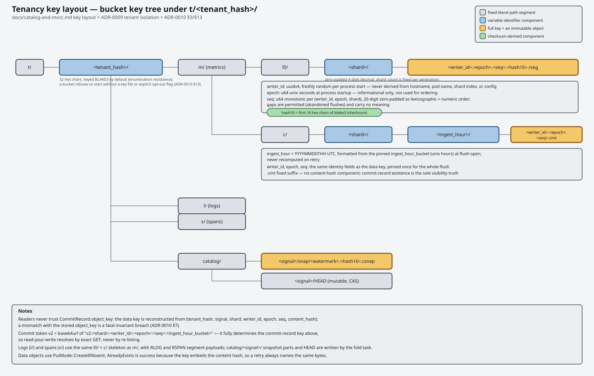

# Inspecting data

`ravel-cli` reads segments and commit records straight out of the object
store; nothing here needs `ravel-server` running. The examples below run
against the bucket `make demo` writes to
([docs/guides/getting-started.md](getting-started.md)). Every command
needs the same store flags:

```sh
export RAVEL_S3_ENDPOINT=http://127.0.0.1:9000
export RAVEL_S3_BUCKET=ravel-dev
export RAVEL_S3_ACCESS_KEY=ravel
export RAVEL_S3_SECRET_KEY=ravel-dev-secret
```

## Key layout



Everything lives under one bucket root, prefixed by a hash of the tenant
name ([docs/catalog-and-mvcc.md](../catalog-and-mvcc.md)):

```
t/<tenant_hash>/m/l0/<shard>/<writer_id>.<epoch>.<seq>.<hash16>.rseg   segment (data) object
t/<tenant_hash>/m/c/<shard>/<ingest_hour>/<writer_id>.<epoch>.<seq>.cmt commit record
```

`tenant_hash` is BLAKE3 of the tenant name, hex-encoded. `m` is the signal
(metrics; logs and spans would be `l`/`s`, not implemented yet). `shard` is
the ingest shard, zero-padded to 4 digits. `ingest_hour` is the UTC hour the
commit landed in (`YYYYMMDDTHH`), which is what lets the catalog find recent
commits by listing a small, bounded set of prefixes instead of the whole
bucket.

## `catalog list`: what's visible right now

```sh
cargo run -p ravel-cli -- catalog list --tenant demo-tenant --hours 1
```

```
t/3f2a.../m/l0/0000/6a9c....rseg shard=0 samples=120 series=3 min_event_ts_ns=1732400000000000000 max_event_ts_ns=1732400059000000000 created_unix_ns=1732400060123456789
1 segment(s)
```

This resolves the same catalog snapshot a query would, over the last
`--hours` hours (default 1) and `--shards` shards (default 4; must match
whatever shard count the writer used, `4` for `make demo`). Each line is
one committed segment: the data object key it's stored under, its shard,
sample and series counts, its event-time span, and when the flush that
created it ran (`created_unix_ns`). This is the fastest way to get a real
key to feed into `segment inspect` or `commit decode`.

## `segment inspect`: what's inside one segment


```sh
cargo run -p ravel-cli -- segment inspect \
  "t/3f2a.../m/l0/0000/6a9c....rseg"
```

```
total_size: 8421
trailer_offset: 8405
footer_offset: 8112
tenant_hash: 3f2a...
shard: 0
writer_id: <uuid>
writer_epoch: 0
writer_seq: 0
min_event_ts_ns: 1732400000000000000
max_event_ts_ns: 1732400059000000000
min_ingest_ts_ns: 1732400060000000000
max_ingest_ts_ns: 1732400060050000000
sample_count: 120
series_count (footer): 3
sections:
  kind=1 offset=0 len=64 uncompressed_len=64 comp=None
  kind=2 offset=64 len=512 uncompressed_len=512 comp=None
  kind=3 offset=576 len=1200 uncompressed_len=1200 comp=None
  kind=4 offset=1776 len=6336 uncompressed_len=6336 comp=None
series_count (decoded): 3
```

Field by field:

- `total_size`, `trailer_offset`, `footer_offset`: byte layout of the
  object. RSEG segments are footer-first-readable: the 16-byte trailer at
  the very end gives the footer's length and checksum, so a reader only
  needs one suffix GET to find and validate the footer before fetching
  anything else.
- `tenant_hash`, `shard`, `writer_id`, `writer_epoch`, `writer_seq`: the
  same identity components embedded in the object's key and in its commit
  token, which is how you confirm a segment and a commit token/record
  agree on what wrote it.
- `min/max_event_ts_ns`: the span of sample timestamps inside the segment,
  as reported by the client.
- `min/max_ingest_ts_ns`: the span of when this server received those
  points, always close to `created_unix_ns` below since Phase 1 flushes
  promptly.
- `sample_count`, `series_count (footer)`: totals the footer itself
  claims.
- `sections`: the four mandatory v1 sections and their byte ranges inside
  the object. `kind=1` is `LABEL_DICT` (the string table backing every
  label name/value in this segment), `kind=2` is `SERIES_TABLE` (one entry
  per series: its label set, sample count, timestamp span, and where its
  data pages live), `kind=3` is `TS_PAGES` (delta-encoded timestamps),
  `kind=4` is `VAL_PAGES` (Gorilla-encoded or raw f64 values, whichever is
  smaller for that series). `comp` is the section's compression, if any
  (`None`, `Lz4`, or `Zstd`).
- `series_count (decoded)`: series count from actually decoding
  `LABEL_DICT` + `SERIES_TABLE`, not just trusting the footer's claimed
  count. Matching `series_count (footer)` means the segment is internally
  consistent.

## `commit decode`: what a commit record says

```sh
cargo run -p ravel-cli -- commit decode \
  "t/3f2a.../m/c/0000/20251127T18/6a9c....cmt"
```

```
format_version: 2
tenant_hash: 3f2a...
signal: 1
shard: 0
writer_id: <uuid>
writer_epoch: 0
writer_seq: 0
object_key: t/3f2a.../m/l0/0000/6a9c....rseg
object_size: 8421
content_hash: 6a9c...
sample_count: 120
series_count: 3
min_event_ts_ns: 1732400000000000000
max_event_ts_ns: 1732400059000000000
min_ingest_ts_ns: 1732400060000000000
max_ingest_ts_ns: 1732400060050000000
segment_format_version: 1
created_unix_ns: 1732400060123456789
ingest_hour_bucket: 2025112718
```

A commit record never holds sample data itself; it's a small pointer plus
enough metadata to prune without opening the segment. `object_key` and
`object_size` name the segment this record publishes; `content_hash` is
the blake3 hash embedded in that segment's own key (`hash16` above,
extended here to the full hash), which is how a retried commit PUT can
tell "already published, same content" (safe) from "already published,
different content" (a fatal split-brain, since two different segments
should never share a `(writer_id, epoch, seq)`) apart. `signal` is the
numeric signal code (`1` = metrics). `ingest_hour_bucket` is the same hour
encoded in the object's own key, and is what the catalog groups listings
by.
