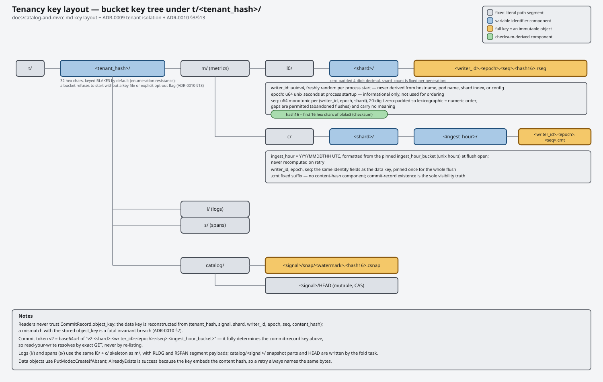
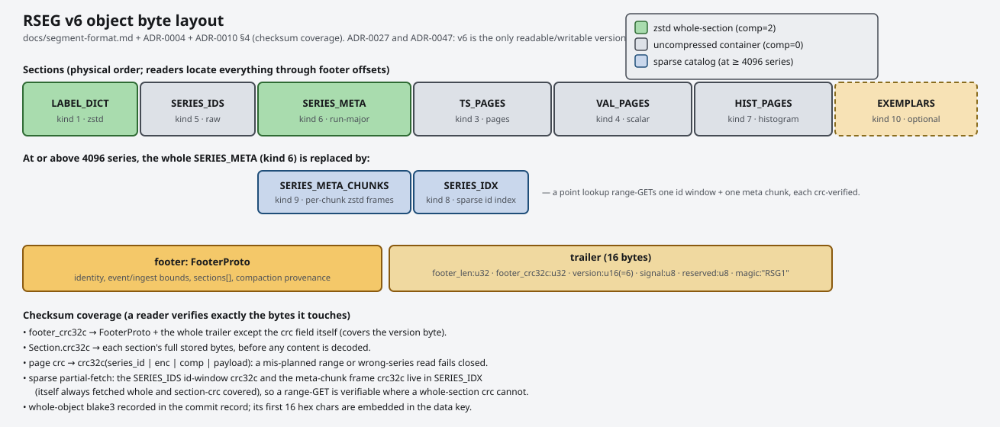

# Inspecting data

`ravel-cli` reads segments and commit records directly from the object
store. It does not need a running `ravel-server`.

No published image carries `ravel-cli`. Build it from source with
`cargo build -p ravel-cli --release`, which leaves the binary at
`target/release/ravel-cli`. The examples invoke it as `ravel-cli`, so put
`target/release` on your `PATH` or type the full path.

The examples run against the bucket that `make demo` writes to
([getting started](getting-started.md#building-from-source)). Every command
needs the same store flags:

```sh
export RAVEL_S3_ENDPOINT=http://127.0.0.1:9000
export RAVEL_S3_BUCKET=ravel-dev
export RAVEL_S3_ACCESS_KEY=ravel
export RAVEL_S3_SECRET_KEY=ravel-dev-secret
```

## Key layout



Everything lives under one bucket root, prefixed by a hash of the tenant
name ([docs/catalog-and-mvcc.md](../catalog-and-mvcc.md)):

```
t/<tenant_hash>/m/l0/<shard>/<writer_id>.<epoch>.<seq>.<hash16>.rseg   segment (data) object
t/<tenant_hash>/m/c/<shard>/<ingest_hour>/<writer_id>.<epoch>.<seq>.cmt commit record
```

- `tenant_hash` is a hex-encoded BLAKE3 hash of the tenant name. Under the
  default posture it is a keyed hash. A fresh bucket refuses to start unless
  the server names a deployment key with `--tenant-hash-key-file` or opts out
  with `--tenant-hash-unkeyed`, which selects the plain unkeyed hash. The
  bucket pins the choice permanently on first use.
- `m` is the signal letter for metrics. Logs use `l` and spans use `s`.
  - Logs have their own RLOG object format. See [`rlog inspect`](#rlog-inspect).
  - Spans have the RSPAN format
    ([span-segment-format.md](../span-segment-format.md)) and a SQL query path
    over the `spans` table.
- `shard` is the ingest shard, zero-padded to 4 digits.
- `ingest_hour` is the UTC hour that the commit landed in (`YYYYMMDDTHH`).
  With it, the catalog finds recent commits by listing a small, bounded set of
  prefixes instead of the whole bucket.

## `catalog list`

The command shows which segments are visible now.

```sh
ravel-cli catalog list --tenant demo-tenant --hours 1
```

```
t/3f2a.../m/l0/0000/6a9c....rseg shard=0 samples=120 series=3 min_event_ts_ns=1732400000000000000 max_event_ts_ns=1732400059000000000 created_unix_ns=1732400060123456789
1 segment(s)
```

The command resolves the same catalog snapshot that a query resolves, over
the last `--hours` hours (default 1) and `--shards` shards (default 4).
`--shards` must match the shard count that the writer used, which is `4` for
`make demo`.

Each line is one committed segment. It shows the data object key that the
segment is stored under, its shard, its sample and series counts, its
event-time span, and when the flush that created it ran (`created_unix_ns`).
Use this command to get a real key for `segment inspect` or `commit decode`.

## `segment inspect`

The command shows what one segment contains.



Every segment is RSEG v7. Ravel supports one segment version at a time.

```sh
ravel-cli segment inspect \
  "t/c5c5.../m/l0/0000/6a9c....rseg"
```

```
total_size: 924
trailer_offset: 908
version: 7
footer_offset: 660
tenant_hash: c7c7c7c7c7c7c7c7c7c7c7c7c7c7c7c7
shard: 7
writer_id: golden-v7-writer
writer_epoch: 7
writer_seq: 70
min_event_ts_ns: 1650000000000000000
max_event_ts_ns: 1650000000000000758
min_ingest_ts_ns: -2000
max_ingest_ts_ns: 30000
sample_count: 15
series_count (footer): 9
base_created_unix_ns: 219
level: 1
input_set_hash: 4747474747474747474747474747474747474747474747474747474747474747
part_index: 2
sections:
  kind=1 name=LABEL_DICT offset=0 len=106 uncompressed_len=111 comp=2
  kind=5 name=SERIES_IDS offset=106 len=148 uncompressed_len=148 comp=0
  kind=6 name=SERIES_META offset=254 len=116 uncompressed_len=200 comp=2
  kind=3 name=TS_PAGES offset=370 len=75 uncompressed_len=75 comp=0
  kind=4 name=VAL_PAGES offset=448 len=75 uncompressed_len=75 comp=0
  kind=7 name=HIST_PAGES offset=523 len=96 uncompressed_len=96 comp=0
  kind=10 name=EXEMPLARS offset=619 len=41 uncompressed_len=41 comp=0
schema_count (derived): 1
  schema[0]: __name__,inst,job
series_count (decoded): 9
series:
  series_id=00000000000000000000000000000000 labels=__name__=golden_v7,inst=i0,job=job0 sample_count=1 min_ts_ns=1650000000000000000 max_ts_ns=1650000000000000000 value_kind=HIST_SPANS run_count=1
    run[0] created_unix_ns=219 writer_epoch=2 writer_seq=3 sample_count=1 ts_range=[370, 377) hist_range=[523, 555)
    hist[0]: ts_ns=1650000000000000000 scale=2 zero_threshold=0.000001 sum=0.125 reset_hint=UNKNOWN
      count_kind=INT zero_count=1 count=4
      positive: spans=[(0, 2)] counts=[2,1]
      negative: spans=[] counts=[]
  series_id=010000000000010000000100000001b3 labels=__name__=golden_v7,inst=i1,job=job1 sample_count=2 min_ts_ns=1650000000000000001 max_ts_ns=1650000000000000751 value_kind=VAL_SCALAR run_count=1
    run[0] created_unix_ns=220 writer_epoch=2 writer_seq=3 sample_count=2 ts_range=[377, 386) val_range=[448, 460)
  ... (7 more series)
```

Field by field:

- `total_size`, `trailer_offset`, `footer_offset`: the byte layout of the
  object. RSEG segments are footer-first-readable. The 16-byte trailer at
  the very end gives the length and checksum of the footer. A reader therefore
  needs one suffix GET to find and validate the footer before it fetches
  anything else.
- `version`: the trailer format version, always `7`. A non-7 version gets a
  typed error. Ravel never half-parses it.
- `tenant_hash`, `shard`, `writer_id`, `writer_epoch`, `writer_seq`: the
  identity components embedded in the object's key and its commit token. Use
  them to confirm that a segment and a commit token or record agree on what
  wrote it.
- `min/max_event_ts_ns`: the span of sample timestamps inside the segment.
- `min/max_ingest_ts_ns`: when this server received those points.
- `base_created_unix_ns`, `level`, `part_index`: compaction provenance from
  the footer. An L0 flush stamps `level = 0`, `part_index = 0`. A compacted
  object carries real values (as here). `base_created_unix_ns` is the
  minimum run creation time, the base that the per-run `created_unix_ns`
  deltas reconstruct against.
- `sample_count`, `series_count (footer)`: the totals that the footer claims.
- `sections`: the sections of the object and their byte ranges:
  - `kind=1` `LABEL_DICT`: the string table.
  - `kind=5` `SERIES_IDS`: the sorted ids.
  - `kind=6` `SERIES_META`: the run-major catalog. It holds the schema, value
    kind, and per-run provenance and page ranges of each series.
  - `kind=3` `TS_PAGES`.
  - `kind=4` `VAL_PAGES`: scalar values. Absent when no series is scalar.
  - `kind=7` `HIST_PAGES`: histogram values. Absent when no series is a
    histogram.
  - `kind=8` `SERIES_IDX` and `kind=9` `SERIES_META_CHUNKS`: the sparse
    catalog. A large object (`series_count >= 4096`) carries these two in
    place of the whole `SERIES_META`.
  - `kind=10` `EXEMPLARS`: the exemplars that samples in this object
    carried. The section is present only when at least one sample carried
    one. The example above shows no `kind=10` line, because its samples
    carried none. An absent `EXEMPLARS` section is normal and is not an
    error.

  `comp` is the raw wire integer (`0` none, `1` lz4, `2` zstd).
- `schema_count (derived)` / `schema[N]:`: SERIES_META groups series by
  distinct label-*name* set (a "schema"). Each line lists the names of that
  schema, resolved through `LABEL_DICT`. `ravel-cli` derives this from the
  decoded per-series label sets.
- `series`: one line per series: id, resolved labels, sample count,
  event-timestamp bounds, `value_kind` (`VAL_SCALAR` or `HIST_SPANS`), and
  `run_count`. Each series then prints one `run[N]` line per run:
  - Each `run[N]` line gives its provenance (`created_unix_ns`,
    `writer_epoch`, `writer_seq`), its sample count, and the **absolute** byte
    ranges of the TS and VAL-or-HIST pages of that run
    (`ts_range`/`val_range`/`hist_range`, half-open `[start, end)`).
  - `ravel-cli` reconstructs these ranges from SERIES_META the way the reader
    does before it fetches the bytes.
  - An L0 flush produces one run per series. A compacted object can carry
    several.
- Every `HIST_SPANS` run is followed by one `hist[N]:` line per decoded
  histogram sample. Each line gives `scale`, `zero_threshold`, `sum` (`none`
  if absent), and `reset_hint`, then `count_kind` (`INT`/`FLOAT`) with
  `zero_count`/`count`, then the spans (`(offset, length)` pairs) and bucket
  counts of the positive and negative sides, in stored order.
- `series_count (decoded)`: the series count from a decode of the catalog,
  which does not trust the footer alone. If it matches
  `series_count (footer)`, the segment is internally consistent.

## `rlog inspect`

The command shows what one log segment contains.

Log data lives in RLOG objects (`.rlog`), the columnar log segment format
([docs/log-segment-format.md](../log-segment-format.md), trailer version 5).
RLOG shares the 16-byte trailer, the protobuf footer, and the crc32c
discipline with RSEG, and it has its own sections. The ingest path writes RLOG
objects. The `logs` SQL table on `POST /api/v1/sql` reads them back.
Maintenance compacts and retains them.

The writer of the format wrote the object below directly, not through the
ingest path, to show the format in isolation.

```sh
ravel-cli rlog inspect "t/abab.../l/l0/0000/....rlog"
```

```
total_size: 913
version: 5
signal: 2
tenant_hash: abababababababababababababababab
shard: 3
writer_id: cdcdcdcdcdcdcdcdcdcdcdcdcdcdcdcd
writer_epoch: 7
writer_seq: 42
min_ts_ns: 100
max_ts_ns: 250
min_observed_ts_ns: 105
max_observed_ts_ns: 255
record_count: 4
block_count: 2
stream_count: 2
level: 0
input_set_hash: 
part_index: 0
sort_descriptor: none
clustering_generation: 0
sections:
  kind=1 name=STREAM_DIR offset=0 len=64 comp=zstd uncompressed_len=96
  kind=2 name=FIELD_DIR offset=64 len=30 comp=zstd uncompressed_len=21
  kind=3 name=BLOCKS offset=94 len=120 comp=none uncompressed_len=120
  kind=4 name=SKIP_IDX offset=214 len=75 comp=zstd uncompressed_len=104
  kind=8 name=PAGE_DIR offset=289 len=164 comp=zstd uncompressed_len=193
  kind=5 name=BLOOM offset=453 len=175 comp=none uncompressed_len=175
  kind=6 name=POSTINGS offset=628 len=66 comp=none uncompressed_len=66
skip_index level 0 (2 block(s)):
  block[0] offset=0 len=113 crc32c=941f3f49 record_count=2 ts_range=[100, 200] stream_ref_range=[0, 0]
    stat column_id=10 type=i64 min_bits=200 max_bits=504 null_count=0 has_nan=false resolved_min=200 resolved_max=504
  block[1] offset=4 len=116 crc32c=88078374 record_count=2 ts_range=[150, 250] stream_ref_range=[1, 1]
    stat column_id=10 type=i64 min_bits=200 max_bits=401 null_count=0 has_nan=false resolved_min=200 resolved_max=401
stream_dir (2 entry(ies)):
  stream_ref=0 stream_id=01000000000000000000000000000000 blob_len=27 blocks=[0, 0]
  stream_ref=1 stream_id=02000000000000000000000000000000 blob_len=27 blocks=[1, 1]
field_dir (2 entry(ies)):
  column_id=10 name=code type=i64 present_blocks=2 null_count=0
  column_id=11 name=svc type=str present_blocks=2 null_count=0
bloom_coverage (3 column(s)):
  column_id=4 name=severity_text kind=fixed
  column_id=5 name=body kind=fixed
  column_id=11 name=svc kind=str
```

Field by field:

- `total_size`, `version`, `signal`: the byte length of the object, the
  trailer format version, and the signal byte (`2` = logs). The version is
  `5`. The reader accepts only this one version, and any other version gets a
  typed error. Like RSEG, the object is footer-first-readable: the 16-byte
  trailer at the end gives the length and crc of the footer, and a reader
  validates the footer in one suffix GET before it fetches anything else.
- `tenant_hash`, `shard`, `writer_id`, `writer_epoch`, `writer_seq`: the
  identity components. They must match the commit record that the reader
  resolved the object from. `writer_id` and `tenant_hash` are printed as hex.
- `min/max_ts_ns`: the span of record event timestamps.
  `min/max_observed_ts_ns`: the span of observed (ingest-side) timestamps.
  These four values plus the counts are level 2 of the skip index, the
  whole-object summary in the footer.
- `record_count`, `block_count`, `stream_count`: the totals that the footer
  claims.
- `level`, `input_set_hash`, `part_index`: compaction provenance,
  the same convention that RSEG uses. An L0 flush object (every object shown in
  this guide) stamps the sentinels `level=0`, empty `input_set_hash`, and
  `part_index=0`. An L1 compacted object carries real values.
- `sort_descriptor`, `clustering_generation`: the clustering key that the
  records of the object were sorted by, and the tenant clustering generation
  that the object was written under.
  - `none` means the default order: the records of each stream by `ts`.
  - With generation `0`, the tenant never set a key or a bloom scope.
  - With a nonzero generation, the key was cleared. Or the tenant never set
    one, and a bloom scope or declared-column change gave it a generation.
  - A clustered object prints `sort_descriptor: bucket_width=6h key_columns=2`
    followed by one `key[i] name=... type=...` line per key column.
- `sections`: the mandatory sections and their byte ranges:
  - `kind=1` `STREAM_DIR`: stream_id to canonical resource+scope blob and
    block range.
  - `kind=2` `FIELD_DIR`: dynamic attribute columns.
  - `kind=3` `BLOCKS`: the columnar row blocks, in row groups.
  - `kind=4` `SKIP_IDX`: the multi-level min/max index.
  - `kind=8` `PAGE_DIR`: per row group, per column chunk, per page: offset,
    length, encoding, and crc32c.
  - `kind=5` `BLOOM`: per-block token blooms.

  `kind=6` `POSTINGS` is optional and present here because the object declared
  an indexed field. STREAM_DIR, FIELD_DIR, SKIP_IDX, and PAGE_DIR use
  whole-section zstd (`comp=zstd`). BLOCKS and BLOOM are containers that a
  reader reads entry by entry, so they are `comp=none`. `comp` is printed by
  name (`none`/`zstd`).
- `skip_index level 0`: one line per row block. Each line gives its byte
  `offset` (into BLOCKS) and `len`, the `crc32c` that the reader verifies
  before it decodes the block, `record_count`, and the `ts_range` and
  `stream_ref_range` of the block (both inclusive). The skip index prunes on
  those two ranges.

  `offset` and `len` describe the *page span* of the block, not a contiguous
  block. The pages of a row group are stored column-major, so the spans of
  consecutive blocks overlap. The `crc32c` covers the pages of the block
  concatenated in column-id order, not a contiguous byte range. The pages
  themselves are located through `PAGE_DIR`.

  Under each block line is one `stat` line per numeric column that the records
  of the block resolve a value for: `column_id`, `type`
  (`i64`/`f64`/`bool`/`bytes`), `min_bits`/`max_bits`, `null_count`, and
  `has_nan`. `min_bits`/`max_bits` are the bit pattern that the min/max are
  stored as: two's complement for i64, and `to_bits` for f64, so f64
  comparison is bit-exact. In the example, both blocks carry column 10
  (`code`), an i64 attribute. The string column `svc` is not numeric and so
  has no stat.

  A stat bounds the value that each row *resolves* for the column's attribute
  name, not the content of the column's value page. Resolution is what a query
  sees: the record's resource and scope attributes, overridden by the record's
  own. A record that carries `code` twice (two types, or a duplicate that
  spilled into `attrs_raw`) is reduced to the one value that a read reports. A row whose resolved value is
  of another type, or which resolves the name to nothing, counts in
  `null_count` instead. Three consequences follow from this rule:

  - The `null_count` of a `stat` can exceed the `field_dir` `null_count` of
    the same column, which counts raw column presence.
  - The bounds can exclude a value stored in the block.
  - A stat can appear for a column that the block has no page for at all. This
    happens when its records resolve the name off their resource or scope and
    do not carry it themselves.
- `stream_dir`: one line per stream, in the sorted stream_id order of the
  object. The line number is the `stream_ref` used everywhere else (the
  0-based ordinal of the entry). `stream_id` is the 16-byte identity in hex.
  `blob_len` is the length of the canonical resource+scope attribute blob.
  `blocks` is the inclusive block range that holds the records of that stream,
  printed half-open.
- `field_dir`: one line per dynamic attribute column: `column_id` (dynamic
  columns start at 10; fixed columns 0..=9 are implicit and never listed),
  `name`, `type`, `present_blocks` (blocks with at least one value), and the
  object-wide `null_count`. A key seen with two value types appears as two
  entries (per-type splitting).
- `bloom_coverage`: the columns that the filters of BLOOM cover, named through
  FIELD_DIR (`kind=fixed` for the fixed columns, otherwise the type of the
  attribute column). The default scope covers `body`, `severity_text`, and
  every string attribute column. A word or equality predicate on a column that
  the list omits is never bloom-pruned.

A corrupt object never inspects as a success. The footer open protocol and
every section decode return a typed `Corrupted` error with a non-zero exit.
The lines printed before the failing section stay on stdout.

- A corrupt SKIP_IDX is an error, not a degrade. Its level-0 entries are the
  only source of block byte ranges and per-block checksums.
- BLOOM is read with its whole-section crc verified, so a damaged BLOOM fails
  `rlog inspect`. A query scan over the same object at worst prunes fewer
  blocks and still answers exactly.

## `rlog footprint`

The command attributes every stored byte of one or more RLOG objects to a
section, a column, and an encoding.

- It takes object keys or local paths. It also takes `--tenant <id>`, which
  measures every logs data object that the catalog resolves for that tenant
  over all time (live L0 flush and L1 compacted segments).
- Per object it fetches four ranges: the 16-byte trailer, the footer,
  FIELD_DIR, and PAGE_DIR. It never fetches page bodies, so the cost does not
  grow with the BLOCKS section.
- `--json` prints the same report as one JSON document, with the per-object
  figures under `objects` and the sums under `total`.

The figures below come from one small example object, and yours differ. Under
version 5 the BLOOM figure includes the covered-column list and its crc32c.

```sh
ravel-cli rlog footprint a.rlog
```

```
object_count: 1
record_count: 12
total_bytes: 1134
gap_bytes: 0
page_stored_bytes: 264
objects:
  a.rlog version=5 level=0 records=12 bytes=1134
sections:
  BLOCKS count=1 bytes=264 uncompressed_bytes=264
  BLOOM count=1 bytes=255 uncompressed_bytes=255
  FIELD_DIR count=1 bytes=30 uncompressed_bytes=21
  FOOTER count=1 bytes=188 uncompressed_bytes=188
  PAGE_DIR count=1 bytes=235 uncompressed_bytes=319
  SKIP_IDX count=1 bytes=94 uncompressed_bytes=141
  STREAM_DIR count=1 bytes=52 uncompressed_bytes=50
  TRAILER count=1 bytes=16 uncompressed_bytes=16
columns:
  body type=fixed pages=3 stored_bytes=159 uncompressed_bytes=4144
    enc=plain pages=3 stored_bytes=159 uncompressed_bytes=4144
  code type=i64 pages=3 stored_bytes=15 uncompressed_bytes=15
    enc=delta_zigzag pages=3 stored_bytes=15 uncompressed_bytes=15
  flags type=fixed pages=3 stored_bytes=3 uncompressed_bytes=3
    enc=constant pages=3 stored_bytes=3 uncompressed_bytes=3
  observed_ts type=fixed pages=3 stored_bytes=12 uncompressed_bytes=12
    enc=for_bitpack pages=3 stored_bytes=12 uncompressed_bytes=12
  severity_num type=fixed pages=3 stored_bytes=3 uncompressed_bytes=3
    enc=constant pages=3 stored_bytes=3 uncompressed_bytes=3
  severity_text type=fixed pages=3 stored_bytes=21 uncompressed_bytes=21
    enc=dictionary pages=3 stored_bytes=21 uncompressed_bytes=21
  stream_ref type=fixed pages=3 stored_bytes=3 uncompressed_bytes=3
    enc=constant pages=3 stored_bytes=3 uncompressed_bytes=3
  svc type=str pages=3 stored_bytes=36 uncompressed_bytes=36
    enc=dictionary pages=3 stored_bytes=36 uncompressed_bytes=36
  ts type=fixed pages=3 stored_bytes=12 uncompressed_bytes=12
    enc=for_bitpack pages=3 stored_bytes=12 uncompressed_bytes=12
```

The figures reconcile per object, or the command prints no report:

- The `sections` bytes, including the `FOOTER` and `TRAILER` rows, plus
  `gap_bytes` (bytes that no section covers) sum to `total_bytes`.
- `page_stored_bytes`, the sum of the `stored_bytes` of every column, equals
  the `BLOCKS` section length.

The command refuses an object that breaks either rule, for example two
sections whose byte ranges overlap. The error names the object and the two
figures that differ, and the command exits non-zero.

- The `uncompressed_bytes` of a section is its length before whole-section
  zstd. It equals `bytes` for a `comp=none` section.
- The `stored_bytes` of a column is its page bytes as stored. A page of at
  least 512 bytes is stored zstd-compressed when that is smaller.
  `uncompressed_bytes` is the same pages before compression. The `body` column
  above shows 4144 bytes of text stored in 159.
- Fixed columns appear by name. Dynamic columns appear by their FIELD_DIR name
  and type. A column that PAGE_DIR has no chunk for is not listed.
- A column stores one value page per block that carries it, and no page for a
  block where it is absent from every row. A block where it is present on only
  some rows adds a presence bitmap page (`enc=bitmap`) before that value page.
  The `pages` count of a column is therefore the number of blocks that carry
  it plus the number of those blocks where it is only partly present.

## `commit decode`

The command shows what a commit record says.

```sh
ravel-cli commit decode \
  "t/3f2a.../m/c/0000/20251127T18/6a9c....cmt"
```

```
format_version: 2
tenant_hash: 3f2a...
signal: 1
shard: 0
writer_id: <uuid>
writer_epoch: 0
writer_seq: 0
object_key: t/3f2a.../m/l0/0000/6a9c....rseg
object_size: 8421
content_hash: 6a9c...
sample_count: 120
series_count: 3
min_event_ts_ns: 1732400000000000000
max_event_ts_ns: 1732400059000000000
min_ingest_ts_ns: 1732400060000000000
max_ingest_ts_ns: 1732400060050000000
segment_format_version: 7
created_unix_ns: 1732400060123456789
ingest_hour_bucket: 2025112718
```

A commit record never holds sample data. It is a small pointer plus enough
metadata to prune without opening the segment.

- `object_key` and `object_size` name the segment that this record publishes.
- `content_hash` is the blake3 hash embedded in the key of that segment
  (`hash16` in the key layout, extended here to the full hash). With it, a
  retried commit PUT can tell two cases apart:
  - "already published, same content", which is safe
  - "already published, different content", which is a fatal split-brain. Two
    different segments must never share a `(writer_id, epoch, seq)`.
- `signal` is the numeric signal code (`1` = metrics).
- `ingest_hour_bucket` is the same hour that the key of the object encodes.
  The catalog groups listings by it.

## `inspect cstat`

The command shows what a column-statistics object declares.

```sh
ravel-cli inspect cstat \
  "t/3f2a.../catalog/l/idx/20260910T09.76b5680....cstat"
```

```
envelope_version: 3
header_len: 84
format_version: 1
tenant_hash: 3f2a1c9e4b7d0a62
signal: 3
part_blake3: 98c85b7a1f2e3d4c
segment_count: 2617
body_uncompressed_len: 268427456
over_ceiling (body_uncompressed_len > 268435456): false
  segment shard=0 ingest_hour_bucket=496953 writer_epoch=1 writer_seq=1 column=service.name dictionary_present=true
  segment shard=0 ingest_hour_bucket=496953 writer_epoch=1 writer_seq=1 column=http.route dictionary_present=false
```

A `.cstat` object carries the per-column minimum, maximum, count, sum and
value dictionary that a query uses to skip segments it cannot match.

`signal` is the raw numeric code from the header, not a word: 1 is metrics,
2 is spans, 3 is logs. `part_blake3` is comma-joined when a header covers
more than one part.

Read `body_uncompressed_len` and the `over_ceiling` verdict first. A reader
refuses any object that declares more than 256 MiB **before** it decompresses
the object. An over-ceiling object is therefore undecodable by every reader,
and nothing uses its statistics, however healthy the object looks in a
listing. The command computes the verdict from the header alone, so it can
report on an object that a full decode refuses:

```
over_ceiling (body_uncompressed_len > 268435456): true
dictionary_present listing: unavailable, body_uncompressed_len exceeds the decode ceiling and no reader can decompress this object
```

Under the ceiling, the command prints one
`segment ... column=... dictionary_present=` line per column per segment.

- `dictionary_present=false` means that the fold dropped the value dictionary
  of that column to bring the part under the ceiling. The fold drops whole
  dictionaries, largest first, and never truncates one. A column has its full
  dictionary or none of it.
- A run of `false` on an object that is itself under the ceiling means that
  the statistics survived but most of the dictionaries did not. Predicate
  pruning falls back to min/max for those columns.

A truncated, bad-magic, wrong-version or checksum-mismatched object fails
with the specific reason, not a generic error.

## `idem inspect`

The command shows what an idempotency marker says.

```sh
ravel-cli idem inspect \
  "t/3f2a.../l/idem/9a1c....0495972.idm"
```

```
magic: valid (RIDM)
version: valid
crc32c: valid
written_count: 42
commit_tokens: [v2:token-abc, v2:token-def]
```

An idempotency marker is the receipt that a keyed log or span ingest request
writes after a successful flush. A retry of the same request replays this
receipt and does not ingest again.

- `written_count` is the row or span count that the original request wrote.
- `commit_tokens` is the full `x-ravel-commit-token` set that the ack carried,
  one token per shard that the points of the request flushed through.

A truncated, bad-magic, wrong-version, checksum-mismatched, or malformed
marker fails with the specific reason, not a generic error or a report that
looks `valid`.

The command decodes through the one decoder for this format, the function
that the ingest path uses. Its verdict therefore always matches what a retried
request experiences. A marker that this command reports as corrupt is one that
the ingest path also treats as a miss (fail-open to at-least-once), never the
reverse.
