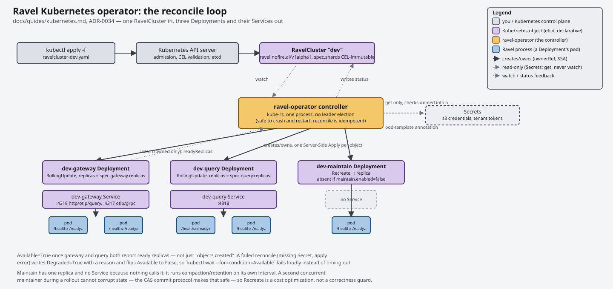
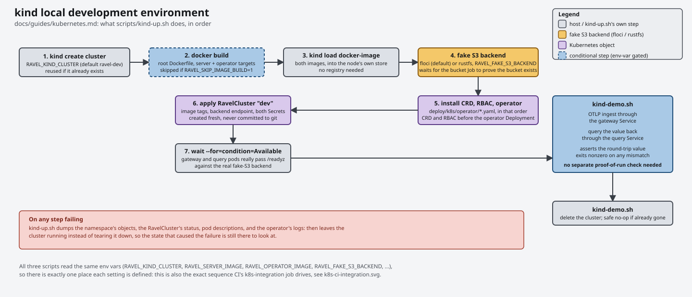
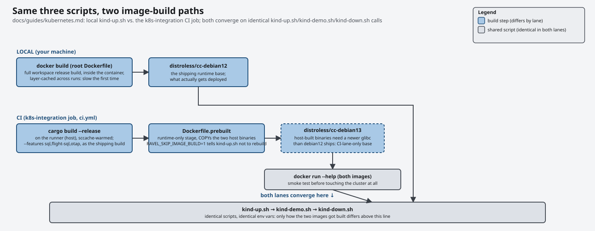

# Running Ravel on Kubernetes

Ravel runs on Kubernetes through an operator. You create one `RavelCluster`
custom resource, and the operator reconciles it into the gateway, query, and
maintain Deployments and their Services. This guide covers the local kind
development environment (the fastest way to see the whole thing work), the
`RavelCluster` field reference, and what the health probes mean.

Ravel's disposability model makes this simple. Every mode is stateless, and
object storage is the only durable state. There are therefore no StatefulSets,
no PersistentVolumeClaims, no leader election, and nothing to back up besides
the bucket. For the full flag reference behind the CRD fields, see
[operations.md](operations.md). For the reason the design is shaped this way,
see [../adrs/0034-k8s-operator.md](../adrs/0034-k8s-operator.md).



## The kind development environment

Three scripts bring up a complete cluster on your machine: the operator, a
fake S3 backend, and one reconciled `RavelCluster`.

```sh
scripts/kind-up.sh      # cluster, images, fake S3, operator, RavelCluster
scripts/kind-demo.sh    # OTLP ingest through the gateway, query back through
                        # the query tier, assert the value
scripts/kind-down.sh    # delete the cluster
```

You need `docker`, `kind`, `kubectl`, and (for `kind-demo.sh`) a Rust
toolchain. The first `kind-up.sh` run builds both container images from the
root `Dockerfile`. This is a full release build of the workspace and takes a
while. Later runs reuse the docker layer cache.



`kind-up.sh` does these steps in order:

1. It creates a kind cluster (default name `ravel-dev`) from a node image pinned
   by tag and digest. It reuses an existing cluster of that name.
2. It builds the `server` and `operator` targets of the root `Dockerfile`.
3. It runs `kind load docker-image` on both, so the cluster needs no registry
   and the `IfNotPresent` pull policy resolves against the node's own image
   store.
4. It deploys the fake S3 backend, waits for it to actually serve S3, and
   creates the `ravel` bucket.
5. It installs the CRD, RBAC, and operator Deployment from `deploy/k8s/operator/`.
6. It applies a `RavelCluster` named `dev`, pointed at that backend and those
   image tags.
7. It waits for `condition=Available` on the `RavelCluster`.

That last step is the meaningful one. The operator sets `Available=True` only
after the gateway and query Deployments report ready replicas. It therefore
succeeds only if the images really run and the pods really pass `/readyz`
against the real backend. It is not a check that objects were created.

If any step fails, the script dumps the namespace's objects, the
`RavelCluster`'s status, pod descriptions, and the operator's logs. It then
leaves the cluster running so you can look at it.

### Environment variables

| Variable | Default | Meaning |
|---|---|---|
| `RAVEL_KIND_CLUSTER` | `ravel-dev` | kind cluster name. All three scripts read it. |
| `RAVEL_KIND_NODE_IMAGE` | pinned `kindest/node` | Control-plane version to test against. |
| `RAVEL_SERVER_IMAGE` | `ravel-server:kind-dev` | Server image tag. |
| `RAVEL_OPERATOR_IMAGE` | `ravel-operator:kind-dev` | Operator image tag. |
| `RAVEL_SKIP_IMAGE_BUILD` | `0` | `1` skips `docker build` and uses the two tags as-is; they must already exist in the local docker daemon. This is how CI reuses host-built binaries. |
| `RAVEL_FAKE_S3_BACKEND` | `floci` | `floci` or `minio`. |
| `RAVEL_TENANT_NAME` | `demo-tenant` | Tenant to provision. |
| `RAVEL_TENANT_TOKEN` | `demo-token` | Its bearer token. |

### The fake S3 backend

`deploy/k8s/floci.yaml` and `deploy/k8s/minio.yaml` are the same shape: a
single-replica Deployment, a Service, and a bucket-create Job. The Job retries
until the endpoint serves S3, creates the `ravel` bucket, and then verifies
that it exists rather than assume the create took.

floci is the default. The `floci_contract` test in
`crates/ravel-object-store/tests/contract.rs` gates it. That test runs the full
object-store contract suite plus the `Capabilities::mandatory()` and multipart
probes against a real floci in CI. MinIO is the named fallback. If a floci
release ever stops satisfying that contract, `RAVEL_FAKE_S3_BACKEND=minio`
switches the whole environment to the backend this repository has proven
longest. Ravel maintains both manifests regardless of which one is the default.

Neither is suitable for anything but development. There is no persistent
volume, so the bucket lives in the pod's ephemeral filesystem and is gone when
the pod restarts. floci also accepts any credentials without verifying
request signatures.

### Secrets

`kind-up.sh` creates the two Secrets that the `RavelCluster` references, rather
than commit them as manifests. A committed Secret manifest puts credentials in
git and invites someone to copy it into a real cluster.

- `ravel-s3-credentials`, keys `accessKeyId` and `secretAccessKey`.
- `ravel-tenant-tokens`, where each key is a tenant name and its value is that
  tenant's bearer token.

### The same environment in CI

The `k8s-integration` job in `.github/workflows/ci.yml` runs these same three
scripts in CI, so the local and CI paths cannot drift.



There are two differences, both about build time, not about what is tested:

- `helm/kind-action` (pinned by commit SHA) creates the cluster, not
  `kind-up.sh`. The action reads its node image out of `kind-up.sh`, so there
  is only one pinned digest, and `kind-up.sh` then reuses that cluster. The job
  fails if the cluster it expects is not there, so a name drift cannot turn
  into a silently self-provisioned second cluster.
- The runner builds the two release binaries, where the workflow's cargo and
  sccache caches apply. `Dockerfile.prebuilt` (the runtime stages only) then
  assembles the images from them under `RAVEL_SKIP_IMAGE_BUILD=1`. The root
  `Dockerfile`'s builder stage would instead recompile the workspace inside
  Docker with no cache, which was measured at 57 minutes. The job smoke-runs
  `--help` in both assembled images before it creates the cluster. A binary
  that cannot exec on the runtime base then fails with the dynamic linker's
  message instead of as a `CrashLoopBackOff`. A build outside Docker has one
  consequence worth knowing about: binaries built on the runner need a newer
  glibc than the shipping image's Debian 12 base has, so the CI images use a
  Debian 13 distroless base instead. `Dockerfile.prebuilt` records the measured
  symbols and the alternatives.

`kind-demo.sh` asserts the round-trip value and exits nonzero on any failure,
so the job needs no extra proof-of-run check over its output.

## Installing the operator yourself

```sh
kubectl create namespace ravel-system
kubectl apply -f deploy/k8s/operator/crd.yaml
kubectl apply -f deploy/k8s/operator/rbac.yaml
kubectl apply -f deploy/k8s/operator/operator.yaml
```

Order matters: apply the CRD before the operator Deployment (its watch fails
until the cluster serves the `RavelCluster` kind), and RBAC before it too
(otherwise its API calls get 403). `operator.yaml` carries a placeholder
`ravel-operator:latest` image tag; point it at a real one.

`crd.yaml` is generated from the Rust spec types, not hand-written. To
regenerate it, run `cargo run -p ravel-operator -- --print-crd`.

The operator watches `RavelCluster` cluster-wide and manages Deployments and
Services in whatever namespace each `RavelCluster` lives in. Its ClusterRole
grants the full lifecycle of Deployments and Services, `RavelCluster` plus its
status subresource, and `get` on Secrets. It never lists, writes, or watches
Secrets.

## `RavelCluster` reference

Group `ravel.nofire.ai`, version `v1alpha1`, namespaced, short name `rc`.
`v1alpha1` makes no compatibility promise. The schema can change without
conversion webhooks until it is promoted.

A minimal example is in
[`deploy/k8s/examples/ravelcluster-dev.yaml`](../../deploy/k8s/examples/ravelcluster-dev.yaml).

| Field | Type | Default | Notes |
|---|---|---|---|
| `spec.image` | string | required | Server image for all three tiers. |
| `spec.imagePullPolicy` | string | — | Standard Kubernetes values. |
| `spec.shards` | integer | required | Feeds `--shards` to the gateway, query, and maintain from one field, so nothing can break the must-match invariant. **Immutable after creation** through a CEL rule; use `spec.shardOverrides` for per-tenant resharding. |
| `spec.shardOverrides.leadHours` | integer | `2` | Minimum hours of lead time an override needs before its shard count takes effect (ADR-0052 activation-hour semantics). Rejected below the mechanism's own floor. |
| `spec.shardOverrides.tenants` | map | — | Per-tenant target shard count, tenant name to integer. A target that differs from the tenant's current active shard count drives a durable `append_generation` reshard (ADR-0052); a target equal to the current count is a no-op. Lowering a tenant's shard count is the primary operator-facing cost control from ADR-0076 decision 2 -- see the documented costs (single-actor throughput ceiling, shard-0 concentration, coarser ADR-0065 maintenance units) in [shard-overrides.md](shard-overrides.md). |
| `spec.storage.s3.bucket` | string | required | |
| `spec.storage.s3.region` | string | `us-east-1` | |
| `spec.storage.s3.endpoint` | string | — | Omit for real AWS S3. Path-style addressing is always used. |
| `spec.storage.s3.credentialsSecretRef.name` | string | required | Secret with keys `accessKeyId` and `secretAccessKey`. |
| `spec.tenantTokensSecretRef.name` | string | — | Secret whose keys are tenant names and whose values are bearer tokens. |
| `spec.deploymentKeySecretRef.name` | string | — | Secret with one key, `key` (64 hex characters or 32 raw bytes): the ADR-0072 deployment key. Enables the keyed tenant hash and `sys/auth` bearer-token reconciliation, see "`sys/auth` ownership" below. Omit to leave both off. |
| `spec.gateway.replicas` | integer | `1` | |
| `spec.gateway.resources` | object | — | `requests` / `limits` maps, as in a Pod spec. |
| `spec.gateway.fold.disabled` | boolean | `false` | `--disable-fold`. Fold is a query-cost optimization only; disabling it never changes results. |
| `spec.gateway.fold.intervalSecs` | integer | — | `--fold-interval-secs`. |
| `spec.gateway.ingestAffinity` | object | — | Layer-7 ingest affinity (ADR-0076 decision 1). Omit for today's behaviour: no Ingress is rendered. Present, it renders one or two Ingress objects that hash tenant identity to a stable subset of gateway replicas, cutting flush PUTs by `replicas / subsetSize`. Needs an ingress controller in the cluster; ingress-nginx is the supported target. Full reference and sizing guidance in [ingest-affinity.md](ingest-affinity.md). |
| `spec.gateway.ingestAffinity.enabled` | boolean | `true` | `false` deletes the Ingress objects and returns to the affinity-absent render. |
| `spec.gateway.ingestAffinity.subsetSize` | integer | `2` | Replicas a tenant is pinned to. Two, not one, so a single replica loss does not concentrate a tenant on one process. A subset is a throughput ceiling; raise it for a high-volume tenant. |
| `spec.gateway.ingestAffinity.key.source` | string | `authorizationHeader` | `authorizationHeader`, `header` (with `key.headerName`), or `mtlsSubject`. The key must come from authentication material: Ravel resolves tenancy server-side from the credential, so a URL path carries nothing routable. |
| `spec.gateway.ingestAffinity.ingressClassName` | string | — | |
| `spec.gateway.ingestAffinity.hosts` | list | `[]` | Empty renders one host-less rule. |
| `spec.gateway.ingestAffinity.tlsSecretName` | string | — | Renders `spec.tls`. Effectively required for OTLP/gRPC, which needs HTTP/2. |
| `spec.gateway.ingestAffinity.grpc` | boolean | `true` | Also render the OTLP/gRPC Ingress. |
| `spec.gateway.ingestAffinity.annotations` | map | `{}` | Extra Ingress annotations, merged before the affinity annotations. `nginx.ingress.kubernetes.io/proxy-body-size` belongs here: the ingress-nginx default of `1m` rejects larger OTLP/HTTP exports. |
| `spec.query.replicas` | integer | `1` | |
| `spec.query.resources` | object | — | |
| `spec.maintain.enabled` | boolean | `true` | `false` deletes the maintain Deployment. |
| `spec.maintain.intervalSecs` | integer | — | `--maintain-interval-secs`. |
| `spec.maintain.resources` | object | — | |
| `spec.retention.default` | string | — | Duration string, e.g. `30d`. |
| `spec.retention.tenants` | map | — | Per-tenant overrides, tenant name to duration. |

There is deliberately no way to select the memory store. A non-durable
per-process store is incoherent across multiple pods, so `storage.s3` is
mandatory. There is also no field that can produce
`--dev-insecure-tenant-header`; the operator never sets it under any
configuration.

Tenant tokens are injected as env vars from the Secret and rendered into
`--tenant-token $(RAVEL_TENANT_TOKEN_<i>)=<tenant>` with kubelet `$(VAR)`
expansion, so token values never appear in the API object. They do still appear
in process argv on the node. A native env or file token source in `ravel-server`
is a known follow-up. A checksum annotation on each pod template rolls the pods
when either Secret changes.

### `sys/auth` ownership (ADR-0072 decision 4)

When `spec.deploymentKeySecretRef` is set, the operator also converges
`sys/auth` — the durable, deployment-wide bearer-token map at the bucket root
— to `spec.tenantTokensSecretRef`'s current contents, every reconcile cycle.
This runs alongside, not instead of, `ravel-cli tenant token upsert|revoke`:
the two writers share the map, and each entry is tagged with who owns it.

- Every tenant present in the token Secret is upserted with
  `managed_by=operator`. A tenant present in `sys/auth` but absent from the
  Secret is revoked, but **only if** its entry is tagged
  `managed_by=operator`. A tenant provisioned by `ravel-cli tenant token
  upsert` (tagged `managed_by=cli` by default, or a value passed via
  `--managed-by`) is never touched by this pass, and neither is a v1-shaped
  entry with no `managed_by` field at all (unmanaged — written before this
  field existed, or deliberately declared unowned). The operator only ever
  removes what it itself put there.
- If the CRD sets a deployment key but no `tenantTokensSecretRef`, or the
  Secret resolves to zero tenants, the operator skips the whole `sys/auth`
  pass for that cycle — no upserts, no removals — and logs a warning
  instead. An empty read is never treated as "revoke every operator-managed
  tenant."
- A reconcile against an unchanged token Secret performs zero `sys/auth`
  writes: each tenant's entry is compared against its current stored value
  first, and rewritten only on an actual difference.
- A `sys/auth` write is retried a bounded number of times against a
  concurrent writer (another operator replica, or a `ravel-cli` call racing
  it). If it still fails after that budget, the operator logs the failure
  and continues on to reconcile the Deployments and Services below —
  `sys/auth` reconciliation never blocks or fails the rest of the cycle.
- `spec.deploymentKeySecretRef`'s `resourceVersion` feeds the same
  pod-template secrets checksum as the token and credential Secrets (see
  "Tenant tokens are injected..." above), so rotating the deployment key
  rolls every tier's pods, the same as rotating a tenant token or a
  credential does.

See [operations.md](operations.md) and
[../adrs/0072-tenant-scoped-credentials-and-control-plane-protection.md](../adrs/0072-tenant-scoped-credentials-and-control-plane-protection.md)
for the `sys/auth` format itself and `ravel-cli tenant token`'s own
subcommands.

### Managed objects

For a `RavelCluster` named `dev`:

| Object | Kind | Notes |
|---|---|---|
| `dev-gateway` | Deployment | `--mode gateway`, RollingUpdate. |
| `dev-gateway` | Service | Ports 4318 (HTTP/OTLP/query API) and 4317 (OTLP/gRPC). |
| `dev-query` | Deployment | `--mode query`, RollingUpdate. |
| `dev-query` | Service | Port 4318. |
| `dev-maintain` | Deployment | `--mode maintain`, one replica, `Recreate` strategy. Absent when `maintain.enabled` is `false`. |
| `dev-gateway-ingest` | Ingress | OTLP/HTTP ingest under the tenant-affinity hash. Absent unless `gateway.ingestAffinity` is present and enabled. |
| `dev-gateway-ingest-grpc` | Ingress | The same for OTLP/gRPC. Additionally absent when `ingestAffinity.grpc` is `false`. |

Maintain is pinned to one replica with `Recreate` to avoid rolling-update
overlap. This is not an at-most-one guarantee, and correctness does not need
one. Because of the CAS commit protocol, a second concurrent maintainer cannot
corrupt committed state; it only wastes work.

### Status

```sh
kubectl get -n ravel-system ravelcluster dev -o jsonpath='{.status}'
```

`status` carries `observedGeneration`, `gatewayReadyReplicas`,
`queryReadyReplicas`, `maintainReadyReplicas`, and conditions. The operator
writes two condition types today: `Available` and `Degraded`. ADR-0034 also
names `Progressing`, but the operator does not emit it yet, so do not wait on
it.

`Available=True` means the gateway and query Deployments both report ready
replicas. `kubectl wait --for=condition=Available` is therefore a usable
readiness gate for scripts and CI. If a reconcile fails (a missing Secret,
an apply error), the operator writes a `Degraded=True` condition with the
reason and flips `Available` to `False`. A `kubectl wait` then fails with an
explanation instead of timing out silently.

## Probe semantics

All three modes serve two routes on the HTTP port, and the operator points a
liveness probe and a readiness probe at them. The gRPC port has no health
service and gets no probe.

- `/healthz` (liveness): 200 whenever the HTTP listener is serving. It means
  the event loop is alive.
- `/readyz` (readiness): 200 after startup completes: config parsed, the store
  capability gate passed, listeners bound. 503 before that.

`/-/healthy` and `/-/ready` are aliases for `/healthz` and `/readyz`, served by
the same handlers for clients that probe Prometheus' own paths. Either
spelling works in a probe.

`/readyz` performs **no object-store call per probe**. This is deliberate. A
store operation on every kubelet probe of every pod costs real money against
real S3, and a transient S3 blip would eject every pod from its Service at the
same time. Continuous store-health probing is a separate decision and a
named follow-up, not an oversight.

## Production notes

The kind environment is a development tool. A few things differ in a real
cluster.

- Point `spec.storage.s3.endpoint` at real S3 (or omit it) and supply real
  credentials in the Secret.
- Bucket lifecycle is the platform owner's job. The operator provisions no
  buckets; the create-bucket Jobs exist only in the dev manifests.
- The operator does not expose the query Service outside the cluster, and it
  exposes the gateway Service only when `gateway.ingestAffinity` is set (which
  renders an ingest Ingress, see [ingest-affinity.md](ingest-affinity.md)).
  Otherwise add an Ingress or a `LoadBalancer` Service yourself. Either way put
  TLS in front of it: tenant tokens are bearer tokens.
- On a multi-replica gateway, consider turning on `gateway.ingestAffinity`.
  Ingest buffers are per replica, so a tenant spraying across every replica pays
  one flush stream per replica for the same data; object-storage request
  charges, not stored bytes, dominate the bill.

## Storage credential roles (ADR-0055)

By default a `RavelCluster` points every tier at one Secret
(`spec.storage.s3.credentialsSecretRef`), so the gateway, query, and maintain
pods all use one bucket-wide S3 credential. ADR-0055 lets you hand each tier a
distinct, narrower credential instead, so a leak from one tier can only do what
that tier legitimately does — and only the maintain tier can delete anything at
all.

Each of the operator's three Deployments maps to one role:

| Tier / Deployment | `--mode` | Role | Scope in one line |
|---|---|---|---|
| `<name>-gateway` | `gateway` | Gateway | Ingest writes (L0, commit records, idempotency, adopt) plus catalog fold writes, plus fleet-admission reconciliation snapshots (ADR-0057). No delete. |
| `<name>-query` | `query` | Query | Reads commit and catalog objects, runs fold, appends query audit. No delete. |
| `<name>-maintain` | `maintain` | Maintain | Compaction, retention, sweep. The only tier granted any delete, and only over `l0/`, `l1/`, `c/`, `idem/`. |

A fourth role, **Admin**, backs `ravel-cli` and is deliberately not managed by
the operator: there is no CRD field for it and no pod runs it. It is used only
by out-of-band operator/CI invocations. See
[operations.md](operations.md#the-admin-credential).

The exact per-role AWS IAM policy JSON, the MinIO equivalent for dev/CI, and
the first-deployment bootstrap notes all live in one place:
[operations.md, "Storage credential roles"](operations.md#storage-credential-roles-adr-0055).
This section covers only the Kubernetes wiring.

### Per-tier credential Secrets

Create one Secret per role you want to scope, each with the same two keys as
the shared Secret (`accessKeyId`, `secretAccessKey`), holding that role's
narrower access key:

```sh
kubectl create secret generic ravel-s3-gateway \
  --from-literal=accessKeyId=... --from-literal=secretAccessKey=...
kubectl create secret generic ravel-s3-query \
  --from-literal=accessKeyId=... --from-literal=secretAccessKey=...
kubectl create secret generic ravel-s3-maintain \
  --from-literal=accessKeyId=... --from-literal=secretAccessKey=...
```

Then reference each from its tier with an additive `credentialsSecretRef`
field, alongside the existing shared one under `spec.storage.s3`:

```yaml
apiVersion: ravel.nofire.ai/v1alpha1
kind: RavelCluster
metadata:
  name: prod
  namespace: ravel-system
spec:
  image: ravel-server:1.0.0
  shards: 8
  storage:
    s3:
      bucket: my-ravel-bucket
      region: us-west-2
      # Shared fallback. Any tier that omits its own credentialsSecretRef
      # below uses this one, exactly as in the single-credential model.
      credentialsSecretRef:
        name: ravel-s3-shared
  gateway:
    replicas: 3
    credentialsSecretRef:
      name: ravel-s3-gateway
  query:
    replicas: 3
    credentialsSecretRef:
      name: ravel-s3-query
  maintain:
    enabled: true
    credentialsSecretRef:
      name: ravel-s3-maintain
  tenantTokensSecretRef:
    name: ravel-tenant-tokens
```

The per-tier `spec.<tier>.credentialsSecretRef` fields are additive and
optional (ADR-0055 section 5): omit a tier's override and that tier falls back
to the shared `spec.storage.s3.credentialsSecretRef`, unchanged. A
`RavelCluster` that sets no per-tier override at all behaves exactly as it does
today — one shared credential across all three Deployments — so adopting the
split is zero-migration and can be rolled out one tier at a time. Unlike the
shared Secret, `kind-up.sh` does **not** create these per-tier Secrets: the
local kind environment deliberately keeps using the single shared credential
for development convenience (see "Storage credential roles" in
docs/guides/operations.md — the per-role split is a production hardening,
and `kind-up.sh` is not meant to be modified to adopt it). To exercise the
split in a kind cluster anyway, create the per-tier Secrets yourself the same
way as above (`kubectl create secret generic ...`) before applying a
`RavelCluster` that references them.
