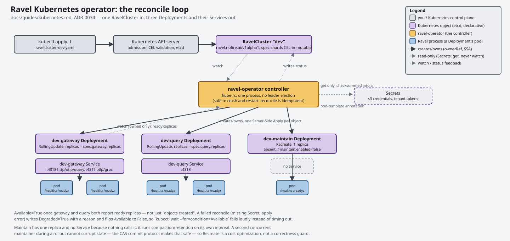
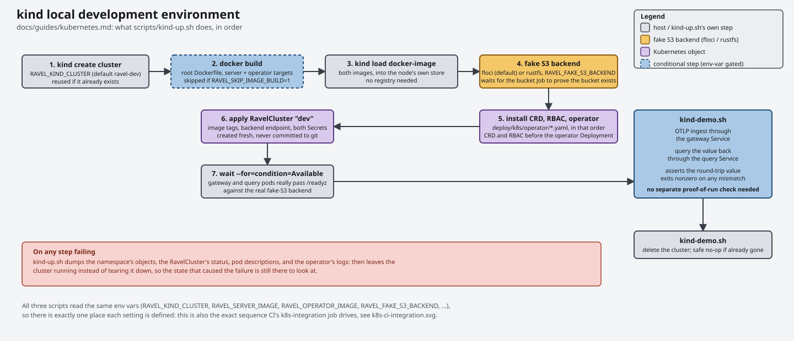
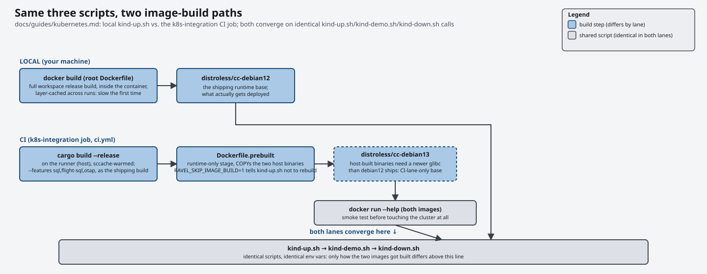

# Running Ravel on Kubernetes

Ravel runs on Kubernetes through an operator. You create one `RavelCluster`
custom resource. The operator reconciles it into the gateway, query, and
maintain Deployments and their Services. This guide covers the local kind
development environment, the `RavelCluster` field reference, and the health
probes.

**The custom resource is `v1alpha1`.** It makes no compatibility promise. The
schema can change in an incompatible way, with no conversion webhook, until it
is promoted to a stable version. Do not plan around it as a stable API.

Every mode is stateless, and object storage is the only durable state. There
are therefore no StatefulSets, no PersistentVolumeClaims, no leader election,
and nothing to back up besides the bucket. For the flag behind a
custom-resource field, see the generated
[server flag reference](../reference/ravel-server-flags.md). To choose a
value, see [operations.md](operations.md).

**Only the maintain Deployment deletes durable data.** Only a `maintain` mode
process runs compaction, retention, the garbage-collection sweep and the
at-rest scrubber. The gateway and query Deployments delete no durable data.
The one delete that the gateway makes removes the admission snapshots of dead
ingest processes.

A cluster with `maintain.enabled: false` never compacts and never expires
data. The same applies to a cluster scaled to zero maintain replicas. Its L0
segments accumulate unmerged and nothing is reclaimed, whatever the retention
fields below are set to. The operator does not report this state as degraded.
If retention seems broken, check this state first.



## The kind development environment

Three scripts bring up a complete cluster on your machine: the operator, a
fake S3 backend, and one reconciled `RavelCluster`.

```sh
scripts/kind-up.sh      # cluster, images, fake S3, operator, RavelCluster
scripts/kind-demo.sh    # OTLP ingest through the gateway, query back through
                        # the query Deployment, assert the value
scripts/kind-down.sh    # delete the cluster
```

You need `docker`, `kind`, `kubectl`, and (for `kind-demo.sh`) a Rust
toolchain. The first `kind-up.sh` run builds both container images from the
root `Dockerfile`. This is a full release build of the workspace and takes a
while. Later runs reuse the docker layer cache.



`kind-up.sh` does these steps in order:

1. It creates a kind cluster (default name `ravel-dev`) from a node image pinned
   by tag and digest. It reuses an existing cluster of that name.
2. It builds the `server` and `operator` targets of the root `Dockerfile`.
3. It runs `kind load docker-image` on both, so the cluster needs no registry
   and the `IfNotPresent` pull policy resolves against the node's own image
   store.
4. It deploys the fake S3 backend, waits until it serves S3, and creates the
   `ravel` bucket with the protection settings the operator's startup gate
   checks.
5. It installs the CRD, RBAC, and operator Deployment from `deploy/k8s/operator/`.
6. It applies a `RavelCluster` named `dev`, pointed at that backend and those
   image tags.
7. It waits for `condition=Available` on the `RavelCluster`.

The operator sets `Available=True` only after the gateway and query
Deployments report ready replicas. Step 7 therefore succeeds only if the
images run and the pods pass `/readyz` against the backend. It is not a check
that objects were created.

If any step fails, the script dumps the namespace's objects, the
`RavelCluster`'s status, pod descriptions, and the operator's logs. It then
leaves the cluster running so you can look at it.

### Environment variables

| Variable | Default | Meaning |
|---|---|---|
| `RAVEL_KIND_CLUSTER` | `ravel-dev` | kind cluster name. All three scripts read it. |
| `RAVEL_KIND_NODE_IMAGE` | pinned `kindest/node` | Control-plane version to test against. |
| `RAVEL_SERVER_IMAGE` | `ravel-server:kind-dev` | Server image tag. |
| `RAVEL_OPERATOR_IMAGE` | `ravel-operator:kind-dev` | Operator image tag. |
| `RAVEL_SKIP_IMAGE_BUILD` | `0` | `1` skips `docker build` and uses the two tags as-is; they must already exist in the local docker daemon. This is how CI reuses host-built binaries. |
| `RAVEL_FAKE_S3_BACKEND` | `floci` | `floci` or `rustfs`. |
| `RAVEL_TENANT_NAME` | `demo-tenant` | Tenant to provision. |
| `RAVEL_TENANT_TOKEN` | `demo-token` | Its bearer token. |

### The fake S3 backend

`deploy/k8s/floci.yaml` and `deploy/k8s/rustfs.yaml` are the same shape: a
single-replica Deployment, a Service, and a bucket-create Job. The operator
starts every `ravel-server` pod with `--require-bucket-protection`, so the
Job creates a protected bucket:

1. It retries until the endpoint serves S3.
2. It creates the `ravel` bucket with Object Lock enabled, and verifies that
   the bucket exists.
3. It turns versioning on.
4. It installs one enabled lifecycle rule over the whole bucket with
   `ExpiredObjectDeleteMarker`, `NoncurrentDays` 1 and
   `AbortIncompleteMultipartUpload` after 7 days.
5. It reads each configuration back.

`scripts/kind-up.sh` deletes a finished Job before it applies the manifest,
so the Job runs again on a reused cluster. A backend pod can still hold a
bucket from an older manifest, created without Object Lock. That bucket fails
the read-back. Delete the pod to start from an empty store.

floci is the default. The `floci_contract` test in the object-store crate
gates it. In CI, that test runs the full object-store contract suite plus the
mandatory capability and multipart probes against a real floci.

RustFS is the named fallback. If a floci release stops satisfying that
contract, set `RAVEL_FAKE_S3_BACKEND=rustfs` to switch the whole environment
to RustFS. The object-store-contract CI job runs the full contract suite
against RustFS on every change. Ravel maintains both manifests.

Use neither backend for anything but development. There is no persistent
volume, so the bucket lives in the pod's ephemeral filesystem and is gone when
the pod restarts. floci also accepts any credentials without verifying
request signatures.

### Secrets

`kind-up.sh` creates the three Secrets that the `RavelCluster` references.
The repository commits no Secret manifest, because a committed Secret
manifest puts credentials in git and someone can copy it into a real cluster.

- `ravel-s3-credentials`, keys `accessKeyId` and `secretAccessKey`.
- `ravel-tenant-tokens`, where each key is a tenant name and its value is that
  tenant's bearer token.
- `ravel-audit-token-key`, key `key` holding the query-audit token key.

### The same environment in CI

The `k8s-integration` job in `.github/workflows/ci.yml` runs these same three
scripts in CI, so the local and CI paths cannot drift.



The job differs in two ways. Both change the build time. Neither changes what
is tested.

- `helm/kind-action` (pinned by commit SHA) creates the cluster, and
  `kind-up.sh` then reuses that cluster. The action reads its node image out
  of `kind-up.sh`, so there is only one pinned digest. The job fails if the
  cluster it expects is not there, so a name drift cannot silently create a
  second cluster.
- The runner builds the two release binaries, where the workflow's cargo and
  sccache caches apply. `Dockerfile.prebuilt` (the runtime stages only) then
  assembles the images from them under `RAVEL_SKIP_IMAGE_BUILD=1`.
  - The root `Dockerfile`'s builder stage recompiles the workspace inside
    Docker with no cache, which was measured at 57 minutes.
  - The job smoke-runs `--help` in both assembled images before it creates
    the cluster. A binary that cannot exec on the runtime base then fails
    with the dynamic linker's message, and not as a `CrashLoopBackOff`.
  - Binaries built on the runner need a newer glibc than the shipping image's
    Debian 12 base has, so the CI images use a Debian 13 distroless base.
    `Dockerfile.prebuilt` records the measured symbols and the alternatives.

`kind-demo.sh` asserts the round-trip value and exits nonzero on any failure,
so the job needs no extra proof-of-run check over its output.

## Installing the operator yourself

```sh
kubectl create namespace ravel-system
kubectl apply -f deploy/k8s/operator/crd.yaml
kubectl apply -f deploy/k8s/operator/rbac.yaml
kubectl apply -f deploy/k8s/operator/operator.yaml
```

Apply the manifests in this order:

- Apply the CRD before the operator Deployment. The operator's watch fails
  until the cluster serves the `RavelCluster` kind.
- Apply RBAC before the operator Deployment. Otherwise its API calls get 403.

`operator.yaml` carries a placeholder `ravel-operator:latest` image tag. For
a real cluster, pin the image to a digest
(`ghcr.io/nofireai/ravel-operator@sha256:<digest>`), not to a moving tag. A
tag can point at a different image after you have reviewed the manifest. A
digest cannot.

`crd.yaml` is generated from the Rust spec types. To regenerate it, run
`cargo run -p ravel-operator -- --print-crd`.

### Operator replicas and health

The operator runs as one replica with a `Recreate` strategy. Raising the
replica count is unsupported, because two active instances race the
`sys/auth` compare-and-swap.

The operator serves `/healthz`, `/readyz`, and `/metrics` on the `health`
container port (`8080` by default, `--listen-health` to change it). The
listener binds before the controller starts. If the listener cannot bind its
address, the operator stops with an error that names the address and the
flag.

- `/healthz` answers `200` until its controller loop stops. This is the
  kubelet's liveness signal.
- `/readyz` answers `200` once its initial `RavelCluster` list has arrived.
- `/metrics` renders `ravel_operator_reconciles_total`,
  `ravel_operator_reconcile_duration_seconds`,
  `ravel_operator_last_successful_reconcile_timestamp_seconds`, and
  `ravel_operator_watched_clusters` as Prometheus text exposition.

`operator.yaml` wires liveness and readiness probes at those paths. It also
carries a `prometheus.io/scrape` annotation for a Prometheus that discovers
targets that way.

### Operator permissions

The operator watches `RavelCluster` cluster-wide. It manages Deployments and
Services in the namespace of each `RavelCluster`. Its ClusterRole grants:

- the full lifecycle of Deployments, Services, Ingresses,
  `gateway.networking.k8s.io` HTTPRoutes/GRPCRoutes, and the ServiceAccounts,
  Roles, and RoleBindings it renders for the `ravelNative` ingest router,
- `RavelCluster` and its status subresource,
- `get` on Secrets,
- `get`/`list`/`watch` on `endpointslices` (needed to create the router's own
  least-privilege Role),
- `get` on the non-resource URL `/version`.

The operator never lists, writes, or watches Secrets.

### Minimum Kubernetes version

**Minimum Kubernetes version: 1.30.** Every rendered ravel-server container
carries a `preStop` `SleepAction`. Kubernetes' `PodLifecycleSleepAction`
feature (KEP-3960) gates it:

| Kubernetes version | Gate | The `preStop` field |
|---|---|---|
| 1.28 and earlier | None. The apiserver's older type does not recognize the field. | Dropped. With the default `fieldValidation` of `Warn`, the apiserver drops the field and returns a Warning response header, and does not reject the request. Nothing in the operator surfaces that header today. |
| 1.29 | Alpha, off by default. | Dropped. The field exists in the apiserver's type but the gate is off, so `dropDisabledFields` zeroes it out on admission. The Pod comes up with no error and no preStop sleep at all. |
| 1.30 to 1.33 | Beta, **on by default**. | Kept. |
| 1.34 and later | Stable, and no longer gateable. | Kept. |

Below 1.30 the Pod looks healthy in isolation. But every rolling update can
drop in-flight ingest for that pod across the endpoint-propagation window,
because nothing holds the container open while its endpoint is withdrawn.

On a cluster below the floor, the operator raises a
`KubernetesVersionUnsupported` condition on every `RavelCluster`. See
"Status" below. The check has these limits:

- The operator reads the cluster's version once at process startup, through
  the `/version` grant above. It does not read the version per reconcile. A
  control-plane upgrade across the floor therefore does not clear the
  condition. The condition clears only once the operator pod restarts and
  re-reads `/version`.
- If the operator cannot read the version at all, it fails open and raises
  nothing. An RBAC gap or a `/version` blip therefore never produces a false
  warning.
- The floor asserts only the gate's default. A control-plane operator can
  disable `PodLifecycleSleepAction` manually on a 1.30-1.33 cluster. The
  check reads only the apiserver version and cannot detect that.
- The gate also lives in the kubelet. Kubernetes' supported skew policy
  allows a kubelet up to three minors behind the control plane. A 1.32
  apiserver with a 1.29 node pool reports 1.32 to this check and passes it.
  But `PodLifecycleSleepAction` is off by default on those nodes, so the
  preStop hook is dropped for pods scheduled there.

## `RavelCluster` reference

Group `ravel.nofire.ai`, version `v1alpha1`, namespaced, short name `rc`.

A minimal example is in
[`deploy/k8s/examples/ravelcluster-dev.yaml`](../../deploy/k8s/examples/ravelcluster-dev.yaml).

| Field | Type | Default | Notes |
|---|---|---|---|
| `spec.image` | string | required | Server image for all three Deployments. |
| `spec.imagePullPolicy` | string | none | Standard Kubernetes values. |
| `spec.shards` | integer | required | Feeds `--shards` to the gateway, query, and maintain from one field, so nothing can break the must-match invariant. **Immutable after creation** through a CEL rule; use `spec.shardOverrides` for per-tenant resharding. |
| `spec.shardOverrides.leadHours` | integer | `2` | Minimum hours of lead time an override needs before its shard count takes effect, matching the resharding mechanism's activation-hour semantics. Rejected below the mechanism's own floor. |
| `spec.shardOverrides.tenants` | map | none | Per-tenant target shard count, tenant name to integer. A target that differs from the tenant's current active shard count drives a durable `append_generation` reshard; a target equal to the current count is a no-op. Lowering a tenant's shard count is the primary operator-facing cost control, and it has costs of its own (a single-actor throughput ceiling, shard-0 concentration, coarser maintenance units) documented in [shard-overrides.md](shard-overrides.md). |
| `spec.storage.s3.bucket` | string | required | |
| `spec.storage.s3.region` | string | `us-east-1` | |
| `spec.storage.s3.endpoint` | string | none | Omit for real AWS S3. Path-style addressing is always used. |
| `spec.storage.s3.allowHttp` | boolean | `false` | Renders `--s3-allow-http` on every server container, and `RAVEL_S3_ALLOW_HTTP=true` on the store-qualification Job that runs `ravel-cli store qualify` before any server pod exists. Required when `endpoint` is a plaintext `http://` URL whose host is not loopback: no pod reaches its object store over loopback, so without it the operator refuses the cluster at render time (`Degraded`, reason `PlaintextS3Endpoint`, message naming this field) and creates no Deployment, Service, or qualify Job, rather than moving telemetry and S3 credentials across the cluster network in the clear. The same rule governs the operator's own S3 client, the one that reconciles `sys/auth` and applies `shardOverrides`. Editing this field re-runs store qualification, since it changes whether that check can reach the store. Leave unset for an `https://` endpoint and for real AWS S3. |
| `spec.storage.s3.uploadIntegrity` | string | `crc64nvme` | `crc64nvme`, `sha256`, or `off`: the server-verified checksum every PUT carries. Renders `--s3-upload-integrity` on every server container only when it is not `crc64nvme`, which is the server's own default, and sets the same on the operator's own S3 client. Set `off` only for an endpoint that rejects the checksum header; see [Upload and read checksums](operations/configuration.md#upload-and-read-checksums). The store-qualification Job always carries the value as `RAVEL_S3_UPLOAD_INTEGRITY` and PUTs with it, so an endpoint that rejects the header fails qualification, and editing this field re-runs it. |
| `spec.storage.s3.requestStoredChecksum` | boolean | `true` | Whether requests ask the endpoint for the checksum it stored, so full-object reads are verified. `false` renders `--s3-request-stored-checksum=false` on every server container and applies to the operator's own S3 client; every full-object read is then counted in `ravel_store_get_unverified_total`. The store-qualification Job always carries the value as `RAVEL_S3_REQUEST_STORED_CHECKSUM`, and editing this field re-runs it. |
| `spec.storage.s3.credentialsSecretRef.name` | string | required | Secret with keys `accessKeyId` and `secretAccessKey`. |
| `spec.tenantTokensSecretRef.name` | string | none | Secret whose keys are tenant names and whose values are bearer tokens. |
| `spec.deploymentKeySecretRef.name` | string | none | Secret with one key, `key` (64 hex characters or 32 raw bytes): the deployment key. Enables the keyed tenant hash and `sys/auth` bearer-token reconciliation, see "`sys/auth` ownership" below. Omit to leave both off. |
| `spec.auditTokenKeySecretRef.name` | string | none | Secret with one key, `key` (64 hex characters): the query-audit token key. Omit on a cluster with `deploymentKeySecretRef` set. See "Query-audit token key" below. |
| `spec.gateway.replicas` | integer | `1` | |
| `spec.gateway.resources` | object | `requests: {cpu: 100m, memory: 256Mi}`, no limits | `requests` / `limits` maps, as in a Pod spec. An explicit block replaces the default entirely rather than merging with it. |
| `spec.gateway.fold` | object | none | Retired, and refused rather than ignored: the scheduled fold runs on the maintain Deployment, and a `ravel-server` in `--mode gateway` refuses both fold flags at startup. Setting this block degrades the cluster with reason `GatewayFoldUnsupported` and renders nothing; move it to `spec.maintain.fold`. |
| `spec.gateway.maxInflightFlushes` | integer | `1` | `--max-inflight-flushes`. Per-shard cap on concurrent flushes. This is the cross-tenant flush isolation control, not only a throughput knob: at `1` one tenant's stalled flush blocks co-resident tenants' flushes on that shard, so raise it to bound that. Gateway-only (ingest runs in no other tier). Omit to keep the server default of `1`; `0` is rejected at admission. |
| `spec.gateway.ingestAffinity` | object | none | Layer-7 ingest affinity. Omit and nothing is rendered. Present, it pins tenant identity to a stable subset of gateway replicas, cutting flush PUTs by `replicas / subsetSize`, via one of two backends. Full reference, backend comparison, and sizing guidance in [ingest-affinity.md](ingest-affinity.md). |
| `spec.gateway.ingestAffinity.enabled` | boolean | `true` | `false` deletes the rendered objects and returns to the affinity-absent render. |
| `spec.gateway.ingestAffinity.backend` | string | `ingressNginx` | `ingressNginx` (deprecated, renders Ingress objects) or `ravelNative` (renders the `ravel-ingest-router` service). Omitting it keeps an existing CR's backend. |
| `spec.gateway.ingestAffinity.routerImage` | string | none | The `ravel-ingest-router` image. Required under `backend: ravelNative` (a different binary from `spec.image`); unset there degrades the router with reason `RouterImageMissing`. No effect under `ingressNginx`. |
| `spec.gateway.ingestAffinity.subsetSize` | integer | `2` | Replicas a tenant is pinned to. Two, not one, so a single replica loss does not concentrate a tenant on one process. A subset is a throughput ceiling; raise it for a high-volume tenant. |
| `spec.gateway.ingestAffinity.key.source` | string | `authorizationHeader` | `authorizationHeader`, `header` (with `key.headerName`), `mtlsSubject`, or `canonicalTenant` (requires `backend: ravelNative`). The key must come from authentication material: Ravel resolves tenancy server-side from the credential, so a URL path carries nothing routable. |
| `spec.gateway.ingestAffinity.ingressClassName` | string | none | Legacy `ingressNginx` only. |
| `spec.gateway.ingestAffinity.hosts` | list | `[]` | Legacy `ingressNginx` only. Empty renders one host-less rule. |
| `spec.gateway.ingestAffinity.tlsSecretName` | string | none | Legacy `ingressNginx` only. Renders `spec.tls`. Effectively required for OTLP/gRPC, which needs HTTP/2. |
| `spec.gateway.ingestAffinity.grpc` | boolean | `true` | Legacy `ingressNginx` only. Also render the OTLP/gRPC Ingress. |
| `spec.gateway.ingestAffinity.annotations` | map | `{}` | Legacy `ingressNginx` only. Extra Ingress annotations, merged before the affinity annotations. `nginx.ingress.kubernetes.io/proxy-body-size` belongs here: the ingress-nginx default of `1m` rejects larger OTLP/HTTP exports. |
| `spec.gateway.exposure.gatewayApi` | object | none | Gateway API exposure, independent of `ingestAffinity`. Renders `HTTPRoute`/`GRPCRoute` onto an existing `Gateway` instead of Ingress objects. Fields `gatewayRef.name`/`gatewayRef.namespace`, `hostnames`, `grpc` (default true). See [ingest-affinity.md](ingest-affinity.md). |
| `spec.query.replicas` | integer | `1` | |
| `spec.query.resources` | object | `requests: {cpu: 200m, memory: 512Mi}`, no limits | An explicit block replaces the default entirely rather than merging with it. |
| `spec.query.distributedQuery` | object | none | Distributed PromQL fan-out across the query replicas, on the dedicated TLS fragment listener. Omit and nothing is rendered. See "Distributed query" below. |
| `spec.query.distributedQuery.enabled` | boolean | `false` | `true` renders the distributed-query flags, the fragment port, the four Secret mounts, and the fragment NetworkPolicy. `false` renders none of them and deletes the NetworkPolicy once the query Deployment without them has finished rolling out. |
| `spec.query.distributedQuery.fragmentTlsSecretRef.name` | string | none | Secret with keys `tls.crt` and `tls.key`: the fragment listener's certificate and private key. Required when `enabled`. |
| `spec.query.distributedQuery.fragmentCaSecretRef.name` | string | none | Secret with key `ca.crt`: the CA that signed every query pod's fragment certificate. May name the same Secret as `fragmentTlsSecretRef`. Required when `enabled`. |
| `spec.query.distributedQuery.fragmentKeySecretRef.name` | string | none | Secret with key `keys`: the fragment key file. Required when `enabled`. |
| `spec.query.distributedQuery.sqlTicketKeySecretRef.name` | string | none | Secret with key `keys`: the SQL ticket key file. Required when `enabled`. |
| `spec.maintain.enabled` | boolean | `true` | `false` deletes the maintain Deployment. |
| `spec.maintain.replicas` | integer | `1` | |
| `spec.maintain.intervalSecs` | integer | none | `--maintain-interval-secs`. Minimum `1`: `0` is refused at admission, since the server refuses a zero interval at startup. |
| `spec.maintain.fold.disabled` | boolean | `false` | `--disable-fold` on the maintain pods, the only Deployment the operator renders that runs the scheduled fold. Fold is a query-cost optimization only; disabling it never changes results. |
| `spec.maintain.fold.intervalSecs` | integer | none | `--fold-interval-secs` on the maintain pods. While the maintain Deployment renders (`spec.maintain.enabled` true) and its fold runs (`spec.maintain.fold.disabled` false), the operator also passes it to the query pods as `--fold-lag-interval-secs`, so their request-budget refusals classify fold lag against the interval the maintain pods really fold on rather than the 300 s default; otherwise the query pods get no such flag. That flag requires a server image that has `--fold-lag-interval-secs`, and while that fold runs, editing this field rolls the query pods too. See "The fold-lag interval on the query pods" below. Minimum `1`: `0` is refused at admission, since the server refuses a zero interval at startup. |
| `spec.maintain.resources` | object | `requests: {cpu: 100m, memory: 256Mi}`, no limits | An explicit block replaces the default entirely rather than merging with it. |
| `spec.gc.protectionHorizon` | string | none | `--gc-protection-horizon` on the maintain pods, a duration such as `25h5m`. It must equal the protection horizon stored in the bucket's `sys/gc`, read with `ravel-cli gc-config show`, or the maintain pods refuse to start. Unset renders no flag and the server's default applies. |
| `spec.gc.grace` | string | none | `--gc-grace` on the maintain pods, a duration such as `24h`. It must equal the grace stored in the bucket's `sys/gc`, read with `ravel-cli gc-config show`, or the maintain pods refuse to start. Unset renders no flag and the server's default applies. |
| `spec.retention.default` | string | none | Duration string, e.g. `30d`. |
| `spec.retention.tenants` | map | none | Per-tenant overrides, tenant name to duration. |
| `spec.probes.dedicatedHealthPort` | boolean | `false` | Probe the dedicated health listener on 4316 instead of the main HTTP port. Requires a server image that has `--listen-health`. See "The dedicated health port" below. |

`storage.s3` is mandatory. No field selects the memory store, because a
non-durable per-process store is incoherent across multiple pods. No field
can produce `--dev-insecure-tenant-header`, and the operator never sets it
under any configuration.

The operator injects tenant tokens as env vars from the Secret. It renders
them into `--tenant-token $(RAVEL_TENANT_TOKEN_<i>)=<tenant>` with kubelet
`$(VAR)` expansion, so token values never appear in the API object. The
values still appear in process argv on the node, because `ravel-server` reads
tenant tokens from flags and has no env or file token source. A checksum
annotation on each pod template rolls the pods when either Secret changes.

### `sys/auth` ownership

When `spec.deploymentKeySecretRef` is set, the operator also converges
`sys/auth` to the current contents of `spec.tenantTokensSecretRef`, on every
reconcile cycle. `sys/auth` is the durable deployment-wide bearer-token map
at the bucket root.

`ravel-cli tenant token upsert|revoke` keeps working alongside the operator.
The two writers share the map, and each entry is tagged with who owns it. The
operator removes only the entries that it wrote:

| Entry | What the operator does |
|---|---|
| A tenant present in the token Secret | Upserts it with `managed_by=operator`. |
| A tenant present in `sys/auth`, absent from the Secret, and tagged `managed_by=operator` | Revokes it. |
| A tenant provisioned by `ravel-cli tenant token upsert` (tagged `managed_by=cli` by default, or a value passed via `--managed-by`) | Never touches it. |
| A v1-shaped entry with no `managed_by` field at all (unmanaged: written before this field existed, or declared unowned) | Never touches it. |

The pass has these properties:

- The operator skips the whole `sys/auth` pass for a cycle in two cases: the
  CRD sets a deployment key but no `tenantTokensSecretRef`, or the Secret
  resolves to zero tenants. It makes no upserts and no removals, and logs a
  warning. An empty read is never treated as "revoke every operator-managed
  tenant."
- A reconcile against an unchanged token Secret performs zero `sys/auth`
  writes. The operator first compares each tenant's entry against its current
  stored value. It rewrites the entry only on a difference.
- The operator retries a `sys/auth` write a bounded number of times against
  a concurrent writer (another operator replica, or a `ravel-cli` call racing
  it). If the write still fails after that budget, the operator logs the
  failure and continues to reconcile the Deployments and Services.
  `sys/auth` reconciliation never blocks or fails the rest of the cycle.
- The `resourceVersion` of `spec.deploymentKeySecretRef` feeds the same
  pod-template secrets checksum as the token and credential Secrets. A
  rotation of the deployment key therefore rolls the pods of all three
  Deployments, the same as a rotation of a tenant token or a credential.

For the `sys/auth` format itself and `ravel-cli tenant token`'s own
subcommands, see
[operations/configuration.md](operations/configuration.md#tenancy-setup) and
the [CLI flag reference](../reference/ravel-cli-flags.md).

### Query-audit token key

The query Deployment reads `RAVEL_AUDIT_TOKEN_KEY` from a Secret's `key`
field when audit logging is enabled. Gateway and maintain Deployments never
read this key.

If `spec.deploymentKeySecretRef` is set, omit `auditTokenKeySecretRef`. The
server derives the key from the deployment key, and nothing further is
needed.

Otherwise, set `spec.auditTokenKeySecretRef` to a Secret that the platform
owner creates, in the same way as the S3 credentials and tenant-tokens
Secrets:

```sh
kubectl create secret generic ravel-audit-token-key \
  --namespace ravel-system \
  --from-literal="key=$(openssl rand -hex 32)"
```

Its `key` field must hold 64 hex characters (32 bytes), no more and no fewer.

If you omit both, the query Deployment cannot start with audit tokenization
enabled. The operator does not generate this Secret: its `secrets` RBAC
grants `get` only, so it cannot create or patch one. The `RavelCluster`
reports a `Degraded` condition with reason `AuditTokenKeyMissing`. The
operator leaves the query Deployment unchanged, and any existing query pods
keep serving on their current spec, until you set `auditTokenKeySecretRef`
or `deploymentKeySecretRef`.

### Distributed query

`spec.query.distributedQuery` turns on distributed PromQL fan-out across the
query replicas, over the dedicated TLS fragment listener. What the lanes do,
and what each flag means, is in the
[distributed query guide](distributed-query.md) and the
[deployment guide](operations/deployment.md#the-dedicated-fragment-listener).

SQL fan-out is not reachable through this block yet. It runs only for a
Flight SQL client, and it needs a Flight SQL client path that the operator
does not expose yet:

- The operator gives the query Deployment no `--listen-grpc`, so its Flight
  SQL service listens on loopback only.
- The HTTP SQL endpoint executes every statement locally.
- The Flight SQL address that each query pod publishes in its worker record
  (its pod IP on port 4317) is not reachable from other pods. Nothing dials
  it while every pod runs the fragment listener.

```yaml
spec:
  query:
    replicas: 3
    distributedQuery:
      enabled: true
      fragmentTlsSecretRef:
        name: ravel-fragment-tls
      fragmentCaSecretRef:
        name: ravel-fragment-tls
      fragmentKeySecretRef:
        name: ravel-fragment-keys
      sqlTicketKeySecretRef:
        name: ravel-sql-ticket-keys
```

#### Secrets for the block

The block expects four Secrets in the `RavelCluster`'s namespace. The
operator mounts them. It reads only their `resourceVersion` (a metadata-only
read) to detect a rotation. It never loads their values, and never creates
or rotates them.

If a referenced Secret is missing from the namespace, the operator holds back
only the query Deployment, and its running pods keep serving on their current
spec. The operator keeps the fragment NetworkPolicy in place, records a
`Degraded` condition naming the Secret, and reconciles the gateway and
maintain Deployments as usual.

| Reference | Secret keys | Mounted at | Flag |
|---|---|---|---|
| `fragmentTlsSecretRef` | `tls.crt`, `tls.key` | `/etc/ravel/fragment-tls/` | `--fragment-tls-cert`, `--fragment-tls-key` |
| `fragmentCaSecretRef` | `ca.crt` | `/etc/ravel/fragment-ca/` | `--fragment-tls-ca` |
| `fragmentKeySecretRef` | `keys` | `/etc/ravel/fragment-key/` | `--fragment-key-file` |
| `sqlTicketKeySecretRef` | `keys` | `/etc/ravel/sql-ticket-key/` | `--sql-ticket-key-file` |

The certificate needs a `ravel-fragment` dNSName SAN and both the
`serverAuth` and `clientAuth` extended key usages, because each query pod
presents it in both directions of the mutual handshake.

A cert-manager `Certificate` can write `tls.crt`, `tls.key`, and `ca.crt`
into one Secret, and both TLS references can then name that Secret. Give the
`Certificate` `dnsNames: [ravel-fragment]` and
`usages: [server auth, client auth]`, and issue it from a CA issuer.
cert-manager writes `ca.crt` only when the issuer is a CA it holds, such as a
`CA` or self-signed issuer.

The two key files hold one 64-hex-character key per line. Give them different
keys:

```sh
kubectl create secret generic ravel-fragment-keys \
  --from-literal="keys=$(openssl rand -hex 32)"
kubectl create secret generic ravel-sql-ticket-keys \
  --from-literal="keys=$(openssl rand -hex 32)"
```

#### What the block renders

With the block enabled and all four references set, the query Deployment
gains these arguments, the `fragment` container port 4319, the four
read-only Secret volumes, and a `RAVEL_POD_IP` env var from the downward API
(`status.podIP`):

```text
--distributed-query
--fragment-key-file /etc/ravel/fragment-key/keys
--sql-ticket-key-file /etc/ravel/sql-ticket-key/keys
--fragment-listener 0.0.0.0:4319
--fragment-tls-cert /etc/ravel/fragment-tls/tls.crt
--fragment-tls-key /etc/ravel/fragment-tls/tls.key
--fragment-tls-ca /etc/ravel/fragment-ca/ca.crt
--advertise-fragment-endpoint $(RAVEL_POD_IP)
```

The fragment listener binds a wildcard address, which `ravel-server` refuses
to publish to sibling coordinators. Each pod therefore advertises its own pod
IP.

The operator also applies the NetworkPolicy `<cluster>-query-fragment`,
owned by the `RavelCluster`. It selects the query pods and has two ingress
rules:

- Port 4319, from the query pods of the same cluster and namespace only.
- Every other port the query container declares (4318, and 4316 under
  `spec.probes.dedicatedHealthPort`), from any source.

A NetworkPolicy that selects a pod isolates every port on it, so the second
rule keeps client and probe traffic flowing as before. A sidecar or another
injected container can listen on a port that the `ravel-server` container
does not declare. That port is not in the second rule, so the policy blocks
it.

The policy has an effect only on a cluster whose network plugin enforces
NetworkPolicy. The operator's ClusterRole grants `create`, `patch`, and
`delete` on `networkpolicies` for it.

#### Incomplete or disabled block

Each of these configurations renders a local-only query Deployment and none
of the objects above:

- `enabled: true` with any reference unset. The `RavelCluster` also reports
  `Degraded` with reason `DistributedQuerySecretRefMissing` and a message
  naming each unset field, such as
  `spec.query.distributedQuery.fragmentCaSecretRef`.
- `enabled: false`.
- The block removed.

In each case, a block that was enabled and complete rolls the query
Deployment back to local-only arguments.

#### Policy removal

The operator deletes the NetworkPolicy only once the rollout of that query
Deployment has completed. A complete rollout means that the query Deployment
has no pod left on an older spec, including terminating pods:

- `status.observedGeneration` equals `metadata.generation`.
- `status.updatedReplicas` equals `status.replicas`.
- `status.unavailableReplicas` is zero or absent.
- `status.terminatingReplicas` is zero, when the cluster reports it.

Until then the old pods, which still listen on port 4319, stay behind the
policy. Every reconcile that a status change of the Deployment triggers
checks again.

These cases follow the same rollout condition:

- A pass that holds the query Deployment back, such as one reporting
  `AuditTokenKeyMissing`, deletes no NetworkPolicy. When you enable the
  block, the operator applies the policy even in such a pass, before the
  held-back Deployment.
- A change that narrows the policy while the block stays enabled waits for
  the rollout. Turning `spec.probes.dedicatedHealthPort` off is such a
  change. While query pods of an older spec can still be running, the
  second rule also admits every port those pods can listen on (4318 and
  4316). The operator narrows the rule to the new spec's ports once the
  rollout completes.
- Disabling the block holds that wider policy too, from the first disabling
  pass, whenever the live query Deployment's pod template still opens port
  4319. A port that the new pods open, such as a dedicated health port
  turned on in the same change, is therefore not blocked under the old
  policy. The operator deletes the policy only once the rollout completes.

The operator waits for `status.terminatingReplicas` so that it does not
delete or narrow the policy while an old pod is still shutting down on the
fragment port. A cluster does not report that field before Kubernetes 1.33,
or with the feature gate off. The operator then cannot see terminating pods.
The policy can be removed while one lingers, for up to that pod's termination
grace period (45s, or 51s with the dedicated health port). In that window,
the fragment listener's own mutual TLS still refuses any peer that presents
no certificate from the fragment CA.

#### Upgrading the operator

When you upgrade the operator to a version with this block, apply
`deploy/k8s/operator/rbac.yaml` before you roll out the new operator image.

- On a cluster without the block, a reconcile whose query rollout is complete
  issues a delete for any fragment NetworkPolicy. Without the
  `networkpolicies` grant, that delete fails the reconcile.
- A cluster with the block already enabled sees one query rollout on the
  upgrade. The four Secrets' `resourceVersion`s now feed the query pod
  template's checksum, which moves it once.
- If one of those four Secrets is missing, that upgrade pass holds the query
  Deployment back and reports `Degraded` naming the Secret. The gateway and
  maintain Deployments still reconcile.

#### Rotating a Secret

`ravel-server` reads all four files once at startup. The four Secrets'
`resourceVersion`s therefore feed the query pod template's secrets checksum,
the same way the deployment key Secret's does. An edit to any one of them
rolls the query pods, and leaves the gateway and maintain pods alone.

The operator does not watch Secrets. It notices an edited Secret at its next
reconcile of the `RavelCluster`, which can be up to 5 minutes (its resync
interval) after the edit. It picks up a missing Secret that is created later
within the same interval.

Follow the key rotation order in the deployment guide. Each edit in that
sequence must be its own roll:

1. Make one edit.
2. Wait until the query Deployment shows a new rollout. A new rollout shows
   as a changed `ravel.nofire.ai/secrets-checksum` annotation on its pod
   template, or as a new ReplicaSet:

   ```sh
   kubectl get deployment <cluster>-query \
     -o jsonpath='{.spec.template.metadata.annotations.ravel\.nofire\.ai/secrets-checksum}'
   kubectl get replicaset -l app.kubernetes.io/instance=<cluster>,app.kubernetes.io/component=query
   ```

3. Wait for that rollout to finish with
   `kubectl rollout status deployment/<cluster>-query`.
4. Make the next edit.

Do not run `kubectl rollout status` right after an edit. It can report the
previous, finished rollout. An edit made then can coalesce into the same
roll, which breaks the add, roll, remove order.

### Managed objects

For a `RavelCluster` named `dev`:

| Object | Kind | Notes |
|---|---|---|
| `dev-qualify` | Job | One-shot `ravel-cli store qualify` run, before any serving Deployment exists. Recreated when its inputs change; see [store qualification](#store-qualification). |
| `dev-gateway` | Deployment | `--mode gateway`, RollingUpdate. |
| `dev-gateway` | Service | Ports 4318 (HTTP/OTLP/query API) and 4317 (OTLP/gRPC). |
| `dev-query` | Deployment | `--mode query`, RollingUpdate. |
| `dev-query` | Service | Port 4318. The fragment port is not on the Service: coordinators dial each query pod's own IP. |
| `dev-query-fragment` | NetworkPolicy | Admits port 4319 on the query pods only from the query pods. Only under `query.distributedQuery` enabled with every Secret reference set. |
| `dev-maintain` | Deployment | `--mode maintain`, `spec.maintain.replicas` replicas (default 1), `RollingUpdate` strategy. Absent when `maintain.enabled` is `false`. |
| `dev-gateway-ingest` | Ingress | OTLP/HTTP ingest under the tenant-affinity hash. Only under `ingestAffinity` enabled on `backend: ingressNginx`. |
| `dev-gateway-ingest-grpc` | Ingress | The same for OTLP/gRPC. Additionally absent when `ingestAffinity.grpc` is `false`. |
| `dev-ingest-router` | Deployment, Service, ServiceAccount, Role, RoleBinding | The `ravel-ingest-router` and its least-privilege RBAC. Only under `ingestAffinity` enabled on `backend: ravelNative`. See [ingest-affinity.md](ingest-affinity.md). |
| `dev-gateway-route` | HTTPRoute | Gateway API exposure. Only under `gateway.exposure.gatewayApi`, independent of the backend. |
| `dev-gateway-route-grpc` | GRPCRoute | The same for OTLP/gRPC. Absent when `exposure.gatewayApi.grpc` is `false`. |

You can scale `spec.maintain.replicas` above one safely. Maintain renders
`RollingUpdate`, the same as gateway and query. It defaults to one replica
but is not pinned there.

Maintenance ownership is heartbeat membership plus rendezvous hashing. It is
not a lease:

- Each maintain process overwrites a self-owned heartbeat key under
  `sys/maintain/workers/<process_id>` in object storage on a heartbeat
  interval.
- Every process lists that prefix to compute the live set of workers whose
  heartbeat is recent enough.
- All processes partition the `(tenant, signal, shard)` unit space over that
  live set by rendezvous (highest-random-weight) hashing.

Nothing is renewed and nothing expires. Once a heartbeat falls outside the
staleness window, its owner is treated as gone and its units are taken over
on the next interval. A process that comes back rejoins by writing its
heartbeat again. The keyspace, the heartbeat interval, and the staleness
window are specified in
[catalog-and-mvcc.md](../catalog-and-mvcc.md#key-layout-all-under-one-bucket-root).

A rolling restart can leave an old and a new pod briefly claiming overlapping
units at once. That only duplicates work. It does not corrupt committed
state.

### Store qualification

Before it creates any serving Deployment, the operator renders a one-shot
`<cluster>-qualify` Job that runs `ravel-cli store qualify` against the
cluster's bucket. It holds the gateway, query, and maintain Deployments until
the Job succeeds. This is the same check that the [deployment
guide](operations/deployment.md#qualify-the-store) has you run by hand
against a bucket you manage yourself. The operator runs it for you, so a
fresh `RavelCluster` never crash-loops on a backend that fails the
[object-store contract](../object-store-contract.md). On a fresh
cluster no serving pod is created until the Job passes, so there is no
crash-loop to observe: the Deployments do not exist yet. On a cluster
that is already serving, a config edit can start a new qualification. The
existing Deployments then keep running the previous spec while the new Job
proves the new inputs.

During that hold, `observedGeneration` advances to the edited generation, and
`Available` stays `True` on the previous spec's ready replicas. `Available`
can therefore report ready before any pod has moved to the new spec. After a
spec edit that changed a qualified input (the server image, for one), also
wait for `StoreQualified=True` at
`observedGeneration == .metadata.generation`.

#### When the Job runs

The operator recreates the Job only when its inputs change: the bucket,
region, endpoint, `allowHttp`, `uploadIntegrity`, `requestStoredChecksum`,
server image, or the shared credentials Secret's name or `resourceVersion`.

- A rotation of that Secret in place bumps its `resourceVersion`. A rotation
  to credentials that no longer pass qualification therefore re-qualifies
  too, within one resync interval.
- An unrelated spec edit (a replica count, a fold interval) does not
  recreate the Job.

A pass durably records `sys/qualification` in the bucket. A qualified bucket
handed to a new `RavelCluster` with the same inputs still gets its own Job
run, because the gate reads this `RavelCluster`'s own status, not the bucket
record.

That run re-runs the full conformance suite and does not stop early on the
existing record. At its default list page size, the run issues about two
thousand object operations against the bucket, almost all of them
sequential. The Job can therefore sit for minutes, even on a bucket you know
is qualified.

The run passes if the backend still satisfies the contract. The final
`sys/qualification` write is then a no-op, with one exception. If the stored
record predates this binary's suite version, the run overwrites the record in
place and reports that it upgraded the record.

Each run leaves transient scratch under `sys/qualify/<run-id>/`.
Qualification runs on every input change, so that scratch accumulates. The
[deployment guide](operations/deployment.md#qualify-the-store) describes that
scratch and why nothing deletes it.

#### Progress and failure

Progress and failure show on the `StoreQualified` condition:

- `Pending` while the Job is being created or is still running.
- `Succeeded` once the Job passes.
- `Failed` once a qualify Job reports failure. The message names the
  consecutive-attempt count and the next retry time, so `Failed` alone is not
  terminal.

The operator recreates a failing Job on a capped exponential backoff (30 s
doubling to 480 s) for the first five consecutive failures. After six, it
holds for an hour before it tries again. Only a qualified-input change
clears that hold early. A fix to the backend outside the `RavelCluster` spec
(a bucket policy, an IAM grant, a network route) does not shorten the hold,
because no hashed input changed.

`kubectl describe job <cluster>-qualify` and its pod logs give the
underlying `store qualify` failure, but only for about an hour. The Job and
its pod are garbage-collected an hour after they finish, on the success and
failure paths alike. The `StoreQualified` condition message is the durable
record.

If you run `ravel-server` against a bucket outside a `RavelCluster`, nothing
qualifies the bucket for you. Use the hand-run path in the deployment guide.

### Status

```sh
kubectl get -n ravel-system ravelcluster dev -o jsonpath='{.status}'
```

`status` carries `observedGeneration`, `gatewayReadyReplicas`,
`queryReadyReplicas`, `maintainReadyReplicas`, `storeQualifiedHash`,
`qualifyFailureCount`, `qualifyNextRetryTime`, `qualifyRetryHash`,
`gcBootstrapWaitingSince`, and conditions. `qualifyFailureCount` and
`qualifyNextRetryTime` are the machine-readable form of the retry-budget
state that the `StoreQualified` message describes in prose.

The conditions are:

- `Available`. `True` means that the gateway and query Deployments both
  report ready replicas.
- `Degraded`. If a reconcile fails (a missing Secret, an apply error), the
  operator writes `Degraded=True` with the reason and sets `Available` to
  `False`.
- `StoreQualified`. The operator writes it on every pass: `True` with reason
  `Succeeded` once the store is qualified for the current inputs, `False`
  with `Pending` or `Failed` while it is not. A steady, healthy cluster
  therefore always shows `StoreQualified=True`.
- `KubernetesVersionUnsupported`. On a cluster below the Kubernetes 1.30
  floor (see "Installing the operator yourself" above), every `RavelCluster`
  also carries `KubernetesVersionUnsupported=True`. The condition names the
  floor and the detected version. It appears alongside
  `Available`/`Degraded` and does not replace them.

The operator emits no `Progressing` condition, so do not wait on one.

You can use `kubectl wait --for=condition=Available` as a readiness gate for
scripts and CI. After a failed reconcile, the `kubectl wait` fails with an
explanation and does not time out silently. After a spec edit, also gate on
`StoreQualified=True` at `observedGeneration == .metadata.generation`, as
described under [Store qualification](#store-qualification).

The operator refuses a spec whose rendered pods cannot start in the same way,
before it creates anything. A plaintext `http://` `spec.storage.s3.endpoint`
whose host is not loopback, with `spec.storage.s3.allowHttp` unset, reports
`Degraded=True` with reason `PlaintextS3Endpoint` and a message naming the
field to set. A cluster that pointed at an in-cluster RustFS or floci by
Service name before the endpoint rule changed is in this state after an
upgrade. Set `allowHttp: true` to accept plaintext, or move the endpoint to
`https://`.

### The fold-lag interval on the query pods

The query pods run no scheduled fold, so a request-budget refusal there
classifies fold lag against the interval the maintain pods fold on. The
operator renders `--fold-lag-interval-secs` on the query Deployment, set to
`spec.maintain.fold.intervalSecs`, only when all three of these hold:

- `spec.maintain.enabled` is true, so the maintain Deployment renders.
- `spec.maintain.fold.disabled` is false, so its fold runs.
- `spec.maintain.fold.intervalSecs` is set.

In every other case the query pods get no such flag and classify against the
server's 300 s default.

Two consequences follow when you upgrade the operator or edit those fields:

- The flag requires a `ravel-server` image that has `--fold-lag-interval-secs`,
  meaning the release that added it or newer. On a cluster that already sets
  `spec.maintain.fold.intervalSecs`, an operator upgrade adds the flag to the
  query Deployment and rolls the query pods. `spec.image` is yours to pin.
  An older server rejects the unknown flag at startup, so those pods
  restart-loop. Upgrade `spec.image` before or together with the operator.
- An edit to `spec.maintain.fold.intervalSecs`, `spec.maintain.fold.disabled`
  or `spec.maintain.enabled` changes the query Deployment's arguments
  whenever the change adds, removes or changes the flag. It then rolls the
  query pods as well as the maintain pods.

## Probe semantics

All three modes serve two routes on the HTTP port, and the operator points a
liveness probe and a readiness probe at them. The gRPC port has no health
service and gets no probe.

`/healthz` (liveness) answers 200 whenever the HTTP listener is serving. It
means that the event loop is alive. It never depends on store reachability,
so a store outage cannot get healthy pods killed.

`/readyz` (readiness) is the AND of four conditions:

| Condition | 200 | 503 |
|---|---|---|
| Startup | Once startup completes (config parsed, the store capability gate passed, listeners bound). | Before startup completes. |
| Store reachability | While the background store-reachability probe is healthy. | After four consecutive failed probes, until the next successful one. |
| Ingest shards | While no ingest shard has been condemned. | Once any ingest shard actor is condemned. |
| Drain | Until SIGTERM flips the drain latch. | For the whole drain. |

When a shard actor is condemned depends on the signal
([observability](observability.md#ingest-pipelines-ravel_ingest_)):

- The metrics pipeline respawns a dead shard actor. It condemns only on the
  death that exhausts its respawn budget.
- The logs and spans pipelines never respawn, so their first shard-actor
  death condemns.

Only the store-probe condition recovers on its own. A condemned shard holds
the pod out of its Service until someone rolls it, because readiness sheds
traffic and never restarts or reschedules a pod
([troubleshooting](operations/troubleshooting.md)).

`/-/healthy` and `/-/ready` are aliases for `/healthz` and `/readyz`, served by
the same handlers for clients that probe Prometheus' own paths. Either
spelling works in a probe.

`/readyz` performs **no object-store call per probe**. The kubelet reads an
in-memory value that one background probe per process maintains on
`--store-probe-interval`. A single transient blip therefore cannot eject
every pod from its Service at once: four failures down, one success up. See
[readiness and the store reachability probe](operations/deployment.md#readiness-and-the-store-reachability-probe)
for the hysteresis and the two `/metrics` samples that make an outage
visible.

### The dedicated health port

Both probes above share the main HTTP listener with OTLP ingest, SQL, PromQL
and `/metrics`. The same runtime workers that decode segments serve them. The
kubelet kills a node whose workers are all busy in decode for longer than the
2s probe timeout, three probes running. Its load then moves to its peers,
and the pattern can repeat.

`spec.probes.dedicatedHealthPort: true` moves the probes off that path:

```yaml
spec:
  probes:
    dedicatedHealthPort: true
```

It changes four things in every gateway, query, and maintain pod, and
nothing anywhere else:

- The container gains `--listen-health 0.0.0.0:4316`. That listener runs on
  its own OS thread with its own single-threaded runtime. It serves only
  `/healthz`, `/readyz` and their `/-/` aliases, and is reachable whatever
  the main runtime is doing.
- The container gains a port named `health` on 4316, alongside `http` (4318)
  and, on the gateway, `grpc` (4317).
- Both probes point at 4316 instead of 4318. The paths, period, timeout, and
  failure threshold are unchanged. The answers on 4316 also track a heartbeat
  from the main runtime: `/healthz` there returns 503 once that heartbeat is
  older than 60s, and `/readyz` once it is older than 30s. A wedged main
  runtime therefore fails its probes.
- `terminationGracePeriodSeconds` goes from 45 to 51. On SIGTERM the server
  also stops the health listener, between the drain and the trace flush. That
  stop takes up to 6s and raises the shutdown budget from 32.5s to 38.5s. The
  10s `preStop` sleep plus 38.5s plus 2.5s of headroom is 51s, so SIGKILL
  cannot land during that stop or the flush.

The same routes stay on 4318 in both cases, so Grafana, a `curl` in a shell,
and anything else already probing the HTTP port keeps working. The
`ravel-ingest-router` Deployment is unaffected. It runs a different binary,
with no health listener, and keeps its probes on 8080.

If a network policy restricts which pod ports are reachable, allow the
kubelet to reach 4316 before setting the field. Otherwise both probes fail
and the rollout stalls with no pod ever becoming Ready.

The default is `false` in this release, and it will flip to `true` one release
later. The field requires a `ravel-server` image that has `--listen-health`,
meaning this release or newer. An older server rejects the unknown flag at
startup, so the pod restart-loops. Check `spec.image` before you set the
field, and before you take the release whose notes carry the flipped default.

## Production notes

The kind environment is a development tool. A real cluster differs in these
ways:

- Point `spec.storage.s3.endpoint` at real S3 (or omit it) and supply real
  credentials in the Secret.
- Bucket lifecycle is the platform owner's job. The operator provisions no
  buckets, and the create-bucket Jobs exist only in the dev manifests. The
  operator starts every pod with `--require-bucket-protection`. Before you
  apply a `RavelCluster`, create the bucket with Object Lock, and give it
  versioning and the sanctioned lifecycle rules. Otherwise the pods refuse to
  start. With the AWS CLI:

  ```sh
  aws s3api create-bucket --bucket my-ravel-bucket --object-lock-enabled-for-bucket
  aws s3api put-bucket-versioning --bucket my-ravel-bucket \
    --versioning-configuration Status=Enabled
  aws s3api put-bucket-lifecycle-configuration --bucket my-ravel-bucket \
    --lifecycle-configuration '{"Rules":[{"ID":"ravel","Filter":{"Prefix":""},"Status":"Enabled","Expiration":{"ExpiredObjectDeleteMarker":true},"NoncurrentVersionExpiration":{"NoncurrentDays":30},"AbortIncompleteMultipartUpload":{"DaysAfterInitiation":7}}]}'
  ```

  Replace `30` with your own `E_v` (the
  [disaster recovery guide](disaster-recovery.md) explains the choice).
  Outside `us-east-1`, add
  `--create-bucket-configuration LocationConstraint=<region>`. Unless the
  pods' identity holds the three read permissions the check uses, it reads
  every condition as unknown and starts with a warning. See
  [Deployment](operations/deployment.md#bucket-protection-at-startup).

  A real bucket needs no hand-run qualify step before you apply a
  `RavelCluster`. The operator runs `ravel-cli store qualify` itself for
  every `RavelCluster` (see [store qualification](#store-qualification)).
- The operator does not expose the query Service outside the cluster. It
  renders ingest exposure only when you ask for it, in one of these forms
  (all in [ingest-affinity.md](ingest-affinity.md)):
  - `gateway.ingestAffinity` on `backend: ingressNginx` renders an ingest
    Ingress.
  - `backend: ravelNative` renders the subset router.
  - `gateway.exposure.gatewayApi` renders `HTTPRoute`/`GRPCRoute` onto a
    `Gateway` you provide.

  Otherwise add an Ingress or a `LoadBalancer` Service yourself. In both
  cases put TLS in front of it: tenant tokens are bearer tokens.
- On a multi-replica gateway, consider turning on `gateway.ingestAffinity`.
  Ingest buffers are per replica, so a tenant spraying across every replica
  pays one flush stream per replica for the same data. Object-storage request
  charges, not stored bytes, dominate the bill.

## Storage credential roles

By default a `RavelCluster` points all three Deployments at one Secret
(`spec.storage.s3.credentialsSecretRef`), so the gateway, query, and maintain
pods all use one bucket-wide S3 credential. You can hand each Deployment a
distinct, narrower storage credential role instead. A leak from one
Deployment can then only do what that mode legitimately does, and only the
maintain Deployment can delete durable data.

Each of the operator's three Deployments maps to one storage credential role:

| Deployment | `--mode` | Storage credential role | Scope in one line |
|---|---|---|---|
| `<name>-gateway` | `gateway` | Gateway | Ingest writes (L0, commit records, idempotency, adopt), plus fleet-admission reconciliation snapshots. Runs no catalog fold. Deletes only dead processes' admission snapshots. |
| `<name>-query` | `query` | Query | Reads commit and catalog objects, folds only through the on-demand fold route, appends query audit, and creates Parquet table manifest versions for `CREATE EXTERNAL TABLE` and `DROP TABLE` (create only, never an overwrite). Deletes only its own bucket-probe scratch objects under `sys/pq-probe/`: no data, catalog or control-plane object. |
| `<name>-maintain` | `maintain` | Maintain | Compaction, retention, sweep and the scheduled catalog fold, so it writes catalog snapshot parts, `HEAD` and index objects. The only one granted delete over durable data: `l0/`, `l1/`, `c/`, `idem/`, the query-audit shard `t/*/u/*/0001/*`, `del/*.dreq` erasure requests and superseded Parquet table manifests `t/*/pq/t/*`. It also deletes superseded catalog snapshot parts and index objects, quarantined copies and dead worker records. |

A fourth role, **Admin**, backs `ravel-cli`. The operator does not manage it:
there is no CRD field for it and no pod runs it. Only out-of-band operator/CI
invocations use it. See
[the Admin credential](operations/deployment.md#the-admin-credential).

The exact per-role AWS IAM policy JSON, the RustFS equivalent for dev/CI, and
the first-deployment bootstrap notes are in
[storage credential roles](operations/configuration.md#storage-credential-roles).

### Per-mode credential Secrets

Create one Secret per role you want to scope, each with the same two keys as
the shared Secret (`accessKeyId`, `secretAccessKey`), holding that role's
narrower access key:

```sh
kubectl create secret generic ravel-s3-gateway \
  --from-literal=accessKeyId=... --from-literal=secretAccessKey=...
kubectl create secret generic ravel-s3-query \
  --from-literal=accessKeyId=... --from-literal=secretAccessKey=...
kubectl create secret generic ravel-s3-maintain \
  --from-literal=accessKeyId=... --from-literal=secretAccessKey=...
```

Then reference each from its own Deployment with an additive
`credentialsSecretRef` field, alongside the existing shared one under
`spec.storage.s3`:

```yaml
apiVersion: ravel.nofire.ai/v1alpha1
kind: RavelCluster
metadata:
  name: prod
  namespace: ravel-system
spec:
  image: ravel-server:1.0.0
  shards: 8
  storage:
    s3:
      bucket: my-ravel-bucket
      region: us-west-2
      # Shared fallback. Any Deployment that omits its own credentialsSecretRef
      # below uses this one, exactly as in the single-credential model.
      credentialsSecretRef:
        name: ravel-s3-shared
  gateway:
    replicas: 3
    credentialsSecretRef:
      name: ravel-s3-gateway
  query:
    replicas: 3
    credentialsSecretRef:
      name: ravel-s3-query
  maintain:
    enabled: true
    credentialsSecretRef:
      name: ravel-s3-maintain
  tenantTokensSecretRef:
    name: ravel-tenant-tokens
```

The per-Deployment `spec.<mode>.credentialsSecretRef` fields are additive and
optional. If you omit one, that Deployment falls back to the shared
`spec.storage.s3.credentialsSecretRef`. A `RavelCluster` that sets no
override at all runs one shared credential across all three Deployments. The
split therefore needs no migration, and you can roll it out one Deployment at
a time.

`kind-up.sh` does **not** create these Secrets. The local kind environment
keeps the single shared credential. The per-role split is a production
hardening, and `kind-up.sh` is not meant to be modified to adopt it. To
exercise the split in a kind cluster, create the per-mode Secrets yourself
the same way as above (`kubectl create secret generic ...`) before you apply
a `RavelCluster` that references them.

### The `sys/gc` bootstrap order

A per-mode `credentialsSecretRef` also changes the order in which the
operator applies the three Deployments. Every `ravel-server` mode creates the
durable `sys/gc` object if it is absent and then validates itself against it.
Under the per-role policies, only Maintain and Admin can write it.

- **Fresh cluster.** The operator applies the maintain Deployment first. It
  holds the gateway and query Deployments until maintain reports a ready
  replica. While it holds, the cluster carries `Available=False` with reason
  `WaitingForGcBootstrap` and `Degraded=False`, and the operator requeues.
  This state is progress, and it needs no manual bootstrap step. The waiting
  message names the maintain Deployment's observed ready and unavailable
  replica counts.
- **Existing cluster.** The hold applies only while neither request-serving
  Deployment exists yet. Once either does, the operator keeps reconciling
  both through a maintain rollout or outage and does not stall them.
- **Stalled hold.** If the hold lasts more than five minutes, the operator
  keeps `Available=False` with `WaitingForGcBootstrap` and adds
  `Degraded=True` with reason `GcBootstrapStalled`. The message names the
  maintain Deployment and its ready and unavailable replica counts. Maintain
  is then stuck, usually because of a wrong `maintain.credentialsSecretRef`
  or a bad maintain image. Check those and the maintain pod's logs.
- **Maintain disabled.** With `maintain.enabled: false` under per-role
  Secrets, the operator still applies the gateway and query Deployments.
  Their pods restart until `sys/gc` exists, and the cluster reports
  `Degraded=True` with reason `GcBootstrapUnavailable` until one of them
  reports ready. To create `sys/gc`, run `ravel-cli gc-config set` under the
  Admin credential, or enable `spec.maintain`.
- **Shared credential only.** A `RavelCluster` with only the shared
  `spec.storage.s3.credentialsSecretRef` keeps the original order and never
  waits, because any pod holding that credential can create the object.

During a stalled hold the operator keeps polling. It clears the
`GcBootstrapStalled` condition on the first pass where maintain reports a
ready replica, so a fixed maintain Deployment recovers with no further
action. The operator stamps the first waiting pass into
`status.gcBootstrapWaitingSince`, so the five-minute threshold survives an
operator restart.

### Startup before `sys/gc` exists

A gateway or query process can start before `sys/gc` exists under a per-role
credential: a hand-applied Deployment, or `maintain.enabled: false` above.
The process is refused and exits at startup. It keeps exiting until `sys/gc`
exists. The Deployment's restart policy then brings it up on the first
restart after maintain (or `gc-config set`) has created the object, with no
other action needed.

The error names the cause and the fix:

- `sys/gc` has not been created yet, and this process's credential was
  refused its create. Only the Maintain and Admin roles create it.
- The fix is to start the maintain process first, or to run
  `ravel-cli gc-config set` under the Admin credential.
- Run `gc-config set` with the protection horizon and grace the maintain
  process runs with (`--gc-protection-horizon` and `--gc-grace`, or their
  defaults). Maintain refuses to start against a `sys/gc` whose horizon or
  grace differs from its own.
- Also run it with a max query duration and max flush lifetime matching the
  `--gc-max-query-duration` and `--gc-max-flush-lifetime` the processes run
  with.
- Under a shared credential, this refusal instead means the credential lacks
  PutObject on `sys/gc` or `kms:GenerateDataKey` on the bucket's default key.

### AWS list grants

On AWS S3, a GET of an absent key is refused, and not reported missing,
unless the credential holds an `s3:ListBucket` grant covering that key. The
gateway, query and maintain templates in `deploy/iam/` grant one on the keys
each process reads where absence is normal, and on nothing else.
`sys/qualification`, `sys/tenancy` and `sys/gc` are among those keys.

Per-role Secrets built from those templates therefore start a fresh AWS
bucket in the order above with no manual step:

1. The qualify Job writes `sys/qualification`.
2. The maintain pod creates `sys/tenancy` and `sys/gc`.
3. The gateway and query Deployments follow.

The server processes create the per-tenant records (key epochs, provisioning
records, metric metadata) at startup or on a tenant's first write.

Two cases need action from you:

- **Customer-managed KMS key.** On a bucket whose default encryption is a
  customer-managed KMS key, creating `sys/tenancy` and `sys/gc` also needs
  `kms:GenerateDataKey` on that key. The templates leave this grant to you.
  Add it to the roles that create those objects, or create them once under a
  credential that holds it.
- **Older templates.** Policies copied from templates that predate those
  list grants cover none of these keys. On a fresh AWS bucket, every server
  process, maintain included, is then refused the read of `sys/tenancy`
  before it gets to `sys/gc`. No `ravel-cli` command creates `sys/tenancy`.
  `ravel-cli gc-config set` under the Admin credential still creates `sys/gc`
  there, but does not get past that refusal. Update the policies from
  `deploy/iam/`. Alternatively, run the first startup against a fresh AWS
  bucket under a single credential that can create both objects (the shared
  `spec.storage.s3.credentialsSecretRef` form above), then move to per-role
  Secrets.

## Background

- The operator's design, its condition set and its reconcile model are
  [ADR-0034](../adrs/0034-k8s-operator.md).
- The per-mode storage credential roles are ADR-0055.
- The deployment key and `sys/auth` ownership are ADR-0072.
- Per-tenant resharding is ADR-0052.
- Ingest affinity and the Gateway API exposure are ADR-0076 decision 1 and
  ADR-0080.
- Idempotent maintenance ownership by heartbeat membership and rendezvous
  hashing, which is why maintain can run more than one replica, is ADR-0065.
- The operator's own single-replica topology, health listener and metrics are
  [ADR-1731](../adrs/1731-operator-health-metrics-and-topology.md).
