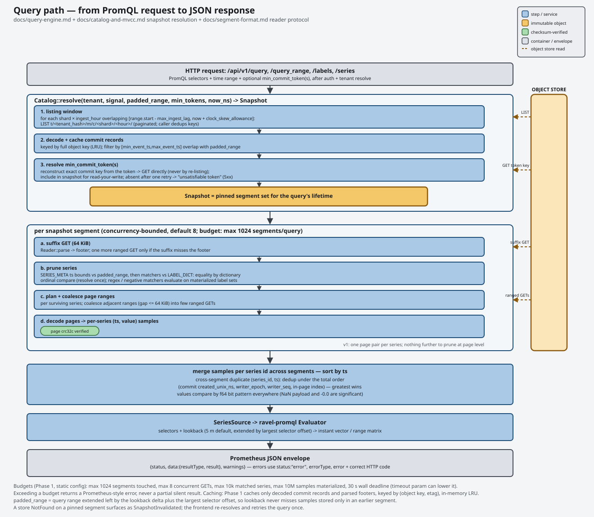

# Query



Ravel registers eleven routes under `/api/v1` on `--listen-http`. All but two
require the same tenant authentication as ingest: `Authorization: Bearer
<token>`, or the dev header if `--dev-insecure-tenant-header` is set. The two
exceptions are:

- `/api/v1/status/buildinfo` takes no credential.
- `/api/v1/metadata` answers an empty object to a request it cannot resolve.

`POST /api/v1/sql` and `POST /api/v1/analytics` return a described-schema JSON
envelope, documented with each. Operators trigger the maintenance route
`POST /api/v1/admin/fold`, which is not a query route. The Prometheus-shaped
endpoints return the Prometheus-compatible JSON envelope:

```json
{"status": "success", "data": {...}}
{"status": "error", "errorType": "bad_data", "error": "..."}
```

## Endpoints

### `GET/POST /api/v1/query`

Instant query. Parameters:

- `query` (required)
- `time` (optional, Prometheus timestamp format, defaults to now)
- `min_commit_token` (repeatable)
- `timeout` (optional)

```sh
curl -G http://127.0.0.1:4318/api/v1/query \
  -H "Authorization: Bearer devtoken" \
  --data-urlencode 'query=demo_requests_total{job="checkout"}' \
  --data-urlencode 'time=1732400000'
```

```json
{
  "status": "success",
  "data": {
    "resultType": "vector",
    "result": [
      {"metric": {"__name__": "demo_requests_total", "job": "checkout"}, "value": [1732400000, "42"]}
    ]
  }
}
```

### `GET/POST /api/v1/query_range`

Range query. Parameters:

- `query`, `start`, `end`, `step` (all required)
- `min_commit_token` (repeatable)
- `timeout` (optional)

```sh
curl -G http://127.0.0.1:4318/api/v1/query_range \
  -H "Authorization: Bearer devtoken" \
  --data-urlencode 'query=demo_requests_total' \
  --data-urlencode 'start=1732400000' \
  --data-urlencode 'end=1732400300' \
  --data-urlencode 'step=30s'
```

```json
{
  "status": "success",
  "data": {
    "resultType": "matrix",
    "result": [
      {"metric": {"__name__": "demo_requests_total"}, "values": [[1732400000, "40"], [1732400030, "41"]]}
    ]
  }
}
```

### `GET /api/v1/labels`

Label names across matched series. Parameters:

- `match[]` (optional, repeatable). Omit it to match every series in the
  window.
- `start`, `end`
- `min_commit_token` (repeatable)

```sh
curl -G http://127.0.0.1:4318/api/v1/labels \
  -H "Authorization: Bearer devtoken" \
  --data-urlencode 'match[]=demo_requests_total'
```

```json
{"status": "success", "data": ["__name__", "instance", "job"]}
```

### `GET /api/v1/label/{name}/values`

Values seen for one label name. The parameters are the same as for `/labels`.

```sh
curl -G http://127.0.0.1:4318/api/v1/label/job/values \
  -H "Authorization: Bearer devtoken"
```

```json
{"status": "success", "data": ["checkout", "payments"]}
```

### `GET/POST /api/v1/series`

Series that match one or more selectors, as label sets with no values.
Parameters:

- `match[]` (required, repeatable, at least one)
- `start`, `end`
- `min_commit_token` (repeatable)

```sh
curl -G http://127.0.0.1:4318/api/v1/series \
  -H "Authorization: Bearer devtoken" \
  --data-urlencode 'match[]=demo_requests_total{job="checkout"}'
```

```json
{"status": "success", "data": [{"__name__": "demo_requests_total", "job": "checkout"}]}
```

If you omit `match[]` on `/series`, you get a `400 bad_data` error
(`missing required parameter "match[]"`). `/labels` and `/label/{name}/values`
accept a request without `match[]` and match every series in the window.

When `start` and `end` are unset, `/labels`, `/label/{name}/values`, and
`/series` use the hour before now as their window.

If you give more than one `match[]` selector, each selector resolves its own
catalog snapshot independently. Ravel unions the results by series identity.
The selectors do not share one snapshot for the request.

### `GET /api/v1/status/buildinfo` and `GET /api/v1/metadata`

Two routes Grafana's built-in Prometheus datasource probes on every datasource
save. They take no parameters.

```json
{"status": "success", "data": {"version": "0.23.0", "revision": "", "branch": "", "buildUser": "", "buildDate": "", "goVersion": ""}}
```

`version` is the version of Ravel, not of Prometheus. `revision` is the git
SHA of the build when the build exported `RAVEL_GIT_SHA`. Otherwise it is
empty.

`/api/v1/metadata` returns the per-metric type, help, and unit for each metric
whose ingest carried them. The shape is the documented Prometheus shape:
`data` maps each family name to a length-1 array of `{type, help, unit}`.

- The route resolves the tenant from the same bearer credential that the other
  query routes use.
- It serves the metadata of that tenant from a per-process, per-tenant cache.
  The cost is one object read per tenant per refresh horizon, never a read per
  request.
- The optional `metric` and `limit` query parameters filter to one family and
  cap the number of names, as in Prometheus.

Metadata is best-effort:

- A metric ingested over a path that sent no type, help, or unit has no entry.
- A request that carries no resolvable tenant gets
  `{"status": "success", "data": {}}`. This endpoint never returns `401`.

See [the ingest guide](ingest.md#metric-metadata-and-otlp-name-suffixing) for
the OTLP name suffixing that decides the family names.

### `GET/POST /api/v1/query_exemplars`

Prometheus exemplar lookup. It returns the trace references that metric
samples carried, for a metric selector over a `start`/`end` window. It takes
the Prometheus `query`, `start`, and `end` parameters and returns the
Prometheus exemplar shape. Ravel stores exemplars only from OTLP ingest. For
the full walkthrough, including the Grafana metric-to-trace link, see
[correlation.md](correlation.md).

### `POST /api/v1/analytics`

A JSON-body endpoint that runs a range evaluation and applies one analytic to
each series of the result. It accepts two operations: change point detection
and summary statistics. It shares the query listener and needs no cargo
feature. The request and response schema, the operations, and the status
table are in [analytics.md](../analytics.md#endpoint).

## PromQL support

Ravel supports function calls, aggregations, binary operators, subqueries,
unary and paren expressions, the `@` modifier, and vector matching. The
evaluator is differentially tested against real Prometheus.

The generated conformance table in
[docs/query-engine.md](../query-engine.md#promql-conformance-adr-0035) is
authoritative. It classifies every construct as supported, intentionally
rejected, or an accepted divergence. Its counts come from a Ravel-only run.
Agreement with the pinned Prometheus binary is a separate row of that table,
and the committed table does not carry measured figures for it.

Ravel intentionally rejects a small set of constructs. Each one answers with a
typed `422 unprocessable_entity` error that names the construct, never a panic
and never silently wrong data. The current set is:

| Rejected | Error names it as |
|---|---|
| `histogram_stddev(x)` over native histograms | `histogram_stddev` |
| `histogram_stdvar(x)` over native histograms | `histogram_stdvar` |
| `x{job="a" or job="b"}`, an or-grouped matcher | `label matcher or-group` |
| `a + fill(0) b`, vector-matching fill values | `fill-in values` |
| `avg_over_time(x[5m:1m])` over native histograms, a subquery over native histograms | `subquery over native histograms` |

The experimental aggregation operators `limitk` and `limit_ratio` parse but are
also rejected with a typed error naming the operator: they are outside the
stable language and out of the scored surface, and not implemented (see
[the query engine spec](../query-engine.md)).

Subqueries are supported. Ravel refuses only a subquery whose inner expression
matches native-histogram data.

A bare vector selector has these properties:

- It accepts all four matcher operators: `=`, `!=`, `=~`, `!~`.
- Absent-label semantics match Prometheus. An absent label reads as an empty
  string for every operator:
  - `{foo=""}` matches series without `foo`.
  - `{foo=~".*"}` matches everything, including series without `foo`.
  - `{foo!=""}` matches only series where `foo` is present and non-empty.
  - `{foo=~""}` matches only series where `foo` is absent. The regex is
    anchored, so this is `^(?:)$`, which only an empty string satisfies.
- Regex matchers are always fully anchored (`^(?:pattern)$`), the same as
  Prometheus. As a result, `job=~"api"` does not match `job="api-server"`.
- It accepts `offset` in the standard positive form (look backward) and in the
  negative form (look forward, experimental in upstream PromQL too).
- The lookback is a fixed 5 minutes. At evaluation instant `T` (shifted by
  `offset` if present), the value of a series is its most recent sample with a
  timestamp in `(T - 5m, T]`. The start of the window is exclusive: a sample
  at the start, 5 minutes old, is not used. A series with no sample in that
  window is omitted from the result. It is not reported as absent or zero.

## PromQL over logs

You can query the `logs` signal through the PromQL HTTP API with two reserved
metric names:

- `ravel_log_lines`: one sample per log line, with value `1`.
  `count_over_time` counts lines.
- `ravel_log_bytes`: one sample per log line. The value is the length of the
  `body` of the line in bytes. `sum_over_time` sums bytes.

`/api/v1/query`, `/api/v1/query_range` and `/api/v1/metadata` serve these two
names as they serve any other metric name. The discovery endpoints treat a
log selector in `match[]` as they treat a metrics selector:

- `/api/v1/series` returns its matching label sets.
- `/api/v1/labels` returns the label names that those sets carry.
- `/api/v1/label/{name}/values` returns the values of that label. For
  `__name__`, the values include the two reserved names.

### Log selector routing

Ravel answers a vector selector from the logs signal only when its `__name__`
matcher is an `=` equality on `ravel_log_lines` or `ravel_log_bytes`. For
example, `ravel_log_lines{job="api"}` is a log selector.
`{__name__=~"ravel_log_.*"}` is never a log selector, and neither is a `!=`
matcher. Every other selector resolves against the metrics signal, including
one that only resembles a reserved name.

### Label mapping

A log record becomes one sample. Ravel builds its label set in this precedence
order, and the first writer wins on a key collision:

1. `__name__`: `ravel_log_lines` or `ravel_log_bytes`, from the selector.
2. `job` and `instance`: the same derivation that ingest uses for metrics (see
   [the ingest guide](ingest.md)).
3. `otel_scope_name` and `otel_scope_version` when non-empty, and
   `otel_scope_<attr>` for each scope attribute.
4. Every remaining resource attribute, sanitized to a label name. Unlike
   metrics ingest, this mapping has **no allowlist**: every resource attribute
   that the stream of the record carries becomes a label, not only a fixed
   set.
5. `severity_text` when non-empty. It is the one per-record (not per-stream)
   field promoted to a label.

Only scalar attributes become labels:

- A string is used as it stands.
- An integer, double or boolean is rendered the way the SQL `attrs` map
  renders it.
- A byte string, list or map is skipped, because none has a faithful single
  label value.
- An attribute whose value is empty is skipped, so an empty attribute never
  differs from an absent one.

To sanitize a name for use as a label, Ravel rewrites the first character to
`[A-Za-z_]` and every later character to `[A-Za-z0-9_]` in place. For example,
`k8s.pod.name` becomes `k8s_pod_name`. This is the rule that
`ravel_otlp::normalize::sanitize_label_name` applies to metrics.

The `__`-prefixed namespace is reserved. Ravel drops an attribute whose
sanitized name lands there. The only `__` label on a log-derived series is the
`__name__` that the mapping sets to the reserved metric name.

A **stream** is a resource-and-scope attribute set. It is not the same thing
as a query-time series:

- Two streams merge into one series when their resource, scope, and per-record
  `severity_text` map to the identical label set. Their samples interleave and
  none are dropped.
- The records of one stream split into distinct series when they have
  different `severity_text` values (for example, `ERROR` and `INFO` from the
  same pod), because `severity_text` is part of the label set.

Two records at the same timestamp in the same series are never deduplicated or
merged. Both remain distinct samples, ordered by ascending `value.to_bits()`.
`ravel_log_lines` always has value `1`, so its same-timestamp lines have no
defined order beyond that bit-pattern tie-break.

### The `__body__` matcher

`__body__` matches the body of a log record, by whole-body equality
(`__body__="exact text"`) or by a fully-anchored regex
(`__body__=~".*timeout.*"`). It is a matcher only. It never appears in a
returned label set, and it has no effect on series identity or on the merge
and split rules. Multiple `__body__` matchers in one selector AND together.

### `rate()` on log series

`rate()` has no log-specific meaning. To get lines per second over a log
selector, divide `count_over_time` by the seconds of the window, as for any
counter-shaped `count_over_time`:

```promql
count_over_time(ravel_log_lines{job="api"}[5m]) / 300
```

### Budgets and reserved names

A log selector uses the same [query budgets](#query-budgets) as a metrics
selector, in the same query. `max_samples`, `max_series`, `max_segments`,
`max_bytes_scanned`, and `max_s3_requests` are shared totals across every
selector that a query contains, metrics and log alike. A query that exceeds
one gets the same typed `422` that a metrics-only query gets.

`/api/v1/label/__name__/values` lists the reserved names as follows:

- A request with no `match[]` gets both `ravel_log_lines` and
  `ravel_log_bytes`.
- A request where at least one `match[]` selector is a log selector gets both.
  A `match[]` that names one reserved name currently returns both of them.
- A request whose selectors name only metrics gets metrics names only.

The names are listed even on a tenant that never ingested a log, because they
exist independently of the data.

`/api/v1/metadata` always includes both reserved names, each with a fixed
`type`, `help`, and `unit`. The same `metric` and `limit` filters apply as for
a metrics request. Neither entry depends on ingested log data.

### Local evaluation only

The query coordinator answers a log selector directly against object storage.
A log selector does not fan out over `--distributed-query` federation the way a
metrics selector does. A federated deployment still answers a log selector,
from the local view of the coordinator and without a cluster-wide merge.
Federation of log selectors is unscheduled follow-up work.

### Examples

Error lines per job over the last 5 minutes:

```sh
curl -G http://127.0.0.1:4318/api/v1/query \
  -H "Authorization: Bearer devtoken" \
  --data-urlencode 'query=sum by (job) (count_over_time(ravel_log_lines{severity_text="ERROR"}[5m]))'
```

```json
{
  "status": "success",
  "data": {
    "resultType": "vector",
    "result": [
      {"metric": {"job": "api"}, "value": [1732400000, "128"]}
    ]
  }
}
```

Log volume in bytes for lines whose body mentions a timeout:

```sh
curl -G http://127.0.0.1:4318/api/v1/query \
  -H "Authorization: Bearer devtoken" \
  --data-urlencode 'query=sum(sum_over_time(ravel_log_bytes{job="api", __body__=~".*timeout.*"}[1h]))'
```

```json
{
  "status": "success",
  "data": {
    "resultType": "vector",
    "result": [
      {"metric": {}, "value": [1732400000, "5312"]}
    ]
  }
}
```

## `min_commit_token`

To guarantee that a query sees a write, pass the commit token from the
`x-ravel-commit-token` header of the ingest response as `min_commit_token`.
Repeat the parameter if you have more than one token, for example from a
request that flushed to multiple shards.

The catalog resolves each token directly to its commit record. It does not
depend on a listing that can race the write. If the catalog cannot resolve a
token, the query fails with `503 unavailable`. It does not return a snapshot
older than the one you asked for. See
[docs/guides/ingest.md](ingest.md#commit-tokens-and-read-your-write).

## Query budgets

Every query is bounded. A query that exceeds a bound gets a typed error, never
a silent truncation:

| Budget | Default | Error when exceeded |
|---|---|---|
| Segments touched | fixed: 1,000,000 (`--max-segments`) | `query matched {count} segments, exceeding the limit of {max}` |
| Distinct series | 10,000 | `query matched {count} series, exceeding the limit of {max}` |
| Samples materialized | 10,000,000 | `query matched {count} samples, exceeding the limit of {max}` |
| Concurrent segment fetches | derived: `max(8, 2 x cores)` (`--promql-fetch-fanout`, or `--store-get-concurrency` for the shared object-store GET ceiling) | (not user-visible; throughput knob only) |
| Wall-clock deadline | fixed: 11m (`--gc-max-query-duration`) | `query exceeded its deadline of {deadline}` |
| Catalog list requests | 100,000 | `query window too wide: it would issue an estimated {estimate} catalog list requests, over the limit of {limit}; narrow the query time range and retry` |
| Bytes scanned | unlimited (opt in via `query_defaults.max_bytes_scanned`) | `query scanned {scanned} bytes, exceeding the budget of {max}` |
| Object-store requests | derived from the deployment's shard count and flush cadence | `query issued {requests} S3 requests, exceeding the budget of {max}`, followed by `; the catalog's unsealed tail is {tail} s, longer than the {threshold} s a catalog whose fold is keeping up can show, so the fold is behind and the tail is what the budget was spent on: check ravel_catalog_fold_last_success_timestamp_seconds before raising the budget` when the refusal was caused by a lagging fold (see "Segment admission" in [the query engine reference](../query-engine.md)) |

`timeout` lowers the deadline per request. It takes Prometheus duration syntax
like `30s`/`5m`, or bare float seconds. It cannot raise the deadline above the
configured default of the server.

SQL queries have one more bound: a per-query byte ceiling on the DataFusion
memory pool. The default is 50% of the memory of the host, which is the whole
SQL share of the tenant (~15 GiB on a 30 GB host). See
[Operator-configurable budgets](#operator-configurable-budgets-server-flags).

The ceiling bounds the memory that the query holds at one instant: what a
scan has decoded, the batch that it hands downstream, and the aggregate state
that the operators above it accumulate. It does not bound the number of bytes
that the query produces over its lifetime.

- A full-table scan over `logs` does not exhaust the pool only because it is
  large. The logs scan streams one block at a time and releases each block
  before it decodes the next, so its contribution follows block size and
  partition count.
- An `ORDER BY` or a high-cardinality `GROUP BY` over a large result is what
  accumulates.

A query that exceeds the ceiling gets an HTTP 422 `execution` error that names
the pool, never a truncated result.

### Operator-configurable budgets (server flags)

Six of these budgets are process-wide server flags. None is per-tenant. An
unset flag resolves at startup, and only some resolve **from host
resources**:

- `--store-get-concurrency`, `--sql-partition-count`, and
  `--promql-fetch-fanout` follow the core count. The legacy
  `--fetch-concurrency` sets all three.
- The two SQL ceilings follow memory: shares of `MemTotal`, capped by the
  cgroup memory limit in a container.
- `--max-segments` is a fixed 1,000,000 on every host.

Ravel uses a nonzero flag value verbatim, with one exception: it clamps the
per-query SQL pool to an explicit per-tenant ceiling that is set below it. The
"Reference host" column is what a 16-core, 30 GB host resolves to. The
published ClickBench run used these settings.

| Flag | Reaches | Default (unset) | Reference host |
|---|---|---|---|
| `--fetch-concurrency <N>` | legacy: sets all three rows below together (source `legacy-flag`) | derived: `max(8, 2 x cores)` | 32 |
| `--store-get-concurrency <N>` | `EngineConfig::store_get_concurrency`, the process-wide `GetLimiter` permit count | derived: `max(8, 2 x cores)` | 32 |
| `--sql-partition-count <N>` | `EngineConfig::sql_partition_count`, DataFusion `target_partitions` | derived: `max(8, 2 x cores)` | 32 |
| `--promql-fetch-fanout <N>` | `EngineConfig::promql_fetch_fanout`, per-selector fetch stream fan-out | derived: `max(8, 2 x cores)` | 32 |
| `--max-segments <N>` | `EngineConfig::max_segments` | fixed: 1,000,000 (host-independent) | 1,000,000 |
| `--sql-max-query-bytes <BYTES>` | `SqlConfig::max_query_bytes` (per-query SQL memory pool) | derived: 50% of MemTotal, the tenant's share (256 MiB if unknown) | 16,106,127,360 |
| `--sql-tenant-max-bytes <BYTES>` | per-tenant SQL memory ceiling | derived: 50% of MemTotal (1 GiB if unknown) | 16,106,127,360 |

Two combinations fail startup:

- `--fetch-concurrency` together with any of `--store-get-concurrency`,
  `--sql-partition-count`, or `--promql-fetch-fanout`. The error names both
  flags.
- A value of `0` in any of these four flags. The error names that flag.
  Configuration resolution raises it before any fetcher, engine, or SQL
  session exists.

The per-query SQL pool never exceeds the per-tenant ceiling. Which side moves
depends on what the operator set:

| Operator set | Result |
|---|---|
| `--sql-tenant-max-bytes` below the per-query pool | The pool is lowered to the ceiling. A ceiling that the operator set is never raised. |
| `--sql-max-query-bytes` above a derived or fallback tenant ceiling | The ceiling is raised to match the pool. |
| Neither flag | The derived values already satisfy the order. |

Startup logs both adjustments: `clamped` and `raised` on the resolved lines,
plus a WARN.

Startup logs every resolved value, one line per setting with its source
(`derived`, `flag`, `fallback`, or `legacy-flag`):

```
INFO performance default resolved setting="fetch_concurrency" value=32 source="derived"
INFO performance default resolved setting="store_get_concurrency" value=32 source="derived"
INFO performance default resolved setting="sql_partition_count" value=32 source="derived"
INFO performance default resolved setting="promql_fetch_fanout" value=32 source="derived"
INFO performance default resolved setting="cache_max_bytes" value=8053063680 source="derived"
```

The three concurrency flags set three independent values:

- `--store-get-concurrency`: the process-wide object-store GET ceiling, one
  `Arc<GetLimiter>` that every fetcher and engine in the process shares.
- `--sql-partition-count`: the SQL scan partition count.
- `--promql-fetch-fanout`: the PromQL/analytics per-query segment fetch
  fan-out.

`--fetch-concurrency` sets all three together, for a configuration written
before the three flags existed.

`--logs-fetch-policy latency-first` resolves these three concurrency settings
the same way as every other policy. It pays off only after an operator raises
them explicitly, and it has a memory caveat. Before you turn it on, read the
fetch-policy table in
[Operations: configuration](operations/configuration.md#logs-fetch-policy-and-store-cost-profile).

`--max-segments` caps how many segments one query fans out over. Only the
narrow recent set (`SegmentOrigin::Recent`, roughly the last couple of hours)
is exempt. Everything older counts toward the cap, including compacted L0/L1
objects. A wide scan over a tenant with many sealed objects reaches the cap
directly. Raise this flag for such a workload.

`--sql-max-query-bytes` bounds the DataFusion memory pool of one SQL query.
`--sql-tenant-max-bytes` bounds the memory that one tenant can hold across its
concurrent SQL queries. It is the multi-tenant isolation ceiling. At the
derived defaults it equals the per-query pool: one statement can use the whole
share, and a second concurrent statement gets what the first left. Both flags
apply only in a build with the `sql` feature.

Per-tenant SQL budgets are **not** configurable in the `--limits-file`. Its
per-tenant query overrides are not consulted at query time and are inert, so
these ceilings are process-wide flags.

`max_bytes_scanned` is **not** a flag. It is a `--limits-file` entry
(`query_defaults.max_bytes_scanned`, default Unlimited). See
[admission-limits.md](admission-limits.md). `--max-s3-requests` is a flag.
When you omit it, Ravel derives it from `--shards` and the flush cadence.

`--gc-max-query-duration` sets the wall-clock deadline that the engine
enforces. Unset, it is a fixed **11 minutes** on every host, the deadline that
the published ClickBench run was configured with. It must be **`<=`** the
durable `sys/gc.max_query_duration` of the tenant (default 1h), which the
derived value satisfies. Ravel **rejects a higher value at startup** with a
hard error and does not clamp it. If you need a longer engine deadline, raise
`sys/gc.max_query_duration` first (`ravel-cli gc-config set`).

Ravel checks the catalog-list budget before it makes any object-store request:

- The catalog lists one prefix per (shard, ingest hour) from the start of the
  window to the current hour. A query whose `start` reaches far back can
  therefore ask for hundreds of thousands of LIST requests against object
  storage in one call. A `start` of `0` (epoch) is the usual cause.
- Ravel refuses such a query before it can run up an object-store bill or
  saturate the listing path.
- The error reports the estimate and the limit. Narrow the time range by the
  reported factor and retry.
- The ceiling permits roughly an 11-year window at one shard and about 8.5
  months at sixteen. It decreases as the shard count rises.
- The limit is on the *start* of the query. A narrow `start`/`end` pair costs
  little however recent it is. To correct the error, always move `start`
  forward. Never change `end`.

<a id="sql-over-samples-logs-and-spans"></a>

## SQL queries

`POST /api/v1/sql` serves five tables from one endpoint:

- `samples` (metrics)
- `logs`
- `spans` (traces)
- `alerts` (alert state transitions)
- `audit` (audit records)

The server parses the `FROM` clause of the query before it plans, and
registers only that one table for the query. One query can reference only one
of the five. A query that names two or more of them crosses signals. Ravel
rejects it with an HTTP 400 before any catalog listing. The request body,
auth, window (`start`/`end`), and `min_commit_token` handling are the same for
all five tables.

The same endpoint also serves the Parquet tables of the tenant. A query can
join Parquet tables with each other but not with any of the five. One of the
five beside a Parquet table is the same HTTP 400. Ravel returns it after one
listing per other name finds that the name is a Parquet table.

### `DISTINCT ON`

`SELECT DISTINCT ON (...)` is supported only when its `ORDER BY` fully
determines the row it keeps for each group. Every selected column must also
be an `ORDER BY` term, written as the plain column:

```sql
SELECT DISTINCT ON (series_id) series_id, ts, value
FROM samples
ORDER BY series_id, ts DESC, value
```

This returns the latest sample of each series. The same statement without
the trailing `value` is refused with an HTTP 400 that names `DISTINCT ON`,
even though `ts` is unique within a series, and so is a `DISTINCT ON` with
no `ORDER BY`. Without that rule, two rows that tie on the `ORDER BY` could
differ in a selected column, and which one came back would depend on how the
data is stored rather than on the statement. When the rule holds, the result
is the same on every run.

`first_value` is not a supported aggregate or window function. Ravel uses it
internally to answer `DISTINCT ON`, but a statement that calls it directly is
refused with an HTTP 400.

### Parquet table DDL

The same endpoint creates and drops Parquet tables. The server routes a
statement to the DDL path when its first keyword, after whitespace and
comments, is `CREATE` or `DROP`, whatever comes after that keyword.

A caller needs the `ddl` capability, which is absent by default. Without it,
Ravel refuses `CREATE` and `DROP` with 403 `forbidden`. These callers hold the
capability:

- a bearer token whose tenant is written `TENANT;ddl`
  (`--tenant-token NAME=TENANT;ddl`)
- an OIDC token whose `--oidc-ddl-claim` claim is `true`

The `LOCATION` must also lie inside a location grant recorded for the tenant.
The server needs `--parquet-profiles PATH`, which points at the
credential-profile file that the grant resolves against. Without that flag, no
Parquet table is queryable at all. Grant the location with `ravel-cli`, against
the same profile file:

```sh
ravel-cli --parquet-profiles profiles.json tenant parquet-grant add \
  --tenant acme --location s3://lake/data/clicks/ --profile lake
```

A success is a JSON body with `outcome` (`created`, `dropped`, or `noop`) and
the table name, even when `Accept` asks for Arrow. A `CREATE` of a table that
already exists is a 409. A `DROP` of a missing table is a 404.

The response and the per-query cost family do not carry the object-store
requests and bytes of a DDL statement. `/metrics` reports them per phase in
the
[`ravel_sql_ddl_*` families](observability.md#sql-ddl-statements-and-their-store-cost-ravel_sql_ddl_).

Each statement that changes a table writes its next manifest version. No
statement writes a version above 4294967296 (2^32). Ravel refuses a statement
that needs a higher version, with a 422 that names the table, the version and
that bound.

A version above the bound can only have been put into the bucket directly.
Queries and DDL ignore it and keep using the newest version of the table at or
below the bound. An operator removes it with `ravel-cli parquet repair` (see
[repairing a forged Parquet table version](operations/maintenance.md#repairing-a-forged-parquet-table-version)).

```sh
curl -X POST http://127.0.0.1:4318/api/v1/sql \
  -H "Authorization: Bearer devtoken" \
  -H "Content-Type: application/json" \
  -d '{"query": "CREATE EXTERNAL TABLE clicks STORED AS PARQUET LOCATION '\''s3://lake/data/clicks/'\''"}'

curl -X POST http://127.0.0.1:4318/api/v1/sql \
  -H "Authorization: Bearer devtoken" \
  -H "Content-Type: application/json" \
  -d '{"query": "DROP TABLE clicks"}'
```

In this example the server was started with `--tenant-token devtoken=acme;ddl
--parquet-profiles profiles.json`. The `;ddl` suffix is on the tenant half of
that mapping, not on the bearer value. `Authorization` therefore still carries
only the plain token (`devtoken`) that the client sends. The grant and the
token mapping of the server must agree on the same tenant (`acme` in both).

### The `samples` table

The `samples` table columns are `ts` (`Timestamp(ns)`), `value` (`Float64`),
`series_id` (`FixedSizeBinary(16)`), and `labels` (a dictionary-encoded
`Map(Utf8, Utf8)`).

No column can hold a native histogram, so **native-histogram samples are not
rows in `samples` and no query over it can see them**:

- On a tenant that exports native histograms, `SELECT count(*) FROM samples`
  counts the scalar samples only.
- On a histogram-only tenant it answers 0.
- The same applies to every aggregation over the table.

Query native histograms through PromQL, which has a full histogram model. Do
not reconcile a totals count against SQL.

A statement whose scan met histogram data and excluded it says so. The JSON
response carries a top-level `warnings` array of strings beside `status`,
`data`, and `stats`. The shape and the omit-when-empty rule are the same as on
the PromQL endpoints. A response with no `warnings` key is a complete answer
over what the table can represent.

Two cases carry no warning even though the exclusion applies:

- An Arrow IPC response (`Accept: application/vnd.apache.arrow.stream`). It is
  a bare columnar payload with nowhere to put a warning.
- Flight SQL, which has no such envelope either.

A client on those encodings must assume that the exclusion applies to its
tenant.

```json
{
  "status": "success",
  "data": { "columns": [ ... ], "rows": [ [ 2 ] ] },
  "stats": { ... },
  "warnings": [
    "native-histogram samples are excluded from the samples table, which has no column that can hold one; this result omits them, so counts and aggregations over samples are short by the histogram population"
  ]
}
```

### The `logs` table

The `logs` table columns are `ts`, `observed_ts` (both `Timestamp(ns)`),
`severity_num`, `severity_text`, `body`, `trace_id`, `span_id`, `flags`, and an
`attrs` `Map(Utf8, Utf8)`. The `attrs` map merges the resource, scope, and
per-record attributes of each record. See docs/query-engine.md for the full
schema and semantics.

### The `alerts` table

The `alerts` table columns are:

- `ts_ns` (`Timestamp(ns)`, the event time of the transition)
- `alert_id`, `rule_id`, `state` (all `Utf8`)
- `generation` (`Int64`)
- `writer_id` (`Utf8`)
- `writer_epoch` and `writer_seq` (both `UInt64`)
- an `attrs` `Map(Utf8, Utf8)` that carries the `label.<k>` and
  `annotation.<k>` entries of the rule alongside the promoted keys

`state` takes four values: `pending`, `firing`, `resolved`, and `suppressed`.

The table is raw history, one row per state transition. It never holds a
folded "current state" row. Current state is a query over that history: the
row that sorts first per `alert_id` under `ts_ns DESC, writer_epoch DESC,
writer_seq DESC, writer_id DESC`. The three write-identity columns make that a
total order. Two evaluators can overlap briefly at a lease handover and write
the same `alert_id` at the same `ts_ns`:

```sql
SELECT alert_id, state FROM
  (SELECT *, ROW_NUMBER() OVER (PARTITION BY alert_id
   ORDER BY ts_ns DESC, writer_epoch DESC, writer_seq DESC, writer_id DESC) AS rn
   FROM alerts) WHERE rn = 1 ORDER BY alert_id
```

See the [alerting guide](alerting.md) for what writes those transitions.

### The `audit` table

The `audit` table columns are `ts_ns` (`Timestamp(ns)`), `severity_text`,
`body` (both `Utf8`), and an `attrs` `Map(Utf8, Utf8)`. The table is generic.
`attrs['kind']` selects the record kind (`query` for the query-audit trail,
`legal_hold`, `reshard`), and the fields of each kind are in the same map.
Resolution is per tenant hash, so a tenant reads only its own records.

The maintenance process writes legal-hold and reshard records, so any
deployment that took those actions has them.

Query-audit records are absent on a stock build. Every query surface submits
one record per executed statement through a sink, and no shipped startup path
replaces that sink with the real pipeline. On a stock build
`attrs['kind'] = 'query'` therefore selects nothing. The handler behavior and
the record shape are in place, and only the install is missing. After a
deployment attaches the pipeline, a query over `audit` is itself audited and
appears in the trail that a later query reads.

### Typed attribute columns

An operator can declare per-tenant *typed attribute columns* in addition to
the fixed columns. A typed attribute column is an attribute key promoted to a
native column that has the name of the key. A typed comparison or aggregate
over it then needs no `CAST` over the stringified map. The native types are
`Int64`, `Boolean`, `Dictionary(Int32, Utf8)` (for a `str` column), and
`Binary`.

A declared `str` column is dictionary-encoded. The client sees this change
from the plain `Utf8` column that it had before the declaration:

| Wire | What the client sees |
|---|---|
| Flight SQL | The column stays a dictionary. It is not hydrated back to plain `Utf8`. |
| HTTP JSON | The row *values* are unchanged: a string per row, and `null` for an absent or type-mismatched cell. The declared `columns[].type` of the response envelope reports `Dictionary(Int32, Utf8)` instead of `Utf8`. |
| Arrow IPC | The schema and every batch column carry the dictionary type verbatim. |

Declared keys still appear in `attrs`. A declaration comes from the
`--typed-attr-column` flags of the server, or from the durable per-tenant
override that `ravel-cli typed-attr-column set` writes. A query on a column
that is not a typed attribute column gets an unknown-column error. A row whose
stored value has another type reads NULL and is not cast.

A predicate on a typed attribute column prunes blocks before decode, so it is
no slower than the equivalent `attrs['k']` filter:

- A selective `i64`/`bool` comparison, `BETWEEN`, or `i64` `IN (...)` skips
  blocks through the RLOG skip index (`status_code > 500`, `is_active = true`,
  `status_code IN (200, 404)`).
- A `str`/`bytes` equality prunes through POSTINGS, like `attrs['k'] = 'v'`.

Pruning is always widen-only, because Ravel applies the original predicate
again above the scan. The coarser range of the `IN` envelope and any
type-mismatched shape (`!=`, a range on a `str` column, a float compared to an
`i64` column) change only which blocks the fetch reads, never which rows
return.

Two caveats apply:

- The `str`/`bytes` equality half gets no pruning benefit on an object whose
  POSTINGS section predates the current writer.
- A name that also carries a non-`str` column anywhere declines equality
  pruning for that name.

See
[typed attribute columns](operations/configuration.md#typed-attribute-columns)
and [the query engine spec](../query-engine.md) for the full contract.

### Declaring typed attribute columns

To load a dataset and to declare its typed columns are **two separate steps**,
in this order:

1. **Load** the data with `ravel-cli load --parquet ...` (see
   [ingest.md](ingest.md#bulk-import-ravel-cli-load---parquet)). The
   loader writes data objects only. It never touches tenant config.
2. **Declare** the typed columns with `ravel-cli typed-attr-column set`. This
   is a control-plane write: a durable CAS that replaces the whole list. You
   can pass the columns explicitly as `KEY:TYPE` specs, or derive them from
   the same `--mapping` that the load used:

   ```sh
   ravel-cli typed-attr-column set acme --from-mapping map.toml
   ```

`--from-mapping` turns every `[[attribute]]` and `[[resource_attribute]]`
entry into a typed attribute column of the same-named type (`str`/`i64`/`bool`/
`bytes`):

- You can declare a resource (stream-level) key, because a typed attribute
  column reads the merged resource+scope+record attribute view.
- An `f64`-typed entry is **skipped with a per-key warning**, because no `f64`
  typed attribute column type exists. The other entries are still written.
- A key declared twice is rejected, and nothing is written.
- A key that collides with a fixed logs column name is rejected, and nothing
  is written.

**Queries do not see a new declaration instantly.** A `set` is durable at
once. A query-serving process resolves the durable declaration behind a
**staleness horizon** (60s by default). A query can keep using the previous
declaration until the server refreshes within that horizon. No restart is
needed. Wait for the horizon to pass before you assert that a new declaration
reads as a typed attribute column.

An attribute that overflowed the dynamic-column budget of the load (see
[ingest.md](ingest.md#the-dynamic-column-budget-and-its-warnings)) stays
queryable through `attrs['<key>']`, declared or not.

### Log query examples

A `ts` range scan. `ts` is a timestamp, so the bounds are `TIMESTAMP` literals,
not bare integers:

```sh
curl -X POST http://127.0.0.1:4318/api/v1/sql \
  -H "Authorization: Bearer devtoken" \
  -H "Content-Type: application/json" \
  -d '{
        "query": "SELECT ts, severity_text, body FROM logs WHERE ts >= TIMESTAMP '\''2026-07-30 00:00:00'\'' ORDER BY ts LIMIT 100",
        "start": 1785369600.0,
        "end": 1785373200.0
      }'
```

A word or phrase content search with `has_word(body, 'literal')`. It pushes
down to the RLOG bloom-accelerated scan and matches whole tokens. For example,
`timeout` matches `connection timeout` but not `timed out`:

```sh
curl -X POST http://127.0.0.1:4318/api/v1/sql \
  -H "Authorization: Bearer devtoken" \
  -H "Content-Type: application/json" \
  -d '{"query": "SELECT ts, body FROM logs WHERE has_word(body, '\''timeout'\'') ORDER BY ts"}'
```

A filter by an attribute value, with the `attrs['k']` subscript:

```sh
curl -X POST http://127.0.0.1:4318/api/v1/sql \
  -H "Authorization: Bearer devtoken" \
  -H "Content-Type: application/json" \
  -d '{"query": "SELECT ts, body FROM logs WHERE attrs['\''service.name'\''] = '\''api'\'' ORDER BY ts"}'
```

The `attrs` column merges three sources of attributes into one map. The
sources are the resource, the scope, and the log record. If more than one
source sets the same key, the value from the record wins.

A key that no record carries returns zero rows. It is not an error.

Attribute equality does not change which objects Ravel reads. The `ts` range
selects them. Inside an object, pruning works as follows:

- An equality on an indexed field or a typed attribute column prunes blocks
  through the POSTINGS index before decode.
- `has_word` prunes through the token bloom filter.
- Ravel applies any other attribute predicate to the decoded records.

### At-least-once rows

Log rows are at-least-once, and a `SELECT` (or `COUNT(*)`) reflects that. A
client retry after a lost ack ingests the batch again. Logs have no query-time
dedup, unlike metrics, so the query returns the retried rows as extra rows. A
`COUNT` over logs is therefore a lower-bounded count, not an exact one, for
any window that a retry can have touched. The same terms apply to span rows
in the `spans` table on the same endpoint.

The `x-ravel-idempotency-key` suppresses this for keyed sequential retries.
Unkeyed ingest gets plain at-least-once. See
[consistency-model.md](../consistency-model.md#duplicates-and-idempotency)
for the full contract.

## Alerting on these queries

Alert rules run these same PromQL and SQL queries on a schedule. They notify a
sink when a threshold trips or a detection query returns rows. The rules file,
the modes that evaluate it, and the sinks are in the
[alerting guide](alerting.md).

## HTTP status codes

| Status | `errorType` | When |
|---|---|---|
| 200 | n/a | Success. |
| 400 | `bad_data` | Bad or missing parameter, PromQL parse error, invalid time range, step <= 0. |
| 401 | `unauthorized` | Tenant authentication failed or was not provided. |
| 403 | `forbidden` | A SQL `CREATE` or `DROP` from a caller without the `ddl` capability. |
| 404 | `not_found` | A plain `DROP TABLE` naming a missing table. |
| 409 | `conflict` | A plain `CREATE EXTERNAL TABLE` naming a table that already exists. |
| 422 | `execution` | A well-formed DDL statement the tenant cannot serve, such as a `LOCATION` outside its grants, or an intentionally rejected PromQL construct (the set listed under PromQL support: `histogram_stddev`/`histogram_stdvar` over native histograms, an or-grouped label matcher, vector-matching fill values, a subquery over native histograms, or the experimental `limitk`/`limit_ratio` operators), or a query budget (segments/series/samples, bytes scanned, object-store requests, the catalog-list window ceiling, or the SQL memory pool) exceeded. |
| 500 | `internal` | Permanent data corruption: a corrupt catalog record, segment, field, or key, a catalog object (commit, compaction or rewrite record, erasure request, HEAD, snapshot part or postings) whose stored bytes fail to decode at a format version this build covers, carry a format version below the lowest it supports, or leave an enum field unset (proto3's default 0) where a value is required, an erasure request or rewrite record naming a signal this build does not know, a provisioning record that fails to decode, is misfiled, carries a corrupt shard-generation or format-floor history, or carries a format version below the lowest this build supports, a supersession chain of compaction or rewrite records that is cyclic, deeper than the resolver's fixed bound, or names a predecessor with a different input set, or a non-monotonic sample sequence. The message is a fixed internal-error string; the storage-layer detail is redacted and logged server-side. |
| 503 | `unavailable` | Transient catalog or segment fetch failure, a catalog object (commit, compaction or rewrite record, erasure request, HEAD, snapshot part or postings) written in a format version above the highest this build reads, or carrying an enum value above the highest it reads (a snapshot part entry level), which a peer on a newer build can read during a rolling upgrade, a provisioning record written in a format version above the highest this build reads, an unresolvable `min_commit_token`, or a snapshot invalidated by concurrent GC/compaction. A checksum mismatch on a catalog or segment read answers 500, not 503. A decode job for a catalog snapshot part, postings or column-statistics object that panics, or that the read CPU gate cancels at shutdown, answers no error: the query still answers exactly, by a slower path. |
| 504 | `timeout` | Query exceeded its deadline. |

## Background

PromQL over logs, the two reserved metric names, the label mapping, and the
coordinator-local (non-federated) evaluation are
[ADR-1103](../adrs/1103-promql-over-logs.md).
