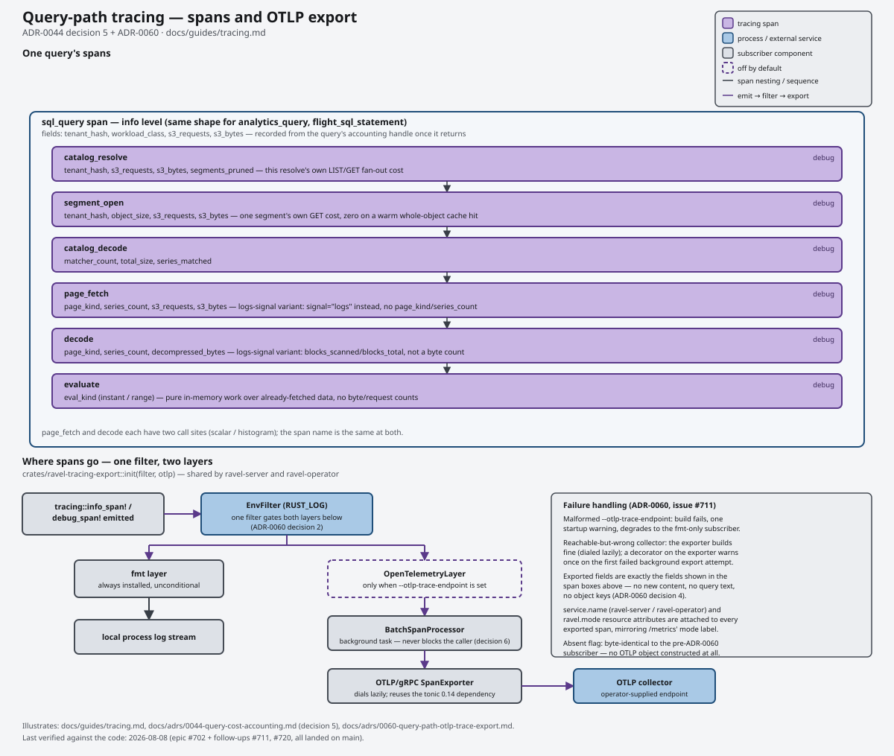

# Query-path tracing

Ravel instruments the read path with `tracing` spans so a slow query can be
attributed to a phase. Each crate opens a span around the work it owns, and
every span carries the same bounded fields the `/metrics` label allowlist
permits (a tenant hash and per-span byte and request counts), never a query
text, a metric name, a label value, or an object key.



## This guide and the observability guide

This guide covers the query-path spans: which spans exist, what each records,
how to turn them on, and how to read them to place a slow query's time in a
phase. Spans answer "where did the time go" for one request.

The [observability guide](observability.md) is the catalog of `GET /metrics`.
Metrics answer "how much" in aggregate across the process: request counts,
byte counts, cache outcomes, error kinds, and the per-query cost estimate
against the actual. It does not carry per-request timing. Read it to
understand a sample on the route; read this guide to attribute one query.

## The spans

Spans come in two kinds. Request-level spans wrap a whole query and are
created at `info` level, so they appear under the default log filter. Phase
spans wrap one stage of the read path and are created at `debug` level, so
they are off until you widen the filter (see
[Turning them on](#turning-them-on)).

The tables below give each span's `tracing` target, which is the name that
appears on the log line and the name a `RUST_LOG` directive matches. That is
the handle you actually have on a running process: to see a span, name its
target.

### Request-level spans (info)

Each transport opens one span for the whole request and records the query's
final store-request and byte counts once it finishes.

| Span | Opened by | `RUST_LOG` target | Fields |
|---|---|---|---|
| `sql_query` | `POST /api/v1/sql` | `ravel_server` | `tenant_hash`, `workload_class`, `s3_requests`, `s3_bytes` |
| `analytics_query` | the analytics routes | `ravel_server` | `tenant_hash`, `workload_class`, `s3_requests`, `s3_bytes` |
| `flight_sql_statement` | a Flight SQL statement | `ravel_sql` | `tenant_hash`, `workload_class`, `s3_requests`, `s3_bytes` |

`workload_class` is the literal `interactive` on all three: every query over
these transports is client-driven. `s3_requests` and `s3_bytes` start empty
and are recorded from the query's accounting handle when it returns, so they
are the whole query's authoritative totals, the same numbers the response body
and `/metrics` are fed from.

### Phase spans (debug)

Six span names cover the read-path phases. `page_fetch`, `decode`, and
`evaluate` each have two callsites (a scalar and a histogram variant, an
instant and a range variant); the span name is the same at both.

| Span | Phase it wraps | `RUST_LOG` target | Fields |
|---|---|---|---|
| `catalog_resolve` | resolving one snapshot | `ravel_catalog` | `tenant_hash`, `s3_requests`, `s3_bytes`, `segments_pruned` |
| `segment_open` | opening one segment | `ravel_query` | `tenant_hash`, `object_size`, `s3_requests`, `s3_bytes` |
| `catalog_decode` | decoding a segment's series catalog | `ravel_query` | `matcher_count`, `total_size`, `series_matched` |
| `page_fetch` | fetching sample pages | `ravel_query` | `page_kind`, `series_count`, `s3_requests`, `s3_bytes` |
| `decode` | decompressing those pages | `ravel_query` | `page_kind`, `series_count`, `decompressed_bytes` |
| `evaluate` | evaluating over fetched data | `ravel_query` | `eval_kind` |

Field notes:

- `catalog_resolve` records `s3_requests`, `s3_bytes`, and `segments_pruned`
  as the delta this resolve alone added to the query's accounting, not the
  whole query's total. A query fetches segments after resolving on the same
  handle, so the resolve span's counts are just the LIST/GET fan-out cost of
  finding the segments.
- `segment_open` records `object_size` (the segment's size) at open, and
  `s3_requests`/`s3_bytes` as that one segment's own GET cost. Concurrent
  segment opens do not fold into each other's counts.
- `catalog_decode` records `matcher_count` and `total_size` at open and
  `series_matched` once the decode finds its matching series.
- `page_fetch` and `decode` carry `page_kind` (`scalar` or `histogram`) and
  `series_count`. `page_fetch` records the GET cost of pulling pages;
  `decode` records `decompressed_bytes`, the uncompressed size it produced.
- `evaluate` carries `eval_kind` (`instant` or `range`) and no counts; it is
  pure in-memory evaluation over already-fetched data, so its cost is time,
  not bytes.

### The logs signal reuses two span names with a different field set

The table above is the metric read path. The logs read path, serving RLOG
objects, reuses the `page_fetch` and `decode` span names for its own two
phases under the same `ravel_query` target, but carries a different field set
under them. Both logs spans add
`signal = "logs"`; the metric spans carry no `signal` field. Match on the span
name alone and you will see two shapes:

| Span | Signal | Fields |
|---|---|---|
| `page_fetch` | metric | `page_kind`, `series_count`, `s3_requests`, `s3_bytes` |
| `page_fetch` | logs | `signal = "logs"`, `s3_requests`, `s3_bytes` |
| `decode` | metric | `page_kind`, `series_count`, `decompressed_bytes` |
| `decode` | logs | `signal = "logs"`, `blocks_scanned`, `blocks_total` |

- The logs `page_fetch` records `s3_requests`/`s3_bytes` with the same meaning
  as the metric one (this call's own store-GET cost: one GET on the uncached or
  cache-miss path, zero on a cache hit). It carries no `page_kind` or
  `series_count`: RLOG has no scalar/histogram page kinds, and its unit of
  identity is the log stream, not the metric series, so neither field maps onto
  this path.
- The logs `decode` records `blocks_scanned` and `blocks_total` rather than
  `decompressed_bytes`. No decompressed-byte count is available here without a
  structural change to the log segment reader, which counts blocks rather than
  bytes and never sums its per-block decompression.
  `blocks_scanned`/`blocks_total` are instead a real
  pruning-effectiveness signal (how much of the object's block index the scan
  had to touch after skip-index, POSTINGS, and bloom pruning), analogous to
  `catalog_resolve`'s `segments_pruned` on the metric path, which is likewise a
  pruning count and not a byte count.

## Turning them on

The request-level spans are `info`, so they are visible under the default
filter. Both `ravel-server` and `ravel-operator` fall back to an `info` filter
when `RUST_LOG` is unset, and the server installs a formatting subscriber on
its own log stream.

The phase spans are `debug`, under the two targets the table above names. To
see all six while keeping the request-level spans visible, set:

```sh
RUST_LOG=info,ravel_catalog=debug,ravel_query=debug
```

The leading `info` matters. `EnvFilter` only applies its fallback level when
`RUST_LOG` is unset; once you set it, targets you do not name drop to the
implicit `error` default, which would hide the `info`-level request spans in
`ravel_server` and `ravel_sql`. The `info,` prefix keeps them on while the two
`=debug` directives add the phase spans. No `ravel_sql=debug` is needed:
`flight_sql_statement` is an `info` span, and no query-path phase span lives in
`ravel-sql`.

## Attributing a slow query to a phase

The concrete question is: a query is slow, which phase owns the
time? Read the phase spans nested under the request span for that query. Two
signals combine.

- The `s3_requests` and `s3_bytes` fields tell you where the store cost went.
  If `catalog_resolve` dominates, the LIST/GET fan-out to find segments is the
  cost; a large `segments_pruned` next to a small byte count means the resolve
  did its job and the cost is elsewhere. If `segment_open` and `page_fetch`
  dominate, the query is I/O-bound on segment reads. If `decode`'s
  `decompressed_bytes` is large but its store cost is zero, the data was
  already cached and the cost is CPU decompression.
- `evaluate` carries no counts. Time spent there with small fetch counts means
  the query is evaluation-bound, not store-bound.

A `segment_open` span records only its own segment's GET bytes, and the
per-segment bytes sum to no more than the query's authoritative total, so its
`s3_bytes` attributes one segment's I/O rather than the whole query's.

## OTLP trace export

By default the spans this guide documents stay on the process's own log stream,
readable only by whoever can watch that process's stdout. Export is an opt-in
way to also ship those same spans to an OTLP collector, so spans from a fleet of
processes land in one place and outlive any single process's log buffer. It is
an addition, not a replacement: the local log stream behaves exactly as before,
and export sends the same spans in parallel.

### Turning it on

Both `ravel-server` and `ravel-operator` take a `--otlp-trace-endpoint <URL>`
flag, absent by default. Point it at a collector's OTLP/gRPC endpoint (for
example `http://otel-collector:4317`) to enable export for that process. The two
binaries are configured independently, each with its own flag rather than a
shared config file, because they are separately deployed processes that each
already carry their own CLI surface. Set the flag on each process you want
exporting.

There is no second verbosity knob. The OTLP layer is gated by the same
filter as the log stream, so the `RUST_LOG` setting
[Turning them on](#turning-them-on)
already teaches is exactly what export ships: whatever that filter admits to the
log stream is what reaches the collector. Widen `RUST_LOG` to add phase spans to
the exported stream the same way you would to see them locally.

### What gets exported

Exactly the spans and fields the [span tables above](#the-spans) already
document, and nothing more. Export adds a transport, not new content: no query
text, no metric or label values, no object keys. Nothing
crosses to the collector that was not already on the `debug`-level log stream.

Each exported span carries two resource attributes:

- `service.name`: `ravel-server` or `ravel-operator`, the binary that emitted
  the span.
- `ravel.mode`: for `ravel-server`, the same value its `/metrics` `mode` label
  renders (`all`, `gateway`, `query`, or `maintain`), derived from the process's
  `--mode`. `ravel-operator` has no mode selection and always reports the fixed
  literal `operator`.

Together they distinguish spans from a fleet in the collector the same way
`/metrics` scrapes are distinguished.

### Best-effort, never blocking

Export is best-effort. A down, slow, or unreachable collector drops spans and
never blocks a query, an ingest write, or a `/metrics` scrape, and never
surfaces an error to the caller. A batch processor sits between the spans and
the wire, which is what makes that hold.

Two failure modes, two different signals. A malformed URL fails
the exporter build at startup: a single "OTLP trace export disabled" warning,
and the process degrades to the log-only subscriber. A well-formed but
unreachable or wrong-collector endpoint builds fine -- the exporter dials
lazily -- so this failure only shows up once the background export task
actually tries to send; a decorator on the exporter logs one distinct warning
the first time that happens, then stays quiet for the rest of the process's
life (so a persistently-down collector does not flood the log every batch
interval). Either way, the warning names the failure; nothing about it blocks
a query.

## Known gaps

- The `fmt` subscriber the server installs does not emit per-span
  enter/close lines with wall-clock durations by default; span fields surface
  as context on events emitted within a span. Reading raw phase durations off
  a running process requires a subscriber configured to emit span-close
  events, which the OTLP export above provides: a collector receives every
  span with its duration.

## Background

The bounded field set every span is held to is
[ADR-0044](../adrs/0044-query-cost-accounting.md) section 5. The OTLP export
surface, its single-filter design, its content bound and its best-effort
guarantee are
[ADR-0060](../adrs/0060-query-path-otlp-trace-export.md), decisions 3, 2, 4
and 6 in that order.
