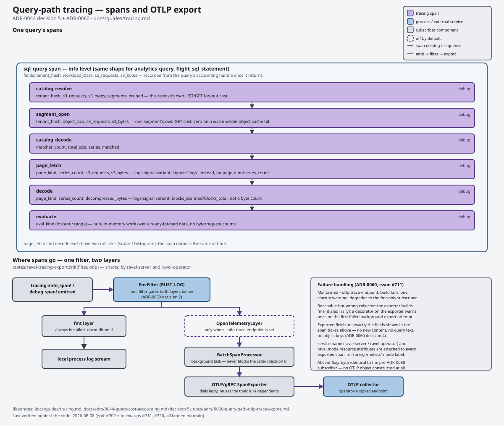

# Query-path tracing

Ravel instruments the read path with `tracing` spans, so you can attribute a
slow query to a phase. Each crate opens a span around the work it owns. Every
span carries the same bounded fields that the `/metrics` label allowlist
permits (a tenant hash and per-span byte and request counts). A span never
carries a query text, a metric name, a label value, or an object key.



## Related guides

Spans answer "where did the time go" for one request.

The [observability guide](observability.md) is the catalog of `GET /metrics`.
Metrics answer "how much" in aggregate across the process: request counts,
byte counts, cache outcomes, error kinds, and the per-query cost estimate
against the actual. Metrics carry no per-request timing.

## The spans

Request-level spans wrap a whole query. They are created at `info` level, so
they appear under the default log filter.

Phase spans wrap one stage of the read path. They are created at `debug`
level, so they are off until you widen the filter (see
[Turn the spans on](#turn-the-spans-on)).

The tables give the `tracing` target of each span. The target is the name on
the log line and the name that a `RUST_LOG` directive matches. To see a span,
name its target.

### Request-level spans (info)

Each transport opens one span for the whole request. When the query finishes,
the span records the query's final store-request and byte counts.

| Span | Opened by | `RUST_LOG` target | Fields |
|---|---|---|---|
| `sql_query` | `POST /api/v1/sql` | `ravel_server` | `tenant_hash`, `workload_class`, `s3_requests`, `s3_bytes` |
| `analytics_query` | the analytics routes | `ravel_server` | `tenant_hash`, `workload_class`, `s3_requests`, `s3_bytes` |
| `flight_sql_statement` | a Flight SQL statement | `ravel_sql` | `tenant_hash`, `workload_class`, `s3_requests`, `s3_bytes` |

`workload_class` is the literal `interactive` on all three, because every
query over these transports is client-driven.

`s3_requests` and `s3_bytes` start empty. The span records them from the
query's accounting handle when the query returns. They are the whole query's
authoritative totals, the same numbers that feed the response body and
`/metrics`.

### Phase spans (debug)

Six span names cover the read-path phases. `page_fetch`, `decode`, and
`evaluate` each have two callsites (a scalar and a histogram variant, an
instant and a range variant). The span name is the same at both.

| Span | Phase it wraps | `RUST_LOG` target | Fields |
|---|---|---|---|
| `catalog_resolve` | resolving one snapshot | `ravel_catalog` | `tenant_hash`, `s3_requests`, `s3_bytes`, `segments_pruned` |
| `segment_open` | opening one segment | `ravel_query` | `tenant_hash`, `object_size`, `s3_requests`, `s3_bytes` |
| `catalog_decode` | decoding a segment's series catalog | `ravel_query` | `matcher_count`, `total_size`, `series_matched` |
| `page_fetch` | fetching sample pages | `ravel_query` | `page_kind`, `series_count`, `s3_requests`, `s3_bytes` |
| `decode` | decompressing those pages | `ravel_query` | `page_kind`, `series_count`, `decompressed_bytes` |
| `evaluate` | evaluating over fetched data | `ravel_query` | `eval_kind` |

Field notes:

- `catalog_resolve` records `s3_requests`, `s3_bytes`, and `segments_pruned`
  as the delta that this resolve added to the query's accounting. They are
  not the whole query's total. A query fetches segments after the resolve on
  the same handle, so the counts on the resolve span are the LIST/GET fan-out
  cost of finding the segments.
- `segment_open` records `object_size` (the segment's size) at open. It
  records `s3_requests`/`s3_bytes` as the GET cost of that one segment.
  Concurrent segment opens do not add to each other's counts.
- `catalog_decode` records `matcher_count` and `total_size` at open. It
  records `series_matched` when the decode finds its matching series.
- `page_fetch` and `decode` carry `page_kind` and `series_count`. On `decode`,
  `page_kind` is `scalar` or `histogram`. On `page_fetch` it can also be
  `mixed`.
- A `mixed` fetch occurs because Ravel fetches the scalar and histogram pages
  of a segment in one batch. When a query selects series of both kinds from
  the same segment (a PromQL or SQL prefetch that needs both), one
  `page_fetch` span covers both. Its `series_count` is the scalar and
  histogram series together. Its `s3_requests`/`s3_bytes` are the GET cost of
  the one batch. Two `decode` spans follow that fetch, one `scalar` and one
  `histogram`.
- `page_fetch` records the GET cost of pulling pages. `decode` records
  `decompressed_bytes`, the uncompressed size that it produced.
- `evaluate` carries `eval_kind` (`instant` or `range`) and no counts. It is
  in-memory evaluation over data that is already fetched, so its cost is
  time.

### Logs spans

The logs read path serves RLOG objects. It reuses the `page_fetch` and
`decode` span names under the same `ravel_query` target, with a different
field set. Both logs spans add `signal = "logs"`. The metric spans carry no
`signal` field. A match on the span name alone returns two shapes:

| Span | Signal | Fields |
|---|---|---|
| `page_fetch` | metric | `page_kind`, `series_count`, `s3_requests`, `s3_bytes` |
| `page_fetch` | logs | `signal = "logs"`, `s3_requests`, `s3_bytes` |
| `decode` | metric | `page_kind`, `series_count`, `decompressed_bytes` |
| `decode` | logs | `signal = "logs"`, `blocks_scanned`, `blocks_total`, `decompressed_bytes` |

- The logs `page_fetch` records `s3_requests`/`s3_bytes` with the same meaning
  as the metric one: the store-GET cost of this call. That is one GET on the
  uncached or cache-miss path and zero on a cache hit.
- The logs `page_fetch` carries no `page_kind` or `series_count`. RLOG has no
  scalar or histogram page kinds, and its unit of identity is the log stream.
- The logs `decode` records `decompressed_bytes` with the same meaning as the
  metric one: the uncompressed size that zstd produced for this object. The
  figure covers the object's directory sections, any POSTINGS probe, and
  every decoded block page.
- The logs `decode` also records `blocks_scanned`/`blocks_total`. They show
  how much of the object's block index the scan had to touch after
  skip-index, POSTINGS, and bloom pruning. `segments_pruned` on
  `catalog_resolve` is the equivalent pruning count on the metric path.

## Turn the spans on

The request-level spans are `info`, so they are visible under the default
filter. `ravel-server` and `ravel-operator` both use an `info` filter when
`RUST_LOG` is unset. The server installs a formatting subscriber on its log
stream.

The phase spans are `debug`, under the `ravel_catalog` and `ravel_query`
targets. To see all six and keep the request-level spans visible, set:

```sh
RUST_LOG=info,ravel_catalog=debug,ravel_query=debug
```

Keep the leading `info`. `EnvFilter` applies its fallback level only when
`RUST_LOG` is unset. When you set `RUST_LOG`, each target that you do not
name drops to the implicit `error` default. That default hides the
`info`-level request spans in `ravel_server` and `ravel_sql`.

`ravel_sql=debug` is not necessary. `flight_sql_statement` is an `info` span,
and `ravel-sql` has no query-path phase span.

## Find the slow phase

To find the phase that owns the time of a slow query, read the phase spans
nested under the request span for that query.

| Reading | Meaning |
|---|---|
| `catalog_resolve` dominates `s3_requests` and `s3_bytes` | The LIST/GET fan-out to find segments is the cost. |
| A large `segments_pruned` next to a small byte count on `catalog_resolve` | The resolve pruned well and the cost is elsewhere. |
| `segment_open` and `page_fetch` dominate `s3_requests` and `s3_bytes` | The query is I/O-bound on segment reads. |
| `decompressed_bytes` on `decode` is large and its store cost is zero | The data was already cached and the cost is CPU decompression. |
| Time in `evaluate` with small fetch counts | The query is evaluation-bound, not store-bound. |

A `segment_open` span records only the GET bytes of its own segment. The
per-segment bytes sum to no more than the query's authoritative total. So
`s3_bytes` on `segment_open` attributes the I/O of one segment, and not of
the whole query.

## OTLP trace export

By default the spans stay on the log stream of the process, where only
someone who can watch its stdout can read them. With export on, the process
also sends the same spans to an OTLP collector. Spans from a fleet of
processes then land in one place and outlive the log buffer of any one
process. The local log stream does not change.

### Turn export on

`ravel-server` and `ravel-operator` each take a `--otlp-trace-endpoint <URL>`
flag, absent by default. To enable export for a process, point the flag at
the OTLP/gRPC endpoint of a collector (for example
`http://otel-collector:4317`). Set the flag on each process that must export.
The two binaries share no configuration file.

Export has no separate verbosity setting. The same `RUST_LOG` filter gates
the log stream and the OTLP layer, so the collector receives what the filter
admits to the log stream. To add phase spans to the exported stream, widen
`RUST_LOG` as in [Turn the spans on](#turn-the-spans-on).

### What gets exported

Export sends the spans and fields in the [span tables](#the-spans) and
nothing more: no query text, no metric or label values, no object keys.
Nothing crosses to the collector that was not already on the `debug`-level
log stream.

Each exported span carries two resource attributes:

- `service.name`: `ravel-server` or `ravel-operator`, the binary that emitted
  the span.
- `ravel.mode`: for `ravel-server`, the same value as the `mode` label on
  `/metrics` (`all`, `gateway`, `query`, or `maintain`), derived from the
  process's `--mode`. `ravel-operator` has no mode selection and always
  reports the fixed literal `operator`.

Together the two attributes distinguish the spans of a fleet in the
collector, the same way that `/metrics` scrapes are distinguished.

### Export failures

Export is best-effort. A down, slow, or unreachable collector drops spans. It
never blocks a query, an ingest write, or a `/metrics` scrape, and it never
returns an error to the caller. A batch processor sits between the spans and
the wire.

Each failure logs a warning that names the failure:

| Failure | When it shows | Signal |
|---|---|---|
| A malformed URL | At startup, when the exporter build fails | One "OTLP trace export disabled" warning. The process continues with the log-only subscriber. |
| A well-formed endpoint that is unreachable or is the wrong collector | The first time the background export task tries to send, because the exporter dials lazily | One distinct warning the first time. The exporter then stays quiet for the life of the process, so a collector that stays down does not flood the log every batch interval. |

## Known gaps

- The `fmt` subscriber that the server installs does not emit per-span
  enter/close lines with wall-clock durations by default. Span fields appear
  as context on events emitted within a span. To read raw phase durations
  from a running process, use a subscriber that emits span-close events. OTLP
  export provides one: a collector receives every span with its duration.

## Background

The bounded field set of every span:
[ADR-0044](../adrs/0044-query-cost-accounting.md) section 5. The OTLP export
surface, its single filter, its content bound and its best-effort guarantee:
[ADR-0060](../adrs/0060-query-path-otlp-trace-export.md), decisions 3, 2, 4
and 6 in that order.
