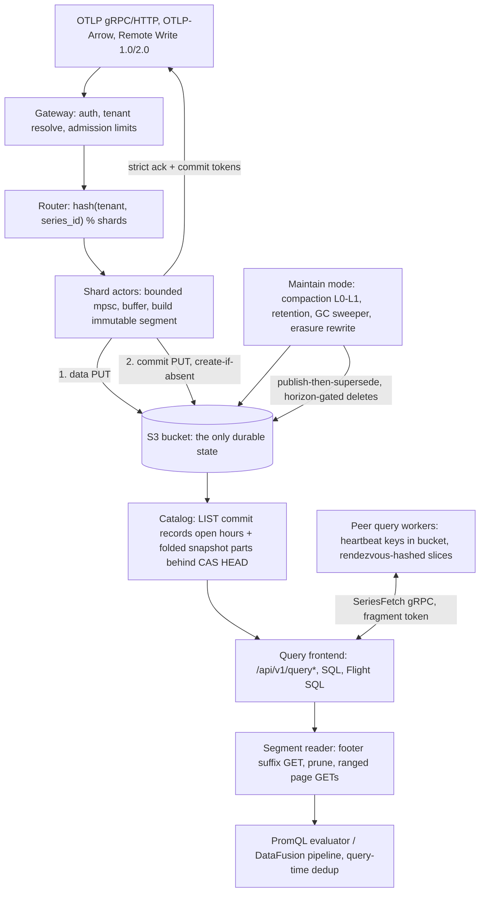

# Ravel Technical Due Diligence: Architecture, Correctness, Security and Production Readiness

## 1. Executive verdict

NOT YET WRITTEN. Filled in last, after evidence and rebuttals.

## 2. Review provenance and methodology

Subject of review: the Ravel repository at commit `527a16db2e4d47b2924e4de4a4db32d7583fda33`, committed 2026-08-22T22:53:40+03:00 (branch `main` at dispatch time, reviewed as a frozen detached checkout). The dispatch clone carries a single squashed commit and no tags, so commit history and release tags were not available as evidence and, per the review charter, were not used to infer maturity.

Environment: Linux 6.8.0-60-generic, 8 cores, 15 GiB RAM, 100 GB free disk. Toolchain: rustc 1.97.1 (2026-07-14), cargo 1.97.1. cargo-nextest present; cargo-deny and cargo-audit not installed at start (installation attempted, see evidence appendix). Docker, MinIO, kind, Kubernetes: probed and unavailable; every check requiring them is marked NOT ASSESSED (environmental).

Scope of the tree: 28 library crates and 4 service binaries (`ravel-server`, `ravel-ingest-router`, `ravel-operator`, `ravel-cli`), 690 Rust source files totaling about 408k lines, 104 ADRs, normative format documents under `docs/`, protobuf definitions under `proto/`, Kubernetes manifests and operator under `deploy/` and `services/ravel-operator`, CI under `.github/workflows/`.

Method: twelve independent specialist investigations (agents A through L, memos in `due-diligence/memos/`), each restricted to its charter section and forbidden from citing another agent's memo as evidence; a second adversarial pass over every Critical/High finding (`due-diligence/rebuttals.md`); build, lint, and targeted test execution on this host (`due-diligence/evidence/commands.md`). Evidence labels used throughout: VERIFIED, STRONGLY SUPPORTED, IMPLEMENTED WEAKLY VERIFIED, DOCUMENTED CLAIM, CONTRADICTED, UNKNOWN, NOT IMPLEMENTED, NOT ASSESSED.

## 3. Architecture in one page

Ravel is a multi-tenant telemetry database (metrics, logs, spans, alert records) whose only durable state is an S3-compatible bucket. Every process (`ravel-server` in `all`, `gateway`, `query`, or `maintain` mode) is disposable: it holds caches and in-flight buffers, never state whose loss changes acknowledged durability. Ingest accepts OTLP (gRPC and HTTP), OTLP-Arrow, and Prometheus Remote Write 1.0/2.0. A gateway authenticates and resolves the tenant, admission-limits the request, and routes points by `hash(tenant, series_id) % shard_count` to single-threaded shard actors with bounded queues. Each actor buffers up to a flush budget (default 2 s), builds an immutable segment (RSEG for metrics, RLOG for logs, RSPAN for spans), and publishes it with a two-object protocol: data PUT, then a commit-record PUT with create-if-absent semantics. In strict mode (default) the client is acknowledged only after the commit PUT succeeds, and receives commit tokens for read-your-write.

Readers discover data through the commit records, never data objects: a query LISTs commit records per shard and ingest hour for the recent window, and reads folded catalog snapshot parts (behind a CAS'd HEAD pointer) for sealed history. A query resolves one pinned snapshot and uses it for its whole execution. Duplicate samples across segments are resolved at query time by a deterministic total order, which is what makes compaction (L0 to L1, publish-then-supersede with a conservation gate) safe to run concurrently with reads: an L0 input and its L1 replacement can both appear in a snapshot and yield the same answer. Deletion is three-phase everywhere: a durable record first (compaction record, retention tombstone, erasure request), logical exclusion from new snapshots second, physical sweeping third, gated by a protection horizon that budgets query duration, grace, and clock skew, all pinned in a durable `sys/gc` config object.

Query surfaces: PromQL (own evaluator, Prometheus HTTP API shape), SQL over DataFusion (cargo feature `sql`), Flight SQL (feature `flight-sql`), an analytics stage, and alert evaluation that stores alert state as ordinary durable records, not process memory. Distributed query is opt-in and cost-gated: workers self-register via heartbeat objects in the bucket, coordinators rendezvous-hash slices to peers, and cross-cluster federation reaches remote clusters only through their public API with separate credentials. A Kubernetes operator (`ravel-operator`) and an ingest affinity router (`ravel-ingest-router`) round out the services.

The load-bearing design choices: object storage is used as the coordination layer (create-if-absent for commit atomicity and compaction races, CAS for catalog HEAD, heartbeat objects for membership); correctness never depends on LIST ordering, only on LIST completeness over bounded windows; event time is never trusted for discovery (commit records bucket by ingest hour, with admission-enforced skew bounds that make listing windows sound); and every optimization (catalog snapshots, indexes, caches, pruning) is constrained to widen, never narrow, the read set, with fail-closed degradation to plain listing.

## 4. The strongest parts of the design

NOT YET WRITTEN.

## 5. Top findings and blockers

NOT YET WRITTEN.

## 6. Production-readiness scorecard

NOT YET WRITTEN.

## 7. Claim Verification Matrix

NOT YET WRITTEN.

## 8. Consistency and durability analysis

NOT YET WRITTEN.

## 9. Catalog, snapshot and commit-token correctness

NOT YET WRITTEN.

## 10. Compaction, retention and GC safety

NOT YET WRITTEN.

## 11. Distributed query and federation

NOT YET WRITTEN.

## 12. Data formats and upgrade compatibility

NOT YET WRITTEN.

## 13. PromQL, SQL, query correctness

NOT YET WRITTEN.

## 14. Rust engineering assessment

NOT YET WRITTEN.

## 15. Security and multi-tenancy threat model

NOT YET WRITTEN.

## 16. Observability-product assessment

NOT YET WRITTEN.

## 17. SRE, operations, Kubernetes review

NOT YET WRITTEN.

## 18. Disaster-recovery assessment

NOT YET WRITTEN.

## 19. Performance and scalability analysis

NOT YET WRITTEN.

## 20. Cloud cost model

NOT YET WRITTEN.

## 21. Verification and test-quality assessment

NOT YET WRITTEN.

## 22. Build, dependency, release and supply-chain assessment

NOT YET WRITTEN.

## 23. Failure and chaos matrix

NOT YET WRITTEN.

## 24. Documentation and implementation drift

NOT YET WRITTEN.

## 25. Competitive architectural context

NOT YET WRITTEN.

## 26. Production adoption recommendation

NOT YET WRITTEN.

## 27. Production-readiness exit criteria

NOT YET WRITTEN.

## 28. Recommended next experiments

NOT YET WRITTEN.

## 29. Final risk register

NOT YET WRITTEN.

## 30. Evidence appendix

NOT YET WRITTEN. See `due-diligence/evidence/commands.md` for the running command log.
