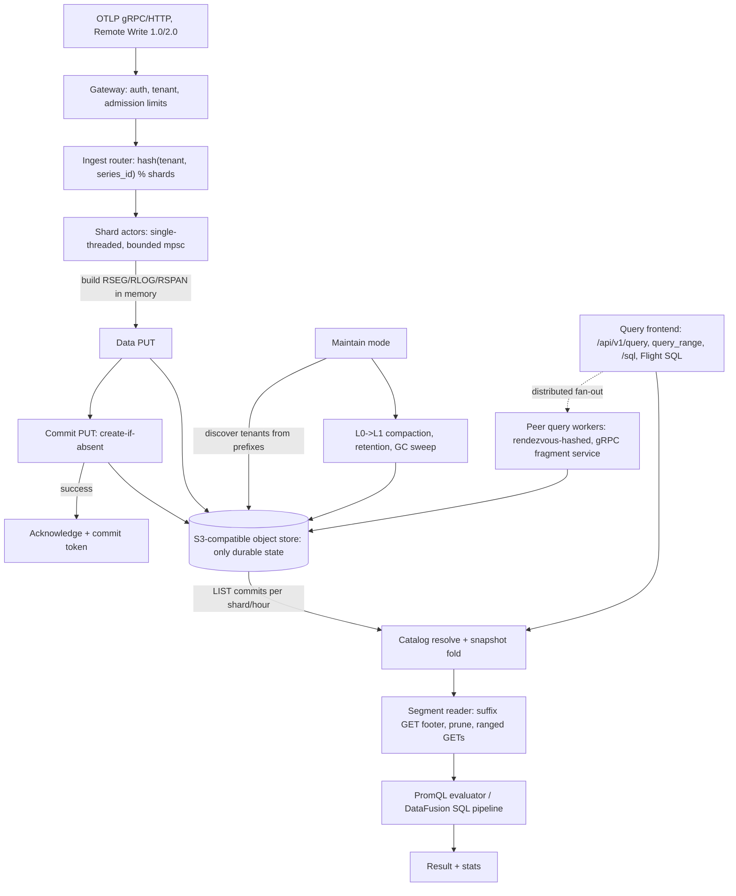

# Ravel Technical Due Diligence: Architecture, Correctness, Security and Production Readiness

> Status: DRAFT IN PROGRESS. Sections fill incrementally; a section marked
> NOT YET WRITTEN has not been completed. A section marked NOT ASSESSED could
> not be examined for the stated reason.

## 1. Executive verdict

NOT YET WRITTEN.

## 2. Review provenance and methodology

### Frozen subject

- Repository: Ravel (this checkout), a multi-tenant telemetry database.
- Branch/dispatch: dispatched from `main`.
- Frozen commit SHA: `527a16db2e4d47b2924e4de4a4db32d7583fda33`.
- Commit timestamp: `2026-08-22T22:53:40+03:00`.
- Tags/releases visible: none (`git tag` empty). No published version state.
- The frozen SHA, not moving `main`, is the subject of this entire report.

### Environment

- Toolchain: rustc 1.97.1 (8bab26f4f 2026-07-14), cargo 1.97.1.
- Host: 4 cores, 7.9 GiB RAM, 404 GiB free disk.
- cargo builds/tests run with `--jobs 2` (8 GB host: default parallelism gets
  the linker OOM-killed).
- Absent tooling: cargo-nextest, cargo-deny, cargo-audit. Docker present but
  daemon unreachable (permission denied).

### Scope of what ran vs what did not

- Static analysis, code reading, `cargo metadata`, `cargo tree`, `cargo fmt
  --check`, `cargo clippy`, and targeted `cargo test -p <crate>` on the
  highest-risk crates: attempted (results in section 21 and the evidence
  appendix).
- MinIO/S3 integration, kind/Kubernetes, container builds requiring the Docker
  daemon: NOT ASSESSED (environmental: no Docker access on host).

### Methodology

Twelve independent specialist investigations (agents A through L) each read
code and tests directly and produced an evidence memo under
`due-diligence/memos/`. A second adversarial pass (`due-diligence/rebuttals.md`)
challenged each Critical/High finding. Every command and its real exit code is
logged in `due-diligence/evidence/commands.md`. Evidence labels follow the
charter taxonomy (VERIFIED, STRONGLY SUPPORTED, IMPLEMENTED/WEAKLY VERIFIED,
DOCUMENTED CLAIM, CONTRADICTED, UNKNOWN, NOT IMPLEMENTED, NOT ASSESSED).

## 3. Architecture in one page

Ravel is an OpenTelemetry-native telemetry database (metrics, logs, traces)
whose only durable backend is S3-compatible object storage. There is no
write-ahead log, no replicated ingest tier, no StatefulSet, and no local disk
in the durability path. The stated bargain: pay object-store latency on the
write path, and in exchange delete the entire stateful ingest tier.

The write path: an OTLP/Remote-Write request hits a gateway that authenticates
the tenant and applies admission limits. An ingest router hashes
`(tenant, series_id) % shards` to a shard actor (single-threaded, bounded
mpsc). The shard buffers samples, builds an immutable columnar segment in
memory (RSEG for metrics, RLOG for logs, RSPAN for traces), PUTs the data
object, then PUTs a commit record with create-if-absent semantics. Only after
the commit PUT succeeds does the server acknowledge, returning an
`x-ravel-commit-token`. That is the durability boundary: acknowledged means the
commit record is on the object store.

The read path: a query frontend resolves a snapshot by LISTing commit records
per shard and hour, folds them into a catalog view, prunes segments via footer
metadata (SERIES_META), issues ranged GETs for needed pages, and evaluates
PromQL or SQL (DataFusion, behind the `sql`/`flight-sql` cargo features).
Passing a commit token as `min_commit_token` guarantees read-your-write without
a listing race. Cross-segment duplicate samples are resolved by a fixed total
order (value bit pattern tiebreak) shared between the PromQL and SQL paths.

Maintenance (`--mode maintain`) is a disposable background worker: it discovers
tenants from storage prefixes (not CLI flags), then runs L0->L1 compaction,
age-based retention, and a GC sweeper per tenant. Optional distributed read
fan-out lets query nodes exchange slices over a cluster-internal gRPC service,
selected by rendezvous hashing over a heartbeat-based worker set stored in the
bucket. Cross-cluster federation reaches remote clusters only through their own
API, each a separate trust domain.

All services are modes of one binary (`ravel-server --mode all|gateway|query|
maintain`), split by crate boundaries so later phases can deploy them
separately.

## 4. The strongest parts of the design

NOT YET WRITTEN.

## 5. Top findings and blockers

NOT YET WRITTEN.

## 6. Production-readiness scorecard

NOT YET WRITTEN.

## 7. Claim Verification Matrix

NOT YET WRITTEN.

## 8. Consistency and durability analysis

NOT YET WRITTEN.

## 9. Catalog, snapshot and commit-token correctness

NOT YET WRITTEN.

## 10. Compaction, retention and GC safety

NOT YET WRITTEN.

## 11. Distributed query and federation

NOT YET WRITTEN.

## 12. Data formats and upgrade compatibility

NOT YET WRITTEN.

## 13. PromQL, SQL, query correctness

NOT YET WRITTEN.

## 14. Rust engineering assessment

NOT YET WRITTEN.

## 15. Security and multi-tenancy threat model

NOT YET WRITTEN.

## 16. Observability-product assessment

NOT YET WRITTEN.

## 17. SRE, operations, Kubernetes review

NOT YET WRITTEN.

## 18. Disaster-recovery assessment

NOT YET WRITTEN.

## 19. Performance and scalability analysis

NOT YET WRITTEN.

## 20. Cloud cost model

NOT YET WRITTEN.

## 21. Verification and test-quality assessment

NOT YET WRITTEN.

## 22. Build, dependency, release and supply-chain assessment

NOT YET WRITTEN.

## 23. Failure and chaos matrix

NOT YET WRITTEN.

## 24. Documentation and implementation drift

NOT YET WRITTEN.

## 25. Competitive architectural context

NOT YET WRITTEN.

## 26. Production adoption recommendation

NOT YET WRITTEN.

## 27. Production-readiness exit criteria

NOT YET WRITTEN.

## 28. Recommended next experiments

NOT YET WRITTEN.

## 29. Final risk register

NOT YET WRITTEN.

## 30. Evidence appendix

NOT YET WRITTEN.
