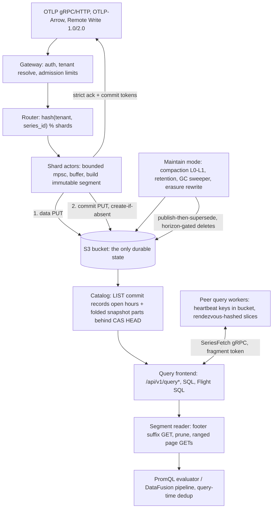

# Ravel Technical Due Diligence: Architecture, Correctness, Security and Production Readiness

## 1. Executive verdict

NOT YET WRITTEN. Filled in last, after evidence and rebuttals.

## 2. Review provenance and methodology

Subject of review: the Ravel repository at commit `527a16db2e4d47b2924e4de4a4db32d7583fda33`, committed 2026-08-22T22:53:40+03:00 (branch `main` at dispatch time, reviewed as a frozen detached checkout). The dispatch clone carries a single squashed commit and no tags, so commit history and release tags were not available as evidence and, per the review charter, were not used to infer maturity.

Environment: Linux 6.8.0-60-generic, 8 cores, 15 GiB RAM, 100 GB free disk. Toolchain: rustc 1.97.1 (2026-07-14), cargo 1.97.1. cargo-nextest present; cargo-deny and cargo-audit not installed at start (installation attempted, see evidence appendix). Docker, MinIO, kind, Kubernetes: probed and unavailable; every check requiring them is marked NOT ASSESSED (environmental).

Scope of the tree: 28 library crates and 4 service binaries (`ravel-server`, `ravel-ingest-router`, `ravel-operator`, `ravel-cli`), 690 Rust source files totaling about 408k lines, 104 ADRs, normative format documents under `docs/`, protobuf definitions under `proto/`, Kubernetes manifests and operator under `deploy/` and `services/ravel-operator`, CI under `.github/workflows/`.

Method: twelve independent specialist investigations (agents A through L, memos in `due-diligence/memos/`), each restricted to its charter section and forbidden from citing another agent's memo as evidence; a second adversarial pass over every Critical/High finding (`due-diligence/rebuttals.md`); build, lint, and targeted test execution on this host (`due-diligence/evidence/commands.md`). Evidence labels used throughout: VERIFIED, STRONGLY SUPPORTED, IMPLEMENTED WEAKLY VERIFIED, DOCUMENTED CLAIM, CONTRADICTED, UNKNOWN, NOT IMPLEMENTED, NOT ASSESSED.

## 3. Architecture in one page

Ravel is a multi-tenant telemetry database (metrics, logs, spans, alert records) whose only durable state is an S3-compatible bucket. Every process (`ravel-server` in `all`, `gateway`, `query`, or `maintain` mode) is disposable: it holds caches and in-flight buffers, never state whose loss changes acknowledged durability. Ingest accepts OTLP (gRPC and HTTP), OTLP-Arrow, and Prometheus Remote Write 1.0/2.0. A gateway authenticates and resolves the tenant, admission-limits the request, and routes points by `hash(tenant, series_id) % shard_count` to single-threaded shard actors with bounded queues. Each actor buffers up to a flush budget (default 2 s), builds an immutable segment (RSEG for metrics, RLOG for logs, RSPAN for spans), and publishes it with a two-object protocol: data PUT, then a commit-record PUT with create-if-absent semantics. In strict mode (default) the client is acknowledged only after the commit PUT succeeds, and receives commit tokens for read-your-write.

Readers discover data through the commit records, never data objects: a query LISTs commit records per shard and ingest hour for the recent window, and reads folded catalog snapshot parts (behind a CAS'd HEAD pointer) for sealed history. A query resolves one pinned snapshot and uses it for its whole execution. Duplicate samples across segments are resolved at query time by a deterministic total order, which is what makes compaction (L0 to L1, publish-then-supersede with a conservation gate) safe to run concurrently with reads: an L0 input and its L1 replacement can both appear in a snapshot and yield the same answer. Deletion is three-phase everywhere: a durable record first (compaction record, retention tombstone, erasure request), logical exclusion from new snapshots second, physical sweeping third, gated by a protection horizon that budgets query duration, grace, and clock skew, all pinned in a durable `sys/gc` config object.

Query surfaces: PromQL (own evaluator, Prometheus HTTP API shape), SQL over DataFusion (cargo feature `sql`), Flight SQL (feature `flight-sql`), an analytics stage, and alert evaluation that stores alert state as ordinary durable records, not process memory. Distributed query is opt-in and cost-gated: workers self-register via heartbeat objects in the bucket, coordinators rendezvous-hash slices to peers, and cross-cluster federation reaches remote clusters only through their public API with separate credentials. A Kubernetes operator (`ravel-operator`) and an ingest affinity router (`ravel-ingest-router`) round out the services.

The load-bearing design choices: object storage is used as the coordination layer (create-if-absent for commit atomicity and compaction races, CAS for catalog HEAD, heartbeat objects for membership); correctness never depends on LIST ordering, only on LIST completeness over bounded windows; event time is never trusted for discovery (commit records bucket by ingest hour, with admission-enforced skew bounds that make listing windows sound); and every optimization (catalog snapshots, indexes, caches, pruning) is constrained to widen, never narrow, the read set, with fail-closed degradation to plain listing.

## 4. The strongest parts of the design

NOT YET WRITTEN.

## 5. Top findings and blockers

NOT YET WRITTEN.

## 6. Production-readiness scorecard

NOT YET WRITTEN.

## 7. Claim Verification Matrix

NOT YET WRITTEN.

## 8. Consistency and durability analysis

NOT YET WRITTEN.

## 9. Catalog, snapshot and commit-token correctness

NOT YET WRITTEN.

## 10. Compaction, retention and GC safety

NOT YET WRITTEN.

## 11. Distributed query and federation

NOT YET WRITTEN.

## 12. Data formats and upgrade compatibility

NOT YET WRITTEN.

## 13. PromQL, SQL, query correctness

NOT YET WRITTEN.

## 14. Rust engineering assessment

NOT YET WRITTEN.

## 15. Security and multi-tenancy threat model

NOT YET WRITTEN.

## 16. Observability-product assessment

NOT YET WRITTEN.

## 17. SRE, operations, Kubernetes review

NOT YET WRITTEN.

## 18. Disaster-recovery assessment

NOT YET WRITTEN.

## 19. Performance and scalability analysis

NOT YET WRITTEN.

## 20. Cloud cost model

NOT YET WRITTEN.

## 21. Verification and test-quality assessment

NOT YET WRITTEN.

## 22. Build, dependency, release and supply-chain assessment

NOT YET WRITTEN.

## 23. Failure and chaos matrix

NOT YET WRITTEN.

## 24. Documentation and implementation drift

NOT YET WRITTEN.

## 25. Competitive architectural context

Ravel's closest architectural relatives are Thanos, Grafana Mimir, Cortex, Loki, and Tempo (object-store-backed observability), VictoriaMetrics (vertically efficient TSDB), and ClickHouse-based stacks (columnar analytics). The comparison that matters is where durability lives and what an operator must run to keep it.

Where Ravel is structurally stronger:

- No stateful ingest tier. Mimir, Cortex, Loki, and Tempo acknowledge writes into a replicated ingester ring (WAL plus local disk, replication factor, StatefulSets, careful rollout ordering, hand-off or flush-on-shutdown procedures). Ravel acknowledges only after the object store has both the data object and the commit record, so the entire class of ingester-loss incidents (WAL corruption, under-replicated hand-off, PVC scheduling deadlocks, zone-loss quorum math) does not exist. This is the single largest operational simplification in the design, and it is real, not cosmetic: the strict-ack path was exercised in this review by test and by code reading (sections 8 and 21).
- No separate metadata service. Thanos needs a compactor singleton and store-gateway sharding over an index cache; Mimir needs a ring for every component plus a compactor. Ravel's catalog is derived entirely from commit-record keys plus a folded snapshot behind a CAS pointer, with every failure mode degrading to wider listing (section 9). There is no consensus system anywhere (no etcd, no memberlist gossip ring), and worker membership for distributed query is heartbeat objects in the same bucket.
- Read-your-write tokens. Neither Thanos nor Mimir gives a client a token that pins its own write into a later query's snapshot. Ravel's commit tokens are a clean answer to the listing-freshness gap every object-store-backed system has.
- One deletion discipline. Compaction supersession, age retention, orphan GC, and GDPR erasure all follow durable-record-first, exclude-second, sweep-third with one shared protection horizon stored in the bucket (`sys/gc`), where Thanos and Mimir spread deletion safety across component flags that can drift per process.

Where Ravel pays for it:

- Write-path latency and small-object economics. Every shard flush is at least two PUTs (data plus commit). Mimir's ingesters absorb millions of samples per second into memory and write large blocks every two hours; Ravel writes objects every flush interval (default 2 s budget) per active (tenant, signal, shard). At low volume per shard this makes many small objects, which is why L0-L1 compaction and the request cost model (section 20) matter so much more here than in block-per-2h designs. The economics are workable but must be actively managed with shard counts and flush budgets (section 19, 20).
- Ingest tail latency is object-store tail latency. Strict mode cannot answer faster than a PUT round trip. Systems with a local-WAL ack point will always beat it on p99 ack latency; Ravel's counter-offer (buffered mode) gives up the durability claim explicitly.
- Query cold path is LIST plus many GETs. Thanos/Mimir store-gateways hold downloaded index headers on local disk; Ravel resolves snapshots per query (mitigated by folded snapshots, caches, and budgets). The absence of a downsampled tier (acknowledged in the README) makes wide-range queries read every raw hour, where Thanos has 5m/1h downsampling.
- Maturity and ecosystem. The alternatives have years of production hardening, operational folklore, and integration surface (Loki's LogQL, Tempo's TraceQL, Mimir's Alertmanager integration). Ravel's product surfaces are younger and thinner (section 16), and there is no migration tooling of comparable depth.

Against ClickHouse-based observability stacks: Ravel trades ClickHouse's raw scan speed and mature SQL for zero stateful nodes and exact PromQL semantics. A ClickHouse stack needs disk management, replication, and its own ingestion pipeline; it will out-scan Ravel on large analytical queries. Ravel's SQL surface (DataFusion over RSEG/RLOG) is credible for observability queries but is not competing with a mature OLAP engine on breadth or optimizer sophistication.

The honest summary: Ravel occupies a point in the design space (object store as the only stateful component, strict remote-durability ack, exact-by-default semantics) that no mature system occupies. Thanos and Mimir moved durability to object storage for sealed blocks but kept a stateful ingest edge; Ravel removes the edge and pays in request economics and ack latency. Whether that trade wins depends almost entirely on workload shape and object-store pricing, which is why the cost model in section 20 is load-bearing for adoption decisions.

## 26. Production adoption recommendation

NOT YET WRITTEN.

## 27. Production-readiness exit criteria

NOT YET WRITTEN.

## 28. Recommended next experiments

NOT YET WRITTEN.

## 29. Final risk register

NOT YET WRITTEN.

## 30. Evidence appendix

NOT YET WRITTEN. See `due-diligence/evidence/commands.md` for the running command log.
