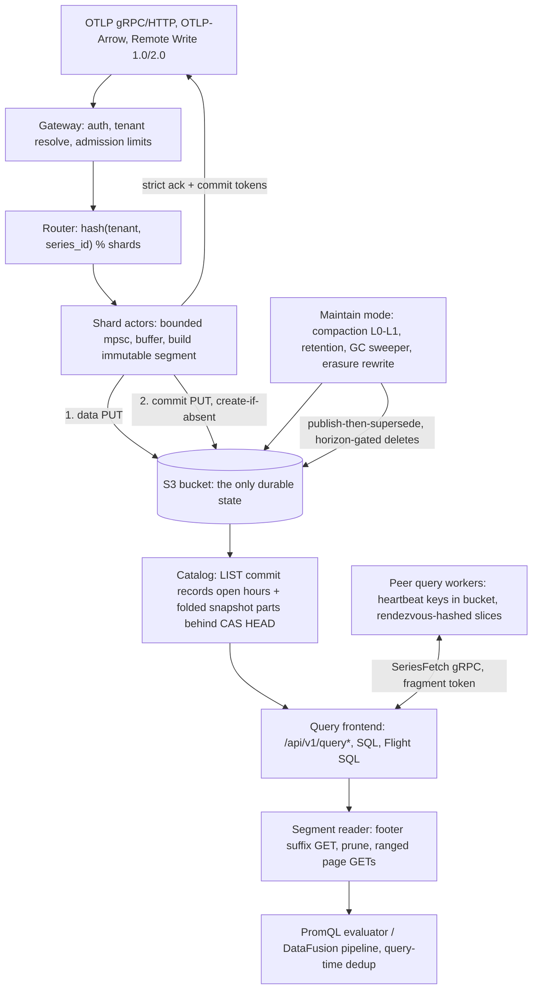

# Ravel Technical Due Diligence: Architecture, Correctness, Security and Production Readiness

## 1. Executive verdict

NOT YET WRITTEN. Filled in last, after evidence and rebuttals.

## 2. Review provenance and methodology

Subject of review: the Ravel repository at commit `527a16db2e4d47b2924e4de4a4db32d7583fda33`, committed 2026-08-22T22:53:40+03:00 (branch `main` at dispatch time, reviewed as a frozen detached checkout). The dispatch clone carries a single squashed commit and no tags, so commit history and release tags were not available as evidence and, per the review charter, were not used to infer maturity.

Environment: Linux 6.8.0-60-generic, 8 cores, 15 GiB RAM, 100 GB free disk. Toolchain: rustc 1.97.1 (2026-07-14), cargo 1.97.1. cargo-nextest present; cargo-deny and cargo-audit not installed at start (installation attempted, see evidence appendix). Docker, MinIO, kind, Kubernetes: probed and unavailable; every check requiring them is marked NOT ASSESSED (environmental).

Scope of the tree: 28 library crates and 4 service binaries (`ravel-server`, `ravel-ingest-router`, `ravel-operator`, `ravel-cli`), 690 Rust source files totaling about 408k lines, 104 ADRs, normative format documents under `docs/`, protobuf definitions under `proto/`, Kubernetes manifests and operator under `deploy/` and `services/ravel-operator`, CI under `.github/workflows/`.

Method: twelve independent specialist investigations (agents A through L, memos in `due-diligence/memos/`), each restricted to its charter section and forbidden from citing another agent's memo as evidence; a second adversarial pass over every Critical/High finding (`due-diligence/rebuttals.md`); build, lint, and targeted test execution on this host (`due-diligence/evidence/commands.md`). Evidence labels used throughout: VERIFIED, STRONGLY SUPPORTED, IMPLEMENTED WEAKLY VERIFIED, DOCUMENTED CLAIM, CONTRADICTED, UNKNOWN, NOT IMPLEMENTED, NOT ASSESSED.

## 3. Architecture in one page

Ravel is a multi-tenant telemetry database (metrics, logs, spans, alert records) whose only durable state is an S3-compatible bucket. Every process (`ravel-server` in `all`, `gateway`, `query`, or `maintain` mode) is disposable: it holds caches and in-flight buffers, never state whose loss changes acknowledged durability. Ingest accepts OTLP (gRPC and HTTP), OTLP-Arrow, and Prometheus Remote Write 1.0/2.0. A gateway authenticates and resolves the tenant, admission-limits the request, and routes points by `hash(tenant, series_id) % shard_count` to single-threaded shard actors with bounded queues. Each actor buffers up to a flush budget (default 2 s), builds an immutable segment (RSEG for metrics, RLOG for logs, RSPAN for spans), and publishes it with a two-object protocol: data PUT, then a commit-record PUT with create-if-absent semantics. In strict mode (default) the client is acknowledged only after the commit PUT succeeds, and receives commit tokens for read-your-write.

Readers discover data through the commit records, never data objects: a query LISTs commit records per shard and ingest hour for the recent window, and reads folded catalog snapshot parts (behind a CAS'd HEAD pointer) for sealed history. A query resolves one pinned snapshot and uses it for its whole execution. Duplicate samples across segments are resolved at query time by a deterministic total order, which is what makes compaction (L0 to L1, publish-then-supersede with a conservation gate) safe to run concurrently with reads: an L0 input and its L1 replacement can both appear in a snapshot and yield the same answer. Deletion is three-phase everywhere: a durable record first (compaction record, retention tombstone, erasure request), logical exclusion from new snapshots second, physical sweeping third, gated by a protection horizon that budgets query duration, grace, and clock skew, all pinned in a durable `sys/gc` config object.

Query surfaces: PromQL (own evaluator, Prometheus HTTP API shape), SQL over DataFusion (cargo feature `sql`), Flight SQL (feature `flight-sql`), an analytics stage, and alert evaluation that stores alert state as ordinary durable records, not process memory. Distributed query is opt-in and cost-gated: workers self-register via heartbeat objects in the bucket, coordinators rendezvous-hash slices to peers, and cross-cluster federation reaches remote clusters only through their public API with separate credentials. A Kubernetes operator (`ravel-operator`) and an ingest affinity router (`ravel-ingest-router`) round out the services.



The load-bearing design choices: object storage is used as the coordination layer (create-if-absent for commit atomicity and compaction races, CAS for catalog HEAD, heartbeat objects for membership); correctness never depends on LIST ordering, only on LIST completeness over bounded windows; event time is never trusted for discovery (commit records bucket by ingest hour, with admission-enforced skew bounds that make listing windows sound); and every optimization (catalog snapshots, indexes, caches, pruning) is constrained to widen, never narrow, the read set, with fail-closed degradation to plain listing.

## 4. The strongest parts of the design

These are merits established by code and executed tests, not by documentation volume.

1. The acknowledgement point is honest, and everything downstream is built to keep it honest. The strict ack fires only after two conditional PUTs (content-addressed data object, create-if-absent commit record), identity is pinned before the first byte leaves the process, retries are idempotent by construction, and a same-key-different-content collision is a fatal SplitBrain rather than a silent overwrite. Two investigators independently reconstructed the same state machine from code, and the ambiguous cases (applied-but-response-lost on both PUTs) are exercised by fault-injection tests that assert the fault fired. Most systems document a durability story; this one made the ambiguous-response cases unit-testable.

2. Overlap harmlessness as the compaction safety argument. Compaction never dedups; queries always dedup under one deterministic total order (last-writer by (created_unix_ns, epoch, seq, page index), then value bit pattern). Therefore any snapshot containing an L0 input, its L1 replacement, or both yields identical results, and compaction needs no locks, no fencing, and no reader coordination. The correctness burden moves to one place (the dedup order), which is shared bit-for-bit across PromQL, SQL, and the distributed protocol (which ships per-sample provenance on the wire specifically to preserve it). This is a genuinely elegant load-bearing invariant, in the engineering sense: it converts a family of race conditions into one testable function.

3. Deletion is uniformly three-phase with a durable, deployment-wide horizon contract. Every deletion family (compaction supersession, age retention, orphan GC, GDPR erasure, idempotency markers) writes a durable record first, excludes logically second, sweeps physically third. The protection horizon is not a per-process flag: it lives in a CAS'd `sys/gc` object, is validated at write time, and is re-asserted at maintain startup against the running sweeper's own clock-skew declaration, so a skew-uncovered horizon can neither be written nor run against. The fail-closed asymmetries are consistently in the safe direction (an unreadable catalog HEAD blocks retention; an absent one proceeds).

4. Optimizations are constrained to widen, never narrow. Catalog snapshots, the metric-name index, pruning, and caches all follow one rule: a failure or staleness anywhere degrades to more listing and more reading, never to missing data. The one place this rule is violated (the fold's bounded reconcile window interacting with the superseded-input sweep, finding R2) is visible precisely because the rest of the system holds the rule.

5. Event time is never trusted for discovery. Commit records bucket by ingest hour; admission enforces skew bounds (+10 m future, -2 h lag) that are exactly what make the catalog's listing window sound; a broken receiver clock fails loudly (compiled floor, 503) rather than acking data into an unreachable bucket. The coupling between the admission bound and the listing window, the classic silent-loss trap in event-time systems, is documented as a paired-config discipline and asserted at startup where copies exist.

6. Verification culture matches the ambition. The consistency document opens with "tests in tests/failure/ assert every claim here" and this is largely true: a crash matrix as executable tests, a FaultStore that injects by operation kind and occurrence with asserted counters, MemoryStore as a semantics oracle with pagination stress, golden-byte suites per format, mutation fuzzing, a PromQL differential suite against a real pinned Prometheus binary (executed in this review: 91/91), an SQL differential against an independent oracle, and a seeded whole-system simulation checking durability/visibility/conservation invariants per cycle. The conformance tables in the docs are generated from the differential runs, so the documented compatibility gaps are measured, not claimed.

7. Multi-tenancy and admission are structural, not bolted on. Tenant identity flows from a durable hash-scheme marker; object keys, catalogs, caches, admission, and metrics are all tenant-hash-scoped; per-tenant SSE-KMS and legal holds exist; and the admission layering (body cap, byte-rate bucket, structural caps, series caps) is ordered before expensive work. (Depth of the security review is in section 15.)

What keeps these merits from summing to "production ready" is not their quality but their youth: single-version formats pre-release, thin store qualification against non-AWS backends, the fold-window defect family, and the operational surface a section-17/22 reader will find still maturing.

## 5. Top findings and blockers

NOT YET WRITTEN.

## 6. Production-readiness scorecard

NOT YET WRITTEN.

## 7. Claim Verification Matrix

NOT YET WRITTEN.

## 8. Consistency and durability analysis

Finding first: the strict-acknowledgement claim ("after a strict ack, no crash of any Ravel process may lose that data") is VERIFIED as a claim about Ravel processes, conditional on the object store honoring conditional PUT, strong read-after-write, and strong complete LIST. Two independent investigators (memos A and B) reconstructed the protocol from code without consulting each other and reached the same state machine, and the failure-injection suites exercise the ambiguous cases rather than only the happy path. The claim's boundary is equally clear: it does not cover bucket loss, lifecycle misconfiguration, credential compromise, or a lying backend, and the code and docs say so rather than blur it.

The commit protocol, from code (crates/ravel-commit/src/publish.rs, crates/ravel-ingest/src/shard.rs): a flush pins its full identity (writer UUID, epoch, sequence, ingest hour, content hash) before the first PUT. The data object PUT is create-if-absent at a key embedding that identity plus a blake3-derived hash; AlreadyExists is success because only a prior attempt of the same pinned flush can have created the key. The commit record PUT is create-if-absent at a key fully derived from the record's identity; on AlreadyExists the writer GETs the existing record and compares content hashes: equal is idempotent success, different is a fatal SplitBrain that panics the shard actor rather than picking a side (publish.rs:71-187, shard.rs:758-767). The ack (with commit token) fires only after the commit PUT resolves; every failure path nacks (shard.rs:529-588).

Commit-protocol state machine (condensed from memo B; full table in due-diligence/memos/agent-b.md):

| State | Event | Externally observable result |
|---|---|---|
| Nothing stored | crash | no ack; client retries; bucket unchanged |
| Data PUT ambiguous (applied, ack lost) | retry | AlreadyExists treated as success; exactly one data object |
| Data PUT exhausted | abandon | nack; applied bytes become an invisible orphan, GC'd after ~25 h |
| Data exists, commit absent, crash | crash | invisible forever; GC after grace; client retry duplicates |
| Commit PUT applied, response lost | retry | AlreadyExists + equal content hash = idempotent success, one record |
| Commit AlreadyExists, different hash | split brain | fatal, shard actor dies loudly; no silent overwrite |
| Commit durable, ack lost | client retry | both copies durable; metrics dedup at query; logs/spans visibly duplicated unless idempotency key used |
| After ack | any process crash | data queryable; strict-ack holds |
| Commit present, data unavailable | query | typed SnapshotInvalidated after one re-resolve; wrong data never served |

Idempotency and duplicates: delivery is at-least-once and the docs refuse to claim exactly-once. Metrics collapse at query time under a deterministic total order; logs and spans get user-visible duplicates on retry-after-lost-ack, narrowed by an opt-in idempotency key whose marker is written after commit and before ack, and deliberately not written on multi-shard partial commits because a marker there would make the retry skip the shard that never committed (a correct, subtle decision: honest duplication over silent loss). VERIFIED against crates/ravel-ingest/src/log_error.rs:78-112 and the failure tests in crates/ravel-failure-tests (ack_and_duplicates.rs, retry_and_restart.rs, crash_matrix.rs), which this review executed: 20/20 passed.

What strict-ack does not mean, and where the honest residuals sit:

- Acknowledged-durable is not verified-stored. No upload checksum reaches the wire (an object_store 0.14 API gap) and there is no post-PUT ETag comparison, so bytes corrupted between the local CRC32C pre-flight and S3 storage are acked and discovered only at read time, as a typed error, never as wrong data (s3.rs:45-59, 497-514). P2; the read-side checksum hierarchy plus the scrub tooling make this loss-not-corruption, but an ack is a weaker receipt than it appears.
- Ravel's own orphan GC is the sharpest knife pointed at acknowledged data: an out-of-band loss of commit records (lifecycle rule, prefix delete, persistent backend LIST omission) makes acked data objects look like orphans, and after ~25 h the sweeper deletes them permanently. The mass-orphan circuit breaker only trips at >= 50 candidates AND > 10% of the shard, so small or thinly spread loss is silently destroyed. The project itself calls this the most dangerous flaw in its durability posture (ADR-0058) and ships partial mitigations (breaker, batched re-verify, reconstruction CLI). P1; see the rebuttal record for the challenge and resolution.
- Buffered mode loses its bounded window on crash, by contract, with no token issued. This is a visible opt-in trade, not a caveat buried in docs.

Consistency model as implemented: per-(writer, shard) commit sequencing, no cross-shard ordering, read-your-write via commit tokens whose keys are reconstructed from the token itself (never through listing or snapshots, so tokens survive resharding and folds), and bounded-staleness listing snapshots for token-less reads. Event time is never trusted for discovery; admission bounds skew (default +10 m future, -2 h lag), which is exactly what makes the catalog's listing window sound. The one genuinely irreducible clock dependency on the write side is the ingest-hour bucketing, and even a bad clock fails loudly (a compiled floor rejects nonsense buckets with 503 rather than acking data into an unreachable hour).

Verdict for this section: durability engineering is the strongest part of the system. The design distinguishes durability, visibility, idempotency, and availability with unusual discipline, the failure matrix in docs/consistency-model.md matches the code and is executable (and was executed) as tests, and the remaining risks are either external-to-Ravel (bucket-level threats, addressed as DR posture) or explicitly acknowledged residuals with named mitigations.

## 9. Catalog, snapshot and commit-token correctness

Finding first: snapshot resolution is correct for the open (recent) window and for token reads, and every catalog index failure mode degrades to wider listing rather than to missing data, with one significant exception. The fold's reconcile machinery has a 26-hour window anchored on the target hour, and a compaction or rewrite record published more than 26 hours behind the fold watermark is never applied to the folded snapshot. That stale snapshot then keeps naming L0 objects that the superseded-input sweep (which has no HEAD-reachability gate, unlike retention) physically deletes about 25 hours later. Result: persistent, unalarmed SnapshotInvalidated 503s for every non-token query touching those hours. This is the most important single defect found in the review (P1, availability and visibility, not data loss: the L1 replacement parts hold every sample). It is not hypothetical sequencing: the stale state is pinned as expected behavior by an in-tree test (crates/ravel-catalog/src/fold.rs:3507-3557, `reconcile_ignores_late_record_outside_window`), and the triggering operations are ordinary (first enablement of `--mode maintain` on a bucket with history, a maintain outage longer than about a day, a compaction catch-up campaign). Full mechanics in memo C (CE1) and the rebuttal record.

How discovery works when healthy: readers LIST commit records per (shard, ingest hour) for the window above the fold watermark, and read immutable snapshot parts behind a CAS'd HEAD pointer for sealed history below it. The fold is a cost optimization with a soundness rule: HEAD/part read failures, corrupt parts, stale cached HEADs, racing folders on the CAS all degrade to Phase-1 listing (crates/ravel-catalog/src/snapshot_resolve.rs), and a snapshot entry whose object was retired resolves NotFound -> SnapshotInvalidated -> one re-resolve. The soundness rule holds everywhere except the reconcile-window case above, where the degradation path is not taken because the snapshot still serves entries it believes are live.

Commit tokens are the strongest correctness primitive in the read path: a token fully determines its commit-record key, resolution GETs that exact key (with separate NotFound and transient retry budgets), falls back through compaction-input and rewrite-effective-input chains, resolves tombstoned buckets as deliberately-retired (zero segments, not an error), and otherwise fails with a typed unsatisfiable-token error rather than silently serving stale data (catalog.rs:1900-2150). Tokens survive resharding by construction (resolution never consults shard_count) and are unaffected by the fold defect above. VERIFIED by code and by the executed test suites (ravel-catalog: part of the 975-test core batch, all passing).

Snapshot isolation: one snapshot per query, pinned for the query's lifetime; mid-query commits, compactions, and deletions do not affect it; the GC protection horizon (durably pinned in `sys/gc`, enforced at write time and re-asserted at maintain startup against the running sweeper's own clock-skew config) is what makes the pin safe without any store-side lease. The two-fence design (you cannot write a skew-uncovered horizon, and a sweeper with a larger skew config than the written one refuses to start) is careful engineering: memo C attempted a pinned-reader-vs-sweeper counterexample and failed within declared parameters (CE7).

Other residuals, all bounded and mostly documented: a writer clock more than `clock_skew_allowance` (5 m) ahead near an hour boundary publishes into a bucket the reader's listing window does not yet reach (self-healing staleness); a folder clock past `fold_safety_margin` can seal an hour early, making a late commit invisible to token-less queries until an operator HEAD rebuild (documented exception, detect-only scrub exists); resolve attaches erasure predicates via one unconditional `del/` LIST per resolve (correctness-critical and always on). Late L0 commits into an already-folded hour are skipped by reconcile deliberately (L0-only buckets are not diffed), which is sound exactly as long as the seal-margin arithmetic and writer abandonment interlock hold; that assumption is declared, tested at the margin arithmetic, and violated only by clock mis-declaration (CE4, P3).

## 10. Compaction, retention and GC safety

Finding first: no counterexample was found that destroys durable, acknowledged data through compaction, retention, or GC, across eleven attempted races (memo C). The deletion discipline (durable record first, logical exclusion second, horizon-gated physical sweep third; every delete idempotent; every sweep restartable from zero) is applied uniformly across all four deletion families, and the dangerous decisions are conservative in the right direction: fail-closed on unreadable state, re-verify immediately before delete, alarm-and-stop on divergence. Three real defects were found, all in the completeness/lifecycle direction rather than the destroy-live-data direction.

What holds (each attempted and defended, evidence in memo C):

- Compaction is publish-then-supersede with a pre-publish sample-count conservation gate: outputs must conserve the exact input sample count or the run aborts and publishes nothing, leaving inputs live. Compaction never dedups (dedup is query-time), which is what makes overlap harmless: a snapshot seeing both an L0 input and its L1 replacement returns identical results. Racing compactors converge via create-if-absent (the loser verifies the winner's input-set hash, repairs missing parts, and stands down; divergent input sets alarm and delete nothing).
- Orphan GC requires an identity to be absent from two strongly consistent LISTs (initial plus one fresh batched re-verify), an age gate behind the writer-abandonment interlock (writers never publish a flush older than max_flush_lifetime; GC's gate is grace + max_flush_lifetime, ~25 h vs minutes of transport lifetime), and the mass-orphan circuit breaker in front of an all-or-nothing delete.
- Retention is tombstone-first, horizon-gated, with an ADR-0020 HEAD-reachability gate: a bucket still named by the live catalog snapshot is never physically swept (present-but-unreadable HEAD blocks fail-closed; absent HEAD proceeds, correctly, since no snapshot names anything). Deletion order is fixed and ends with a verifying LIST before the tombstone itself is removed.
- A pinned reader cannot lose its inputs to any horizon-gated rule within declared parameters (the sys/gc two-fence design, section 9).

The three defects:

1. P1: the superseded-input sweep has no HEAD-reachability gate, and combined with the fold's bounded reconcile window it deletes L0 objects a stale folded snapshot still names (the section 9 finding; the delete is legal, the snapshot is wrong, the outcome is persistent 503s on affected hours). The asymmetry is glaring precisely because retention got the gate after what docs/consistency-model.md calls "the shipped failure", and rule 2 never did. The fix shape exists in-tree.
2. P2 (CONTRADICTED doc claim): retention never completes on a bucket that went through a selective-erasure rewrite. Expiry reads only commit and compaction records, never rewrite records (crates/ravel-maintain/src/retention.rs:410-424), so a rewrite-only bucket never expires; and physical_sweep never deletes rewrite record keys (retention.rs:616-619), so an already-tombstoned bucket ends in permanent SweptPartial with the pass re-running every tick. Over-retention and unbounded re-work on exactly the buckets subject to GDPR erasure; contradicts docs/consistency-model.md:438 ("everything in a tombstoned bucket") and ADR-0019's R + horizon bound. No test covers the rewrite-record-in-retention combination.
3. P1 (erasure-specific, half-acknowledged in ADR-0064): the erasure completion gate verifies through a live listing, not through the folded snapshot, so `.done` (and later the `.dreq` predicate sweep) can land while an out-of-window folded snapshot still serves pre-rewrite inputs. If the `.dreq` is swept first, erased-subject records become servable again until the superseded-input sweep removes the inputs; if the sweep goes first, the hours degrade to the persistent-503 state. For a system advertising DSAR erasure with bounded deadlines, a window where erased data is served again is a compliance defect even though it is not data loss.

Structural answers to the charter's standing questions: GC failure is a cost leak, not a correctness risk (everything is conservative; the one exception is the orphan-GC/commit-record-loss interaction, which is a durability finding, section 8). Compaction can fall behind ingestion, and the consequence is bounded and typed (the 25k per-query S3 request budget binds on hot open hours; queries 422 rather than degrade silently), but catch-up compaction over a deep backlog is exactly the operation that triggers defect 1, which turns "compaction fell behind" from a cost problem into an availability incident. The compaction hierarchy is single-level per (shard, hour) with no cross-hour L2 (named as future work in ADR-0018); long-retention large tenants will eventually be bounded by one-part-per-(shard, hour) read amplification, a scaling boundary rather than a defect.

## 11. Distributed query and federation

Finding first: distributed query is correct by construction where it matters most (the merged result is bit-identical to a local execution over hostile bit patterns), fail-closed on every failure mode tested, and cost-gated so a distributed query cannot cost more than a bounded local one without tripping a typed budget. The design reuses the exact local dedup merge on the coordinator rather than reimplementing it, which is what lets the bit-identity claim be a proptest rather than a hope. No correctness defect was found in this surface (memo D); the residual risks are availability trade-offs and one documented mirrored-ingest nondeterminism.

The bit-for-bit claim, STRONGLY SUPPORTED: `distributed_merge_equals_local_bitwise` is a proptest (16 cases per run) over arbitrary u64 value bit patterns including NaN payloads and -0.0, across 1-7 segments over up to 8 shards, with slice caps sized so the cap actually binds, run against a real tonic loopback worker and asserting bit-identical merged series plus equal accounting and FetchStats (crates/ravel-query/src/distrib/tests.rs:356-481). The mechanism behind it is that the coordinator calls the same `merge_soa_runs` the local path uses (made `pub(crate)` for exactly this reason, engine.rs:2245-2249), and protocol v3 ships the four packed per-sample provenance columns and raw f64 bit patterns on the wire (ADR-0096) so the dedup total order survives serialization. The reviewed hazard where a wire frame drops the per-sample column and flips a dedup winner is pinned as a test fixture (`dedup_tiebreak_chain_survives_the_wire`). The one honest caveat: the proptest drives a single worker process, so multi-worker bit-identity is asserted compositionally (loopback proptest plus server-level e2e with mock workers), not by a single many-real-worker differential. WEAKLY VERIFIED for the multi-worker case specifically.

The failure matrix is fail-closed, each row backed by a test (services/ravel-server/tests/distributed_query_e2e.rs and crates/ravel-query/src/distrib): worker loss re-dispatches once, then runs the slice coordinator-local, then fails typed; partial frames from a failed attempt are discarded whole (slice atomicity means no dedup bookkeeping is needed for a partial worker response); a worker that sends a second summary frame is rejected with a typed `MultipleSummaries` error so it cannot double-merge; protocol version skew falls back to whole-query local execution, never a partial merge; a corrupt frame is terminal with no retry; cancellation is drop-based and frees fragment permits; and many invalidated slices collapse to a single snapshot re-resolve retry. The pattern throughout is that the distributed path degrades to local execution or a typed error, never to a silently partial or reordered result.

Budgets survive an adversarial worker: the coordinator re-enforces distinct-series (scalar and histogram separately) and bytes-scanned over a saturating fold of worker-reported spend, so a lying or wrapping worker cannot slip under a cap, and spend is folded before every failure or fallback path so a fallback rerun reports both costs (crates/ravel-query/src/distrib/mod.rs:233-374, tests `coordinator_reenforces_*` and `coordinator_fold_saturates_*`). Aggregation pushdown (ADR-0103) is wire-reachable but no coordinator enables it (`partial_aggregate: None`); only count is wired, deliberately, because min/max would diverge between `total_cmp` and PromQL-IEEE ordering. This is a case of the project declining to ship an optimization until its semantics are exact, consistent with the exact-by-default posture.

Federation, the cross-cluster surface, VERIFIED as documented with the security trust boundary confirmed in section 15: `skip_unavailable` defaults to false, so a federated query fails typed rather than returning a silent partial by default; when opted in, stats carry `partial: true` and redacted warnings, budget overruns are never skippable, and the alert evaluator treats a Partial result as a failed evaluation and leaves alert state untouched (so a partial federated read cannot flap an alert). The trust boundary holds: a remote cluster resolves the tenant from its own presented credential and overwrites the wire `tenant_hash`, and the intra-cluster fragment token is rejected by remotes (`federation_rejects_the_fragment_token`), so a compromised coordinator cannot name an arbitrary tenant on a federation partner.

Two residuals, both bounded. First, the disjoint-series-identity assumption: cross-cluster series identity is a pure function of labels, so discovery union is well-defined even for mirrored ingest, but a duplicate `(series_id, ts)` with different values across two clusters resolves to a deterministic but not-meaningfully-ordered winner (engine.rs:2112-2129, documented in three places). An operator running mirrored ingest who missed the disjointness assumption gets value-level nondeterminism across topology changes. DOCUMENTED CLAIM, consistent with code; P3. Second, partial federated results are invisible to an HTTP client that ignores the Prometheus `warnings` array, because the JSON envelope has no machine-readable partiality field. This is a limit inherited from the Prometheus API shape, mitigated by the fail-closed default and by a `#[must_use] Coverage` type that stops internal callers from dropping it silently; P3. Slow workers are not hedged, so a straggler is bounded only by the deadline (P3, availability, not correctness).

Verdict: this is the second-strongest surface in the system after durability. The correctness burden was concentrated into the shared dedup merge and then defended with a proptest over hostile bit patterns and a fail-closed failure matrix, and the cross-cluster trust boundary is handled correctly. The gaps are availability tuning (no hedging, single re-dispatch) and one documented nondeterminism under a deployment shape the docs advise against, none of which rise above P3.

## 12. Data formats and upgrade compatibility

Finding first: the durable formats (RSEG for metrics, RLOG for logs, RSPAN for spans, protobuf commit/catalog records) are engineered to a high standard for corruption safety, and to a deliberately low standard, pre-release, for version compatibility. The project's own policy (ADR-0027) is a single supported version per format until first public release: RSEG v6 read support was deleted in the same change that shipped v7, there is no v6-to-v7 migration path, and a reader fails closed with a typed `UnsupportedVersion` on any other version (crates/ravel-segment/src/reader.rs:88, 158-161). ADR-0066 supersedes this at first release with an N/N-1 reader window and a decode-and-re-encode migration primitive, but at the frozen commit that policy is declared, not active. Consequence for adopters: an upgrade that bumps a format version makes existing objects unreadable (the accepted disposition is wipe or re-ingest), and a rolling deployment across a format bump has no overlap window. This is a coherent pre-1.0 stance, stated plainly in the ADRs and CHANGELOG, but it is a hard production-readiness gate: no deployment holding data anyone cares about should cross a format-bump upgrade until the ADR-0066 window ships.

Corruption safety is where the format engineering earns credit:

- Checksum hierarchy: whole-object blake3 recorded in the commit record, footer and per-section CRC32C verified on read, structural validation with checked arithmetic on every section range (validate_sections_v7 enforces mandatory kinds, exclusive section pairs, ranges within the page region, and uncompressed-length limits before any section byte is fetched: reader.rs:138-163).
- Reader limits bound decompression before allocation (ReaderLimits with uncompressed-size caps; a dedicated test pins the uncompressed page size cap: crates/ravel-segment/tests/uncompressed_page_size_cap.rs).
- Hostile-input testing exists and runs: golden-byte suites pin the exact on-disk layouts (golden_bytes_v7.rs for RSEG, golden_bytes_v3.rs for RLOG, golden_bytes_v4.rs for RSPAN, plus a Remote Write golden), mutation-fuzz suites (fuzz_mutation in ravel-segment and ravel-otap) assert corrupt inputs produce typed errors rather than panics or wrong data, and structural-validator negative tests cover the malformed-footer space. This review executed them: 10/10 and 5/5 fuzz-mutation tests passed, and the corrupt-input tests in ravel-failure-tests (corruption.rs) passed.
- Version numbers are reserved forever and never reused (format.rs:8-12), and unknown versions fail typed, so a mixed-version accident is loud, not silent.

Two compatibility observations. First, the format version numbers have moved fast (RSEG at v7, RLOG at v3, RSPAN at v4 per the golden suites, against normative docs describing v1 baselines with amendment layers), which is fine under the single-version policy but means the frozen-contract discipline (docs/segment-format.md rewritten as self-contained v7) is doing real work; the golden suites are what keep the docs honest. Second, the protobuf surfaces (proto/ravel) follow additive-field discipline with unknown-field tolerance, and the queryfrag distributed protocol carries an explicit protocol version (bumped to 3 for per-sample dedup provenance, with refusal semantics for mismatched peers), so intra-fleet mixed-binary operation within one format generation is designed for; it is the cross-format-generation case that is deliberately unsupported pre-release.

Verdict: corruption behavior VERIFIED (tests executed); upgrade compatibility across format bumps NOT IMPLEMENTED at this commit, by documented policy, with a credible successor policy (ADR-0066) not yet in force. Adoption decisions should treat every format bump before first release as a data-migration event.

## 13. PromQL, SQL, query correctness

Finding first: the float query path is in strong shape and the native-histogram path has a systemic silent-wrong-data hole that the passing differential run structurally cannot see. This split is the single most important nuance in the query assessment, because the headline evidence (a 91/91 differential against a real pinned Prometheus, executed in this review) is true and yet does not cover the defect. For a tenant that ingests OTLP native histograms, ordinary queries return zeros or empty with HTTP 200 and no warning (memo D).

The float path, VERIFIED: the query-time dedup total order (`(created_unix_ns, writer_epoch, writer_seq, in_page_index)` then `value.to_bits()`, greatest wins) is one contract with three implementations that are tested to agree bit-for-bit. PromQL's k-way merge (crates/ravel-query/src/engine.rs:2130-2132), the SQL `RsegDedupExec` tuple comparison (crates/ravel-sql/src/dedup.rs:43-45), and the distributed coordinator (which reuses the exact local merge and ships four packed per-sample provenance columns on the wire, ADR-0096) are gated by an independent greatest-wins oracle, a proptest over hostile bit patterns (NaN payloads, -0.0, denormals, duplicate timestamps), and a proptest that the distributed merge is bit-identical to local. The compaction-safety keystone (query-over-inputs equals query-over-L1 bit-for-bit) is a proptest driving the real compactor against an in-test oracle (crates/ravel-query/tests/differential_compaction.rs). Pruning is widen-only by construction with an adversarial test against a never-pruning reference (crates/ravel-sql/tests/differential.rs:327-390). Budgets are typed, re-enforced at the coordinator over a saturating fold of worker-reported spend so a lying or wrapping worker cannot slip under a cap, and partial coverage is surfaced in a `#[must_use]` type so an internal caller cannot silently drop it. This is the part of the query engine that earns the "exact by default" claim.

The histogram path, the two P0s and their P1 siblings (all CONTRADICTED against the conformance table's "supported" classification, or IMPLEMENTED-as-float-only-silently):

1. P0: binary operators silently treat native-histogram operands as float 0.0. A histogram vector element carries `value: 0.0` with `histogram: Some` by construction (the constructor comment says the value field "is not meaningful", crates/ravel-promql/src/eval.rs:91-137); the binop evaluator never inspects the `histogram` field and combines `s.value`/`l.value`/`r.value`, emitting `histogram: None` (crates/ravel-promql/src/binop.rs:139-190). So `h * 2` and `h + h` return a float vector of zeros, and `rate(h[5m]) / rate(g[5m])` returns 0.0/0.0 = NaN, all HTTP 200. This is a gap, not a decision: unary minus handles the histogram case explicitly, and the subquery path guards this exact hazard with a typed `Unsupported: subquery over native histograms` when matched histogram data is present (eval.rs:940-960). Binop has no such guard.

2. P0: a range query with a top-level aggregate or binary over native histograms returns a matrix of zeros. `sum(rate(h[5m]))` via `/api/v1/query_range` re-evaluates per grid step (histograms alive through the instant path) and then `eval_instant_over_grid` keeps only `s.value`, materializing a matrix of 0.0s (crates/ravel-promql/src/eval.rs:704-711, functions/mod.rs:558-602). An SRE graphing this in Grafana gets a flat zero line and makes capacity decisions on it, while Prometheus on the same data returns the histogram matrix.

3. P1: bare `h`, `rate/increase/delta(h[..])`, and the entire over_time family return empty for native-histogram series in range evaluation, because each is a float-only reducer that never calls the histogram read path (eval.rs:1009-1069; functions/mod.rs:340-445; functions/over_time.rs:29-70). `absent_over_time(h[15m])` affirmatively returns 1 (absent) while histogram data flows, which turns a liveness alert into a permanent false positive. Prometheus 3.x includes histograms in all of these.

The one guarded escape is the canonical Grafana pattern `histogram_quantile(0.99, sum(rate(h[5m])))`, which works because that call re-runs on the instant path per step. That makes the surviving gaps more deceptive: the dashboard query an operator is most likely to try first works, suggesting histograms are fully supported.

Why the 91/91 run is green and honest anyway: the differential harness is strict (`f64::to_bits` equality, -0.0 bit-significant, warnings and errors compared as independent channels) and genuinely end-to-end (real ingest through `IngestRouter` over MemoryStore, served by the real HTTP router, compared against a spawned Prometheus 3.13.1 fed by remote write). But its 218-entry corpus has no entry that applies a binary operator to a histogram, runs a bare histogram selector or `rate(h[..])` as a range query, or applies an over_time function to a histogram (the only `kind: range` histogram entries wrap in `histogram_quantile`/`fraction`, exactly the guarded escape). The conformance table is regenerated from a live run and cannot be hand-inflated, but its unit of classification is the construct, not the (construct, input-type) pair, so "binary expression: supported, 28 entries" coexists with P0 #1. The table honestly reports what it measures; it does not measure the histogram-input case.

SQL and Flight SQL, VERIFIED as documented with one undocumented exclusion: the `samples` table exposes only a scalar value column and silently excludes native-histogram samples (P2, crates/ravel-sql/src/schema.rs:64-71), with no statement of the exclusion in docs/sql-conformance.md, so `SELECT count(*) FROM samples` understates ingest volume on a mixed tenant. Otherwise the SQL lane is sound: an independent-oracle differential with proptest over hostile payloads, a memory accountant that detect-and-aborts rather than silently spilling (ADR-0102 disables the disk manager and makes spill a typed error), Flight SQL tickets that are MAC-keyed, deadline-bounded, and pin the exact snapshot including `pending_erasure` so `DoGet` executes what `get_flight_info` planned, and an HTTP-vs-Flight parity differential. The metrics SQL distributed lane is wired; the logs/spans/alerts/audit SQL scans are provider-tested but not wired into a running server, stated plainly in the doc.

Coordinator memory is bounded by matched input, not by a default-on budget (P2, disclosed): `max_samples` counts post-dedup yield, the byte budget defaults to Unlimited, and every matched series is fully decoded before the merge-time series cap trips, so a pathological matcher can spike coordinator memory before any typed error fires. This is the same default-Unlimited scanned-bytes gap flagged in the security section, seen from the query side: DoS-shaped, not wrong-results.

Doc drift found and reported (not fixed, per repo policy): docs/query-engine.md self-contradicts on budget scoping (the Flow section matches the code that enforces `max_series`/`max_samples` once over the pooled union; the Budgets section still says per-selector), and it claims the SQL scans do not read `pending_erasure` when all five providers now do. Both are stale-doc, safe-direction. A regex-class semantic difference (Rust `regex` Unicode perl classes vs Go RE2 ASCII) can select different series for non-ASCII label values and is untested (P3, UNKNOWN).

Verdict: the float path is production-grade and the test culture behind it (independent oracles, proptests over hostile bit patterns, a real-Prometheus differential) is the strongest in the query engine. The native-histogram path is not production-safe for any tenant that relies on it: two P0 silent-wrong-data defects and a family of P1 silent-omission defects, mispresented as "supported" by a conformance table that cannot see the input-type axis. Native histograms are a headline OTLP feature, so this is a shipping-blocker for histogram-bearing workloads even though the float majority of the surface is sound.

## 14. Rust engineering assessment

Finding first: the memory-safety and panic-hygiene posture is strong and matches its own documentation, with one exploitable gap on the query surface. `unsafe_code = "forbid"` holds workspace-wide with zero overrides (Cargo.toml:18 sets it at `[workspace.lints.rust]`; a grep for `allow(unsafe_code` across all crates and services returns nothing, and there are no `unsafe` blocks anywhere). The clippy `unwrap_used`/`expect_used = "warn"` gate holds under `-D warnings`: all 293 `#[allow(...)]` overrides in `src/` trees sit on `#[cfg(test)]` modules or test items, so no test-only allow reaches a production path. Hostile-input parsers cap decompression before allocation on every codec. Channels are all bounded (no `unbounded_channel` in production). The error taxonomy is principled (`StoreError::is_retryable`, `WriteError::is_retryable` with documented 429-vs-503 gateway mapping). This is memo E, VERIFIED by grep and by the chair's clean workspace clippy run.

The one material gap is a denial-of-service vector on the PromQL surface (P1, STRONGLY SUPPORTED, not executed). The PromQL AST is parsed, type-checked, evaluated, and dropped entirely by recursion, with no query-length cap and no recursion-depth guard anywhere on the path (crates/ravel-promql/src/eval.rs:747-757 recurses on `Paren`/`Unary`/`Binary` with no depth counter; the only budgets present bound evaluation width, not AST depth). A `POST /api/v1/query` body up to the 1 MiB cap (crates/ravel-query/src/http/handlers.rs:31) of nested parens or unary operators builds an AST whose depth is proportional to body length; parse, `check_ast`, `eval_expr`, and the `Drop` of the nested boxes each recurse over it. The evaluation runs synchronously on the tokio worker (engine.rs:448-457), so a stack overflow aborts the whole query process with SIGABRT, which the surrounding `tokio::time::timeout` cannot interrupt and `catch_unwind` cannot catch. The blast radius is every concurrent tenant's in-flight query on that shared process. The fix is small (cap query byte length well below 1 MiB, or add an explicit depth check before evaluation, or evaluate on a guarded stack); the exposure is the gap between a 1 MiB accepted body and an unguarded recursive evaluator.

Supporting positives, each VERIFIED at file:line in memo E:

- Decompression is capped before allocation on all five hostile codecs: remote-write snappy reads `decompress_len` and rejects over cap before the `vec!` (crates/ravel-remote-write/src/snappy.rs:27-32), segment sections check `uncompressed_len` against a 1 GiB section / 64 MiB page limit and re-check the decoded length against the claim (crates/ravel-segment/src/reader.rs:402-443), logseg pages and rspan blocks do the same, and OTAP bounds the zstd decoder with `Read::take(cap+1)` so an absent content-size header cannot force growth (crates/ravel-otap/src/stream.rs:224-235). Each has a proptest or fuzz-mutation corpus behind it, executed in this review (section 12).
- Body and message limits sit ahead of work: OTLP HTTP 16 MiB body with a token-free compressed pre-check, gRPC 16 MiB decode cap, and a process-wide in-flight ingest semaphore checked before tenant resolution.
- The 29 reachable `panic!`/`unreachable!` in production are invariant guards (PromQL dispatch arms the parser's own type check cannot produce; the fail-loud split-brain and semaphore-closed guards in the shard actor), not hostile-input paths; there are zero `todo!`/`unimplemented!` workspace-wide.
- Async correctness: no mutex is held across `.await` in production, shard channels are bounded mpsc with backpressure through the awaited send, and the flush deadline races an injected `Clock::sleep` rather than the real timer, which is what keeps the failure tests deterministic.

Two more findings sit below the P1. There is no supervisor or restart for shard actors (P2, VERIFIED): they are spawned once at router construction (crates/ravel-ingest/src/router.rs:104-129) and never respawned, so an actor-loop panic ends that actor and every series hashing to it returns `ShardUnavailable` until the process restarts. This is graceful degradation of 1/N of a tenant's ingest, observable via a `shard_deaths` counter, not a silent outage, but recovery is process restart only. And OTLP nested-attribute conversion recurses over decoded `AnyValue` trees with no in-crate depth cap (P2, WEAKLY VERIFIED, crates/ravel-otlp/src/logs_normalize.rs:391-423): it is safe today only because prost caps decode nesting at 100, an undocumented coupling that would become a second stack-overflow vector if that limit is ever lifted. Two P3s (blocking `std::fs` on the tokio runtime in the opt-in disk cache tier; `catch_unwind` guards that assume the default unwind panic strategy) round out the list.

Verdict: the Rust engineering is disciplined and the safety invariants the project advertises are real and enforced. The PromQL recursion-depth gap is the one place the "bound hostile input before work" discipline that holds everywhere on the ingest path is missing on the query path, and it is a shared-process DoS rather than a memory-safety break.

## 15. Security and multi-tenancy threat model

Finding first: no cross-tenant read/write path and no remote-compromise path was found (no P0). The isolation model holds by construction rather than by convention: tenant identity is a keyed BLAKE3 hash pinned per bucket, every object key, cache key, catalog path, and idempotency marker is tenant-hash-scoped, and each of the three cross-process trust boundaries (Flight SQL tickets, distributed-fragment capabilities, cross-cluster federation) authenticates with a keyed MAC or a re-resolved credential, cross-checked against the wire tenant in constant time. The real weaknesses are misconfiguration-exposure gaps and a plaintext-by-default network posture, not breaks in the model. Full threat table in due-diligence/memos/agent-f.md; condensed here.

| Threat | Surface | Existing mitigation | Weakness | Severity | Recommendation |
|---|---|---|---|---|---|
| Tenant A reads tenant B | object keys, catalog, cache | keyed BLAKE3 tenant hash pinned per bucket; all keys and cache entries tenant-scoped | none found | none | keep |
| Compromised coordinator names arbitrary tenant | fragment SeriesFetch | per-query keyed-MAC capability over {tenant, signal, query, expiry}, constant-time compare, wire tenant must equal claims | replay within TTL on a plaintext listener | P3 | TLS fragment listener in production |
| Federation partner reads arbitrary tenant | Resolve scope | remote re-resolves tenant from the presented credential and overwrites the wire tenant_hash; fragment tokens rejected | none found | none | keep |
| JWT algorithm confusion / alg:none | OIDC resolver | algorithm pinned from the JWKS key, never the token header; symmetric keys refused; exp/iss required; audience enforced; plaintext non-loopback JWKS refused at startup | trust rooted in operator's TLS to IdP | none | keep |
| Tenant spoof via dev header | --dev-insecure-tenant-header | loopback guard on --listen-http | guard omits --listen-grpc; the header-trusting resolver serves gRPC ingest, so a publicly bound gRPC listener allows unauthenticated tenant spoofing while startup succeeds (config.rs:2058) | P2 | extend the guard to listen_grpc |
| mTLS header forgery | x-ravel-client-cert-cn | MtlsResolver structurally isolated to the dedicated listener; collisions with public listeners refuse startup | trust still depends on the fronting proxy stripping the header | P2 | network-policy enforcement documented |
| Forgotten TLS proxy | public HTTP/gRPC listeners | none in process | bearer tokens and telemetry cleartext on the wire; nothing fails closed | P2 | in-process TLS option or explicit startup acknowledgment flag |
| Decompression bomb | OTLP gzip, RW snappy, OTAP zstd | caps enforced before allocation (take(cap+1); snappy decompress_len pre-check) | none found | none | keep |
| Series/cardinality explosion | ingest | active-series cap plus creation-rate token bucket; structural per-request caps | caps are per-process, multiply by replicas (documented) | P3 | fleet-level accounting eventually |
| Unbounded query scan | PromQL/SQL | concurrency ceilings, 25k S3-request budget, SQL read-only single-statement | max_bytes_scanned defaults Unlimited (config.rs:2699) | P3 | ship a finite default |
| Tenant enumeration via /metrics | unauthenticated /metrics | tenant labels fold to "other" by default; per-tenant labels opt-in | the opt-in discloses tenant_hash and traffic on an unauthenticated route | P3 | keep opt-in, document the trade |
| Secrets exposure | S3 credentials | file > env > argv precedence, Debug impls redacted | --s3-secret-key still accepted on argv | P3 | drop argv path |

Authentication depth (VERIFIED by memo F at file:line, with regression tests named): static bearer tokens are stored and compared only as keyed hashes (no per-byte timing channel); the JWT path has regression tests for RSA algorithm confusion, string-typed exp claims (a named CVE regression), symmetric-JWKS rejection, wrong issuer, and unknown-key tokens; Flight SQL tickets are MAC'd with a domain-separated derived key and verified constant-time before parse, with client deadlines clamped; fragment capabilities support key rotation and label every reject reason with a counter.

Resource exhaustion: the admission layering claim (body cap, then byte-rate bucket, then structural and series caps, all before expensive work) is VERIFIED at the ingest surfaces: body limits at 16 MiB on both transports, decompression bounded before allocation on all three codecs, structural caps before normalization. On the query side the bounded quantities are requests and concurrency, not bytes, until the operator sets max_bytes_scanned; the default-Unlimited scanned-bytes cap is the one place the "limits before expensive work" discipline ships disarmed.

Posture summary for an adopting security architect: the cryptographic and isolation engineering is above the bar for a system at this maturity, including in the places that are usually weak (internal fragment auth, federation credential handling). What is below the bar is fail-closed network posture: three P2s share the shape "the code is safe if the operator deploys the documented topology, and silently unsafe if not". These are cheap to fix (extend one guard, refuse or warn on missing TLS assumptions) relative to their blast radius.

## 16. Observability-product assessment

Finding first: Ravel is a credible Prometheus-compatible long-term metrics store for float metrics and classic histograms, with the strongest interoperability evidence discipline seen in this review (a bit-exact differential gate against a pinned real Prometheus 3.13.1, conformance tables regenerated from live runs). It is not yet a unified observability product: native-histogram querying silently lies outside a short list of blessed patterns (the section 13 P0 family, reproduced empirically by memo G against the real evaluator), logs and traces are durable storage plus SQL rather than finished products, and alerting is architecturally sound but operationally immature. The signals separate cleanly, so this section assesses them separately.

Metrics (floats and classic histograms): production-shaped. The Prometheus HTTP API surface covers query, query_range, labels, label values, series, metadata, buildinfo, and query_exemplars, and a plain Grafana `type: prometheus` datasource works (deploy/grafana/provisioning/datasources/ravel.yaml; ADR-0039 records a real-Grafana Save & Test acceptance). Classic OTLP histograms and summaries explode to Prometheus-convention series per ADR-0016, and `histogram_quantile` over classic buckets matches the pinned Prometheus including the subtle annotation cases (missing +Inf bucket, forced monotonicity). Staleness markers are honored end to end. Remote Write 1.0 and 2.0 are received with correct content negotiation, status mapping, RW2 written-stats headers, and body caps ahead of allocation. The function registry covers the stable Prometheus surface (69 functions); the missing ones are experimental or new in Prometheus and are classified as such in the conformance table. Missing API endpoints: /api/v1/rules, /api/v1/alerts, format_query, parse_query, status/tsdb, POST /api/v1/labels. Counter-reset handling is value-decrease based, equivalent to Prometheus without the created-timestamp feature (OTLP start_time_unix_nano is not read anywhere in normalization).

Metrics (native histograms): ingest and storage are real (OTLP exponential histograms and RW2 native histograms materialize field-for-field, with delta temporality rejected typed), and the blessed query patterns (histogram_quantile, histogram_fraction, histogram_count/_sum/_avg, instant-only rate/sum/avg) are differentially verified bit-exact. Everything else on the query surface silently fabricates or drops data; the mechanics and severity are section 13's P0/P1 family and rebuttal records R4/R5. As a product matter, native histograms should be labeled beta with the blessed forms enumerated, because the query an operator tries first (the canonical Grafana quantile pattern) works, which invites the wrong generalization.

Two OTLP semantic-fidelity gaps below the histogram family. Instrumentation scope is ignored in metric series identity (a documented simplification, crates/ravel-otlp/src/normalize.rs:38-40), so two scopes emitting the same metric name and attributes in one tenant collapse to one series and same-timestamp samples deduplicate to one winner silently; Prometheus's own OTLP path keeps them distinct via otel_scope_* labels, and target_info is also absent (P2). Delta temporality is rejected typed rather than converted, a correct decision for stateless compute, but it means delta-configured SDKs need a collector with deltatocumulative in front (documented, real ecosystem friction).

Logs: durable, compacted, retained, erasable, and queryable through SQL (a `logs` table with severity, both timestamps, trace/span correlation IDs, typed attribute columns per ADR-0090/0093, `has_word` with postings acceleration) and Flight SQL. There is no LogQL, no Loki API, and no live tail (verified by grep over crates and services), so for a Grafana user the logs experience is a SQL client, not a Logs panel. Structured OTLP log bodies (kvlist/array) are rejected typed rather than stringified (crates/ravel-otlp/src/logs_normalize.rs:332-350), an honest but real fidelity gap: mainstream OTel pipelines emit structured bodies routinely, and those records are refused, visible only in partial-success counters.

Traces: OTLP trace ingest and durable RSPAN storage with skip indexes, duration/status pruning, and service/span-name blooms are real, and spans are SQL-queryable with pushdown. What does not exist: any trace-by-id HTTP API, trace search API, service discovery endpoint, TraceQL, or Jaeger/Tempo compatibility surface (grep over docs and code found none). The project's own correlation guide tells users to point Grafana's exemplar link at an external tracing datasource, so the exemplar-to-trace click terminates outside the product. This is trace storage plus a query language, not a tracing backend (P2). Exemplars themselves are well handled: stored in the RSEG exemplar section, capped at admission, copied through compaction, and served on a Prometheus-shaped query_exemplars endpoint with trace_id/span_id labels.

Alerting: the engine design is sound and matches the system's durability posture: one generic rule shape covering PromQL threshold rules and SQL detection rules, a pure state machine whose state is derived by folding durable alert records (never in-memory timers, so a restarted evaluator resumes exactly), per-tenant object-store leases bounding duplicate evaluation, and Alertmanager v2 plus generic webhook sinks with credential redaction. Delivery is at-least-once and documented as such. The operational shape is the problem: rules come from one static JSON file loaded at startup, changing a rule means editing a file and restarting, there is no rules API, no Prometheus rule-YAML compatibility, no /api/v1/rules for Grafana to display, and recording rules are explicitly deferred (ADR-0043). Combined with the absent downsampled tier, there is no way to amortize long-range query cost into precomputed series (P2). Section 17 adds the operational half of this finding: the alert pipeline exports no metrics, so its own failure is silent.

Product-manager assessment (charter section 29). Who should adopt today: platform teams wanting a Prometheus-API-compatible, S3-only, strictly-tenanted metrics store for float metrics and classic histograms, with Grafana dashboards, exemplars, and webhook/Alertmanager alerting; teams that value the commit-token read-your-write contract and per-tenant cost accounting; security and audit teams that want SQL over logs, spans, and alert history as evidence. Who should not: shops standardized on native histograms; Loki/Tempo users expecting log-panel and trace-view UX; delta-temporality OTLP senders without a collector; anyone needing recording rules, dynamic alert management, or downsampled multi-year dashboards. The strongest differentiated value is that the durability contract is user-visible, not an implementation property: ack-means-S3-durable plus commit-token read-your-writes is a testable product promise, and disposable compute genuinely removes the stateful-tier operations that dominate Mimir/Loki/Tempo operation.

Interoperability and migration: Prometheus can remote-write into Ravel today; bulk log import exists (ADR-0089); there is no TSDB-block or OTLP-file backfill importer for metrics history. Migration out is SQL and Flight SQL over open, in-repo-specified, Apache-2.0 formats, so lock-in is low by open-format standards, but no tool emits Prometheus TSDB blocks or OTLP back out. Cost attribution is a genuine product strength: per-query S3 request and byte accounting is threaded explicitly through catalog, segment, and log fetchers and surfaced in query stats and workload-class metrics (ADR-0044/0061/0076), so an operator can explain a bill to request-class granularity per tenant, which none of the comparison systems do natively. Tenant control plane: static token pairs or OIDC; static tokens do not scale past tens of tenants, OIDC does; alert rules, sinks, and several caps are restart-bound configuration, while typed attribute columns already have the better pattern (a durable override cache with CLI management, ADR-0079) the rest should follow.

Maturity split, as the charter requires: architecture maturity high; metrics feature completeness high for floats and classic histograms and defective for native histograms; logs and traces feature completeness medium-low as products; operational maturity medium (operator, guides, cost model exist; configuration is restart-bound); ecosystem maturity low outside the Prometheus datasource. Label as beta or experimental: native-histogram querying beyond the blessed forms, trace querying, alerting configuration management, OTAP ingest (already feature-gated), distributed federation (already off by default).

## 17. SRE, operations, Kubernetes review

Finding first: the process-level operational engineering is mature and honest (correct liveness/readiness separation with hysteresis, fail-closed startup gates, drained shutdown with tests, a leased multi-worker maintenance protocol whose stalls are exported as metrics, runbooks that document their own blind spots), and an experienced operator could own the process-level failure modes from the operations guide alone. The material gaps are day-2 and platform-level: the alerting pipeline is the one correctness-relevant background mechanism with no metrics, so its own failure is silent (P1); there is no supported rolling upgrade or rollback across a data-format bump (P1, the section 12 policy seen from the operator's chair); and the Kubernetes operator cannot express most of the production flag surface and renders none of the standard disruption or scheduling hardening. Evidence detail in memo H.

What holds, with evidence. Liveness and readiness are separated correctly: `/healthz` is stateless, `/readyz` latches startup and then reflects background store reachability with asymmetric hysteresis (four consecutive probe failures to go unready, one success to recover; the threshold is a deliberate constant so an operator cannot reintroduce single-blip mass ejection), exported as `ravel_store_reachable` so a metrics-only setup sees the outage, and liveness is deliberately independent so a store outage cannot trigger a restart storm (services/ravel-server/src/health.rs:53-114, store_probe.rs:50-143, with in-tree tests). Shutdown drains and joins every ingest shard actor before stopping background tasks, with drain tests per pipeline; the drain has no internal deadline, so termination is bounded by the flush retry budget and the Kubernetes grace period, and no rendered grace period is sized to it (see the hardening gap below). Startup is fail-closed on every durable-contract precondition before any listener binds: the store qualification gate (no fresh-bucket bypass, and all three bootstrap paths run it), tenant-hash scheme pinning, shard-count provisioning validation, GC-config validation, retention floors, alert rules and JWKS validation. Config knobs that parse but do not enforce are warned about loudly by name, which is exactly the "looks configured, is actually inert" discipline operators need. One honest weakness: `--require-bucket-protection` can only fail closed on states no real backend reports through the store abstraction, so in practice it is advisory plus a gauge; the module docs disclose this, but the flag name promises more than production backends deliver (P3).

Maintenance is the best-observed part of the platform: leased distributed maintenance (ADR-0065) with per-process heartbeats, rendezvous partition of work units, per-unit stall tracking, and exported gauges for live workers, owned units, and stalled units, each with a documented alert rule. Tenant discovery failure skips the cycle and increments a counter rather than being misread as "no tenants". The GC mass-orphan circuit breaker has a trip counter, withheld/present gauges, and a runbook that documents the breaker's own floor and ratio blind spots and that it is not self-clearing. The at-rest scrubber exports counters and a cursor gauge. Two background mechanisms fall below this bar: the catalog fold logs failures but exports no metric family and no watermark-age gauge, so a silently stopped fold degrades query cost toward the documented 10,000-commit listing wall with no signal (P2); and the alerting engine tracks rule-evaluation, history-read, lease, and sink failures only in an in-memory report logged at warn, with zero `ravel_alert_*` names in the exhaustive metric inventory (memo H, grep over the single metrics renderer). A wedged alert pipeline, the mechanism operators use to notice everything else, is detectable only by log inspection or by the silence of expected pages (P1). The concrete scenario: a per-tier credential rotation error makes one tenant's alert history prefix unreadable; every tick logs and skips; `/readyz` stays green because the store probe reads a different key; notifications simply stop, and the first signal is a missed page during the next real incident.

Kubernetes: the operator is a competent, idempotent renderer of a deliberately narrow surface, with CEL validation on the CRD (shard immutability, cross-field guards) unit-tested without an API server, server-side apply with owner references, Degraded status on failure, secret handling that keeps values out of Pod specs (though argv exposure is admitted in the docs), and per-tier secret-checksum annotations that roll exactly the consuming tiers. Live-cluster behavior is NOT ASSESSED (kind and kubectl unavailable on this host; all operator claims are from code and its API-server-free tests). The gaps: no PodDisruptionBudget, pod anti-affinity, topology spread, securityContext, or terminationGracePeriodSeconds is rendered anywhere (grep over the renderer), so a routine node drain can evict every replica of a tier at once (P2); and the CRD has no field or passthrough for admission limits, alert rules or sinks, query budgets, cache configuration, store-probe interval, distributed query, OIDC/mTLS, per-tenant KMS routing, or metrics tenant labels, and no extraArgs escape hatch, so an operator-managed cluster runs shipped defaults for admission control and cannot use alerting at all (P2). The operator's ClusterRole grants `secrets: get` cluster-wide without resourceNames scoping (P3). RBAC for the data plane is otherwise least-privilege with per-rule rationale, and the shipped IAM policies grant delete only to the Maintain role over four prefixes with an explicit DenyDeleteProtected on every role including Admin (verified by parsing all four policies).

Upgrades: within a format version, rolling upgrades are well supported: all three tiers roll with RollingUpdate, mixed old/new maintain workers are safe under the ADR-0065 ownership protocol, protobuf field numbers are frozen, and the catalog fold refuses to CAS-overwrite a newer-format HEAD, closing the mixed-version clobber hazard. Across a format bump, the posture is the section 12 pre-release policy: readers accept exactly one RSEG version, the v6 reader was deleted in the change that shipped v7, and rollback after new-format objects exist leaves the old binary failing typed on them. The migration machinery for real production upgrades (readers-before-writers runbook, `maintain migrate` with durable cursor and verify-then-raise-floor semantics, per-tenant format floors, the re-encode primitive) exists but has never carried a live bump. Operationally this means every format-bump release is a non-rollbackable maintenance event until the ADR-0066 N/N-1 window ships, and an adopter should snapshot the bucket (Tier 1 versioning) before each one.

Runbooks and observability hygiene: the metrics label allowlist is a closed enum enforced at compile time, tenant identity appears only as a fixed-width hash behind an opt-in flag, `/metrics` reads atomics only, and logs use tenant hashes rather than names. Default alert rules exist as PromQL-with-rationale tables in the operations guide, but nothing ships machine-readable: no PrometheusRule YAML anywhere under deploy/, and the sole Grafana dashboard is a 28-line demo panel over ingested OTel data, not a Ravel operations dashboard (P3). Three instances of operator-misdirecting doc drift were found and are recorded in section 24 (the Kubernetes guide contradicts shipped readiness and maintain-rollout behavior; the operations guide names a metric that does not exist).

## 18. Disaster-recovery assessment

Finding first: disaster recovery is a defined, honest, entirely operator-owned posture with real reconciliation tooling, and it has never been rehearsed. There is no in-product backup, export, or failover. The default deployment tier makes bucket loss total loss, and the documentation says so plainly rather than implying otherwise. The project refuses to publish RPO/RTO numbers it has not measured, which is the right discipline and also means no adopter has a measured recovery envelope to plan against. Nothing here is a P0 because nothing here is hidden; the posture is a set of preconditions the adopter must build outside the product.

The tiers (docs/guides/disaster-recovery.md): Tier 0, the default, is an unversioned bucket where bucket loss, prefix deletion, or a hostile lifecycle rule is unrecoverable. Tier 1 adds versioning, lifecycle rules, and cross-region cross-account replication, with DeleteMarkerReplication mandatory for erasure-obligated deployments (so GDPR deletes propagate). Tier 2 adds Object Lock. Each tier's erasure-obligation cost is disclosed. The replica is a restore source, never a live failover target, because replication does not preserve Ravel's commit-then-visible ordering: a replica can hold data objects whose commit records have not arrived, or the reverse. This is correctly derived from the store contract and stated in the guide.

Bucket-loss scenario (charter-required): at Tier 0, everything is gone; compute is stateless so nothing else was ever durable. At Tier 1, the runbook restores from the replica: freeze maintenance first (the sweeper races the restore), restore, reconcile with `ravel-cli commit reconstruct` (rebuilds commit records from surviving data objects), `maintain verify-custody`, `catalog verify`, and re-qualify the store before resuming. All five tools exist and are wired in the CLI (verified; their restore behavior itself was not exercised against a store in this review). RPO at Tier 1 is replication lag plus quarantined dangling records, with a 15-minute ceiling only when S3 Replication Time Control is enabled; RTO is freeze-to-verified-resume. Both fields in the guide read "unmeasured" pending a rehearsal record, and the rehearsal table is empty.

Region-loss scenario: identical to bucket loss at each tier, since the bucket is the only durable state; a Tier 1 cross-region replica is the only path, and at Tier 0 a region loss is a total loss. Compute redeployment in a new region is manifests plus the CR, with two exceptions the DR runbook does not name: the deployment key (a keyed bucket refuses startup under a wrong key, and losing the key makes every tenant prefix unattributable) and the per-tenant KMS configuration and tenant-token Secrets live in the dead cluster's Secret store, not in the bucket. A restore rehearsal that starts from only the replica bucket will stall at startup refusal. This is a P2 doc gap with a concrete failure scenario (memo H): the runbook needs a step-0 custody manifest (deployment key, tenant KMS config, admin credential) carried outside the primary cluster.

Narrower loss scenarios, from evidence: single pod or node loss costs nothing durable (strict-acked data is in the bucket; the buffered-mode window is lost by contract). Object-store connectivity loss fails ingest with 503 in strict mode, sheds buffer memory before OOM, flips readiness fleet-wide after roughly two minutes of hysteresis, and recovers on the first good probe. KMS unavailability for an SSE-KMS tenant scopes to that tenant's data-plane calls, and KMS key deletion is the designed crypto-erasure path; restoring under a different replica KMS key requires re-pointing tenant KMS config, which the runbook also does not cover. AZ loss is absorbed by S3's regional durability, but the operator renders no anti-affinity or topology spread, so compute placement across zones is unmanaged (section 17). Accidental-delete protection is layered and real: IAM delete granted only to Maintain over four prefixes, DenyDeleteProtected on all roles including Admin, the mass-orphan circuit breaker plus orphans-present gauge for record-side loss, `commit reconstruct` for record reconstruction, and Tier 1 versioning for object-side loss.

The interaction that makes DR posture load-bearing rather than optional: section 8's orphan-GC finding (R1) means out-of-band commit-record loss becomes permanent data deletion after about 25 hours if it stays below the circuit-breaker thresholds. Tier 1 versioning is the only mitigation that makes that loss recoverable after the sweep. An adopter who runs Tier 0 is therefore not just accepting bucket-loss risk; they are accepting that the one identified in-system amplifier of external metadata loss has no undo. The review's recommendation (section 27) is that Tier 1 be treated as the de facto minimum for any deployment holding data of value, and that a timed restore rehearsal, producing the guide's own missing RPO/RTO record, be an exit criterion for production adoption.

Chaos evidence: two chaos scripts exist (kill-ingest-flush, kill-maintain-worker) with pinned oracles and a release-blocking exit-code contract; both pass their structural self-check on this host, but no recorded real run exists in the tree. IMPLEMENTED WEAKLY VERIFIED, matching the project's own "unrehearsed" admission.

## 19. Performance and scalability analysis

Finding first: there is no committed, credible end-to-end performance measurement against real object storage anywhere in the tree, and the repository is unusually honest about that. Every committed number is a memory-store or loopback-MinIO component measurement, clearly labeled, and the ClickBench guide explicitly refuses to publish figures ("never reports a number: it is the procedure"). The scalability analysis therefore splits cleanly into what is measured (component-level, credible as far as it goes), what is derived from shipped defaults (the request model, high confidence because the formula is verified in code and corroborated by the project's own ADR-0076 analysis), and what is unknown (every latency and throughput figure against real S3). Per the charter, a project with strong correctness but no measured performance envelope cannot receive full production-readiness marks on this axis; the honest statement is that request-dominated cost is understood and modeled in-repo, while latency and throughput above the component level are unmeasured.

Measurements that exist (all component-level, labeled by class per the charter):

- Flush-cadence trade study: 200 to 60 flushes per 30 s, ack p99 616.7 ms to 2,174.4 ms, write amplification 3.44x to 2.16x (docs/guides/cost-model.md:61-66). Synthetic, memory store; the request-count half is store-independent and VERIFIED, the latency half is memory-store only.
- Ingest CPU profile: about 56 percent memory movement, 99.4 percent of cycles in the write path, 4M points accepted in one second on a 4-core aarch64 host (docs/ingest.md:649-699). Component, synthetic, self-caveated as host-bounded.
- Ingest memory: 38.4 MB charged versus 69.3 MB resident at 50k active series, with the logs ratio explicitly unmeasured (docs/ingest.md:557-572).
- Distributed-query thresholds (256 MiB / 256 segments) from a measured crossover on one loopback-MinIO CI host, with the cross-host crossover explicitly unmeasured (ADR-0074).
- Criterion microbenches (segment encode, hashing, logseg, OTAP decode, SQL scans, k-way merge) and end-to-end in-process bench binaries exist with tested accounting invariants, but no committed results. The real-dollar S3 cost benchmark is tracked as issue #79 and not done.

Derived scalability model (memo I; every parameter read from code at file:line, every dollar figure derived, never measured). The unit economics are dominated by S3 request charges, not storage or compute: ADR-0076's own analysis models 97 percent of the bill as requests, and the independent model built for this review agrees to within its assumptions. Three workload points: a single-team deployment (1 tenant, 50 GB/day wire, default 4 shards, one process) runs about 3M requests/day, roughly $345/month of requests against $10/month of storage, and the read side (uncacheable per-query resolve LISTs at a 30 s dashboard cadence) already exceeds the write side. A 100-tenant, 1 TB/day service at shipped defaults runs about 430M requests/day, roughly $33k/month, dropping to roughly $9-12k/month with the shipped levers applied (replica affinity, per-tenant resharding), consistent with ADR-0076's own order-of-magnitude claim. A 1,000-tenant, 10 TB/day deployment with levers already applied runs about 1.63B requests/day, roughly $139k/month, where storage is 2 percent of the bill. Full tables and formulas in memo I; the model's inputs are the shipped defaults (4 shards, 2 s flush cadence, 2 PUTs per flush, 10 s admission reconcile, 300 s maintain tick).

Structural floors that survive every tuning lever, each anchored in code:

1. The strict-visibility ceiling caps the flush-cadence lever. MAX_STRICT_VISIBILITY_BUDGET of 3 s (services/ravel-server/src/config.rs:1023, startup-enforced) caps cadence at about 2.5 s for any strict-serving deployment, giving every strict (tenant, signal, shard, replica) buffer a permanent floor of about 69,000 PUTs/day, about $10/month per strict (tenant, signal) at minimum configuration. Cross-tenant coalescing is rejected on isolation grounds (ADR-0076), so the floor is per-tenant and linear in tenant count. Many-tenant strict-mode SaaS shapes (free tiers, per-seat pricing) are permanently request-bound; buffered mode lowers the floor about 8x by changing the ack contract.
2. The background request fabric is a cost floor the shipped cost formula omits. Admission reconciliation (one PUT plus one LIST plus sibling GETs per tenant-signal-process every 10 s) and orphan-GC whole-shard LISTs (every 300 s tick per unit) add roughly $180/day at the 100-tenant point and $740/day at the 1,000-tenant point; docs/guides/cost-model.md's formula covers flush PUTs only (P2, also a doc gap).
3. Per-query resolve LISTs are structurally uncacheable (they are the visibility mechanism), and every alert rule resolves independently, so dashboards and alerting are the dominant cost at small scale and about $1,300/day at the large point. No resolve sharing across a tenant's rules exists.
4. Read caches are per-process RAM only: the disk tier is unwired (`--cache-dir` fails startup), spans are uncached, and the per-tenant record cache (10,000 entries) is smaller than a busy tenant's unsealed-window record count, so the busiest tenants thrash exactly the cache that matters most, and fleet GET volume scales with query-node count (P2).

The one place scale converts to unavailability rather than cost (memo I's conditional P1, distinct from the section 9 fold defect): the per-query S3 request budget is derived from cadence and shard count (15,800 at defaults) and covers only about two busy open shard-hours across four shards. If compaction stalls for a few hours, unsealed L0 hours accumulate at up to 3,600 requests per busy shard-hour, and every cold query on a busy tenant fails 422 RequestBudgetExceeded until compaction catches up; cold latency at 16 concurrent GETs of 15-80 ms each also presses the 30 s deadline. A maintain outage therefore degrades read availability on busy tenants, and catch-up compaction after a long outage is exactly the operation that can trigger the section 9 fold-window defect. The failure is typed and visible, never silently partial, which keeps it P1-conditional rather than higher.

Scale ceilings and positives: sustained fleet PUT rates at the large point (about 5,300/s) spread across tenant/shard prefixes and stay under S3 per-prefix limits, so the limit reached first is economic, not technical. Write amplification to storage is about 2x (L0 written once, rewritten once into single-level L1), which is genuinely low; the cost problem is object count, not bytes. `max_segments = 1024` caps sealed query windows at about 10.7 days at default shards before a typed 422, raisable by flag but undocumented as a window bound (P3). Cardinality is bounded by the 200k active-series admission cap per (tenant, signal); beyond it, workloads must split into more tenants, re-entering the linear per-tenant floor. Replica scale-out at defaults multiplies every tenant's PUT bill with no per-tenant throughput benefit until ADR-0080 affinity is enabled; the lever exists and is documented but is not the default (memo I failure scenario 1).

Unknowns, all acknowledged in-repo or flagged in memo I: ingest p50/p99 and strict-ack latency on real S3; sustained per-process throughput ceilings; query percentiles for any corpus on real S3; cold-versus-warm behavior; high-cardinality and large-range reads; compaction under ingest load; S3 throttling (SlowDown) behavior under the orphan-GC LIST bursts; pod restart under load; CPU and RSS under production shapes; backlog recovery time after a maintain outage. The 100-seed simulation validates correctness, not performance. Section 28 turns the highest-value of these into concrete experiments.

## 20. Cloud cost model

Finding first: Ravel's cloud bill is a request bill. At every modeled scale, S3 request charges are 97 to 99 percent of the object-store cost and storage is 1 to 3 percent, which inverts the usual observability-store cost structure and makes the flush cadence, shard count, and replica topology the primary cost controls rather than data volume. The repository understands this (ADR-0076 is a candid internal cost analysis reaching the same conclusion) and ships real levers, but the shipped cost guide's formula covers only ingest PUTs, omitting the background and read-side request streams that dominate at small scale and become the irreducible residue at large scale. Everything in this section is derived from shipped defaults read from code, at the charter's assumed prices (PUT/LIST $5.00 per million, GET $0.40 per million, storage $0.023/GB-month); nothing is a measurement, and the real-dollar benchmark the repo tracks as issue #79 has not been done.

The equations (verified against the shard, reconcile, sweep, and resolve code paths; sources at file:line in memo I's parameter table):

```
ingest PUTs/day      = 2 x tenants x signals x shards x replicas_receiving x (86400 / cadence_s)
admission req/day    = (tenant,signal) pairs x processes x 8640 x (2 + siblings)
orphan LISTs/day     = units x 288 ticks x ceil(l0_objects_per_shard_prefix / 1000)
compaction GETs/day  ~ 1.0-1.2 x L0 objects/day
resolve LISTs/query  = shards x open_hour_buckets (2-3) x pages (1-8), uncacheable by design
cold GETs/query      ~ 2 x flushes in the unsealed window (commit record + data object each)
```

Key defaults feeding them: 4 shards, 2 s strict flush cadence (ceiling about 2.5 s, section 19), 2 PUTs per flush, admission reconcile every 10 s per (tenant, signal, process), maintain tick 300 s, protection horizon about 25 h (so L0 objects live 26-27 h and are LISTed by orphan GC for that long).

The three modeled deployments, request cost per month at the assumed prices:

| Deployment | Assumptions | Requests/day | Requests $/mo | Storage $/mo |
|---|---|---|---|---|
| Small (1 team) | 1 tenant, 2 signals, 1 process, 50 GB/day wire, 30 d retention, 20 panels at 30 s | ~3M | ~$345 | ~$10 |
| Medium (100 tenants) | 1 TB/day wire, 4 replicas at defaults, dashboards plus 5 rules/tenant | ~430M | ~$33,300 | ~$345 |
| Medium, tuned | affinity subset 2, light tenants resharded to 1 shard | ~130M | ~$9,000-12,000 | ~$345 |
| Large (1,000 tenants) | 10 TB/day wire, 16 replicas, levers already applied | ~1.63B | ~$139,000 | ~$2,760 |

Sensitivity, in order of leverage: flush cadence scales nearly everything on both sides (PUTs, open-hour GETs, per-query budget, ack latency) at 1/cadence, and saturates at the 2.5 s strict ceiling; shard count is linear in ingest PUTs, resolve LISTs, sweep LISTs, and sealed segment counts (4 to 1 is 4x); tenant count is strictly linear with a hard per-tenant floor (about $10/month per strict (tenant, signal) at minimum configuration, about $1.30 buffered) because cross-tenant coalescing is rejected on isolation grounds; replica count is linear at defaults and divides by the affinity subset once ADR-0080 routing is enabled. The levers are mandatory at scale: at true defaults with 16-way spray, the large deployment's ingest alone would be about 3.6B PUTs/day (about $18k/day).

What the operator can see and what they cannot: per-query request and byte accounting is threaded end to end and surfaced in query stats, and per-tenant PUT attribution exists (ADR-0076), so attributing the bill is genuinely better supported here than in comparable systems. What the shipped cost-model guide does not tell them: the admission-reconcile and orphan-GC streams (about $180/day at Medium, $740/day at Large), and the per-resolve LIST floor under alerting (about $1,300/day at Large). These are P2 findings: the money is real, the code paths are unambiguous, and the guide's formula omits them.

Comparison, derived not measured: Mimir/Thanos-shaped systems upload one block per tenant per two hours and run request bills of tens of dollars per month at the Medium point, shifting cost into stateful compute (ingesters, store-gateways, NVMe); Loki at the same point runs a few million PUTs/day, order $500-1,500/month. Ravel at Medium is roughly 10-30x Loki and over 100x Mimir on the S3 request bill, tuned, and buys back some of that in compute: no WAL disks, no replay, small stateless pods, no replication factor. Whether the trade wins depends on how much the buyer values disposable compute and the strict-ack contract over request fees; for a single-tenant or few-tenant platform team the delta is hundreds of dollars a month and the operational simplification plausibly dominates, while for a many-tenant strict-mode SaaS the request floor compounds per tenant and the economics do not close at current S3 list prices. That boundary, not any technical ceiling, is where Ravel stops scaling: the architecture remains correct at loads where it is no longer economic.

## 21. Verification and test-quality assessment

NOT YET WRITTEN.

## 22. Build, dependency, release and supply-chain assessment

NOT YET WRITTEN.

## 23. Failure and chaos matrix

The central question per row is not "does it recover" but "can this fault convert acknowledged or visible correct data into silently absent or incorrect data". Rows marked Verified cite executed tests or code paths confirmed by two independent memos.

| Fault | Ingest consequence | Query consequence | Correctness impact | Availability impact | Recovery | Verified? |
|---|---|---|---|---|---|---|
| Gateway crash | in-flight unacked requests lost; clients retry | none | none (at-least-once; metrics dedup) | brief, per-replica | restart; stateless | Yes: crash_matrix.rs, restart tests executed |
| Shard actor panic | that shard 1/N of keyspace nacks ShardUnavailable | none | none | partial ingest loss until process restart (no in-process actor restart) | process restart | Yes: router.rs:40-47, 391-420 (memo A P3) |
| Query node crash | none | in-flight queries fail; clients retry | none | brief | restart; stateless | Yes: design + heartbeat staleness tests |
| Maintain crash | none | none short-term | none | compaction/GC/fold/erasure stall; cost grows; erasure deadlines at risk | restart from zero, stateless per pass | Yes: sweep/retention restartability tests |
| S3 timeout | retries within flush deadline, else nack | typed error/retry | none | ack latency up; readiness probe flips after 4 failures | automatic | Yes: s3_http_faults.rs executed (503/429/timeout retry tests) |
| S3 throttling | as above | budget-bounded retries | none | degraded | automatic | Yes: backoff tests executed |
| Failed data PUT | nack after budget | n/a | none; orphan possible, GC'd after ~25 h | none | client retry | Yes: crash_matrix.rs executed |
| Failed commit PUT | nack; data object orphaned | n/a | none | none | client retry; orphan GC | Yes: crash_matrix.rs executed |
| Ambiguous PUT (applied, response lost) | retry hits AlreadyExists; idempotent | n/a | none (content-hash verified; different content = fatal SplitBrain, never silent) | none | automatic | Yes: fault_tolerance.rs, retry_and_restart.rs executed |
| LIST failure | flush unaffected | resolve fails typed; retry | none | transient query errors | automatic | Yes: FaultStore tests |
| Truncated/corrupt object | n/a | typed Corrupted, never wrong data | loss (if no other copy), not corruption | affected segments unreadable | scrub detects (7-day period); no repair path (no redundant copy) | Yes: corruption.rs, fuzz_mutation executed |
| Missing committed object | n/a | SnapshotInvalidated, one re-resolve, typed failure | none (fails loudly) | affected hours 503 | depends on cause; see fold-window row | Yes: engine.rs:1077-1142 + tests |
| Commit records lost out-of-band | n/a | data invisible immediately | acked data PERMANENTLY DELETED by orphan GC after ~25 h if below breaker thresholds | affected data gone | reconstruction CLI before the gate; nothing after | Mechanism verified (R1); P1 finding |
| Compaction record lands >26 h behind fold watermark | none | after horizon sweep: persistent 503 on affected hours | visibility loss, not data loss (L1 parts complete) | hours unreadable for weeks/indefinitely, no alarm | operator HEAD rebuild; retention frontier eventually | Mechanism verified (R2); P1 finding |
| Erasure rewrite out-of-window | none | erased subject may become servable again after .dreq sweep | compliance violation window | or persistent 503 (same as above) | same fix as fold-window row | Verified consequence (R3); P1 finding |
| Worker heartbeat stale | none | slices re-dispatched or run locally | none | none to degraded | membership reconverges within 3xH | Code + tests (memo A); heartbeat keys never reaped (P2 cost) |
| Fragment worker dies mid-slice | none | coordinator re-dispatches or runs locally | none claimed | none | automatic | Deferred to memo D |
| Network partition (writers split) | both sides keep writing; UUID identity prevents collision | union at resolve | none | none | automatic | Yes: memo A scenario 3 |
| Compactor races writer (late commit into sealing bucket) | commit lands | resolver serves L0 alongside parts (overlap-harmless) | none within seal margins; fast-folder clock exception documented | none | seal-divergence scrub detects | Yes: memo C CE5/CE6 + tests |
| Retention races reader | none | pinned snapshot protected by horizon arithmetic | none within declared params | none | n/a | Yes: sweep_crash_matrix rows executed |
| GC false positive (orphan) | n/a | n/a | requires two consistent LISTs to omit an existing record = store contract violation | n/a | breaker for mass case | Yes: memo C CE8 |
| Clock skew (writer) | >5 m: data lands in future bucket, temporarily invisible to token-less reads | self-heals as reader clock advances | none permanent (token reads unaffected) | staleness | automatic | Yes: catalog.rs:1262-1276 (memo A P3) |
| Clock skew (sweeper beyond declared allowance) | none | none | early destruction by the skew delta (retention); pinned-reader deletion (GC) | n/a | mis-declaration residual, documented | Code verified (memo C CE7/CE10) |
| Mixed binary versions (same format generation) | protocol-versioned queryfrag refuses mismatched peers | as left | none | reduced distributed capacity | upgrade completes | Code (section 12); not chaos-tested |
| Mixed format generations (e.g. v6 objects under v7 binary) | n/a | typed UnsupportedVersion | none (fail-closed) | affected objects unreadable | wipe/re-ingest (pre-release policy) | Yes: reader version gate + ADR-0027 |
| KMS unavailable (SSE-KMS tenants) | PUTs fail, nack | GETs fail typed | none | tenant unavailable | automatic on KMS recovery | Code path only; NOT ASSESSED live |
| Disk cache corrupt/deleted | none | cache miss, refetch | none (ADR-0046: cache-delete-safe) | latency | automatic | Code + doc claim; not executed here |
| Store LIST omits keys persistently (contract violation) | none visible | data silently invisible; orphan GC may destroy (see commit-record-loss row) | potential silent loss | silent | qualification gate is the only defense; suite is thin (4 probes) | P2 finding (memo B) |

Deterministic whole-system simulation: this review additionally ran the repo's seeded simulation harness (ravel-sim, ADR-0068), which drives real ingest, fold, compaction, sweep, and query cycles under injected faults and checks read-your-write, strict-ack-implies-durable, compaction query equivalence, record-count conservation, and no-leak-past-horizon invariants every cycle. See the evidence appendix for the batch result.

## 24. Documentation and implementation drift

NOT YET WRITTEN.

## 25. Competitive architectural context

Ravel's closest architectural relatives are Thanos, Grafana Mimir, Cortex, Loki, and Tempo (object-store-backed observability), VictoriaMetrics (vertically efficient TSDB), and ClickHouse-based stacks (columnar analytics). The comparison that matters is where durability lives and what an operator must run to keep it.

Where Ravel is structurally stronger:

- No stateful ingest tier. Mimir, Cortex, Loki, and Tempo acknowledge writes into a replicated ingester ring (WAL plus local disk, replication factor, StatefulSets, careful rollout ordering, hand-off or flush-on-shutdown procedures). Ravel acknowledges only after the object store has both the data object and the commit record, so the entire class of ingester-loss incidents (WAL corruption, under-replicated hand-off, PVC scheduling deadlocks, zone-loss quorum math) does not exist. This is the single largest operational simplification in the design, and it is real, not cosmetic: the strict-ack path was exercised in this review by test and by code reading (sections 8 and 21).
- No separate metadata service. Thanos needs a compactor singleton and store-gateway sharding over an index cache; Mimir needs a ring for every component plus a compactor. Ravel's catalog is derived entirely from commit-record keys plus a folded snapshot behind a CAS pointer, with every failure mode degrading to wider listing (section 9). There is no consensus system anywhere (no etcd, no memberlist gossip ring), and worker membership for distributed query is heartbeat objects in the same bucket.
- Read-your-write tokens. Neither Thanos nor Mimir gives a client a token that pins its own write into a later query's snapshot. Ravel's commit tokens are a clean answer to the listing-freshness gap every object-store-backed system has.
- One deletion discipline. Compaction supersession, age retention, orphan GC, and GDPR erasure all follow durable-record-first, exclude-second, sweep-third with one shared protection horizon stored in the bucket (`sys/gc`), where Thanos and Mimir spread deletion safety across component flags that can drift per process.

Where Ravel pays for it:

- Write-path latency and small-object economics. Every shard flush is at least two PUTs (data plus commit). Mimir's ingesters absorb millions of samples per second into memory and write large blocks every two hours; Ravel writes objects every flush interval (default 2 s budget) per active (tenant, signal, shard). At low volume per shard this makes many small objects, which is why L0-L1 compaction and the request cost model (section 20) matter so much more here than in block-per-2h designs. The economics are workable but must be actively managed with shard counts and flush budgets (section 19, 20).
- Ingest tail latency is object-store tail latency. Strict mode cannot answer faster than a PUT round trip. Systems with a local-WAL ack point will always beat it on p99 ack latency; Ravel's counter-offer (buffered mode) gives up the durability claim explicitly.
- Query cold path is LIST plus many GETs. Thanos/Mimir store-gateways hold downloaded index headers on local disk; Ravel resolves snapshots per query (mitigated by folded snapshots, caches, and budgets). The absence of a downsampled tier (acknowledged in the README) makes wide-range queries read every raw hour, where Thanos has 5m/1h downsampling.
- Maturity and ecosystem. The alternatives have years of production hardening, operational folklore, and integration surface (Loki's LogQL, Tempo's TraceQL, Mimir's Alertmanager integration). Ravel's product surfaces are younger and thinner (section 16), and there is no migration tooling of comparable depth.

Against ClickHouse-based observability stacks: Ravel trades ClickHouse's raw scan speed and mature SQL for zero stateful nodes and exact PromQL semantics. A ClickHouse stack needs disk management, replication, and its own ingestion pipeline; it will out-scan Ravel on large analytical queries. Ravel's SQL surface (DataFusion over RSEG/RLOG) is credible for observability queries but is not competing with a mature OLAP engine on breadth or optimizer sophistication.

The honest summary: Ravel occupies a point in the design space (object store as the only stateful component, strict remote-durability ack, exact-by-default semantics) that no mature system occupies. Thanos and Mimir moved durability to object storage for sealed blocks but kept a stateful ingest edge; Ravel removes the edge and pays in request economics and ack latency. Whether that trade wins depends almost entirely on workload shape and object-store pricing, which is why the cost model in section 20 is load-bearing for adoption decisions.

## 26. Production adoption recommendation

NOT YET WRITTEN.

## 27. Production-readiness exit criteria

NOT YET WRITTEN.

## 28. Recommended next experiments

NOT YET WRITTEN.

## 29. Final risk register

NOT YET WRITTEN.

## 30. Evidence appendix

NOT YET WRITTEN. See `due-diligence/evidence/commands.md` for the running command log.
